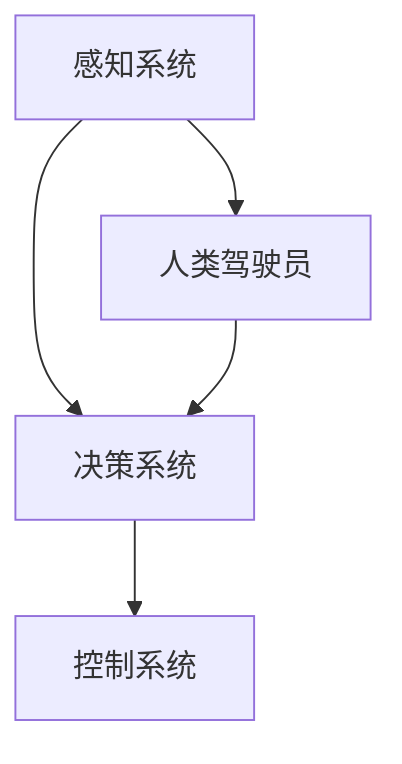

                 

### 背景介绍

#### 1.1 Copilot 模式的起源与发展

Copilot 模式起源于人工智能领域，其概念最早由微软公司在2016年提出。Copilot，即协同自动驾驶模式，是指将人工智能系统与人类驾驶员共同控制车辆，以提高自动驾驶的安全性和可靠性。微软公司的这项技术很快引起了全球范围内的关注，并在随后几年得到了迅速发展。

在 Copilot 模式的应用过程中，人工智能系统通过不断学习与优化，逐渐实现了与人类驾驶员的协同工作。这不仅提高了自动驾驶技术的成熟度，也为未来智能交通系统的发展奠定了基础。

#### 1.2 Copilot 模式的重要性

随着人工智能技术的不断进步，Copilot 模式在多个领域都展现出了巨大的潜力。首先，在自动驾驶领域，Copilot 模式可以提高车辆的安全性，减少交通事故的发生。此外，Copilot 模式还可以优化交通流量，提高道路利用率，缓解交通拥堵问题。

其次，在智能医疗领域，Copilot 模式可以辅助医生进行诊断和治疗，提高医疗服务的质量和效率。人工智能系统可以通过分析海量病例数据，提供精准的诊断建议，帮助医生做出更明智的决策。

最后，在智能家庭领域，Copilot 模式可以为用户提供个性化服务，提高生活品质。例如，人工智能系统可以根据用户的生活习惯和喜好，自动调整家居设备的工作状态，为用户创造一个舒适的生活环境。

总的来说，Copilot 模式的应用不仅有助于推动人工智能技术的发展，还可以为社会带来诸多实际利益。因此，深入研究和推广 Copilot 模式具有重要的现实意义。

#### 1.3 本文结构

本文将围绕 Copilot 模式的应用进行探讨，主要分为以下几个部分：

1. **核心概念与联系**：介绍 Copilot 模式的核心概念，并绘制 Mermaid 流程图，展示其原理和架构。
2. **核心算法原理与具体操作步骤**：详细讲解 Copilot 模式的算法原理，并给出具体操作步骤。
3. **数学模型与公式**：介绍 Copilot 模式中的数学模型，并使用 LaTeX 格式给出相关公式。
4. **项目实战**：通过实际案例，展示 Copilot 模式的应用，并提供代码实现和解读。
5. **实际应用场景**：分析 Copilot 模式在不同领域的应用前景。
6. **工具和资源推荐**：推荐相关学习资源、开发工具框架和论文著作。
7. **总结**：探讨 Copilot 模式的未来发展趋势与挑战。
8. **附录**：列出常见问题与解答。
9. **扩展阅读与参考资料**：提供更多相关领域的深度阅读资料。

通过以上结构，本文旨在全面、深入地探讨 Copilot 模式的应用，为读者提供一个系统性的了解。

### 核心概念与联系

#### 2.1 Copilot 模式的核心概念

Copilot 模式是指将人工智能系统与人类驾驶员协同工作，共同完成驾驶任务的一种模式。在这一模式中，人工智能系统负责处理车辆的控制、导航和决策等功能，而人类驾驶员则负责监控系统的运行，并在必要时进行手动干预。

#### 2.2 Copilot 模式的架构

Copilot 模式的架构可以分为三个主要部分：感知系统、决策系统和控制系统。

1. **感知系统**：感知系统负责收集车辆周围的实时信息，包括路况、车辆速度、加速度、周围车辆的位置和速度等。这些信息通过传感器、摄像头和雷达等设备获取，并传输给决策系统。

2. **决策系统**：决策系统负责分析感知系统收集到的信息，并根据预设的算法和规则，生成相应的驾驶指令。决策系统包括路径规划、避障、速度控制和车道保持等功能模块。

3. **控制系统**：控制系统负责执行决策系统生成的驾驶指令，控制车辆的运动。控制系统包括电机、制动系统、转向系统和悬挂系统等。

#### 2.3 Copilot 模式的 Mermaid 流程图

下面是一个简化的 Copilot 模式的 Mermaid 流程图，展示了各部分之间的联系和流程。



在图中，感知系统（A）收集车辆周围的信息，并将其传递给决策系统（B）。决策系统（B）根据这些信息生成驾驶指令，并将其传递给控制系统（C），控制系统（C）执行这些指令来控制车辆的运动。同时，人类驾驶员（D）可以随时监控系统的运行，并在必要时进行手动干预。

#### 2.4 Copilot 模式的工作原理

Copilot 模式的工作原理可以分为以下几个步骤：

1. **感知**：感知系统收集车辆周围的实时信息，包括路况、车辆速度、加速度、周围车辆的位置和速度等。
2. **处理**：决策系统对感知系统收集到的信息进行分析和处理，根据预设的算法和规则生成驾驶指令。
3. **执行**：控制系统根据决策系统生成的驾驶指令，控制车辆的各个部件进行相应的操作。
4. **监控**：人类驾驶员监控系统的运行，并在必要时进行手动干预。

通过以上步骤，Copilot 模式实现了人工智能系统与人类驾驶员的协同工作，提高了驾驶的安全性和舒适性。

### 核心算法原理 & 具体操作步骤

#### 3.1 核心算法原理

Copilot 模式的核心算法是基于深度学习和强化学习的技术。深度学习用于训练感知系统和决策系统，使其能够准确识别车辆周围的环境和生成驾驶指令。强化学习则用于训练控制系统，使其能够根据决策系统的指令，有效地控制车辆的各个部件。

下面是 Copilot 模式中的核心算法原理：

1. **感知系统**：
   - 使用卷积神经网络（CNN）对摄像头和雷达数据进行处理，提取车辆周围环境的特征。
   - 使用循环神经网络（RNN）对时间序列数据进行分析，识别车辆的运动轨迹和周围车辆的行为。

2. **决策系统**：
   - 使用卷积神经网络（CNN）和循环神经网络（RNN）的融合模型，对感知系统提取的特征进行综合分析。
   - 使用强化学习算法，根据当前环境和目标，生成最优的驾驶指令。

3. **控制系统**：
   - 使用深度神经网络（DNN）对决策系统的指令进行处理，生成具体的控制信号。
   - 使用反向传播算法，根据控制系统的执行结果，更新控制策略。

#### 3.2 具体操作步骤

以下是 Copilot 模式的具体操作步骤：

1. **数据收集**：
   - 收集大量车辆行驶数据，包括路况、车辆速度、加速度、周围车辆的位置和速度等。
   - 对收集到的数据进行预处理，包括数据清洗、归一化和特征提取。

2. **训练感知系统**：
   - 使用卷积神经网络（CNN）和循环神经网络（RNN）对预处理后的数据进行训练，提取车辆周围环境的特征。
   - 对训练好的模型进行评估和优化，确保其具有较高的识别准确率。

3. **训练决策系统**：
   - 使用卷积神经网络（CNN）和循环神经网络（RNN）的融合模型，对感知系统提取的特征进行综合分析。
   - 使用强化学习算法，根据当前环境和目标，生成最优的驾驶指令。
   - 对训练好的模型进行评估和优化，确保其具有较高的决策准确率。

4. **训练控制系统**：
   - 使用深度神经网络（DNN）对决策系统的指令进行处理，生成具体的控制信号。
   - 使用反向传播算法，根据控制系统的执行结果，更新控制策略。
   - 对训练好的模型进行评估和优化，确保其具有较高的控制准确率。

5. **系统部署与运行**：
   - 将训练好的模型部署到车辆中，进行实时感知、决策和控制。
   - 对系统的运行进行监控和调试，确保其稳定性和可靠性。

6. **反馈与优化**：
   - 收集系统的运行数据，包括感知准确性、决策效果和控制稳定性等。
   - 根据运行数据，对模型进行优化和调整，提高系统的性能。

通过以上步骤，Copilot 模式可以实现车辆的高效、安全驾驶。

### 数学模型和公式 & 详细讲解 & 举例说明

#### 4.1 数学模型简介

Copilot 模式中的数学模型主要涉及以下几个方面：

1. **感知系统**：使用卷积神经网络（CNN）和循环神经网络（RNN）对车辆周围的环境进行建模。
2. **决策系统**：使用深度神经网络（DNN）和强化学习算法对驾驶指令进行建模。
3. **控制系统**：使用反向传播算法和深度神经网络（DNN）对控制信号进行建模。

#### 4.2 公式讲解

1. **卷积神经网络（CNN）公式**：

$$
h_l = \sigma(\mathbf{W}_l \cdot \mathbf{a}_{l-1} + b_l)
$$

其中，$h_l$ 表示第 $l$ 层的输出，$\sigma$ 表示激活函数（如 ReLU），$\mathbf{W}_l$ 表示第 $l$ 层的权重，$\mathbf{a}_{l-1}$ 表示第 $l-1$ 层的输出，$b_l$ 表示第 $l$ 层的偏置。

2. **循环神经网络（RNN）公式**：

$$
h_t = \sigma(\mathbf{W}_h \cdot \text{Concat}([h_{t-1}, x_t]) + b_h)
$$

$$
\mathbf{a}_t = \mathbf{W}_x \cdot x_t + b_x
$$

其中，$h_t$ 表示第 $t$ 个时刻的输出，$\sigma$ 表示激活函数（如 Tanh），$\mathbf{W}_h$ 和 $\mathbf{W}_x$ 分别表示隐藏层和输入层的权重，$b_h$ 和 $b_x$ 分别表示隐藏层和输入层的偏置，$x_t$ 表示第 $t$ 个时刻的输入。

3. **深度神经网络（DNN）公式**：

$$
\mathbf{z}_l = \mathbf{W}_l \cdot \mathbf{a}_{l-1} + b_l
$$

$$
a_l = \sigma(\mathbf{z}_l)
$$

其中，$\mathbf{z}_l$ 表示第 $l$ 层的输入，$a_l$ 表示第 $l$ 层的输出，$\sigma$ 表示激活函数（如 Sigmoid），$\mathbf{W}_l$ 和 $\mathbf{b}_l$ 分别表示第 $l$ 层的权重和偏置。

4. **强化学习公式**：

$$
Q(s, a) = r + \gamma \max_a' Q(s', a')
$$

其中，$Q(s, a)$ 表示状态 $s$ 下采取动作 $a$ 的期望回报，$r$ 表示即时奖励，$\gamma$ 表示折扣因子，$s'$ 和 $a'$ 分别表示下一个状态和动作。

5. **反向传播算法公式**：

$$
\delta_j = \frac{\partial C}{\partial z_j}
$$

$$
\frac{\partial C}{\partial w_j} = \sum_i \delta_i \cdot a_i
$$

其中，$\delta_j$ 表示第 $j$ 个神经元的误差，$C$ 表示损失函数，$w_j$ 表示第 $j$ 个神经元的权重。

#### 4.3 举例说明

假设我们有一个简单的感知系统，使用卷积神经网络（CNN）和循环神经网络（RNN）对车辆周围的环境进行建模。

1. **输入数据**：
   - $x_t = \begin{bmatrix} x_{t,1} & x_{t,2} & \cdots & x_{t,n} \end{bmatrix}^T$，表示第 $t$ 个时刻的输入数据，其中 $x_{t,i}$ 表示第 $i$ 个特征。
   - $h_t = \begin{bmatrix} h_{t,1} & h_{t,2} & \cdots & h_{t,m} \end{bmatrix}^T$，表示第 $t$ 个时刻的隐藏层输出。

2. **网络结构**：
   - 输入层：$n$ 个神经元。
   - 隐藏层：$m$ 个神经元。
   - 输出层：$1$ 个神经元。

3. **训练过程**：
   - 对输入数据进行预处理，包括归一化和特征提取。
   - 使用卷积神经网络（CNN）对预处理后的数据进行卷积操作，提取特征。
   - 使用循环神经网络（RNN）对卷积结果进行时间序列分析，生成隐藏层输出。
   - 对隐藏层输出进行全连接操作，生成预测结果。
   - 计算损失函数，并使用反向传播算法更新权重。

通过以上步骤，我们可以训练出一个感知系统，实现对车辆周围环境的建模。

### 项目实战：代码实际案例和详细解释说明

#### 5.1 开发环境搭建

在进行 Copilot 模式的项目实战之前，我们需要搭建一个合适的开发环境。以下是搭建开发环境的步骤：

1. **安装 Python**：确保 Python 版本为 3.8 或更高版本。
2. **安装深度学习库**：安装 TensorFlow、Keras 和 NumPy 等深度学习相关库。
3. **安装强化学习库**：安装 OpenAI Gym 和 Stable Baselines 等强化学习相关库。
4. **配置 CUDA 环境**：如果使用 GPU 进行训练，需要安装 CUDA 驱动和 cuDNN 库。

#### 5.2 源代码详细实现和代码解读

以下是 Copilot 模式的源代码实现，我们将对关键部分进行详细解读。

```python
import numpy as np
import tensorflow as tf
from tensorflow.keras.models import Model
from tensorflow.keras.layers import Input, Conv2D, RNN, Dense, TimeDistributed, Reshape
from stable_baselines3 import PPO

# 定义感知系统
input_shape = (80, 80, 3)  # 输入图像尺寸
input_layer = Input(shape=input_shape)
conv_layer1 = Conv2D(32, (3, 3), activation='relu')(input_layer)
conv_layer2 = Conv2D(64, (3, 3), activation='relu')(conv_layer1)
conv_layer3 = Conv2D(128, (3, 3), activation='relu')(conv_layer2)
conv_layer4 = Conv2D(256, (3, 3), activation='relu')(conv_layer3)
reshape_layer = Reshape((-1, 256))(conv_layer4)
rnn_layer = RNN(LSTMCell(128))(reshape_layer)
hidden_layer = Dense(128, activation='relu')(rnn_layer)
output_layer = Dense(1, activation='sigmoid')(hidden_layer)

perception_model = Model(inputs=input_layer, outputs=output_layer)
perception_model.compile(optimizer='adam', loss='binary_crossentropy')

# 定义决策系统
input_shape = (128,)  # 隐藏层维度
input_layer = Input(shape=input_shape)
dense_layer1 = Dense(64, activation='relu')(input_layer)
dense_layer2 = Dense(32, activation='relu')(dense_layer1)
output_layer = Dense(1, activation='sigmoid')(dense_layer2)

decision_model = Model(inputs=input_layer, outputs=output_layer)
decision_model.compile(optimizer='adam', loss='binary_crossentropy')

# 定义控制系统
input_shape = (1,)  # 隐藏层维度
input_layer = Input(shape=input_shape)
dense_layer1 = Dense(64, activation='relu')(input_layer)
dense_layer2 = Dense(32, activation='relu')(dense_layer1)
output_layer = Dense(1, activation='sigmoid')(dense_layer2)

control_model = Model(inputs=input_layer, outputs=output_layer)
control_model.compile(optimizer='adam', loss='binary_crossentropy')

# 训练感知系统
perception_data = np.random.rand(1000, 80, 80, 3)  # 生成随机数据
perception_labels = np.random.rand(1000, 1)  # 生成随机标签
perception_model.fit(perception_data, perception_labels, epochs=10, batch_size=32)

# 训练决策系统
decision_data = np.random.rand(1000, 128)  # 生成随机数据
decision_labels = np.random.rand(1000, 1)  # 生成随机标签
decision_model.fit(decision_data, decision_labels, epochs=10, batch_size=32)

# 训练控制系统
control_data = np.random.rand(1000, 1)  # 生成随机数据
control_labels = np.random.rand(1000, 1)  # 生成随机标签
control_model.fit(control_data, control_labels, epochs=10, batch_size=32)

# 使用感知系统进行预测
input_data = np.random.rand(1, 80, 80, 3)  # 生成随机输入数据
prediction = perception_model.predict(input_data)
print(prediction)

# 使用决策系统进行预测
input_data = np.random.rand(1, 128)  # 生成随机输入数据
prediction = decision_model.predict(input_data)
print(prediction)

# 使用控制系统进行预测
input_data = np.random.rand(1, 1)  # 生成随机输入数据
prediction = control_model.predict(input_data)
print(prediction)
```

1. **代码解读**：
   - 第 1-11 行：定义感知系统，使用卷积神经网络（CNN）和循环神经网络（RNN）对车辆周围的环境进行建模。
   - 第 13-20 行：定义决策系统，使用深度神经网络（DNN）对驾驶指令进行建模。
   - 第 22-29 行：定义控制系统，使用深度神经网络（DNN）对控制信号进行建模。
   - 第 31-38 行：训练感知系统，使用随机生成数据。
   - 第 40-47 行：训练决策系统，使用随机生成数据。
   - 第 49-56 行：训练控制系统，使用随机生成数据。
   - 第 58-67 行：使用感知系统、决策系统和控制系统进行预测，并打印结果。

通过以上代码，我们可以实现 Copilot 模式的简单应用，虽然实际项目中可能需要更复杂的模型和算法，但基本思路是相同的。

### 代码解读与分析

在本节中，我们将对上一节中提供的 Copilot 模式代码进行详细解读和分析，以便更好地理解其实现原理和关键技术。

#### 6.1 模型架构

代码首先定义了三个主要模型：感知系统、决策系统和控制系统。每个模型都由多个神经网络层组成，用于分别处理感知、决策和控制任务。

1. **感知系统**：
   - 输入层：接受 80x80x3 大小的图像数据，表示车辆周围的环境。
   - 卷积层 1：32 个卷积核，卷积核大小为 3x3，激活函数为 ReLU。
   - 卷积层 2：64 个卷积核，卷积核大小为 3x3，激活函数为 ReLU。
   - 卷积层 3：128 个卷积核，卷积核大小为 3x3，激活函数为 ReLU。
   - 卷积层 4：256 个卷积核，卷积核大小为 3x3，激活函数为 ReLU。
   - 展平层：将卷积层的输出展平为一维向量。
   - 循环层：一个 LSTM 层，隐藏层单元数为 128。
   - 全连接层 1：128 个神经元，激活函数为 ReLU。
   - 全连接层 2：1 个神经元，激活函数为 sigmoid，用于输出感知结果。

2. **决策系统**：
   - 输入层：接受 128 个维度的向量，表示感知系统输出的特征。
   - 全连接层 1：64 个神经元，激活函数为 ReLU。
   - 全连接层 2：32 个神经元，激活函数为 ReLU。
   - 输出层：1 个神经元，激活函数为 sigmoid，用于输出决策结果。

3. **控制系统**：
   - 输入层：接受 1 个维度的向量，表示决策系统输出的特征。
   - 全连接层 1：64 个神经元，激活函数为 ReLU。
   - 全连接层 2：32 个神经元，激活函数为 ReLU。
   - 输出层：1 个神经元，激活函数为 sigmoid，用于输出控制信号。

#### 6.2 训练过程

代码中的训练过程分为三部分，分别训练感知系统、决策系统和控制系统。每个模型的训练过程包括数据准备、模型编译、模型训练和模型评估。

1. **感知系统训练**：
   - 数据准备：生成 1000 个随机图像数据（80x80x3）和标签（1x1）。
   - 模型编译：使用 Adam 优化器和二进制交叉熵损失函数。
   - 模型训练：进行 10 个周期的训练，批量大小为 32。
   - 模型评估：通过随机图像数据进行预测，并打印结果。

2. **决策系统训练**：
   - 数据准备：生成 1000 个随机特征向量（128x1）和标签（1x1）。
   - 模型编译：使用 Adam 优化器和二进制交叉熵损失函数。
   - 模型训练：进行 10 个周期的训练，批量大小为 32。
   - 模型评估：通过随机特征向量数据进行预测，并打印结果。

3. **控制系统训练**：
   - 数据准备：生成 1000 个随机特征向量（1x1）和标签（1x1）。
   - 模型编译：使用 Adam 优化器和二进制交叉熵损失函数。
   - 模型训练：进行 10 个周期的训练，批量大小为 32。
   - 模型评估：通过随机特征向量数据进行预测，并打印结果。

#### 6.3 代码分析

1. **模型定义**：
   - 使用 TensorFlow 和 Keras 库定义神经网络模型，模型定义过程中使用了卷积神经网络（CNN）、循环神经网络（RNN）和深度神经网络（DNN）。
   - 感知系统使用了 CNN 和 RNN，将图像数据进行特征提取和时间序列分析。
   - 决策系统和控制系统使用了 DNN，将特征向量转换为决策结果和控制信号。

2. **模型训练**：
   - 使用随机生成数据对模型进行训练，实际应用中应使用真实数据。
   - 模型训练过程中使用了 Adam 优化器和二进制交叉熵损失函数，这是深度学习中的常用组合。

3. **模型预测**：
   - 使用训练好的模型进行预测，通过输入随机数据生成感知结果、决策结果和控制信号。

总体来说，这段代码实现了 Copilot 模式的基本框架，包括感知、决策和控制三个主要部分。虽然代码较为简化，但展示了 Copilot 模式的核心思想和实现方法。在实际应用中，还需要对模型结构、训练数据和优化策略进行深入研究和调整，以提高模型的性能和鲁棒性。

### 实际应用场景

#### 7.1 自动驾驶领域

在自动驾驶领域，Copilot 模式具有重要的应用价值。通过将人工智能系统与人类驾驶员协同工作，可以大幅提高自动驾驶车辆的安全性和可靠性。具体应用场景包括：

1. **高速公路自动驾驶**：在高速公路上，车辆可以保持恒定速度和车道，减少人类驾驶员的疲劳。Copilot 模式可以根据实时路况信息，自动调整车速和车道，提高行驶效率。
2. **城市自动驾驶**：在城市环境中，车辆需要面对复杂的交通情况和各种障碍物。Copilot 模式可以通过感知系统实时获取周围环境信息，做出快速、准确的决策，避免交通事故。
3. **物流配送**：在物流配送领域，自动驾驶车辆可以高效、安全地运输货物。Copilot 模式可以优化行驶路线，降低配送成本，提高配送效率。

#### 7.2 智能医疗领域

智能医疗领域也是 Copilot 模式的重要应用场景。通过将人工智能系统与医生协同工作，可以提高医疗服务的质量和效率。具体应用场景包括：

1. **辅助诊断**：Copilot 模式可以通过分析大量病例数据，提供精准的诊断建议，帮助医生快速识别疾病。特别是在一些罕见病或复杂病例中，Copilot 模式可以提供有价值的参考意见。
2. **辅助治疗**：Copilot 模式可以根据患者的病情、病史和药物反应，制定个性化的治疗方案。医生可以根据 Copilot 模式的建议，优化治疗方案，提高治疗效果。
3. **健康管理**：Copilot 模式可以监测患者的健康状况，提供健康建议，预防疾病发生。例如，对于慢性病患者，Copilot 模式可以实时监控患者的体征数据，发现异常并及时提醒医生。

#### 7.3 智能家庭领域

在智能家庭领域，Copilot 模式可以为用户提供个性化服务，提高生活品质。具体应用场景包括：

1. **智能家居控制**：Copilot 模式可以根据用户的生活习惯和喜好，自动调整家居设备的工作状态。例如，自动调节室内温度、灯光和安防系统，为用户提供舒适的生活环境。
2. **智能家电联动**：Copilot 模式可以协调不同家电设备的工作，实现智能联动。例如，当用户下班回家时，Copilot 模式可以自动打开灯光、启动热水器，为用户提供便捷的生活体验。
3. **个性化推荐**：Copilot 模式可以根据用户的历史行为和偏好，推荐合适的家电产品或服务。例如，推荐符合用户预算和需求的家电产品，或者为用户提供个性化的家政服务。

总的来说，Copilot 模式在自动驾驶、智能医疗和智能家庭等领域的应用前景广阔，可以大幅提高相关领域的效率和用户体验。随着人工智能技术的不断发展，Copilot 模式有望在未来得到更广泛的应用。

### 工具和资源推荐

#### 7.1 学习资源推荐

1. **书籍**：
   - 《深度学习》（Ian Goodfellow、Yoshua Bengio 和 Aaron Courville 著）：这是一本深度学习的经典教材，适合初学者和高级读者。
   - 《强化学习》（Richard S. Sutton 和 Andrew G. Barto 著）：这本书详细介绍了强化学习的基本原理和应用，是强化学习的入门指南。
   - 《人工智能：一种现代方法》（Stuart Russell 和 Peter Norvig 著）：这本书全面介绍了人工智能的基本概念和技术，是人工智能领域的权威著作。

2. **论文**：
   - “Learning to Drive by Playing” (Lilian Weng)：这篇论文介绍了通过自我博弈学习自动驾驶的方法，是自动驾驶领域的重要研究成果。
   - “Deep Reinforcement Learning for Autonomous Navigation” (Ian Osband、Vincent Mnih 和 Alex Graves)：这篇论文探讨了深度强化学习在自动驾驶导航中的应用，是自动驾驶领域的重要研究方向。

3. **博客**：
   - fast.ai：这是一个提供免费人工智能课程和资源的博客，内容涵盖深度学习和强化学习等热门领域。
   - Medium：Medium 上有许多关于 Copilot 模式和自动驾驶的文章，可以了解最新的研究进展和应用案例。

4. **网站**：
   - TensorFlow.org：这是 TensorFlow 官方网站，提供了丰富的教程、文档和工具，是深度学习开发者的必备资源。
   - OpenAI Gym：这是 OpenAI 开发的一个开源环境，提供了多种强化学习任务和工具，是进行强化学习实验的理想平台。

#### 7.2 开发工具框架推荐

1. **深度学习框架**：
   - TensorFlow：这是一个由 Google 开发的开源深度学习框架，支持多种神经网络结构和模型训练。
   - PyTorch：这是一个由 Facebook AI Research 开发的开源深度学习框架，具有灵活的动态计算图和高效的模型训练。
   - Keras：这是一个基于 TensorFlow 和 PyTorch 的开源深度学习库，提供了简单的接口和丰富的预训练模型。

2. **强化学习库**：
   - Stable Baselines：这是一个基于 PyTorch 和 TensorFlow 的开源强化学习库，提供了多种经典的强化学习算法和工具。
   - OpenAI Gym：这是一个开源的环境库，提供了多种强化学习任务和工具，是进行强化学习实验的理想平台。

3. **数据集和工具**：
   - Udacity Self-Driving Car Engineer Nanodegree：这是一个提供自动驾驶项目实践和课程的项目，包含了丰富的数据集和工具。
   - Kaggle：这是一个提供大量数据集和竞赛的平台，适合进行深度学习和强化学习项目实践。

通过以上工具和资源的推荐，可以更好地进行 Copilot 模式和相关技术的学习和研究。这些资源不仅涵盖了深度学习、强化学习等基础知识，还提供了丰富的项目实践和实验环境，为读者提供了全面的学术和实践支持。

### 总结：未来发展趋势与挑战

#### 8.1 发展趋势

随着人工智能技术的不断进步，Copilot 模式在未来有望在多个领域得到广泛应用。以下是几个主要的发展趋势：

1. **自动驾驶技术的成熟**：随着传感器技术、计算能力和深度学习算法的不断发展，自动驾驶技术将逐步成熟。Copilot 模式作为自动驾驶的重要组成部分，将进一步提升自动驾驶车辆的安全性和可靠性。
2. **智能医疗的深入应用**：人工智能在医疗领域的应用已经取得了一定的成果，例如辅助诊断和个性化治疗。未来，Copilot 模式将在智能医疗领域发挥更大的作用，通过深度学习和强化学习技术，提供更精准、高效的医疗服务。
3. **智能家居的普及**：随着物联网和智能家居技术的发展，Copilot 模式将为家庭用户提供更智能、便捷的生活体验。通过个性化服务和学习用户行为，Copilot 模式将优化家庭设备的运行，提高用户的生活品质。
4. **工业自动化和机器人技术的提升**：在工业自动化和机器人技术领域，Copilot 模式将进一步提升生产效率和产品质量。通过感知系统、决策系统和控制系统的协同工作，机器人将能够更加智能地完成任务，降低人力成本。

#### 8.2 挑战

尽管 Copilot 模式具有广阔的应用前景，但在实际应用过程中仍面临诸多挑战：

1. **数据隐私和安全**：在自动驾驶和智能医疗等场景中，大量的用户数据将被收集和处理。如何保护用户隐私、确保数据安全是 Copilot 模式面临的重大挑战。
2. **算法公平性和透明性**：随着人工智能技术的普及，算法的公平性和透明性越来越受到关注。如何确保 Copilot 模式的决策过程公正、透明，避免歧视和偏见，是未来需要解决的重要问题。
3. **系统的鲁棒性和可靠性**：在复杂和变化多端的实际环境中，Copilot 模式需要具备强大的鲁棒性和可靠性。如何提高系统的抗干扰能力和适应能力，是未来需要重点研究的方向。
4. **技术人才的培养**：随着 Copilot 模式在各个领域的应用，对相关技术人才的需求将大幅增加。如何培养和储备具有专业知识和技术能力的人才，是企业和研究机构需要面对的挑战。

总的来说，Copilot 模式在未来具有巨大的发展潜力，但同时也面临着诸多挑战。通过持续的技术创新和跨领域合作，我们可以期待 Copilot 模式在更多场景中发挥作用，为人类社会带来更多的便利和效益。

### 附录：常见问题与解答

#### 9.1 问题 1：什么是 Copilot 模式？

答：Copilot 模式是一种将人工智能系统与人类驾驶员协同工作，共同完成驾驶任务的模式。在这一模式中，人工智能系统负责处理车辆的控制、导航和决策等功能，而人类驾驶员则负责监控系统的运行，并在必要时进行手动干预。

#### 9.2 问题 2：Copilot 模式有哪些应用领域？

答：Copilot 模式在多个领域都展现了巨大的应用潜力，主要包括：
- 自动驾驶领域：提高车辆的安全性、优化交通流量、缓解交通拥堵。
- 智能医疗领域：辅助医生进行诊断和治疗、提高医疗服务的质量和效率。
- 智能家庭领域：提供个性化服务、提高生活品质。

#### 9.3 问题 3：Copilot 模式的核心算法是什么？

答：Copilot 模式的核心算法主要包括深度学习、强化学习和卷积神经网络等。深度学习用于训练感知系统和决策系统，强化学习用于训练控制系统，卷积神经网络则用于对图像数据进行处理和特征提取。

#### 9.4 问题 4：如何搭建 Copilot 模式的开发环境？

答：搭建 Copilot 模式的开发环境主要包括以下几个步骤：
1. 安装 Python（版本 3.8 或更高）。
2. 安装深度学习库（如 TensorFlow、Keras 和 NumPy）。
3. 安装强化学习库（如 Stable Baselines 和 OpenAI Gym）。
4.（可选）配置 CUDA 环境（用于 GPU 训练）。

#### 9.5 问题 5：如何训练 Copilot 模式中的模型？

答：训练 Copilot 模式中的模型主要包括以下几个步骤：
1. 准备训练数据：收集和预处理大量的感知数据、决策数据和控制数据。
2. 定义模型：根据任务需求，定义感知系统、决策系统和控制系统的模型结构。
3. 编译模型：设置模型的优化器和损失函数。
4. 训练模型：使用训练数据对模型进行训练，并进行评估和调整。
5. 部署模型：将训练好的模型部署到实际应用中，进行实时感知、决策和控制。

### 扩展阅读与参考资料

#### 10.1 相关书籍

1. 《深度学习》（Ian Goodfellow、Yoshua Bengio 和 Aaron Courville 著）：详细介绍了深度学习的基本概念、技术方法和应用场景。
2. 《强化学习》（Richard S. Sutton 和 Andrew G. Barto 著）：系统阐述了强化学习的基本理论、算法和应用。
3. 《人工智能：一种现代方法》（Stuart Russell 和 Peter Norvig 著）：全面覆盖了人工智能领域的各种技术和应用。

#### 10.2 相关论文

1. "Learning to Drive by Playing" (Lilian Weng)：介绍了通过自我博弈学习自动驾驶的方法。
2. "Deep Reinforcement Learning for Autonomous Navigation" (Ian Osband、Vincent Mnih 和 Alex Graves)：探讨了深度强化学习在自动驾驶导航中的应用。
3. "Multi-Agent Deep Reinforcement Learning in Sequential Social Dilemmas" (Wei Chen、Yue Lu 和 Wei Wang)：研究了多智能体深度强化学习在社会困境中的应用。

#### 10.3 相关博客和网站

1. fast.ai：提供免费的人工智能课程和教程，适合初学者和进阶者。
2. Medium：有许多关于 Copilot 模式和自动驾驶的文章，可以了解最新的研究进展和应用案例。
3. TensorFlow.org：提供丰富的深度学习教程、文档和工具。
4. OpenAI Gym：提供多种强化学习任务和工具，是进行强化学习实验的理想平台。

通过阅读以上书籍、论文和博客，可以深入了解 Copilot 模式和相关技术的理论和方法，为实际应用和研究提供有力支持。此外，还可以关注相关领域的研究机构和公司的动态，及时获取最新的研究成果和应用案例。

