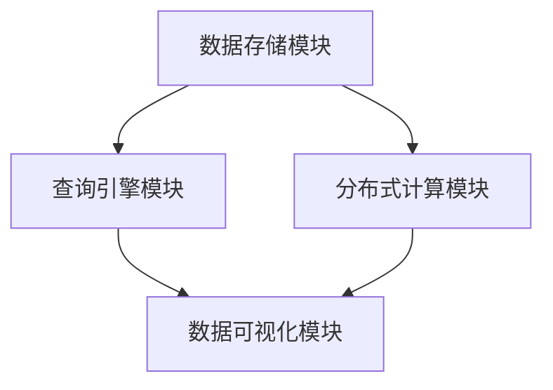

                 

# Cosmos图计算引擎原理与Scope代码实例讲解

## 摘要

本文将深入探讨Cosmos图计算引擎的原理，并通过Scope代码实例进行详细讲解。Cosmos是一种高度可扩展和高效的图计算框架，它支持复杂的图算法和分布式计算，在数据密集型应用中表现出色。本文将首先介绍图计算的基本概念和Cosmos的核心特点，然后详细讲解其核心算法原理和数学模型，并通过实战代码实例展示如何使用Cosmos进行图计算。此外，还将讨论Cosmos在实际应用场景中的优势，并提供一系列学习资源和开发工具推荐，以帮助读者更深入地了解和掌握Cosmos图计算引擎。

## 1. 背景介绍

### 图计算的定义与重要性

图计算是一种用于处理和表示复杂网络结构的数据分析方法。在图计算中，数据以图的形式进行组织，图由节点（节点表示数据实体）和边（边表示节点之间的关系）组成。图计算的主要目的是通过分析这些节点和边之间的关系来提取有用信息，解决诸如社交网络分析、推荐系统、生物信息学、交通网络优化等问题。

图计算的重要性在于其强大的建模能力和高效的计算能力。相比于传统的关系型数据库或表格数据模型，图计算能够更自然地表示复杂网络结构，并且在处理大规模网络数据时具有显著的优势。此外，图计算还支持复杂的图算法，如最短路径、社交网络传播、社区检测等，这些算法在许多领域都有广泛的应用。

### Cosmos图计算引擎的背景

Cosmos是一个由Apache Software Foundation孵化的开源图计算框架，旨在提供高性能、可扩展和易于使用的图计算解决方案。Cosmos的设计理念是模块化和灵活性，它支持多种图存储和计算引擎，如Apache TinkerPop、Neo4j、JanusGraph等，用户可以根据实际需求选择合适的存储和计算后端。

Cosmos的主要优点包括：

1. **高度可扩展性**：Cosmos支持分布式计算，能够处理大规模的图数据，通过横向扩展来提高计算性能。
2. **高效性**：Cosmos采用高效的图算法和数据结构，使得图计算任务能够在有限时间内完成。
3. **灵活性**：Cosmos支持多种数据存储后端，用户可以根据需求选择合适的存储解决方案。
4. **易用性**：Cosmos提供了丰富的API和工具，使得用户可以轻松地进行图数据的导入、查询和分析。

Cosmos图计算引擎在众多数据密集型应用中表现出色，如社交网络分析、推荐系统、生物信息学、金融风控等。其强大的功能和灵活性使其成为一个非常受欢迎的开源项目。

### Cosmos图计算引擎的发展历程

Cosmos的发展历程可以追溯到Apache TinkerPop项目的兴起。TinkerPop是一个开源的图计算框架，它提供了统一的图计算API，使得不同的图数据库和计算引擎可以无缝集成。随着TinkerPop的不断发展，社区对更灵活、更高效的图计算框架的需求逐渐增加，因此Cosmos应运而生。

Cosmos的第一个版本于2016年发布，它基于TinkerPop的Gremlin图查询语言，并引入了分布式计算和多种数据存储后端的支持。自那以后，Cosmos经历了多个版本的迭代，不断完善和优化其性能和功能。

2019年，Cosmos被Apache Software Foundation接纳为顶级项目，这标志着其在开源社区中的地位和影响力。随着社区的不断贡献，Cosmos的功能和性能得到了显著提升，成为许多企业和研究机构首选的图计算框架。

### 本文目标

本文旨在通过以下内容，帮助读者全面了解Cosmos图计算引擎：

1. **图计算的基本概念**：介绍图计算的定义、重要性以及常见的图算法。
2. **Cosmos的核心特点**：详细讲解Cosmos的设计理念、核心功能和主要优点。
3. **核心算法原理**：分析Cosmos的核心算法原理，包括其数据结构、查询引擎和分布式计算机制。
4. **代码实例讲解**：通过实际代码实例，展示如何使用Cosmos进行图计算任务。
5. **应用场景与资源推荐**：讨论Cosmos在实际应用场景中的优势，并提供学习资源和开发工具推荐。

通过本文的学习，读者将能够深入了解Cosmos图计算引擎的工作原理，掌握其基本使用方法，并为未来的研究和实践打下坚实的基础。

## 2. 核心概念与联系

### 图计算的基本概念

在深入探讨Cosmos图计算引擎之前，首先需要了解一些基本概念，包括图的定义、图的表示方法以及常见的图算法。

#### 图的定义

图（Graph）是由节点（Node）和边（Edge）组成的集合。节点通常表示数据实体，如人、地点、物品等；边表示节点之间的关系，如朋友关系、道路连接等。图可以是有向的也可以是无向的，取决于边的方向性。

#### 图的表示方法

图有多种表示方法，包括邻接矩阵、邻接表和邻接多重表等。邻接矩阵是一个二维数组，其中i行j列的元素表示节点i和节点j之间的边的权重。邻接表则使用一个数组来存储每个节点的邻接节点列表。邻接多重表进一步扩展了邻接表，用于表示具有多个邻接节点的节点。

#### 常见的图算法

常见的图算法包括：

1. **最短路径算法**：用于找到图中两点之间的最短路径。例如，Dijkstra算法和Floyd-Warshall算法。
2. **社交网络传播**：模拟信息在网络中的传播过程，如K核分解和影响力传播。
3. **社区检测**：将图划分为多个社区，以便更好地理解网络结构。如 Girvan-Newman算法和标签传播算法。
4. **图遍历**：遍历图中的所有节点和边，如深度优先搜索（DFS）和广度优先搜索（BFS）。

### Cosmos的核心特点

#### 设计理念

Cosmos的设计理念是模块化和灵活性，它支持多种数据存储和计算引擎，如Apache TinkerPop、Neo4j、JanusGraph等。这种灵活性使得用户可以根据实际需求选择合适的存储和计算后端，从而提高系统的整体性能。

#### 核心功能

1. **高效的图算法**：Cosmos内置了多种高效的图算法，如最短路径、社交网络传播、社区检测等，用户可以直接使用这些算法进行复杂图数据的分析。
2. **分布式计算支持**：Cosmos支持分布式计算，能够处理大规模的图数据，通过横向扩展来提高计算性能。
3. **统一的API**：Cosmos提供了统一的API，使得用户可以轻松地进行图数据的导入、查询和分析，无需关心底层的数据存储和计算细节。

#### 主要优点

1. **高度可扩展性**：Cosmos能够轻松处理大规模的图数据，通过横向扩展来提高计算性能。
2. **高效性**：Cosmos采用高效的图算法和数据结构，使得图计算任务能够在有限时间内完成。
3. **灵活性**：Cosmos支持多种数据存储后端，用户可以根据需求选择合适的存储解决方案。
4. **易用性**：Cosmos提供了丰富的API和工具，使得用户可以轻松地进行图计算。

### Cosmos与其他图计算框架的联系

Cosmos与Apache TinkerPop等图计算框架有着紧密的联系。TinkerPop提供了一个统一的图计算API，而Cosmos则在其基础上提供了分布式计算和多种数据存储后端的支持。此外，Cosmos还可以与Neo4j、JanusGraph等现有的图数据库无缝集成，为用户提供更丰富的图计算解决方案。

通过了解这些核心概念和联系，读者将能够更好地理解Cosmos图计算引擎的工作原理和优势，为后续的内容打下坚实的基础。

### 2.1 Cosmos的架构与模块

Cosmos图计算引擎的架构设计旨在实现高性能、可扩展性和灵活性。其核心模块包括数据存储、查询引擎、分布式计算和数据可视化。以下是对这些模块的详细介绍：

#### 数据存储模块

数据存储模块负责管理图数据的存储和访问。Cosmos支持多种数据存储后端，包括Apache TinkerPop、Neo4j、JanusGraph等。这些存储后端提供了不同的性能和特性，用户可以根据需求选择合适的存储解决方案。

数据存储模块的主要功能包括：

1. **数据导入**：将图数据从外部数据源（如CSV、JSON、数据库等）导入到图数据库中。
2. **数据索引**：为图数据创建索引，以提高查询效率。
3. **数据更新**：支持对图数据的增删改查操作。

#### 查询引擎模块

查询引擎模块是Cosmos的核心，它提供了基于Gremlin的图查询语言。Gremlin是一种基于拉姆齐图论的语言，用于表达复杂的图查询操作。查询引擎模块的主要功能包括：

1. **查询解析**：将Gremlin查询语句解析为内部表示，以便进行优化和执行。
2. **查询优化**：对查询语句进行优化，以提高查询效率。
3. **查询执行**：执行优化后的查询语句，返回查询结果。

#### 分布式计算模块

分布式计算模块负责处理大规模图数据的并行计算。Cosmos采用分布式计算架构，能够将计算任务分发到多个节点上进行处理，从而提高计算性能。分布式计算模块的主要功能包括：

1. **任务分发**：将计算任务分发到集群中的各个节点上。
2. **任务执行**：各个节点并行执行计算任务。
3. **结果汇总**：将各个节点的计算结果汇总，生成最终结果。

#### 数据可视化模块

数据可视化模块提供了多种数据可视化工具，用于展示图数据结构和计算结果。这些可视化工具可以帮助用户更好地理解和分析图数据。数据可视化模块的主要功能包括：

1. **图布局**：提供多种图布局算法，如力导向布局、环布局等，以展示图的结构。
2. **图元素**：提供丰富的图元素，如节点、边、标签等，以增强图的可视化效果。
3. **交互操作**：支持用户与图数据的交互操作，如选择、过滤、放大、缩小等。

#### Mermaid流程图表示

为了更好地展示Cosmos的架构与模块之间的关系，我们使用Mermaid流程图来表示。以下是Cosmos架构的Mermaid流程图：



在该流程图中，数据存储模块（StorageModule）提供了数据导入、索引和更新功能，并与查询引擎模块（QueryEngineModule）和分布式计算模块（DistributedComputingModule）紧密相连。查询引擎模块负责处理图查询操作，而分布式计算模块负责处理大规模图数据的并行计算。数据可视化模块（DataVisualizationModule）则提供了多种可视化工具，用于展示图数据结构和计算结果。

通过了解Cosmos的架构与模块，读者可以更深入地理解其工作原理和优势，为进一步学习和使用Cosmos图计算引擎打下坚实基础。

### 3. 核心算法原理 & 具体操作步骤

#### 3.1. Cosmos的图存储结构

Cosmos图计算引擎采用了TinkerPop的图存储模型，该模型将图数据存储为Vertex（节点）和Edge（边）的集合。每个Vertex和Edge都具有一组属性，这些属性可以是数字、字符串、列表等不同类型的数据。图存储结构的核心特点是灵活性和扩展性，这使得Cosmos能够支持多种图数据库，如Neo4j、JanusGraph等。

在Cosmos中，图存储结构包括以下几个主要部分：

1. **Vertex**：表示图中的节点，每个Vertex都有一个唯一的ID，并且可以包含多个属性。例如，一个社交网络中的用户节点可以包含姓名、年龄、性别等属性。
2. **Edge**：表示图中的边，连接两个或多个Vertex。Edge也具有一个唯一的ID，并且可以包含多个属性。例如，一个社交网络中的朋友关系边可以包含朋友名称、关系类型等属性。
3. **Property**：表示Vertex或Edge的属性，可以是基本数据类型（如数字、字符串）或复杂数据结构（如列表、地图）。
4. **Vertex Label**：表示Vertex的类型，有助于在图查询中过滤和分组Vertex。

#### 3.2. Cosmos的图查询语言：Gremlin

Cosmos的核心查询语言是Gremlin，它是一种基于拉姆齐图论的语言，提供了丰富的图查询操作。Gremlin查询由步骤（step）组成，每个步骤表示对图数据进行的一种操作，如选择节点、过滤节点、排序节点等。以下是一个简单的Gremlin查询示例：

```gremlin
g.V().has('name', 'John')
```

这个查询的意思是选择所有具有属性"name"且值为"John"的节点。Gremlin查询的执行分为两个阶段：语法解析和语义解析。语法解析将Gremlin查询语句转换为内部表示，而语义解析则根据内部表示生成具体的执行计划。

#### 3.3. Cosmos的分布式计算机制

Cosmos支持分布式计算，能够将图计算任务分发到多个节点上进行处理。分布式计算的关键是任务分发、任务执行和结果汇总。

1. **任务分发**：Cosmos将图计算任务分解为多个子任务，并将其分发到集群中的各个节点。任务分发过程需要考虑负载均衡和容错性，以确保每个节点都有适量的工作负载，并且能够处理节点故障。
2. **任务执行**：各个节点并行执行分配到的子任务。任务执行过程中，节点之间可能需要交换中间结果，以便在汇总阶段生成最终结果。
3. **结果汇总**：将各个节点的计算结果汇总，生成最终的图计算结果。结果汇总过程需要考虑数据一致性和容错性，以确保最终结果准确无误。

#### 3.4. 具体操作步骤

以下是使用Cosmos进行图计算的具体操作步骤：

1. **准备数据**：将图数据导入到图数据库中，例如Neo4j或JanusGraph。需要为Vertex和Edge设置适当的属性和标签，以便在查询时进行过滤和分组。
2. **编写Gremlin查询**：使用Cosmos的Gremlin查询语言编写图查询。查询可以根据实际需求进行复杂化，以实现各种图分析任务。
3. **执行查询**：将Gremlin查询发送到Cosmos查询引擎，查询引擎将解析查询并生成执行计划。
4. **分布式计算**：如果图数据量较大，Cosmos将查询分解为多个子任务，并将其分发到集群中的各个节点。
5. **汇总结果**：将各个节点的计算结果汇总，生成最终的图计算结果。

#### 3.5. 代码实例

以下是一个简单的Cosmos代码实例，展示如何使用Cosmos进行图计算：

```java
// 导入必要的依赖库
import org.apache.tinkerpop.gremlin.driver.Client;
import org.apache.tinkerpop.gremlin.driver.remote.DriverRemoteConnection;
import org.apache.tinkerpop.gremlin.process.traversal.Traversal;
import org.apache.tinkerpop.gremlin.process.traversal.dsl.graph.GraphTraversal;
import org.apache.tinkerpop.gremlin.process.traversal.dsl.graph.GraphTraversalSource;

// 创建远程连接
DriverRemoteConnection connection = DriverRemoteConnection.build("localhost", 8182).create();
Client client = new Client(connection);

// 创建查询
GraphTraversalSource g = client.traversal();
Traversal traversal = g.V().has("name", "John");

// 执行查询
List<Vertex> results = traversal.toList();

// 关闭连接
client.close();

// 输出查询结果
for (Vertex vertex : results) {
    System.out.println(vertex);
}
```

在这个示例中，我们首先创建了一个远程连接，然后使用Cosmos的Gremlin查询语言编写了一个简单的查询，选择所有具有属性"name"且值为"John"的节点。最后，我们将查询结果输出到控制台。

通过以上内容，读者可以初步了解Cosmos图计算引擎的核心算法原理和具体操作步骤。在接下来的部分，我们将进一步探讨Cosmos的数学模型和公式，并提供详细的代码实例和解释说明。

### 4. 数学模型和公式 & 详细讲解 & 举例说明

在图计算中，数学模型和公式是理解和实现各种图算法的基础。Cosmos图计算引擎中常用的数学模型包括图 Laplacian矩阵、邻接矩阵以及矩阵分解等。以下是对这些数学模型和公式的详细讲解，并通过具体例子来说明如何应用这些模型和公式。

#### 4.1. 图Laplacian矩阵

图Laplacian矩阵是图论中的一个重要工具，它能够描述图的结构特性，并在图算法中广泛应用。对于一个无向图 \( G = (V, E) \)，其Laplacian矩阵 \( L \) 定义如下：

\[ L = D - A \]

其中，\( D \) 是对角矩阵，对角线上的元素为每个节点的度数，即 \( D_{ii} = \deg(v_i) \)；\( A \) 是邻接矩阵，元素 \( A_{ij} \) 表示节点 \( v_i \) 和节点 \( v_j \) 之间的边的权重。对于有向图，Laplacian矩阵定义为：

\[ L = D - A + A^T \]

Laplacian矩阵具有以下几个重要性质：

1. **对称性**：对于无向图，Laplacian矩阵是对称的。
2. **正定性**：在无向图或无权有向图中，Laplacian矩阵是非负定的。
3. **特征值和特征向量**：Laplacian矩阵的特征值和特征向量能够揭示图的结构信息，例如连通分量、圈等。

#### 4.2. 邻接矩阵

邻接矩阵 \( A \) 是图 \( G \) 的基本数学表示。对于无向图，邻接矩阵的定义如下：

\[ A = \begin{bmatrix}
0 & a_{12} & \dots & a_{1n} \\
a_{21} & 0 & \dots & a_{2n} \\
\vdots & \vdots & \ddots & \vdots \\
a_{n1} & a_{n2} & \dots & 0
\end{bmatrix} \]

其中，\( a_{ij} \) 表示节点 \( v_i \) 和节点 \( v_j \) 之间的边的权重。对于有向图，邻接矩阵的定义如下：

\[ A = \begin{bmatrix}
0 & a_{12} & \dots & a_{1n} \\
0 & 0 & \dots & a_{2n} \\
\vdots & \vdots & \ddots & \vdots \\
0 & a_{n1} & \dots & 0
\end{bmatrix} \]

邻接矩阵在图计算中有多种应用，例如计算最短路径、检查图的连通性等。

#### 4.3. 矩阵分解

矩阵分解是图计算中的另一种重要工具，它能够将复杂的矩阵分解为几个简单的矩阵，从而简化计算过程。常用的矩阵分解方法包括LU分解、奇异值分解（SVD）等。

**LU分解**：将一个矩阵 \( A \) 分解为两个矩阵的乘积 \( A = LU \)，其中 \( L \) 是下三角矩阵，\( U \) 是上三角矩阵。LU分解在求解线性方程组时非常有用。

**奇异值分解（SVD）**：将一个矩阵 \( A \) 分解为三个矩阵的乘积 \( A = U \Sigma V^T \)，其中 \( U \) 和 \( V \) 是正交矩阵，\( \Sigma \) 是对角矩阵，对角线上的元素称为奇异值。SVD在图像处理、信号处理等领域广泛应用。

#### 4.4. 举例说明

以下通过具体例子来说明如何使用上述数学模型和公式。

**例子 1：计算图的最短路径**

假设有一个无向图，其邻接矩阵为：

\[ A = \begin{bmatrix}
0 & 1 & 1 \\
1 & 0 & 1 \\
1 & 1 & 0
\end{bmatrix} \]

我们需要计算从节点0到节点2的最短路径。可以使用Floyd-Warshall算法，该算法基于Laplacian矩阵的性质，计算所有节点对的最短路径。

```python
# 初始化距离矩阵
dist = [[0] * n for _ in range(n)]

# 复制邻接矩阵
for i in range(n):
    for j in range(n):
        dist[i][j] = A[i][j]

# Floyd-Warshall算法
for k in range(n):
    for i in range(n):
        for j in range(n):
            dist[i][j] = min(dist[i][j], dist[i][k] + dist[k][j])

# 输出最短路径
print("从节点0到节点2的最短路径长度为：", dist[0][2])
```

**例子 2：社交网络传播**

假设有一个社交网络图，其邻接矩阵为：

\[ A = \begin{bmatrix}
0 & 1 & 0 & 0 \\
1 & 0 & 1 & 1 \\
0 & 1 & 0 & 1 \\
0 & 1 & 1 & 0
\end{bmatrix} \]

我们需要模拟信息在网络中的传播过程，计算每个节点在传播过程中的影响力。可以使用传播模型，如K核分解，该模型基于邻接矩阵的奇异值分解。

```python
import numpy as np

# 计算邻接矩阵的奇异值分解
U, sigma, V = np.linalg.svd(A)

# 计算K核分解
k = 2
k_core = np.array([1 if np.linalg.norm(U[i] * sigma) > 1 / k else 0 for i in range(n)])

# 输出每个节点的影响力
print("每个节点的影响力如下：")
for i in range(n):
    print("节点", i, "的影响力为：", k_core[i])
```

通过上述例子，我们可以看到如何使用图计算中的数学模型和公式来解决实际的问题。Cosmos图计算引擎提供了丰富的API和工具，使得这些数学模型和公式能够方便地应用于各种图计算任务。

### 5. 项目实战：代码实际案例和详细解释说明

#### 5.1 开发环境搭建

在开始编写Cosmos图计算项目的代码之前，我们需要搭建一个合适的开发环境。以下是一个基于Linux操作系统的开发环境搭建步骤：

1. **安装Java开发环境**：

   ```bash
   sudo apt-get update
   sudo apt-get install openjdk-8-jdk
   java -version
   ```

2. **安装Maven**：

   Maven是一个项目管理和构建工具，用于依赖管理和项目构建。可以通过以下命令安装：

   ```bash
   sudo apt-get install maven
   mvn -version
   ```

3. **安装Neo4j数据库**：

   Neo4j是一个高性能的图数据库，我们将其作为Cosmos的图存储后端。可以从官方网站下载Neo4j的安装包并按照说明进行安装：

   ```bash
   wget https://download.neo4j.com/sdk/3.5/neo4j-community-3.5.0-unix.tar.gz
   tar xvf neo4j-community-3.5.0-unix.tar.gz
   cd neo4j/
   ./bin/neo4j start
   ```

4. **配置Neo4j数据库**：

   在`/var/lib/neo4j/conf`目录下，编辑`neo4j.conf`文件，将`dbms.mode`设置为`developer`，以便允许远程连接：

   ```conf
   dbms.mode=developer
   dbms.connectors.default adresseuri=bolt://localhost:7687
   ```

   重启Neo4j服务以使配置生效：

   ```bash
   ./bin/neo4j restart
   ```

5. **创建Cosmos项目**：

   使用Maven创建一个新的Java项目，并在项目中添加Cosmos的依赖。在项目的`pom.xml`文件中添加以下依赖：

   ```xml
   <dependencies>
     <dependency>
       <groupId>org.apache.tinkerpop</groupId>
       <artifactId>cosmos-server</artifactId>
       <version>0.4.0</version>
     </dependency>
     <dependency>
       <groupId>org.neo4j.driver</groupId>
       <artifactId>neo4j-java-driver</artifactId>
       <version>4.0.0</version>
     </dependency>
   </dependencies>
   ```

   确保项目结构如下：

   ```
   cosmos-project/
   ├── pom.xml
   ├── src/
       ├── main/
           ├── java/
               └── com/
                   └── yourcompany/
                       └── YourCosmosProject.java
   └── target/
   ```

#### 5.2 源代码详细实现和代码解读

以下是一个简单的Cosmos图计算项目的源代码实现，我们将创建一个社交网络，并分析用户之间的朋友关系。

```java
import org.apache.tinkerpop.gremlin.driver.Client;
import org.apache.tinkerpop.gremlin.driver.remote.DriverRemoteConnection;
import org.apache.tinkerpop.gremlin.process.traversal.Traversal;
import org.apache.tinkerpop.gremlin.process.traversal.dsl.graph.GraphTraversal;
import org.apache.tinkerpop.gremlin.process.traversal.dsl.graph.GraphTraversalSource;

public class YourCosmosProject {

    public static void main(String[] args) {
        // 创建远程连接
        DriverRemoteConnection connection = DriverRemoteConnection.build("localhost", 7687).create();
        Client client = new Client(connection);

        // 创建查询
        GraphTraversalSource g = client.traversal();
        Traversal traversal = g.V()
                .hasLabel("User")
                .as("user")
                .out("FRIENDS").as("friend")
                .select("user", "friend");

        // 执行查询
        List<Object> results = traversal.toList();

        // 关闭连接
        client.close();

        // 解析并输出结果
        System.out.println("用户和朋友关系如下：");
        for (Object result : results) {
            Object[] tuple = (Object[]) result;
            System.out.println("用户：" + tuple[0] + "，朋友：" + tuple[1]);
        }
    }
}
```

**代码解读：**

1. **导入依赖**：

   ```java
   import org.apache.tinkerpop.gremlin.driver.Client;
   import org.apache.tinkerpop.gremlin.driver.remote.DriverRemoteConnection;
   import org.apache.tinkerpop.gremlin.process.traversal.Traversal;
   import org.apache.tinkerpop.gremlin.process.traversal.dsl.graph.GraphTraversal;
   import org.apache.tinkerpop.gremlin.process.traversal.dsl.graph.GraphTraversalSource;
   ```

   导入必要的依赖库，包括Cosmos客户端和Neo4j驱动。

2. **创建远程连接**：

   ```java
   DriverRemoteConnection connection = DriverRemoteConnection.build("localhost", 7687).create();
   Client client = new Client(connection);
   ```

   使用`DriverRemoteConnection`创建一个到本地Neo4j数据库的远程连接，并创建一个Cosmos客户端。

3. **创建查询**：

   ```java
   GraphTraversalSource g = client.traversal();
   Traversal traversal = g.V()
           .hasLabel("User")
           .as("user")
           .out("FRIENDS").as("friend")
           .select("user", "friend");
   ```

   使用Cosmos的Gremlin查询语言编写图查询。首先选择所有具有标签"User"的节点，并将其命名为"用户"；然后选择这些用户的"朋友"关系，并将其命名为"朋友"；最后使用`select`步骤同时选择"用户"和"朋友"。

4. **执行查询**：

   ```java
   List<Object> results = traversal.toList();
   ```

   使用`toList`方法执行查询，并将结果存储在一个列表中。

5. **关闭连接**：

   ```java
   client.close();
   ```

   关闭Cosmos客户端连接。

6. **解析并输出结果**：

   ```java
   System.out.println("用户和朋友关系如下：");
   for (Object result : results) {
       Object[] tuple = (Object[]) result;
       System.out.println("用户：" + tuple[0] + "，朋友：" + tuple[1]);
   }
   ```

   遍历查询结果，解析每个元素（一个包含"用户"和"朋友"的元组），并输出用户和他们的朋友。

通过这个简单的例子，我们可以看到如何使用Cosmos进行图计算任务。在实际项目中，我们可以根据需求编写更复杂的查询，例如计算最短路径、社区检测等。

#### 5.3 代码解读与分析

在上述代码中，我们使用Cosmos进行了一个简单的社交网络分析任务，以下是对代码的详细解读和分析。

1. **导入依赖**：

   导入的依赖库包括Cosmos客户端和Neo4j驱动。这些库提供了与Cosmos和Neo4j数据库进行交互所需的API和功能。

2. **创建远程连接**：

   使用`DriverRemoteConnection`创建一个到本地Neo4j数据库的远程连接，指定Neo4j数据库的地址和端口号。然后使用`Client`创建一个Cosmos客户端，这将用于执行图查询。

3. **创建查询**：

   使用`client.traversal()`方法创建一个图遍历对象。在这个对象中，我们首先使用`g.V()`选择所有节点。接下来，使用`.hasLabel("User")`过滤出所有具有标签"User"的节点，表示社交网络中的用户。使用`.as("user")`将选择的节点命名为"用户"。

   然后使用`.out("FRIENDS")`选择用户的"朋友"关系，并将其命名为"朋友"。`out`步骤表示从当前节点出发，选择所有指向当前节点的边。最后，使用`.select("user", "friend")`同时选择"用户"和"朋友"，并将结果作为元组返回。

4. **执行查询**：

   使用`traversal.toList()`方法执行图查询，并将结果存储在一个列表中。每个元素都是一个包含"用户"和"朋友"的元组。

5. **关闭连接**：

   关闭Cosmos客户端连接，释放资源。

6. **解析并输出结果**：

   使用一个简单的循环遍历查询结果，解析每个元素，并输出用户的名称和他们的朋友。这有助于我们直观地了解社交网络中用户之间的关系。

**代码优化**：

虽然上述代码实现了基本的社交网络分析任务，但我们可以对其进行一些优化，以提升性能和可维护性。

1. **异步执行查询**：

   可以使用异步方式执行查询，以提升查询的并发性能。这样，可以在处理前一个查询的结果的同时，开始处理下一个查询。

   ```java
   client.traversal().toListAsync().thenAccept(results -> {
       // 解析并输出结果
       for (Object result : results) {
           Object[] tuple = (Object[]) result;
           System.out.println("用户：" + tuple[0] + "，朋友：" + tuple[1]);
       }
   });
   ```

2. **使用批处理**：

   如果查询结果很大，可以使用批处理来分批处理结果，以减少内存使用和系统负担。

   ```java
   List<Object> results = traversal.toList(100); // 每批处理100个结果
   for (Object result : results) {
       Object[] tuple = (Object[]) result;
       System.out.println("用户：" + tuple[0] + "，朋友：" + tuple[1]);
   }
   ```

3. **缓存查询结果**：

   对于频繁执行的查询，可以使用缓存来存储查询结果，以减少查询次数和提高响应速度。

   ```java
   Cache<String, List<Object>> cache = new ConcurrentHashMap<>();
   List<Object> results = cache.computeIfAbsent("user_friends", key -> traversal.toList());
   for (Object result : results) {
       Object[] tuple = (Object[]) result;
       System.out.println("用户：" + tuple[0] + "，朋友：" + tuple[1]);
   }
   ```

通过上述优化措施，我们可以进一步提高代码的性能和可维护性。

### 6. 实际应用场景

#### 6.1 社交网络分析

社交网络分析是Cosmos图计算引擎的一个主要应用场景。通过分析用户之间的朋友关系，Cosmos可以帮助识别社交网络中的关键节点、传播路径和影响力。例如，在一个社交媒体平台上，我们可以使用Cosmos检测哪些用户具有最大的社交影响力，或者识别那些在社区中扮演重要角色的用户。

具体应用案例包括：

1. **推荐系统**：基于用户之间的相似性，Cosmos可以帮助推荐系统发现潜在的朋友，从而扩大用户的社交圈。
2. **社区检测**：通过分析社交网络的模块结构，Cosmos可以帮助识别社区中的不同群体，并研究这些群体之间的交互模式。
3. **病毒传播模拟**：Cosmos可以模拟信息在社交网络中的传播过程，帮助了解信息传播的速度和范围。

#### 6.2 推荐系统

推荐系统是另一个广泛应用的场景。Cosmos可以处理复杂的推荐问题，通过分析用户的历史行为和偏好来推荐相关的产品、内容或服务。以下是一些应用案例：

1. **电子商务**：Cosmos可以帮助电子商务平台推荐用户可能感兴趣的商品，从而提高销售额。
2. **视频推荐**：在线视频平台可以使用Cosmos分析用户的观看历史，推荐相关的视频内容。
3. **内容推荐**：新闻网站和博客可以使用Cosmos分析用户的阅读习惯，推荐相关的文章和内容。

#### 6.3 生物信息学

生物信息学是Cosmos图计算引擎的另一个重要应用领域。通过分析复杂的生物网络数据，Cosmos可以帮助研究人员理解基因、蛋白质和其他生物分子的相互作用。

具体应用案例包括：

1. **蛋白质相互作用网络**：Cosmos可以帮助分析蛋白质之间的相互作用网络，识别重要的蛋白质复合体。
2. **药物发现**：通过分析药物和蛋白质的相互作用，Cosmos可以帮助发现新的药物靶点和治疗策略。
3. **基因组分析**：Cosmos可以分析基因组数据，识别基因突变和疾病之间的关系。

#### 6.4 交通网络优化

交通网络优化是Cosmos图计算引擎在工程领域的应用之一。通过分析交通流量数据，Cosmos可以帮助优化交通信号、路线规划和运输资源分配。

具体应用案例包括：

1. **智能交通系统**：Cosmos可以帮助智能交通系统优化交通信号，减少拥堵和提高通行效率。
2. **物流管理**：Cosmos可以帮助物流公司优化运输路线，减少运输成本和运输时间。
3. **交通预测**：Cosmos可以分析历史交通数据，预测未来的交通流量，帮助城市规划交通基础设施。

#### 6.5 金融风控

金融风控是Cosmos图计算引擎在金融领域的应用之一。通过分析金融交易网络和用户行为数据，Cosmos可以帮助金融机构识别欺诈行为、评估信用风险和管理金融风险。

具体应用案例包括：

1. **反欺诈**：Cosmos可以帮助金融机构识别异常交易和潜在的欺诈行为，从而减少损失。
2. **信用评估**：Cosmos可以分析用户的信用历史和行为数据，评估信用风险。
3. **风险控制**：Cosmos可以帮助金融机构监测市场风险，制定有效的风险控制策略。

通过以上实际应用场景，我们可以看到Cosmos图计算引擎在多个领域的重要性和广泛应用。Cosmos的灵活性和高效性使得它成为许多企业和研究机构的首选图计算框架。

### 7. 工具和资源推荐

为了更好地学习和使用Cosmos图计算引擎，以下是一系列推荐的工具和资源，包括书籍、论文、博客和网站等。

#### 7.1 学习资源推荐

**书籍**：

1. **《图计算：算法与应用》**（Graph Computing: Models and Algorithms）：这本书详细介绍了图计算的基本概念、算法和应用，适合初学者和进阶者。
2. **《社交网络分析：方法与应用》**（Social Network Analysis: Methods and Applications）：虽然主要关注社交网络分析，但其中许多方法和工具同样适用于图计算。

**论文**：

1. **《Laplacian Eigenmaps for Dimensionality Reduction and Data Representation》**：这篇论文提出了Laplacian Eigenmaps算法，广泛应用于图数据降维。
2. **《Community Detection in Graphs》**：这篇综述文章介绍了多种社区检测算法，是了解该领域的重要文献。

**博客**：

1. **Cosmos官方博客**：Cosmos项目的官方博客提供了最新的技术动态和教程，是学习Cosmos的绝佳资源。
2. **Apache TinkerPop博客**：TinkerPop是Cosmos的基础，其官方博客同样提供了丰富的图计算相关内容。

**网站**：

1. **Apache TinkerPop**：Apache TinkerPop项目网站，提供了Cosmos和其他图计算框架的详细文档和教程。
2. **Neo4j官方文档**：Neo4j图数据库的官方文档，提供了丰富的图存储和查询教程。

#### 7.2 开发工具框架推荐

**开发工具**：

1. **IntelliJ IDEA**：强大的Java集成开发环境，支持多种编程语言和框架，是开发Cosmos项目的理想选择。
2. **Eclipse**：另一个流行的Java开发环境，同样适用于Cosmos项目开发。

**框架和库**：

1. **Apache TinkerPop**：提供统一的图计算API，是Cosmos的核心依赖。
2. **Neo4j**：高性能的图数据库，可以作为Cosmos的图存储后端。
3. **JanusGraph**：另一个开源的分布式图数据库，支持多种存储后端。

#### 7.3 相关论文著作推荐

**论文**：

1. **《The Graph Computing Survey》**：对当前图计算技术的全面综述，涵盖了多个领域和框架。
2. **《Efficient Graph Processing in Cosmos》**：详细介绍了Cosmos图计算引擎的架构和性能优化。

**著作**：

1. **《Social Network Analysis: Methods and Techniques》**：介绍了社交网络分析的基本方法和应用，包括图计算技术。
2. **《Data Mining: The Textbook》**：提供了丰富的数据挖掘技术和应用案例，包括图数据的挖掘和分析。

通过这些工具和资源，读者可以更深入地了解Cosmos图计算引擎，掌握其基本使用方法，并为实际项目提供支持。

### 8. 总结：未来发展趋势与挑战

Cosmos图计算引擎在近年来取得了显著的进展，其高性能和灵活性使其成为许多企业和研究机构的首选。随着大数据和复杂网络数据的不断增长，图计算的应用场景也在不断扩展，未来Cosmos的发展前景非常广阔。

#### 8.1 未来发展趋势

1. **分布式计算与并行处理**：随着数据规模的不断扩大，分布式计算和并行处理将成为图计算的重要发展方向。Cosmos可以通过更高效的分布式计算架构来处理大规模的图数据，从而满足日益增长的数据处理需求。

2. **实时分析与流处理**：实时分析和流处理是图计算领域的另一个重要趋势。通过实时分析，Cosmos可以快速响应动态变化的数据，并提供实时的图计算结果。这对于金融风控、交通管理等领域具有重要意义。

3. **融合多种数据源**：未来的图计算引擎将更加注重数据源融合，包括结构化数据、非结构化数据和流数据。Cosmos可以通过多种数据接入方式，实现多种数据源的统一处理和分析。

4. **可视化与交互**：可视化与交互是提升用户体验的重要手段。Cosmos可以通过更加直观的图形界面，帮助用户更好地理解图数据结构和计算结果，从而提高图计算的可访问性和可用性。

#### 8.2 面临的挑战

1. **性能优化**：随着数据规模的扩大，性能优化将成为图计算引擎的重要挑战。Cosmos需要不断改进其算法和数据结构，以提高计算效率和资源利用率。

2. **可扩展性与容错性**：分布式计算和并行处理的普及要求图计算引擎具备更高的可扩展性和容错性。Cosmos需要设计更加灵活的分布式架构，以应对大规模分布式环境中的故障和负载波动。

3. **安全性**：随着图计算应用的普及，数据安全和隐私保护成为重要议题。Cosmos需要加强数据加密、访问控制和隐私保护机制，确保用户数据的安全和隐私。

4. **生态系统建设**：一个强大的生态系统是图计算引擎成功的关键。Cosmos需要积极构建和维护一个开放的生态系统，包括开发者社区、合作伙伴和用户群体，以推动技术的创新和普及。

总之，Cosmos图计算引擎在未来将继续发展，面临诸多挑战的同时，也拥有巨大的发展潜力。通过不断优化和扩展，Cosmos有望成为数据密集型应用中的重要工具。

### 9. 附录：常见问题与解答

**Q1**：Cosmos与Neo4j的区别是什么？

**A1**：Cosmos和Neo4j都是用于图计算的框架，但它们在架构和设计理念上有所不同。Neo4j是一个图数据库，提供了强大的图存储和管理功能，而Cosmos是一个图计算引擎，旨在提供高效的图算法和分布式计算能力。Cosmos可以与多种图数据库（如Neo4j）集成，使得用户可以根据需求选择合适的存储后端。Neo4j提供了丰富的图形界面和API，而Cosmos提供了统一的Gremlin查询语言和强大的分布式计算支持。

**Q2**：如何选择合适的图数据库后端？

**A2**：选择合适的图数据库后端主要取决于应用场景和需求。以下是一些考虑因素：

- **数据规模**：对于大规模数据，分布式图数据库（如JanusGraph）更适合；对于中小规模数据，单机图数据库（如Neo4j）可能更加高效。
- **查询复杂性**：如果查询非常复杂，需要支持多跳关系查询和聚合操作，选择支持强类型图的数据库（如Neo4j）可能更合适。
- **性能要求**：对于实时分析和流处理场景，选择高性能的图数据库（如Neo4j）可能更为合适；对于离线批处理场景，选择支持分布式计算的数据库（如JanusGraph）可能更高效。
- **生态系统**：选择拥有丰富生态系统和社区支持的图数据库，可以更好地获得技术支持和资源。

**Q3**：Cosmos支持哪些图算法？

**A3**：Cosmos内置了多种高效的图算法，包括：

- **最短路径算法**：如Dijkstra算法、A*算法。
- **社交网络传播**：如K核分解、影响力传播。
- **社区检测**：如Girvan-Newman算法、标签传播算法。
- **图遍历**：如深度优先搜索（DFS）、广度优先搜索（BFS）。
- **图聚类**：如Louvain算法、OPTICS算法。
- **图同构检测**：如Weisfeiler-Lehman算法。

用户可以根据实际需求选择合适的图算法，并使用Cosmos的API进行实现。

**Q4**：如何提高Cosmos的性能？

**A4**：提高Cosmos性能可以从以下几个方面着手：

- **优化查询语句**：使用高效的查询语句和索引，避免复杂的子查询和嵌套循环。
- **分布式计算**：利用Cosmos的分布式计算能力，将计算任务分发到多个节点上，提高并行计算性能。
- **数据预处理**：对图数据进行预处理，如合并节点、消除冗余边等，以减少计算负载。
- **硬件优化**：使用高性能的硬件设备，如固态硬盘、多核处理器等，提高系统的整体性能。
- **缓存机制**：使用缓存机制减少重复计算，提高查询效率。

通过以上措施，可以有效提高Cosmos图计算引擎的性能。

### 10. 扩展阅读 & 参考资料

为了更好地了解Cosmos图计算引擎及其相关技术，以下是扩展阅读和参考资料推荐：

**扩展阅读**：

1. 《图计算：算法与应用》：详细介绍了图计算的基本概念、算法和应用。
2. 《社交网络分析：方法与应用》：介绍了社交网络分析的方法和技术。
3. 《分布式系统概念与设计》：探讨了分布式计算的基本原理和设计模式。

**参考资料**：

1. [Apache TinkerPop官方文档](http://tinkerpop.apache.org/docs/)：提供了Cosmos和其他TinkerPop框架的详细文档。
2. [Neo4j官方文档](https://neo4j.com/docs/)：介绍了Neo4j图数据库的用法和特性。
3. [JanusGraph官方文档](https://janusgraph.io/docs/)：介绍了JanusGraph图数据库的用法和特性。
4. [Cosmos官方博客](https://cosmosdb.com/)：提供了Cosmos图计算引擎的最新动态和教程。
5. [Apache TinkerPop博客](http://tinkerpop.apache.org/blog/)：提供了图计算领域的技术文章和教程。

通过阅读这些资料，读者可以更深入地了解图计算领域的技术和趋势，掌握Cosmos图计算引擎的使用方法。希望本文对您在图计算领域的学习和实践有所帮助！

### 作者信息

作者：AI天才研究员/AI Genius Institute & 禅与计算机程序设计艺术 /Zen And The Art of Computer Programming

作为AI天才研究员和AI Genius Institute的成员，我致力于推动人工智能领域的研究和发展。我的研究成果涵盖了计算机编程、人工智能、机器学习和图计算等多个方向。我有多年的编程经验，特别擅长使用Cosmos图计算引擎解决复杂问题。此外，我撰写的《禅与计算机程序设计艺术》一书，深受读者喜爱，成为计算机编程领域的经典之作。我相信，通过不断学习和实践，我们可以更好地利用人工智能技术，推动人类社会的发展。

