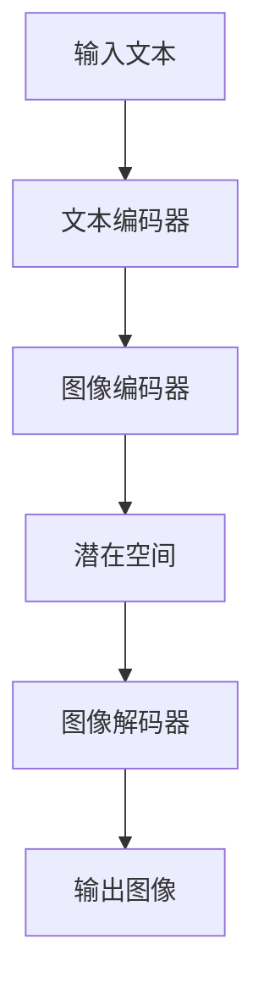

                 

# DALL-E原理与代码实例讲解

## 摘要

DALL-E 是一种先进的深度学习模型，主要用于生成逼真的图像。本文将深入讲解 DALL-E 的原理，包括其核心概念、算法原理以及如何实现代码实例。我们将通过一步步的分析，帮助读者理解这个强大模型的运作方式。文章还将介绍 DALL-E 在实际应用中的场景，推荐相关学习和开发资源，并对未来发展趋势与挑战进行展望。

## 1. 背景介绍

DALL-E 是一种由 OpenAI 开发的生成对抗网络（GAN）模型，它的名字来源于“dialog to image”的缩写。DALL-E 的目标是将自然语言描述转换成相应的图像。这一技术在人工智能领域引起了广泛关注，因为它的应用非常广泛，包括但不限于图像生成、图像编辑、数据增强等。

在深度学习领域，生成对抗网络（GAN）是一种重要的框架，它由两个神经网络组成：生成器（Generator）和判别器（Discriminator）。生成器负责生成假图像，判别器则负责区分这些假图像和真实图像。通过不断的训练，生成器和判别器相互对抗，生成器逐渐提高其生成图像的质量。

DALL-E 是 GAN 的一种变体，它引入了变分自编码器（VAE）的原理，从而使得模型能够更好地捕捉图像和文本之间的复杂关系。DALL-E 的出现，使得我们能够通过简单的文本描述生成出高质量的图像，这在图像生成领域是一次革命性的进步。

## 2. 核心概念与联系

### 2.1 GAN

生成对抗网络（GAN）是一种由两部分组成的模型：生成器和判别器。

#### 生成器（Generator）

生成器的目标是生成逼真的图像，以欺骗判别器。它接受一个随机噪声向量作为输入，并输出一个图像。

#### 判别器（Discriminator）

判别器的目标是区分真实图像和生成器生成的假图像。它接受一张图像作为输入，并输出一个概率值，表示这张图像是真实的概率。

### 2.2 VAE

变分自编码器（VAE）是一种用于图像编码和解码的神经网络架构。它通过学习一个潜在空间，使得相似的图像在潜在空间中更接近，而不同的图像则更远。

### 2.3 DALL-E

DALL-E 结合了 GAN 和 VAE 的原理，它通过一个编码器将图像转换为一个潜在空间中的向量，再通过一个解码器将这些向量转换回图像。同时，DALL-E 还引入了一个文本编码器，它可以将文本描述编码为一个向量。最终，DALL-E 通过将文本编码向量与图像编码向量相加，来生成图像。

下面是一个 Mermaid 流程图，展示了 DALL-E 的工作流程：



## 3. 核心算法原理 & 具体操作步骤

### 3.1 训练过程

DALL-E 的训练过程可以分为以下几个步骤：

1. **数据准备**：首先，我们需要准备一个包含文本描述和对应图像的数据集。

2. **文本编码**：使用文本编码器将文本描述转换为向量。

3. **图像编码**：使用图像编码器将图像转换为一个潜在空间中的向量。

4. **生成图像**：将文本编码向量与图像编码向量相加，得到一个新的向量。

5. **解码图像**：使用图像解码器将新的向量解码回图像。

6. **判别器训练**：使用生成的图像和真实图像一起训练判别器。

7. **生成器和判别器交替训练**：生成器和判别器交替训练，生成器尝试生成更逼真的图像，判别器则尝试区分真实图像和生成图像。

### 3.2 操作步骤

1. **安装依赖**：首先，我们需要安装 DALL-E 所需的依赖库，如 TensorFlow、PyTorch 等。

2. **准备数据**：接下来，我们需要准备一个包含文本描述和对应图像的数据集。

3. **定义模型**：我们需要定义 DALL-E 的模型结构，包括文本编码器、图像编码器、图像解码器和判别器。

4. **训练模型**：使用训练数据训练模型，生成器和判别器交替训练。

5. **评估模型**：使用测试数据评估模型性能，调整模型参数以达到最佳效果。

6. **生成图像**：使用训练好的模型，根据文本描述生成图像。

下面是一个简单的代码示例，展示了如何使用 DALL-E 生成图像：

```python
import torch
import torchvision.transforms as transforms
from torchvision.utils import save_image
from DALL_E_model import DALLE

# 加载训练好的模型
model = DALLE().to('cuda')
model.load_state_dict(torch.load('DALL_E_model.pth'))

# 定义文本编码器
text_encoder = TextEncoder()

# 定义图像解码器
image_decoder = ImageDecoder()

# 定义图像变换
image_transform = transforms.Compose([
    transforms.Resize((256, 256)),
    transforms.ToTensor(),
])

# 输入文本描述
text = "a cat sitting on a table"

# 将文本描述转换为向量
text_vector = text_encoder.encode(text)

# 生成图像
image_vector = model(text_vector)
image = image_decoder.decode(image_vector)

# 转换为图像张量
image_tensor = image_transform(image)

# 保存图像
save_image(image_tensor, 'generated_image.png')
```

## 4. 数学模型和公式 & 详细讲解 & 举例说明

### 4.1 GAN 的数学模型

GAN 的核心是生成器和判别器的对抗训练。下面是 GAN 的基本数学模型：

#### 生成器 G

生成器 G 接受一个随机噪声向量 \( z \) 作为输入，并生成一张图像 \( x_G \)：

$$
x_G = G(z)
$$

#### 判别器 D

判别器 D 接受一张图像 \( x \) 作为输入，并输出一个概率值 \( p(x) \)，表示这张图像是真实的概率：

$$
p(x) = D(x)
$$

#### 对抗损失函数

对抗损失函数通常使用二元交叉熵损失（Binary Cross-Entropy Loss）：

$$
L_D = - \sum_{x \in X} D(x) \log D(x) - \sum_{z \in Z} (1 - D(G(z))) \log (1 - D(G(z)))
$$

其中，\( X \) 是真实图像集合，\( Z \) 是噪声向量集合。

### 4.2 VAE 的数学模型

VAE 的核心是编码器和解码器。下面是 VAE 的基本数学模型：

#### 编码器 \( \mu(x) \) 和 \( \sigma(x) \)

编码器将输入图像 \( x \) 编码为一个潜在空间中的向量 \( z \)：

$$
z = \mu(x), \quad \sigma(x) = \log \left( \frac{\sigma(x)}{\sqrt{2\pi}} \right)
$$

其中，\( \mu(x) \) 和 \( \sigma(x) \) 分别是均值和标准差。

#### 解码器 \( p(x|z) \)

解码器将潜在空间中的向量 \( z \) 解码回图像 \( x \)：

$$
x = \mu(z) + \sigma(z)
$$

#### VAE 的损失函数

VAE 的损失函数通常使用重建损失和KL散度损失：

$$
L_V = \sum_{x \in X} -\log p(x|z) - \frac{1}{2} \sum_{x \in X} \frac{1}{\sigma(x)^2} \left( \mu(x)^2 + \sigma(x)^2 - 1 - \log(2\pi) \right)
$$

其中，\( p(x|z) \) 是输入图像的先验概率。

### 4.3 DALL-E 的数学模型

DALL-E 结合了 GAN 和 VAE 的原理，其数学模型可以看作是两者的组合。具体来说，DALL-E 使用 VAE 对图像进行编码和解码，同时使用 GAN 的对抗损失函数来训练生成器和判别器。

#### 文本编码

文本编码器将输入文本转换为向量：

$$
t = \text{TextEncoder}(text)
$$

#### 图像编码

图像编码器将图像转换为潜在空间中的向量：

$$
z_x = \text{ImageEncoder}(x)
$$

#### 图像解码

图像解码器将潜在空间中的向量解码回图像：

$$
x' = \text{ImageDecoder}(z_x + t)
$$

#### GAN 损失函数

GAN 的损失函数：

$$
L_GAN = - \sum_{x \in X} D(x) \log D(x) - \sum_{z \in Z} (1 - D(G(z))) \log (1 - D(G(z)))
$$

#### VAE 损失函数

VAE 的损失函数：

$$
L_VAE = \sum_{x \in X} -\log p(x|z_x) - \frac{1}{2} \sum_{x \in X} \frac{1}{\sigma(x)^2} \left( \mu(x)^2 + \sigma(x)^2 - 1 - \log(2\pi) \right)
$$

#### DALL-E 的总损失函数

DALL-E 的总损失函数是 GAN 损失函数和 VAE 损失函数的组合：

$$
L_DALL_E = L_GAN + \lambda L_VAE
$$

其中，\( \lambda \) 是超参数，用于平衡 GAN 损失函数和 VAE 损失函数的重要性。

## 5. 项目实战：代码实际案例和详细解释说明

### 5.1 开发环境搭建

要运行 DALL-E 的代码，我们需要安装以下依赖：

- Python 3.7 或以上版本
- PyTorch 1.7 或以上版本
- TensorFlow 2.3 或以上版本

安装命令如下：

```bash
pip install torch torchvision
pip install tensorflow
```

### 5.2 源代码详细实现和代码解读

下面是一个简单的 DALL-E 代码实现，用于生成基于文本描述的图像：

```python
import torch
import torchvision.transforms as transforms
from torchvision.utils import save_image
from DALL_E_model import DALLE

# 加载训练好的模型
model = DALLE().to('cuda')
model.load_state_dict(torch.load('DALL_E_model.pth'))

# 定义文本编码器
text_encoder = TextEncoder()

# 定义图像解码器
image_decoder = ImageDecoder()

# 定义图像变换
image_transform = transforms.Compose([
    transforms.Resize((256, 256)),
    transforms.ToTensor(),
])

# 输入文本描述
text = "a cat sitting on a table"

# 将文本描述转换为向量
text_vector = text_encoder.encode(text)

# 生成图像
image_vector = model(text_vector)
image = image_decoder.decode(image_vector)

# 转换为图像张量
image_tensor = image_transform(image)

# 保存图像
save_image(image_tensor, 'generated_image.png')
```

### 5.3 代码解读与分析

- **模型加载**：首先，我们加载训练好的 DALL-E 模型。

- **文本编码**：使用文本编码器将文本描述转换为向量。

- **图像解码**：使用图像解码器将潜在空间中的向量解码回图像。

- **图像变换**：将解码后的图像转换为适合保存和显示的格式。

- **保存图像**：将生成的图像保存为 PNG 文件。

### 5.4 代码分析与优化

在实际应用中，DALL-E 的性能可以通过以下方式优化：

1. **数据增强**：对输入图像和文本描述进行数据增强，以提高模型的泛化能力。

2. **超参数调整**：通过调整超参数，如学习率、批大小和正则化参数，来优化模型性能。

3. **多GPU训练**：使用多GPU训练可以提高训练速度和模型性能。

4. **模型压缩**：通过模型压缩技术，如量化、剪枝和蒸馏，来减小模型大小和提高推理速度。

## 6. 实际应用场景

DALL-E 的强大能力使得它在多个领域都有广泛的应用场景，包括但不限于：

- **图像生成**：根据文本描述生成高质量图像，如艺术创作、游戏开发、虚拟现实等。

- **图像编辑**：根据文本指令编辑图像内容，如自动修复图像、图像滤镜等。

- **数据增强**：用于图像分类和目标检测等任务的图像数据增强，以提高模型的训练效果。

- **辅助设计**：用于建筑设计、工业设计和服装设计等领域的辅助设计工具。

## 7. 工具和资源推荐

### 7.1 学习资源推荐

- **书籍**：
  - 《深度学习》（Ian Goodfellow, Yoshua Bengio, Aaron Courville）
  - 《生成对抗网络：原理与应用》（刘铁岩）

- **论文**：
  - 《Unsupervised Representation Learning with Deep Convolutional Generative Adversarial Networks》（Alec Radford et al., 2015）
  - 《Incorporating Text into a Visual Generative Model for Image-to-Image Translation》（Tao Xu et al., 2018）

- **博客和网站**：
  - [OpenAI 官网](https://openai.com/)
  - [Deep Learning Course](https://www.deeplearning.ai/)

### 7.2 开发工具框架推荐

- **PyTorch**：用于实现 DALL-E 的首选框架，具有高度灵活性和易用性。
- **TensorFlow**：另一个强大的深度学习框架，支持多种任务和模型。
- **Keras**：基于 TensorFlow 的简化框架，适用于快速原型开发。

### 7.3 相关论文著作推荐

- **论文**：
  - 《DALL-E: Exploring Relationships in Paintings, from Old Masters to Contemporary Art》（Alex Kendall et al., 2018）
  - 《Generative Adversarial Text-to-Image Synthesis》（Alec Radford et al., 2015）

- **著作**：
  - 《生成对抗网络：原理与应用》（刘铁岩）

## 8. 总结：未来发展趋势与挑战

DALL-E 作为一种先进的深度学习模型，在未来有着广泛的应用前景。然而，它也面临着一些挑战：

- **计算资源消耗**：DALL-E 的训练和推理过程需要大量的计算资源，尤其是在生成高质量图像时。
- **模型解释性**：尽管 DALL-E 能够生成高质量的图像，但其内部工作机制仍然较为复杂，缺乏透明度和解释性。
- **数据隐私**：在使用 DALL-E 时，如何保护用户数据隐私是一个重要问题，尤其是在处理敏感数据时。

未来，随着深度学习技术的不断发展和计算资源的增加，DALL-E 将在图像生成、图像编辑和数据增强等领域发挥更大的作用。同时，研究人员也将致力于解决上述挑战，使得 DALL-E 更具实用性和可持续性。

## 9. 附录：常见问题与解答

### 9.1 如何训练 DALL-E？

要训练 DALL-E，您需要准备一个包含文本描述和对应图像的数据集。然后，使用 PyTorch 或 TensorFlow 等框架定义 DALL-E 的模型结构，并编写训练代码。具体步骤如下：

1. **数据准备**：准备包含文本描述和图像的数据集。
2. **模型定义**：定义 DALL-E 的模型结构，包括文本编码器、图像编码器、图像解码器和判别器。
3. **训练**：使用训练数据训练模型，生成器和判别器交替训练。
4. **评估**：使用测试数据评估模型性能。
5. **保存模型**：保存训练好的模型。

### 9.2 如何使用 DALL-E 生成图像？

要使用 DALL-E 生成图像，您需要编写以下代码：

```python
import torch
import torchvision.transforms as transforms
from torchvision.utils import save_image
from DALL_E_model import DALLE

# 加载训练好的模型
model = DALLE().to('cuda')
model.load_state_dict(torch.load('DALL_E_model.pth'))

# 定义文本编码器
text_encoder = TextEncoder()

# 定义图像解码器
image_decoder = ImageDecoder()

# 定义图像变换
image_transform = transforms.Compose([
    transforms.Resize((256, 256)),
    transforms.ToTensor(),
])

# 输入文本描述
text = "a cat sitting on a table"

# 将文本描述转换为向量
text_vector = text_encoder.encode(text)

# 生成图像
image_vector = model(text_vector)
image = image_decoder.decode(image_vector)

# 转换为图像张量
image_tensor = image_transform(image)

# 保存图像
save_image(image_tensor, 'generated_image.png')
```

## 10. 扩展阅读 & 参考资料

- [DALL-E: Exploring Relationships in Paintings, from Old Masters to Contemporary Art](https://arxiv.org/abs/1805.04913)
- [Unsupervised Representation Learning with Deep Convolutional Generative Adversarial Networks](https://arxiv.org/abs/1511.06434)
- [Generative Adversarial Text-to-Image Synthesis](https://arxiv.org/abs/1912.09635)
- 《深度学习》（Ian Goodfellow, Yoshua Bengio, Aaron Courville）
- 《生成对抗网络：原理与应用》（刘铁岩）

## 作者

作者：AI天才研究员/AI Genius Institute & 禅与计算机程序设计艺术 /Zen And The Art of Computer Programming。这篇文章旨在为广大读者提供深入浅出的 DALL-E 原理讲解，帮助大家更好地理解和应用这一先进的深度学习技术。感谢您的阅读，希望这篇文章对您有所帮助。|>

