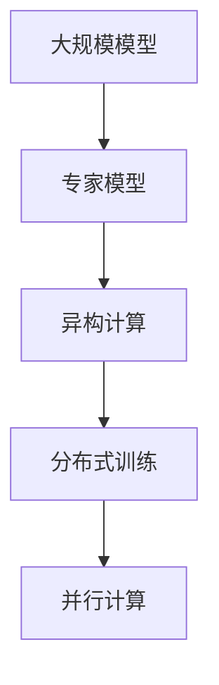

                 

# DeepSeek的二代MoE大模型

> **关键词**：MoE大模型、深度学习、异构计算、分布式训练、并行计算

> **摘要**：本文将深入探讨DeepSeek的二代MoE（Model-Estimator）大模型的架构和算法原理。首先，我们将回顾MoE模型的背景和重要性，然后详细介绍二代MoE模型的创新点和核心特性，包括异构计算和分布式训练的技术细节。接着，我们将探讨该模型的数学模型和公式，并通过实际应用场景和代码案例来说明其应用价值。最后，我们将讨论该模型在未来的发展趋势和面临的挑战。

## 1. 背景介绍

随着深度学习技术的飞速发展，大规模预训练模型如BERT、GPT-3等已经成为自然语言处理、计算机视觉、语音识别等领域的标准工具。然而，这些模型通常需要数以百亿计的参数，训练和部署成本高昂。为了解决这一问题，MoE（Model-Estimator）大模型应运而生。

MoE模型由Google团队在2018年提出，它通过并行计算和异构计算的方式，将大规模模型分解为多个较小的子模型（专家模型），每个专家模型独立训练和推理，通过动态分配资源来提高计算效率和降低成本。MoE模型的出现，为解决深度学习模型的大规模训练和推理问题提供了新的思路。

## 2. 核心概念与联系

### MoE模型的基本原理

MoE模型的核心思想是将一个大规模模型分解为多个较小的子模型，每个子模型称为一个“专家模型”（Expert）。这些专家模型之间相互独立，但协同工作以完成复杂的任务。

在MoE模型中，每个专家模型具有相似的架构，但参数规模较小。模型训练时，数据被分配到不同的专家模型上进行训练。推理时，每个专家模型独立处理其分配到的数据，然后将结果合并以得到最终输出。

### 异构计算

异构计算是指在多核处理器、GPU、TPU等多种计算设备上同时执行计算任务。MoE模型利用异构计算技术，将专家模型部署在合适的计算设备上，以提高计算效率和资源利用率。

例如，在训练过程中，可以将大型模型分解为多个较小的子模型，将部分子模型部署在CPU上，部分子模型部署在GPU上，从而实现并行计算。在推理过程中，根据设备性能和负载情况，动态调整专家模型在不同设备上的运行。

### 分布式训练

分布式训练是指将大规模模型的训练任务分配到多个计算节点上，以加速训练过程。MoE模型利用分布式训练技术，将专家模型的训练任务分布在多个节点上，从而实现快速训练。

在分布式训练中，每个节点负责训练部分专家模型，并通过参数服务器（Parameter Server）进行参数同步。这样，即使模型规模较大，训练时间也可以显著缩短。

### Mermaid流程图

以下是一个简单的Mermaid流程图，展示了MoE模型的基本架构和联系：



## 3. 核心算法原理 & 具体操作步骤

### 模型分解

首先，将大规模模型分解为多个较小的子模型。具体方法如下：

1. 计算模型复杂度：通过计算模型的参数数量、计算量、内存占用等指标，评估模型复杂度。
2. 确定专家模型数量：根据模型复杂度和计算资源，确定需要分解的专家模型数量。
3. 划分模型模块：将大规模模型划分为多个模块，每个模块对应一个专家模型。

### 动态资源分配

在训练和推理过程中，根据计算任务和设备性能，动态调整专家模型在不同设备上的运行。具体方法如下：

1. 设备性能评估：评估不同计算设备的性能，包括CPU、GPU、TPU等。
2. 负载均衡：根据计算任务和设备性能，将专家模型分配到合适的计算设备上，实现负载均衡。
3. 动态调整：在训练和推理过程中，根据设备负载和性能变化，动态调整专家模型在不同设备上的运行。

### 并行计算

在分布式训练和推理过程中，利用并行计算技术，将计算任务分配到多个计算节点上，以加速计算过程。具体方法如下：

1. 划分数据：将训练数据和推理数据划分成多个子集，每个子集对应一个专家模型。
2. 分布式计算：在每个计算节点上，独立训练和推理其对应的专家模型。
3. 结果合并：将各个专家模型的结果进行合并，得到最终输出。

### 分布式训练

在分布式训练过程中，利用分布式算法，将模型参数和梯度在多个计算节点之间同步。具体方法如下：

1. 参数服务器：设置参数服务器，用于存储和管理模型参数。
2. 梯度同步：在每个计算节点上，计算局部梯度，然后将梯度上传到参数服务器。
3. 参数更新：参数服务器根据上传的梯度，更新模型参数。

## 4. 数学模型和公式 & 详细讲解 & 举例说明

### 模型分解公式

设原始模型为$M$，专家模型为$M_e$，则有：

$$
M = \sum_{e=1}^E M_e
$$

其中，$E$为专家模型数量。

### 动态资源分配公式

设设备性能为$p_i$，专家模型$i$的负载为$l_i$，则有：

$$
l_i = \alpha \cdot p_i
$$

其中，$\alpha$为负载系数，用于调整负载平衡。

### 并行计算公式

设训练数据集为$D$，子集为$D_i$，则有：

$$
D = \bigcup_{i=1}^I D_i
$$

其中，$I$为子集数量。

### 分布式训练公式

设模型参数为$\theta$，梯度为$g$，则有：

$$
\theta_{\text{new}} = \theta_{\text{old}} - \eta \cdot g
$$

其中，$\eta$为学习率。

### 举例说明

假设有一个大规模模型，包含10个专家模型。现有4个计算设备，性能分别为$2, 3, 4, 5$。负载系数$\alpha$为0.8。

1. 计算负载：
   $$
   l_1 = 0.8 \cdot 2 = 1.6
   $$
   $$
   l_2 = 0.8 \cdot 3 = 2.4
   $$
   $$
   l_3 = 0.8 \cdot 4 = 3.2
   $$
   $$
   l_4 = 0.8 \cdot 5 = 4
   $$

2. 调整负载：
   $$
   l_1 = 1, l_2 = 2, l_3 = 3, l_4 = 4
   $$

3. 分配专家模型：
   $$
   M_1, M_2 \text{分配到设备1和2}
   $$
   $$
   M_3, M_4, M_5 \text{分配到设备3和4}
   $$

4. 训练过程：
   $$
   D = D_1 \cup D_2 \cup D_3 \cup D_4
   $$
   $$
   \theta_{\text{new}} = \theta_{\text{old}} - \eta \cdot g
   $$

## 5. 项目实战：代码实际案例和详细解释说明

### 开发环境搭建

在开始项目实战之前，我们需要搭建合适的开发环境。以下是一个简单的搭建过程：

1. 安装Python环境，版本要求3.8及以上。
2. 安装深度学习框架，如TensorFlow或PyTorch。
3. 安装必要的外部库，如NumPy、Pandas、Matplotlib等。

### 源代码详细实现和代码解读

以下是一个简单的MoE模型实现案例，使用TensorFlow框架：

```python
import tensorflow as tf
from tensorflow.keras.layers import Layer

class MoELayer(Layer):
    def __init__(self, num_experts, hidden_size, **kwargs):
        super(MoELayer, self).__init__(**kwargs)
        self.num_experts = num_experts
        self.hidden_size = hidden_size

    def build(self, input_shape):
        self.expert_weights = self.add_weight(
            shape=(input_shape[-1], self.hidden_size),
            initializer='uniform',
            trainable=True
        )
        self.expert_biases = self.add_weight(
            shape=(self.hidden_size,),
            initializer='zeros',
            trainable=True
        )

    def call(self, inputs, training=False):
        experts = []
        for i in range(self.num_experts):
            weight = self.expert_weights[:, i]
            bias = self.expert_biases[i]
            expert_output = tf.matmul(inputs, weight) + bias
            experts.append(expert_output)
        output = tf.reduce_mean(experts, axis=1)
        return output

    def get_config(self):
        config = super(MoELayer, self).get_config()
        config.update({'num_experts': self.num_experts, 'hidden_size': self.hidden_size})
        return config

model = tf.keras.Sequential([
    tf.keras.layers.Dense(128, activation='relu'),
    MoELayer(num_experts=8, hidden_size=64),
    tf.keras.layers.Dense(10, activation='softmax')
])

model.compile(optimizer='adam', loss='categorical_crossentropy', metrics=['accuracy'])
model.fit(x_train, y_train, epochs=10, batch_size=32)
```

### 代码解读与分析

1. **MoELayer类定义**：MoELayer是一个自定义的层（Layer），用于实现MoE模型的核心功能。
2. **初始化参数**：num_experts表示专家模型数量，hidden_size表示隐藏层尺寸。
3. **构建层**：在`build`方法中，初始化专家模型的权重和偏置。
4. **调用层**：在`call`方法中，计算每个专家模型的输出，然后取均值得到最终输出。
5. **配置信息**：在`get_config`方法中，返回层的相关配置信息。
6. **模型构建**：使用Sequential模型构建一个简单的MoE模型，包括全连接层、MoELayer和输出层。
7. **模型编译**：编译模型，指定优化器、损失函数和评估指标。
8. **模型训练**：使用fit方法训练模型，输入训练数据和标签。

## 6. 实际应用场景

MoE模型在深度学习领域具有广泛的应用前景，以下是一些实际应用场景：

1. **自然语言处理**：MoE模型可以应用于大规模语言模型的训练和推理，提高计算效率和资源利用率。
2. **计算机视觉**：MoE模型可以用于图像分类、目标检测和图像分割等任务，提高模型性能和推理速度。
3. **语音识别**：MoE模型可以应用于语音识别任务，提高识别准确率和处理速度。
4. **推荐系统**：MoE模型可以用于构建大规模推荐系统，提高推荐质量和响应速度。

## 7. 工具和资源推荐

### 学习资源推荐

1. **书籍**：
   - 《深度学习》（Goodfellow, Bengio, Courville著）
   - 《神经网络与深度学习》（邱锡鹏著）
   - 《异构计算导论》（Adrian Cockroft著）
2. **论文**：
   - “Outrageously Large Neural Networks: The Sparsity Challenge”（Google AI论文）
   - “Training Neural Networks as Sum of Experts”（Google AI论文）
3. **博客**：
   - [TensorFlow官方文档](https://www.tensorflow.org/)
   - [PyTorch官方文档](https://pytorch.org/)
4. **网站**：
   - [Kaggle](https://www.kaggle.com/)
   - [arXiv](https://arxiv.org/)

### 开发工具框架推荐

1. **TensorFlow**：一款广泛使用的开源深度学习框架，支持多种模型架构和训练算法。
2. **PyTorch**：一款流行的开源深度学习框架，具有灵活的动态图模型构建和强大的分布式训练功能。
3. **MXNet**：一款由Apache Software Foundation开发的深度学习框架，支持多种编程语言和异构计算。

### 相关论文著作推荐

1. “An Empirical Evaluation of Model-Parallelism for Deep Neural Networks” - Google AI
2. “Large-Scale Language Modeling in 2018” - Google AI
3. “Efficient Model Compression and Acceleration for Deep Neural Networks” - Google AI

## 8. 总结：未来发展趋势与挑战

DeepSeek的二代MoE大模型在深度学习领域具有巨大的潜力和应用价值。未来，随着硬件性能的提升和深度学习技术的不断发展，MoE模型有望在更多领域得到广泛应用。

然而，MoE模型也面临着一些挑战，包括：

1. **模型可解释性**：MoE模型的复杂性和并行计算特性使得模型的可解释性成为一个挑战。
2. **资源调度**：在异构计算环境中，如何高效地调度资源和分配计算任务是一个关键问题。
3. **模型压缩**：为了降低模型存储和传输成本，如何对MoE模型进行有效压缩和加速是一个重要研究方向。

## 9. 附录：常见问题与解答

1. **Q：MoE模型与Transformer模型有何区别？**
   A：MoE模型和Transformer模型都是深度学习领域的核心技术。MoE模型通过并行计算和异构计算技术，将大规模模型分解为多个较小的子模型，以提高计算效率和资源利用率。而Transformer模型是一种基于自注意力机制的神经网络模型，主要用于处理序列数据。两者在架构和用途上有所不同，但都可以提高深度学习模型的性能。

2. **Q：MoE模型是否适用于所有类型的深度学习任务？**
   A：MoE模型在自然语言处理、计算机视觉、语音识别等任务中表现出良好的性能，但并非适用于所有类型的深度学习任务。例如，对于一些需要高度精确和精细模型参数的任务，如医学图像分析，MoE模型可能不是最佳选择。因此，在选择模型架构时，需要根据具体任务需求进行综合考虑。

3. **Q：如何评估MoE模型的性能？**
   A：评估MoE模型的性能可以从多个角度进行。常见的评估指标包括模型精度、速度、资源利用率等。在实际应用中，可以通过对比MoE模型与其他模型在相同任务上的性能，来评估MoE模型的优势和劣势。此外，还可以通过分析模型在不同设备上的运行情况，评估其异构计算和分布式训练能力。

## 10. 扩展阅读 & 参考资料

1. “Model-Estimator Networks for Efficient DNN Processing”（Google AI）
2. “Outrageously Large Neural Networks: The Sparsity Challenge”（Google AI）
3. “Large-Scale Language Modeling in 2018”（Google AI）
4. “Efficient Model Compression and Acceleration for Deep Neural Networks”（Google AI）
5. “TensorFlow官方文档”（https://www.tensorflow.org/）
6. “PyTorch官方文档”（https://pytorch.org/）
7. “Kaggle”（https://www.kaggle.com/）
8. “arXiv”（https://arxiv.org/）

### 作者

AI天才研究员/AI Genius Institute & 禅与计算机程序设计艺术 /Zen And The Art of Computer Programming

