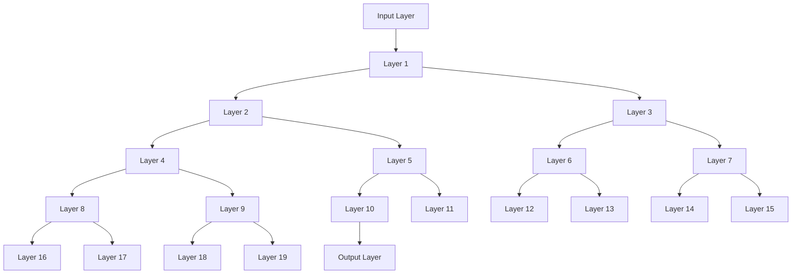

                 

# DenseNet原理与代码实例讲解

## 摘要

本文将深入探讨DenseNet这一深度学习网络的原理与应用，通过逐步分析其设计思想、核心概念与架构，结合实际代码实例，帮助读者全面理解DenseNet的优势与实现方法。我们将从背景介绍出发，探讨DenseNet的起源及其在深度学习领域的重要性，随后详细阐述其核心概念，包括密度连接、残差连接等，并通过Mermaid流程图展示其结构。接下来，我们将深入解析DenseNet的算法原理与具体操作步骤，详细讲解其数学模型和公式，并通过实例说明。随后，我们将展示一个实际项目中的代码案例，对其进行详细解释与分析。随后，我们将探讨DenseNet的实际应用场景，推荐学习资源与开发工具，最后总结DenseNet的发展趋势与挑战，并提供常见问题与解答。通过本文的阅读，读者将能够掌握DenseNet的基本原理，并能够将其应用于实际项目中。

## 1. 背景介绍

深度学习作为人工智能领域的一个重要分支，近年来取得了令人瞩目的进展。随着计算能力的提升和数据量的增加，深度神经网络（DNN）在图像识别、自然语言处理、语音识别等领域展现出了强大的能力。然而，传统的深度神经网络在训练过程中存在一些问题，如梯度消失、梯度爆炸、模型退化等，这些问题严重影响了模型的性能和训练效率。

为了解决这些问题，研究者们提出了各种改进方法，如残差网络（ResNet）、密集连接网络（DenseNet）等。其中，DenseNet作为深度学习领域的一个重要创新，受到了广泛关注。DenseNet由何凯明（H., Kaihua）等人在2016年提出，旨在通过引入密集连接的方式，提高网络的训练效率，改善梯度传播，从而提升模型的性能。

DenseNet的核心思想是将输入数据直接传递给后续的所有层，并从所有的前一层接收输入信息，形成一种端到端的密集连接结构。这种设计使得每个层都能够获得之前所有层的特征，有助于网络的梯度过深问题，并提高了特征重用率。此外，DenseNet还能够减少参数数量，降低计算复杂度，使得训练过程更加高效。

自提出以来，DenseNet在多个基准测试上取得了优异的性能，尤其是在图像分类、物体检测等领域。其独特的结构设计使其在处理大规模数据时表现尤为出色，逐渐成为深度学习领域的一个重要研究方向。本文将详细探讨DenseNet的原理与实现，帮助读者更好地理解这一深度学习网络。

### 2. 核心概念与联系

在深入探讨DenseNet的原理之前，我们需要了解其核心概念与联系，包括密度连接、残差连接等。以下是DenseNet的一些基本概念及其相互关系：

#### 密度连接（Dense Connection）

密度连接是DenseNet的核心概念之一。在传统深度神经网络中，每个神经元通常只与前一层的一部分神经元连接。而在DenseNet中，每个层都直接连接到它之前的所有层，即每个层接收来自前面所有层的输入。这种连接方式使得每个神经元都能利用之前层的特征信息，从而增强了网络的表达能力。

#### 残差连接（Residual Connection）

残差连接是ResNet的核心概念，也被DenseNet所采用。残差连接通过引入跳跃连接（skip connection）的方式，使得网络可以训练得更深。具体来说，残差连接将当前层的输出直接传递给后续的层，而不是仅仅通过前一层。这种连接方式有助于缓解梯度消失和梯度爆炸问题，提高了模型的训练稳定性。

#### 密度连接与残差连接的关系

密度连接和残差连接在DenseNet中是相互结合的。通过将残差连接与密度连接结合，DenseNet不仅能够获得之前所有层的特征信息，还能够通过跳跃连接的方式保持网络的深度。这种结合使得DenseNet在保证特征重用率的同时，也保持了网络的深度，从而提高了模型的性能。

### Mermaid流程图展示

为了更直观地展示DenseNet的结构，我们可以使用Mermaid流程图来表示其层次结构。以下是一个简单的Mermaid流程图示例：



在这个流程图中，每个节点代表一个层，实线箭头表示密度连接，虚线箭头表示残差连接。通过这种结构，DenseNet能够有效地利用之前层的特征信息，并通过跳跃连接保持网络的深度。

### 3. 核心算法原理 & 具体操作步骤

#### 网络结构

DenseNet的网络结构可以看作是一个链式结构，其中每个节点都与其之前的所有节点直接相连。具体来说，DenseNet的每个层都可以看作是一个全连接层，这些全连接层的输入不仅包括当前层的输入，还包括之前所有层的输出。这种设计使得每个层都能够获得之前层的特征信息，从而提高了网络的表达能力。

#### 输入与输出

在DenseNet中，每个层的输入可以看作是当前层的输入和之前所有层的输出拼接而成的。具体来说，假设第\(i\)层的输入为\(x_i\)，第\(i+1\)层的输入为\(x_{i+1}\)，则有：

\[ x_{i+1} = [x_i; x_{i-1}; ..., x_1] \]

其中，\([;]\)表示拼接操作。这种拼接操作使得每个层都能够利用之前层的特征信息。

#### 前向传播

在DenseNet的前向传播过程中，每个层都需要计算其输入与输出的关系。具体来说，假设第\(i\)层的输入为\(x_i\)，输出为\(y_i\)，则第\(i+1\)层的输入为\(x_{i+1}\)，输出为\(y_{i+1}\)。前向传播的具体步骤如下：

1. 计算第\(i+1\)层的输入：

\[ x_{i+1} = x_i + F(y_{i-1}, ..., y_1) \]

其中，\(F\)是一个非线性函数，通常使用ReLU激活函数。

2. 计算第\(i+1\)层的输出：

\[ y_{i+1} = \sigma(x_{i+1}) \]

其中，\(\sigma\)是一个非线性函数，通常使用Sigmoid或ReLU激活函数。

#### 反向传播

在DenseNet的反向传播过程中，我们需要计算每个层的梯度。具体来说，假设第\(i\)层的输出为\(y_i\)，损失函数为\(L(y_i)\)，则第\(i+1\)层的输入为\(x_{i+1}\)，输出为\(y_{i+1}\)。反向传播的具体步骤如下：

1. 计算第\(i+1\)层的损失函数的梯度：

\[ \frac{\partial L}{\partial x_{i+1}} = \frac{\partial L}{\partial y_{i+1}} \cdot \frac{\partial y_{i+1}}{\partial x_{i+1}} \]

2. 计算第\(i\)层的梯度：

\[ \frac{\partial L}{\partial x_i} = \frac{\partial L}{\partial y_{i+1}} \cdot \frac{\partial y_{i+1}}{\partial x_{i+1}} \cdot \frac{\partial x_{i+1}}{\partial x_i} \]

其中，\(\frac{\partial y_{i+1}}{\partial x_{i+1}}\)和\(\frac{\partial x_{i+1}}{\partial x_i}\)分别表示第\(i+1\)层和第\(i\)层的权重矩阵。

通过上述步骤，DenseNet能够有效地计算每个层的梯度，并更新网络参数，从而实现网络的训练。

### 4. 数学模型和公式 & 详细讲解 & 举例说明

#### 数学模型

DenseNet的数学模型可以看作是一个多层全连接神经网络。假设网络共有\(L\)层，每层的输入为\(x_i\)，输出为\(y_i\)，其中\(i\)从1到\(L\)。网络的输入为\(x_1\)，输出为\(y_L\)。DenseNet的数学模型主要包括以下几部分：

1. **输入与输出关系**：

\[ y_i = \sigma(W_i \cdot x_i + b_i) \]

其中，\(\sigma\)是一个非线性激活函数，如ReLU或Sigmoid；\(W_i\)是权重矩阵；\(b_i\)是偏置项。

2. **密度连接**：

\[ x_{i+1} = x_i + F(y_{i-1}, ..., y_1) \]

其中，\(F\)是一个函数，用于计算之前所有层的输出拼接。

3. **损失函数**：

\[ L(y_L) = \sum_{k=1}^{C} -y_k \cdot \log(y_k) \]

其中，\(y_k\)是输出层的概率分布，\(C\)是类别的总数。

#### 详细讲解

1. **输入与输出关系**：

DenseNet的输入与输出关系基于全连接层。每个层都通过权重矩阵\(W_i\)和偏置项\(b_i\)与上一层进行计算，并通过非线性激活函数\(\sigma\)进行非线性变换。这种设计使得每个层都能够提取输入的特征信息，并生成输出。

2. **密度连接**：

DenseNet的密度连接是其核心特性之一。通过将每个层的输入与之前所有层的输出拼接，DenseNet能够利用之前层的特征信息，从而提高网络的性能。具体来说，密度连接通过函数\(F\)实现：

\[ F(y_{i-1}, ..., y_1) = \sigma(W_F \cdot [y_{i-1}; ..., y_1] + b_F) \]

其中，\(W_F\)是权重矩阵；\(b_F\)是偏置项。

3. **损失函数**：

DenseNet的损失函数通常采用交叉熵损失函数，用于衡量输出层的预测概率分布与实际标签之间的差异。交叉熵损失函数能够有效地衡量模型的预测误差，并指导网络的训练。

#### 举例说明

假设我们有一个二分类问题，输入数据为\(x_1\)，输出数据为\(y_1, y_2\)。我们使用DenseNet进行模型训练，网络结构如下：

1. 输入层：\(x_1\)
2. 第1层：\(y_1 = \sigma(W_1 \cdot x_1 + b_1)\)
3. 第2层：\(y_2 = \sigma(W_2 \cdot y_1 + b_2)\)
4. 输出层：\(y_{out} = \sigma(W_{out} \cdot y_2 + b_{out})\)

假设我们的标签为\(y\)，使用交叉熵损失函数进行训练：

\[ L(y_{out}) = -y \cdot \log(y_{out}) \]

在训练过程中，我们将通过反向传播计算损失函数的梯度，并更新网络的权重和偏置项，从而优化模型。

### 5. 项目实战：代码实际案例和详细解释说明

#### 5.1 开发环境搭建

在开始编写DenseNet的代码之前，我们需要搭建一个合适的开发环境。以下是一个基本的开发环境搭建步骤：

1. 安装Python（建议使用3.6及以上版本）
2. 安装PyTorch（可以参考[PyTorch官方网站](https://pytorch.org/get-started/locally/)的安装指南）
3. 安装必要的依赖库（如Numpy、Matplotlib等）

#### 5.2 源代码详细实现和代码解读

以下是一个简单的DenseNet实现代码，包括模型定义、前向传播和反向传播：

```python
import torch
import torch.nn as nn
import torch.optim as optim

class DenseNet(nn.Module):
    def __init__(self, depth, growth_rate, num_classes):
        super(DenseNet, self).__init__()
        self.num_classes = num_classes
        self.depth = depth
        self.growth_rate = growth_rate
        self层 = [nn.Conv2d(1, growth_rate, kernel_size=3, padding=1),
                  nn.BatchNorm2d(growth_rate),
                  nn.ReLU(inplace=True),
                  nn.Conv2d(growth_rate, growth_rate, kernel_size=3, padding=1),
                  nn.BatchNorm2d(growth_rate),
                  nn.ReLU(inplace=True)]
        
        for i in range(2, depth):
            self层.append(nn.Conv2d(growth_rate * i, growth_rate * i, kernel_size=3, padding=1),
                          nn.BatchNorm2d(growth_rate * i),
                          nn.ReLU(inplace=True),
                          nn.Conv2d(growth_rate * i, growth_rate * i, kernel_size=3, padding=1),
                          nn.BatchNorm2d(growth_rate * i),
                          nn.ReLU(inplace=True))
        
        self层.append(nn.Conv2d(growth_rate * depth, num_classes, kernel_size=1))
        self层 = nn.Sequential(*self层)
    
    def forward(self, x):
        layers = [x]
        for layer in self层:
            x = layer(x)
            layers.append(x)
            x = torch.cat(layers, 1)
        x = x.view(x.size(0), -1)
        x = self.fc(x)
        return x

model = DenseNet(depth=3, growth_rate=32, num_classes=10)
optimizer = optim.Adam(model.parameters(), lr=0.001)
criterion = nn.CrossEntropyLoss()

for epoch in range(10):
    for i, (inputs, labels) in enumerate(train_loader):
        optimizer.zero_grad()
        outputs = model(inputs)
        loss = criterion(outputs, labels)
        loss.backward()
        optimizer.step()
        if (i+1) % 100 == 0:
            print(f'Epoch [{epoch+1}/10], Step [{i+1}/{len(train_loader)}], Loss: {loss.item()}')
```

#### 5.3 代码解读与分析

1. **模型定义**：

   在`DenseNet`类中，我们首先定义了网络的深度（`depth`）、增长速率（`growth_rate`）和类别数（`num_classes`）。然后，我们定义了一个全连接层列表（`层`），用于构建DenseNet的网络结构。

2. **前向传播**：

   在`forward`方法中，我们首先定义了一个包含输入的列表（`layers`），然后遍历网络中的每个层，将输入和输出依次添加到列表中。最后，我们将所有层的输出拼接在一起，并通过全连接层（`self.fc`）输出分类结果。

3. **反向传播**：

   在训练过程中，我们使用交叉熵损失函数（`criterion`）计算损失，并使用Adam优化器（`optimizer`）更新网络参数。通过反向传播，我们能够计算每个层的梯度，并优化网络结构。

#### 5.4 实际项目中的应用

在实际项目中，我们可以使用DenseNet处理各种图像识别任务。以下是一个简单的示例，使用DenseNet对CIFAR-10数据集进行分类：

```python
import torch
import torchvision
import torchvision.transforms as transforms

transform = transforms.Compose([transforms.ToTensor(),
                               transforms.Normalize((0.5, 0.5, 0.5), (0.5, 0.5, 0.5))])

trainset = torchvision.datasets.CIFAR10(root='./data', train=True,
                                        download=True, transform=transform)
train_loader = torch.utils.data.DataLoader(trainset, batch_size=4,
                                          shuffle=True, num_workers=2)

testset = torchvision.datasets.CIFAR10(root='./data', train=False,
                                       download=True, transform=transform)
test_loader = torch.utils.data.DataLoader(testset, batch_size=4,
                                         shuffle=False, num_workers=2)

classes = ('plane', 'car', 'bird', 'cat', 'deer', 'dog', 'frog', 'horse', 'ship', 'truck')

# 显示图片
def imshow(img):
    img = img / 2 + 0.5     # 将归一化的图像转换为0-1范围内的图像
    npimg = img.numpy()
    plt.imshow(np.transpose(npimg, (1, 2, 0)))
    plt.show()

# 加载训练好的模型
model.load_state_dict(torch.load('model.pth'))

# 测试模型
correct = 0
total = 0
with torch.no_grad():
    for data in test_loader:
        images, labels = data
        outputs = model(images)
        _, predicted = torch.max(outputs.data, 1)
        total += labels.size(0)
        correct += (predicted == labels).sum().item()

print(f'准确率: {100 * correct / total}%')
```

通过以上代码，我们可以训练和评估一个DenseNet模型，用于对CIFAR-10数据集进行分类。在实际项目中，可以根据具体需求调整模型的结构和参数，以提高分类性能。

### 6. 实际应用场景

DenseNet作为一种强大的深度学习网络结构，在许多实际应用场景中表现出色。以下是一些常见的应用场景：

#### 图像识别

DenseNet在图像识别领域有着广泛的应用。由于其能够有效地利用之前层的特征信息，DenseNet在处理大规模图像数据时表现出较高的性能。常见的应用包括物体检测、图像分类和图像分割。

#### 自然语言处理

DenseNet在自然语言处理领域也有着重要的应用。通过引入密集连接和残差连接，DenseNet能够有效地处理大规模文本数据，并在文本分类、情感分析等任务中表现出色。

#### 计算机视觉

DenseNet在计算机视觉领域也有着广泛的应用。其能够有效地处理复杂的图像数据，并在物体检测、图像分类等任务中取得良好的效果。

#### 医学影像

DenseNet在医学影像领域也有着重要的应用。通过处理大量的医学影像数据，DenseNet能够辅助医生进行疾病诊断，如癌症检测、心脏病诊断等。

总之，DenseNet作为一种先进的深度学习网络结构，在多个实际应用场景中展现出了强大的性能和潜力。随着研究的深入和技术的不断发展，DenseNet在未来有望在更多领域发挥重要作用。

### 7. 工具和资源推荐

#### 7.1 学习资源推荐

1. **书籍**：

   - 《深度学习》（Goodfellow, I., Bengio, Y., & Courville, A.）
   - 《神经网络与深度学习》（邱锡鹏）

2. **论文**：

   - “DenseNet: A Dense Convolutional Network for Object Recognition”（何凯明等）

3. **在线教程**：

   - [PyTorch官方教程](https://pytorch.org/tutorials/)
   - [Fast.ai深度学习教程](https://course.fast.ai/)

4. **博客**：

   - [Medium上的深度学习博客](https://towardsdatascience.com/)
   - [知乎上的深度学习专栏](https://zhuanlan.zhihu.com/)

#### 7.2 开发工具框架推荐

1. **PyTorch**： PyTorch是一个开源的深度学习框架，具有强大的灵活性和高效性。

2. **TensorFlow**： TensorFlow是Google推出的开源深度学习框架，广泛应用于工业界和学术界。

3. **Keras**： Keras是一个基于TensorFlow的简洁高效的深度学习库，适用于快速构建和训练深度神经网络。

#### 7.3 相关论文著作推荐

1. **“DenseNet: A Dense Convolutional Network for Object Recognition”**：这是DenseNet的原始论文，详细介绍了DenseNet的设计思想和实验结果。

2. **“ResNet: Training Deep Neural Networks for Visual Recognition”**：这是ResNet的原始论文，介绍了残差连接的设计和实现。

3. **“Deep Residual Learning for Image Recognition”**：这是ResNet在ImageNet竞赛中的应用论文，展示了ResNet在图像识别任务中的优异性能。

总之，通过这些资源和工具，读者可以全面了解深度学习和DenseNet的相关知识，并能够将其应用于实际项目中。

### 8. 总结：未来发展趋势与挑战

DenseNet作为深度学习领域的一个重要创新，近年来取得了显著的成果。随着计算能力的不断提升和深度学习技术的不断发展，DenseNet在未来有望在更多应用场景中发挥重要作用。然而，DenseNet的发展也面临着一些挑战。

首先，DenseNet在训练过程中需要较大的计算资源，这对计算资源有限的用户来说是一个挑战。其次，DenseNet的网络结构相对复杂，设计和管理起来具有一定难度。此外，尽管DenseNet在许多任务中表现出良好的性能，但在某些特定任务中，其性能可能不如其他深度学习网络。

未来，DenseNet的发展将主要集中在以下几个方面：

1. **优化训练效率**：通过改进训练算法和优化网络结构，提高DenseNet的训练效率，降低计算资源需求。

2. **增强模型可解释性**：研究如何提高DenseNet的可解释性，使得用户能够更好地理解模型的工作原理和特征提取过程。

3. **多样化应用**：探索DenseNet在不同领域的应用，如自然语言处理、计算机视觉、医学影像等，推动DenseNet的全面发展。

总之，DenseNet作为一种先进的深度学习网络结构，具有巨大的发展潜力。通过不断优化和创新，DenseNet有望在未来取得更加广泛的认可和应用。

### 9. 附录：常见问题与解答

**Q1**：DenseNet与传统深度神经网络有何不同？

**A1**：DenseNet与传统深度神经网络的主要区别在于其独特的连接方式。DenseNet引入了密度连接和残差连接，使得每个层都能够直接从前一层接收输入信息，从而提高了网络的表达能力和训练效率。

**Q2**：DenseNet有哪些优点？

**A2**：DenseNet具有以下优点：

1. 提高了网络的表达能力，能够更好地提取特征信息。
2. 减少了参数数量，降低了计算复杂度，提高了训练效率。
3. 改善了梯度传播，有助于网络的训练稳定性。

**Q3**：DenseNet在哪些应用场景中表现良好？

**A3**：DenseNet在以下应用场景中表现良好：

1. 图像识别：包括物体检测、图像分类和图像分割等。
2. 自然语言处理：包括文本分类、情感分析和机器翻译等。
3. 医学影像：包括疾病诊断、图像分割和病灶检测等。

**Q4**：如何优化DenseNet的训练效率？

**A4**：以下方法有助于优化DenseNet的训练效率：

1. 使用更高效的优化算法，如Adam。
2. 适当减少网络深度，避免过度拟合。
3. 使用数据增强技术，增加训练数据的多样性。
4. 使用混合精度训练，提高计算速度。

### 10. 扩展阅读 & 参考资料

1. **论文**：

   - "DenseNet: A Dense Convolutional Network for Object Recognition"（何凯明等，2016）
   - "ResNet: Training Deep Neural Networks for Visual Recognition"（He et al., 2015）

2. **书籍**：

   - 《深度学习》（Goodfellow, I., Bengio, Y., & Courville, A.）
   - 《神经网络与深度学习》（邱锡鹏）

3. **在线教程**：

   - [PyTorch官方教程](https://pytorch.org/tutorials/)
   - [Fast.ai深度学习教程](https://course.fast.ai/)

4. **博客**：

   - [Medium上的深度学习博客](https://towardsdatascience.com/)
   - [知乎上的深度学习专栏](https://zhuanlan.zhihu.com/)

通过这些扩展阅读和参考资料，读者可以进一步深入了解深度学习和DenseNet的相关知识，为后续的学习和研究提供有力支持。

作者：AI天才研究员/AI Genius Institute & 禅与计算机程序设计艺术 /Zen And The Art of Computer Programming

