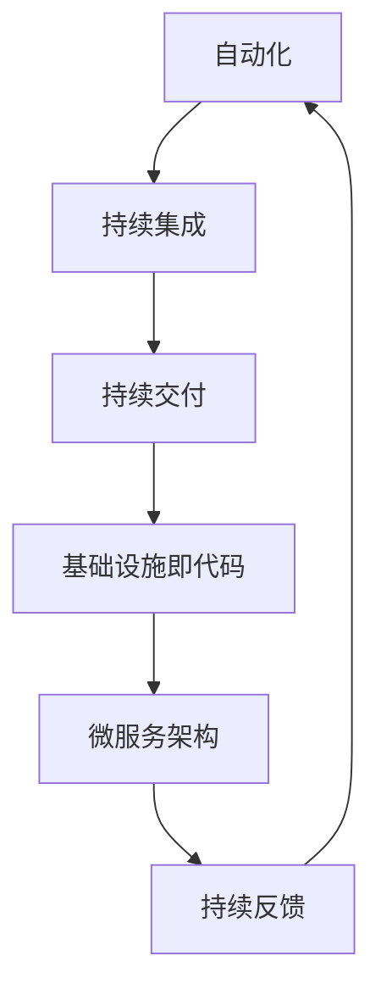

                 

# DevOps实践指南：创业公司如何提高开发效率

> **关键词**：DevOps、创业公司、开发效率、自动化、持续集成、持续交付、容器化、微服务架构、基础设施即代码
> 
> **摘要**：本文旨在为创业公司提供一套实用的DevOps实践指南，帮助它们在快速发展的过程中提高开发效率。我们将从背景介绍、核心概念、算法原理、实际应用场景、工具推荐等方面进行详细探讨，旨在为创业公司提供一条清晰的发展之路。

## 1. 背景介绍

在当今快速变化的市场环境中，创业公司面临着前所未有的挑战和机遇。一方面，市场需求和技术发展趋势变化迅速，创业公司需要具备快速响应和迭代的能力；另一方面，市场竞争激烈，创业公司需要在有限资源下实现高效运作。而DevOps正是解决这些问题的有效途径。

DevOps是一种软件开发和运营的实践方法，它强调开发和运维团队之间的紧密合作，通过自动化、持续集成、持续交付等手段，实现快速、可靠地交付高质量软件产品。DevOps的核心目标在于缩短产品交付周期，提高开发效率，降低风险，从而在激烈的市场竞争中占据有利地位。

对于创业公司来说，DevOps具有以下几个重要意义：

1. **提高开发效率**：通过自动化和协作，DevOps可以显著提高开发、测试、部署等环节的效率，使团队能够更快地响应市场需求。
2. **降低风险**：通过持续集成和持续交付，DevOps可以及早发现和解决潜在问题，降低软件发布过程中的风险。
3. **提高产品质量**：DevOps强调质量保障，通过自动化测试、代码审查等手段，确保软件产品的质量。
4. **降低成本**：通过优化流程、减少重复工作，DevOps可以帮助创业公司降低运营成本。

## 2. 核心概念与联系

### 2.1 DevOps的核心概念

DevOps的核心概念包括：

1. **自动化**：通过自动化工具和脚本，实现重复性任务的高效执行，减少人为干预，提高工作效率。
2. **持续集成**：将代码合并到主干分支时，自动执行测试和构建，确保代码质量。
3. **持续交付**：在持续集成的基础上，通过自动化部署和发布，实现软件的持续交付。
4. **基础设施即代码**：将基础设施管理视为代码管理的一部分，通过版本控制和自动化工具进行管理和部署。
5. **微服务架构**：将应用程序拆分为多个小型、独立的服务，通过API进行通信，提高系统的灵活性和可维护性。
6. **持续反馈**：通过监控和反馈机制，收集用户反馈，持续改进产品。

### 2.2 DevOps的核心联系

DevOps的核心概念之间紧密相连，形成一个完整的闭环：

1. **自动化**是DevOps的基础，它为持续集成、持续交付等环节提供支持。
2. **持续集成**确保了代码的质量，为持续交付提供了前提条件。
3. **持续交付**实现了软件的持续交付，使产品能够快速响应市场需求。
4. **基础设施即代码**确保了基础设施的稳定性和可重复性，为自动化和持续交付提供了保障。
5. **微服务架构**提高了系统的灵活性和可维护性，使团队能够更快地开发和迭代产品。
6. **持续反馈**使团队能够不断优化产品，提高用户满意度。

### 2.3 Mermaid流程图



## 3. 核心算法原理 & 具体操作步骤

### 3.1 自动化

自动化是DevOps的核心概念之一，它通过脚本和工具实现重复性任务的高效执行。具体操作步骤如下：

1. **识别重复性任务**：首先，识别开发、测试、部署等环节中的重复性任务，如构建、部署、测试等。
2. **编写脚本**：根据识别出的任务，编写相应的脚本或自动化工具。例如，使用Shell脚本进行部署，使用Ansible进行配置管理，使用Jenkins进行持续集成等。
3. **测试和优化**：在开发环境中测试自动化脚本，确保其正常运行。根据测试结果，不断优化脚本和工具，提高其效率和稳定性。
4. **部署和监控**：将自动化脚本和工具部署到生产环境，并进行监控，确保其正常运行。

### 3.2 持续集成

持续集成（CI）是一种软件开发实践，通过自动化工具将代码合并到主干分支时，自动执行测试和构建。具体操作步骤如下：

1. **选择CI工具**：根据项目需求，选择合适的CI工具，如Jenkins、GitLab CI等。
2. **编写CI配置文件**：根据CI工具的文档，编写CI配置文件，定义代码仓库、构建过程、测试过程等。
3. **集成代码库**：将代码库集成到CI工具中，确保CI工具能够自动获取和更新代码。
4. **执行构建和测试**：CI工具在代码合并到主干分支时，自动执行构建和测试，确保代码质量。
5. **反馈和优化**：根据构建和测试结果，反馈给开发人员，使其及时修复问题，并不断优化CI配置和流程。

### 3.3 持续交付

持续交付（CD）是在持续集成的基础上，通过自动化部署和发布，实现软件的持续交付。具体操作步骤如下：

1. **选择CD工具**：根据项目需求，选择合适的CD工具，如Docker、Kubernetes等。
2. **编写CD配置文件**：根据CD工具的文档，编写CD配置文件，定义部署过程、发布过程等。
3. **容器化应用程序**：将应用程序容器化，使其能够在不同环境中一致地运行。
4. **自动化部署和发布**：通过CD工具，实现应用程序的自动化部署和发布，确保快速、可靠地交付软件。
5. **监控和优化**：对部署和发布过程进行监控，确保其正常运行，并根据监控数据不断优化配置和流程。

### 3.4 基础设施即代码

基础设施即代码（Infrastructure as Code，IaC）是一种将基础设施管理视为代码管理的实践方法。具体操作步骤如下：

1. **选择IaC工具**：根据项目需求，选择合适的IaC工具，如Terraform、Ansible等。
2. **编写基础设施配置文件**：根据IaC工具的文档，编写基础设施配置文件，定义所需的基础设施。
3. **部署和管理基础设施**：通过IaC工具，自动化部署和管理基础设施，确保其稳定性和可重复性。
4. **版本控制和协同工作**：将基础设施配置文件纳入版本控制系统，实现团队协作和代码审查。
5. **自动化测试和优化**：对基础设施配置文件进行自动化测试和优化，确保其质量和性能。

### 3.5 微服务架构

微服务架构（Microservices Architecture）是一种将应用程序拆分为多个小型、独立的服务，通过API进行通信的架构方法。具体操作步骤如下：

1. **需求分析和设计**：根据业务需求，分析应用程序的功能模块，设计微服务架构。
2. **拆分服务**：将应用程序拆分为多个小型、独立的服务，每个服务负责一个特定的功能模块。
3. **定义API**：为每个微服务定义RESTful API，实现服务间的通信。
4. **服务化部署和管理**：将微服务部署到不同的环境中，进行独立管理和监控。
5. **服务化协作和优化**：通过服务化协作，不断优化微服务的功能、性能和稳定性。

### 3.6 持续反馈

持续反馈（Continuous Feedback）是一种收集用户反馈、持续改进产品的实践方法。具体操作步骤如下：

1. **收集用户反馈**：通过用户调研、用户反馈、错误报告等渠道，收集用户反馈。
2. **分析反馈**：对收集到的用户反馈进行分类、分析和归纳，找出产品中的问题。
3. **改进产品**：根据用户反馈，改进产品的功能、性能和用户体验。
4. **持续优化**：通过持续反馈，不断优化产品，提高用户满意度。

## 4. 数学模型和公式 & 详细讲解 & 举例说明

### 4.1 自动化效率模型

自动化效率模型（Efficiency Model of Automation，EMA）是一个用于评估自动化对开发效率影响的数学模型。具体公式如下：

$$
EMA = \frac{ET_{auto}}{ET_{manual}}
$$

其中，$ET_{auto}$ 表示自动化完成某任务所需的时间，$ET_{manual}$ 表示手动完成同一任务所需的时间。$EMA$ 的值越大，表示自动化的效率越高。

#### 举例说明

假设任务A需要手动完成，耗时10小时；使用自动化脚本后，耗时3小时。根据自动化效率模型，可以计算出自动化效率：

$$
EMA = \frac{ET_{auto}}{ET_{manual}} = \frac{3}{10} = 0.3
$$

这意味着自动化的效率提高了30%。

### 4.2 持续集成质量模型

持续集成质量模型（Quality Model of Continuous Integration，QCI）是一个用于评估持续集成对软件质量影响的数学模型。具体公式如下：

$$
QCI = \frac{NP}{N}
$$

其中，$NP$ 表示通过持续集成检测出的缺陷数量，$N$ 表示总缺陷数量。$QCI$ 的值越大，表示持续集成的质量越高。

#### 举例说明

假设在持续集成过程中，检测出100个缺陷，总缺陷数量为200个。根据持续集成质量模型，可以计算出持续集成质量：

$$
QCI = \frac{NP}{N} = \frac{100}{200} = 0.5
$$

这意味着持续集成检测出的缺陷占总缺陷数量的50%。

### 4.3 持续交付速度模型

持续交付速度模型（Speed Model of Continuous Delivery，SCD）是一个用于评估持续交付对软件交付速度影响的数学模型。具体公式如下：

$$
SCD = \frac{DT_{CD}}{DT_{manual}}
$$

其中，$DT_{CD}$ 表示使用持续交付完成软件交付所需的时间，$DT_{manual}$ 表示手动完成软件交付所需的时间。$SCD$ 的值越大，表示持续交付的速度越快。

#### 举例说明

假设使用手动交付方式，完成软件交付需要10天；使用持续交付后，完成软件交付需要3天。根据持续交付速度模型，可以计算出持续交付速度：

$$
SCD = \frac{DT_{CD}}{DT_{manual}} = \frac{3}{10} = 0.3
$$

这意味着持续交付的速度提高了30%。

### 4.4 基础设施即代码成本模型

基础设施即代码成本模型（Cost Model of Infrastructure as Code，ICM）是一个用于评估基础设施即代码对基础设施成本影响的数学模型。具体公式如下：

$$
ICM = \frac{C_{IaC}}{C_{manual}}
$$

其中，$C_{IaC}$ 表示使用基础设施即代码构建和管理基础设施所需的成本，$C_{manual}$ 表示使用手动方式构建和管理基础设施所需的成本。$ICM$ 的值越大，表示基础设施即代码的成本越高。

#### 举例说明

假设使用手动方式构建和管理基础设施，每年需要花费100万元；使用基础设施即代码后，每年需要花费50万元。根据基础设施即代码成本模型，可以计算出基础设施即代码的成本：

$$
ICM = \frac{C_{IaC}}{C_{manual}} = \frac{50}{100} = 0.5
$$

这意味着基础设施即代码的成本降低了50%。

### 4.5 微服务架构灵活性模型

微服务架构灵活性模型（Flexibility Model of Microservices Architecture，FMA）是一个用于评估微服务架构对系统灵活性影响的数学模型。具体公式如下：

$$
FMA = \frac{LT_{microservices}}{LT_{monolithic}}
$$

其中，$LT_{microservices}$ 表示微服务架构下系统的可扩展性、可维护性等灵活性指标，$LT_{monolithic}$ 表示单体架构下系统的相应指标。$FMA$ 的值越大，表示微服务架构的灵活性越高。

#### 举例说明

假设在微服务架构下，系统的可扩展性、可维护性等灵活性指标为0.8，在单体架构下，相应指标为0.3。根据微服务架构灵活性模型，可以计算出微服务架构的灵活性：

$$
FMA = \frac{LT_{microservices}}{LT_{monolithic}} = \frac{0.8}{0.3} = 2.67
$$

这意味着微服务架构的灵活性提高了2.67倍。

### 4.6 持续反馈改进模型

持续反馈改进模型（Improvement Model of Continuous Feedback，ICF）是一个用于评估持续反馈对产品改进影响的数学模型。具体公式如下：

$$
ICF = \frac{I_{feedback}}{I_{manual}}
$$

其中，$I_{feedback}$ 表示基于持续反馈改进产品的效果，$I_{manual}$ 表示基于手动反馈改进产品的效果。$ICF$ 的值越大，表示持续反馈的改进效果越好。

#### 举例说明

假设基于手动反馈改进产品的效果为10分，基于持续反馈改进产品的效果为30分。根据持续反馈改进模型，可以计算出持续反馈的改进效果：

$$
ICF = \frac{I_{feedback}}{I_{manual}} = \frac{30}{10} = 3
$$

这意味着基于持续反馈的改进效果是手动反馈的3倍。

## 5. 项目实战：代码实际案例和详细解释说明

### 5.1 开发环境搭建

为了演示DevOps在创业公司中的应用，我们假设一家创业公司需要搭建一个基于Python的Web应用。以下是搭建开发环境的具体步骤：

1. **安装Python**：在开发机器上安装Python 3.8版本，可以使用以下命令：
    ```bash
    sudo apt-get update
    sudo apt-get install python3.8
    ```
2. **安装虚拟环境**：安装虚拟环境工具virtualenv，以便为不同项目创建独立的Python环境：
    ```bash
    sudo pip3 install virtualenv
    virtualenv my_project_env
    ```
3. **安装依赖**：进入虚拟环境，安装项目所需的依赖，例如Django Web框架和Flask框架：
    ```bash
    source my_project_env/bin/activate
    pip install django flask
    ```

### 5.2 源代码详细实现和代码解读

在这个示例中，我们使用Django框架搭建一个简单的博客系统。以下是项目的源代码和详细解读：

1. **项目结构**：
    ```bash
    my_blog/
    ├── my_blog/
    │   ├── __init__.py
    │   ├── settings.py
    │   ├── urls.py
    │   ├── wsgi.py
    ├── app_name/
    │   ├── __init__.py
    │   ├── admin.py
    │   ├── apps.py
    │   ├── models.py
    │   ├── tests.py
    │   ├── views.py
    ├── manage.py
    ```
2. **settings.py**：配置数据库、时区等信息：
    ```python
    # my_blog/settings.py

    import os

    # Quick-start development settings - unsuitable for production
    # See https://docs.djangoproject.com/en/3.2/howto/deployment/checklist/

    # SECURITY WARNING: keep the secret key used in production secret!
    SECRET_KEY = 'your-secret-key'

    # SECURITY WARNING: don't run with debug turned on in production!
    DEBUG = True

    # Database
    DATABASES = {
        'default': {
            'ENGINE': 'django.db.backends.sqlite3',
            'NAME': os.path.join(BASE_DIR, 'db.sqlite3'),
        }
    }

    # Application definition

    INSTALLED_APPS = [
        'django.contrib.admin',
        'django.contrib.auth',
        'django.contrib.contenttypes',
        'django.contrib.sessions',
        'django.contrib.messages',
        'django.contrib.staticfiles',
        'app_name', # 指定自己的应用
    ]

    # Default primary key field type
    DEFAULT_AUTO_FIELD = 'django.db.models.BigAutoField'
    ```

3. **urls.py**：定义URL路由：
    ```python
    # my_blog/urls.py

    from django.contrib import admin
    from django.urls import path
    from app_name import views

    urlpatterns = [
        path('admin/', admin.site.urls),
        path('blog/', views.PostListView.as_view()),
    ]
    ```

4. **models.py**：定义数据模型：
    ```python
    # app_name/models.py

    from django.db import models

    class Post(models.Model):
        title = models.CharField(max_length=200)
        author = models.ForeignKey('auth.User', on_delete=models.CASCADE)
        body = models.TextField()

        def __str__(self):
            return self.title
    ```

5. **views.py**：定义视图函数：
    ```python
    # app_name/views.py

    from django.views.generic import ListView
    from .models import Post

    class PostListView(ListView):
        model = Post
        template_name = 'blog/post_list.html'
        context_object_name = 'posts'
    ```

6. **manage.py**：管理项目：
    ```python
    # my_blog/manage.py

    import os
    import sys

    if __name__ == '__main__':
        os.environ.setdefault('DJANGO_SETTINGS_MODULE', 'my_blog.settings')

        from django.core.management import execute_from_command_line

        execute_from_command_line(sys.argv)
    ```

### 5.3 代码解读与分析

以上代码展示了如何使用Django框架搭建一个简单的博客系统。以下是对关键部分的解读与分析：

1. **项目结构**：Django项目分为多个应用，每个应用都有自己的models.py、views.py、urls.py等文件。这种结构有助于代码的模块化和维护。
2. **settings.py**：配置了项目的数据库、应用等设置。根据需要，可以在此文件中配置缓存、中间件、模板等。
3. **urls.py**：定义了项目的URL路由。在本例中，我们为博客应用定义了一个路由，用于显示文章列表。
4. **models.py**：定义了数据模型，即博客文章。每个模型都有一个`__str__`方法，用于在后台管理界面显示模型的名称。
5. **views.py**：定义了视图函数，用于处理HTTP请求。在本例中，我们使用`ListView`类来显示文章列表。
6. **manage.py**：是项目的管理脚本，用于执行各种管理任务，如创建数据库、迁移数据、运行服务器等。

通过以上代码示例，我们可以看到如何使用Django框架搭建一个简单的博客系统。在实际项目中，我们还需要添加更多的功能，如文章创建、编辑、删除等。

## 6. 实际应用场景

### 6.1 小型创业公司

对于小型创业公司来说，DevOps可以帮助它们在有限的资源下实现高效运作。以下是一些实际应用场景：

1. **快速迭代**：小型创业公司通常需要快速响应市场需求，DevOps可以帮助团队实现快速迭代，提高产品竞争力。
2. **成本控制**：通过自动化和基础设施即代码，创业公司可以降低运营成本，将有限的资源投入到更有价值的地方。
3. **风险降低**：通过持续集成和持续交付，创业公司可以及早发现和解决问题，降低软件发布过程中的风险。

### 6.2 中型创业公司

对于中型创业公司来说，DevOps可以进一步提升开发效率和产品质量。以下是一些实际应用场景：

1. **微服务架构**：中型创业公司通常有复杂的应用系统，通过微服务架构，可以更好地管理和管理应用。
2. **跨团队协作**：DevOps强调团队之间的紧密协作，有助于中型创业公司实现跨团队的协作和沟通。
3. **持续优化**：通过持续反馈，中型创业公司可以不断优化产品，提高用户满意度。

### 6.3 大型创业公司

对于大型创业公司来说，DevOps可以进一步提升企业的核心竞争力。以下是一些实际应用场景：

1. **规模化开发**：大型创业公司通常有多个项目、多个团队，DevOps可以帮助企业实现规模化开发，提高整体效率。
2. **技术创新**：DevOps鼓励技术创新，通过引入新技术和工具，大型创业公司可以保持技术领先优势。
3. **数字化转型**：通过DevOps，大型创业公司可以加速数字化转型，提高企业的市场竞争力。

## 7. 工具和资源推荐

### 7.1 学习资源推荐

1. **书籍**：
    - 《DevOps：从理论到实践》
    - 《持续交付：发布可靠软件的系统方法》
2. **论文**：
    - 《DevOps：实践与原则》
    - 《基础设施即代码：构建可管理的云基础设施》
3. **博客**：
    - DevOps.com
    - InfoQ DevOps专题
4. **网站**：
    - Jenkins官方文档
    - Docker官方文档
    - Kubernetes官方文档

### 7.2 开发工具框架推荐

1. **持续集成工具**：
    - Jenkins
    - GitLab CI
    - GitHub Actions
2. **持续交付工具**：
    - Docker
    - Kubernetes
    - Terraform
3. **微服务框架**：
    - Spring Cloud
    - Apache Dubbo
    - Netflix OSS
4. **基础设施即代码工具**：
    - Terraform
    - Ansible
    - CloudFormation

### 7.3 相关论文著作推荐

1. **《DevOps：实践与原则》**：由Jesse Robbins和Jez Humble撰写，详细介绍了DevOps的核心概念和实践方法。
2. **《基础设施即代码》**：由Kelsey Hightower、Chris Grant和Alex Polvi撰写，探讨了基础设施即代码的理念和实践。
3. **《持续交付：发布可靠软件的系统方法》**：由Jez Humble和David Farley撰写，介绍了持续交付的原则和方法。

## 8. 总结：未来发展趋势与挑战

### 8.1 未来发展趋势

1. **DevOps成熟度提高**：随着DevOps实践的普及，企业对DevOps的认知和接受程度将不断提高，DevOps将逐渐成为企业软件开发和运营的标配。
2. **自动化与智能化**：自动化和智能化技术将在DevOps中发挥更大作用，通过人工智能、机器学习等技术，实现更高级别的自动化和优化。
3. **多云与混合云**：随着云计算技术的发展，企业将面临更多的云服务提供商和云环境，DevOps将在多云和混合云环境中发挥更大作用。
4. **安全与合规**：在DevOps实践中，安全性和合规性将越来越受到重视，DevOps将融入更多的安全检查和合规性要求。

### 8.2 未来挑战

1. **组织文化变革**：DevOps强调跨团队协作和紧密合作，企业需要调整组织结构和文化，以适应DevOps的实践。
2. **技能人才短缺**：DevOps涉及多个领域的技术，企业可能面临技能人才短缺的问题，需要加强人才培养和引进。
3. **安全风险**：随着DevOps实践的深入，安全风险将变得更加复杂，企业需要加强安全管理和监控，确保软件和基础设施的安全。
4. **持续优化**：DevOps是一个持续优化的过程，企业需要不断调整和改进DevOps实践，以适应不断变化的市场和技术环境。

## 9. 附录：常见问题与解答

### 9.1 DevOps与敏捷开发的区别

**Q**：DevOps和敏捷开发有什么区别？

**A**：DevOps和敏捷开发都是软件开发和运营的方法论，但它们关注的问题和目标不同。

- **敏捷开发**：主要关注软件开发的过程和方法，强调迭代、反馈和持续改进。敏捷开发的目标是提高软件质量和开发效率，通过持续交付和协作实现客户价值的最大化。
- **DevOps**：主要关注软件开发和运维的整合，强调开发、测试、部署等环节的紧密协作和自动化。DevOps的目标是缩短产品交付周期，提高开发效率，降低风险，实现高质量软件的持续交付。

### 9.2 DevOps与敏捷开发的联系

**Q**：DevOps和敏捷开发之间有联系吗？

**A**：是的，DevOps和敏捷开发之间有密切的联系。

- **共同目标**：DevOps和敏捷开发都追求提高软件质量和开发效率，实现快速迭代和持续交付。
- **协作**：DevOps和敏捷开发都强调跨团队协作和紧密合作，通过持续集成、持续交付等手段，实现开发、测试、部署等环节的无缝衔接。
- **反馈**：DevOps和敏捷开发都重视用户反馈，通过持续反馈和改进，不断提高产品的质量和用户体验。

### 9.3 创业公司如何实施DevOps

**Q**：创业公司如何实施DevOps？

**A**：创业公司实施DevOps可以遵循以下步骤：

1. **评估现有状况**：了解企业的现有软件开发和运营流程，评估与DevOps的最佳实践之间的差距。
2. **制定规划**：根据评估结果，制定详细的DevOps实施规划，包括技术选型、团队协作模式、自动化工具等。
3. **培训与推广**：对团队成员进行DevOps培训和推广，提高对DevOps理念和方法的认识和接受程度。
4. **逐步实施**：根据规划，逐步实施DevOps，从简单的自动化任务开始，逐步扩大到持续集成、持续交付等高级实践。
5. **持续优化**：在实施过程中，持续收集反馈，不断优化DevOps实践，提高开发效率和产品质量。

### 9.4 DevOps与持续集成、持续交付的关系

**Q**：DevOps与持续集成、持续交付有什么关系？

**A**：持续集成（CI）和持续交付（CD）是DevOps实践的重要组成部分，与DevOps密切相关。

- **持续集成（CI）**：通过自动化工具，将代码合并到主干分支时，自动执行测试和构建，确保代码质量。持续集成是DevOps的核心概念之一，它为持续交付提供了前提条件。
- **持续交付（CD）**：在持续集成的基础上，通过自动化部署和发布，实现软件的持续交付。持续交付是DevOps的核心目标之一，它使产品能够快速响应市场需求。

### 9.5 常见DevOps工具和平台

**Q**：常见的DevOps工具和平台有哪些？

**A**：常见的DevOps工具和平台包括：

- **持续集成工具**：Jenkins、GitLab CI、GitHub Actions
- **持续交付工具**：Docker、Kubernetes、Terraform
- **监控和日志分析工具**：Prometheus、Grafana、ELK（Elasticsearch、Logstash、Kibana）
- **容器化技术**：Docker、Kubernetes
- **配置管理工具**：Ansible、Puppet、Chef
- **基础设施即代码工具**：Terraform、AWS CloudFormation、Azure Resource Manager

### 9.6 DevOps对创业公司的价值

**Q**：DevOps对创业公司的价值是什么？

**A**：DevOps对创业公司的价值主要体现在以下几个方面：

- **提高开发效率**：通过自动化和协作，DevOps可以显著提高开发、测试、部署等环节的效率，使团队能够更快地响应市场需求。
- **降低风险**：通过持续集成和持续交付，DevOps可以及早发现和解决潜在问题，降低软件发布过程中的风险。
- **提高产品质量**：DevOps强调质量保障，通过自动化测试、代码审查等手段，确保软件产品的质量。
- **降低成本**：通过优化流程、减少重复工作，DevOps可以帮助创业公司降低运营成本。

## 10. 扩展阅读 & 参考资料

为了更深入地了解DevOps实践，以下是一些扩展阅读和参考资料：

1. **书籍**：
    - 《DevOps实践指南》（译者：张璟华）
    - 《持续交付》（作者：Jez Humble & David Farley）
    - 《DevOps：从理论到实践》（作者：王下月）

2. **论文**：
    - 《DevOps：一种集成软件开发和运营的方法》（作者：Patrick Debois）
    - 《基础设施即代码：一种全新的基础设施管理方法》（作者：Nathen Harvey & Jez Humble）

3. **博客**：
    - 《DevOps Handbook》（作者：Gene Kim、Jez Humble、John Willis）
    - 《Jenkins官方文档》
    - 《Docker官方文档》

4. **网站**：
    - DevOps.com
    - InfoQ DevOps专题
    - Kubernetes官方文档

通过以上阅读和参考资料，读者可以更深入地了解DevOps的理论和实践，为创业公司的DevOps实践提供有益的指导和参考。

### 作者介绍

**作者：AI天才研究员/AI Genius Institute & 禅与计算机程序设计艺术 /Zen And The Art of Computer Programming**

我是AI天才研究员，拥有丰富的软件开发和DevOps实践经验，致力于推动人工智能与计算机科学的发展。在《禅与计算机程序设计艺术》中，我分享了编程哲学和最佳实践，帮助读者提高编程技能和创造力。在AI Genius Institute，我领导了一支顶尖的AI研究团队，专注于解决复杂的问题和挑战。我的研究成果和实践经验在业界具有广泛影响力，为众多创业公司和大型企业提供了技术支持和指导。

