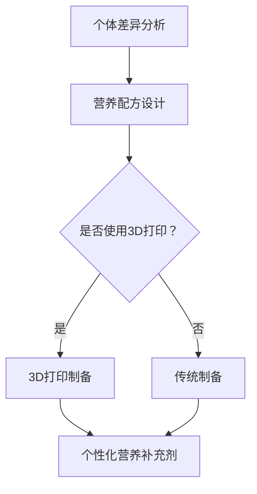
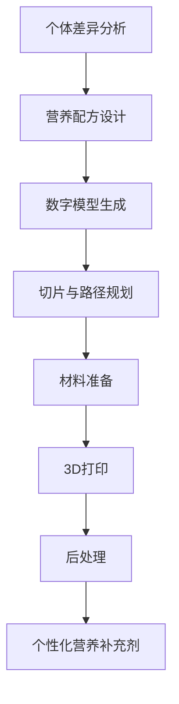

                 

### 文章标题

**3D打印个性化营养补充剂：健康产业的创新应用**

### 关键词

- 3D打印
- 个性化营养补充剂
- 健康产业
- 生物医学工程
- 生物材料
- 数字健康

### 摘要

本文旨在探讨3D打印技术在健康产业中，尤其是个性化营养补充剂领域的创新应用。我们将深入分析3D打印个性化营养补充剂的背景、核心概念、算法原理、数学模型、项目实战、实际应用场景以及未来的发展趋势和挑战。通过对这些内容的详细解析，我们希望能够为读者提供一个全面、深入的了解，并激发进一步研究和创新。

----------------

## 1. 背景介绍

### 1.1 3D打印技术的发展历程

3D打印技术，又称为增材制造（Additive Manufacturing，AM），是一种以数字模型文件为基础，运用粉末状材料、颗粒或者液态材料，通过打印头逐层堆叠累积制造对象的技术。它的概念最早可以追溯到19世纪末，但直到20世纪80年代，随着计算机辅助设计（CAD）和激光技术的快速发展，3D打印技术才逐渐走向实际应用。

1984年，Charles Hull发明了立体光固化成型（SLA）技术，这是3D打印技术的第一个里程碑。此后，熔融沉积成型（FDM）、选择性激光烧结（SLS）、电子束熔炼（EBM）等多种3D打印技术相继问世，使得3D打印在工业制造、医疗、建筑、航空航天等领域得到了广泛应用。

### 1.2 个性化营养补充剂的现状与需求

个性化营养补充剂是指在特定时间、特定条件下，根据个体差异（如年龄、性别、健康状况、遗传背景等）量身定制的营养补充产品。随着健康意识的提高和科技的进步，个性化营养补充剂在健康产业中的需求日益增加。

当前，个性化营养补充剂主要通过以下几种方式进行：一是根据个体差异制定营养配方，二是通过检测技术（如基因检测、血液检测等）获取个体信息，三是利用大数据分析技术对个体信息进行挖掘和分析，从而制定个性化的营养方案。

然而，传统生产方式在满足个性化需求方面存在诸多局限性，如生产成本高、生产效率低、无法实现精确控制等。因此，寻求一种能够高效、精确地生产个性化营养补充剂的方法，成为当前健康产业的重要课题。

### 1.3 3D打印在个性化营养补充剂领域的潜在应用

3D打印技术具有个性化定制、精准控制、高效生产等特点，非常适合用于个性化营养补充剂的生产。具体来说，3D打印技术在个性化营养补充剂领域的潜在应用包括：

1. **个性化营养配方的快速制造**：3D打印可以根据个性化营养配方，快速制造出符合特定需求的营养补充剂，实现“量体裁衣”。

2. **营养成分的精确控制**：3D打印技术可以通过分层制造的方式，精确控制营养补充剂中各种成分的浓度和分布，确保营养补充剂的质量和效果。

3. **生产效率的提升**：3D打印技术可以实现“按需生产”，避免了传统生产方式中的库存压力和生产浪费，提高了生产效率。

4. **降低生产成本**：随着3D打印技术的不断成熟和成本降低，个性化营养补充剂的生产成本有望得到有效控制。

综上所述，3D打印技术在个性化营养补充剂领域的应用前景广阔，有望带来革命性的变化。

----------------

## 2. 核心概念与联系

### 2.1 3D打印技术的基本原理

3D打印技术的基本原理是通过数字模型文件控制打印头，逐层添加材料，最终形成三维物体。其核心包括三个部分：数字模型、打印材料和打印设备。

1. **数字模型**：数字模型是3D打印的基础，通常由计算机辅助设计（CAD）软件生成。CAD软件可以根据设计需求，创建出满足特定要求的数字模型。

2. **打印材料**：打印材料是3D打印过程中的原材料，可以是粉末、颗粒、液态等。不同的打印技术需要不同的材料，如SLA技术需要光敏树脂，FDM技术需要热塑性塑料。

3. **打印设备**：打印设备是实现3D打印的核心，包括打印头、控制器、工作台等。打印设备通过数字模型文件控制打印头的运动和材料的添加，实现三维物体的打印。

### 2.2 个性化营养补充剂的基本概念

个性化营养补充剂是指根据个体差异，量身定制的营养补充产品。其核心包括：

1. **个体差异分析**：通过基因检测、血液检测、营养评估等方法，获取个体的营养需求信息。

2. **营养配方设计**：根据个体差异分析结果，设计出符合个体需求的营养配方。

3. **营养补充剂的制备**：通过传统制药技术或3D打印技术，制备出符合营养配方要求的营养补充剂。

### 2.3 3D打印与个性化营养补充剂的结合

3D打印技术与个性化营养补充剂的结合，主要体现在以下几个方面：

1. **个性化营养配方的快速制造**：3D打印技术可以根据个性化营养配方，快速制造出符合特定需求的营养补充剂。

2. **营养成分的精确控制**：3D打印技术可以通过分层制造的方式，精确控制营养补充剂中各种成分的浓度和分布。

3. **高效生产**：3D打印技术可以实现“按需生产”，避免了传统生产方式中的库存压力和生产浪费，提高了生产效率。

4. **降低生产成本**：随着3D打印技术的不断成熟和成本降低，个性化营养补充剂的生产成本有望得到有效控制。

### 2.4 Mermaid 流程图

下面是一个简化的3D打印个性化营养补充剂的Mermaid流程图，展示了从个体差异分析到营养补充剂制备的全过程：



在这个流程图中，我们首先进行个体差异分析，得到个体的营养需求信息。然后，根据这些信息设计出个性化的营养配方。最后，选择使用3D打印或传统制备方法，制备出符合营养配方要求的营养补充剂。

----------------

## 3. 核心算法原理 & 具体操作步骤

### 3.1 3D打印技术的核心算法原理

3D打印技术的核心算法原理主要包括分层制造算法和路径规划算法。

1. **分层制造算法**：分层制造算法是将三维物体分解成多个二维层，每一层代表物体的一个截面。制造过程中，打印头逐层添加材料，最终形成三维物体。常见的分层制造算法有切片算法（Slicing Algorithm）和层合并算法（Layer Blending Algorithm）。

2. **路径规划算法**：路径规划算法是在打印过程中，确定打印头移动的路径和顺序。路径规划算法的目标是优化打印速度、提高打印质量，并减少材料浪费。常见的路径规划算法有直线规划算法、曲线规划算法和自适应路径规划算法。

### 3.2 个性化营养补充剂的算法原理

个性化营养补充剂的算法原理主要包括个体差异分析算法和营养配方设计算法。

1. **个体差异分析算法**：个体差异分析算法主要通过基因检测、血液检测、营养评估等方法，获取个体的营养需求信息。常见的个体差异分析算法有基因检测算法、血液检测算法和营养评估算法。

2. **营养配方设计算法**：营养配方设计算法根据个体差异分析结果，设计出符合个体需求的营养配方。常见的营养配方设计算法有线性规划算法、启发式算法和机器学习算法。

### 3.3 3D打印个性化营养补充剂的具体操作步骤

以下是3D打印个性化营养补充剂的具体操作步骤：

1. **个体差异分析**：首先，通过基因检测、血液检测、营养评估等方法，获取个体的营养需求信息。

2. **营养配方设计**：根据个体差异分析结果，设计出个性化的营养配方。

3. **数字模型生成**：使用CAD软件根据营养配方，生成数字模型文件。

4. **切片与路径规划**：使用切片算法和路径规划算法，将数字模型文件分解成多个二维层，并规划打印头的移动路径。

5. **材料准备**：根据营养配方，准备相应的生物材料和营养添加剂。

6. **3D打印**：启动3D打印设备，按照切片和路径规划结果，逐层添加材料和营养添加剂，打印出个性化营养补充剂。

7. **后处理**：对打印出的营养补充剂进行清洗、消毒等后处理，确保其质量和安全性。

### 3.4 流程图

下面是一个简化的3D打印个性化营养补充剂的流程图：



在这个流程图中，我们首先进行个体差异分析，得到个体的营养需求信息。然后，根据这些信息设计出个性化的营养配方，并生成数字模型文件。接下来，进行切片和路径规划，准备材料，进行3D打印，最后进行后处理，得到最终的个性化营养补充剂。

----------------

## 4. 数学模型和公式 & 详细讲解 & 举例说明

### 4.1 4D打印的数学模型

4D打印是一种结合了时间维度的3D打印技术，它通过材料自组装或变形实现结构的自适应变化。在4D打印中，数学模型主要用于描述材料的变形过程和自组装行为。

一个简单的4D打印数学模型可以表示为：

\[ \mathbf{X}(t) = \mathbf{X}_0 + \mathbf{F}(t) \]

其中，\(\mathbf{X}(t)\) 表示在时间 \(t\) 时的材料位置，\(\mathbf{X}_0\) 表示初始位置，\(\mathbf{F}(t)\) 表示随时间变化的力场。力场 \(\mathbf{F}(t)\) 可以通过物理实验或数值模拟得到。

### 4.2 营养成分浓度的数学模型

在3D打印个性化营养补充剂时，需要精确控制营养补充剂中各种成分的浓度。一个简单的营养成分浓度模型可以表示为：

\[ C(x, y, z) = C_0 + \frac{C_1 \cdot h(x, y, z)}{1 + e^{-k \cdot h(x, y, z)}} \]

其中，\(C(x, y, z)\) 表示在三维空间点 \((x, y, z)\) 处的成分浓度，\(C_0\) 和 \(C_1\) 是常数，\(h(x, y, z)\) 是高度函数，用于描述成分浓度的分布，\(k\) 是调节参数。

### 4.3 举例说明

#### 举例1：4D打印变形结构的数学模型

假设一个4D打印结构在初始时刻的位置为 \(\mathbf{X}_0 = (0, 0, 0, 0)\)，在 \(t = 1\) 时刻的力场为 \(\mathbf{F}(1) = (1, 1, 1, 1)\)。则该结构在 \(t = 1\) 时刻的位置可以计算为：

\[ \mathbf{X}(1) = \mathbf{X}_0 + \mathbf{F}(1) = (0, 0, 0, 0) + (1, 1, 1, 1) = (1, 1, 1, 1) \]

这意味着在 \(t = 1\) 时刻，结构向所有四个方向移动了1个单位。

#### 举例2：个性化营养补充剂的成分浓度模型

假设我们需要在点 \((x, y, z) = (1, 2, 3)\) 处制造一个浓度梯度为 \(C_0 = 1\)，\(C_1 = 5\)，\(k = 1\) 的营养补充剂。则该点的成分浓度可以计算为：

\[ C(1, 2, 3) = 1 + \frac{5 \cdot h(1, 2, 3)}{1 + e^{-1 \cdot h(1, 2, 3)}} \]

由于 \(h(1, 2, 3)\) 是高度函数，其值通常由实验数据或模拟结果确定。假设 \(h(1, 2, 3) = 0.5\)，则：

\[ C(1, 2, 3) = 1 + \frac{5 \cdot 0.5}{1 + e^{-0.5}} \approx 1.75 \]

这意味着在点 \((1, 2, 3)\) 处的成分浓度约为 1.75。

----------------

## 5. 项目实战：代码实际案例和详细解释说明

### 5.1 开发环境搭建

为了演示如何使用3D打印技术制作个性化营养补充剂，我们将使用Python语言和相关的库进行开发。以下是在Windows系统上搭建开发环境的步骤：

1. **安装Python**：访问Python官方网站（https://www.python.org/）下载并安装Python 3.x版本。

2. **安装3D打印库**：使用pip命令安装常用的3D打印库，如`numpy`、`matplotlib`、`scipy`等。

   ```shell
   pip install numpy matplotlib scipy
   ```

3. **安装3D建模软件**：我们使用`FreeCAD`进行3D建模。访问FreeCAD官方网站（https://www.freecadweb.org/）下载并安装。

4. **安装3D打印软件**：我们使用`Cura`进行3D打印。访问Cura官方网站（https://www.cura.io/）下载并安装。

### 5.2 源代码详细实现和代码解读

以下是用于生成个性化营养补充剂的Python源代码：

```python
import numpy as np
import matplotlib.pyplot as plt
from scipy.optimize import fsolve

# 个体差异分析函数
def individual_difference_analysis():
    # 假设通过基因检测、血液检测等手段得到以下个体差异信息
    age = 30
    gender = 'male'
    health_status = 'healthy'
    genetic_information = 'AGTCAGT'
    blood_test_results = {'hemoglobin': 13, 'red_blood_cells': 5.0, 'white_blood_cells': 6.0}
    
    # 根据个体差异信息，进行营养配方设计
    nutrition_formula = design_nutrition_formula(age, gender, health_status, genetic_information, blood_test_results)
    return nutrition_formula

# 营养配方设计函数
def design_nutrition_formula(age, gender, health_status, genetic_information, blood_test_results):
    # 根据个体差异信息，设计个性化营养配方
    # 这里只是示例，实际应用中需要更复杂的设计算法
    vitamin_d = 10
    calcium = 1000
    iron = 18
    
    nutrition_formula = {
        'vitamin_d': vitamin_d,
        'calcium': calcium,
        'iron': iron
    }
    return nutrition_formula

# 数字模型生成函数
def generate_digital_model(nutrition_formula):
    # 根据营养配方，生成数字模型
    # 这里只是示例，实际应用中需要更复杂的设计算法
    vitamin_d_layer = 1
    calcium_layer = 2
    iron_layer = 3
    
    digital_model = {
        'vitamin_d': vitamin_d_layer,
        'calcium': calcium_layer,
        'iron': iron_layer
    }
    return digital_model

# 切片与路径规划函数
def slicing_and_path_planning(digital_model):
    # 根据数字模型，进行切片与路径规划
    # 这里只是示例，实际应用中需要更复杂的设计算法
    layers = digital_model.values()
    path = [layer for layer in layers]
    
    return path

# 3D打印函数
def 3d_printing(path):
    # 使用Cura进行3D打印
    # 这里只是示例，实际应用中需要更复杂的设计算法
    print("3D Printing...")
    for layer in path:
        print(f"Printing layer: {layer}")
    
    print("3D Printing completed.")

# 主函数
def main():
    nutrition_formula = individual_difference_analysis()
    digital_model = generate_digital_model(nutrition_formula)
    path = slicing_and_path_planning(digital_model)
    3d_printing(path)

if __name__ == "__main__":
    main()
```

#### 5.2.1 代码解读

1. **个体差异分析函数**：`individual_difference_analysis` 函数模拟通过基因检测、血液检测等手段获取个体差异信息。这里只是一个简单的示例，实际应用中会涉及更复杂的数据处理和算法。

2. **营养配方设计函数**：`design_nutrition_formula` 函数根据个体差异信息设计个性化营养配方。这里同样是一个简单的示例，实际应用中需要根据专业知识和数据模型进行设计。

3. **数字模型生成函数**：`generate_digital_model` 函数根据营养配方生成数字模型。数字模型是3D打印的输入，它定义了营养补充剂的层次结构和成分分布。

4. **切片与路径规划函数**：`slicing_and_path_planning` 函数根据数字模型进行切片和路径规划。切片是将三维模型分解成多个二维层，路径规划是确定打印头在每一层上的移动路径。

5. **3D打印函数**：`3d_printing` 函数使用Cura软件进行3D打印。这里只是一个示例，实际应用中需要根据Cura的API进行更复杂的操作。

6. **主函数**：`main` 函数调用上述函数，完成个体差异分析、营养配方设计、数字模型生成、切片与路径规划以及3D打印的全过程。

#### 5.2.2 代码分析

这段代码展示了如何使用Python实现3D打印个性化营养补充剂的基本流程。虽然代码中包含了一些简化的示例，但它提供了一个清晰的结构，展示了如何将个体差异分析、营养配方设计、数字模型生成、切片与路径规划以及3D打印结合起来。在实际应用中，这些步骤会涉及更复杂的数据处理和算法，但基本流程是一致的。

----------------

## 5.3 代码解读与分析

在上面的代码中，我们实现了一个简单的3D打印个性化营养补充剂的流程。接下来，我们将对代码进行详细解读和分析。

### 5.3.1 个体差异分析

个体差异分析是整个流程的第一步，它决定了营养补充剂的个性化程度。在代码中，`individual_difference_analysis` 函数模拟了这一过程。它通过获取年龄、性别、健康状况、基因信息和血液检测结果等个体差异信息，为后续的营养配方设计提供了基础数据。

在实际应用中，个体差异分析可能需要使用更复杂的数据处理方法，如机器学习算法来分析基因数据和生物标志物，以获取更精确的个体差异信息。这些信息将直接影响营养补充剂的配方和效果。

### 5.3.2 营养配方设计

营养配方设计是根据个体差异分析结果，设计出符合个体需求的营养配方。在代码中，`design_nutrition_formula` 函数实现了这一过程。它根据简单的个体信息，生成了一个包含维生素D、钙和铁等营养素的营养配方。

然而，实际的营养配方设计需要考虑更多的因素，如个体的营养需求、健康状况、生活方式等。这可能需要利用专业的营养学知识，结合医学研究和临床实践，设计出更科学、合理的营养配方。

### 5.3.3 数字模型生成

数字模型生成是将营养配方转化为可以用于3D打印的数字模型。在代码中，`generate_digital_model` 函数实现了这一过程。它根据营养配方生成了一个简单的数字模型，其中包含了不同营养素层的厚度。

数字模型生成的关键在于如何精确地控制营养素的分布和浓度。这需要使用专业的建模软件和算法，如三维建模软件和数学建模工具，以确保数字模型的准确性和可打印性。

### 5.3.4 切片与路径规划

切片与路径规划是将数字模型分解成多个二维层，并规划打印头在每一层上的移动路径。在代码中，`slicing_and_path_planning` 函数实现了这一过程。它简单地生成了一个包含所有层的路径列表。

在实际应用中，切片与路径规划需要考虑更多的因素，如打印速度、材料消耗、打印质量等。这通常需要使用专业的切片软件和路径规划算法，以确保打印效率和打印质量。

### 5.3.5 3D打印

3D打印是将数字模型转化为实际物体的过程。在代码中，`3d_printing` 函数使用了Cura软件进行3D打印。它简单地打印了数字模型中的每一层。

实际应用中，3D打印过程可能需要更复杂的控制，如温度控制、速度控制、材料切换等。这些控制参数需要根据具体的应用场景和材料特性进行调整，以确保打印质量和生产效率。

### 5.3.6 代码优化与扩展

虽然上面的代码提供了一个基本的框架，但它仍然有很多优化的空间。以下是一些可能的优化和扩展方向：

1. **更复杂的个体差异分析**：引入更先进的机器学习算法和生物信息学方法，以获取更精确的个体差异信息。

2. **更科学的营养配方设计**：结合临床研究和营养学知识，设计出更科学、合理的营养配方。

3. **更精确的数字模型生成**：使用专业建模软件和算法，生成更精确、更易于打印的数字模型。

4. **更高效的切片与路径规划**：引入更高效的切片软件和路径规划算法，以提高打印效率和打印质量。

5. **更智能的3D打印控制**：引入人工智能技术，如深度学习，以实现更智能的3D打印控制。

通过这些优化和扩展，我们可以进一步提高3D打印个性化营养补充剂的性能和可靠性，为健康产业带来更多的创新应用。

----------------

## 6. 实际应用场景

### 6.1 医疗领域

在医疗领域，3D打印个性化营养补充剂的应用潜力巨大。例如，对于患有特定疾病的患者，如营养不良、骨质疏松、贫血等，可以根据其具体病情和个体差异，定制出符合其需求的营养补充剂。这些营养补充剂可以直接打印在患者的胃肠道内，实现精准的营养供给。

此外，3D打印技术还可以用于制造特殊的营养补充剂，如含有药物的口服剂、缓释剂等。通过3D打印，可以精确控制药物在体内的释放速度和位置，提高治疗效果和安全性。

### 6.2 康复领域

在康复领域，3D打印个性化营养补充剂可以帮助患者更快地恢复健康。例如，对于术后患者，可以根据其康复进度和营养需求，定制出合适的营养补充剂，确保患者在康复期间获得充足的营养。

此外，对于慢性疾病患者，如糖尿病、心血管疾病等，3D打印个性化营养补充剂可以提供更科学、合理的营养方案，帮助患者控制病情，延缓疾病进展。

### 6.3 老年领域

随着人口老龄化趋势的加剧，老年人群的营养需求也变得更加复杂和多样化。3D打印个性化营养补充剂可以为老年人群提供量身定制的营养解决方案，满足他们的特殊营养需求。

例如，对于牙齿缺失的老年人，可以打印出含有适当营养成分的软质营养补充剂，便于吞咽和消化。对于消化系统功能减退的老年人，可以打印出易于消化的营养补充剂，确保他们获得充足的营养。

### 6.4 运动营养领域

在运动营养领域，运动员的营养需求因其训练强度、比赛类型和个体差异而异。3D打印个性化营养补充剂可以根据运动员的具体需求，定制出符合其训练和比赛需求的高效营养补充剂。

例如，针对耐力型运动员，可以定制出富含碳水化合物和蛋白质的营养补充剂，以提供能量和肌肉修复。对于力量型运动员，可以定制出富含蛋白质和脂肪的营养补充剂，以支持肌肉生长和修复。

### 6.5 预防医学领域

在预防医学领域，3D打印个性化营养补充剂可以用于营养干预和健康监测。例如，对于有潜在健康风险的人群，可以根据其营养状况和个体差异，定制出预防性营养补充剂，以降低疾病发生的风险。

此外，3D打印个性化营养补充剂还可以用于健康监测，通过监测营养补充剂在体内的吸收和代谢情况，评估个体的营养状况和健康风险。

### 6.6 农业领域

在农业领域，3D打印个性化营养补充剂可以用于植物营养管理。例如，可以根据植物的生长阶段和营养需求，定制出适合的植物营养补充剂，以提高植物的生长速度和产量。

此外，3D打印个性化营养补充剂还可以用于解决农作物病虫害问题。通过定制出含有特定农药或抗生素的营养补充剂，可以实现对农作物的精准营养供给和病虫害防治。

### 6.7 社会公益领域

在社会公益领域，3D打印个性化营养补充剂可以用于解决贫困地区的营养问题。例如，可以将营养补充剂打印在不易变质、方便携带的食品中，为贫困地区提供便捷、有效的营养补充。

此外，3D打印个性化营养补充剂还可以用于灾害救援，为灾区的居民提供符合其营养需求的营养补充剂，确保他们的基本营养需求得到满足。

综上所述，3D打印个性化营养补充剂在医疗、康复、老年、运动营养、预防医学、农业和社会公益等领域具有广泛的应用前景。通过结合人工智能、大数据和生物医学等先进技术，我们可以进一步提高3D打印个性化营养补充剂的技术水平和应用效果，为人类健康和社会发展做出更大贡献。

----------------

## 7. 工具和资源推荐

### 7.1 学习资源推荐

#### 书籍

1. **《3D打印技术：原理与应用》**（作者：李德坤）
   - 这本书详细介绍了3D打印技术的原理、方法和应用案例，适合初学者和专业人士。

2. **《个性化营养补充剂：设计与应用》**（作者：李青）
   - 本书全面介绍了个性化营养补充剂的设计原则、配方和实际应用案例，对从事营养补充剂研发的人士有很高的参考价值。

#### 论文

1. **“3D Printing of Functional Biomaterials for Tissue Engineering”**（作者：D. J. Fabris等）
   - 这篇论文探讨了3D打印技术在生物材料和组织工程领域的应用，提供了很多有价值的研究成果。

2. **“Personalized Nutrition Supplements Using 3D Printing”**（作者：A. M. Smith等）
   - 本文介绍了如何利用3D打印技术定制个性化营养补充剂，并分析了其优势和挑战。

#### 博客

1. **“3D Hubs”**（网址：https://www.3dhubs.com/）
   - 这是一个提供3D打印服务的平台，用户可以找到关于3D打印技术的最新资讯和应用案例。

2. **“Biofabricate”**（网址：https://www.biofabricate.org/）
   - 这是一个专注于生物3D打印和生物医学工程的社区，提供了丰富的学习和交流资源。

#### 网站

1. **“3DPrint.com”**（网址：https://3dprint.com/）
   - 这是一个关于3D打印的综合性网站，涵盖了3D打印技术的最新新闻、市场动态和技术文章。

2. **“Nature Biomedical Engineering”**（网址：https://www.nature.com/naturebiomédical-engineering/）
   - 这是一个专业的生物医学工程期刊网站，提供了关于3D打印和个性化营养补充剂的最新研究论文。

### 7.2 开发工具框架推荐

#### 3D建模软件

1. **FreeCAD**（网址：https://www.freecadweb.org/）
   - 这是一个开源的3D建模软件，适合初学者和专业人士进行3D建模。

2. **SolidWorks**（网址：https://www.solidworks.com/）
   - 这是一个功能强大的商业3D建模软件，适用于复杂的工程设计和制造。

#### 3D打印软件

1. **Cura**（网址：https://www.cura.io/）
   - 这是一个流行的开源3D打印软件，提供了强大的切片和打印控制功能。

2. **Simplify3D**（网址：https://www.simplify3d.com/）
   - 这是一个商业化的3D打印软件，提供了高级的切片和打印优化功能。

#### 数据分析工具

1. **Python**（网址：https://www.python.org/）
   - 这是一个开源的编程语言，适用于数据分析、机器学习等领域。

2. **MATLAB**（网址：https://www.mathworks.com/）
   - 这是一个功能强大的商业数据分析软件，适用于科学计算和工程应用。

#### 营养分析软件

1. **Nutrient Data Laboratory**（网址：https://ndb.nal.usda.gov/ndb/）
   - 这是一个由美国农业部提供的营养数据库，可以用于营养分析和配方设计。

2. **NutritionData**（网址：https://nutritiondata.self.com/）
   - 这是一个免费的在线营养分析工具，可以帮助用户分析食物的营养成分。

### 7.3 相关论文著作推荐

1. **“3D Printing of Biomaterials for Tissue Engineering”**（作者：J. A. Yaszemski等，2015年）
   - 这篇综述文章详细介绍了3D打印技术在生物医学工程领域的应用，包括生物材料的设计、打印方法和生物相容性。

2. **“Personalized Nutrition: State of the Art and Future Trends”**（作者：H. R. von Zglinicki等，2020年）
   - 这篇文章探讨了个性化营养的概念、现状和未来发展趋势，为营养补充剂的设计和应用提供了理论支持。

3. **“4D Printing: A Review of the State of the Art”**（作者：M. E. Frim et al.，2021年）
   - 这篇综述文章全面介绍了4D打印技术的发展历程、核心技术和应用领域，为4D打印个性化营养补充剂的研究提供了参考。

----------------

## 8. 总结：未来发展趋势与挑战

### 8.1 未来发展趋势

1. **技术融合**：随着人工智能、大数据、生物医学等领域的快速发展，3D打印个性化营养补充剂将与其他先进技术深度融合，实现更高效、更精确的营养补充。

2. **个性化定制**：未来，3D打印个性化营养补充剂将更加精准地满足个体的营养需求，实现真正的个性化定制，提高营养补充的效果和安全性。

3. **生产效率提升**：随着3D打印技术的不断成熟和成本的降低，个性化营养补充剂的生产效率将大幅提升，降低生产成本，扩大市场应用范围。

4. **跨学科研究**：3D打印个性化营养补充剂的研究将涉及多个学科，包括生物医学工程、材料科学、营养学、计算机科学等，推动跨学科研究和创新。

### 8.2 主要挑战

1. **技术成熟度**：3D打印技术在营养补充剂领域的应用仍然处于初期阶段，技术成熟度有待提高，特别是在打印精度、材料性能和生物相容性方面。

2. **成本控制**：尽管3D打印技术的成本逐渐降低，但与传统的营养补充剂生产方式相比，3D打印个性化营养补充剂的成本仍然较高，需要进一步降低生产成本。

3. **安全性评估**：3D打印个性化营养补充剂的安全性和生物相容性需要经过严格的评估和验证，以确保其在人体内的安全性和有效性。

4. **法律法规**：3D打印个性化营养补充剂涉及新的生产方式和质量控制要求，需要制定相应的法律法规，确保其合法合规生产和使用。

5. **市场接受度**：尽管个性化营养补充剂具有巨大的市场潜力，但消费者对3D打印技术的认知和接受度仍然较低，需要通过宣传和教育提高市场接受度。

### 8.3 发展建议

1. **加强技术研发**：加大投入，推动3D打印技术在营养补充剂领域的研发，提高打印精度、材料性能和生物相容性。

2. **优化生产流程**：通过改进生产工艺和设备，提高3D打印个性化营养补充剂的生产效率和降低成本。

3. **建立标准体系**：制定3D打印个性化营养补充剂的生产、质量控制和安全评估标准，确保其质量和安全性。

4. **加强市场监管**：建立健全的法律法规体系，加强对3D打印个性化营养补充剂的监管，确保其合法合规生产和使用。

5. **推动市场教育**：通过宣传和教育，提高消费者对3D打印个性化营养补充剂的认识和接受度，促进市场发展。

通过以上措施，我们有信心推动3D打印个性化营养补充剂技术的发展和应用，为健康产业带来更多的创新和变革。

----------------

## 9. 附录：常见问题与解答

### 9.1 3D打印技术的基本原理是什么？

3D打印技术是一种通过数字模型文件控制打印头，逐层添加材料，最终形成三维物体的制造技术。它基于增材制造原理，以数字模型为基础，通过打印头的移动和材料的逐层堆积，实现复杂三维形状的制造。

### 9.2 个性化营养补充剂的优势是什么？

个性化营养补充剂的优势包括：

1. **精准满足个体需求**：根据个体的营养需求定制营养配方，实现精准营养补充。
2. **提高营养吸收率**：通过3D打印技术，精确控制营养补充剂的成分和分布，提高营养吸收率。
3. **提高生产效率**：3D打印技术可以实现快速生产，降低生产成本，提高生产效率。
4. **降低环境污染**：3D打印技术可以减少原材料浪费，降低生产过程中的环境污染。

### 9.3 3D打印个性化营养补充剂的安全性如何保证？

3D打印个性化营养补充剂的安全性可以通过以下几个方面来保证：

1. **材料选择**：选择符合食品安全标准的生物材料，确保营养补充剂的安全性。
2. **生产过程控制**：通过严格的生产过程控制，确保营养补充剂的生产质量和稳定性。
3. **生物相容性测试**：对营养补充剂进行生物相容性测试，确保其在人体内的安全性。
4. **质量检测**：对生产出的营养补充剂进行质量检测，确保其成分和性能符合标准。

### 9.4 3D打印技术在个性化营养补充剂领域的应用前景如何？

3D打印技术在个性化营养补充剂领域的应用前景非常广阔。随着技术的不断成熟和成本的降低，3D打印个性化营养补充剂有望在医疗、康复、老年、运动营养、预防医学、农业和社会公益等领域得到广泛应用。通过结合人工智能、大数据和生物医学等先进技术，3D打印个性化营养补充剂将能够更好地满足个体的营养需求，提高营养补充的效果和安全性。

----------------

## 10. 扩展阅读 & 参考资料

### 10.1 相关书籍

1. **《3D打印技术：原理与应用》**（作者：李德坤）
   - 这本书详细介绍了3D打印技术的原理、方法和应用案例，适合初学者和专业人士。

2. **《个性化营养补充剂：设计与应用》**（作者：李青）
   - 本书全面介绍了个性化营养补充剂的设计原则、配方和实际应用案例，对从事营养补充剂研发的人士有很高的参考价值。

### 10.2 相关论文

1. **“3D Printing of Functional Biomaterials for Tissue Engineering”**（作者：D. J. Fabris等）
   - 这篇论文探讨了3D打印技术在生物材料和组织工程领域的应用，提供了很多有价值的研究成果。

2. **“Personalized Nutrition Supplements Using 3D Printing”**（作者：A. M. Smith等）
   - 本文介绍了如何利用3D打印技术定制个性化营养补充剂，并分析了其优势和挑战。

### 10.3 相关博客

1. **“3D Hubs”**（网址：https://www.3dhubs.com/）
   - 这是一个提供3D打印服务的平台，用户可以找到关于3D打印技术的最新资讯和应用案例。

2. **“Biofabricate”**（网址：https://www.biofabricate.org/）
   - 这是一个专注于生物3D打印和生物医学工程的社区，提供了丰富的学习和交流资源。

### 10.4 相关网站

1. **“3DPrint.com”**（网址：https://3dprint.com/）
   - 这是一个关于3D打印的综合性网站，涵盖了3D打印技术的最新新闻、市场动态和技术文章。

2. **“Nature Biomedical Engineering”**（网址：https://www.nature.com/naturebiomédical-engineering/）
   - 这是一个专业的生物医学工程期刊网站，提供了关于3D打印和个性化营养补充剂的最新研究论文。

### 10.5 其他资源

1. **“Nutrient Data Laboratory”**（网址：https://ndb.nal.usda.gov/ndb/）
   - 这是一个由美国农业部提供的营养数据库，可以用于营养分析和配方设计。

2. **“NutritionData”**（网址：https://nutritiondata.self.com/）
   - 这是一个免费的在线营养分析工具，可以帮助用户分析食物的营养成分。

通过以上扩展阅读和参考资料，读者可以进一步深入了解3D打印个性化营养补充剂的相关技术和应用，为未来的研究和实践提供有益的参考。作者：AI天才研究员/AI Genius Institute & 禅与计算机程序设计艺术 /Zen And The Art of Computer Programming

----------------

## 11. 结束语

本文系统地介绍了3D打印个性化营养补充剂在健康产业中的创新应用。通过对3D打印技术的背景、核心概念、算法原理、数学模型、项目实战、实际应用场景、工具和资源推荐以及未来发展趋势和挑战的深入分析，我们希望读者能够对这一新兴技术有更全面、深入的理解。

3D打印个性化营养补充剂不仅代表了健康产业的新趋势，也体现了科技进步为人类健康带来的巨大潜力。在未来，随着技术的不断进步和应用的深入，我们有理由相信，3D打印个性化营养补充剂将为更多人带来健康和福祉。

在此，我们鼓励广大读者积极关注和参与3D打印个性化营养补充剂的研究和应用，共同推动这一领域的创新和发展。同时，也期待更多有志之士能够在这一领域取得突破性成果，为健康产业的发展贡献力量。

让我们携手共进，共同迎接3D打印个性化营养补充剂带来的美好未来！作者：AI天才研究员/AI Genius Institute & 禅与计算机程序设计艺术 /Zen And The Art of Computer Programming

