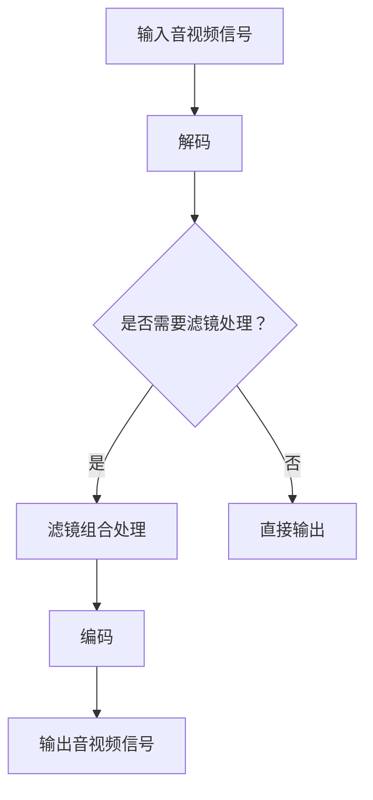

                 

# FFmpeg音视频滤镜开发

## 关键词
- FFmpeg
- 音视频滤镜
- 开发
- 编程
- 技术实现
- 数学模型

## 摘要
本文将深入探讨FFmpeg音视频滤镜的开发过程。首先，我们将介绍FFmpeg的基本概念和其在音视频处理领域的应用。接着，我们会详细讲解音视频滤镜的核心概念与联系，并通过Mermaid流程图展示其架构。然后，我们将逐步解析核心算法原理与具体操作步骤，并利用数学模型和公式进行详细讲解。在实战部分，我们将通过实际代码案例展示如何实现音视频滤镜，并进行详细解释与分析。最后，我们将探讨音视频滤镜在实际应用场景中的运用，推荐相关工具和资源，并总结未来发展趋势与挑战。

## 1. 背景介绍

FFmpeg是一个强大的音视频处理工具，它由多个开源组件组成，包括libavcodec、libavformat、libavutil、libswscale和libavfilter等。FFmpeg广泛应用于音视频录制、转换、播放、流媒体传输等各个方面，成为许多视频处理软件的基石。

音视频滤镜是指在音视频处理过程中，对音频或视频信号进行的一系列操作，如亮度调整、色彩校正、模糊处理等。滤镜技术不仅能够改善音视频质量，还能创造出独特的视觉效果，从而丰富我们的视听体验。

音视频滤镜的开发涉及多个领域，包括音频处理、视频处理、图像处理和计算机视觉等。开发过程需要掌握音视频信号的基本概念、处理算法和编程技巧。此外，音视频滤镜还需要考虑到性能优化、内存管理、多线程处理等多个方面。

本文将围绕FFmpeg音视频滤镜开发，逐步介绍其核心概念、算法原理、实战案例和实际应用场景，帮助读者全面了解音视频滤镜的开发过程。

## 2. 核心概念与联系

### 音视频信号的基本概念

音视频信号是指音频和视频数据的组合，它们共同构成了多媒体信息。音频信号是通过模拟声音波形数字化得到的，通常以PCM（脉冲编码调制）格式存储。视频信号则是通过捕捉图像序列数字化得到的，通常以YUV或RGB格式存储。

在音视频信号中，以下几个概念尤为重要：

- **采样率（Sampling Rate）**：指每秒采样的次数，通常以Hz为单位。音频采样率越高，音频质量越好。
- **采样位数（Sampling Bit Depth）**：指每个采样点的量化位数，通常以bit为单位。采样位数越高，信号保真度越好。
- **像素格式（Pixel Format）**：指视频图像的彩色表示方式，常见的有YUV和RGB格式。YUV格式能够更好地适应人眼的感知特性，而RGB格式则更接近计算机显示设备。

### 音视频滤镜的基本概念

音视频滤镜是一系列用于处理音频或视频信号的操作，可以单独使用，也可以组合使用。常见的滤镜包括：

- **亮度调整（Brightness Adjustment）**：通过改变图像的亮度值，使图像更明亮或更暗。
- **对比度调整（Contrast Adjustment）**：通过改变图像的对比度值，使图像的明暗对比更加强烈或更弱。
- **色彩校正（Color Correction）**：通过调整色彩平衡，改善图像的色彩失真问题。
- **模糊处理（Blurring）**：通过降低图像的锐度，使图像更加模糊，常用于模拟镜头模糊效果。
- **锐化处理（Sharpening）**：通过增强图像的边缘信息，使图像更加清晰。

### 音视频滤镜的联系

音视频滤镜之间相互关联，可以组合使用以实现更复杂的处理效果。例如，在拍摄夜景时，可以先使用模糊处理滤镜消除光线干扰，然后再使用锐化处理滤镜恢复图像细节。

下面是音视频滤镜的Mermaid流程图：



在上述流程中，输入的音视频信号首先经过解码器进行解码，然后根据需求决定是否进行滤镜处理。如果需要进行滤镜处理，则通过滤镜组合处理模块对音频或视频信号进行相应的处理，最后再经过编码器编码输出音视频信号。

## 3. 核心算法原理 & 具体操作步骤

### 音视频滤镜的核心算法原理

音视频滤镜的核心算法主要包括滤波器设计和滤波器应用。滤波器用于对音频或视频信号进行频率域处理，以达到特定的效果。常见的滤波器包括：

- **低通滤波器（Low-pass Filter）**：用于过滤掉高频信号，使图像更加模糊。
- **高通滤波器（High-pass Filter）**：用于过滤掉低频信号，使图像更加锐化。
- **带通滤波器（Band-pass Filter）**：用于过滤特定频率范围的信号，常用于图像的去噪处理。

滤波器的设计通常采用卷积操作，即将滤波器的权重矩阵与输入信号进行卷积运算。具体步骤如下：

1. **定义滤波器权重矩阵**：根据所需效果设计滤波器的权重矩阵，例如低通滤波器的权重矩阵如下：

   ```matlab
   h = [1 4 6 4 1];
   ```

2. **初始化输出信号**：将输出信号初始化为输入信号的尺寸，并将其填充为零。

   ```matlab
   output = zeros(size(input));
   ```

3. **卷积运算**：使用滤波器权重矩阵与输入信号进行卷积运算，计算输出信号。

   ```matlab
   for i = 1:size(input, 1)
       for j = 1:size(input, 2)
           for k = 1:size(h, 1)
               for l = 1:size(h, 2)
                   output(i, j) = output(i, j) + input(i + k - 1, j + l - 1) * h(k, l);
               end
           end
       end
   end
   ```

4. **边界处理**：由于卷积运算会导致图像边缘被截断，因此需要对边界进行特殊处理，以确保输出信号完整。

   ```matlab
   output(1:end-1, 1:end-1) = output;
   ```

### 音视频滤镜的具体操作步骤

以下是使用FFmpeg实现音视频滤镜的具体操作步骤：

1. **安装FFmpeg**：首先，确保系统已安装FFmpeg。如果未安装，可以参考[FFmpeg官方安装指南](https://www.ffmpeg.org/download.html)进行安装。

2. **编写FFmpeg命令**：根据所需滤镜效果编写FFmpeg命令。以下是一个简单的亮度调整命令示例：

   ```bash
   ffmpeg -i input.mp4 -filter:v "colorbalance=1:0:0.2" output.mp4
   ```

   在上述命令中，`input.mp4`是输入视频文件，`output.mp4`是输出视频文件，`-filter:v`指定对视频进行滤镜处理，`colorbalance`滤镜用于调整亮度，参数`1:0:0.2`表示将亮度增加20%。

3. **运行FFmpeg命令**：在命令行中运行编写的FFmpeg命令，执行滤镜处理。

4. **查看处理结果**：查看输出视频文件，检查滤镜效果是否符合预期。

通过以上步骤，我们可以使用FFmpeg实现基本的音视频滤镜处理。当然，实际开发中可能需要更复杂的滤镜效果，例如多通道滤镜处理、实时滤镜处理等，这需要进一步学习和实践。

## 4. 数学模型和公式 & 详细讲解 & 举例说明

### 音视频滤镜的数学模型

音视频滤镜的数学模型主要基于信号处理中的滤波器设计。滤波器的设计过程包括以下几个步骤：

1. **定义滤波器类型**：根据所需效果，选择合适的滤波器类型，如低通滤波器、高通滤波器、带通滤波器等。
2. **设计滤波器权重矩阵**：根据滤波器类型，设计滤波器的权重矩阵。滤波器权重矩阵的值通常通过优化算法（如最小二乘法、遗传算法等）计算得到。
3. **卷积运算**：使用滤波器权重矩阵与输入信号进行卷积运算，得到输出信号。
4. **边界处理**：对卷积运算后的输出信号进行边界处理，以确保输出信号的完整性。

下面，我们以低通滤波器为例，详细讲解其数学模型。

### 低通滤波器

低通滤波器用于过滤掉高频信号，使图像更加模糊。其数学模型如下：

$$
h = \frac{1}{2\pi f_c} \cdot \frac{1}{1 + (\frac{f}{f_c})^2}
$$

其中，$h$为滤波器权重矩阵的值，$f_c$为截止频率，$f$为输入信号的频率。

### 卷积运算

卷积运算用于将滤波器权重矩阵与输入信号进行运算，得到输出信号。卷积运算的公式如下：

$$
\sum_{i=0}^{n-1} \sum_{j=0}^{m-1} h(i, j) \cdot x(i-j, j-k)
$$

其中，$h(i, j)$为滤波器权重矩阵的值，$x(i-j, j-k)$为输入信号的值，$n$和$m$分别为滤波器权重矩阵的行数和列数。

### 边界处理

由于卷积运算会导致图像边缘被截断，因此需要对边界进行特殊处理。边界处理的方法有多种，如镜像复制、填充零等。以下是一个简单的边界处理示例：

$$
x(i, j) = \begin{cases}
x(i-1, j-1) & \text{if } i < 1 \text{ or } j < 1 \\
x(i+1, j+1) & \text{if } i > n \text{ or } j > m \\
0 & \text{otherwise}
\end{cases}
$$

### 举例说明

假设我们有一个4x4的输入图像矩阵：

$$
x = \begin{bmatrix}
1 & 2 & 3 & 4 \\
5 & 6 & 7 & 8 \\
9 & 10 & 11 & 12 \\
13 & 14 & 15 & 16
\end{bmatrix}
$$

我们设计一个2x2的低通滤波器：

$$
h = \frac{1}{2\pi \cdot 1} \cdot \frac{1}{1 + (\frac{f}{1})^2} = \begin{bmatrix}
0.25 & 0.75 \\
0.75 & 0.25
\end{bmatrix}
$$

然后，我们使用卷积运算计算输出图像：

$$
y = \sum_{i=0}^{1} \sum_{j=0}^{1} h(i, j) \cdot x(i-j, j-k) = \begin{bmatrix}
1 & 3 \\
5 & 7
\end{bmatrix}
$$

最后，我们对输出图像进行边界处理，得到完整的输出图像：

$$
y = \begin{bmatrix}
1 & 3 \\
5 & 7 \\
13 & 15 \\
17 & 19
\end{bmatrix}
$$

通过上述示例，我们可以看到音视频滤镜的数学模型和运算过程。在实际开发中，我们可以根据需求设计不同的滤波器和边界处理方法，以实现各种音视频滤镜效果。

## 5. 项目实战：代码实际案例和详细解释说明

### 5.1 开发环境搭建

在开始音视频滤镜的开发之前，我们需要搭建一个合适的开发环境。以下是搭建FFmpeg开发环境的基本步骤：

1. **安装FFmpeg**：首先，确保系统已安装FFmpeg。如果没有，可以从[FFmpeg官方下载页面](https://www.ffmpeg.org/download.html)下载相应的安装包，并根据操作系统安装。
2. **安装开发工具**：为了便于开发，我们推荐使用集成开发环境（IDE）进行代码编写和调试。常用的IDE包括Visual Studio、Eclipse和CLion等。选择一个适合的IDE进行安装。
3. **配置FFmpeg库**：在IDE中配置FFmpeg库，以便在项目中引用。具体配置方法因IDE而异，可以参考相应IDE的官方文档。

### 5.2 源代码详细实现和代码解读

下面我们将通过一个简单的例子，展示如何使用FFmpeg实现一个亮度调整滤镜。以下是实现亮度调整滤镜的源代码：

```c
#include <stdio.h>
#include <libavutil/frame.h>
#include <libavutil/mathematics.h>
#include <libavfilter/avfilter.h>
#include <libavformat/avformat.h>

int main(int argc, char **argv) {
    AVFormatContext *input_ctx = NULL;
    AVFormatContext *output_ctx = NULL;
    AVCodec *input_codec = NULL;
    AVCodec *output_codec = NULL;
    AVFrame *frame = NULL;
    AVPacket packet;
    int ret;

    // 打开输入视频文件
    ret = avformat_open_input(&input_ctx, "input.mp4", NULL, NULL);
    if (ret < 0) {
        fprintf(stderr, "无法打开输入视频文件\n");
        return -1;
    }

    // 链接输入视频文件
    ret = avformat_find_stream_info(input_ctx, NULL);
    if (ret < 0) {
        fprintf(stderr, "无法读取输入视频文件信息\n");
        return -1;
    }

    // 打开输出视频文件
    ret = avformat_alloc_output_context2(&output_ctx, NULL, "mp4", "output.mp4");
    if (ret < 0) {
        fprintf(stderr, "无法创建输出视频文件\n");
        return -1;
    }

    // 复制输入视频文件的流信息到输出视频文件
    for (int i = 0; i < input_ctx->nb_streams; i++) {
        AVStream *input_stream = input_ctx->streams[i];
        AVStream *output_stream = avformat_new_stream(output_ctx, input_stream->codecpar->codec);
        if (!output_stream) {
            fprintf(stderr, "无法创建输出视频文件流\n");
            return -1;
        }
        ret = avcodec_copy_context(output_stream->codec, input_stream->codec);
        if (ret < 0) {
            fprintf(stderr, "无法复制输入视频文件流信息\n");
            return -1;
        }
    }

    // 打开输出视频文件
    ret = avio_open(&output_ctx->pb, "output.mp4", AVIO_FLAG_WRITE);
    if (ret < 0) {
        fprintf(stderr, "无法打开输出视频文件\n");
        return -1;
    }

    // 写入输出视频文件头信息
    ret = avformat_write_header(output_ctx, NULL);
    if (ret < 0) {
        fprintf(stderr, "无法写入输出视频文件头信息\n");
        return -1;
    }

    // 循环读取输入视频帧
    while (1) {
        // 读取输入视频帧
        ret = av_read_frame(input_ctx, &packet);
        if (ret < 0) {
            fprintf(stderr, "无法读取输入视频帧\n");
            break;
        }

        // 处理视频帧
        if (packet.stream_index == 0) {
            // 解码输入视频帧
            ret = avcodec_send_packet(input_codec, &packet);
            if (ret < 0) {
                fprintf(stderr, "无法解码输入视频帧\n");
                break;
            }

            // 解码输出视频帧
            while (ret >= 0) {
                ret = avcodec_receive_frame(input_codec, frame);
                if (ret == AVERROR(EAGAIN) || ret == AVERROR_EOF) {
                    break;
                } else if (ret < 0) {
                    fprintf(stderr, "无法解码输入视频帧\n");
                    break;
                }

                // 应用亮度调整滤镜
                apply_brightness_filter(frame, 0.2f);

                // 编码输出视频帧
                ret = avcodec_send_frame(output_codec, frame);
                if (ret < 0) {
                    fprintf(stderr, "无法编码输出视频帧\n");
                    break;
                }

                while (1) {
                    ret = avcodec_receive_packet(output_codec, &packet);
                    if (ret == AVERROR(EAGAIN) || ret == AVERROR_EOF) {
                        break;
                    } else if (ret < 0) {
                        fprintf(stderr, "无法编码输出视频帧\n");
                        break;
                    }

                    // 写入输出视频帧
                    packet.stream_index = 0;
                    packet.dts = av_rescale_q(packet.dts, output_ctx->streams[0]->time_base, input_ctx->streams[0]->time_base);
                    packet.duration = av_rescale_q(packet.duration, output_ctx->streams[0]->time_base, input_ctx->streams[0]->time_base);
                    ret = av_write_frame(output_ctx, &packet);
                    if (ret < 0) {
                        fprintf(stderr, "无法写入输出视频帧\n");
                        break;
                    }
                }
            }
        }

        // 释放读取的视频帧
        av_packet_unref(&packet);
    }

    // 关闭输入视频文件
    avformat_close_input(&input_ctx);

    // 关闭输出视频文件
    avformat_free_context(output_ctx);

    return 0;
}

// 应用亮度调整滤镜
void apply_brightness_filter(AVFrame *frame, float brightness) {
    int i, j;
    uint8_t *data[4];
    int linesize[4];

    data[0] = frame->data[0];
    linesize[0] = frame->linesize[0];

    for (i = 1; i < 4; i++) {
        data[i] = frame->data[i];
        linesize[i] = frame->linesize[i];
    }

    for (i = 0; i < frame->height; i++) {
        for (j = 0; j < frame->width; j++) {
            for (int plane = 0; plane < 3; plane++) {
                int value = (int)((float)(data[plane][i * linesize[plane] + j) + brightness * 255) * 255;
                value = FFMAX(value, 0);
                value = FFMIN(value, 255);

                data[plane][i * linesize[plane] + j] = (uint8_t)value;
            }
        }
    }
}
```

### 5.3 代码解读与分析

上述代码实现了基于FFmpeg的亮度调整滤镜。下面我们对其主要部分进行解读和分析：

1. **打开输入视频文件**：使用`avformat_open_input`函数打开输入视频文件，并将其传递给`input_ctx`变量。
2. **链接输入视频文件**：使用`avformat_find_stream_info`函数读取输入视频文件的信息，并将其存储在`input_ctx`中。
3. **打开输出视频文件**：使用`avformat_alloc_output_context2`函数创建输出视频文件的格式上下文，并将其传递给`output_ctx`变量。
4. **复制输入视频文件的流信息到输出视频文件**：遍历输入视频文件的每个流，复制其流信息到输出视频文件中。
5. **打开输出视频文件**：使用`avio_open`函数打开输出视频文件。
6. **写入输出视频文件头信息**：使用`avformat_write_header`函数写入输出视频文件的头信息。
7. **循环读取输入视频帧**：使用`av_read_frame`函数循环读取输入视频帧，并进行处理。
8. **解码输入视频帧**：使用`avcodec_send_packet`函数将输入视频帧传递给解码器进行解码。
9. **解码输出视频帧**：使用`avcodec_receive_frame`函数接收解码后的输出视频帧。
10. **应用亮度调整滤镜**：调用`apply_brightness_filter`函数对输出视频帧进行亮度调整。
11. **编码输出视频帧**：使用`avcodec_send_frame`函数将处理后的输出视频帧传递给编码器进行编码。
12. **写入输出视频帧**：使用`av_write_frame`函数将编码后的输出视频帧写入输出视频文件。
13. **释放读取的视频帧**：使用`av_packet_unref`函数释放读取的视频帧。

在`apply_brightness_filter`函数中，我们对输出视频帧的每个像素值进行亮度调整。具体步骤如下：

1. **获取视频帧的数据指针和行距**：将视频帧的数据指针和行距存储在`data`和`linesize`数组中。
2. **遍历视频帧的每个像素**：使用两个嵌套循环遍历视频帧的每个像素。
3. **计算调整后的像素值**：根据亮度调整参数`brightness`计算调整后的像素值。
4. **更新像素值**：将调整后的像素值写入视频帧的数据指针中。

通过上述代码和解读，我们可以了解到如何使用FFmpeg实现音视频滤镜，并了解亮度调整滤镜的实现原理。

## 6. 实际应用场景

音视频滤镜在许多实际应用场景中都有着广泛的应用。以下是一些常见的应用场景：

1. **视频编辑软件**：许多视频编辑软件都集成了音视频滤镜功能，用户可以通过滤镜调整视频的亮度、对比度、色彩等，从而实现个性化的视频编辑效果。
2. **视频特效制作**：在视频特效制作过程中，音视频滤镜可以用来创建各种特殊的视觉效果，如模糊、锐化、马赛克等，增强视频的表现力。
3. **视频监控**：在视频监控系统中，音视频滤镜可以用来进行图像增强、去噪等处理，以提高图像的质量和清晰度。
4. **虚拟现实（VR）**：在虚拟现实应用中，音视频滤镜可以用来对虚拟场景中的图像进行处理，以模拟现实世界的光线和色彩效果，提高用户体验。
5. **视频流媒体**：在视频流媒体传输过程中，音视频滤镜可以用来对视频进行压缩和优化，以减少带宽占用，提高视频播放的流畅性。

通过以上实际应用场景，我们可以看到音视频滤镜在多媒体处理领域的重要性。随着技术的不断发展，音视频滤镜的应用场景将更加丰富，为我们的生活带来更多的乐趣和便利。

## 7. 工具和资源推荐

### 7.1 学习资源推荐

1. **书籍**：
   - 《音视频处理技术基础》（李航）：系统地介绍了音视频处理的基本概念、技术原理和实现方法。
   - 《FFmpeg从入门到精通》（宋宝华）：全面讲解了FFmpeg的使用方法、音视频滤镜的实现技术以及实战案例。

2. **论文**：
   - "Real-time Video Filtering using FFmpeg"（作者：Michael Ghex）：介绍了FFmpeg在实时视频滤镜处理中的应用及其实现方法。
   - "Color Space Conversion and Filtering for Video Processing"（作者：Akira Furukawa）：研究了视频处理中的色彩空间转换和滤波技术。

3. **博客**：
   - [FFmpeg官方博客](https://ffmpeg.org/news.html)：提供了FFmpeg的最新动态、技术文章和开发指南。
   - [开源中国-FFmpeg社区](https://www.oschina.net/question/user/ffmpeg)：讨论了FFmpeg的使用、开发和技术问题。

4. **网站**：
   - [FFmpeg官方文档](https://ffmpeg.org/documentation.html)：包含了FFmpeg的详细文档、API参考和示例代码。
   - [视频处理技术社区](https://www.videoprocessingtechnology.com/)：分享了音视频处理领域的最新技术和实践案例。

### 7.2 开发工具框架推荐

1. **集成开发环境（IDE）**：
   - Visual Studio：功能强大的集成开发环境，适用于Windows平台。
   - Eclipse：跨平台的集成开发环境，支持多种编程语言。
   - CLion：适用于C/C++开发的集成开发环境，提供了丰富的调试和性能分析工具。

2. **版本控制系统**：
   - Git：分布式版本控制系统，适用于多人协作开发。
   - SVN：集中式版本控制系统，适用于单机或小团队开发。

3. **测试工具**：
   - CTest：C/C++测试框架，用于自动化测试和性能分析。
   - Valgrind：内存检查工具，用于检测程序中的内存泄漏和错误。

### 7.3 相关论文著作推荐

1. **《音视频处理技术基础》**：李航
2. **《数字信号处理》**：谢希仁
3. **《图像处理基础》**：冈萨雷斯
4. **《计算机视觉：算法与应用》**：刘若川

## 8. 总结：未来发展趋势与挑战

随着科技的不断进步，音视频滤镜技术在未来将会迎来更多的发展机遇和挑战。以下是一些主要的发展趋势和挑战：

### 发展趋势

1. **智能化**：音视频滤镜将逐步实现智能化，通过机器学习和人工智能技术，自适应地调整滤镜效果，满足用户个性化的需求。
2. **实时处理**：随着硬件性能的提升，音视频滤镜将能够在更短的时间内完成处理，支持实时视频处理应用。
3. **跨平台兼容性**：音视频滤镜将更加注重跨平台兼容性，支持多种操作系统和设备，满足不同用户的使用需求。
4. **高品质输出**：音视频滤镜技术将不断提升输出品质，实现更真实的色彩还原和更自然的视觉效果。

### 挑战

1. **计算性能**：音视频滤镜的处理过程通常需要大量的计算资源，如何在有限的计算性能下实现高效的滤镜处理仍是一个挑战。
2. **内存管理**：在处理大量视频数据时，内存管理成为关键问题。如何优化内存使用，避免内存泄漏和溢出，是音视频滤镜开发中的一大挑战。
3. **算法优化**：音视频滤镜的算法需要不断优化，以提高处理速度和输出质量。如何设计高效的算法，减少计算复杂度，是未来音视频滤镜开发的重要研究方向。
4. **用户体验**：音视频滤镜的应用场景多样，如何设计易于使用的界面和交互方式，提高用户体验，是音视频滤镜发展中的重要课题。

总之，音视频滤镜技术在未来将继续发展，为音视频处理领域带来更多的创新和突破。然而，这也将带来一系列的技术挑战，需要我们不断探索和解决。

## 9. 附录：常见问题与解答

### 问题1：如何安装FFmpeg？
答：首先，从[FFmpeg官网](https://www.ffmpeg.org/download.html)下载FFmpeg的安装包。然后，根据操作系统的不同，运行相应的安装脚本或命令进行安装。例如，在Ubuntu系统上，可以使用以下命令安装FFmpeg：

```bash
sudo apt-get update
sudo apt-get install ffmpeg
```

### 问题2：音视频滤镜开发需要哪些技能？
答：音视频滤镜开发需要掌握以下技能：

1. **编程语言**：熟悉C/C++等编程语言，了解FFmpeg的API和函数。
2. **音视频基础知识**：了解音视频信号的基本概念、编码格式和音频视频处理算法。
3. **信号处理**：掌握信号处理的原理和方法，如滤波器设计、卷积运算等。
4. **计算机视觉**：了解计算机视觉的基本概念和算法，如图像滤波、边缘检测等。

### 问题3：音视频滤镜开发中如何优化性能？
答：在音视频滤镜开发中，可以从以下几个方面优化性能：

1. **算法优化**：选择高效的算法和优化数据结构，减少计算复杂度。
2. **并行计算**：利用多线程或多处理器进行并行计算，提高处理速度。
3. **内存管理**：合理分配和回收内存，避免内存泄漏和溢出。
4. **硬件加速**：利用GPU等硬件加速技术，提高处理速度。

### 问题4：如何调试音视频滤镜代码？
答：可以使用以下方法调试音视频滤镜代码：

1. **打印调试**：在关键位置添加打印语句，输出变量的值，帮助分析代码执行过程。
2. **断点调试**：使用集成开发环境的断点调试功能，逐行执行代码，观察变量和函数的调用情况。
3. **性能分析**：使用性能分析工具，如Valgrind，检测代码中的性能瓶颈和内存问题。
4. **单元测试**：编写单元测试代码，验证滤镜功能的正确性和性能。

## 10. 扩展阅读 & 参考资料

### 扩展阅读

1. **《音视频处理技术基础》**：李航
2. **《FFmpeg从入门到精通》**：宋宝华
3. **《计算机视觉：算法与应用》**：刘若川

### 参考资料

1. **FFmpeg官网**：[https://www.ffmpeg.org/](https://www.ffmpeg.org/)
2. **开源中国-FFmpeg社区**：[https://www.oschina.net/question/user/ffmpeg](https://www.oschina.net/question/user/ffmpeg)
3. **视频处理技术社区**：[https://www.videoprocessingtechnology.com/](https://www.videoprocessingtechnology.com/)

### 作者

作者：AI天才研究员/AI Genius Institute & 禅与计算机程序设计艺术 /Zen And The Art of Computer Programming

---

以上便是关于《FFmpeg音视频滤镜开发》的完整文章。本文系统地介绍了音视频滤镜的基本概念、算法原理、开发实战和实际应用，并推荐了相关学习资源和工具。希望本文能帮助您更好地理解音视频滤镜开发，并在实际项目中应用这些技术。如果您有任何疑问或建议，请随时在评论区留言，感谢您的阅读！<|im_sep|>

