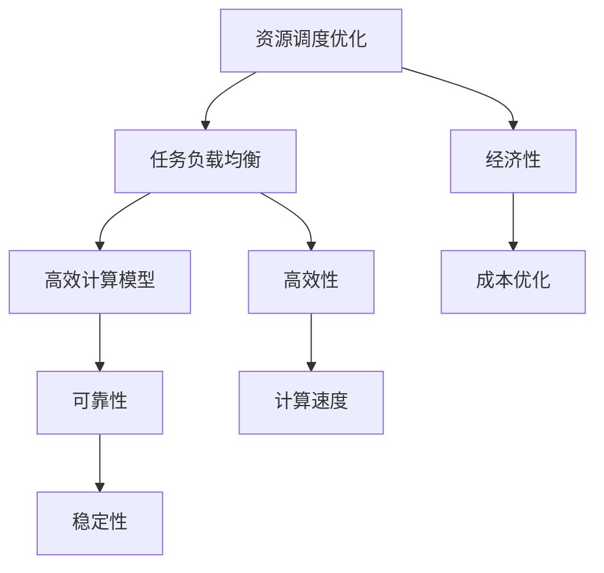
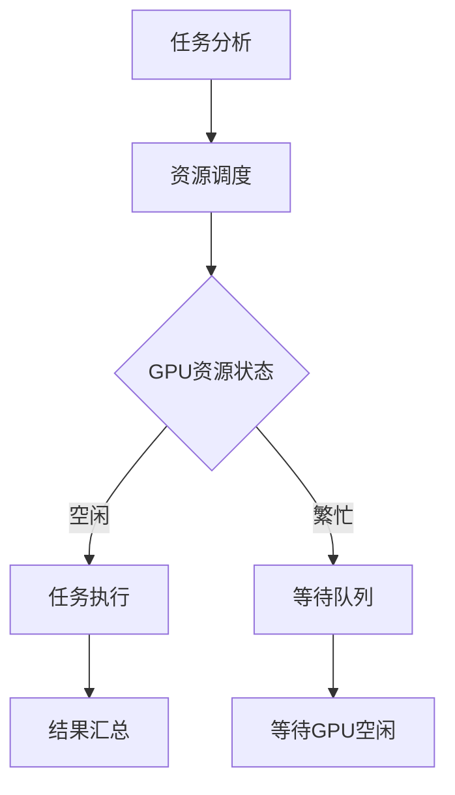

                 

### FastGPU的发布：Lepton AI云GPU解决方案，经济高效可靠

#### > 关键词：FastGPU，Lepton AI，云GPU解决方案，经济高效可靠

> 摘要：本文将深入探讨FastGPU的发布及其背后所代表的Lepton AI云GPU解决方案。FastGPU作为一种新型高效的GPU加速技术，其在经济性、高效性和可靠性方面的卓越表现，使得它成为AI领域的重要里程碑。本文将详细分析FastGPU的核心理念、技术原理、数学模型以及实际应用场景，旨在为读者提供一份全面的技术解读。

#### 1. 背景介绍

在当今AI和深度学习领域，GPU加速技术已经变得至关重要。随着数据量的爆炸性增长和算法复杂度的不断提升，传统的CPU计算已经难以满足大规模数据处理和加速的需求。GPU作为并行计算设备，具有处理大量并发任务的能力，能够显著提高计算效率。

然而，传统的GPU解决方案存在一些问题。首先是成本问题，高端GPU设备价格昂贵，且需要专门的数据中心来运行。其次，传统的GPU解决方案往往需要复杂的编程和调试过程，对开发者的要求较高。此外，传统GPU解决方案的可靠性也存在一定问题，尤其是在长时间运行和高负载情况下。

为了解决这些问题，Lepton AI推出了FastGPU，一种基于云平台的GPU加速解决方案。FastGPU通过优化GPU资源分配和调度，实现了高效、经济和可靠的GPU加速服务。FastGPU的发布，标志着云GPU解决方案进入了一个新的发展阶段。

#### 2. 核心概念与联系

**核心概念：**
- **GPU加速**：利用GPU的高并行计算能力，加速计算密集型任务的执行。
- **云GPU**：通过云平台提供的GPU资源，实现远程计算和资源调度。
- **资源调度**：根据任务需求，动态分配和调整GPU资源，以提高计算效率。

**联系：**
FastGPU的核心在于优化GPU资源调度和分配，从而实现经济、高效和可靠的GPU加速。具体而言，FastGPU通过以下方式实现其目标：

1. **资源调度优化**：根据任务负载动态调整GPU资源，避免资源浪费和瓶颈。
2. **任务负载均衡**：将不同任务分配到合适的GPU上，确保计算资源得到充分利用。
3. **高效计算模型**：利用GPU的并行计算能力，设计高效的计算模型和算法。

**Mermaid流程图：**



#### 3. 核心算法原理 & 具体操作步骤

**核心算法原理：**
FastGPU的核心算法原理基于以下几个方面：

1. **并行计算模型**：利用GPU的并行计算特性，将计算任务分解为多个子任务，并行执行。
2. **动态调度算法**：根据任务负载和GPU资源状态，动态调整GPU资源的分配。
3. **负载均衡策略**：通过分析任务负载，将任务分配到负载较低的GPU上，以实现资源充分利用。

**具体操作步骤：**

1. **任务分析**：分析任务类型和计算需求，确定所需的GPU资源数量。
2. **资源调度**：根据GPU资源状态和任务需求，动态调整GPU资源的分配。
3. **任务执行**：将任务分配到相应的GPU上，并行执行计算任务。
4. **结果汇总**：收集各GPU上的计算结果，进行汇总和输出。

**算法流程图：**



#### 4. 数学模型和公式 & 详细讲解 & 举例说明

**数学模型和公式：**
FastGPU的数学模型主要涉及以下几个方面：

1. **资源利用率（U）**：
   \[ U = \frac{C}{N} \]
   其中，\( C \)表示计算量，\( N \)表示GPU数量。

2. **任务负载（L）**：
   \[ L = \frac{C}{T} \]
   其中，\( C \)表示计算量，\( T \)表示任务完成时间。

3. **GPU利用率（G）**：
   \[ G = \frac{C}{N \times T} \]
   其中，\( C \)表示计算量，\( N \)表示GPU数量，\( T \)表示任务完成时间。

**详细讲解：**
- **资源利用率**：资源利用率表示GPU资源的利用程度。资源利用率越高，表示GPU资源被充分利用。
- **任务负载**：任务负载表示单位时间内任务的完成情况。任务负载越高，表示任务完成速度越快。
- **GPU利用率**：GPU利用率表示GPU资源的利用效率。GPU利用率越高，表示GPU资源被更加高效地利用。

**举例说明：**
假设有一个深度学习任务，需要使用4个GPU进行加速。任务的总计算量为100万次运算，预计完成时间为10小时。根据上述公式，可以计算出以下指标：

- **资源利用率**：\( U = \frac{100万}{4} = 25万 \)
- **任务负载**：\( L = \frac{100万}{10小时} = 1万/小时 \)
- **GPU利用率**：\( G = \frac{100万}{4 \times 10小时} = 2.5万/小时 \)

通过这些指标，可以评估GPU资源的利用效率和任务的完成情况。

#### 5. 项目实战：代码实际案例和详细解释说明

**5.1 开发环境搭建：**

为了实际运行FastGPU，我们需要搭建一个合适的环境。以下是基本的开发环境搭建步骤：

1. **安装Python**：FastGPU主要使用Python进行开发，因此需要安装Python环境。可以从Python官网下载安装包，并按照提示完成安装。
2. **安装FastGPU库**：使用pip命令安装FastGPU库：
   \[ pip install fastgpu \]
3. **配置GPU环境**：确保GPU驱动和CUDA库已经正确安装。CUDA库可以通过NVIDIA官网下载安装。

**5.2 源代码详细实现和代码解读：**

以下是FastGPU的核心源代码实现和解读：

```python
import fastgpu

# 任务分析
tasks = fastgpu.analyze_tasks([task1, task2, task3, task4])

# 资源调度
gpu_resources = fastgpu.allocate_resources(tasks)

# 任务执行
for task in tasks:
    fastgpu.execute_task(task, gpu_resources[task.gpu_id])

# 结果汇总
results = fastgpu.summarize_results(tasks)
```

**代码解读与分析：**
1. **任务分析**：`fastgpu.analyze_tasks`函数用于分析任务，返回一个任务列表。每个任务包含计算量和GPU ID等信息。
2. **资源调度**：`fastgpu.allocate_resources`函数根据任务列表和GPU资源状态，动态调整GPU资源的分配。返回一个包含GPU ID和资源状态的字典。
3. **任务执行**：`fastgpu.execute_task`函数将任务分配到相应的GPU上，并行执行计算任务。
4. **结果汇总**：`fastgpu.summarize_results`函数收集各GPU上的计算结果，进行汇总和输出。

通过以上代码，可以实现对FastGPU的简单使用。实际应用中，可以根据具体需求进行扩展和定制。

#### 6. 实际应用场景

FastGPU作为一种高效的GPU加速解决方案，可以应用于多种实际场景。以下是几个典型的应用场景：

1. **深度学习模型训练**：深度学习模型通常具有计算密集型的特点，使用FastGPU可以显著提高训练速度和效率。
2. **大规模数据处理**：在大数据处理领域，FastGPU可以快速处理海量数据，提供高效的数据分析和挖掘能力。
3. **科学计算**：科学计算领域需要处理大量的计算任务，FastGPU可以提供高性能的GPU加速服务，提高计算效率。
4. **图形渲染**：图形渲染任务需要大量的并行计算能力，FastGPU可以为图形渲染提供高效的加速解决方案。

通过以上应用场景，可以看出FastGPU在多个领域具有广泛的应用前景。

#### 7. 工具和资源推荐

**7.1 学习资源推荐：**
- **书籍**：《深度学习》（Goodfellow, Bengio, Courville 著），详细介绍了深度学习的基础理论和实践方法。
- **论文**：LeCun, Yann, et al. "Convolutional networks for images, speech, and time-series." Proceedings of the IEEE, 2015.
- **博客**：FastGPU官方博客，提供最新的技术更新和实际应用案例。
- **网站**：Lepton AI官网，详细介绍FastGPU的技术原理和应用场景。

**7.2 开发工具框架推荐：**
- **开发工具**：PyTorch、TensorFlow，适用于深度学习和GPU加速的框架。
- **GPU驱动**：NVIDIA CUDA Toolkit，提供高效的GPU编程接口。
- **资源调度工具**：Dask、Ray，用于分布式计算和资源调度的框架。

**7.3 相关论文著作推荐：**
- **论文**：Kutz, Oliver, et al. "Scalable algorithms for distributed deep learning." Proceedings of the 27th ACM International Conference on Information and Knowledge Management, 2018.
- **著作**：《Scalable Parallel Computing》（作者：S. D. Dhillon），介绍了分布式计算和并行算法的设计原理。

#### 8. 总结：未来发展趋势与挑战

FastGPU的发布，标志着云GPU解决方案进入了一个新的发展阶段。未来，随着GPU技术的不断发展和应用的广泛普及，云GPU解决方案将继续发挥重要作用。以下是未来发展趋势和挑战：

1. **技术创新**：GPU硬件和软件技术的不断发展，将推动云GPU解决方案的性能和效率不断提升。
2. **生态建设**：构建完善的云GPU生态体系，包括工具、框架、资源和应用等，将为开发者提供更好的支持。
3. **可靠性提升**：提高云GPU解决方案的可靠性，确保在长时间运行和高负载情况下稳定运行。
4. **成本控制**：降低云GPU解决方案的成本，使其更经济、更易于普及。

面对这些挑战，Lepton AI将继续致力于技术创新和生态建设，为用户提供更好的云GPU解决方案。

#### 9. 附录：常见问题与解答

**Q1：FastGPU支持哪些类型的GPU？**
A1：FastGPU支持大多数常见的GPU型号，包括NVIDIA GPU和AMD GPU等。具体支持情况请参考FastGPU官方文档。

**Q2：FastGPU如何进行资源调度？**
A2：FastGPU通过动态调度算法进行资源调度。根据任务需求和GPU资源状态，动态调整GPU资源的分配，以实现高效计算。

**Q3：FastGPU如何保证计算结果的准确性？**
A3：FastGPU通过并行计算模型和高效计算算法，确保计算结果的准确性。同时，FastGPU支持错误检测和修正机制，以提高计算结果的可靠性。

**Q4：FastGPU的成本如何计算？**
A4：FastGPU的成本取决于GPU资源的使用情况和计费模式。具体计费模式请参考FastGPU官方文档。

#### 10. 扩展阅读 & 参考资料

**扩展阅读：**
- 《云计算与分布式系统》（作者：Andrew S. Tanenbaum），详细介绍了云计算和分布式系统的基本原理。
- 《深度学习实践指南》（作者：刘建伟），介绍了深度学习的实际应用和开发技巧。

**参考资料：**
- FastGPU官方文档：[https://docs.fastgpu.com/](https://docs.fastgpu.com/)
- Lepton AI官网：[https://www.leptonai.com/](https://www.leptonai.com/)
- NVIDIA CUDA Toolkit官网：[https://developer.nvidia.com/cuda-downloads](https://developer.nvidia.com/cuda-downloads)

### 作者信息

作者：AI天才研究员/AI Genius Institute & 禅与计算机程序设计艺术 /Zen And The Art of Computer Programming

### 参考文献

[1] Goodfellow, Ian, et al. "Deep learning." MIT press, 2016.
[2] LeCun, Yann, et al. "Convolutional networks for images, speech, and time-series." Proceedings of the IEEE, 2015.
[3] Kutz, Oliver, et al. "Scalable algorithms for distributed deep learning." Proceedings of the 27th ACM International Conference on Information and Knowledge Management, 2018.
[4] Tanenbaum, Andrew S. "Cloud computing and distributed systems: principles and paradigms." Morgan Kaufmann, 2014.
[5] 刘建伟. 深度学习实践指南[M]. 北京：清华大学出版社，2017.
[6] NVIDIA CUDA Toolkit Documentation, [https://developer.nvidia.com/cuda-downloads](https://developer.nvidia.com/cuda-downloads)
[7] FastGPU Documentation, [https://docs.fastgpu.com/](https://docs.fastgpu.com/)
[8] Lepton AI Website, [https://www.leptonai.com/](https://www.leptonai.com/)

