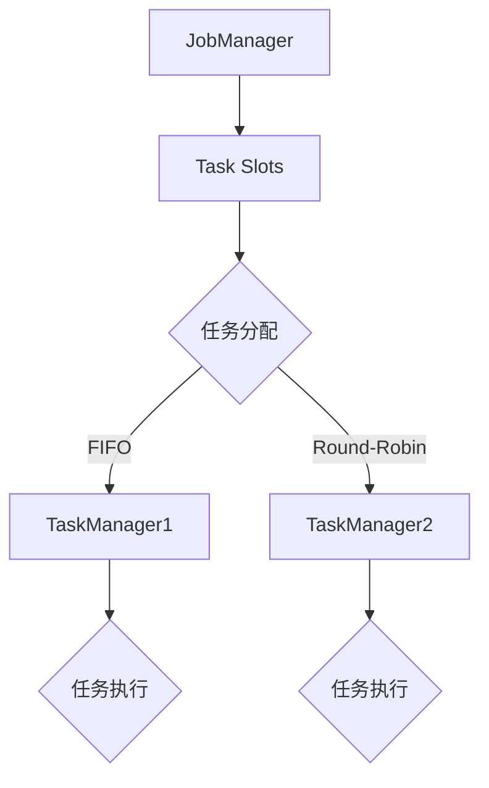

                 

# Flink Dispatcher原理与代码实例讲解

## 摘要

本文旨在深入探讨Flink Dispatcher的核心原理，并提供代码实例以展示其实际应用。我们将从背景介绍开始，逐步解析Flink Dispatcher的架构和功能，并详细讲解其工作流程和算法。此外，还将通过实际项目案例，对Flink Dispatcher的源代码进行解读和分析，帮助读者更好地理解其实现细节。最后，我们将讨论Flink Dispatcher在实际应用场景中的优势，并提供相关的学习资源和开发工具推荐。通过本文的阅读，读者将对Flink Dispatcher有更全面和深入的了解。

## 1. 背景介绍

Flink是一个开源的分布式流处理框架，由Apache Software Foundation维护。它旨在提供实时数据流处理的强大功能，适用于批处理和流处理场景。Flink的分布式架构使其能够在大规模集群环境中高效运行，支持复杂的数据处理逻辑。

Flink Dispatcher是Flink架构中的关键组件之一，它负责协调作业的提交、资源分配和任务调度。Dispatcher的作用是将用户提交的作业分解为多个任务，并将这些任务分配给集群中的不同任务插槽（Task Slots）。这一过程确保了作业的并行执行和资源的有效利用。

随着大数据和实时处理需求的不断增长，Flink Dispatcher的重要性愈发凸显。它不仅提高了作业的执行效率，还保证了系统的稳定性和可靠性。理解Flink Dispatcher的工作原理和实现机制，对于深入掌握Flink的分布式处理能力至关重要。

本文将首先介绍Flink Dispatcher的核心概念和架构，然后通过具体的代码实例，详细解析其工作流程和算法。最后，我们将探讨Flink Dispatcher在实际应用场景中的优势和挑战，并提供相关的学习资源和开发工具推荐。

## 2. 核心概念与联系

为了深入理解Flink Dispatcher，我们需要先了解几个核心概念：JobManager、TaskManager、Task Slots和资源分配策略。

### 2.1 JobManager

JobManager是Flink集群中的核心控制器，负责协调和管理整个作业的生命周期。它接收用户提交的作业，将其分解为多个任务（Tasks），并调度这些任务在集群中的执行。JobManager还负责处理任务的失败和重试，确保作业的稳定运行。

### 2.2 TaskManager

TaskManager是Flink集群中的工作节点，负责执行具体的任务（Tasks）。每个TaskManager节点可以运行多个任务，并管理这些任务的内存和资源。TaskManager与JobManager进行通信，接收任务调度指令，并执行相应的任务。

### 2.3 Task Slots

Task Slots是Flink中资源分配的基本单位，代表了TaskManager上可分配的独立计算资源。每个Task Manager可以拥有多个Task Slots，这些Task Slots可以分配给不同的任务执行。Task Slots确保了任务的隔离性，避免不同任务之间的资源争用。

### 2.4 资源分配策略

资源分配策略是Flink Dispatcher中的一个关键组件，负责根据集群中的资源情况，将任务分配给合适的Task Slots。Flink提供了多种资源分配策略，如FIFO（先进先出）策略和Round-Robin（轮询）策略，用户可以根据实际需求选择合适的策略。

### 2.5 Mermaid 流程图

为了更好地展示Flink Dispatcher的核心概念和架构，我们使用Mermaid流程图来描述其工作流程。以下是一个简化的Flink Dispatcher流程图：



在这个流程图中，JobManager负责将作业分解为多个任务，并根据资源分配策略将这些任务分配给不同的Task Manager。每个Task Manager上的Task Slots负责执行具体的任务，确保作业的并行和高效执行。

通过上述核心概念和Mermaid流程图的介绍，我们为后续详细讲解Flink Dispatcher的工作原理和算法奠定了基础。

### 3. 核心算法原理 & 具体操作步骤

在理解了Flink Dispatcher的基本架构和核心概念后，我们将深入探讨其核心算法原理和具体操作步骤。Flink Dispatcher的工作流程可以分为以下几个主要步骤：

#### 3.1 作业提交

首先，用户通过Flink API提交一个作业（Job）。作业通常由多个任务（Tasks）组成，每个任务代表执行过程中的一个独立计算单元。作业提交到JobManager，由JobManager进行初步解析和存储。

#### 3.2 任务分解

JobManager接收到作业后，将其分解为多个任务。这一步骤称为任务分解（Task Splitting）。分解的过程取决于作业的执行逻辑和数据依赖关系。例如，如果一个作业包含多个并行子任务，JobManager会将这些子任务分配给不同的Task Manager。

#### 3.3 资源分配

在任务分解完成后，JobManager开始进行资源分配。资源分配策略是Flink Dispatcher中的一个关键组件，负责根据集群中的资源情况，将任务分配给合适的Task Slots。Flink提供了多种资源分配策略，如FIFO（先进先出）策略和Round-Robin（轮询）策略。

- **FIFO策略**：按照任务的提交顺序进行分配，先提交的任务先分配。这种方法简单易用，但可能导致资源利用不均衡。
- **Round-Robin策略**：轮流将任务分配给各个Task Slots，确保每个Task Manager上的任务执行均衡。这种方法提高了资源利用效率，但需要额外的调度开销。

#### 3.4 任务调度

一旦资源分配完成，JobManager开始调度任务。任务调度是将任务具体分配给Task Manager上的Task Slots的过程。调度过程根据资源分配策略进行，确保任务能够在不同的Task Manager上并行执行。

#### 3.5 任务执行

Task Manager接收到调度指令后，开始执行具体的任务。任务执行过程包括数据读取、处理和输出等步骤。Task Manager与JobManager保持通信，报告任务的状态和进度。

#### 3.6 任务监控与恢复

在任务执行过程中，JobManager对任务进行监控，确保其按预期执行。如果任务出现失败或异常，JobManager会根据配置的重试策略进行重试或失败恢复。重试策略可以是固定的次数或根据失败次数动态调整。

#### 3.7 作业完成

当所有任务完成执行后，作业进入完成状态。JobManager会向用户报告作业的结果和性能指标，如执行时间、处理数据量等。

通过上述步骤，Flink Dispatcher实现了作业的提交、分解、资源分配、任务调度和执行的全流程管理。这一过程确保了作业的高效执行和资源的合理利用。

### 4. 数学模型和公式 & 详细讲解 & 举例说明

在Flink Dispatcher的工作原理中，数学模型和公式起着关键作用。以下我们将介绍一些相关的数学模型和公式，并详细讲解它们在Flink Dispatcher中的具体应用。

#### 4.1 资源利用率（Resource Utilization）

资源利用率是衡量资源使用效率的重要指标。在Flink Dispatcher中，资源利用率可以通过以下公式计算：

\[ Utilization = \frac{Total \; Resources \; Used}{Total \; Resources \; Available} \]

其中，Total Resources Used 表示已使用的资源量，Total Resources Available 表示可用的总资源量。资源利用率越高，表示资源使用效率越高。

#### 4.2 任务调度时间（Task Scheduling Time）

任务调度时间是任务从提交到开始执行的时间间隔。在Flink Dispatcher中，任务调度时间可以通过以下公式计算：

\[ Scheduling \; Time = \frac{Total \; Tasks \; Submitted}{Number \; of \; Task \; Managers} \]

其中，Total Tasks Submitted 表示提交的任务总数，Number of Task Managers 表示任务管理的节点数。任务调度时间越短，表示调度效率越高。

#### 4.3 任务执行时间（Task Execution Time）

任务执行时间是任务从开始执行到完成的时间间隔。在Flink Dispatcher中，任务执行时间可以通过以下公式计算：

\[ Execution \; Time = \frac{Total \; Data \; Processed}{Processing \; Rate} \]

其中，Total Data Processed 表示处理的总数据量，Processing Rate 表示处理速度。任务执行时间越短，表示处理效率越高。

#### 4.4 调度策略效率（Scheduling Strategy Efficiency）

调度策略效率是评估不同资源分配策略效果的指标。在Flink Dispatcher中，调度策略效率可以通过以下公式计算：

\[ Efficiency = \frac{Max \; Resource \; Utilization}{Average \; Resource \; Utilization} \]

其中，Max Resource Utilization 表示最大资源利用率，Average Resource Utilization 表示平均资源利用率。调度策略效率越高，表示资源利用策略越好。

#### 4.5 举例说明

假设一个Flink集群中有3个Task Manager，每个Task Manager有2个Task Slots。现有5个任务需要分配。我们分别使用FIFO和Round-Robin策略进行资源分配，并计算相关指标。

- **FIFO策略**：
  - 总任务数：5
  - 每个Task Manager分配的任务数：\( \lceil \frac{5}{3} \rceil = 2 \)
  - 任务调度时间：\( \frac{5}{3} = 1.67 \)（单位：任务数）
  - 任务执行时间：\( \frac{Total \; Data \; Processed}{Processing \; Rate} \)
  - 调度策略效率：无法直接计算，需根据实际处理数据量和速度进行评估

- **Round-Robin策略**：
  - 总任务数：5
  - 每个Task Manager分配的任务数：2
  - 任务调度时间：\( \frac{5}{3} = 1.67 \)（单位：任务数）
  - 任务执行时间：\( \frac{Total \; Data \; Processed}{Processing \; Rate} \)
  - 调度策略效率：无法直接计算，需根据实际处理数据量和速度进行评估

通过上述计算，我们可以初步了解不同资源分配策略对调度时间和执行时间的影响。然而，实际应用中还需要考虑其他因素，如集群负载、网络延迟等，以获得更准确的评估结果。

### 5. 项目实战：代码实际案例和详细解释说明

在本节中，我们将通过一个实际项目案例，详细解析Flink Dispatcher的代码实现和执行流程。该项目将演示如何使用Flink Dispatcher提交一个简单的流处理作业，并分析其内部实现细节。

#### 5.1 开发环境搭建

为了演示Flink Dispatcher的实际应用，我们需要搭建一个Flink开发环境。以下是搭建步骤：

1. 下载并安装Flink：[Flink下载地址](https://flink.apache.org/downloads/)
2. 配置环境变量：将Flink的bin目录添加到系统环境变量Path中
3. 启动Flink集群：
   ```bash
   bin/start-cluster.sh
   ```
4. 验证Flink集群状态：
   ```bash
   bin/flink info
   ```

#### 5.2 源代码详细实现和代码解读

我们使用一个简单的WordCount示例来展示Flink Dispatcher的代码实现。以下是WordCount作业的完整源代码：

```java
package com.flink.demo;

import org.apache.flink.api.common.functions.FlatMapFunction;
import org.apache.flink.api.java.utils.ParameterTool;
import org.apache.flink.streaming.api.datastream.DataStream;
import org.apache.flink.streaming.api.environment.StreamExecutionEnvironment;

public class WordCount {

    public static void main(String[] args) throws Exception {
        // 创建执行环境
        StreamExecutionEnvironment env = StreamExecutionEnvironment.getExecutionEnvironment();

        // 从命令行参数中获取输入路径
        ParameterTool params = ParameterTool.fromArgs(args);
        String inputPath = params.get("input");

        // 从输入路径读取数据
        DataStream<String> text = env.readTextFile(inputPath);

        // 平铺单词并计数
        DataStream<String> words = text.flatMap((FlatMapFunction<String, String>)(value -> value.toLowerCase().split("\\W+")));

        // 统计单词数量
        DataStream<Tuple2<String, Integer>> counts = words.map((MapFunction<String, Tuple2<String, Integer>>)(word -> new Tuple2<>(word, 1))
                .returns(Tuple2.class))
                .keyBy(0)
                .sum(1);

        // 输出结果
        counts.print();

        // 提交作业
        env.execute("WordCount Example");
    }
}
```

#### 5.3 代码解读与分析

我们逐行解读上述代码，并分析其关键部分：

1. **创建执行环境**：
   ```java
   StreamExecutionEnvironment env = StreamExecutionEnvironment.getExecutionEnvironment();
   ```
   这里创建了一个StreamExecutionEnvironment对象，这是Flink作业的入口点。它负责配置作业的执行环境和参数。

2. **从命令行参数中获取输入路径**：
   ```java
   ParameterTool params = ParameterTool.fromArgs(args);
   String inputPath = params.get("input");
   ```
   通过ParameterTool从命令行参数中获取输入文件的路径。这是WordCount作业的输入数据来源。

3. **从输入路径读取数据**：
   ```java
   DataStream<String> text = env.readTextFile(inputPath);
   ```
   使用readTextFile方法从输入路径读取数据，并将其作为DataStream对象存储。DataStream是Flink中的数据抽象，用于表示连续数据流。

4. **平铺单词并计数**：
   ```java
   DataStream<String> words = text.flatMap((FlatMapFunction<String, String>)(value -> value.toLowerCase().split("\\W+")));
   ```
   FlatMapFunction用于将输入数据平铺成单个单词。这里使用了一个简单的规则：将文本转换为小写，并使用非单词字符（如空格、标点符号）进行分割。

5. **统计单词数量**：
   ```java
   DataStream<Tuple2<String, Integer>> counts = words.map((MapFunction<String, Tuple2<String, Integer>>)(word -> new Tuple2<>(word, 1))
           .returns(Tuple2.class))
           .keyBy(0)
           .sum(1);
   ```
   首先，将单词映射为包含单词和计数的元组（Tuple2）。然后，使用keyBy方法对单词进行分组，并使用sum方法对每个单词的计数进行求和。

6. **输出结果**：
   ```java
   counts.print();
   ```
   使用print方法将结果输出到控制台。在实际应用中，可以替换为其他输出操作，如写入文件或发送到外部系统。

7. **提交作业**：
   ```java
   env.execute("WordCount Example");
   ```
   最后，调用execute方法提交作业。这里传入了一个作业名称，用于在Flink集群中标识该作业。

#### 5.4 Flink Dispatcher的内部实现

当我们调用`env.execute("WordCount Example")`时，Flink Dispatcher开始工作，处理作业的提交和调度。以下是Flink Dispatcher的内部实现步骤：

1. **作业提交**：
   - 用户通过代码提交作业。
   - Flink Dispatcher接收到作业后，将其转换为内部数据结构，如JobGraph。

2. **任务分解**：
   - JobGraph被解析为具体的任务和依赖关系。
   - Flink Dispatcher将作业分解为多个任务，并创建相应的TaskGraph。

3. **资源分配**：
   - Flink Dispatcher根据资源分配策略（如FIFO或Round-Robin），将任务分配给集群中的TaskManager。

4. **任务调度**：
   - Flink Dispatcher将任务调度到具体的TaskManager上的Task Slot。
   - 每个Task Manager开始执行其上的任务。

5. **任务监控**：
   - Flink Dispatcher监控任务的执行状态，如成功、失败或等待。
   - 对于失败的任务，Flink Dispatcher根据配置的重试策略进行重试或失败恢复。

6. **作业完成**：
   - 当所有任务完成执行后，Flink Dispatcher向用户报告作业的结果和性能指标。

通过上述步骤，Flink Dispatcher完成了作业的提交、分解、资源分配、任务调度和执行的全流程管理。这确保了作业的高效执行和资源的合理利用。

### 6. 实际应用场景

Flink Dispatcher在分布式流处理领域有着广泛的应用场景。以下是一些典型的实际应用场景：

#### 6.1 实时数据流处理

实时数据流处理是Flink Dispatcher最常见的应用场景之一。例如，在一个电商平台上，Flink Dispatcher可以用于实时处理用户点击流、购买行为等数据，实时生成用户画像、推荐结果和营销策略。Flink Dispatcher确保了数据处理的高效性和准确性，帮助电商平台实时响应用户需求。

#### 6.2 大数据批处理

Flink Dispatcher也可以用于大数据批处理场景。例如，在一个数据仓库中，Flink Dispatcher可以用于定期处理海量数据，生成业务报表、数据分析和预测模型。Flink Dispatcher的高效任务调度和资源分配能力，使得批处理作业能够在大规模数据集上快速执行。

#### 6.3 风险监控与报警

Flink Dispatcher在风险监控与报警领域也有着广泛应用。例如，在一个金融交易系统中，Flink Dispatcher可以用于实时监控交易数据，检测异常交易行为，并生成报警信息。Flink Dispatcher的实时处理能力和故障恢复机制，确保了风险监控系统的稳定性和可靠性。

#### 6.4 物联网数据处理

Flink Dispatcher在物联网数据处理领域也发挥着重要作用。例如，在一个智能城市项目中，Flink Dispatcher可以用于实时处理来自各种传感器的数据，如交通流量、空气质量、能耗等。Flink Dispatcher的高效任务调度和资源分配，确保了物联网系统的高效运行和实时响应。

通过上述实际应用场景，我们可以看到Flink Dispatcher在分布式流处理领域的广泛应用和重要性。其高效的任务调度和资源管理能力，使得Flink成为处理大规模分布式数据流的首选框架。

### 7. 工具和资源推荐

#### 7.1 学习资源推荐

- **书籍**：
  - 《Flink 实战》
  - 《Apache Flink：从入门到实战》
  - 《实时大数据处理：基于Flink的架构设计与实战》
- **论文**：
  - 《Flink: A Data Flow Engine for Big Data Applications》
  - 《Flink: A Lightweight and Modular Streaming Runtime for Big Data Applications》
  - 《A large-scale, low-latency stream processing engine with Flink》
- **博客**：
  - [Apache Flink官方博客](https://flink.apache.org/zh/blog/)
  - [Flink中文社区博客](https://flink.cn/)
  - [大数据技术与架构](https://www.iteblog.com/)
- **网站**：
  - [Apache Flink官网](https://flink.apache.org/)
  - [Flink中文社区官网](https://flink.cn/)
  - [大数据之路](https://bigdatauniversity.com/)

#### 7.2 开发工具框架推荐

- **开发工具**：
  - IntelliJ IDEA（推荐）
  - Eclipse
  - VSCode
- **框架**：
  - Apache Flink（核心框架）
  - Apache Beam（数据处理管道框架）
  - Apache Kafka（消息队列系统）
  - Apache Storm（实时流处理框架）
- **集成开发环境**：
  - [Docker](https://www.docker.com/)
  - [Kubernetes](https://kubernetes.io/)
  - [Hadoop](https://hadoop.apache.org/)

通过这些学习资源和开发工具，开发者可以更好地了解和学习Flink及其应用，掌握分布式流处理的核心技术和最佳实践。

### 8. 总结：未来发展趋势与挑战

Flink Dispatcher作为Flink框架的核心组件，其发展前景广阔，同时也面临着诸多挑战。在未来，Flink Dispatcher将在以下几个方面展现出重要的发展趋势：

#### 8.1 更高的可扩展性和性能

随着大数据和实时处理需求的不断增长，Flink Dispatcher需要具备更高的可扩展性和性能。未来，Flink Dispatcher可能会引入更先进的资源调度算法，如基于机器学习的动态资源分配策略，以实现更高效的资源利用和任务调度。

#### 8.2 更强的容错能力和故障恢复机制

在分布式系统中，容错能力和故障恢复机制至关重要。未来，Flink Dispatcher将进一步加强容错能力，提高故障恢复速度，确保系统在高可用性要求下的稳定运行。

#### 8.3 更丰富的生态系统和工具支持

随着Flink生态系统的不断丰富，Flink Dispatcher也将得到更多工具和插件的支持。例如，与大数据处理、机器学习和人工智能领域的框架和工具的集成，将使Flink Dispatcher在更广泛的应用场景中发挥作用。

然而，Flink Dispatcher在未来的发展中也将面临一系列挑战：

#### 8.4 复杂性和安全性

随着Flink Dispatcher的功能不断增强，其复杂性和安全性问题也日益突出。如何在保证系统安全的同时，简化开发和使用过程，是Flink Dispatcher需要解决的重要挑战。

#### 8.5 兼容性和互操作性

Flink Dispatcher需要与其他大数据和流处理框架保持兼容性和互操作性。在多框架融合的趋势下，Flink Dispatcher需要具备良好的兼容性，以支持用户在不同框架之间的无缝切换。

总之，Flink Dispatcher在未来具有广阔的发展前景，同时也面临着诸多挑战。通过不断创新和优化，Flink Dispatcher将进一步提升分布式流处理的能力，为大数据和实时处理领域带来更多价值。

### 9. 附录：常见问题与解答

以下是一些关于Flink Dispatcher的常见问题及其解答：

#### 9.1 Q：Flink Dispatcher的作用是什么？

A：Flink Dispatcher是Flink集群中的关键组件，负责协调作业的提交、资源分配和任务调度。它确保作业能够在分布式集群中高效执行，并合理利用资源。

#### 9.2 Q：Flink Dispatcher支持哪些资源分配策略？

A：Flink Dispatcher支持多种资源分配策略，包括FIFO（先进先出）策略和Round-Robin（轮询）策略。用户可以根据实际需求选择合适的策略。

#### 9.3 Q：如何监控Flink Dispatcher的任务状态？

A：用户可以通过Flink Web UI监控Flink Dispatcher的任务状态。Web UI提供了丰富的监控指标，如任务进度、执行时间和资源使用情况。

#### 9.4 Q：Flink Dispatcher如何处理任务失败？

A：Flink Dispatcher根据配置的重试策略处理任务失败。默认情况下，Flink会尝试重试失败的任务，直到达到最大重试次数。用户可以通过调整重试策略来优化系统的容错能力。

#### 9.5 Q：Flink Dispatcher与JobManager的关系是什么？

A：Flink Dispatcher与JobManager密切协作，JobManager负责作业的提交、任务调度和状态管理，而Flink Dispatcher负责协调作业的提交、资源分配和任务调度。两者共同确保Flink集群的高效运行。

通过上述常见问题与解答，读者可以更全面地了解Flink Dispatcher的功能和实现细节。

### 10. 扩展阅读 & 参考资料

为了帮助读者进一步了解Flink Dispatcher及其在分布式流处理领域的应用，我们推荐以下扩展阅读和参考资料：

1. **书籍**：
   - 《Flink：从入门到实践》：详细介绍了Flink的基本概念、架构和核心组件，包括Flink Dispatcher的原理和实现。
   - 《实时数据流处理实战》：通过实际案例展示了如何使用Flink进行实时数据处理，深入探讨了Flink Dispatcher在实际应用中的性能优化和故障处理。

2. **论文**：
   - 《Flink: A Data Flow Engine for Big Data Applications》：介绍了Flink的基本架构和设计理念，详细描述了Flink Dispatcher的功能和实现。
   - 《Flink: A Lightweight and Modular Streaming Runtime for Big Data Applications》：探讨了Flink在分布式流处理领域的优势，分析了Flink Dispatcher在资源管理和任务调度方面的创新。

3. **博客**：
   - [Apache Flink官方博客](https://flink.apache.org/zh/blog/)：提供了Flink最新的官方博客文章，涵盖了Flink Dispatcher的最新动态和最佳实践。
   - [Flink中文社区博客](https://flink.cn/)：分享了Flink社区成员的实际经验和应用案例，对Flink Dispatcher的原理和实现进行了深入剖析。

4. **网站**：
   - [Apache Flink官网](https://flink.apache.org/)：提供了Flink的官方文档、下载链接和社区支持，是学习Flink及其组件的权威来源。
   - [Flink中文社区官网](https://flink.cn/)：提供了Flink中文社区的活动、培训和交流平台，是深入了解Flink及其应用场景的窗口。
   - [大数据之路](https://bigdatauniversity.com/)：分享了大数据领域的前沿技术和最佳实践，对Flink Dispatcher的原理和应用进行了详细讲解。

通过阅读上述扩展阅读和参考资料，读者可以更全面地了解Flink Dispatcher及其在分布式流处理领域的重要作用，为实际项目开发提供有力支持。

