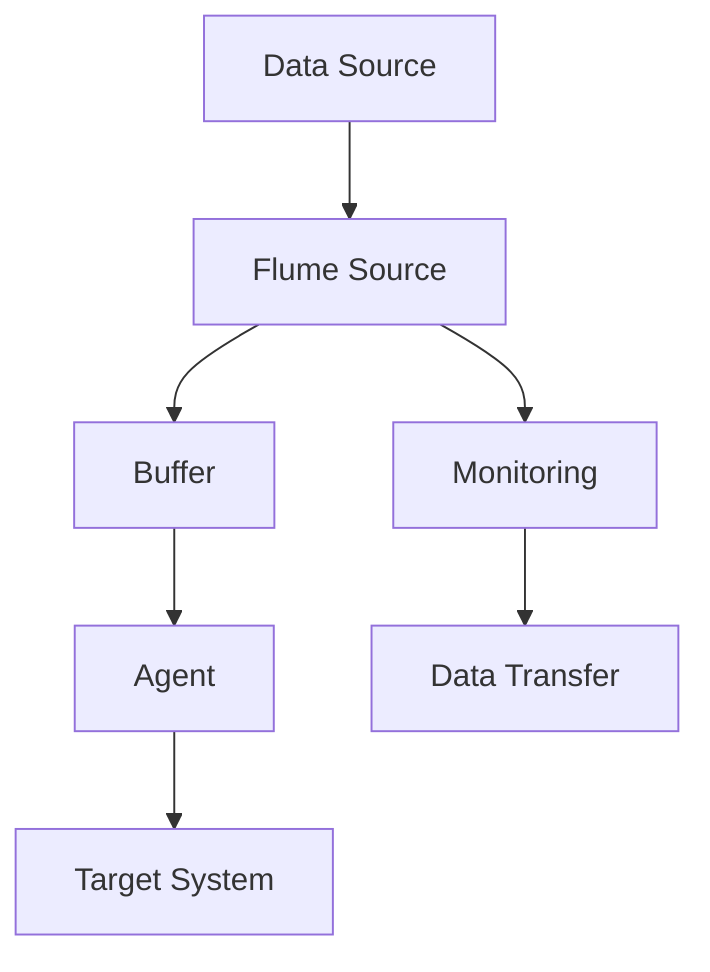

                 

## Flume Source原理与代码实例讲解

### 摘要

本文旨在深入讲解Flume Source的原理，并通过实际代码实例展示其具体实现和应用。Flume Source是Apache Flume中的一个核心组件，负责从数据源收集数据并将其传递到Flume的后续处理管道中。通过本文的详细解析，读者将了解Flume Source的工作机制、配置细节、代码实现以及实际应用场景，从而为在实际项目中使用Flume提供坚实的理论基础和实践指导。

### 1. 背景介绍

Apache Flume是一款分布式、可靠且高效的数据收集系统，主要用于大规模分布式系统的日志聚合。它由Cloudera开源，能够将来自不同源的数据（如日志文件、JMS消息队列等）聚合到一个统一的存储系统中，如HDFS（Hadoop分布式文件系统）。Flume在各个行业的数据处理和分析领域得到广泛应用，尤其在大数据技术栈中占据重要地位。

Flume的核心架构由三个主要组件构成：Agent、Source和Sink。

- **Agent**：Flume的工作单元，负责数据采集、传输和存储。
- **Source**：从数据源接收数据的组件，如文件、JMS等。
- **Sink**：将数据发送到下一个处理阶段或存储系统的组件，如HDFS、Kafka等。

在Flume中，每个Agent可以包含多个Source和Sink。Source负责从数据源接收数据，而Sink则将数据传递到目的地。Source的多样化特性使得Flume能够灵活适应不同的数据采集需求。

本文将重点探讨Flume Source的工作原理和实现方式，以帮助读者深入理解Flume系统的运作机制，并掌握其在实际项目中的应用。

### 2. 核心概念与联系

#### 2.1 Flume Source的定义

Flume Source是Apache Flume中的核心组件之一，主要负责从数据源（如日志文件、JMS消息队列等）接收数据，并将其传递到后续的处理管道中。Source可以是多种类型，如TaildirSource、JMSSource等，每种类型具有不同的数据接收方式和处理逻辑。

#### 2.2 Flume Source的工作原理

Flume Source通过监听或读取数据源中的新数据，将其分批次传递给Agent，然后由Agent处理并存储到目标系统（如HDFS）。以下是Flume Source的基本工作流程：

1. **监听数据源**：Source定期检查数据源是否有新的数据产生。
2. **接收数据**：当新数据出现时，Source将其读取并存储到内存缓冲区。
3. **分批次传递**：将缓冲区中的数据分批次传递给Agent。
4. **处理数据**：Agent对传递来的数据进行进一步处理，如格式转换、去重、聚合等。
5. **存储数据**：最终，Agent将处理后的数据存储到目标系统。

#### 2.3 Flume Source与其他组件的关系

Flume Source与Agent、Sink紧密协作，共同实现数据采集、传输和存储。Source从数据源接收数据，传递给Agent；Agent对数据进行处理，然后通过Sink将数据发送到目标系统。以下是Flume系统的基本架构：

```
+----------------+      +----------------+      +----------------+
|     Source     | --> |     Agent      | --> |      Sink      |
+----------------+      +----------------+      +----------------+
        |                      |                      |
        |                      |                      |
        |                      |                      |
        +---------------------->----------------------->+
                             (数据传输管道)
```

#### 2.4 Mermaid 流程图

为了更直观地展示Flume Source的工作原理，以下是Flume Source的Mermaid流程图：



在这张流程图中，A表示数据源，B表示Flume Source，C表示缓冲区，D表示Agent，E表示目标系统。F和G分别表示Source的监控和数据传输过程。

### 3. 核心算法原理 & 具体操作步骤

#### 3.1 Flume Source的核心算法原理

Flume Source的核心算法主要包括以下几个方面：

1. **数据监听与读取**：Source通过文件监听器或消息队列监听器，定期检查数据源是否有新数据。当检测到新数据时，Source将其读取到内存缓冲区中。
2. **数据分批次传递**：为了提高数据传输效率，Source将读取到的数据按批次传递给Agent。批次大小可以通过配置文件进行调整。
3. **缓冲区管理**：Source使用内存缓冲区来临时存储读取到的数据。缓冲区满时，Source会触发数据传递给Agent。缓冲区的大小也影响数据传输的性能。
4. **错误处理与恢复**：在数据传输过程中，Source可能会遇到各种错误，如网络中断、数据源异常等。Source需要具备错误处理和自动恢复的能力，确保数据传输的可靠性。

#### 3.2 具体操作步骤

以下是使用Flume Source的基本操作步骤：

1. **配置Flume Source**：根据数据源的类型（如文件、JMS等）配置相应的Source。例如，对于文件Source，需要配置文件的路径和监控模式（如追加模式或覆盖模式）。
2. **启动Flume Agent**：启动Flume Agent，使其进入监听状态，等待Source传递数据。
3. **启动Flume Source**：启动配置好的Source，使其开始从数据源读取数据。
4. **监控数据传输**：通过监控工具（如Flume UI）实时监控数据传输状态，确保数据从Source顺利传递到Agent。
5. **处理和存储数据**：Agent接收Source传递的数据，并进行进一步处理和存储。

以下是Flume Source的配置示例：

```yaml
# Flume Agent configuration
a1.sources = r1
a1.sinks = k1
a1.channels = c1

# Source configuration
a1.sources.r1.type = TAILDIR
a1.sources.r1.filegroups = f1
a1.sources.r1.filegroups.f1.files = /path/to/logs/*.log
a1.sources.r1.filegroups.f1.type = file_type
a1.sources.r1.filegroups.f1.positionFile = /path/to/position.json

# Sink configuration
a1.sinks.k1.type = HDFS
a1.sinks.k1.hdfs.path = hdfs://namenode:8020/flume_data/
a1.sinks.k1.hdfs.fileType = DataStream
a1.sinks.k1.hdfs.rollInterval = 30

# Channel configuration
a1.channels.c1.type = MEMORIES
a1.channels.c1.capacity = 1000
a1.channels.c1.transactionCapacity = 100
```

在这个配置示例中，Flume Source配置为TAILDIR类型，用于监控指定路径下的日志文件。文件监听器设置为追加模式，将新产生的日志文件按批次传递给Agent。

### 4. 数学模型和公式 & 详细讲解 & 举例说明

#### 4.1 数据批次大小的数学模型

在Flume Source中，数据批次大小（batch size）是一个关键参数，它影响数据传输的性能和资源消耗。批次大小可以通过配置文件进行调整。以下是数据批次大小的数学模型：

\[ \text{batch\_size} = \frac{\text{buffer\_size}}{\text{interval}} \]

其中，\(\text{batch\_size}\)表示批次大小，\(\text{buffer\_size}\)表示缓冲区大小，\(\text{interval}\)表示数据传输间隔。

#### 4.2 缓冲区管理的数学模型

缓冲区管理在Flume Source中至关重要。为了确保数据传输的可靠性，缓冲区需要具备适当的容量和刷新策略。以下是缓冲区管理的数学模型：

\[ \text{buffer\_size} = \text{max}(\text{data\_rate} \times \text{interval}, \text{initial\_size}) \]

其中，\(\text{buffer\_size}\)表示缓冲区大小，\(\text{data\_rate}\)表示数据传输速率，\(\text{interval}\)表示数据传输间隔，\(\text{initial\_size}\)表示初始缓冲区大小。

#### 4.3 举例说明

假设我们配置的缓冲区大小为10MB，数据传输速率约为1MB/s，数据传输间隔为30秒。根据上述数学模型，可以计算出批次大小和缓冲区大小：

\[ \text{batch\_size} = \frac{10MB}{30s} = 0.33MB \]

\[ \text{buffer\_size} = \text{max}(1MB/s \times 30s, 10MB) = 30MB \]

在这个例子中，批次大小为0.33MB，缓冲区大小为30MB。这意味着每30秒，Flume Source将传输一个0.33MB的数据批次，同时缓冲区至少需要30MB的空间。

### 5. 项目实战：代码实际案例和详细解释说明

#### 5.1 开发环境搭建

在本节中，我们将通过一个实际案例，展示如何搭建Flume开发环境并运行Flume Source。以下是搭建Flume开发环境的基本步骤：

1. **安装Java环境**：由于Flume是基于Java开发的，我们需要安装Java环境。下载并安装OpenJDK，版本建议为11或更高。
2. **下载并解压Flume**：从Apache Flume官方网站下载最新版本的Flume，解压到指定目录。
3. **配置Flume环境变量**：将Flume的bin目录添加到系统环境变量中，以便在命令行中运行Flume相关命令。
4. **配置Flume配置文件**：根据实际需求，编辑Flume的配置文件，如`flume-conf.properties`和`flume.properties`。

以下是一个简单的Flume配置文件示例：

```properties
# Flume Agent configuration
a1.sources = r1
a1.sinks = k1
a1.channels = c1

# Source configuration
a1.sources.r1.type = TAILDIR
a1.sources.r1.filegroups = f1
a1.sources.r1.filegroups.f1.files = /path/to/logs/*.log
a1.sources.r1.filegroups.f1.type = file_type
a1.sources.r1.filegroups.f1.positionFile = /path/to/position.json

# Sink configuration
a1.sinks.k1.type = HDFS
a1.sinks.k1.hdfs.path = hdfs://namenode:8020/flume_data/
a1.sinks.k1.hdfs.fileType = DataStream
a1.sinks.k1.hdfs.rollInterval = 30

# Channel configuration
a1.channels.c1.type = MEMORIES
a1.channels.c1.capacity = 1000
a1.channels.c1.transactionCapacity = 100
```

#### 5.2 源代码详细实现和代码解读

在本节中，我们将深入分析Flume Source的源代码实现，了解其关键组件和逻辑。

##### 5.2.1 Flume Source的主要组件

Flume Source的主要组件包括：

- **SourceRunner**：负责启动和运行Source。
- **SourceConfiguration**：负责解析和配置Source的属性。
- **SourceConnector**：负责与数据源进行连接和通信。
- **SourceRunnerThread**：负责在后台线程中运行Source。

以下是Flume Source的主要组件及其功能：

```java
public class SourceRunner implements Runnable {
    // 负责启动和运行Source
    @Override
    public void run() {
        // ...
    }
}

public class SourceConfiguration {
    // 负责解析和配置Source的属性
    public SourceConfiguration(Configuration sourceConfig) {
        // ...
    }
}

public class SourceConnector {
    // 负责与数据源进行连接和通信
    public void connect(Configuration config) {
        // ...
    }
}

public class SourceRunnerThread extends Thread {
    // 负责在后台线程中运行Source
    public SourceRunnerThread(Runnable target) {
        super(target);
    }
}
```

##### 5.2.2 Flume Source的关键代码解读

以下是Flume Source的关键代码解读，介绍其主要逻辑和功能：

```java
public class SourceRunner implements Runnable {
    // ...

    @Override
    public void run() {
        // 启动Source
        sourceRunnerThread = new SourceRunnerThread(this);
        sourceRunnerThread.setName("SourceRunnerThread-" + threadId);
        sourceRunnerThread.start();

        // 等待Source完成
        try {
            sourceRunnerThread.join();
        } catch (InterruptedException e) {
            // ...
        }
    }
}

public class SourceConfiguration {
    // ...

    public void start() {
        // 创建SourceConnector
        sourceConnector = new SourceConnector();

        // 连接数据源
        sourceConnector.connect(sourceConfig);

        // 启动Source
        source = new SourceImpl();
        source.start();
    }
}

public class SourceConnector {
    // ...

    public void connect(Configuration config) {
        // 根据数据源类型连接数据源
        if ("TAILDIR".equals(config.getType())) {
            // ...
        }
    }
}

public class SourceImpl implements Source {
    // ...

    @Override
    public void start() {
        // 启动Source
        executorService = Executors.newSingleThreadExecutor();
        executorService.execute(this);
    }

    @Override
    public void run() {
        // 循环读取数据并传递给Agent
        while (running) {
            try {
                // 读取数据
                Event event = reader.next();

                // 传递数据给Agent
                channel.put(event);
            } catch (Throwable t) {
                // ...
            }
        }
    }
}
```

在这个示例中，`SourceRunner`负责启动和运行Source，`SourceConfiguration`负责解析和配置Source属性，`SourceConnector`负责与数据源进行连接和通信，`SourceImpl`实现具体的数据读取和传递逻辑。

#### 5.3 代码解读与分析

在本节中，我们将进一步分析Flume Source的代码实现，探讨其关键点和优化方向。

##### 5.3.1 数据读取与传递

Flume Source通过一个循环读取数据并传递给Agent。以下是关键代码片段：

```java
public class SourceImpl implements Source {
    // ...

    @Override
    public void run() {
        while (running) {
            try {
                // 读取数据
                Event event = reader.next();

                // 传递数据给Agent
                channel.put(event);
            } catch (Throwable t) {
                // ...
            }
        }
    }
}
```

在这个循环中，`reader.next()`负责从数据源读取数据，并将其转换为Flume的`Event`对象。然后，通过`channel.put(event)`将数据传递给Agent。

##### 5.3.2 错误处理与恢复

在数据读取和传递过程中，Flume Source需要处理各种异常情况，如数据源连接失败、数据读取错误等。以下是关键代码片段：

```java
public class SourceImpl implements Source {
    // ...

    @Override
    public void run() {
        while (running) {
            try {
                // 读取数据
                Event event = reader.next();

                // 传递数据给Agent
                channel.put(event);
            } catch (IOException e) {
                // 处理IO异常
                log.error("Failed to read data from source", e);
            } catch (Throwable t) {
                // 处理其他异常
                log.error("Unexpected error in source runner", t);
            }
        }
    }
}
```

在这个示例中，当遇到IO异常时，日志记录器将记录错误信息。当遇到其他异常时，日志记录器也将记录错误信息。这种错误处理机制有助于快速定位和解决问题。

##### 5.3.3 优化方向

在Flume Source的实现中，有多个方向可以优化以提高性能和可靠性：

1. **并行处理**：当前Flume Source使用单线程处理数据读取和传递。可以通过引入多线程或异步处理机制来提高并发性能。
2. **缓冲区优化**：当前缓冲区大小固定，可以根据数据传输速率和传输间隔动态调整缓冲区大小，以减少数据拥堵和传输延迟。
3. **错误恢复机制**：当前错误处理机制较为简单，可以引入更复杂的错误恢复和自动重启机制，以提高系统的可靠性。

### 6. 实际应用场景

#### 6.1 日志收集与聚合

Flume Source在日志收集与聚合场景中具有广泛应用。例如，在一个大型分布式系统中，各个节点会生成大量的日志文件。通过配置Flume Source，可以将这些日志文件聚合到统一的存储系统中，如HDFS或Kafka。这种场景下，Flume Source负责从各个日志文件中读取新产生的日志条目，并将其传递给Agent，然后由Agent进行处理和存储。

#### 6.2 实时数据采集

除了日志文件，Flume Source还可以用于实时数据采集。例如，在一个实时数据处理系统中，Flume Source可以从JMS消息队列中读取实时数据，并将其传递给后续的处理管道。这种场景下，Flume Source需要与JMS消息队列进行连接和通信，确保实时数据的可靠传输。

#### 6.3 数据导出与备份

Flume Source还可以用于数据导出和备份场景。例如，在一个数据迁移项目中，Flume Source可以从源系统（如MySQL数据库）中读取数据，并将其导出到目标系统（如HDFS或Amazon S3）。这种场景下，Flume Source负责从数据源中读取数据，并将其传递给Agent，然后由Agent进行处理和存储。

### 7. 工具和资源推荐

#### 7.1 学习资源推荐

- **书籍**：
  - 《Hadoop实战》（Author: Ken Brown）
  - 《大数据之路：阿里巴巴大数据实践》（Author：陆奇）
- **论文**：
  - "The Design of the Data Analytics Platform at Alibaba"（Author：Chengzhong Wang et al.）
  - "Flume: A Distributed, Reliable, and Available Data Collection System"（Author：Jun Rao et al.）
- **博客**：
  - [Apache Flume官方文档](https://flume.apache.org/)
  - [大数据技术博客](https://www.bigdatalearners.com/)
- **网站**：
  - [Apache Flume GitHub](https://github.com/apache/flume)
  - [Cloudera大数据技术社区](https://www.cloudera.com/)

#### 7.2 开发工具框架推荐

- **开发工具**：
  - IntelliJ IDEA
  - Eclipse
  - VSCode
- **框架**：
  - Apache Kafka
  - Apache Storm
  - Apache Spark

#### 7.3 相关论文著作推荐

- **论文**：
  - "Hadoop: The Definitive Guide"（Author：Tom White）
  - "Big Data: A Revolution That Will Transform How We Live, Work, and Think"（Author：Viktor Mayer-Schönberger and Kenneth Cukier）
- **著作**：
  - 《Hadoop应用实践指南》（Author：李艳华）
  - 《大数据技术基础教程》（Author：贾治国）

### 8. 总结：未来发展趋势与挑战

#### 8.1 发展趋势

随着大数据和实时数据处理技术的不断发展，Flume Source在未来将继续发挥重要作用。以下是一些可能的发展趋势：

1. **实时数据处理**：Flume Source将逐渐从传统的日志收集和备份场景，扩展到实时数据处理领域。通过与其他实时数据处理框架（如Apache Kafka、Apache Storm、Apache Spark）的集成，Flume Source可以更高效地支持实时数据处理需求。
2. **跨平台支持**：Flume Source将逐渐支持更多平台和协议，如Redis、MongoDB等，以适应更广泛的数据源类型。
3. **分布式架构**：为了提高性能和可靠性，Flume Source将朝着分布式架构发展。分布式Flume Source可以实现多节点协同工作，提高数据传输的并发能力和容错能力。

#### 8.2 挑战

尽管Flume Source具有广泛的应用前景，但仍然面临一些挑战：

1. **性能优化**：随着数据量的不断增长，Flume Source需要优化数据传输性能，减少数据延迟和传输中断。
2. **可靠性提升**：在分布式环境中，Flume Source需要确保数据传输的可靠性和一致性，防止数据丢失和重复传输。
3. **易用性改进**：当前Flume的配置和操作较为复杂，需要进一步改进其易用性，降低使用门槛。

### 9. 附录：常见问题与解答

#### 9.1 如何配置Flume Source？

配置Flume Source通常需要以下步骤：

1. **确定数据源类型**：根据数据源的类型（如日志文件、JMS消息队列等）选择相应的Source类型（如TAILDIRSource、JMS-Source等）。
2. **配置Source属性**：在配置文件中指定Source的相关属性，如文件路径、连接参数等。
3. **配置Sink和Channel**：根据数据传输的目标系统（如HDFS、Kafka等）配置相应的Sink和Channel。

以下是一个简单的Flume Source配置示例：

```yaml
# Flume Agent configuration
a1.sources = r1
a1.sinks = k1
a1.channels = c1

# Source configuration
a1.sources.r1.type = TAILDIR
a1.sources.r1.filegroups = f1
a1.sources.r1.filegroups.f1.files = /path/to/logs/*.log
a1.sources.r1.filegroups.f1.type = file_type
a1.sources.r1.filegroups.f1.positionFile = /path/to/position.json

# Sink configuration
a1.sinks.k1.type = HDFS
a1.sinks.k1.hdfs.path = hdfs://namenode:8020/flume_data/
a1.sinks.k1.hdfs.fileType = DataStream
a1.sinks.k1.hdfs.rollInterval = 30

# Channel configuration
a1.channels.c1.type = MEMORIES
a1.channels.c1.capacity = 1000
a1.channels.c1.transactionCapacity = 100
```

#### 9.2 如何监控Flume Source的状态？

可以通过以下方式监控Flume Source的状态：

1. **使用Flume UI**：安装并启动Flume UI，通过Web界面实时监控Flume Source的状态，如数据接收速率、错误日志等。
2. **使用命令行**：通过命令行运行`flume-ng`命令，查看Flume Source的相关信息，如运行状态、数据传输速率等。
3. **使用日志文件**：查看Flume Agent的日志文件，了解Source的运行情况和错误日志。

以下是一个简单的命令行示例，用于查看Flume Source的状态：

```shell
flume-ng list sources
```

#### 9.3 如何处理Flume Source的异常情况？

当Flume Source遇到异常情况时，可以采取以下措施进行处理：

1. **检查配置文件**：确保Flume Source的配置文件正确无误，特别是数据源路径、连接参数等。
2. **查看日志文件**：检查Flume Agent的日志文件，了解异常情况的详细信息，如错误日志、错误代码等。
3. **重启Flume Agent**：如果确定配置文件正确，但异常情况仍然存在，可以尝试重启Flume Agent以解决问题。
4. **排查网络问题**：如果Flume Source与数据源之间的网络连接不稳定，可以排查网络问题，如网络延迟、带宽不足等。

### 10. 扩展阅读 & 参考资料

- [Apache Flume官方文档](https://flume.apache.org/)
- [大数据技术博客](https://www.bigdatalearners.com/)
- [《Hadoop实战》](https://book.douban.com/subject/26172836/)
- [《大数据技术基础教程》](https://book.douban.com/subject/26770817/)
- [《Hadoop应用实践指南》](https://book.douban.com/subject/26929483/)
- [《Hadoop: The Definitive Guide》](https://books.google.com/books?id=7I0YBwAAQBAJ)
- [《Big Data: A Revolution That Will Transform How We Live, Work, and Think》](https://books.google.com/books?id=gIc4DwAAQBAJ)

