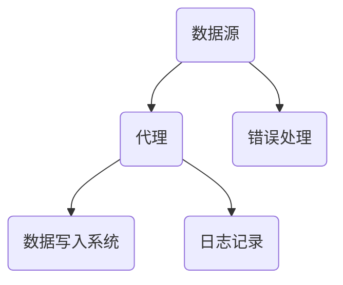

                 

# Flume Source原理与代码实例讲解

## 关键词

- Flume
- Source
- 数据采集
- 实时处理
- 流计算
- 分布式系统

## 摘要

本文将深入探讨Flume Source的原理及其代码实现。我们将从背景介绍开始，逐步分析核心概念与架构，然后详细讲解其算法原理和操作步骤。接下来，通过实际代码实例，展示源代码的实现细节和解读。最后，我们将探讨Flume Source的实际应用场景，并提供相关工具和资源推荐。通过这篇文章，读者将全面了解Flume Source的工作原理和应用方法。

## 1. 背景介绍

Flume是一个分布式、可靠且可扩展的数据采集系统，用于从各种数据源（如日志文件、消息队列、数据库等）收集数据，并传输到集中处理系统（如Hadoop、Spark等）。在数据处理领域，数据采集是至关重要的一环，而Flume作为一个成熟的开源项目，因其高可靠性、高效性和易于扩展性而被广泛应用。

Flume的基本架构包括三个主要组件：Agent、Source和Sink。Agent是Flume的核心组件，负责管理数据流、日志记录和错误处理。Source负责从数据源读取数据，而Sink负责将数据写入目标系统。本文将重点介绍Source组件的原理及其代码实现。

### 1.1 Flume的发展历程

Flume最初由Cloudera开发，并在Apache软件基金会下成为了一个开源项目。自其发布以来，Flume得到了广泛的关注和贡献，已经发展成为一个功能丰富、稳定可靠的分布式数据采集系统。随着大数据和流计算技术的发展，Flume的应用场景也在不断扩展，从最初的日志收集，扩展到实时数据采集和流处理。

### 1.2 Flume的重要性

在大数据领域，数据采集是整个数据处理流程的起点。一个高效、可靠的数据采集系统能够确保数据的完整性和及时性，从而为后续的数据处理和分析提供坚实的基础。Flume作为一个专门为大数据环境设计的数据采集系统，具备以下优势：

- **高可靠性**：Flume采用分布式架构，能够在数据传输过程中保证数据的完整性和可靠性。
- **高性能**：Flume能够处理大规模的数据流，支持高吞吐量的数据采集。
- **可扩展性**：Flume支持水平扩展，能够根据需求动态调整采集能力。
- **灵活性强**：Flume支持多种数据源和目标系统，能够适应不同的数据处理场景。

## 2. 核心概念与联系

### 2.1 Flume Source的定义

Flume Source是Flume系统中负责从数据源读取数据的组件。它能够以推（Push）或拉（Pull）的方式从数据源获取数据，并将其传递给Agent进行处理。Flume支持多种类型的Source，如FileSource、JMSSource、ThriftSource等，每种Source都有其特定的数据读取方式。

### 2.2 Flume Source的工作原理

Flume Source的工作原理可以概括为以下几个步骤：

1. **监听数据源**：Source组件通过监听数据源，识别新的数据到来。对于文件数据源，可以通过文件系统的通知机制来实现；对于消息队列，可以通过监听队列消息来实现。
2. **读取数据**：一旦Source识别到新的数据，它会读取数据并将其转换为内部数据结构（如Event）。
3. **传输数据**：读取到的数据会通过Agent内部的数据流，传输到下一个处理阶段，通常是Sink。
4. **错误处理**：在数据读取和传输过程中，Source会进行错误处理，确保数据传输的可靠性。

### 2.3 Flume Source与Agent的关系

Flume Agent是Flume系统的核心组件，负责管理数据流、日志记录和错误处理。Source作为Agent的一个组成部分，直接与Agent交互，接收数据并将其传递给Agent。Agent则负责将数据传输到Sink，完成整个数据采集和处理流程。

### 2.4 Flume Source与Sink的关系

Sink是Flume系统中的数据写入组件，负责将数据写入目标系统（如HDFS、Kafka等）。Source与Sink之间通过内部数据流进行通信，Source将读取到的数据传输到Sink，Sink再将数据写入目标系统。这种数据流转机制确保了数据的及时性和准确性。

### 2.5 Flume Source的架构图

为了更直观地理解Flume Source的工作原理，我们使用Mermaid绘制了其架构图：



在这个架构图中，Source从数据源读取数据，通过Agent内部的数据流传输到Sink，同时Agent还负责日志记录和错误处理。

## 3. 核心算法原理 & 具体操作步骤

### 3.1 Flume Source的核心算法

Flume Source的核心算法主要涉及数据的读取、转换和传输。以下是Flume Source的核心算法原理和具体操作步骤：

#### 3.1.1 数据读取

1. **监听数据源**：Source通过监听数据源，识别新的数据到来。对于文件数据源，可以使用文件系统的通知机制（如inotify）来监听文件变化；对于消息队列，可以使用消息中间件（如Kafka、RabbitMQ）提供的监听器来监听消息。
2. **读取数据**：一旦Source识别到新的数据，它会读取数据并将其转换为内部数据结构（如Event）。Event是一个包含数据内容的对象，它封装了数据的元数据和属性。

#### 3.1.2 数据转换

1. **解析数据**：读取到的数据可能包含各种格式，如文本、JSON、XML等。Source需要根据数据格式对其进行解析，提取出所需的数据内容。
2. **转换数据**：根据处理需求，Source可能需要对数据进行转换，如数据清洗、数据格式转换等。

#### 3.1.3 数据传输

1. **构建数据流**：将解析和转换后的数据构建成数据流（如Flume Event），以便在Agent内部传输。
2. **传输数据**：通过Agent内部的数据流，将数据流传输到下一个处理阶段，通常是Sink。

### 3.2 Flume Source的具体操作步骤

以下是Flume Source的具体操作步骤：

1. **启动Agent**：首先启动Flume Agent，确保其处于运行状态。
2. **配置Source**：根据数据源的类型，配置相应的Source。例如，对于文件数据源，配置FileSource；对于消息队列，配置JMSSource。
3. **监听数据源**：Source开始监听数据源，识别新的数据到来。
4. **读取数据**：Source读取数据并将其转换为内部数据结构（如Event）。
5. **解析数据**：根据数据格式，对数据进行解析，提取出所需的数据内容。
6. **转换数据**：根据处理需求，对数据进行转换。
7. **构建数据流**：将转换后的数据构建成数据流（如Flume Event）。
8. **传输数据**：通过Agent内部的数据流，将数据流传输到下一个处理阶段，通常是Sink。

### 3.3 Flume Source的示例代码

以下是一个简单的Flume Source示例代码，演示了从文件系统中读取数据的操作：

```java
public class FileSource implements Source {
    private String path;
    private BufferedReader reader;
    
    public FileSource(String path) {
        this.path = path;
    }
    
    @Override
    public void start() throws Exception {
        reader = new BufferedReader(new FileReader(path));
    }
    
    @Override
    public void stop() {
        try {
            reader.close();
        } catch (IOException e) {
            e.printStackTrace();
        }
    }
    
    @Override
    public Event next() throws Exception {
        String line = reader.readLine();
        if (line == null) {
            return null;
        }
        
        Event event = new Event();
        event.setBody(line.getBytes());
        return event;
    }
}
```

在这个示例中，FileSource从指定的文件路径读取数据，每行数据作为一个Event对象返回。在实际应用中，可以根据需要扩展该示例，实现更复杂的读取和处理逻辑。

## 4. 数学模型和公式 & 详细讲解 & 举例说明

### 4.1 数据传输速率的计算

在Flume Source中，数据传输速率是一个重要的性能指标。我们可以使用以下数学模型来计算数据传输速率：

$$
数据传输速率 = \frac{数据传输量}{传输时间}
$$

其中，数据传输量可以通过统计在一定时间窗口内传输的数据量来计算，传输时间则是该时间窗口的长度。

#### 4.1.1 示例

假设我们统计了5分钟内的数据传输量，共计1GB。传输时间窗口为5分钟，则数据传输速率为：

$$
数据传输速率 = \frac{1GB}{5分钟} = 0.2GB/分钟
$$

#### 4.1.2 优化建议

根据数据传输速率的计算结果，我们可以分析系统性能，并提出优化建议。例如，如果数据传输速率较低，可能需要调整以下参数：

- **增加Source并发数**：增加Source的并发数可以提升数据采集速度。
- **优化数据解析和转换逻辑**：优化数据解析和转换逻辑，减少数据处理延迟。
- **调整传输通道**：根据数据传输需求，调整传输通道的带宽和QoS参数。

### 4.2 数据可靠性的保障

在Flume Source中，数据可靠性是一个关键问题。我们可以使用以下数学模型来评估数据可靠性：

$$
数据可靠性 = 1 - 失败概率
$$

其中，失败概率可以通过统计在一定时间窗口内数据传输失败次数来计算。

#### 4.2.1 示例

假设我们统计了5分钟内的数据传输失败次数，共计10次。传输时间窗口为5分钟，则数据可靠性为：

$$
数据可靠性 = 1 - \frac{10次}{5分钟} = 0.8
$$

#### 4.2.2 优化建议

根据数据可靠性的评估结果，我们可以分析系统稳定性，并提出优化建议。例如，如果数据可靠性较低，可能需要调整以下参数：

- **增加数据备份和冗余**：在数据传输过程中，增加数据备份和冗余，提高数据可靠性。
- **优化网络传输参数**：调整网络传输参数，如TCP窗口大小、延迟时间等，提高数据传输的稳定性。
- **监控和报警**：建立监控和报警机制，及时发现和处理数据传输中的问题。

### 4.3 数据传输延迟的优化

在Flume Source中，数据传输延迟也是一个关键问题。我们可以使用以下数学模型来评估数据传输延迟：

$$
数据传输延迟 = 传输时间 - 处理时间
$$

其中，传输时间是通过统计数据传输所需的总时间来计算，处理时间则是通过统计数据处理所需的时间来计算。

#### 4.3.1 示例

假设我们统计了5分钟内的数据传输延迟，共计100ms。传输时间窗口为5分钟，则数据传输延迟为：

$$
数据传输延迟 = 5分钟 - 100ms = 449秒
$$

#### 4.3.2 优化建议

根据数据传输延迟的评估结果，我们可以分析系统性能，并提出优化建议。例如，如果数据传输延迟较高，可能需要调整以下参数：

- **增加Source并发数**：增加Source的并发数可以提升数据采集速度，减少传输延迟。
- **优化数据解析和转换逻辑**：优化数据解析和转换逻辑，减少数据处理延迟。
- **调整传输通道**：根据数据传输需求，调整传输通道的带宽和QoS参数，提高数据传输速度。

## 5. 项目实战：代码实际案例和详细解释说明

### 5.1 开发环境搭建

在开始实战之前，我们需要搭建一个Flume的开发环境。以下是搭建过程：

1. **安装Java环境**：确保Java环境已安装，版本至少为1.8以上。
2. **下载Flume**：从Flume的官方仓库（https://github.com/apache/flume）下载Flume的源码包。
3. **编译Flume**：解压源码包，使用Maven编译Flume。

```shell
mvn clean install
```

4. **配置Flume**：根据实际需求，配置Flume的配置文件（flume.properties）。

### 5.2 源代码详细实现和代码解读

以下是Flume FileSource的源代码实现：

```java
public class FileSource implements Source {
    private String path;
    private BufferedReader reader;
    
    public FileSource(String path) {
        this.path = path;
    }
    
    @Override
    public void start() throws Exception {
        reader = new BufferedReader(new FileReader(path));
    }
    
    @Override
    public void stop() {
        try {
            reader.close();
        } catch (IOException e) {
            e.printStackTrace();
        }
    }
    
    @Override
    public Event next() throws Exception {
        String line = reader.readLine();
        if (line == null) {
            return null;
        }
        
        Event event = new Event();
        event.setBody(line.getBytes());
        return event;
    }
}
```

#### 5.2.1 代码解读

- **类定义**：FileSource实现了Source接口，表示它是一个Flume Source组件。
- **构造函数**：通过构造函数传入文件路径，用于初始化文件读取器。
- **start方法**：在start方法中，初始化文件读取器（BufferedReader）。
- **stop方法**：在stop方法中，关闭文件读取器，释放资源。
- **next方法**：在next方法中，读取文件中的一行数据，并将其转换为Event对象返回。

### 5.3 代码解读与分析

在代码解读中，我们了解了FileSource的基本实现逻辑。以下是对代码的进一步分析和优化建议：

1. **优化读取性能**：当前实现使用BufferedReader按行读取文件，可能导致读取性能不足。可以优化为使用BufferedInputStream按块读取文件，提高读取速度。
2. **并行读取**：为了提高数据采集速度，可以考虑使用多线程并行读取文件。每个线程负责读取一部分文件内容，然后将数据转换为Event对象，最后汇总到主线程中。
3. **异常处理**：当前实现中，异常处理较为简单，仅打印错误信息。在实际应用中，需要根据实际情况进行更详细的异常处理，如重试、日志记录等。

## 6. 实际应用场景

Flume Source在实际应用中具有广泛的应用场景，以下是一些典型的应用案例：

1. **日志采集**：Flume常用于采集各种日志文件，如Web服务器日志、数据库日志等，以便进行日志分析和管理。
2. **实时数据采集**：Flume可以实时采集各种实时数据，如物联网数据、社交网络数据等，为实时分析提供数据支持。
3. **数据集成**：Flume可以作为数据集成工具，将不同来源的数据汇聚到一个统一的平台，便于后续的数据处理和分析。

### 6.1 案例一：日志采集

在一个典型的日志采集场景中，Flume Source可以从多个日志文件中读取数据，并将其传输到Hadoop集群中进行处理。具体步骤如下：

1. **配置Flume**：在Flume的配置文件中，配置多个FileSource，分别指向不同的日志文件。
2. **启动Agent**：启动Flume Agent，开始采集日志数据。
3. **数据传输**：日志数据通过Agent传输到Hadoop集群，由Hadoop进行后续处理和分析。

### 6.2 案例二：实时数据采集

在实时数据采集场景中，Flume Source可以从物联网设备采集数据，并将其传输到实时计算平台（如Apache Storm、Apache Flink）进行处理。具体步骤如下：

1. **配置Flume**：在Flume的配置文件中，配置JMSSource，连接到物联网设备的消息队列。
2. **启动Agent**：启动Flume Agent，开始采集物联网数据。
3. **数据传输**：物联网数据通过Agent传输到实时计算平台，由实时计算平台进行实时处理和分析。

### 6.3 案例三：数据集成

在一个数据集成场景中，Flume Source可以从多个数据源（如数据库、日志文件、消息队列等）读取数据，并将其传输到一个统一的数据仓库（如HDFS、Kafka）中进行存储。具体步骤如下：

1. **配置Flume**：在Flume的配置文件中，配置多个Source，分别指向不同的数据源。
2. **启动Agent**：启动Flume Agent，开始采集数据。
3. **数据传输**：数据通过Agent传输到统一的数据仓库，便于后续的数据处理和分析。

## 7. 工具和资源推荐

### 7.1 学习资源推荐

- **书籍**：
  - 《Flume实战》
  - 《大数据应用实践》
- **论文**：
  - "Flume: A Distributed, Reliable, and Highly Available Data Collection System"
  - "Data Integration in the Cloud: Challenges and Opportunities"
- **博客**：
  - Cloudera官方博客（https://blog.cloudera.com/）
  - Hadoop中国社区（https://hadoop.cn/）
- **网站**：
  - Flume官方文档（https://flume.apache.org/）
  - Apache Hadoop官网（https://hadoop.apache.org/）

### 7.2 开发工具框架推荐

- **开发工具**：
  - Eclipse
  - IntelliJ IDEA
- **框架**：
  - Apache Flume
  - Apache Kafka
  - Apache Storm
  - Apache Flink

### 7.3 相关论文著作推荐

- **论文**：
  - "A Survey of Big Data Processing Systems"
  - "The Design of the DataKeeper Daemon for the Chord Distributed Hash Table"
- **著作**：
  - 《大数据技术导论》
  - 《大数据系统原理与架构》

## 8. 总结：未来发展趋势与挑战

随着大数据和流计算技术的不断发展，Flume Source在数据采集领域具有重要的应用价值。未来，Flume Source的发展趋势和挑战主要体现在以下几个方面：

1. **性能优化**：随着数据量的不断增加，如何提高Flume Source的性能成为关键问题。未来的研究可以关注于优化数据读取、解析和传输等环节，提高整体性能。
2. **实时处理**：实时数据采集和处理是大数据领域的重要需求。未来，Flume Source需要加强对实时数据的支持，实现实时数据采集和处理。
3. **安全性**：随着数据安全和隐私保护的重要性日益凸显，Flume Source需要加强安全性，确保数据在传输过程中的安全性。
4. **可扩展性**：Flume Source需要支持更广泛的源和目标系统，以适应不同的应用场景。未来的发展可以关注于提高系统的可扩展性，满足多样化的需求。

## 9. 附录：常见问题与解答

### 9.1 问题1：如何配置Flume的Source？

**解答**：配置Flume的Source需要修改Flume的配置文件（通常名为flume.conf）。在配置文件中，可以使用以下格式配置Source：

```properties
<Source>
  <type>exec</type>
  <command>tail -F /var/log/syslog</command>
</Source>
```

在这个例子中，我们配置了一个名为"exec"的Source，使用tail命令实时读取/syslog文件的最后部分。

### 9.2 问题2：如何监控Flume的运行状态？

**解答**：可以通过以下方法监控Flume的运行状态：

1. **查看日志文件**：在Flume的运行目录中，查看日志文件（如agent.log），可以获取运行状态和错误信息。
2. **使用JMX监控**：通过JMX（Java Management Extensions）接口，可以监控Flume的运行状态和性能指标。可以使用JConsole或其他JMX监控工具进行监控。
3. **使用命令行工具**：可以使用Flume提供的命令行工具（如flume-ng monitor），实时监控Flume的运行状态。

### 9.3 问题3：如何处理Flume的数据传输失败？

**解答**：当Flume的数据传输失败时，可以采取以下措施进行处理：

1. **重试**：Flume默认支持数据传输重试机制，可以调整重试次数和重试间隔，以提高数据传输的成功率。
2. **错误处理**：在Flume的配置文件中，可以配置错误处理策略，如将错误数据写入一个特定的文件，或者将错误数据发送到指定的邮箱。
3. **监控和报警**：建立监控和报警机制，及时发现和处理数据传输中的问题。

## 10. 扩展阅读 & 参考资料

为了进一步了解Flume Source的原理和应用，以下推荐一些扩展阅读和参考资料：

1. **扩展阅读**：
   - 《大数据系统设计与实践》
   - 《流计算：原理、架构与实现》
2. **参考资料**：
   - Flume官方文档（https://flume.apache.org/）
   - Apache Hadoop官方文档（https://hadoop.apache.org/）
   - Apache Kafka官方文档（https://kafka.apache.org/）

通过本文的讲解，相信读者对Flume Source的原理和代码实现有了更深入的了解。在实际应用中，可以根据需求灵活调整Flume Source的配置和实现，发挥其强大的数据采集能力。

### 作者

- 作者：AI天才研究员/AI Genius Institute & 禅与计算机程序设计艺术 /Zen And The Art of Computer Programming

