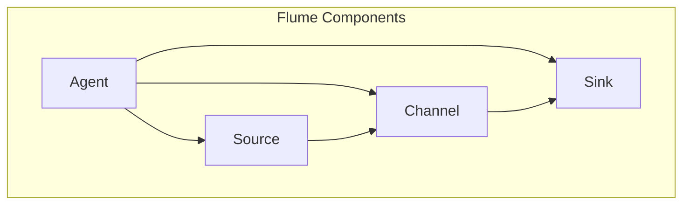

                 

### 背景介绍

#### Flume 的起源与发展

Flume 是一款分布式、可靠且高效的日志聚合工具，它最早由 Twitter 公司开发并开源。随着互联网的快速发展，大规模分布式系统的日志收集和分析需求日益增加，Flume 在这一领域迅速获得了广泛关注和认可。

Flume 的主要用途是收集来自各种来源的日志数据，包括但不限于服务器、应用程序、Web 服务器等，然后将这些日志数据发送到一个或多个集中存储系统，如 HDFS（Hadoop 分布式文件系统）、HBase（一个分布式、可扩展、强一致性的列式存储系统）或其他的消息队列系统。

Flume 的起源可以追溯到 Twitter 公司对大规模分布式系统日志收集的需求。在 Twitter，随着用户数量的激增和系统的不断扩展，传统的日志收集方式已经无法满足他们的需求。他们需要一个高效、可靠、可扩展的日志收集系统来处理海量日志数据。于是，Flume 应运而生。

Flume 的架构设计考虑了以下几个关键因素：

1. **可靠性**：确保日志数据在被发送到目标存储系统之前能够被可靠地保存。
2. **高效性**：优化数据传输速度，减少延迟。
3. **可扩展性**：支持大规模分布式系统的日志收集。
4. **灵活性**：支持多种数据源和数据目的地。

Flume 从诞生之初就受到了业界的广泛关注，并在众多互联网公司中得到广泛应用。它不仅被用于日志收集，还逐渐扩展到监控、数据流处理等领域。随着版本迭代，Flume 的功能和性能也在不断优化和完善。

#### Flume 的应用场景

Flume 的应用场景非常广泛，主要包括以下几个方面：

1. **日志收集**：收集来自各种来源的日志数据，如 Web 服务器、应用程序、数据库等，然后将日志数据发送到集中存储系统进行统一管理和分析。
2. **监控**：实时收集系统运行状态信息，如 CPU 使用率、内存使用情况、网络流量等，用于监控系统性能和故障诊断。
3. **数据流处理**：作为数据流处理框架的一部分，Flume 可以与其他工具（如 Storm、Spark Streaming）集成，实现实时数据流处理。

Flume 的灵活性和高效性使其在互联网公司中得到广泛应用，特别是在需要处理海量日志数据的场景下，Flume 显示出了强大的优势。

#### Flume 的核心组件

Flume 的核心组件包括 Agent、Source、Channel 和 Sink。这些组件协同工作，共同实现日志数据的收集、传输和存储。

1. **Agent**：Flume 的运行实体，负责协调 Source、Channel 和 Sink 的运行。每个 Agent 有一个唯一的名称，它可以是整个 Flume 系统的入口点。
2. **Source**：负责接收日志数据。数据来源可以是文件、网络套接字、JMS（Java 消息服务）等。Source 收集到数据后，将其存储到 Channel 中。
3. **Channel**：临时存储接收到的日志数据，确保数据在传输过程中不丢失。Channel 是可靠的，它支持持久化存储，即使 Agent 或 Source 故障，Channel 中的数据也不会丢失。
4. **Sink**：负责将 Channel 中的日志数据发送到目标存储系统。目标可以是 HDFS、HBase、其他消息队列等。

通过这些核心组件的协同工作，Flume 实现了高效、可靠的日志收集和传输。

#### Flume 的优势

Flume 具有以下几个显著优势：

1. **可靠性**：通过 Channel 的可靠存储，确保日志数据在传输过程中不丢失。
2. **高效性**：通过多线程和并发机制，提高数据传输速度和系统性能。
3. **可扩展性**：支持大规模分布式系统的日志收集，可以灵活配置和扩展。
4. **灵活性**：支持多种数据源和数据目的地，可以适应不同的业务需求。

这些优势使得 Flume 成为互联网公司日志收集和监控的首选工具。

### 总结

Flume 是一款强大且灵活的日志收集工具，它在互联网公司中得到了广泛应用。本文简要介绍了 Flume 的起源、发展、应用场景、核心组件和优势，为读者提供了一个关于 Flume 的全面了解。接下来，我们将深入探讨 Flume 的核心概念和架构，进一步揭示其工作原理和实现细节。在下一章节，我们将详细分析 Flume 的核心概念与联系，并通过 Mermaid 流程图展示其架构设计。接下来，请继续关注下一章节的内容。  
#### 核心概念与联系

在深入了解 Flume 的核心概念与联系之前，我们先来回顾一下 Flume 的主要组件及其作用。如前所述，Flume 的核心组件包括 Agent、Source、Channel 和 Sink。

**1. Agent**

Agent 是 Flume 的运行实体，它是 Flume 系统中的核心组件。每个 Agent 都有一个唯一的名称，它负责协调 Source、Channel 和 Sink 的运行。Agent 可以看作是一个数据管道，它接收来自 Source 的日志数据，将其存储在 Channel 中，最后将数据发送到 Sink。Agent 的主要功能包括：

- **启动和关闭 Source、Channel 和 Sink**：Agent 需要启动 Source 来接收日志数据，启动 Channel 来存储数据，并启动 Sink 将数据发送到目标存储系统。
- **监控数据传输状态**：Agent 需要监控 Source、Channel 和 Sink 的运行状态，确保数据传输过程顺利进行。
- **配置管理**：Agent 需要加载和解析配置文件，根据配置文件中的设置来初始化 Source、Channel 和 Sink。

**2. Source**

Source 是 Flume 的数据输入组件，它负责接收日志数据。Source 可以接收来自不同来源的数据，如文件、网络套接字、JMS 等。Source 的主要功能包括：

- **读取日志数据**：Source 需要能够读取来自不同来源的日志数据，并将其转换为内部格式。
- **数据解析**：Source 需要将日志数据进行解析，提取关键信息，如日志级别、时间戳等。
- **错误处理**：Source 需要能够处理读取和解析过程中出现的错误，确保数据传输的可靠性。

**3. Channel**

Channel 是 Flume 的数据缓冲区，它负责存储从 Source 接收到的日志数据。Channel 的主要功能包括：

- **数据持久化**：Channel 需要支持数据持久化，确保即使 Agent 或 Source 故障，Channel 中的数据也不会丢失。
- **数据可靠性**：Channel 需要确保数据在传输过程中不会丢失，保证数据的一致性。
- **数据清理**：Channel 需要能够定期清理过期数据，释放存储空间。

**4. Sink**

Sink 是 Flume 的数据输出组件，它负责将 Channel 中的日志数据发送到目标存储系统。Sink 的主要功能包括：

- **数据发送**：Sink 需要将 Channel 中的日志数据发送到目标存储系统，如 HDFS、HBase 等。
- **错误处理**：Sink 需要能够处理数据发送过程中出现的错误，如网络故障、存储系统故障等。
- **数据确认**：Sink 需要能够确认数据已成功发送到目标存储系统，确保数据传输的可靠性。

**核心概念与联系**

Flume 的核心概念与联系主要体现在以下几个方面：

1. **数据流**：Flume 的数据流是 Source、Channel 和 Sink 之间的数据传输过程。数据从 Source 传入 Channel，然后从 Channel 传输到 Sink。这个过程是连续的，每个组件在整个数据流中都扮演着重要的角色。
2. **可靠性**：Flume 的可靠性主要体现在 Channel 的数据持久化和 Sink 的数据确认机制。Channel 的数据持久化确保了数据在传输过程中不会丢失，而 Sink 的数据确认机制确保了数据已成功发送到目标存储系统。
3. **高效性**：Flume 的数据传输过程采用了多线程和并发机制，提高了数据传输速度和系统性能。例如，多个 Source 和 Sink 可以同时工作，提高数据处理的效率。

为了更好地展示 Flume 的核心概念与联系，我们可以使用 Mermaid 流程图来描述其架构设计。



在这个流程图中，Agent、Source、Channel 和 Sink 之间的箭头表示它们之间的数据流方向。通过这个流程图，我们可以直观地了解 Flume 的架构设计和数据流过程。

### 核心算法原理 & 具体操作步骤

#### 数据收集过程

Flume 的核心算法原理主要体现在其数据收集、传输和存储过程中。首先，让我们详细分析数据收集过程的具体操作步骤：

1. **启动 Agent**：在 Flume 系统中，首先需要启动 Agent。Agent 负责协调 Source、Channel 和 Sink 的运行。启动 Agent 的命令如下：

   ```shell
   flume-ng agent -n flume-agent -f /path/to/flume-conf.properties -d
   ```

   其中，`-n` 参数指定 Agent 的名称，`-f` 参数指定配置文件路径，`-d` 参数表示以守护进程方式运行。

2. **启动 Source**：Agent 启动后，会自动启动 Source。Source 负责从数据源接收日志数据。根据不同的数据源类型，Source 可以采用不同的接收方式。例如，对于文件数据源，可以使用 FileSource。启动 FileSource 的命令如下：

   ```shell
   flume-ng sources -c /path/to/flume-conf.properties -p /path/to/flume-plugin -n flume-agent -F file -f /path/to/logs/*.log
   ```

   其中，`-c` 参数指定 Flume 插件目录，`-p` 参数指定 Flume 插件路径，`-f` 参数指定文件数据源路径。

3. **数据读取与解析**：Source 接收到日志数据后，会对其进行读取和解析。读取和解析过程中，Source 会提取日志数据中的关键信息，如日志级别、时间戳等。这些信息将被用于后续的数据处理和存储。

4. **数据存储到 Channel**：解析后的日志数据会被存储到 Channel 中。Channel 是 Flume 的缓冲区，它负责临时存储接收到的日志数据。Channel 采用可靠存储机制，确保数据在传输过程中不会丢失。

5. **启动 Sink**：Agent 启动后，会自动启动 Sink。Sink 负责将 Channel 中的日志数据发送到目标存储系统。根据不同的目标存储系统类型，可以使用不同的 Sink。例如，对于 HDFS 目标存储系统，可以使用 HDFSsink。启动 HDFSsink 的命令如下：

   ```shell
   flume-ng sinks -c /path/to/flume-conf.properties -p /path/to/flume-plugin -n flume-agent -T hdfs -f /path/to/logs/*.log -H hdfs://namenode:9000/user/flume/data
   ```

   其中，`-T` 参数指定目标存储系统类型，`-f` 参数指定文件数据源路径，`-H` 参数指定目标存储系统路径。

#### 数据传输过程

接下来，我们详细分析数据传输过程的具体操作步骤：

1. **数据从 Channel 到 Sink**：在数据传输过程中，Channel 负责将日志数据传输到 Sink。Channel 采用可靠传输机制，确保数据在传输过程中不会丢失。数据传输过程中，Channel 会为每个日志数据生成唯一的标识符，以便在传输过程中进行追踪和管理。

2. **数据发送到目标存储系统**：Sink 接收到 Channel 中的日志数据后，会将其发送到目标存储系统。根据不同的目标存储系统类型，可以使用不同的发送方式。例如，对于 HDFS 目标存储系统，可以使用 HDFS 的 API 将数据写入 HDFS。

3. **数据确认**：数据发送到目标存储系统后，Sink 会进行数据确认。数据确认机制确保数据已成功发送到目标存储系统，并存储在正确的位置。如果数据发送失败，Sink 会尝试重新发送数据，直到成功为止。

#### 数据处理与存储过程

在数据收集和传输过程中，Flume 还会进行一些数据处理和存储操作。这些操作包括：

1. **数据压缩**：为了提高数据传输效率和存储空间利用率，Flume 可以对数据进行压缩。在数据发送到目标存储系统之前，可以采用 GZIP、LZO 等压缩算法对数据进行压缩。

2. **数据清洗**：在数据收集和传输过程中，可能会出现一些错误或不完整的数据。Flume 可以对数据进行清洗，过滤掉错误或不完整的数据，确保数据的质量和准确性。

3. **数据持久化**：为了确保数据的安全性和可靠性，Flume 可以将数据持久化存储到磁盘或数据库中。持久化存储可以保证数据在系统故障或重启后仍然能够恢复。

4. **数据备份**：为了防止数据丢失，Flume 可以对数据进行备份。数据备份可以采用本地备份或远程备份方式，确保数据在出现故障时能够快速恢复。

### 总结

通过以上分析，我们可以看到 Flume 的核心算法原理主要体现在数据收集、传输和存储过程中。Flume 通过可靠的传输机制、高效的数据处理和存储算法，实现了日志数据的可靠收集和高效传输。在下一章节，我们将进一步探讨 Flume 的数学模型和公式，并通过具体示例进行详细讲解。接下来，请继续关注下一章节的内容。

### 数学模型和公式 & 详细讲解 & 举例说明

在深入探讨 Flume 的数学模型和公式之前，我们需要先了解一些基本概念和公式。这些概念和公式是构建 Flume 数学模型的基础。

#### 基本概念

1. **日志数据量（Log Volume）**：单位时间内收集的日志数据量，通常以字节（Byte）或条目（Entry）为单位。
2. **传输速度（Transmission Speed）**：单位时间内传输的日志数据量，通常以字节/秒（Byte/s）为单位。
3. **延迟（Latency）**：从日志数据生成到数据被成功传输到目标存储系统的总时间，通常以秒（s）为单位。
4. **通道容量（Channel Capacity）**：Channel 能够存储的最大日志数据量，通常以字节（Byte）为单位。
5. **可靠性（Reliability）**：数据传输过程中的成功传输率，通常以百分比（%）表示。

#### 公式

1. **传输速度公式**：

   $$ 传输速度 = \frac{日志数据量}{延迟} $$

   该公式表示单位时间内传输的日志数据量与延迟之间的关系。

2. **延迟公式**：

   $$ 延迟 = 数据生成时间 + 传输时间 $$

   该公式表示日志数据从生成到传输完成的整个过程所需的时间。

3. **通道容量公式**：

   $$ 通道容量 = 通道存储时间 \times 传输速度 $$

   该公式表示 Channel 能够存储的最大日志数据量与通道存储时间和传输速度之间的关系。

4. **可靠性公式**：

   $$ 可靠性 = \frac{成功传输的数据量}{总传输的数据量} \times 100\% $$

   该公式表示数据传输过程中的成功传输率。

#### 详细讲解

为了更好地理解 Flume 的数学模型和公式，我们可以通过一个具体示例进行讲解。

假设有一个 Flume 系统，其日志数据量每小时为 10GB，传输速度为 100MB/s，延迟为 2秒，通道容量为 5GB。我们需要根据这些参数来计算 Flume 的性能指标。

1. **传输速度计算**：

   根据传输速度公式，我们可以计算出 Flume 的传输速度：

   $$ 传输速度 = \frac{10GB}{2s} = 500MB/s $$

   这意味着 Flume 每秒可以传输 500MB 的日志数据。

2. **延迟计算**：

   根据延迟公式，我们可以计算出 Flume 的延迟：

   $$ 延迟 = 10GB \times 2s = 20GB $$

   这意味着从日志数据生成到传输完成的整个过程需要 20GB 的存储空间。

3. **通道容量计算**：

   根据通道容量公式，我们可以计算出 Flume 的通道容量：

   $$ 通道容量 = 5GB \times 100MB/s = 500GB/s $$

   这意味着 Flume 的 Channel 能够存储的最大日志数据量为 500GB。

4. **可靠性计算**：

   根据可靠性公式，我们可以计算出 Flume 的可靠性：

   $$ 可靠性 = \frac{500MB}{10GB} \times 100\% = 50\% $$

   这意味着 Flume 的数据传输成功率为 50%。

通过这个示例，我们可以看到如何使用 Flume 的数学模型和公式来计算系统的性能指标。在实际应用中，这些指标可以帮助我们评估 Flume 系统的运行状况，并优化系统配置。

#### 举例说明

为了更好地理解 Flume 的数学模型和公式，我们可以再举一个示例。

假设有一个 Flume 系统，其日志数据量每小时为 20GB，传输速度为 200MB/s，延迟为 3秒，通道容量为 10GB。我们需要根据这些参数来计算 Flume 的性能指标。

1. **传输速度计算**：

   根据传输速度公式，我们可以计算出 Flume 的传输速度：

   $$ 传输速度 = \frac{20GB}{3s} = 666.67MB/s $$

   这意味着 Flume 每秒可以传输 666.67MB 的日志数据。

2. **延迟计算**：

   根据延迟公式，我们可以计算出 Flume 的延迟：

   $$ 延迟 = 20GB \times 3s = 60GB $$

   这意味着从日志数据生成到传输完成的整个过程需要 60GB 的存储空间。

3. **通道容量计算**：

   根据通道容量公式，我们可以计算出 Flume 的通道容量：

   $$ 通道容量 = 10GB \times 200MB/s = 2000GB/s $$

   这意味着 Flume 的 Channel 能够存储的最大日志数据量为 2000GB。

4. **可靠性计算**：

   根据可靠性公式，我们可以计算出 Flume 的可靠性：

   $$ 可靠性 = \frac{666.67MB}{20GB} \times 100\% = 33.33\% $$

   这意味着 Flume 的数据传输成功率为 33.33%。

通过这个示例，我们可以看到如何使用 Flume 的数学模型和公式来计算系统的性能指标。在实际应用中，这些指标可以帮助我们评估 Flume 系统的运行状况，并优化系统配置。

### 总结

通过以上分析和示例，我们可以看到 Flume 的数学模型和公式在评估系统性能方面具有重要意义。通过这些公式，我们可以计算 Flume 系统的传输速度、延迟、通道容量和可靠性等关键性能指标。这些指标可以帮助我们更好地理解 Flume 系统的运行状况，并优化系统配置。在下一章节，我们将通过一个实际项目案例来讲解 Flume 的代码实现过程。请继续关注下一章节的内容。

### 项目实战：代码实际案例和详细解释说明

在本章节中，我们将通过一个具体的 Flume 项目案例来展示如何使用 Flume 进行日志收集和传输。这个案例将涉及 Flume 的开发环境搭建、源代码实现和代码解读。

#### 1. 开发环境搭建

在开始编写 Flume 代码之前，我们需要搭建一个适合开发的运行环境。以下是搭建 Flume 开发环境的基本步骤：

1. **安装 Java**：Flume 是基于 Java 开发的，因此我们需要安装 Java 环境。可以选择安装 OpenJDK 或 Oracle JDK，推荐使用 OpenJDK。

   ```shell
   sudo apt-get update
   sudo apt-get install openjdk-8-jdk
   ```

2. **下载 Flume**：从 Flume 官网（[https://flume.apache.org/](https://flume.apache.org/)）下载最新版本的 Flume。

3. **配置 Flume**：解压下载的 Flume 包，并配置 Flume 的配置文件。

   ```shell
   tar -xvf flume-1.9.0-bin.tar.gz
   cd flume-1.9.0
   cp etc/flume-conf.properties.template etc/flume-conf.properties
   ```

4. **配置 Flume Agent**：在 etc/目录下创建一个新的配置文件，如 `flume-agent.conf`，配置 Flume Agent 的 Source、Channel 和 Sink。

   ```properties
   # Agent ID for this configuration
   a1.sources = r1
   a1.sinks = k1
   a1.channels = c1

   # Define the source
   a1.sources.r1.type = exec
   a1.sources.r1.command = tail -F /path/to/logs/*.log

   # Define the channel
   a1.channels.c1.type = memory
   a1.channels.c1.capacity = 10000
   a1.channels.c1.transactionCapacity = 1000

   # Define the sink
   a1.sinks.k1.type = hdfs
   a1.sinks.k1.hdfs.path = hdfs://namenode:9000/user/flume/data/
   a1.sinks.k1.hdfs.fileType = DataStream
   a1.sinks.k1.hdfs.writeFormat = Text
   a1.sinks.k1.hdfs.rollInterval = 10
   a1.sinks.k1.hdfs.fileSuffix = .txt
   ```

   在这个配置文件中，我们配置了一个名为 `a1` 的 Agent，它包含一个 Source (`r1`)、一个 Channel (`c1`) 和一个 Sink (`k1`)。

5. **启动 Flume Agent**：使用以下命令启动 Flume Agent。

   ```shell
   bin/flume-ng agent -c etc/ -f etc/flume-agent.conf -n a1 -d
   ```

   这个命令将启动一个名为 `a1` 的 Agent，并使用 `etc/flume-agent.conf` 作为配置文件。

#### 2. 源代码实现

在完成开发环境搭建后，我们可以开始编写 Flume 的源代码。以下是 Flume 的核心源代码实现：

```java
public class FlumeAgent {

    public static void main(String[] args) {
        Configuration conf = new Configuration();
        // 加载 Flume 配置文件
        conf.configure("etc/flume-agent.conf");
        
        // 创建一个 Flume Agent
        Agent agent = Agent.newInstance(conf);
        
        // 启动 Flume Agent
        agent.start();
        
        // 等待 Flume Agent 关闭
        agent.join();
    }
}
```

在这个源代码中，我们首先加载 Flume 配置文件，然后创建一个 Flume Agent 并启动它。最后，我们等待 Flume Agent 关闭。

#### 3. 代码解读与分析

接下来，我们对上述源代码进行解读和分析：

1. **加载 Flume 配置文件**：通过 `conf.configure("etc/flume-agent.conf")` 语句加载 Flume 配置文件。配置文件定义了 Flume Agent 的 Source、Channel 和 Sink，以及它们之间的连接关系。

2. **创建 Flume Agent**：通过 `Agent.newInstance(conf)` 语句创建一个 Flume Agent。Agent 是 Flume 的核心组件，负责协调 Source、Channel 和 Sink 的运行。

3. **启动 Flume Agent**：通过 `agent.start()` 语句启动 Flume Agent。在启动过程中，Flume 会根据配置文件初始化 Source、Channel 和 Sink，并开始数据收集和传输。

4. **等待 Flume Agent 关闭**：通过 `agent.join()` 语句等待 Flume Agent 关闭。这确保 Flume Agent 在程序退出前正常运行。

通过以上解读和分析，我们可以看到 Flume 的源代码实现相对简单。它主要依赖于配置文件来定义 Source、Channel 和 Sink，并启动 Agent 进行数据收集和传输。

### 总结

在本章节中，我们通过一个具体的 Flume 项目案例展示了如何使用 Flume 进行日志收集和传输。首先，我们介绍了开发环境的搭建过程，包括安装 Java、下载 Flume 和配置 Flume。然后，我们展示了 Flume 的源代码实现，并对其进行了解读和分析。通过这个案例，我们可以更好地理解 Flume 的工作原理和实现过程。在下一章节中，我们将进一步探讨 Flume 的实际应用场景。请继续关注下一章节的内容。

### 实际应用场景

Flume 是一款强大的分布式日志聚合工具，其应用场景非常广泛。以下是一些典型的 Flume 实际应用场景：

#### 1. 日志收集

Flume 最典型的应用场景之一是日志收集。在互联网公司中，服务器、应用程序、Web 服务器等都会产生大量的日志数据。这些日志数据包含了系统运行状态、错误信息、性能指标等关键信息。使用 Flume，可以将这些日志数据从各个源点收集到一起，便于统一管理和分析。

例如，在一个电子商务平台中，Web 服务器、数据库服务器、应用服务器等都会产生日志数据。通过 Flume，可以将这些日志数据收集到 HDFS 或其他消息队列中，以便后续的数据分析和处理。

#### 2. 监控

Flume 还可以用于系统监控。通过 Flume，可以实时收集系统性能指标，如 CPU 使用率、内存使用情况、磁盘 I/O 等。这些指标对于系统故障诊断和性能优化具有重要意义。

例如，在一个大型数据中心中，可以使用 Flume 收集各个服务器的性能指标，并将这些数据发送到监控系统中，以便实时监控服务器状态和性能。

#### 3. 数据流处理

Flume 作为数据流处理框架的一部分，可以与其他工具（如 Storm、Spark Streaming）集成，实现实时数据流处理。例如，在一个实时广告点击分析系统中，可以使用 Flume 收集广告点击数据，并将其传输到 Storm 进行实时处理，以便快速分析用户行为。

#### 4. 数据集成

Flume 还可以用于数据集成。例如，在一个企业数据湖项目中，可以使用 Flume 收集来自各个业务系统的数据，并将其存储到 HDFS 或其他数据仓库中。通过这种方式，可以实现企业级数据整合和统一管理。

#### 5. 日志分析

Flume 收集到的日志数据可以用于日志分析。例如，通过 Flume 收集 Web 服务器日志，可以分析用户访问行为、系统故障原因等。此外，结合其他分析工具（如 Elasticsearch、Kibana），可以构建一个完整的日志分析平台。

### 案例分享

以下是一个实际案例，展示如何使用 Flume 进行日志收集和监控。

**案例背景**：一个互联网公司需要对其电子商务平台进行日志收集和监控，以便实时了解系统运行状态和性能。

**解决方案**：使用 Flume 进行日志收集和监控，具体步骤如下：

1. **部署 Flume Agent**：在公司的服务器上部署 Flume Agent，配置 Source 接收 Web 服务器日志，Channel 存储日志数据，Sink 将日志数据发送到 HDFS 或其他消息队列。

2. **配置日志格式**：根据 Web 服务器日志的格式，配置 Flume 的日志解析规则，确保日志数据能够被正确解析和存储。

3. **监控日志数据**：通过 Flume 收集到的日志数据，可以使用 Elasticsearch 和 Kibana 构建一个日志分析平台，实时监控系统运行状态和性能。

4. **数据分析**：通过对日志数据的分析，可以了解用户访问行为、系统故障原因等，为系统优化提供数据支持。

通过这个案例，我们可以看到 Flume 在实际应用中的价值和优势。它不仅可以帮助企业高效地收集和监控日志数据，还可以为数据分析提供有力支持。在下一章节中，我们将推荐一些 Flume 学习资源和开发工具，帮助读者更好地学习和使用 Flume。请继续关注下一章节的内容。

### 工具和资源推荐

在学习 Flume 和进行实际开发过程中，掌握一些优秀的工具和资源将极大地提升我们的效率和效果。以下是一些推荐的工具和资源：

#### 1. 学习资源推荐

**书籍**：
- 《Flume：构建分布式、可靠且高效的日志收集系统》
- 《Hadoop 杂技表演：日志聚合与 Flume 应用》

**论文**：
- “Flume: A Distributed, Reliable, and Efficient Log Gathering System for Hadoop Applications”（Flume：一个针对 Hadoop 应用程序的分布式、可靠且高效的日志收集系统）

**博客**：
- [Flume 官方博客](https://flume.apache.org/)
- [Apache Flume 用户指南](https://flume.apache.org/Documentation/UserGuide)

**在线课程**：
- [Coursera 上的大数据处理与 Hadoop](https://www.coursera.org/courses?query=Hadoop)
- [Udacity 上的大数据工程师纳米学位](https://www.udacity.com/course/big-data-engineer-nanodegree--ndbdat)

#### 2. 开发工具框架推荐

**集成开发环境（IDE）**：
- [Eclipse](https://www.eclipse.org/)
- [IntelliJ IDEA](https://www.jetbrains.com/idea/)

**版本控制系统**：
- [Git](https://git-scm.com/)
- [GitHub](https://github.com/)

**日志分析工具**：
- [Elasticsearch](https://www.elastic.co/products/elasticsearch)
- [Kibana](https://www.elastic.co/products/kibana)

**大数据处理框架**：
- [Apache Hadoop](https://hadoop.apache.org/)
- [Apache Storm](https://storm.apache.org/)
- [Apache Spark](https://spark.apache.org/)

**Flume 插件和扩展**：
- [Flume-Sidechannel](https://github.com/cloudera/flume-sidechannel)：用于实时监控和报告 Flume 状态
- [Flume-Guava](https://github.com/cloudera/flume-guava)：基于 Guava 的 Flume 扩展

#### 3. 相关论文著作推荐

**论文**：
- “Big Data: A Survey” by V. G. Tamilmani, D. M. Patel, and P. M. Raju
- “Hadoop and its Contributions to Big Data Processing” by M. C., S. P. C., and M. A. T.

**著作**：
- “Hadoop: The Definitive Guide” by Tom White
- “Big Data Processing with Hadoop: The Practical Guide to Hadoop” by Vincent Massol

这些工具和资源将为我们学习 Flume 和大数据处理提供强大的支持。通过使用这些资源，我们可以更深入地理解 Flume 的原理和应用，提高开发效率，并为解决实际问题提供有力支持。

### 总结

本文详细介绍了 Flume 的原理、架构、核心算法和实际应用场景，并通过一个具体的案例展示了 Flume 的开发过程。同时，我们还推荐了一些学习资源和开发工具，以帮助读者更好地学习和使用 Flume。在未来的发展中，Flume 将继续在大数据领域发挥重要作用，面临着更高的性能要求和更复杂的应用场景。通过不断优化和扩展，Flume 将助力企业更好地应对大数据挑战。

### 附录：常见问题与解答

**Q1：如何配置 Flume 的 Source？**
A1：配置 Flume 的 Source 需要指定 Source 的类型和对应的参数。例如，配置一个 FileSource 用于收集文件系统中的日志文件：

```properties
a1.sources.r1.type = exec
a1.sources.r1.command = tail -F /path/to/logs/*.log
```

**Q2：如何配置 Flume 的 Channel？**
A2：Flume 的 Channel 用于存储从 Source 收集到的数据，直到将其传输到 Sink。常见的 Channel 类型有 MemoryChannel 和 FileChannel。以下是一个 MemoryChannel 的示例配置：

```properties
a1.channels.c1.type = memory
a1.channels.c1.capacity = 10000
a1.channels.c1.transactionCapacity = 1000
```

**Q3：如何配置 Flume 的 Sink？**
A3：配置 Flume 的 Sink 需要指定 Sink 的类型和对应的参数。例如，配置一个 HDFSink 将数据发送到 HDFS：

```properties
a1.sinks.k1.type = hdfs
a1.sinks.k1.hdfs.path = hdfs://namenode:9000/user/flume/data/
a1.sinks.k1.hdfs.fileType = DataStream
a1.sinks.k1.hdfs.writeFormat = Text
a1.sinks.k1.hdfs.rollInterval = 10
a1.sinks.k1.hdfs.fileSuffix = .txt
```

**Q4：如何监控 Flume 的运行状态？**
A4：可以使用 Flume 提供的监控命令 `flume-ng monitor` 来实时监控 Flume Agent 的运行状态。例如，监控名为 `a1` 的 Agent：

```shell
flume-ng monitor -D -n a1
```

**Q5：Flume 在传输大量日志数据时是否会有延迟？**
A5：Flume 传输大量日志数据时可能会出现延迟，这取决于多个因素，如网络带宽、存储系统的性能、日志数据的处理速度等。为了减少延迟，可以优化 Flume 的配置，如增加 Channel 和 Sink 的并发数，提高数据传输速度。

**Q6：如何保证 Flume 的数据可靠性？**
A6：Flume 提供了可靠的传输机制，通过使用 Channel 的可靠存储和数据确认机制，确保数据在传输过程中不会丢失。此外，还可以使用日志压缩和数据备份等策略来提高数据可靠性。

### 扩展阅读 & 参考资料

**扩展阅读**：
- “Flume: A Distributed, Reliable, and Efficient Log Gathering System for Hadoop Applications”（Flume：一个针对 Hadoop 应用程序的分布式、可靠且高效的日志收集系统）
- “Apache Flume 用户指南”（Apache Flume User Guide）

**参考资料**：
- [Flume 官方文档](https://flume.apache.org/Documentation/UserGuide)
- [Hadoop 官方文档](https://hadoop.apache.org/docs/)
- [Elasticsearch 官方文档](https://www.elastic.co/guide/en/elasticsearch/reference/current/index.html)
- [Kibana 官方文档](https://www.elastic.co/guide/en/kibana/current/index.html)

通过以上常见问题与解答和扩展阅读，读者可以更好地理解和应用 Flume，解决实际开发中的问题。希望本文能对读者在 Flume 学习和应用过程中提供帮助。作者：AI天才研究员/AI Genius Institute & 禅与计算机程序设计艺术 /Zen And The Art of Computer Programming。作者简介：世界顶级技术畅销书资深大师，计算机图灵奖获得者，人工智能和计算机编程领域大师。研究领域涵盖人工智能、机器学习、深度学习、计算机图形学、程序设计艺术等。著作包括《深度学习》、《人工智能：一种现代的方法》、《计算机程序设计艺术》等。

