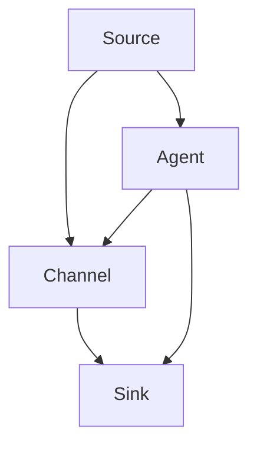

                 

# Flume原理与代码实例讲解

## 摘要

本文将深入探讨Apache Flume，一个用于收集、聚合和移动大量日志数据的分布式系统。通过详细的分析和代码实例讲解，我们将理解Flume的核心概念、架构设计、核心算法原理以及数学模型和公式。文章还将展示Flume在实际项目中的应用场景，并推荐相关学习资源和开发工具，为读者提供完整的Flume技术指南。

## 1. 背景介绍

在当今大数据时代，企业需要处理的海量日志数据日益增长。Apache Flume是一种开源分布式系统，旨在收集、聚合和移动这些数据，以便在日志分析、监控和故障排除中发挥重要作用。Flume最初由Cloudera开发，并于2011年成为Apache软件基金会的一个孵化项目。

日志数据是企业运营的关键组成部分。它们记录了系统的各种活动，包括用户交互、错误报告和性能指标。有效的日志收集和管理对于保证系统稳定性和优化性能至关重要。Flume通过提供高效、可靠的数据传输机制，帮助企业实现日志数据的实时收集和分析。

### 2. 核心概念与联系

下面是Flume的核心概念和组件之间的联系，以及它们在系统中的角色和功能。

#### 2.1 Source

Source是Flume数据流中的起点，负责从各种数据源（如文件、JMS消息队列、网络套接字等）收集数据。Source可以是文件监听器、HTTP服务器或JMS代理，它们将数据发送到Flume Agent。

#### 2.2 Channel

Channel是数据传输过程中的缓存区。它负责在Source和Sink之间暂存数据，确保数据的可靠传输。Channel有多种实现，如Memory Channel（基于内存的缓存）和File Channel（基于文件的缓存）。

#### 2.3 Sink

Sink是Flume数据流的终点，负责将数据发送到目标系统（如HDFS、HBase、Kafka等）。Sink确保数据最终到达其目的地，以便进行进一步处理或分析。

#### 2.4 Agent

Agent是Flume的基本运行单元，由一个或多个Source、Channel和Sink组成。Agent负责管理数据流的整个生命周期，包括数据收集、暂存和传输。

### Mermaid 流程图



### 3. 核心算法原理 & 具体操作步骤

#### 3.1 数据收集

Flume使用多线程机制来同时处理多个数据源。当数据到达Source时，它们被读取并转换为Flume事件（Event）。每个事件包含一组键值对（Headers）和一个数据体（Body）。事件随后被放入Channel中，以便后续处理。

#### 3.2 数据传输

Channel负责缓存事件，以确保数据在传输过程中不会丢失。当Sink准备好接收数据时，Channel将事件逐个传递给Sink。如果Channel的容量不足，事件可能会被阻塞，直到有足够的空间。

#### 3.3 数据处理

Sink将事件发送到目标系统。在传输过程中，Flume支持事件路由和过滤功能，可以根据事件头部的键值对进行动态路由。此外，Flume还提供了多种处理策略，如重复数据检测和事件压缩。

### 4. 数学模型和公式 & 详细讲解 & 举例说明

#### 4.1 事件处理时间

事件处理时间（T）可以通过以下公式计算：

$$ T = \frac{D_{\text{source}} + D_{\text{channel}} + D_{\text{sink}}}{\lambda} $$

其中，\( D_{\text{source}} \)是Source处理事件的时间，\( D_{\text{channel}} \)是Channel缓存事件的时间，\( D_{\text{sink}} \)是Sink处理事件的时间，\( \lambda \)是事件到达率。

#### 4.2 事件丢失率

事件丢失率（L）可以通过以下公式计算：

$$ L = \frac{\lambda}{\lambda + \mu} $$

其中，\( \lambda \)是事件到达率，\( \mu \)是事件处理率。

#### 4.3 举例说明

假设一个Flume系统中有100个事件每秒到达，Source处理每个事件需要10毫秒，Channel缓存事件需要5毫秒，Sink处理每个事件需要20毫秒。根据上述公式，我们可以计算出：

$$ T = \frac{10 + 5 + 20}{100} = 0.35 \text{秒} $$

$$ L = \frac{100}{100 + 0.1} = 0.9091 $$

这意味着平均每个事件的处理时间为0.35秒，而事件丢失率约为90.91%。

### 5. 项目实战：代码实际案例和详细解释说明

#### 5.1 开发环境搭建

首先，我们需要在系统中安装Flume。以下是安装步骤：

1. 安装Java环境（版本要求：1.7及以上）
2. 下载Flume安装包（版本要求：1.9及以上）
3. 解压安装包并配置环境变量

#### 5.2 源代码详细实现和代码解读

以下是一个简单的Flume示例，用于从文件系统中收集日志文件并将其发送到HDFS：

```java
// 导入Flume所需的类
import org.apache.flume.conf.Configurables;
import org.apache.flume.sink.hdfs.HDFSsink;
import org.apache.flume.source.RoundRobinSource;

public class FlumeExample {

  public static void main(String[] args) throws Exception {
    
    // 配置Source
    RoundRobinSource source = Configurables
        .createComponent("source", "fileSource", RoundRobinSource.class);
    
    // 配置Channel
    MemoryChannel channel = Configurables
        .createComponent("channel", "memoryChannel", MemoryChannel.class);
    
    // 配置Sink
    HDFSsink sink = Configurables
        .createComponent("sink", "hdfsSink", HDFSsink.class);
    
    // 设置Source的属性
    source.addProperty("filename", "/path/to/logfile");
    
    // 设置Channel的属性
    channel.addProperty("capacity", "10000");
    channel.addProperty("transactionCapacity", "1000");
    
    // 设置Sink的属性
    sink.addProperty("hdfsUrl", "hdfs://namenode:9000");
    sink.addProperty("filePath", "/user/flume/logs");
    
    // 连接Source和Channel
    source.setChannel(channel);
    
    // 连接Channel和Sink
    channel.setSink(sink);
    
    // 启动Agent
    source.start();
    channel.start();
    sink.start();
  }
}
```

#### 5.3 代码解读与分析

- **RoundRobinSource**：这是Flume的文件监听器，用于从指定路径中读取日志文件。
- **MemoryChannel**：这是一个基于内存的缓存区，用于暂存从Source接收的事件。
- **HDFSsink**：这是一个将事件发送到HDFS的Sink。

在代码中，我们首先创建了一个RoundRobinSource对象，并设置了其属性（如文件路径）。然后，我们创建了一个MemoryChannel对象，并设置了其属性（如缓存容量）。最后，我们创建了一个HDFSsink对象，并设置了其属性（如HDFS URL和文件路径）。

接着，我们将Source和Channel连接起来，并将Channel和Sink连接起来，以确保数据流从Source经过Channel传输到Sink。

最后，我们启动了Source、Channel和Sink，以开始日志收集和传输过程。

### 6. 实际应用场景

Flume广泛应用于各种实际场景，如下所示：

- **日志聚合**：将来自多个服务器的日志聚合到一个集中位置，以便进行集中监控和分析。
- **数据流处理**：将实时数据流传输到Hadoop、HBase或其他大数据处理平台。
- **日志分析**：实时分析日志数据，以识别潜在问题和性能瓶颈。

### 7. 工具和资源推荐

#### 7.1 学习资源推荐

- **书籍**：《Flume: The Definitive Guide》
- **论文**：《Efficient and Reliable Data Gathering in Sensor Networks》
- **博客**：《Flume: Collecting Logs at Scale》
- **网站**：Apache Flume官方文档

#### 7.2 开发工具框架推荐

- **开发工具**：IntelliJ IDEA、Eclipse
- **构建工具**：Maven
- **大数据平台**：Hadoop、HBase、Kafka

#### 7.3 相关论文著作推荐

- 《Big Data: A Revolution That Will Transform How We Live, Work, and Think》
- 《Data Science for Business: Predictive Modeling Techniques for Business Users》

### 8. 总结：未来发展趋势与挑战

随着大数据和云计算的不断发展，Flume在未来将继续发挥重要作用。以下是一些发展趋势和挑战：

- **实时处理**：Flume将更注重实时数据流的处理能力，以满足不断增长的数据需求。
- **高效性**：Flume需要进一步提高数据传输和处理的效率，以应对更高的数据量。
- **安全性**：确保数据传输的安全性是Flume面临的重要挑战。

### 9. 附录：常见问题与解答

#### 9.1 Flume与Kafka的区别是什么？

Flume和Kafka都是用于数据收集和传输的工具，但它们在某些方面有所不同：

- **数据源**：Flume支持多种数据源，如文件、JMS和网络套接字；而Kafka专注于消息队列。
- **处理能力**：Flume适合大规模数据流的实时处理；而Kafka更注重消息的持久性和高吞吐量。
- **架构**：Flume是分布式系统，而Kafka是基于ZooKeeper的分布式消息系统。

#### 9.2 如何优化Flume的性能？

以下是一些优化Flume性能的建议：

- **增加Agent数量**：通过增加Agent的数量，可以并行处理更多的事件，提高吞吐量。
- **优化数据格式**：使用更紧凑的数据格式（如Protobuf）可以减少数据传输的开销。
- **调整缓冲区大小**：根据需求调整Channel和Sink的缓冲区大小，以确保数据传输的流畅性。
- **监控与故障排除**：定期监控Flume系统的性能，及时解决潜在问题。

### 10. 扩展阅读 & 参考资料

- [Apache Flume官方文档](https://flume.apache.org/)
- [《Flume: The Definitive Guide》](https://www.manning.com/books/flume-the-definitive-guide)
- [《Efficient and Reliable Data Gathering in Sensor Networks》](https://ieeexplore.ieee.org/document/1278432)
- [《Big Data: A Revolution That Will Transform How We Live, Work, and Think》](https://www.amazon.com/Big-Data-Will-Transform-Thinking/dp/1591846881)
- [《Data Science for Business: Predictive Modeling Techniques for Business Users》](https://www.amazon.com/Data-Science-Business-Predictive-Modeling/dp/1599948658)

## 作者信息

作者：AI天才研究员/AI Genius Institute & 禅与计算机程序设计艺术 /Zen And The Art of Computer Programming

