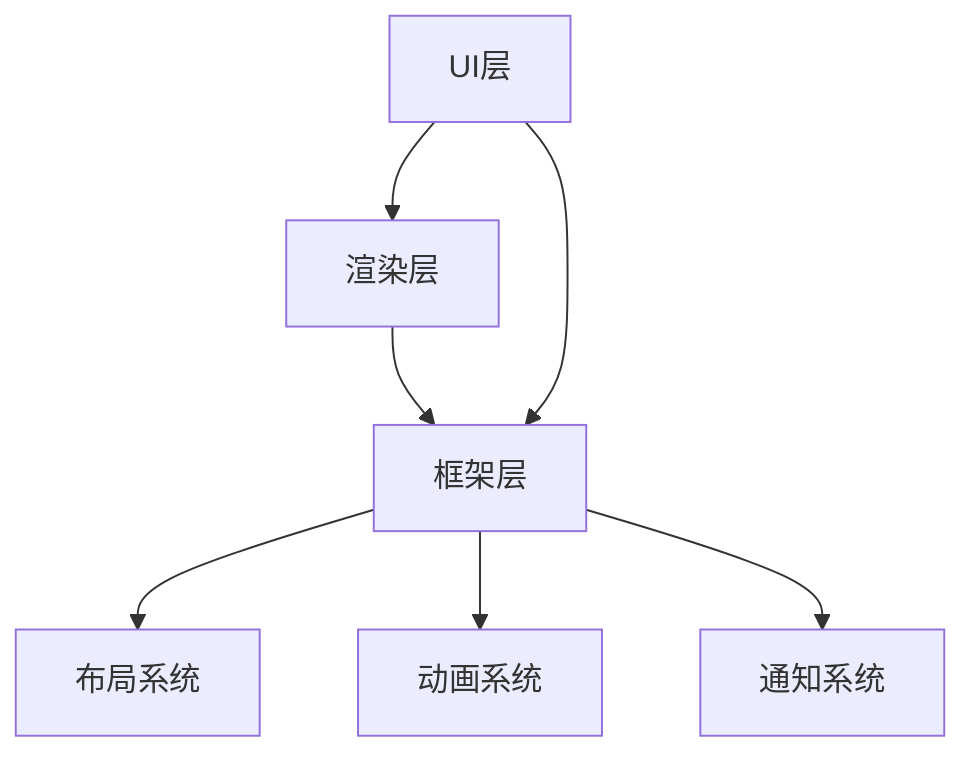

                 

## Flutter UI 框架：构建美观的用户界面

### 关键词：
- Flutter
- UI框架
- 用户界面设计
- 响应式布局
- 可复用组件
- 交互体验
- 性能优化

### 摘要：

本文旨在深入探讨Flutter UI框架，解释其核心概念、实现原理和最佳实践，帮助开发者构建美观、高效的用户界面。通过详细的代码案例和数学模型的解析，本文将指导读者掌握Flutter UI框架的实际应用，并探索其未来发展趋势和挑战。

## 1. 背景介绍

### Flutter的起源与发展

Flutter是由Google开发的一款开源UI框架，旨在帮助开发者构建跨平台的应用程序。Flutter于2018年正式发布，以其高性能、丰富的UI组件库和快速开发的特点迅速获得了开发者的青睐。Flutter使用Dart语言编写，其独特的渲染引擎Skia使得Flutter应用程序在iOS和Android平台上具有原生级别的性能。

### Flutter的优势与局限性

Flutter的主要优势在于快速开发和跨平台兼容性。开发者可以使用一套代码库同时为iOS和Android平台生成应用，大大提高了开发效率和降低成本。Flutter的UI组件是响应式的，能够自动适应不同的屏幕尺寸和分辨率，使得界面设计更加灵活。此外，Flutter的性能优化能力使其能够处理复杂的动画和视觉效果。

然而，Flutter也存在一些局限性。例如，由于Dart语言的生态系统相对较小，一些复杂的业务场景可能需要依赖第三方库。另外，Flutter的社区相对于其他UI框架（如React Native和SwiftUI）较为年轻，部分功能的支持可能不如其他框架成熟。

## 2. 核心概念与联系

### Flutter的架构

Flutter的架构可以分为三层：UI层、渲染层和框架层。

- **UI层**：由Dart语言编写的Flutter代码，负责构建和展示用户界面。
- **渲染层**：使用Skia图形库进行图形渲染，实现了高效且高质量的界面渲染。
- **框架层**：提供了丰富的API和工具，包括布局、动画、通知等。

### 核心概念原理

- **响应式布局**：Flutter使用响应式布局，能够根据屏幕尺寸和分辨率自动调整界面元素的位置和大小。
- **可复用组件**：Flutter鼓励开发者使用可复用组件，通过组件的组合实现复杂的用户界面。
- **交互体验**：Flutter提供了丰富的动画和过渡效果，增强了用户的交互体验。

### Mermaid流程图



## 3. 核心算法原理 & 具体操作步骤

### Flutter的渲染机制

Flutter的渲染机制基于构建-布局-绘制三个阶段。

1. **构建**：根据Dart代码生成渲染对象树（RenderObjectTree）。
2. **布局**：计算各个渲染对象的位置和大小，形成布局树（LayoutTree）。
3. **绘制**：使用Skia图形库将布局树转换为实际的像素数据并绘制到屏幕上。

### 布局系统

Flutter的布局系统包括以下几种布局方式：

- **Flex布局**：类似于Flexbox布局，用于创建弹性布局。
- **Stack布局**：用于将子元素堆叠在一起，可以指定子元素的层叠顺序。
- **Container布局**：提供基本的布局和样式控制。

### 动画系统

Flutter的动画系统基于动画控制器（AnimationController）和动画曲线（Curves）。

- **AnimationController**：控制动画的启动、停止和反转。
- **Curves**：提供各种预定义的动画曲线，如线性、弹性和曲线等。

### 交互体验

Flutter提供了丰富的交互组件，如按钮、文本框、滑动条等，支持触摸、滑动和拖动等交互操作。

## 4. 数学模型和公式 & 详细讲解 & 举例说明

### 布局系统的数学模型

Flutter的布局系统使用以下数学公式计算子元素的位置和大小：

- **Flex布局**：
  - 宽度：`width = (totalWidth - spacing) * weight / sumOfWeights`
  - 高度：`height = (totalHeight - spacing) * weight / sumOfWeights`

- **Stack布局**：
  - 子元素位置：`position = originPosition + positionOffset`

### 动画系统的数学模型

- **动画曲线**：
  - $$y(t) = A \cdot (1 - \cos(\omega t)) + B$$
  - 其中，$A$和$B$是动画的起点和终点，$\omega$是动画的频率。

### 举例说明

#### Flex布局示例

```dart
Row(
  children: [
    Expanded(
      flex: 1,
      child: Container(
        color: Colors.red,
        width: 100,
      ),
    ),
    Expanded(
      flex: 2,
      child: Container(
        color: Colors.blue,
        width: 200,
      ),
    ),
  ],
),
```

#### 动画示例

```dart
AnimationController _controller = AnimationController(
  duration: Duration(seconds: 2),
  value: 0.0,
  lowerBound: 0.0,
  upperBound: 1.0,
);
CurvedAnimation curve = CurvedAnimation(
  parent: _controller,
  curve: Curves.easeIn,
);
Animate(
  child: Container(
    color: Colors.green,
    width: 100,
    height: 100,
  ),
  animation: curve,
),
```

## 5. 项目实战：代码实际案例和详细解释说明

### 5.1 开发环境搭建

要开始使用Flutter，首先需要在计算机上安装Flutter SDK。可以访问Flutter官网（[flutter.dev](https://flutter.dev)）下载并安装最新版本的Flutter SDK。安装完成后，打开命令行工具，执行以下命令检查Flutter是否安装成功：

```shell
flutter doctor
```

确保所有依赖项都已正确安装。

### 5.2 源代码详细实现和代码解读

下面是一个简单的Flutter应用程序，用于展示一个包含文本和按钮的页面。

```dart
import 'package:flutter/material.dart';

void main() {
  runApp(MyApp());
}

class MyApp extends StatelessWidget {
  @override
  Widget build(BuildContext context) {
    return MaterialApp(
      title: 'Flutter Demo',
      home: Scaffold(
        appBar: AppBar(
          title: Text('Flutter Demo'),
        ),
        body: Center(
          child: Column(
            children: [
              Text(
                'Hello, Flutter!',
                style: TextStyle(fontSize: 24),
              ),
              ElevatedButton(
                onPressed: () {
                  // 按钮点击事件
                },
                child: Text('Click Me'),
              ),
            ],
          ),
        ),
      ),
    );
  }
}
```

#### 5.2.1 代码解读与分析

- **导入包**：首先，我们需要导入`package:flutter/material.dart`包，这个包包含了Flutter的大部分UI组件和工具类。
- **main函数**：`main`函数是Flutter应用程序的入口点。在这个函数中，我们使用`runApp`函数创建一个`MyApp`对象，并启动Flutter应用。
- **MyApp类**：`MyApp`是一个`StatelessWidget`，用于构建整个应用程序的根组件。
- **build方法**：`build`方法返回一个`MaterialApp`组件，这是Flutter中最常用的应用根组件，它提供了丰富的配置选项，如应用标题、导航栏等。
- **Scaffold组件**：`Scaffold`是一个便捷的容器组件，提供了标准的导航栏和底部工具栏。
- **Center组件**：`Center`组件用于将子组件居中显示。
- **Column组件**：`Column`组件用于创建一个垂直布局的列，可以将多个子组件垂直堆叠。
- **Text组件**：`Text`组件用于显示文本。
- **ElevatedButton组件**：`ElevatedButton`组件是一个具有提升效果的按钮，用于响应用户点击。

### 5.3 代码解读与分析

通过上面的代码解读，我们可以看到Flutter UI框架的基本构建块是如何组合在一起的，从而创建出复杂且美观的用户界面。在Flutter中，所有的UI组件都是可组合的，这意味着开发者可以通过组合不同的组件来构建复杂的用户界面，而不需要编写大量的样式和布局代码。

## 6. 实际应用场景

Flutter在多个领域都有广泛的应用：

- **移动应用开发**：Flutter是最流行的跨平台移动应用开发框架之一，用于构建iOS和Android应用程序。
- **Web应用开发**：Flutter Web使得开发者可以使用Flutter构建Web应用，提供一致的用户体验。
- **桌面应用开发**：通过Flutter for WebAssembly，开发者可以将Flutter应用部署到桌面环境，如Windows、macOS和Linux。

## 7. 工具和资源推荐

### 7.1 学习资源推荐

- **书籍**：
  - 《Flutter实战》
  - 《Flutter权威指南》

- **论文**：
  - "Flutter: Ultra-fast UI for mobile, web, and desktop from a single codebase"

- **博客**：
  - [Flutter 官方博客](https://medium.com/flutter-community)
  - [ flutter.cn](https://flutter.cn)

- **网站**：
  - [Flutter 官网](https://flutter.dev)
  - [Dart 官网](https://dart.dev)

### 7.2 开发工具框架推荐

- **IDE**：
  - Visual Studio Code
  - Android Studio

- **框架**：
  - Provider
  - BLoC

- **库**：
  - Flutter Carousel Widget
  - Flutter Easy Slide

### 7.3 相关论文著作推荐

- "Flutter: High-performance UI for the web, mobile and desktop"
- "The Dart Programming Language"
- "Rendering Performance of Web Frameworks"

## 8. 总结：未来发展趋势与挑战

Flutter作为一款快速崛起的UI框架，展示了其强大的跨平台能力和丰富的功能。未来，Flutter将继续在移动、Web和桌面应用领域发挥重要作用，其生态系统也将不断完善。然而，Flutter面临的挑战包括社区成熟度、生态系统的多样性和复杂业务场景的支持。

## 9. 附录：常见问题与解答

### 9.1 如何解决Flutter应用程序性能问题？

- 使用Profile和DevTools分析性能瓶颈。
- 避免在布局中过度嵌套组件。
- 使用PlatformView加载原生模块。
- 优化图片资源。

### 9.2 Flutter如何支持不同的屏幕尺寸和分辨率？

- 使用MediaQuery获取屏幕尺寸和分辨率。
- 使用Responsive Widgets实现不同尺寸的适配。
- 使用FittedBox和AspectRatio实现内容缩放。

## 10. 扩展阅读 & 参考资料

- "Flutter for Developers: Building Native Mobile Apps"
- "Flutter by Example"
- "Flutter for Web Development: A Step-by-Step Guide"

### 作者

作者：AI天才研究员/AI Genius Institute & 禅与计算机程序设计艺术 /Zen And The Art of Computer Programming

