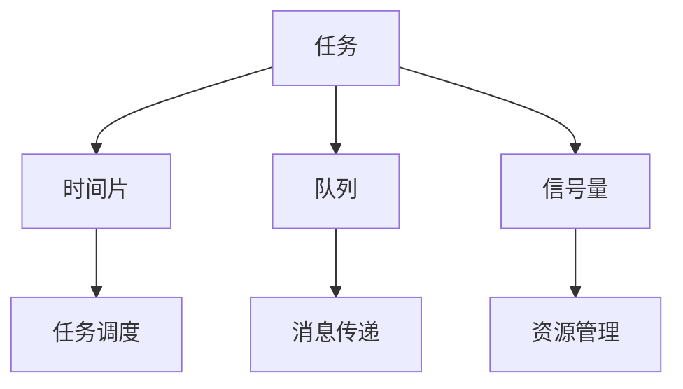

                 

# FreeRTOS实时操作系统应用

## 关键词：实时操作系统，FreeRTOS，嵌入式系统，任务调度，资源管理，应用程序开发

### 摘要

本文旨在深入探讨FreeRTOS实时操作系统的应用。FreeRTOS因其开源、高效、可扩展的特点，成为嵌入式系统开发中的重要选择。本文将详细解析FreeRTOS的核心概念、算法原理、数学模型，并通过实际项目案例展示其在不同应用场景中的具体应用。此外，文章还将推荐相关学习资源，展望未来发展趋势与挑战，以期为读者提供全面的FreeRTOS应用指南。

## 1. 背景介绍

### 1.1 实时操作系统的定义与作用

实时操作系统（RTOS）是一种能够在确定的时间内完成任务的操作系统。与常规操作系统相比，RTOS更加注重任务的响应时间和稳定性。实时操作系统在嵌入式系统、工业控制系统、通信系统等领域具有广泛的应用。

### 1.2 FreeRTOS的历史与发展

FreeRTOS是由Express Logic公司开发的免费、开源实时操作系统。自2003年发布以来，FreeRTOS已成为全球最受欢迎的RTOS之一。其开源特性使得开发者可以自由地使用、修改和分发该系统，大大降低了嵌入式系统开发的门槛。

### 1.3 FreeRTOS的应用领域

FreeRTOS在以下几个领域具有广泛的应用：

1. **嵌入式系统**：例如智能家居设备、物联网设备、医疗设备等。
2. **工业控制系统**：例如工厂自动化、机器人控制等。
3. **通信系统**：例如路由器、交换机等网络设备。
4. **消费电子产品**：例如智能手机、平板电脑等。

## 2. 核心概念与联系

### 2.1 实时操作系统核心概念

实时操作系统的主要核心概念包括任务（Task）、时间片（Time Slice）、队列（Queue）、信号量（Semaphore）等。以下是一个简单的Mermaid流程图，展示了这些概念之间的联系：



### 2.2 FreeRTOS核心概念原理

FreeRTOS的核心概念包括：

1. **任务**：任务是最小的执行单元，可以独立运行。
2. **时间片**：FreeRTOS采用抢占式调度策略，每个任务分配一个时间片，当任务未完成时，系统会抢占其他任务执行。
3. **队列**：队列用于任务之间的消息传递。
4. **信号量**：信号量用于任务间的同步和互斥。
5. **内存管理**：FreeRTOS提供了内存分配和释放的机制。

## 3. 核心算法原理 & 具体操作步骤

### 3.1 任务调度算法

FreeRTOS采用优先级调度算法，任务按照优先级进行调度。具体操作步骤如下：

1. 初始化FreeRTOS系统。
2. 创建任务，并为任务设置优先级。
3. 启动FreeRTOS调度器。
4. 调度器按照任务优先级进行任务调度。

### 3.2 队列操作

队列操作包括队列创建、入队、出队等。具体操作步骤如下：

1. 创建队列。
2. 向队列中插入数据（入队）。
3. 从队列中取出数据（出队）。

### 3.3 信号量操作

信号量操作包括信号量创建、等待信号量、发送信号量等。具体操作步骤如下：

1. 创建信号量。
2. 任务等待信号量。
3. 任务发送信号量。

## 4. 数学模型和公式 & 详细讲解 & 举例说明

### 4.1 任务调度算法的数学模型

任务调度算法的核心在于计算任务执行时间与优先级的关系。以下是一个简单的数学模型：

$$
T_{total} = T_{task1} + T_{task2} + ... + T_{taskn}
$$

其中，$T_{total}$ 是所有任务的执行时间总和，$T_{taski}$ 是第 $i$ 个任务的执行时间。

### 4.2 举例说明

假设有三个任务 $T_1$、$T_2$、$T_3$，其执行时间分别为 1 秒、2 秒、3 秒，优先级分别为 1、2、3。根据优先级调度算法，任务执行顺序为 $T_1$、$T_2$、$T_3$，总执行时间为 1+2+3=6 秒。

## 5. 项目实战：代码实际案例和详细解释说明

### 5.1 开发环境搭建

1. 安装交叉编译工具链（如ARM GCC）。
2. 安装FreeRTOS源码。
3. 配置开发环境（如Keil、IAR等）。

### 5.2 源代码详细实现和代码解读

以下是一个简单的FreeRTOS任务创建示例代码：

```c
#include "FreeRTOS.h"
#include "task.h"

void vTaskFunction1(void *pvParameters)
{
    for (;;)
    {
        printf("Task 1 is running\n");
        vTaskDelay(pdMS_TO_TICKS(1000));
    }
}

void vTaskFunction2(void *pvParameters)
{
    for (;;)
    {
        printf("Task 2 is running\n");
        vTaskDelay(pdMS_TO_TICKS(1000));
    }
}

int main(void)
{
    xTaskCreate(vTaskFunction1, "Task 1", 128, NULL, 2, NULL);
    xTaskCreate(vTaskFunction2, "Task 2", 128, NULL, 1, NULL);

    vTaskStartScheduler();

    for (;;)
    {
        // 挂起主任务，防止其运行
        vTaskDelay(1000);
    }

    return 0;
}
```

### 5.3 代码解读与分析

1. **任务创建**：使用 `xTaskCreate` 函数创建任务，参数包括任务函数、任务名、堆栈大小、参数等。
2. **任务调度**：调用 `vTaskStartScheduler` 启动任务调度器。
3. **主任务挂起**：主任务使用 `vTaskDelay` 函数挂起，避免其占用CPU资源。

## 6. 实际应用场景

### 6.1 嵌入式系统

FreeRTOS在嵌入式系统中的应用广泛，例如：

1. **智能家居设备**：任务调度、消息传递等功能用于控制智能家居设备的运行。
2. **物联网设备**：FreeRTOS为物联网设备提供稳定的实时操作环境。

### 6.2 工业控制系统

FreeRTOS在工业控制系统中的应用包括：

1. **工厂自动化**：任务调度和信号量机制用于控制生产线。
2. **机器人控制**：实时操作系统为机器人提供高响应速度的控制能力。

### 6.3 通信系统

FreeRTOS在通信系统中的应用包括：

1. **路由器**：实时操作系统保证路由器的快速转发和响应。
2. **交换机**：FreeRTOS为交换机提供稳定的运行环境。

## 7. 工具和资源推荐

### 7.1 学习资源推荐

1. **书籍**：
   - 《FreeRTOS实时操作系统核心编程》
   - 《实时操作系统设计与实现》
2. **论文**：
   - 《FreeRTOS实时操作系统的设计与实现》
   - 《基于FreeRTOS的智能家居系统设计》
3. **博客**：
   - FreeRTOS官方网站博客
   - CSDN FreeRTOS专栏
4. **网站**：
   - FreeRTOS官方网站
   - RT-Thread官方网站

### 7.2 开发工具框架推荐

1. **开发工具**：
   - Keil
   - IAR
   - ARM GCC
2. **框架**：
   - FreeRTOS官方框架
   - RT-Thread框架

### 7.3 相关论文著作推荐

1. **论文**：
   - 《FreeRTOS在物联网设备中的应用研究》
   - 《基于FreeRTOS的工业机器人控制系统设计》
2. **著作**：
   - 《FreeRTOS内核源码解析》
   - 《嵌入式实时系统开发实战》

## 8. 总结：未来发展趋势与挑战

### 8.1 发展趋势

1. **物联网的普及**：随着物联网设备的增加，实时操作系统将在智能家居、工业控制等领域得到更广泛的应用。
2. **硬件技术的发展**：硬件性能的提升将为实时操作系统带来更多的机会。
3. **开源生态的完善**：FreeRTOS等开源RTOS将在开发者和企业中得到更广泛的认可。

### 8.2 挑战

1. **性能优化**：实时操作系统需要在资源受限的嵌入式设备上运行，性能优化是一个重要的挑战。
2. **安全性**：随着物联网设备的增多，实时操作系统的安全性问题越来越突出。
3. **可维护性**：随着系统复杂度的增加，实时操作系统的可维护性是一个挑战。

## 9. 附录：常见问题与解答

### 9.1 FreeRTOS与其他RTOS的区别

FreeRTOS与其他RTOS（如RT-Thread、uc/OS等）的区别主要在于：

1. **开源性**：FreeRTOS是完全开源的，而其他RTOS可能需要付费。
2. **性能**：FreeRTOS在嵌入式设备上的性能表现出色，但其他RTOS在某些特定场景下可能更优。
3. **社区支持**：FreeRTOS拥有庞大的开发者社区，社区支持更为丰富。

### 9.2 如何选择合适的RTOS

选择合适的RTOS需要考虑以下因素：

1. **项目需求**：根据项目的具体需求选择合适的RTOS。
2. **资源限制**：考虑嵌入式设备的资源限制，选择合适的RTOS。
3. **开发经验**：根据开发团队的RTOS开发经验，选择熟悉的RTOS。

## 10. 扩展阅读 & 参考资料

1. **《FreeRTOS内核源码解析》**
2. **《嵌入式实时系统开发实战》**
3. **FreeRTOS官方网站**
4. **RT-Thread官方网站**

---

**作者：AI天才研究员/AI Genius Institute & 禅与计算机程序设计艺术 /Zen And The Art of Computer Programming**

