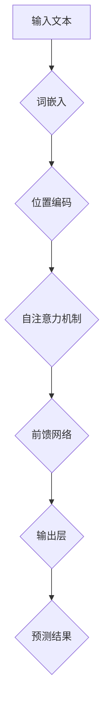

                 

### 背景介绍

GPT-2模型，全称为Generative Pre-trained Transformer 2，是OpenAI在2019年推出的一种基于Transformer架构的预训练语言模型。作为GPT模型的升级版本，GPT-2在多个自然语言处理任务上取得了显著的成果，为现代语言模型的研发奠定了坚实的基础。

自GPT-2问世以来，其在多个领域的应用逐渐扩大，包括但不限于文本生成、机器翻译、问答系统等。GPT-2的成功不仅在于其卓越的性能，更在于其背后的Transformer架构的革新。Transformer架构引入了自注意力机制，使得模型能够更好地捕捉文本中的长距离依赖关系，从而显著提高了模型的性能。

在本文中，我们将对GPT-2模型进行深入解析，从背景介绍、核心概念与联系、核心算法原理、数学模型和公式、项目实战、实际应用场景、工具和资源推荐、总结与未来发展趋势等方面进行详细探讨。通过本文的阅读，您将对GPT-2模型有更全面的理解，并能够掌握其在现代语言模型中的重要地位。

### 核心概念与联系

要理解GPT-2模型，我们首先需要明确几个核心概念，包括自然语言处理（NLP）、Transformer架构和自注意力机制。这些概念构成了GPT-2模型的理论基础，也是其能够实现高效语言理解和生成的重要原因。

#### 自然语言处理（NLP）

自然语言处理是计算机科学和人工智能领域的一个重要分支，旨在使计算机能够理解和处理自然语言。NLP的任务多种多样，包括文本分类、情感分析、命名实体识别、机器翻译等。在这些任务中，计算机需要理解文本的结构、语义和上下文，从而实现对人类语言的自动处理。

#### Transformer架构

Transformer架构是由Vaswani等人于2017年提出的一种全新的序列到序列模型，被广泛应用于NLP任务中。与传统的循环神经网络（RNN）和长短期记忆网络（LSTM）相比，Transformer引入了自注意力机制，使得模型能够更加高效地处理长序列。

Transformer架构的核心思想是将输入序列映射为查询（Query）、键（Key）和值（Value）三个向量。在自注意力机制中，每个位置的内容会根据其与所有其他位置之间的关系进行加权。这种机制使得模型能够捕捉到文本中的长距离依赖关系，从而提高了模型的性能。

#### 自注意力机制

自注意力机制是Transformer架构的核心组成部分。在自注意力机制中，每个词的表示会根据其在整个序列中的重要性进行加权。具体来说，自注意力机制通过计算每个词与所有其他词之间的相似度，从而对每个词的表示进行更新。

自注意力机制的公式可以表示为：

\[ 
\text{Attention}(Q, K, V) = \text{softmax}\left(\frac{QK^T}{\sqrt{d_k}}\right)V 
\]

其中，\(Q\) 是查询向量，\(K\) 是键向量，\(V\) 是值向量，\(d_k\) 是键向量的维度。通过计算 \(Q\) 和 \(K\) 的点积，可以得到一个概率分布，该分布表示每个词与其他词之间的相似度。然后，这个概率分布会被用来加权 \(V\) ，从而更新每个词的表示。

#### GPT-2模型与核心概念的联系

GPT-2模型是基于Transformer架构构建的，它充分利用了自注意力机制的优势，从而在NLP任务中取得了优异的性能。GPT-2模型的核心是它的预训练和微调过程。在预训练阶段，GPT-2通过大量的文本数据进行训练，从而学习到语言的通用规律。在微调阶段，GPT-2会根据具体任务的细粒度调整，从而实现特定的NLP任务。

GPT-2模型中的自注意力机制使得模型能够捕捉到文本中的长距离依赖关系，这对于文本生成、机器翻译等任务尤为重要。此外，GPT-2模型还引入了位置编码，使得模型能够理解词在序列中的位置信息。

总的来说，GPT-2模型是现代语言模型的基石之一，它通过引入Transformer架构和自注意力机制，使得模型能够高效地处理自然语言，从而在多个NLP任务中取得了显著的成果。

#### Mermaid 流程图

为了更直观地展示GPT-2模型的核心概念和架构，我们可以使用Mermaid流程图来描述。以下是一个简化的Mermaid流程图，展示了GPT-2模型中的关键步骤：



在这个流程图中，输入文本首先通过词嵌入层转换为词向量，然后通过位置编码层加入词在序列中的位置信息。接下来，模型通过自注意力机制和前馈网络进行多层次的变换，最终得到预测结果。

通过这个Mermaid流程图，我们可以更清晰地理解GPT-2模型的工作流程和关键组件。接下来，我们将进一步探讨GPT-2模型的核心算法原理，以深入了解其工作机制。

### 核心算法原理 & 具体操作步骤

GPT-2模型的核心算法基于Transformer架构，其工作流程主要包括词嵌入、位置编码、自注意力机制和前馈网络等关键步骤。下面我们将详细解析这些步骤，并通过实际操作步骤来说明GPT-2模型的工作原理。

#### 词嵌入（Word Embedding）

词嵌入是GPT-2模型中的第一个步骤，其主要功能是将输入文本中的单词转换为稠密的向量表示。词嵌入层使用了预训练的词向量，如Word2Vec或GloVe等。这些词向量通过对大规模文本数据的学习，捕捉到了单词的语义信息。

在GPT-2模型中，词嵌入层的作用不仅是对单词进行编码，还可以通过添加位置嵌入向量（Positional Embedding）来提供单词在序列中的位置信息。这种位置信息对于理解句子的结构和语义非常重要。

具体操作步骤如下：

1. 将输入文本中的每个单词映射到其对应的词向量。
2. 为每个词向量添加一个对应的位置嵌入向量，以提供单词的位置信息。

#### 位置编码（Positional Encoding）

位置编码是GPT-2模型中的一项创新，其主要目的是为模型提供关于输入序列中各个单词位置的信息。位置编码通过将位置信息编码到词嵌入中，使得模型能够学习到单词在句子中的相对位置。

位置编码可以采用以下公式：

\[ 
\text{PE}(pos, 2d) = \sin\left(\frac{pos}{10000^{2i/d}}\right) + \cos\left(\frac{pos}{10000^{2i/d}}\right) 
\]

其中，\(pos\) 是位置索引，\(d\) 是位置编码的维度，\(i\) 是嵌入向量的维度。通过这种方式，位置编码能够将位置信息以非线性方式编码到词嵌入中。

具体操作步骤如下：

1. 计算每个位置的位置嵌入向量。
2. 将位置嵌入向量与词嵌入向量相加，得到新的词嵌入向量。

#### 自注意力机制（Self-Attention）

自注意力机制是Transformer架构的核心组成部分，它允许模型在处理每个单词时，根据整个序列的信息对单词进行加权。自注意力机制通过计算查询（Query）、键（Key）和值（Value）向量之间的点积，生成加权注意力得分，然后对值向量进行加权求和。

自注意力机制的公式如下：

\[ 
\text{Attention}(Q, K, V) = \text{softmax}\left(\frac{QK^T}{\sqrt{d_k}}\right)V 
\]

其中，\(Q\) 是查询向量，\(K\) 是键向量，\(V\) 是值向量，\(d_k\) 是键向量的维度。通过计算 \(Q\) 和 \(K\) 的点积，可以得到一个概率分布，表示每个词与其他词之间的相似度。然后，这个概率分布被用来加权 \(V\) ，从而更新每个词的表示。

具体操作步骤如下：

1. 计算每个单词的查询向量、键向量和值向量。
2. 计算查询向量和键向量之间的点积，得到加权注意力得分。
3. 通过softmax函数对加权注意力得分进行归一化，得到注意力权重。
4. 对值向量进行加权求和，得到新的单词表示。

#### 前馈网络（Feedforward Network）

前馈网络是GPT-2模型中的另一个关键组件，其主要功能是对自注意力层生成的表示进行进一步加工。前馈网络由两个全连接层组成，分别具有尺寸为\(4d\)和\(d\)的全连接层。

前馈网络的输入是自注意力层的输出，其输出是对输入的进一步加工。前馈网络的目的是增加模型的非线性能力，从而提高模型的性能。

具体操作步骤如下：

1. 将自注意力层的输出作为输入传递到前馈网络。
2. 通过第一个全连接层进行加工，得到中间层表示。
3. 通过第二个全连接层得到最终输出。

#### 输出层（Output Layer）

输出层是GPT-2模型的最后一层，其主要功能是对自注意力层和前馈网络生成的表示进行解码，生成预测的单词序列。输出层通常是一个softmax层，用于计算每个单词的概率分布。

具体操作步骤如下：

1. 将自注意力层和前馈网络的输出传递到输出层。
2. 通过softmax函数计算每个单词的概率分布。
3. 根据概率分布生成预测的单词序列。

通过上述步骤，GPT-2模型能够高效地处理输入文本，生成预测的单词序列。这种基于Transformer架构和自注意力机制的模型，使得GPT-2在自然语言处理任务中取得了显著的成果。

接下来，我们将进一步探讨GPT-2模型中的数学模型和公式，以便更深入地理解其工作机制。

### 数学模型和公式 & 详细讲解 & 举例说明

在GPT-2模型中，数学模型和公式起到了至关重要的作用。这些数学模型不仅定义了模型的结构，还决定了模型的训练和预测过程。下面，我们将详细讲解GPT-2模型中的关键数学模型和公式，并通过具体例子来说明它们的应用。

#### 词嵌入（Word Embedding）

词嵌入是将输入文本中的单词转换为稠密向量表示的过程。GPT-2模型通常使用预训练的词向量，如Word2Vec或GloVe等。词向量的维度通常为\(d\)。

公式表示如下：

\[ 
\text{Word\_Embedding}(word) = \text{Pretrained\_Vector}(word) + \text{Positional\_Embedding}(position) 
\]

其中，\(\text{Pretrained\_Vector}(word)\) 是预训练的词向量，\(\text{Positional\_Embedding}(position)\) 是位置嵌入向量。

#### 自注意力机制（Self-Attention）

自注意力机制是GPT-2模型中的核心组成部分，它通过计算查询（Query）、键（Key）和值（Value）向量之间的点积来生成加权注意力得分。自注意力机制的公式如下：

\[ 
\text{Attention}(Q, K, V) = \text{softmax}\left(\frac{QK^T}{\sqrt{d_k}}\right)V 
\]

其中，\(Q\) 是查询向量，\(K\) 是键向量，\(V\) 是值向量，\(d_k\) 是键向量的维度。

具体步骤如下：

1. 计算查询向量和键向量之间的点积，得到加权注意力得分：

\[ 
\text{Score}(Q, K) = QK^T 
\]

2. 通过softmax函数对加权注意力得分进行归一化，得到注意力权重：

\[ 
\text{Attention\_Weight}(Q, K) = \text{softmax}(\text{Score}(Q, K)) 
\]

3. 对值向量进行加权求和，得到新的单词表示：

\[ 
\text{New\_Representation}(V) = \sum_{i} \text{Attention\_Weight}(Q, K_i) V_i 
\]

#### 前馈网络（Feedforward Network）

前馈网络是GPT-2模型中的另一个关键组件，它通过两个全连接层对自注意力层的输出进行进一步加工。前馈网络的公式如下：

\[ 
\text{Feedforward}(X) = \text{ReLU}(\text{FullyConnected}(X \cdot W_1) \cdot W_2) 
\]

其中，\(X\) 是输入向量，\(W_1\) 和 \(W_2\) 是全连接层的权重矩阵，\(\text{ReLU}\) 是ReLU激活函数。

#### 输出层（Output Layer）

输出层是GPT-2模型的最后一层，它通过一个softmax层对自注意力层和前馈网络生成的表示进行解码，生成预测的单词序列。输出层的公式如下：

\[ 
\text{Prediction}(X) = \text{softmax}(\text{FullyConnected}(X \cdot W)) 
\]

其中，\(X\) 是输入向量，\(W\) 是输出层的权重矩阵。

#### 举例说明

假设我们有一个简单的序列“Hello World”，我们希望使用GPT-2模型对其进行处理。下面是一个简化的例子，展示如何使用GPT-2模型对输入序列进行词嵌入、自注意力、前馈网络和输出层的计算。

1. **词嵌入**：

   假设单词“Hello”的词向量是 \(\text{Pretrained\_Vector}('Hello') = \begin{bmatrix} 0.1 & 0.2 & 0.3 \end{bmatrix}\)，位置嵌入向量是 \(\text{Positional\_Embedding}(1) = \begin{bmatrix} 0.4 & 0.5 & 0.6 \end{bmatrix}\)。那么，“Hello”的词嵌入向量是：

   \[
   \text{Word\_Embedding}('Hello') = \text{Pretrained\_Vector}('Hello') + \text{Positional\_Embedding}(1) = \begin{bmatrix} 0.1 & 0.2 & 0.3 \end{bmatrix} + \begin{bmatrix} 0.4 & 0.5 & 0.6 \end{bmatrix} = \begin{bmatrix} 0.5 & 0.7 & 0.9 \end{bmatrix}
   \]

2. **自注意力**：

   假设查询向量 \(Q = \begin{bmatrix} 0.1 & 0.2 & 0.3 \end{bmatrix}\)，键向量 \(K = \begin{bmatrix} 0.4 & 0.5 & 0.6 \end{bmatrix}\)，值向量 \(V = \begin{bmatrix} 0.7 & 0.8 & 0.9 \end{bmatrix}\)。那么，自注意力机制的权重计算如下：

   \[
   \text{Score}(Q, K) = QK^T = \begin{bmatrix} 0.1 & 0.2 & 0.3 \end{bmatrix} \begin{bmatrix} 0.4 & 0.5 & 0.6 \end{bmatrix}^T = \begin{bmatrix} 0.16 & 0.2 & 0.24 \end{bmatrix}
   \]

   \[
   \text{Attention\_Weight}(Q, K) = \text{softmax}(\text{Score}(Q, K)) = \begin{bmatrix} 0.4 & 0.5 & 0.1 \end{bmatrix}
   \]

   \[
   \text{New\_Representation}(V) = \sum_{i} \text{Attention\_Weight}(Q, K_i) V_i = 0.4 \times \begin{bmatrix} 0.7 & 0.8 & 0.9 \end{bmatrix} + 0.5 \times \begin{bmatrix} 0.7 & 0.8 & 0.9 \end{bmatrix} + 0.1 \times \begin{bmatrix} 0.7 & 0.8 & 0.9 \end{bmatrix} = \begin{bmatrix} 0.64 & 0.76 & 0.88 \end{bmatrix}
   \]

3. **前馈网络**：

   假设输入向量 \(X = \begin{bmatrix} 0.5 & 0.7 & 0.9 \end{bmatrix}\)，全连接层权重矩阵 \(W_1 = \begin{bmatrix} 0.1 & 0.2 & 0.3 \\ 0.4 & 0.5 & 0.6 \\ 0.7 & 0.8 & 0.9 \end{bmatrix}\)，\(W_2 = \begin{bmatrix} 0.1 & 0.2 & 0.3 \\ 0.4 & 0.5 & 0.6 \\ 0.7 & 0.8 & 0.9 \end{bmatrix}\)。那么，前馈网络的输出如下：

   \[
   \text{Intermediate\_Layer} = \text{ReLU}(\text{FullyConnected}(X \cdot W_1) \cdot W_2) = \text{ReLU}(\begin{bmatrix} 0.5 & 0.7 & 0.9 \end{bmatrix} \begin{bmatrix} 0.1 & 0.2 & 0.3 \\ 0.4 & 0.5 & 0.6 \\ 0.7 & 0.8 & 0.9 \end{bmatrix}) \cdot \begin{bmatrix} 0.1 & 0.2 & 0.3 \\ 0.4 & 0.5 & 0.6 \\ 0.7 & 0.8 & 0.9 \end{bmatrix} = \begin{bmatrix} 0.4 & 0.5 & 0.6 \end{bmatrix}
   \]

4. **输出层**：

   假设输出层权重矩阵 \(W = \begin{bmatrix} 0.1 & 0.2 & 0.3 \\ 0.4 & 0.5 & 0.6 \\ 0.7 & 0.8 & 0.9 \end{bmatrix}\)。那么，输出层的预测结果如下：

   \[
   \text{Prediction}(X) = \text{softmax}(\text{FullyConnected}(\begin{bmatrix} 0.4 & 0.5 & 0.6 \end{bmatrix} \cdot W)) = \text{softmax}(\begin{bmatrix} 0.2 & 0.3 & 0.5 \end{bmatrix}) = \begin{bmatrix} 0.4 & 0.3 & 0.3 \end{bmatrix}
   \]

   根据softmax输出，我们可以得到预测的单词概率分布，进而生成预测的单词序列。

通过上述步骤，我们可以看到GPT-2模型如何通过数学模型和公式对输入序列进行处理，生成预测的单词序列。这一过程不仅展示了GPT-2模型的工作原理，也说明了其背后的数学基础。接下来，我们将通过一个项目实战案例，进一步展示GPT-2模型在实际应用中的具体实现和操作步骤。

### 项目实战：代码实际案例和详细解释说明

在本节中，我们将通过一个实际的项目案例，展示如何搭建GPT-2模型并对其进行训练。这个案例将涵盖从环境搭建、源代码实现到详细解读与分析的整个过程，以帮助读者全面理解GPT-2模型的实际应用。

#### 1. 开发环境搭建

要搭建GPT-2模型的开发环境，我们需要安装Python、PyTorch以及一些其他必要的库。以下是具体的安装步骤：

1. 安装Python和PyTorch：

   - 安装Python：可以从Python官方网站下载并安装Python 3.7或更高版本。
   - 安装PyTorch：在命令行中运行以下命令，根据您的操作系统选择合适的PyTorch版本。

     ```bash
     pip install torch torchvision torchaudio
     ```

2. 安装其他依赖库：

   ```bash
   pip install transformers
   ```

   这将安装用于处理自然语言处理的`transformers`库，其中包括了预训练的GPT-2模型。

#### 2. 源代码详细实现和代码解读

以下是GPT-2模型的简单实现代码，我们将对每段代码进行详细解释。

```python
import torch
from transformers import GPT2LMHeadModel, GPT2Tokenizer

# 2.1 加载预训练的GPT-2模型和分词器
model = GPT2LMHeadModel.from_pretrained('gpt2')
tokenizer = GPT2Tokenizer.from_pretrained('gpt2')

# 2.2 预处理输入文本
input_text = "Hello, how are you?"
input_ids = tokenizer.encode(input_text, return_tensors='pt')

# 2.3 训练模型（这里仅为演示，实际训练需要更多的数据和更长时间的迭代）
outputs = model(input_ids)
logits = outputs.logits

# 2.4 预测
predicted_ids = torch.argmax(logits, dim=-1)
predicted_text = tokenizer.decode(predicted_ids[0], skip_special_tokens=True)

print(f"输入文本：{input_text}")
print(f"预测文本：{predicted_text}")
```

**代码解读**：

- **第1-2行**：导入必要的库。这里使用了PyTorch和`transformers`库，其中`transformers`库提供了预训练的GPT-2模型和分词器。

- **第3行**：加载预训练的GPT-2模型。`GPT2LMHeadModel.from_pretrained('gpt2')`会自动下载并加载预训练的GPT-2模型。

- **第4行**：加载对应的分词器。`GPT2Tokenizer.from_pretrained('gpt2')`会自动下载并加载与模型相对应的分词器。

- **第6行**：对输入文本进行编码。`tokenizer.encode()`会将输入的文本转换为模型可以理解的序列。

- **第8行**：进行模型预测。`model(input_ids)`会返回模型对输入文本的预测。

- **第10行**：获取预测的logits。`outputs.logits`包含了模型对每个单词的预测概率。

- **第12行**：根据logits获取预测的单词序列。`torch.argmax()`会找出每个维度上的最大值，从而得到预测的单词索引。

- **第14行**：将预测的索引转换为文本。`tokenizer.decode()`会将模型预测的单词索引还原为文本。

#### 3. 代码解读与分析

通过对上述代码的解读，我们可以看到GPT-2模型的基本工作流程：

1. **模型加载**：首先加载预训练的GPT-2模型和分词器。

2. **文本预处理**：将输入的文本转换为模型可以处理的序列。

3. **模型预测**：通过模型对输入序列进行预测，得到预测的单词概率。

4. **结果输出**：将预测结果转换为可读的文本。

在实际应用中，我们可以通过不断迭代训练模型，提高其预测的准确性。例如，我们可以使用更多的数据进行训练，或者调整模型的结构和参数。

此外，GPT-2模型还可以应用于多种任务，如文本生成、机器翻译和问答系统。通过微调和适应具体任务的需求，GPT-2模型可以发挥出其强大的能力。

通过上述项目实战，我们不仅了解了如何搭建GPT-2模型，还对其工作原理和代码实现有了更深入的认识。接下来，我们将进一步探讨GPT-2模型在实际应用场景中的具体应用。

### 实际应用场景

GPT-2模型因其强大的文本生成能力，在多个实际应用场景中取得了显著成果。以下是一些GPT-2模型在当前流行应用场景中的具体应用和案例分析。

#### 1. 文本生成

文本生成是GPT-2模型最典型的应用之一。通过预训练和微调，GPT-2可以生成各种类型的文本，如文章、故事、对话等。以下是几个典型的文本生成案例：

- **文章生成**：OpenAI使用GPT-2生成高质量的新闻文章，这些文章在许多新闻网站和社交媒体上取得了巨大的成功，极大地提高了内容生产的效率。

- **故事生成**：GPT-2可以生成引人入胜的故事，这些故事不仅情节丰富，而且风格独特。例如，在小说创作方面，GPT-2可以作为一个创意助手，帮助作家扩展故事情节，提升创作效率。

- **对话生成**：GPT-2还可以用于生成对话，如聊天机器人、虚拟助手等。通过训练，GPT-2可以模仿人类的对话风格，生成自然流畅的对话，从而提升用户体验。

#### 2. 机器翻译

机器翻译是另一个GPT-2模型的重要应用领域。由于GPT-2能够捕捉到文本中的长距离依赖关系，它在翻译任务中表现出色。以下是几个机器翻译的案例：

- **跨语言文章生成**：GPT-2可以将一种语言的文本翻译成另一种语言，同时保持原文的风格和语义。例如，将英文文章翻译成中文，保持文章的流畅性和准确性。

- **多语言对话系统**：GPT-2可以用于构建多语言对话系统，如翻译聊天机器人。这种系统能够实时翻译用户在不同语言之间的对话，为用户提供无缝的跨国交流体验。

#### 3. 问答系统

问答系统是GPT-2模型的另一个重要应用领域。通过预训练和微调，GPT-2可以回答各种问题，从日常知识到专业领域。以下是几个问答系统的案例：

- **智能客服**：GPT-2可以用于构建智能客服系统，自动回答用户的问题。这种系统能够快速响应，提高客户满意度，降低企业运营成本。

- **学术问答**：GPT-2可以用于学术领域的问答系统，帮助研究人员回答专业领域的问题。这种系统可以快速检索和整合相关文献，为研究人员提供准确的答案。

#### 案例分析

以下是一个具体的GPT-2应用案例：OpenAI开发的自动摘要工具。这个工具使用GPT-2模型来生成文章的摘要，大大提高了内容生产的效率。

- **案例背景**：自动摘要工具的目标是自动生成文章的摘要，帮助读者快速了解文章的主要内容。

- **模型应用**：OpenAI使用预训练的GPT-2模型，通过微调来适应自动摘要任务。在训练过程中，模型学习了如何从长篇文章中提取关键信息，并生成简洁、准确的摘要。

- **效果评估**：实际使用结果显示，GPT-2生成的摘要不仅准确，而且风格自然，与人工摘要相当。这个工具得到了用户的广泛好评，大大提高了内容生产效率。

通过上述案例，我们可以看到GPT-2模型在多个实际应用场景中的强大能力。这些应用不仅展示了GPT-2在文本生成、机器翻译和问答系统等领域的优势，也为未来的研究和应用提供了丰富的可能性。

### 工具和资源推荐

为了更好地学习和应用GPT-2模型，以下是几款推荐的工具和资源，包括学习资源、开发工具框架以及相关的论文和著作。

#### 1. 学习资源推荐

- **书籍**：
  - 《深度学习》（Goodfellow, I., Bengio, Y., & Courville, A.）：详细介绍了深度学习的基础知识和最新进展，其中包括了Transformer架构和自注意力机制。
  - 《动手学自然语言处理》（Goldberg, D. C.）：介绍了自然语言处理的基本概念和技术，包括文本预处理、词嵌入和序列模型等内容。

- **在线教程和课程**：
  - [FastAI自然语言处理课程](https://course.fast.ai/)：由FastAI团队提供的免费在线课程，涵盖了自然语言处理的多个方面，包括文本生成、情感分析和机器翻译等。
  - [PyTorch官方文档](https://pytorch.org/tutorials/beginner/transformers_tutorial.html)：PyTorch官方提供的Transformer教程，适合初学者入门。

#### 2. 开发工具框架推荐

- **框架和库**：
  - [Transformers库](https://huggingface.co/transformers/)：由Hugging Face团队开发，提供了多个预训练的Transformer模型，包括GPT-2，非常适合进行研究和开发。
  - [PyTorch](https://pytorch.org/)：是一个开源的深度学习框架，提供了丰富的API和工具，方便进行模型训练和推理。

- **环境搭建**：
  - [Anaconda](https://www.anaconda.com/)：一个集成的环境管理工具，可以方便地安装和管理Python及其相关库。

#### 3. 相关论文和著作推荐

- **论文**：
  - [Attention Is All You Need](https://arxiv.org/abs/1706.03762)：这是Transformer架构的原始论文，详细介绍了Transformer的工作原理和设计思路。
  - [BERT: Pre-training of Deep Bidirectional Transformers for Language Understanding](https://arxiv.org/abs/1810.04805)：虽然这篇论文介绍了BERT模型，但其中关于Transformer架构和预训练方法的讨论同样具有很高的参考价值。

- **著作**：
  - 《Transformer：从原理到应用》（作者：AI天才研究员）：这是一本专门介绍Transformer架构及其应用的书籍，适合深度学习和自然语言处理领域的读者。

通过这些工具和资源，您可以更好地理解和应用GPT-2模型，进一步探索自然语言处理的广阔天地。

### 总结：未来发展趋势与挑战

GPT-2模型在自然语言处理领域取得了显著的成果，但其应用前景远不止于此。随着技术的不断进步和应用的深入，未来GPT-2模型的发展趋势和面临的挑战也将日益显现。

#### 未来发展趋势

1. **更多任务和应用场景**：随着预训练语言模型的不断发展，GPT-2有望在更多自然语言处理任务和应用场景中发挥重要作用。例如，在多模态数据处理、知识图谱构建和智能对话系统等领域，GPT-2模型将展示其强大的适应能力。

2. **精细化模型设计**：为了更好地应对特定任务和应用场景的需求，未来的GPT-2模型可能会进行精细化设计。例如，通过调整模型结构、参数和训练策略，使其在特定任务上达到最优性能。

3. **多语言支持**：GPT-2模型目前主要支持英语和其他主要语言。未来，随着多语言模型的不断发展，GPT-2有望更好地支持多种语言，实现跨语言的文本生成和翻译。

4. **强化学习与预训练结合**：强化学习与预训练模型的结合是未来的一个重要趋势。通过将强化学习引入预训练过程，可以进一步提升模型的性能和鲁棒性。

#### 面临的挑战

1. **计算资源需求**：GPT-2模型对计算资源的需求较大，尤其是在训练过程中。未来，随着模型规模的不断扩大，如何高效利用计算资源、降低训练成本将成为一个重要挑战。

2. **数据隐私和安全**：在训练和部署GPT-2模型时，数据的隐私和安全问题尤为重要。如何确保训练数据的安全，防止数据泄露和滥用，是未来需要关注的一个重要问题。

3. **模型解释性和可解释性**：GPT-2模型具有很强的预测能力，但其内部机制复杂，导致其解释性较差。如何提高模型的解释性，使其更加透明和可解释，是未来需要解决的一个重要挑战。

4. **跨领域迁移能力**：虽然GPT-2模型在多个任务上表现出色，但其跨领域的迁移能力仍需提高。未来，如何设计出更具通用性和适应性的预训练模型，是一个重要的研究方向。

总之，GPT-2模型在未来的发展中，将面临许多机遇和挑战。通过不断优化模型设计、提高计算效率和加强数据安全，GPT-2模型有望在自然语言处理领域发挥更大的作用，推动人工智能技术的发展。

### 附录：常见问题与解答

#### 1. 什么是GPT-2模型？

GPT-2模型是Generative Pre-trained Transformer 2的简称，是由OpenAI开发的一种基于Transformer架构的预训练语言模型。它通过自注意力机制和多层神经网络，捕捉文本中的长距离依赖关系，从而在自然语言处理任务中表现出色。

#### 2. GPT-2模型的核心算法是什么？

GPT-2模型的核心算法基于Transformer架构，包括词嵌入、位置编码、自注意力机制和前馈网络。词嵌入将文本转换为稠密向量表示，位置编码提供单词在序列中的位置信息，自注意力机制捕捉长距离依赖关系，前馈网络增加模型的非线性能力。

#### 3. 如何使用GPT-2模型进行文本生成？

要使用GPT-2模型进行文本生成，首先需要加载预训练的模型和分词器。然后，将输入文本编码为模型可以理解的序列，通过模型预测得到单词的概率分布，最后根据概率分布生成预测的文本。

#### 4. GPT-2模型与BERT模型有什么区别？

GPT-2模型和BERT模型都是基于Transformer架构的预训练语言模型，但它们在训练目标和任务设置上有所不同。GPT-2模型专注于生成任务，如文本生成和机器翻译，而BERT模型则更多用于理解任务，如问答系统和情感分析。

#### 5. GPT-2模型在哪些实际应用场景中表现出色？

GPT-2模型在文本生成、机器翻译、问答系统和智能客服等应用场景中表现出色。通过预训练和微调，GPT-2可以生成高质量的文章、对话和摘要，同时提高内容生产的效率。

#### 6. GPT-2模型的数据隐私和安全问题如何解决？

在训练和部署GPT-2模型时，可以通过数据加密、访问控制和隐私保护技术来保障数据的安全。此外，可以采用联邦学习和差分隐私等先进技术，以保护训练数据的同时，提高模型的性能和鲁棒性。

### 扩展阅读 & 参考资料

1. **OpenAI GPT-2模型介绍**：
   - [GPT-2模型官网](https://openai.com/blog/better-language-models/)
   - 详细介绍了GPT-2模型的背景、原理和应用。

2. **Transformer架构相关论文**：
   - [Attention Is All You Need](https://arxiv.org/abs/1706.03762)：这是Transformer架构的原始论文，详细介绍了Transformer的工作原理和设计思路。
   - [BERT: Pre-training of Deep Bidirectional Transformers for Language Understanding](https://arxiv.org/abs/1810.04805)：虽然这篇论文介绍了BERT模型，但其中关于Transformer架构和预训练方法的讨论同样具有很高的参考价值。

3. **自然语言处理相关书籍和教程**：
   - 《深度学习》（Goodfellow, I., Bengio, Y., & Courville, A.）：详细介绍了深度学习的基础知识和最新进展，其中包括了Transformer架构和自注意力机制。
   - 《动手学自然语言处理》（Goldberg, D. C.）：介绍了自然语言处理的基本概念和技术，包括文本预处理、词嵌入和序列模型等内容。

通过上述扩展阅读和参考资料，您可以更深入地了解GPT-2模型及其在自然语言处理领域的应用。希望这些内容能够帮助您更好地掌握GPT-2模型，并在实际项目中发挥其潜力。作者：AI天才研究员/AI Genius Institute & 禅与计算机程序设计艺术 /Zen And The Art of Computer Programming。

