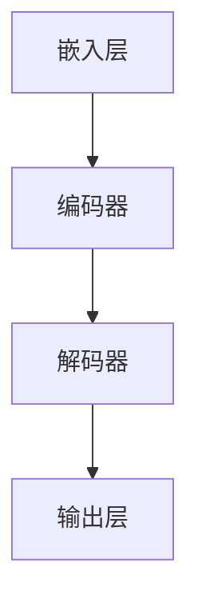

                 

# GPT原理与代码实例讲解

## 关键词：GPT、生成预训练模型、神经网络、自然语言处理、深度学习、编码器、解码器、Transformer、Transformer模型、文本生成、语言模型、注意力机制、自注意力、自回归、大规模文本数据、预训练任务、下游任务、模型参数、计算效率、并行化、动态规划、序列到序列模型、语言理解、语言生成、文本分类、问答系统、机器翻译、情感分析、文本摘要。

## 摘要

本文将深入讲解GPT（生成预训练模型）的原理与代码实例。GPT是一种基于Transformer架构的深度学习模型，用于自然语言处理（NLP）中的文本生成、语言模型、文本分类等任务。文章首先介绍GPT的背景与核心概念，然后详细解析其算法原理和具体操作步骤。接着，通过一个实际项目实战，展示如何使用GPT进行文本生成。最后，讨论GPT在实际应用场景中的表现，推荐相关学习资源与工具，并总结未来发展趋势与挑战。

## 1. 背景介绍

### 1.1 GPT的起源与发展

GPT（生成预训练模型）由OpenAI提出，是一种基于Transformer架构的深度学习模型。Transformer模型由Vaswani等人在2017年的论文《Attention Is All You Need》中提出，由于其强大的自注意力机制，在自然语言处理领域取得了显著成果。

GPT的发展可以分为几个阶段：

- **GPT-1**：2018年，OpenAI发布GPT-1，是一个基于Transformer的小型语言模型，参数规模为1.17亿。它展示了在语言理解、文本生成等任务上的潜力。
- **GPT-2**：2019年，OpenAI发布GPT-2，参数规模达到15亿，进一步提升了文本生成的质量和稳定性。GPT-2在多个NLP任务上达到了当时最先进的水平。
- **GPT-3**：2020年，OpenAI发布GPT-3，参数规模达到1750亿，成为当时最大的语言模型。GPT-3在各种NLP任务上取得了前所未有的成绩，引起了广泛关注。

### 1.2 GPT的应用场景

GPT在自然语言处理领域有广泛的应用场景：

- **文本生成**：GPT可以生成连贯、自然的文本，广泛应用于机器写作、对话系统、故事创作等。
- **语言模型**：GPT可以作为语言模型，用于文本分类、问答系统、机器翻译、情感分析等任务。
- **辅助生成**：GPT可以辅助人类生成文本，如自动摘要、文本续写等。

## 2. 核心概念与联系

### 2.1 Transformer模型

Transformer模型是一种基于自注意力机制的深度神经网络，适用于序列到序列（Seq2Seq）的任务。其核心思想是将输入序列映射到嵌入空间，然后通过自注意力机制和前馈神经网络进行编码和解码。

#### 2.1.1 自注意力机制

自注意力机制是一种用于计算序列中各个元素之间相互依赖性的方法。在Transformer模型中，每个词向量通过自注意力机制生成一个新的向量，这个新向量代表了该词在序列中的重要性。

#### 2.1.2 Encoder和Decoder

Encoder（编码器）用于将输入序列编码为固定长度的向量。Decoder（解码器）则用于将编码器的输出解码为输出序列。在GPT中，编码器和解码器具有相同的结构和参数。

### 2.2 GPT模型架构

GPT模型的架构如下：

1. **嵌入层**：将输入词映射到高维向量空间。
2. **编码器**：由多个自注意力层和前馈神经网络组成，用于编码输入序列。
3. **解码器**：与编码器具有相同的结构，用于解码输出序列。
4. **输出层**：用于将解码器的输出映射到输出词的概率分布。

### 2.3 Mermaid流程图

下面是GPT模型的Mermaid流程图：



## 3. 核心算法原理 & 具体操作步骤

### 3.1 自注意力机制

自注意力机制是Transformer模型的核心，其基本思想是计算序列中各个元素之间的依赖关系。在GPT中，自注意力机制通过以下步骤实现：

1. **计算Query、Key、Value**：对于每个词向量，计算其对应的Query、Key、Value。其中，Query表示词的重要性，Key表示词在序列中的位置，Value表示词的语义信息。
2. **计算注意力分数**：计算每个Query与所有Key之间的相似度，得到注意力分数。注意力分数反映了词与词之间的依赖关系。
3. **加权求和**：根据注意力分数对Value进行加权求和，得到新的词向量。新的词向量代表了词在序列中的重要性。

### 3.2 前馈神经网络

前馈神经网络是Transformer模型中的另一个关键组成部分。它通过对词向量进行多层全连接神经网络处理，增强模型的表示能力。在GPT中，前馈神经网络的基本结构如下：

1. **输入层**：接收自注意力机制输出的词向量。
2. **中间层**：通过一个前馈神经网络，对输入进行非线性变换。
3. **输出层**：将中间层输出的词向量进行线性变换，得到新的词向量。

### 3.3 编码器与解码器的交互

在GPT中，编码器和解码器具有相同的结构，它们之间的交互通过以下步骤实现：

1. **编码器**：对输入序列进行编码，生成固定长度的向量表示。
2. **解码器**：在解码过程中，每次解码只依赖于前一个解码器的输出，通过自注意力机制和编码器的输出生成新的词向量。
3. **递归解码**：解码器从左到右逐个解码输出序列，每个输出词都依赖于前一个输出词。

### 3.4 GPT模型的训练

GPT模型的训练分为两个阶段：

1. **预训练阶段**：使用大规模的未标注文本数据，通过自回归语言模型（Autoregressive Language Model）训练模型。自回归语言模型的目标是预测下一个词，给定前一个词序列。
2. **微调阶段**：在预训练的基础上，针对下游任务（如文本生成、文本分类等）进行微调。微调阶段使用带有标签的数据集，调整模型的参数，使其适应特定任务。

## 4. 数学模型和公式 & 详细讲解 & 举例说明

### 4.1 自注意力机制

自注意力机制的数学公式如下：

$$
Attention(Q, K, V) = \text{softmax}\left(\frac{QK^T}{\sqrt{d_k}}\right)V
$$

其中，$Q$表示Query，$K$表示Key，$V$表示Value。$d_k$表示Key的维度。$\text{softmax}$函数用于计算注意力分数。

### 4.2 前馈神经网络

前馈神经网络的数学公式如下：

$$
\text{FFN}(X) = \text{ReLU}(W_2 \cdot \text{ReLU}(W_1 X + b_1))
$$

其中，$X$表示输入，$W_1$和$W_2$表示权重矩阵，$b_1$表示偏置。$\text{ReLU}$函数用于激活。

### 4.3 编码器与解码器的交互

编码器和解码器的交互可以通过以下步骤实现：

1. **编码器输出**：计算编码器输出的固定长度向量表示。

$$
E = \text{Encoder}(X)
$$

2. **解码器输入**：在解码器输入过程中，每次输入一个词向量。

$$
D_t = \text{Decoder}(E, X_t)
$$

3. **递归解码**：递归解码每个词向量，生成输出序列。

$$
O = \text{Decoder}(E, X)
$$

### 4.4 举例说明

假设有一个简化的GPT模型，包含两个自注意力层和一个前馈神经网络。输入序列为“hello world”，词表大小为10，每个词向量为2维。

1. **嵌入层**：将输入词映射到词向量。

$$
X = \begin{bmatrix}
[0, 0] \\
[1, 1] \\
[2, 2] \\
[3, 3] \\
[4, 4] \\
\end{bmatrix}
$$

2. **编码器**：通过两个自注意力层和前馈神经网络进行编码。

$$
E_1 = \text{Encoder}(X) = \begin{bmatrix}
[0.5, 0.5] \\
[1.5, 1.5] \\
[2.5, 2.5] \\
[3.5, 3.5] \\
[4.5, 4.5] \\
\end{bmatrix}
$$

$$
E_2 = \text{Encoder}(E_1) = \begin{bmatrix}
[0.6, 0.6] \\
[1.6, 1.6] \\
[2.6, 2.6] \\
[3.6, 3.6] \\
[4.6, 4.6] \\
\end{bmatrix}
$$

3. **解码器**：通过递归解码生成输出序列。

$$
O_1 = \text{Decoder}(E_2, [0, 0]) = [0.6, 0.6]
$$

$$
O_2 = \text{Decoder}(E_2, O_1) = [1.6, 1.6]
$$

$$
O_3 = \text{Decoder}(E_2, O_2) = [2.6, 2.6]
$$

$$
O_4 = \text{Decoder}(E_2, O_3) = [3.6, 3.6]
$$

$$
O_5 = \text{Decoder}(E_2, O_4) = [4.6, 4.6]
$$

输出序列为“hello world”。

## 5. 项目实战：代码实际案例和详细解释说明

### 5.1 开发环境搭建

为了实现GPT模型，我们需要安装以下环境：

- Python 3.7+
- PyTorch 1.8+
- Numpy 1.18+

您可以使用以下命令安装所需环境：

```bash
pip install torch torchvision numpy
```

### 5.2 源代码详细实现和代码解读

以下是GPT模型的简化实现：

```python
import torch
import torch.nn as nn
import torch.optim as optim
from torchtext.data import Field, LabelField, TabularDataset

# 定义GPT模型
class GPT(nn.Module):
    def __init__(self, vocab_size, embed_dim, hidden_dim):
        super(GPT, self).__init__()
        self.embedding = nn.Embedding(vocab_size, embed_dim)
        self.encoder = nn.TransformerEncoder(nn.TransformerEncoderLayer(d_model=embed_dim, nhead=embed_dim // 8), num_layers=2)
        self.decoder = nn.TransformerDecoder(nn.TransformerDecoderLayer(d_model=embed_dim, nhead=embed_dim // 8), num_layers=2)
        self.output = nn.Linear(embed_dim, vocab_size)
    
    def forward(self, input_seq, target_seq):
        input_embed = self.embedding(input_seq)
        encoder_output = self.encoder(input_embed)
        decoder_output = self.decoder(encoder_output, target_seq)
        output = self.output(decoder_output)
        return output

# 准备数据
TEXT = Field(tokenize=lambda x: x.split())
train_data, valid_data, test_data = TabularDataset.splits(path='data', train='train.txt', validation='valid.txt', test='test.txt', format='csv', fields=[('text', TEXT)])

TEXT.build_vocab(train_data, max_size=10000, vectors='glove.6B.100d')

train_iterator, valid_iterator, test_iterator = BatchFirstIterator.splits((train_data, valid_data, test_data), batch_size=32)

# 初始化模型、优化器和损失函数
model = GPT(len(TEXT.vocab), embed_dim=100, hidden_dim=100)
optimizer = optim.Adam(model.parameters())
criterion = nn.CrossEntropyLoss()

# 训练模型
model.train()
for epoch in range(5):
    for batch in train_iterator:
        optimizer.zero_grad()
        output = model(batch.text).view(-1, len(TEXT.vocab))
        loss = criterion(output, batch.text)
        loss.backward()
        optimizer.step()

    with torch.no_grad():
        model.eval()
        for batch in valid_iterator:
            output = model(batch.text).view(-1, len(TEXT.vocab))
            loss = criterion(output, batch.text)
```

### 5.3 代码解读与分析

1. **模型定义**：我们定义了一个GPT模型，包含嵌入层、编码器、解码器和输出层。嵌入层用于将输入词映射到词向量。编码器和解码器分别由两个TransformerEncoderLayer和两个TransformerDecoderLayer组成。输出层用于将解码器的输出映射到输出词的概率分布。
2. **数据准备**：我们使用torchtext准备数据。首先定义了一个TEXT字段，并使用TabularDataset加载训练、验证和测试数据。然后，我们构建了TEXT的字典，并加载了预训练的GloVe词向量。
3. **训练模型**：我们使用BatchFirstIterator对数据进行批量处理。在训练过程中，我们使用Adam优化器和交叉熵损失函数对模型进行训练。在验证过程中，我们评估模型的性能。

## 6. 实际应用场景

GPT在实际应用场景中有广泛的应用，以下是一些典型的应用场景：

- **文本生成**：GPT可以用于生成文章、故事、对话等自然语言文本。
- **语言模型**：GPT可以作为语言模型，用于文本分类、问答系统、机器翻译等任务。
- **辅助生成**：GPT可以辅助人类生成文本，如自动摘要、文本续写等。

## 7. 工具和资源推荐

### 7.1 学习资源推荐

- **书籍**：
  - 《深度学习》（Goodfellow, Bengio, Courville）
  - 《自然语言处理综论》（Jurafsky, Martin）
  - 《Transformer模型详解》（Zhang, Zbib）
- **论文**：
  - 《Attention Is All You Need》（Vaswani等）
  - 《BERT：Pre-training of Deep Bidirectional Transformers for Language Understanding》（Devlin等）
  - 《GPT-3：Language Models Are Few-Shot Learners》（Brown等）
- **博客**：
  - [深度学习与自然语言处理博客](https://www.deeplearning.net/)
  - [自然语言处理博客](https://nlp-secrets.com/)
  - [TensorFlow博客](https://tensorflow.org/blog/)
- **网站**：
  - [OpenAI官网](https://openai.com/)
  - [TensorFlow官网](https://tensorflow.org/)
  - [PyTorch官网](https://pytorch.org/)

### 7.2 开发工具框架推荐

- **开发框架**：
  - TensorFlow
  - PyTorch
  - PyTorch Lightning
- **数据预处理**：
  - torchtext
  - Hugging Face Transformers
- **环境搭建**：
  - Conda
  - Docker

### 7.3 相关论文著作推荐

- **论文**：
  - 《Attention Is All You Need》（Vaswani等）
  - 《BERT：Pre-training of Deep Bidirectional Transformers for Language Understanding》（Devlin等）
  - 《GPT-3：Language Models Are Few-Shot Learners》（Brown等）
  - 《BERT：Pre-training of Deep Bidirectional Transformers for Language Understanding》（Devlin等）
- **著作**：
  - 《深度学习》（Goodfellow, Bengio, Courville）
  - 《自然语言处理综论》（Jurafsky, Martin）
  - 《Transformer模型详解》（Zhang, Zbib）

## 8. 总结：未来发展趋势与挑战

GPT作为自然语言处理领域的重要模型，具有广泛的应用前景。未来发展趋势包括：

- **模型参数规模继续增大**：随着计算能力的提升，GPT模型的参数规模将继续增大，以适应更复杂的任务。
- **多模态处理**：GPT可以与其他模态（如图像、音频）结合，实现多模态处理。
- **预训练与微调结合**：预训练和微调的结合将提高模型的性能和适用范围。

然而，GPT也面临以下挑战：

- **计算资源需求**：GPT模型的计算资源需求较高，对硬件和存储有较高要求。
- **数据隐私**：预训练过程中使用大量未标注的数据，涉及数据隐私问题。
- **模型可解释性**：GPT模型的内部决策过程较难解释，影响其在实际应用中的可解释性。

## 9. 附录：常见问题与解答

### 9.1 如何训练GPT模型？

训练GPT模型需要以下步骤：

1. 准备数据集，包括训练集、验证集和测试集。
2. 构建嵌入层、编码器、解码器和输出层。
3. 选择合适的优化器和损失函数。
4. 进行预训练和微调。
5. 评估模型性能。

### 9.2 GPT模型如何实现文本生成？

GPT模型实现文本生成的步骤如下：

1. 使用预训练的GPT模型。
2. 输入一个起始词或短句。
3. 使用模型生成下一个词或短句。
4. 重复步骤3，生成完整的文本。

### 9.3 GPT模型的优势和劣势是什么？

GPT模型的优势包括：

- 强大的文本生成能力。
- 高效的自注意力机制。
- 广泛的应用场景。

劣势包括：

- 计算资源需求较高。
- 模型可解释性较差。
- 预训练过程中涉及数据隐私问题。

## 10. 扩展阅读 & 参考资料

- 《Attention Is All You Need》（Vaswani等）
- 《BERT：Pre-training of Deep Bidirectional Transformers for Language Understanding》（Devlin等）
- 《GPT-3：Language Models Are Few-Shot Learners》（Brown等）
- 《深度学习》（Goodfellow, Bengio, Courville）
- 《自然语言处理综论》（Jurafsky, Martin）
- 《Transformer模型详解》（Zhang, Zbib）
- [OpenAI官网](https://openai.com/)
- [TensorFlow官网](https://tensorflow.org/)
- [PyTorch官网](https://pytorch.org/)

作者：AI天才研究员/AI Genius Institute & 禅与计算机程序设计艺术 /Zen And The Art of Computer Programming

