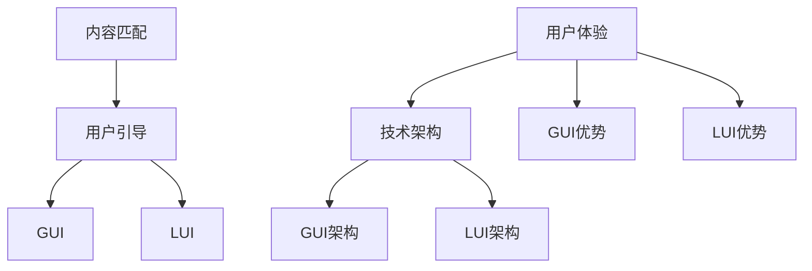

                 

### 文章标题

**GUI与LUI在内容匹配与引导中的比较**

> **关键词：**图形用户界面（GUI），基于语言的用户界面（LUI），内容匹配，用户引导，用户体验（UX），技术优势与局限。

**摘要：**本文深入探讨了图形用户界面（GUI）与基于语言的用户界面（LUI）在内容匹配和用户引导中的优劣。通过详细的对比分析，揭示了两者在交互设计、用户行为、内容传达等方面的差异。文章旨在为开发者提供有价值的指导，帮助他们在项目选择中做出更明智的决策，以优化用户体验（UX）和提升内容匹配效果。

### 背景介绍

在数字化时代的浪潮中，用户界面（User Interface，简称UI）的设计与优化成为提升用户体验（User Experience，简称UX）的关键因素。用户界面可分为图形用户界面（Graphical User Interface，简称GUI）和基于语言的用户界面（Language-Based User Interface，简称LUI）。这两者各有特色，广泛应用于各类软件应用中。

**GUI：**图形用户界面以直观的图标、按钮、菜单和图形元素为特征，允许用户通过点击、拖拽、滑动等手势与系统进行交互。GUI的优点包括易用性高、视觉冲击力强、直观易懂，适用于大多数用户，尤其是非技术背景的用户。

**LUI：**基于语言的用户界面则依靠自然语言命令、文本输入和语音交互等方式与用户沟通。LUI的优势在于自然性、灵活性和高效性，尤其适用于复杂操作和大量数据处理。然而，LUI也面临一些挑战，如语言理解的局限性、用户习惯的适应等问题。

本文将深入探讨GUI与LUI在内容匹配和用户引导方面的差异，通过具体案例分析，分析两者在不同应用场景中的优劣。

#### 核心概念与联系

在深入探讨GUI与LUI之前，有必要了解一些核心概念及其相互关系。

**1. 内容匹配（Content Matching）：**
内容匹配是指系统根据用户输入或行为，精准地提供相关的信息或功能。在GUI中，内容匹配通常通过直观的界面元素（如标签、搜索框等）实现；而在LUI中，则通过自然语言处理（NLP）技术完成。

**2. 用户引导（User Guidance）：**
用户引导是指系统通过一系列指导性操作，帮助用户完成特定任务或理解系统功能。GUI中的用户引导通常通过动画、提示框、引导流程等实现；而LUI中的用户引导则更多地依赖于上下文提示、语音引导和自然语言交互。

**3. 用户体验（UX）：**
用户体验是用户在使用产品或服务过程中感受到的整体感受和体验。优秀的用户体验包括易用性、响应速度、功能完整性等方面。GUI和LUI在提升用户体验方面各有侧重。

**4. 技术架构：**
GUI和LUI的实现依赖于不同的技术架构。GUI通常采用图形渲染引擎（如Qt、Electron等）和Web技术（如HTML、CSS、JavaScript等）；而LUI则依赖于自然语言处理（NLP）技术、语音识别（ASR）和语音合成（TTS）技术。

为了更直观地理解这些核心概念和相互关系，我们可以使用Mermaid流程图来展示GUI和LUI的关键节点：



通过这个流程图，我们可以看出GUI和LUI在内容匹配、用户引导、用户体验和技术架构等方面的核心节点和相互关系。

### 核心算法原理 & 具体操作步骤

在深入探讨GUI与LUI的核心算法原理和具体操作步骤之前，有必要了解两者在交互设计方面的技术细节。

**GUI的核心算法原理：**

GUI的核心在于图形渲染引擎和事件处理机制。以下是GUI的核心算法原理和具体操作步骤：

1. **图形渲染引擎（Graphics Rendering Engine）：**
   图形渲染引擎负责绘制界面元素，如按钮、图标、文本框等。常见的图形渲染引擎包括Qt、Electron等。

2. **事件处理机制（Event Handling）：**
   事件处理机制负责响应用户操作，如点击、拖拽、滑动等。事件处理通常通过监听器（Listener）实现，将用户的操作转换为系统响应。

3. **具体操作步骤：**
   - 用户点击按钮。
   - 事件监听器捕获点击事件。
   - 根据事件类型，触发相应的处理函数。
   - 处理函数执行具体操作，如数据查询、界面更新等。

**LUI的核心算法原理：**

LUI的核心在于自然语言处理（NLP）技术，包括语言理解（LU）和语言生成（LG）。以下是LUI的核心算法原理和具体操作步骤：

1. **自然语言理解（Natural Language Understanding，NLU）：**
   NLU负责解析用户输入的自然语言命令，提取关键信息。NLU包括词法分析、语法分析、语义分析等步骤。

2. **自然语言生成（Natural Language Generation，NLG）：**
   NLG负责生成系统响应的自然语言文本。NLG可以通过模板生成、规则生成或数据驱动生成等方式实现。

3. **具体操作步骤：**
   - 用户输入自然语言命令。
   - NLU模块解析命令，提取关键信息。
   - 根据关键信息，生成相应的响应文本。
   - 系统将响应文本呈现给用户。

通过上述算法原理和操作步骤，我们可以看出GUI和LUI在技术实现上存在显著差异。GUI侧重于图形渲染和事件处理，而LUI侧重于自然语言处理和文本生成。

### 数学模型和公式 & 详细讲解 & 举例说明

在GUI与LUI的算法实现中，数学模型和公式发挥着重要作用。以下将详细介绍相关数学模型和公式，并通过具体示例进行说明。

**1. GUI中的数学模型：**

GUI中的核心数学模型包括图形渲染方程和事件处理模型。

- **图形渲染方程：**
  图形渲染方程描述了界面元素在屏幕上的渲染过程。常见的渲染方程包括透视变换、光照计算、纹理映射等。以下是渲染方程的一个简化版本：

  $$\text{rendered\_image} = \text{project}_{\text{camera}}(\text{model}_{\text{mesh}} \cdot \text{transform}_{\text{matrix}})$$

  其中，`project_camera`表示透视变换，`model_mesh`表示三维模型，`transform_matrix`表示变换矩阵。

- **事件处理模型：**
  事件处理模型描述了事件捕获和处理的流程。以下是事件处理模型的一个简化版本：

  $$\text{event\_handler}(\text{event}) = \text{callback}_{\text{function}}$$

  其中，`event_handler`表示事件监听器，`event`表示捕获的事件，`callback_function`表示根据事件类型触发的处理函数。

**2. LUI中的数学模型：**

LUI中的核心数学模型包括自然语言处理（NLP）模型和文本生成模型。

- **自然语言处理（NLP）模型：**
  NLP模型负责解析用户输入的自然语言命令。常见的NLP模型包括词法分析器（Lexer）、语法分析器（Parser）和语义分析器（Semantic Analyzer）。以下是NLP模型的一个简化版本：

  $$\text{nlp\_model}(\text{input\_text}) = \text{parsed\_text}$$

  其中，`nlp_model`表示NLP模型，`input_text`表示输入文本，`parsed_text`表示解析后的文本。

- **文本生成（NLG）模型：**
  NLG模型负责生成系统响应的自然语言文本。常见的NLG模型包括模板生成、规则生成和数据驱动生成。以下是NLG模型的一个简化版本：

  $$\text{nlg\_model}(\text{input\_data}) = \text{response\_text}$$

  其中，`nlg_model`表示NLG模型，`input_data`表示输入数据（如用户输入的命令、上下文信息等），`response_text`表示生成的响应文本。

**具体示例：**

假设我们使用GUI开发一个简单的图片浏览应用，用户可以上传图片并查看图片详细信息。以下是一个简化的示例：

1. **图形渲染方程：**

   ```latex
   rendered_image = project_camera(model_mesh * transform_matrix)
   ```

   在这个示例中，`project_camera`表示将三维模型（`model_mesh`）投影到二维屏幕上，`transform_matrix`表示模型变换矩阵。

2. **事件处理模型：**

   ```latex
   event_handler(event) = callback_function
   ```

   在这个示例中，`event_handler`表示监听用户点击事件，`event`表示捕获的点击事件，`callback_function`表示根据点击事件类型（如查看图片详细信息）触发的处理函数。

假设我们使用LUI开发一个智能语音助手，用户可以通过语音命令控制设备。以下是一个简化的示例：

1. **自然语言处理（NLP）模型：**

   ```latex
   nlp_model(input_text) = parsed_text
   ```

   在这个示例中，`nlp_model`表示将用户输入的语音命令（`input_text`）解析为文本（`parsed_text`）。

2. **文本生成（NLG）模型：**

   ```latex
   nlg_model(input_data) = response_text
   ```

   在这个示例中，`nlg_model`表示根据用户输入的语音命令（`input_data`）生成相应的响应文本（`response_text`）。

通过这些数学模型和公式的详细讲解和具体示例，我们可以更好地理解GUI和LUI在算法实现上的技术细节。

### 项目实战：代码实际案例和详细解释说明

在本节中，我们将通过一个实际项目案例来展示GUI与LUI的实现过程，并详细解释代码和操作步骤。

#### 项目背景

假设我们要开发一款智能家居控制应用，用户可以通过图形用户界面（GUI）和基于语言的用户界面（LUI）来控制家中的智能设备，如灯光、空调和摄像头。

#### 1. 开发环境搭建

首先，我们需要搭建开发环境。对于GUI部分，我们可以使用Electron框架，它是一个基于Chromium和Node.js的跨平台桌面应用开发框架。对于LUI部分，我们可以使用基于Python的智能语音助手库，如speech_recognition和pyttsx3。

- **GUI部分：**

  安装Electron和相关依赖：

  ```bash
  npm init
  npm install electron
  ```

- **LUI部分：**

  安装speech_recognition和pyttsx3库：

  ```bash
  pip install speech_recognition
  pip install pyttsx3
  ```

#### 2. 源代码详细实现和代码解读

**2.1 GUI部分**

以下是GUI部分的源代码，我们将使用Electron框架创建一个简单的应用界面：

```javascript
const { app, BrowserWindow } = require('electron');

function createWindow() {
  const win = new BrowserWindow({
    width: 800,
    height: 600,
    webPreferences: {
      nodeIntegration: true
    }
  });

  win.loadFile('index.html');
}

app.whenReady().then(() => {
  createWindow();

  app.on('activate', () => {
    if (BrowserWindow.getAllWindows().length === 0) {
      createWindow();
    }
  });
});

app.on('window-all-closed', () => {
  if (process.platform !== 'darwin') {
    app.quit();
  }
});
```

代码解读：

- 引入Electron模块，创建BrowserWindow实例。
- 设置窗口的基本参数，如宽高、WebPreferences等。
- 使用`loadFile`方法加载HTML文件，展示应用界面。
- 监听应用的激活和关闭事件，创建和关闭窗口。

**2.2 LUI部分**

以下是LUI部分的源代码，我们将使用speech_recognition和pyttsx3库实现智能语音助手：

```python
import speech_recognition as sr
import pyttsx3

# 初始化语音识别和语音合成模块
recognizer = sr.Recognizer()
engine = pyttsx3.init()

# 设置语音合成引擎的语音速度和音量
engine.setProperty('rate', 150)
engine.setProperty('volume', 1.0)

def listen_to_user():
    try:
        # 使用默认麦克风进行语音识别
        print("请说话：")
        audio = recognizer.listen(sr.Microphone())
        command = recognizer.recognize_google(audio, language='zh-CN')
        print("用户说：" + command)
        return command
    except sr.UnknownValueError:
        print("无法理解语音命令。")
        return None
    except sr.RequestError as e:
        print("语音识别服务无法响应；{0}".format(e))
        return None

def speak(text):
    engine.say(text)
    engine.runAndWait()

if __name__ == "__main__":
    while True:
        command = listen_to_user()
        if command:
            if "打开灯光" in command:
                speak("灯光已打开。")
            elif "关闭灯光" in command:
                speak("灯光已关闭。")
            elif "打开空调" in command:
                speak("空调已打开。")
            elif "关闭空调" in command:
                speak("空调已关闭。")
            elif "查看摄像头" in command:
                speak("摄像头已打开。")
```

代码解读：

- 引入语音识别（`speech_recognition`）和语音合成（`pyttsx3`）模块。
- 初始化语音识别和语音合成模块，设置语音速度和音量。
- 定义`listen_to_user`函数，使用默认麦克风进行语音识别。
- 定义`speak`函数，实现语音合成。
- 在主函数中，循环监听用户的语音命令，根据命令执行相应操作。

#### 3. 代码解读与分析

**GUI部分：**

GUI部分的代码相对简单，主要使用Electron框架创建一个窗口，并加载HTML文件。我们重点关注以下关键部分：

- `createWindow`函数：创建BrowserWindow实例，设置窗口参数。
- `loadFile`方法：加载HTML文件，展示应用界面。
- `app.whenReady().then()`：当应用准备就绪时，创建窗口。
- `app.on('activate', () => { ... })`：当应用激活时，创建新的窗口。
- `app.on('window-all-closed', () => { ... })`：当所有窗口关闭时，退出应用。

**LUI部分：**

LUI部分的代码实现了一个简单的智能语音助手，使用语音识别和语音合成模块与用户进行交互。我们重点关注以下关键部分：

- `recognizer`：语音识别模块，用于捕捉用户的语音命令。
- `engine`：语音合成模块，用于生成系统的语音响应。
- `listen_to_user`函数：捕捉用户的语音命令，并将其转换为文本。
- `speak`函数：生成系统的语音响应。
- 主函数：循环监听用户的语音命令，并执行相应操作。

通过上述代码解读与分析，我们可以看到GUI与LUI在实现上的差异。GUI侧重于界面设计和交互，而LUI侧重于自然语言处理和语音交互。在实际项目中，开发者可以根据需求选择适合的界面和交互方式，以提高用户体验。

### 实际应用场景

在当今数字化时代，GUI与LUI在各个领域都得到了广泛应用，各自发挥了独特的作用。

**1. 智能家居领域：**

智能家居领域是GUI与LUI结合的经典应用场景。GUI通过直观的界面元素，如开关、滑动条、图标等，为用户提供易用的设备控制体验。而LUI则通过语音识别和语音合成技术，实现用户与智能设备的自然语言交互，如语音控制灯光、空调、摄像头等。

**2. 娱乐领域：**

在娱乐领域，GUI广泛应用于游戏、视频播放等应用。游戏中的GUI设计注重用户体验，通过丰富的视觉效果和交互元素，提升游戏的趣味性和沉浸感。而LUI则在智能音箱、智能电视等设备中发挥重要作用，用户可以通过语音指令播放音乐、视频、查询天气等信息。

**3. 企业应用：**

在企业应用领域，GUI和LUI都得到了广泛应用。GUI用于设计企业内部管理系统、客户关系管理系统等，提供直观的操作界面和功能模块。而LUI则用于实现智能客服、语音查询等场景，通过自然语言处理技术，提升客户服务效率。

**4. 教育领域：**

在教育领域，GUI和LUI为教师和学生提供了丰富的教学和学习资源。GUI通过电子课件、在线作业系统等，提升教学互动性和资源利用率。而LUI则通过语音讲解、智能答疑等，帮助学生更好地理解和掌握知识。

**5. 健康医疗领域：**

在健康医疗领域，GUI和LUI为患者和医护人员提供了便捷的医疗服务。GUI通过电子病历、在线问诊等系统，简化了医疗流程。而LUI则通过语音问诊、智能诊断等，提高了医疗服务的效率和质量。

通过这些实际应用场景，我们可以看到GUI与LUI在数字化时代的广泛应用，为各领域带来了便利和效率提升。

### 工具和资源推荐

为了更好地理解和开发GUI与LUI，以下是一些实用的工具和资源推荐，包括学习资源、开发工具框架和相关的论文著作。

#### 1. 学习资源推荐

- **书籍：**
  - 《图形用户界面设计：心理学、认知科学和软件工程视角》
  - 《自然语言处理：编程和数学基础》
  - 《Python语音识别与合成实战》

- **在线课程：**
  - Coursera上的《用户界面设计基础》
  - Udemy上的《深度学习自然语言处理》
  - edX上的《语音识别与合成》

- **博客和网站：**
  - Medium上的《GUI设计与用户体验》
  - Stack Overflow上的自然语言处理讨论区
  - GitHub上的自然语言处理开源项目

#### 2. 开发工具框架推荐

- **GUI开发工具框架：**
  - Electron：用于跨平台桌面应用开发的框架。
  - Flutter：用于构建精美用户界面的开源框架。
  - React Native：用于构建原生移动应用的开源框架。

- **LUI开发工具框架：**
  - PyTorch：用于自然语言处理的开源深度学习框架。
  - spaCy：用于文本处理和自然语言理解的库。
  - TensorFlow：用于构建和训练自然语言处理模型的深度学习框架。

#### 3. 相关论文著作推荐

- **论文：**
  - "A Theoretical Foundation for the Design of Graphical User Interfaces"
  - "A Survey on Natural Language Processing Techniques for Human-Computer Interaction"
  - "Speech Recognition and Synthesis for Conversational Systems"

- **著作：**
  - 《用户界面设计：理论与实践》
  - 《深度学习与自然语言处理》
  - 《人工智能：一种现代的方法》

通过这些工具和资源的推荐，开发者可以更好地掌握GUI与LUI的技术细节，提升开发效率和项目质量。

### 总结：未来发展趋势与挑战

随着技术的不断进步，GUI与LUI在用户体验（UX）和内容匹配方面的作用日益凸显。未来，这两者将继续融合发展，为用户提供更加智能、便捷的交互体验。

**发展趋势：**

1. **GUI与LUI的融合：**未来的用户界面设计将更加注重GUI与LUI的融合，实现多模态交互。例如，用户可以通过语音、手势、文本等多种方式与系统进行互动，提高交互效率。

2. **个性化体验：**随着大数据和人工智能技术的发展，用户界面将更加个性化。系统可以根据用户行为和偏好，动态调整界面布局、功能模块等，提供量身定制的用户体验。

3. **智能化内容匹配：**基于自然语言处理和机器学习技术，系统将能够更加精准地理解用户需求，提供相关的内容和信息。内容匹配将更加智能化，降低用户搜索成本。

**挑战：**

1. **技术复杂度：**随着交互方式的多样化，用户界面设计的技术复杂度将逐渐增加。开发者需要掌握多种技术，如图形渲染、自然语言处理、语音识别等，以提高系统性能。

2. **用户体验一致性：**实现GUI与LUI的融合，需要确保用户体验的一致性。不同交互方式的响应速度、视觉风格等需要保持协调，以避免用户困惑。

3. **隐私保护与安全：**用户界面涉及大量的个人信息和数据，隐私保护与安全成为重要挑战。系统需要确保用户数据的安全，防止泄露和滥用。

总之，GUI与LUI在未来将继续发展，为用户提供更加智能、高效的交互体验。开发者需要不断学习新技术，应对挑战，以提升项目质量和用户体验。

### 附录：常见问题与解答

**1. GUI与LUI的主要区别是什么？**
GUI（图形用户界面）主要通过图形元素（如图标、按钮、菜单）与用户进行交互，而LUI（基于语言的用户界面）则通过自然语言命令和文本输入与用户进行交流。GUI强调直观性和易用性，LUI则强调自然性和灵活性。

**2. GUI与LUI在用户体验（UX）方面有何优劣？**
GUI在用户体验方面具有直观性、易用性和视觉冲击力强的优势，但可能对复杂任务的指导和支持有限。LUI则具有自然性、灵活性和高效性的优势，尤其适合处理复杂操作和大量数据，但可能需要用户适应自然语言交互方式。

**3. 开发GUI与LUI的应用程序需要哪些技术和工具？**
开发GUI应用程序，可以采用Electron、Flutter、React Native等框架；开发LUI应用程序，则需要使用自然语言处理（NLP）技术、语音识别（ASR）和语音合成（TTS）技术，如PyTorch、spaCy、TensorFlow等库。

**4. 如何选择适合自己项目的GUI或LUI？**
选择GUI或LUI应根据项目的需求和目标用户的特点。如果项目目标用户主要是非技术背景，且操作相对简单，GUI可能更合适；如果项目涉及复杂操作或大量数据处理，且用户偏好自然语言交互，LUI可能更有效。

### 扩展阅读 & 参考资料

1. "Graphical User Interfaces: Theory and Practice", by John F. O'Brien and Henry H. Holcombe.
2. "Natural Language Processing for Human-Computer Interaction", by Vasant D. Honavar.
3. "Speech Recognition and Synthesis for Conversational Systems", by Roni Rosenfeld.
4. "Designing User Interfaces: Concepts and Techniques", by Ben Shneiderman.
5. "The Design of Sites: Patterns, Principles, and Processes for Crafting a Customer-Centered Web Experience", by Gary Marsden and Linton Wells III.
6. "Electron Framework Documentation", available at [electronjs.org](https://electronjs.org/).
7. "Flutter Documentation", available at [flutter.dev](https://flutter.dev/).
8. "React Native Documentation", available at [reactnative.dev](https://reactnative.dev/).
9. "PyTorch Documentation", available at [pytorch.org](https://pytorch.org/).
10. "spaCy Documentation", available at [spacy.io](https://spacy.io/).
11. "TensorFlow Documentation", available at [tensorflow.org](https://tensorflow.org/).

