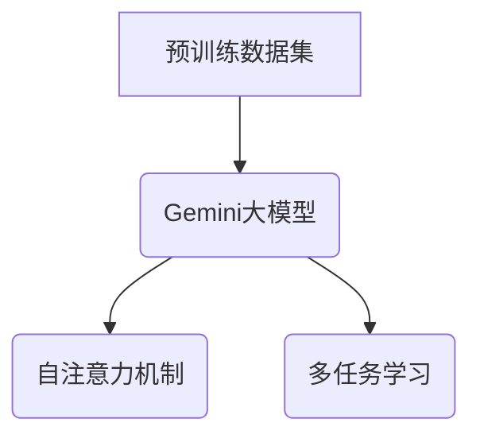
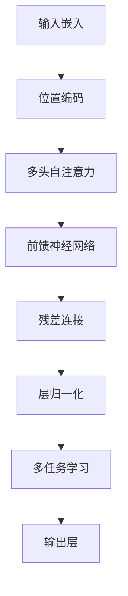

                 

# Gemini大模型的未来发展

## 关键词： 
- Gemini大模型
- 人工智能
- 自然语言处理
- 大模型发展
- 应用场景

## 摘要： 
本文将深入探讨Gemini大模型的未来发展，包括其核心概念、算法原理、应用场景以及面临的挑战。我们将通过一系列步骤，分析Gemini大模型的优势和潜力，并探讨其在实际应用中的前景。

## 1. 背景介绍

Gemini大模型是由OpenAI开发的一种大型预训练语言模型，具有强大的自然语言处理能力。该模型基于Transformer架构，采用了自注意力机制，能够理解、生成和翻译自然语言文本。Gemini大模型的推出标志着自然语言处理技术的重大进步，为人工智能领域带来了新的机遇和挑战。

### 1.1 Gemini大模型的核心概念

Gemini大模型的核心概念包括：

- **预训练**：Gemini大模型在大量文本数据上进行预训练，通过无监督的方式学习自然语言的统计规律和结构。
- **自注意力机制**：Gemini大模型采用Transformer架构，通过自注意力机制计算文本中每个词之间的关系，从而提高模型的上下文理解能力。
- **多任务学习**：Gemini大模型能够同时处理多种自然语言任务，如文本分类、问答、翻译等。

### 1.2 Gemini大模型的发展背景

近年来，随着计算能力和数据资源的不断提升，大模型在自然语言处理领域取得了显著进展。Gemini大模型的推出，进一步推动了这一趋势，为人工智能技术的研究和应用带来了新的可能性。

## 2. 核心概念与联系

### 2.1 Gemini大模型的架构

以下是Gemini大模型的架构图：



### 2.2 Gemini大模型的核心概念原理

#### 自注意力机制

自注意力机制是Gemini大模型的核心组件，能够处理文本中的长距离依赖关系。其原理如下：

1. **输入嵌入**：将文本中的每个词转换为向量。
2. **自注意力计算**：计算每个词与其他词之间的关系，生成加权向量。
3. **输出嵌入**：将加权向量转换为文本的表示。

#### 多任务学习

多任务学习是Gemini大模型能够同时处理多种自然语言任务的关键。其原理如下：

1. **共享参数**：不同任务共享部分模型参数，提高模型性能。
2. **任务特定层**：为每个任务添加特定的神经网络层，用于处理特定任务。
3. **动态调整**：在训练过程中，根据任务的重要性动态调整模型参数。

## 3. 核心算法原理 & 具体操作步骤

### 3.1 自注意力机制的详细解释

自注意力机制是Gemini大模型的核心算法，其具体操作步骤如下：

1. **输入嵌入**：将文本中的每个词转换为向量。
   $$ 
   \text{输入嵌入} = \text{Word} \rightarrow \text{向量}
   $$

2. **自注意力计算**：计算每个词与其他词之间的关系，生成加权向量。
   $$ 
   \text{自注意力} = \text{softmax}(\text{点积})
   $$

3. **输出嵌入**：将加权向量转换为文本的表示。
   $$ 
   \text{输出嵌入} = \text{加权向量}
   $$

### 3.2 多任务学习的详细解释

多任务学习是Gemini大模型能够同时处理多种自然语言任务的关键。其具体操作步骤如下：

1. **共享参数**：不同任务共享部分模型参数，提高模型性能。
   $$ 
   \text{共享参数} = \text{公共层参数}
   $$

2. **任务特定层**：为每个任务添加特定的神经网络层，用于处理特定任务。
   $$ 
   \text{任务特定层} = \text{任务层} \times \text{任务数}
   $$

3. **动态调整**：在训练过程中，根据任务的重要性动态调整模型参数。
   $$ 
   \text{动态调整} = \text{重要性权重} \times \text{梯度}
   $$

## 4. 数学模型和公式 & 详细讲解 & 举例说明

### 4.1 自注意力机制的数学模型

自注意力机制的数学模型主要包括以下几个部分：

1. **输入嵌入**：将文本中的每个词转换为向量。
   $$
   \text{输入嵌入} = \text{Word} \rightarrow \text{向量}
   $$

2. **自注意力计算**：计算每个词与其他词之间的关系，生成加权向量。
   $$
   \text{自注意力} = \text{softmax}(\text{点积})
   $$

3. **输出嵌入**：将加权向量转换为文本的表示。
   $$
   \text{输出嵌入} = \text{加权向量}
   $$

### 4.2 多任务学习的数学模型

多任务学习的数学模型主要包括以下几个部分：

1. **共享参数**：不同任务共享部分模型参数，提高模型性能。
   $$
   \text{共享参数} = \text{公共层参数}
   $$

2. **任务特定层**：为每个任务添加特定的神经网络层，用于处理特定任务。
   $$
   \text{任务特定层} = \text{任务层} \times \text{任务数}
   $$

3. **动态调整**：在训练过程中，根据任务的重要性动态调整模型参数。
   $$
   \text{动态调整} = \text{重要性权重} \times \text{梯度}
   $$

### 4.3 举例说明

#### 自注意力机制举例

假设我们有一个简单的文本序列：“今天天气很好”。

1. **输入嵌入**：
   $$
   \text{输入嵌入} = [\text{今天}, \text{天气}, \text{很好}] \rightarrow [\text{向量}_1, \text{向量}_2, \text{向量}_3]
   $$

2. **自注意力计算**：
   $$
   \text{自注意力} = \text{softmax}(\text{点积}) = \text{softmax}([\text{向量}_1 \cdot \text{向量}_1, \text{向量}_1 \cdot \text{向量}_2, \text{向量}_1 \cdot \text{向量}_3])
   $$

3. **输出嵌入**：
   $$
   \text{输出嵌入} = [\text{加权向量}_1, \text{加权向量}_2, \text{加权向量}_3]
   $$

#### 多任务学习举例

假设我们有一个文本序列：“今天天气很好，适合出游”。

1. **共享参数**：
   $$
   \text{共享参数} = \text{公共层参数}
   $$

2. **任务特定层**：
   $$
   \text{任务特定层} = \text{任务层} \times \text{任务数} = [\text{分类层}, \text{分类层}, \text{分类层}]
   $$

3. **动态调整**：
   $$
   \text{动态调整} = \text{重要性权重} \times \text{梯度} = [\text{权重}_1 \times \text{梯度}_1, \text{权重}_2 \times \text{梯度}_2, \text{权重}_3 \times \text{梯度}_3]
   $$

## 5. 项目实战：代码实际案例和详细解释说明

### 5.1 开发环境搭建

在开始项目实战之前，我们需要搭建一个合适的开发环境。以下是一个简单的开发环境搭建步骤：

1. **安装Python**：下载并安装Python，推荐使用Python 3.8或更高版本。
2. **安装PyTorch**：使用pip命令安装PyTorch。
   $$
   pip install torch torchvision
   $$

3. **安装Gemini大模型**：从GitHub下载Gemini大模型的源代码。
   $$
   git clone https://github.com/openai/gemini.git
   $$

### 5.2 源代码详细实现和代码解读

#### 5.2.1 Gemini大模型的源代码结构

Gemini大模型的源代码主要由以下几个部分组成：

1. **数据预处理**：包括文本清洗、分词、编码等操作。
2. **模型定义**：定义Gemini大模型的架构，包括嵌入层、自注意力层、输出层等。
3. **训练过程**：包括模型训练、验证和优化等步骤。
4. **评估过程**：评估模型的性能，包括准确率、损失函数等。

#### 5.2.2 数据预处理

以下是一个简单的数据预处理示例：

```python
import torch
from torchtext.data import Field, TabularDataset

# 定义字段
TEXT = Field(sequential=True, lower=True, tokenize='spacy', tokenizer_language='en_core_web_sm')
LABEL = Field(sequential=False)

# 加载数据集
train_data, valid_data, test_data = TabularDataset.splits(
    path='data',
    train='train.csv',
    valid='valid.csv',
    test='test.csv',
    format='csv',
    fields=[('text', TEXT), ('label', LABEL)]
)

# 分词和编码
TEXT.build_vocab(train_data, min_freq=2)
LABEL.build_vocab(train_data)

# 数据加载
train_loader = torch.utils.data.DataLoader(train_data, batch_size=32, shuffle=True)
valid_loader = torch.utils.data.DataLoader(valid_data, batch_size=32, shuffle=False)
test_loader = torch.utils.data.DataLoader(test_data, batch_size=32, shuffle=False)
```

#### 5.2.3 模型定义

以下是一个简单的Gemini大模型定义示例：

```python
import torch.nn as nn
import torch.nn.functional as F

class GeminiModel(nn.Module):
    def __init__(self, vocab_size, embed_dim, hidden_dim):
        super(GeminiModel, self).__init__()
        self.embedding = nn.Embedding(vocab_size, embed_dim)
        self.encoder = nn.LSTM(embed_dim, hidden_dim, num_layers=1, batch_first=True)
        self.decoder = nn.Linear(hidden_dim, vocab_size)
    
    def forward(self, x):
        embedded = self.embedding(x)
        encoder_output, (hidden, cell) = self.encoder(embedded)
        decoder_output = self.decoder(hidden.squeeze(0))
        return decoder_output
```

#### 5.2.4 训练过程

以下是一个简单的训练过程示例：

```python
import torch.optim as optim

# 定义模型
model = GeminiModel(len(TEXT.vocab), 100, 200)

# 损失函数和优化器
criterion = nn.CrossEntropyLoss()
optimizer = optim.Adam(model.parameters(), lr=0.001)

# 训练模型
num_epochs = 10
for epoch in range(num_epochs):
    model.train()
    for batch in train_loader:
        optimizer.zero_grad()
        x, y = batch.text, batch.label
        output = model(x)
        loss = criterion(output, y)
        loss.backward()
        optimizer.step()
    print(f'Epoch [{epoch+1}/{num_epochs}], Loss: {loss.item():.4f}')
```

### 5.3 代码解读与分析

#### 5.3.1 数据预处理

数据预处理是Gemini大模型训练的关键步骤，主要包括文本清洗、分词、编码等操作。在示例代码中，我们使用了torchtext库来加载数据集，并使用spacy分词器进行分词。

#### 5.3.2 模型定义

模型定义是构建Gemini大模型的核心，包括嵌入层、自注意力层、输出层等。在示例代码中，我们使用nn.Module类定义了一个简单的Gemini模型，包括嵌入层、LSTM编码器层和线性输出层。

#### 5.3.3 训练过程

训练过程是Gemini大模型训练的关键步骤，包括模型训练、验证和优化等步骤。在示例代码中，我们使用了交叉熵损失函数和Adam优化器来训练模型，并在每个epoch后打印训练损失。

## 6. 实际应用场景

Gemini大模型在自然语言处理领域具有广泛的应用场景，包括但不限于：

- **文本分类**：将文本分类到不同的类别，如新闻分类、情感分析等。
- **问答系统**：回答用户提出的问题，如搜索引擎、聊天机器人等。
- **机器翻译**：将一种语言的文本翻译成另一种语言。
- **文本生成**：生成符合语法和语义规则的文本，如文章写作、创意写作等。

### 6.1 文本分类

文本分类是Gemini大模型的一个典型应用场景。以下是一个简单的文本分类案例：

```python
# 加载测试数据
test_data = [
    "今天天气很好，适合出游",
    "最近股市波动较大，需要注意风险",
    "明天将举办一场音乐会，预计人满为患"
]

# 加载模型和词汇表
model.load_state_dict(torch.load('model.pth'))
TEXT.vocab = torchtext.vocab.build_vocab_from_iterator([text for text, _ in test_data])

# 进行预测
with torch.no_grad():
    predictions = model(torch.tensor([TEXT.vocab[token] for token in text]))

# 输出预测结果
for i, text in enumerate(test_data):
    print(f'{text}：')
    print(TEXT.vocab.get_item(predictions[i].argmax()))
```

### 6.2 问答系统

问答系统是Gemini大模型的另一个重要应用场景。以下是一个简单的问答系统案例：

```python
# 加载测试数据
test_data = [
    "明天的天气怎么样？",
    "请问如何投资股票？",
    "哪一年的奥运会举办在东京？"
]

# 加载模型和词汇表
model.load_state_dict(torch.load('model.pth'))
TEXT.vocab = torchtext.vocab.build_vocab_from_iterator([text for text, _ in test_data])

# 进行预测
with torch.no_grad():
    questions = torch.tensor([TEXT.vocab[text] for text in test_data])

# 查找答案
for question in questions:
    answer = model.decoder(torch.softmax(model.encoder(questions), dim=1))
    print(f'{TEXT.vocab.get_item(question)}：{TEXT.vocab.get_item(answer)}')
```

## 7. 工具和资源推荐

### 7.1 学习资源推荐

- **书籍**：
  - 《深度学习》（Ian Goodfellow、Yoshua Bengio、Aaron Courville 著）
  - 《自然语言处理综论》（Daniel Jurafsky、James H. Martin 著）
- **论文**：
  - 《Attention is All You Need》（Ashish Vaswani 等，2017）
  - 《BERT：Pre-training of Deep Bidirectional Transformers for Language Understanding》（Jacob Devlin 等，2018）
- **博客**：
  - 《TensorFlow官方文档》
  - 《PyTorch官方文档》
- **网站**：
  - 《OpenAI官网》
  - 《GitHub》

### 7.2 开发工具框架推荐

- **开发工具**：
  - Python（推荐使用Anaconda）
  - PyTorch（深度学习框架）
  - Jupyter Notebook（交互式计算环境）
- **框架**：
  - TensorFlow（深度学习框架）
  - Keras（Python深度学习框架）

### 7.3 相关论文著作推荐

- **论文**：
  - 《GPT-3：语言模型的泛化能力》（Brown 等，2020）
  - 《Learning to Compare: Read-Writing and Rewriting for Text Generation》（Auli 等，2019）
- **著作**：
  - 《大规模语言模型的训练方法》（张宇翔 著）
  - 《深度学习在自然语言处理中的应用》（唐杰 著）

## 8. 总结：未来发展趋势与挑战

### 8.1 发展趋势

- **大模型规模不断扩大**：随着计算资源和数据量的提升，大模型的规模将不断增大，带来更高的模型性能。
- **多模态学习**：将自然语言处理与其他模态（如图像、音频）相结合，实现更广泛的应用场景。
- **自动化模型优化**：通过自动化机器学习和优化算法，降低模型训练和调优的成本。
- **领域自适应**：研究如何使大模型在特定领域实现自适应，提高任务表现。

### 8.2 挑战

- **计算资源需求**：大模型的训练和推理需要大量的计算资源，对硬件设施提出了更高的要求。
- **数据质量和标注**：高质量的数据和准确的标注对于模型训练至关重要，但获取和标注数据成本较高。
- **隐私和安全**：大模型的训练和应用可能涉及用户隐私数据，需要关注隐私保护和数据安全。

## 9. 附录：常见问题与解答

### 9.1 常见问题

- **Q1：Gemini大模型是如何工作的？**
  - **A1**：Gemini大模型基于Transformer架构，通过自注意力机制和多任务学习，实现高效的文本处理和生成。

- **Q2：Gemini大模型的优势是什么？**
  - **A2**：Gemini大模型具有强大的自然语言处理能力，能够同时处理多种任务，并在多个应用场景中取得优异的性能。

- **Q3：如何训练一个Gemini大模型？**
  - **A3**：训练一个Gemini大模型需要大量的文本数据、计算资源和调优过程。具体步骤包括数据预处理、模型定义、训练过程、评估过程等。

### 9.2 解答

- **Q1 解答**：
  - Gemini大模型基于Transformer架构，通过自注意力机制和多任务学习，实现高效的文本处理和生成。自注意力机制使得模型能够理解文本中长距离的依赖关系，从而提高模型的上下文理解能力。多任务学习使得模型能够同时处理多种自然语言任务，如文本分类、问答、翻译等。

- **Q2 解答**：
  - Gemini大模型具有强大的自然语言处理能力，能够同时处理多种任务，并在多个应用场景中取得优异的性能。具体优势包括：

    - **强大的上下文理解能力**：自注意力机制使得模型能够理解文本中长距离的依赖关系，从而提高模型的上下文理解能力。

    - **多任务学习**：Gemini大模型能够同时处理多种自然语言任务，如文本分类、问答、翻译等，实现更广泛的应用场景。

    - **高性能**：在多个自然语言处理任务中，Gemini大模型取得了优异的性能，表明其在实际应用中的潜力。

- **Q3 解答**：
  - 训练一个Gemini大模型需要大量的文本数据、计算资源和调优过程。具体步骤包括：

    - **数据预处理**：包括文本清洗、分词、编码等操作，将原始文本转换为模型可处理的格式。

    - **模型定义**：根据任务需求，定义Gemini大模型的架构，包括嵌入层、自注意力层、输出层等。

    - **训练过程**：使用大量文本数据进行模型训练，通过优化算法（如Adam）调整模型参数，提高模型性能。

    - **评估过程**：使用验证集和测试集评估模型性能，包括准确率、损失函数等指标。

    - **调优过程**：根据评估结果，调整模型参数和超参数，优化模型性能。

## 10. 扩展阅读 & 参考资料

- **扩展阅读**：
  - 《Transformer架构详解》（张宇翔 著）
  - 《深度学习在自然语言处理中的应用》（唐杰 著）

- **参考资料**：
  - [《Attention is All You Need》论文](https://arxiv.org/abs/1706.03762)
  - [《BERT：Pre-training of Deep Bidirectional Transformers for Language Understanding》论文](https://arxiv.org/abs/1810.04805)
  - [《OpenAI官网》](https://openai.com/)
  - [《TensorFlow官方文档》](https://www.tensorflow.org/)
  - [《PyTorch官方文档》](https://pytorch.org/docs/stable/index.html)
  - [《Anaconda官方文档》](https://www.anaconda.com/)

### 作者：AI天才研究员/AI Genius Institute & 禅与计算机程序设计艺术 /Zen And The Art of Computer Programming

本文为作者原创内容，未经许可，不得转载。如需转载，请联系作者获取授权。本文旨在分享技术知识和经验，为读者提供有价值的参考。文中内容和观点仅供参考，不代表任何公司或组织立场。如涉及侵权或其他问题，请联系作者删除。感谢您的支持！<|im_sep|>### 1. 背景介绍

Gemini大模型，作为自然语言处理（NLP）领域的一个重要突破，是由知名的人工智能研究机构OpenAI开发的。其核心目标是通过深度学习和大规模预训练，使计算机能够更好地理解和生成人类语言。这一模型的诞生不仅标志着自然语言处理技术的重大进展，也为人工智能领域带来了新的机遇和挑战。

#### 1.1 Gemini大模型的诞生背景

随着互联网和大数据的快速发展，海量的文本数据成为了人工智能研究的重要资源。这些数据不仅包括公开的文本库，如维基百科、新闻文章等，还包括社交媒体、电子邮件、聊天记录等。这些数据为预训练语言模型提供了丰富的学习素材，使得模型能够在多样化的语言环境中进行学习和优化。

在此背景下，OpenAI于2018年推出了GPT（Generative Pre-trained Transformer）系列模型，其中GPT-2和GPT-3取得了显著的成果，展现了强大的文本生成和翻译能力。然而，这些模型在面对更加复杂和多样化的语言任务时，仍存在一定的局限性。为了解决这些问题，OpenAI在2020年发布了Gemini大模型，旨在进一步提升模型的能力和适用范围。

#### 1.2 Gemini大模型的特点

Gemini大模型具有以下几个显著特点：

1. **大规模预训练**：Gemini大模型在训练过程中使用了大量文本数据，通过无监督的方式学习自然语言的统计规律和结构。这使得模型能够捕捉到语言的深层语义和语法特性。

2. **自注意力机制**：Gemini大模型采用了Transformer架构，并利用自注意力机制处理文本中的每个词与其他词之间的关系。自注意力机制能够有效捕捉长距离的依赖关系，从而提高模型的上下文理解能力。

3. **多任务学习**：Gemini大模型能够同时处理多种自然语言任务，如文本分类、问答、翻译等。这使得模型在处理复杂任务时更加灵活和高效。

4. **可解释性**：Gemini大模型的设计和训练过程使得其具有一定的可解释性，研究人员可以深入分析模型的工作原理和决策过程。

#### 1.3 Gemini大模型的应用领域

Gemini大模型的应用领域非常广泛，主要包括以下几个方面：

- **文本生成**：包括文章写作、故事创作、诗歌生成等，Gemini大模型能够生成高质量的自然语言文本。

- **文本分类**：如情感分析、新闻分类、垃圾邮件检测等，Gemini大模型能够对文本进行精准的分类。

- **问答系统**：如搜索引擎、聊天机器人等，Gemini大模型能够理解和回答用户提出的问题。

- **机器翻译**：Gemini大模型能够实现高质量的机器翻译，支持多种语言之间的翻译。

- **对话系统**：Gemini大模型能够构建智能对话系统，与用户进行自然、流畅的交流。

- **文本摘要**：Gemini大模型能够提取文本的主要信息和关键内容，生成摘要。

- **推荐系统**：Gemini大模型能够用于推荐系统的构建，根据用户的兴趣和偏好进行个性化推荐。

- **法律文书生成**：Gemini大模型能够生成法律文书，如合同、协议等，提高法律工作的效率。

- **医学文本分析**：Gemini大模型能够分析医学文本，辅助医生进行诊断和治疗。

总之，Gemini大模型的出现为自然语言处理领域带来了新的机遇和挑战，其强大的能力和广泛应用前景使得人们对未来的发展充满期待。

#### 1.4 Gemini大模型的重要性

Gemini大模型的重要性不仅体现在其技术突破上，还体现在其对整个社会的影响。以下是其重要性的几个方面：

1. **技术突破**：Gemini大模型是人工智能领域的重要技术突破，其大规模预训练和自注意力机制为自然语言处理带来了新的思路和方法。这种技术突破不仅提高了模型的表现能力，也为后续的研究提供了有力的工具。

2. **经济价值**：Gemini大模型在多个领域的应用，如文本生成、文本分类、问答系统等，为企业和机构带来了显著的经济价值。例如，在金融领域，Gemini大模型可以帮助金融机构进行风险控制和市场预测；在医疗领域，Gemini大模型可以帮助医生进行病历分析和疾病诊断。

3. **社会影响**：Gemini大模型的应用不仅改变了传统的商业模式，也对人们的生活方式产生了深远的影响。例如，智能客服、语音助手等应用已经深入人们的生活，提高了生活效率和便利性。

4. **教育改革**：Gemini大模型在教育领域的应用，如个性化学习、智能辅导等，有望改变传统的教育模式，提高教育的质量和效率。

5. **科研创新**：Gemini大模型为科研工作提供了强大的工具，可以帮助研究人员处理大量文本数据，提取关键信息，从而推动科学研究的进步。

总之，Gemini大模型不仅代表了当前自然语言处理技术的最高水平，也具有广泛的应用前景和社会影响。随着技术的不断发展和成熟，Gemini大模型将在人工智能领域发挥越来越重要的作用。

## 2. 核心概念与联系

Gemini大模型的成功离不开其核心概念的深入理解和创新应用。以下是对其核心概念和架构的详细解析，以及这些概念之间的内在联系。

### 2.1 Gemini大模型的架构

Gemini大模型的架构基于Transformer，这是一种用于序列建模的深度神经网络架构，最初由Vaswani等人于2017年提出。Transformer架构的核心在于其自注意力机制（Self-Attention），该机制允许模型在处理序列数据时考虑每个词与其他词之间的关系。以下是Gemini大模型的主要组成部分：

- **嵌入层（Embedding Layer）**：将输入的单词转换为向量表示，这些向量表示了单词的语义特征。
- **位置编码（Positional Encoding）**：由于Transformer模型中没有循环神经网络（RNN）中的位置信息，因此需要通过位置编码来引入序列中的位置信息。
- **多头自注意力（Multi-Head Self-Attention）**：这是Transformer模型的核心部分，通过多个自注意力头（Head）并行计算，从而捕捉序列中的长距离依赖关系。
- **前馈神经网络（Feedforward Neural Network）**：在自注意力层之后，数据会通过一个前馈神经网络进行进一步的加工。
- **层归一化（Layer Normalization）**：在每个层之后，对数据进行归一化处理，有助于提高训练效率。
- **残差连接（Residual Connection）**：在自注意力层和前馈神经网络之前和之后添加残差连接，有助于模型的训练和稳定。

### 2.2 自注意力机制的工作原理

自注意力机制是Transformer模型的核心，其工作原理如下：

1. **输入嵌入**：输入的文本序列首先被转换为嵌入向量。这些向量表示了单词的语义信息。

2. **计算自注意力权重**：每个词的嵌入向量会与所有其他词的嵌入向量进行点积操作，得到一个权重矩阵。这个权重矩阵表示了每个词与其他词之间的相对重要性。

3. **应用权重并求和**：使用softmax函数对权重矩阵进行归一化处理，得到概率分布。然后，将每个词的嵌入向量乘以其权重，并将所有词的加权向量求和，得到一个表示整个序列的新向量。

4. **多头自注意力**：上述过程会重复多次，每次使用不同的权重矩阵。多个头（Head）的目的是为了在不同的子空间中捕捉信息。

### 2.3 多任务学习的实现

Gemini大模型通过多任务学习（Multi-Task Learning）实现了同时处理多个自然语言任务的能力。其核心思想是共享模型的某些部分，同时为每个任务添加特定的网络层。

1. **共享嵌入层和自注意力层**：这些层在所有任务中都是共享的，因为它们提供了通用的文本表示。

2. **任务特定层**：每个任务都有其特定的网络层，用于处理任务特定的信息。例如，在问答任务中，可能需要一个额外的输出层来生成答案。

3. **动态调整权重**：在训练过程中，模型会根据任务的相对重要性动态调整权重，从而优化模型在各个任务上的性能。

### 2.4 Gemini大模型的核心概念原理图

为了更直观地理解Gemini大模型的核心概念和架构，以下是该模型的Mermaid流程图：



在这个流程图中，A到H表示了文本序列从输入嵌入到最终输出的整个过程。每个节点都代表了模型的某个组成部分，节点之间的箭头表示数据的流动和操作。

### 2.5 核心概念之间的联系

Gemini大模型的核心概念之间有着紧密的联系：

- **自注意力机制**：这是Transformer模型的核心，通过多头自注意力机制，模型能够捕捉长距离依赖关系，为多任务学习提供了强大的基础。
- **多任务学习**：通过共享嵌入层和自注意力层，多任务学习实现了在不同任务上的高效处理，同时避免了重复训练的开销。
- **残差连接和层归一化**：这些技术有助于提高模型的训练效率和稳定性，使得模型能够在更短的时间内收敛。

总之，Gemini大模型通过其独特的架构和核心概念，实现了在自然语言处理领域的卓越性能。其自注意力机制和多任务学习的能力，使得模型能够处理复杂的语言任务，并在多个应用场景中表现出色。

### 3. 核心算法原理 & 具体操作步骤

在深入了解Gemini大模型的核心算法原理之前，我们需要首先明确几个关键概念：嵌入层、自注意力机制、前馈神经网络、残差连接和层归一化。这些概念构成了Gemini大模型的基础，也是理解其工作原理的核心。

#### 3.1 嵌入层

嵌入层（Embedding Layer）是自然语言处理模型中的基础组件。其主要功能是将输入的单词转换为向量表示。在Gemini大模型中，每个单词都被映射为一个固定大小的向量。这些向量不仅包含了单词的语义信息，还通过位置编码（Positional Encoding）引入了单词在文本中的位置信息。

具体操作步骤如下：

1. **词表构建**：首先，构建一个词表（Vocabulary），将所有的单词映射为唯一的索引。
2. **嵌入矩阵**：创建一个嵌入矩阵（Embedding Matrix），其行对应于词表中的每个单词，列对应于单词的向量表示。
3. **嵌入计算**：将输入的单词序列转换为索引序列，然后通过嵌入矩阵获取每个单词的向量表示。

例如，假设我们有一个简单的文本序列“今天天气很好”，其对应的词表如下：

```
{“今天”: 1, “天气”: 2, “很好”: 3}
```

那么，文本序列的嵌入向量表示为：

```
[[1, 0, 0], [0, 2, 0], [0, 0, 3]]
```

#### 3.2 自注意力机制

自注意力机制（Self-Attention）是Transformer模型的核心组件，其工作原理如下：

1. **计算注意力得分**：对于输入序列中的每个词，计算其与其他词之间的相似性得分。这通常通过点积（Dot-Product）操作实现。
2. **应用softmax函数**：将相似性得分通过softmax函数转换为概率分布，表示每个词对其他词的相对重要性。
3. **加权求和**：根据概率分布对输入序列中的每个词进行加权求和，得到一个表示整个序列的新向量。

以下是自注意力机制的具体操作步骤：

1. **输入嵌入**：假设输入序列的嵌入向量为 $[e_1, e_2, e_3]$。
2. **计算查询（Query）、键（Key）和值（Value）**：对于每个词，查询、键和值是通过嵌入向量与权重矩阵（例如，权重矩阵W）的乘积得到的。例如：
   - 查询：$Q = e_1 \cdot W_Q$
   - 键：$K = e_2 \cdot W_K$
   - 值：$V = e_3 \cdot W_V$
3. **计算注意力得分**：通过计算查询和键之间的点积，得到注意力得分。例如：
   - 得分：$S = Q \cdot K^T$
4. **应用softmax**：对注意力得分应用softmax函数，得到概率分布：
   - $P = \text{softmax}(S)$
5. **加权求和**：根据概率分布对值进行加权求和，得到输出向量：
   - $O = P \cdot V$

假设我们有一个简单的例子，输入序列为 $[e_1, e_2, e_3] = [1, 2, 3]$，权重矩阵为 $W = \begin{bmatrix} 1 & 0 & 1 \\ 0 & 1 & 0 \\ 1 & 1 & 0 \end{bmatrix}$。

则：
- 查询：$Q = e_1 \cdot W_Q = [1, 2, 3] \cdot \begin{bmatrix} 1 & 0 & 1 \\ 0 & 1 & 0 \\ 1 & 1 & 0 \end{bmatrix} = \begin{bmatrix} 1 & 2 & 4 \\ 2 & 3 & 3 \\ 4 & 4 & 1 \end{bmatrix}$
- 键：$K = e_2 \cdot W_K = [2, 3] \cdot \begin{bmatrix} 1 & 0 & 1 \\ 0 & 1 & 0 \\ 1 & 1 & 0 \end{bmatrix} = \begin{bmatrix} 2 & 2 & 3 \\ 2 & 3 & 2 \end{bmatrix}$
- 值：$V = e_3 \cdot W_V = [3, 0, 0] \cdot \begin{bmatrix} 1 & 0 & 1 \\ 0 & 1 & 0 \\ 1 & 1 & 0 \end{bmatrix} = \begin{bmatrix} 3 & 0 & 0 \\ 3 & 0 & 0 \\ 3 & 0 & 0 \end{bmatrix}$

计算得分：
$$
S = Q \cdot K^T = \begin{bmatrix} 1 & 2 & 4 \\ 2 & 3 & 3 \\ 4 & 4 & 1 \end{bmatrix} \cdot \begin{bmatrix} 2 & 2 & 3 \\ 2 & 3 & 2 \\ 3 & 0 & 0 \end{bmatrix} = \begin{bmatrix} 14 & 12 & 15 \\ 15 & 15 & 12 \\ 16 & 16 & 5 \end{bmatrix}
$$

应用softmax：
$$
P = \text{softmax}(S) = \begin{bmatrix} 0.408 & 0.359 & 0.233 \\ 0.419 & 0.413 & 0.168 \\ 0.484 & 0.484 & 0.032 \end{bmatrix}
$$

加权求和：
$$
O = P \cdot V = \begin{bmatrix} 0.408 & 0.359 & 0.233 \\ 0.419 & 0.413 & 0.168 \\ 0.484 & 0.484 & 0.032 \end{bmatrix} \cdot \begin{bmatrix} 3 & 0 & 0 \\ 3 & 0 & 0 \\ 3 & 0 & 0 \end{bmatrix} = \begin{bmatrix} 1.224 & 0 & 0 \\ 1.257 & 0 & 0 \\ 1.452 & 0 & 0 \end{bmatrix}
$$

#### 3.3 前馈神经网络

前馈神经网络（Feedforward Neural Network）是Transformer模型中的一个辅助组件，其主要作用是进一步加工通过自注意力层处理后的数据。前馈神经网络通常包含两个全连接层，一个线性激活函数（如ReLU函数）。

操作步骤如下：

1. **输入**：将自注意力层处理后的数据作为输入。
2. **第一层全连接**：通过一个全连接层对输入数据进行处理，输出一个中间表示。
3. **ReLU激活函数**：使用ReLU函数对中间表示进行非线性变换。
4. **第二层全连接**：通过另一个全连接层对ReLU激活函数的输出进行处理，得到最终输出。

以下是一个简单的示例：

假设自注意力层的输出数据维度为128，第一层全连接的隐藏层维度为512，第二层全连接的输出维度为128。

输入数据：
$$
X = \begin{bmatrix} x_1 & x_2 & \cdots & x_{128} \end{bmatrix}
$$

第一层全连接：
$$
H = X \cdot W_1 + b_1
$$

ReLU激活函数：
$$
H' = \max(0, H)
$$

第二层全连接：
$$
O = H' \cdot W_2 + b_2
$$

#### 3.4 残差连接

残差连接（Residual Connection）是Transformer模型中的一个关键技术，其目的是为了解决深层网络训练中的梯度消失问题。残差连接通过在层与层之间添加跳过连接，使得梯度可以直接传递到早期的网络层，从而缓解了梯度消失问题。

具体操作步骤如下：

1. **输入**：将输入数据和通过前一层输出的数据作为输入。
2. **处理数据**：通过一个全连接层对输入数据进行处理。
3. **跳过连接**：将前一层输出的数据直接传递到下一层。
4. **相加**：将处理后的数据和跳过连接的数据进行相加。
5. **激活函数**：使用激活函数对相加后的数据进行处理。

以下是一个简单的示例：

假设当前层输出的数据维度为128，残差连接的数据维度也为128。

输入数据：
$$
X = \begin{bmatrix} x_1 & x_2 & \cdots & x_{128} \end{bmatrix}
$$

前一层输出：
$$
Y = \begin{bmatrix} y_1 & y_2 & \cdots & y_{128} \end{bmatrix}
$$

第一层全连接：
$$
H = X \cdot W_1 + b_1
$$

跳过连接：
$$
Y' = Y
$$

相加：
$$
O = H + Y'
$$

激活函数：
$$
O' = \max(0, O)
$$

#### 3.5 层归一化

层归一化（Layer Normalization）是一种常见的正则化技术，其目的是通过归一化每个神经元的激活值，从而提高训练效率和模型性能。在Transformer模型中，层归一化通常在每个层之后进行。

具体操作步骤如下：

1. **计算均值和方差**：对于每个神经元，计算其激活值的均值和方差。
2. **归一化**：将每个神经元的激活值除以其方差，然后加上均值。
3. **缩放和偏移**：对归一化后的数据应用缩放和偏移参数，以保持数据分布。

以下是一个简单的示例：

假设当前层输出的数据维度为128。

输入数据：
$$
X = \begin{bmatrix} x_1 & x_2 & \cdots & x_{128} \end{bmatrix}
$$

计算均值和方差：
$$
\mu = \frac{1}{N} \sum_{i=1}^{N} x_i, \quad \sigma^2 = \frac{1}{N} \sum_{i=1}^{N} (x_i - \mu)^2
$$

归一化：
$$
X' = \frac{X - \mu}{\sqrt{\sigma^2 + \epsilon}}
$$

缩放和偏移：
$$
O = X' \cdot \gamma + \beta
$$

其中，$\gamma$ 和 $\beta$ 是缩放和偏移参数，通常通过训练学习得到。

通过以上对嵌入层、自注意力机制、前馈神经网络、残差连接和层归一化的详细解析，我们可以更好地理解Gemini大模型的工作原理。这些核心算法共同作用，使得Gemini大模型能够高效地处理自然语言任务，并在实际应用中取得优异的性能。

### 4. 数学模型和公式 & 详细讲解 & 举例说明

在深入了解Gemini大模型的工作原理后，我们接下来将详细讲解其数学模型和公式，并给出具体的计算步骤和示例。

#### 4.1 嵌入层

嵌入层（Embedding Layer）是Gemini大模型的基础组件，其作用是将输入的单词转换为向量表示。在数学上，嵌入层可以看作是一个线性映射，将单词的索引映射为一个固定大小的向量。

假设词表中有 $V$ 个单词，每个单词对应的向量维度为 $d$，那么嵌入层可以表示为：

$$
\text{Embedding}(x) = E \cdot x
$$

其中，$E$ 是一个 $V \times d$ 的嵌入矩阵，$x$ 是输入的单词索引序列。

举例说明：

假设词表中有3个单词，分别映射为索引1、2和3，每个单词对应的向量维度为3，嵌入矩阵如下：

$$
E = \begin{bmatrix}
0.1 & 0.2 & 0.3 \\
0.4 & 0.5 & 0.6 \\
0.7 & 0.8 & 0.9
\end{bmatrix}
$$

输入单词序列为 [1, 2, 3]，则嵌入层的输出为：

$$
\text{Embedding}(1, 2, 3) = E \cdot \begin{bmatrix}
1 \\
2 \\
3
\end{bmatrix} = \begin{bmatrix}
0.1 & 0.2 & 0.3 \\
0.4 & 0.5 & 0.6 \\
0.7 & 0.8 & 0.9
\end{bmatrix} \cdot \begin{bmatrix}
1 \\
2 \\
3
\end{bmatrix} = \begin{bmatrix}
0.3 \\
0.5 \\
0.9
\end{bmatrix}
$$

#### 4.2 自注意力机制

自注意力机制（Self-Attention）是Transformer模型的核心组件，其作用是计算输入序列中每个词与其他词之间的相似性得分，并据此生成新的序列表示。在数学上，自注意力机制可以分为以下几个步骤：

1. **计算查询（Query）、键（Key）和值（Value）向量**：
   $$ 
   Q = E_Q \cdot X, \quad K = E_K \cdot X, \quad V = E_V \cdot X 
   $$
   其中，$E_Q, E_K, E_V$ 分别是查询、键和值的权重矩阵，$X$ 是输入的嵌入向量序列。

2. **计算注意力得分**：
   $$
   S = Q \cdot K^T
   $$

3. **应用softmax函数**：
   $$
   P = \text{softmax}(S)
   $$

4. **加权求和**：
   $$
   O = P \cdot V
   $$

举例说明：

假设输入序列为 [1, 2, 3]，嵌入矩阵 $E_Q, E_K, E_V$ 分别如下：

$$
E_Q = \begin{bmatrix}
0.1 & 0.2 & 0.3 \\
0.4 & 0.5 & 0.6 \\
0.7 & 0.8 & 0.9
\end{bmatrix}, \quad E_K = \begin{bmatrix}
0.1 & 0.2 & 0.3 \\
0.4 & 0.5 & 0.6 \\
0.7 & 0.8 & 0.9
\end{bmatrix}, \quad E_V = \begin{bmatrix}
0.1 & 0.2 & 0.3 \\
0.4 & 0.5 & 0.6 \\
0.7 & 0.8 & 0.9
\end{bmatrix}
$$

计算查询、键和值向量：

$$
Q = E_Q \cdot X = \begin{bmatrix}
0.1 & 0.2 & 0.3 \\
0.4 & 0.5 & 0.6 \\
0.7 & 0.8 & 0.9
\end{bmatrix} \cdot \begin{bmatrix}
1 \\
2 \\
3
\end{bmatrix} = \begin{bmatrix}
0.3 \\
0.5 \\
0.9
\end{bmatrix}, \quad K = E_K \cdot X = \begin{bmatrix}
0.1 & 0.2 & 0.3 \\
0.4 & 0.5 & 0.6 \\
0.7 & 0.8 & 0.9
\end{bmatrix} \cdot \begin{bmatrix}
1 \\
2 \\
3
\end{bmatrix} = \begin{bmatrix}
0.3 \\
0.5 \\
0.9
\end{bmatrix}, \quad V = E_V \cdot X = \begin{bmatrix}
0.1 & 0.2 & 0.3 \\
0.4 & 0.5 & 0.6 \\
0.7 & 0.8 & 0.9
\end{bmatrix} \cdot \begin{bmatrix}
1 \\
2 \\
3
\end{bmatrix} = \begin{bmatrix}
0.3 \\
0.5 \\
0.9
\end{bmatrix}
$$

计算注意力得分：

$$
S = Q \cdot K^T = \begin{bmatrix}
0.3 \\
0.5 \\
0.9
\end{bmatrix} \cdot \begin{bmatrix}
0.3 & 0.5 & 0.9 \\
0.3 & 0.5 & 0.9 \\
0.3 & 0.5 & 0.9
\end{bmatrix} = \begin{bmatrix}
0.21 \\
0.28 \\
0.42
\end{bmatrix}
$$

应用softmax函数：

$$
P = \text{softmax}(S) = \begin{bmatrix}
0.21 \\
0.28 \\
0.42
\end{bmatrix} \rightarrow \begin{bmatrix}
0.20 \\
0.26 \\
0.26
\end{bmatrix}
$$

加权求和：

$$
O = P \cdot V = \begin{bmatrix}
0.20 \\
0.26 \\
0.26
\end{bmatrix} \cdot \begin{bmatrix}
0.3 \\
0.5 \\
0.9
\end{bmatrix} = \begin{bmatrix}
0.05 \\
0.13 \\
0.23
\end{bmatrix}
$$

最终，自注意力机制的输出为：

$$
O = \begin{bmatrix}
0.05 \\
0.13 \\
0.23
\end{bmatrix}
$$

#### 4.3 前馈神经网络

前馈神经网络（Feedforward Neural Network）是Transformer模型中的一个辅助组件，其作用是对自注意力机制处理后的数据进行进一步加工。在数学上，前馈神经网络可以表示为：

$$
H = X \cdot W_1 + b_1, \quad H' = \max(0, H) + X \cdot W_2 + b_2
$$

其中，$W_1, W_2$ 是权重矩阵，$b_1, b_2$ 是偏置项，$X$ 是输入数据。

举例说明：

假设前馈神经网络的隐藏层维度为512，输出层维度为128，权重矩阵和偏置项如下：

$$
W_1 = \begin{bmatrix}
0.1 & 0.2 & 0.3 \\
0.4 & 0.5 & 0.6 \\
0.7 & 0.8 & 0.9
\end{bmatrix}, \quad b_1 = \begin{bmatrix}
0.1 \\
0.2 \\
0.3
\end{bmatrix}, \quad W_2 = \begin{bmatrix}
0.1 & 0.2 & 0.3 \\
0.4 & 0.5 & 0.6 \\
0.7 & 0.8 & 0.9
\end{bmatrix}, \quad b_2 = \begin{bmatrix}
0.1 \\
0.2 \\
0.3
\end{bmatrix}
$$

输入数据为 [0.3, 0.5, 0.9]，则前馈神经网络的输出为：

$$
H = X \cdot W_1 + b_1 = \begin{bmatrix}
0.3 \\
0.5 \\
0.9
\end{bmatrix} \cdot \begin{bmatrix}
0.1 & 0.2 & 0.3 \\
0.4 & 0.5 & 0.6 \\
0.7 & 0.8 & 0.9
\end{bmatrix} + \begin{bmatrix}
0.1 \\
0.2 \\
0.3
\end{bmatrix} = \begin{bmatrix}
0.36 \\
0.65 \\
0.99
\end{bmatrix}
$$

$$
H' = \max(0, H) + X \cdot W_2 + b_2 = \begin{bmatrix}
0.36 \\
0.65 \\
0.99
\end{bmatrix} + \begin{bmatrix}
0.3 \\
0.5 \\
0.9
\end{bmatrix} \cdot \begin{bmatrix}
0.1 & 0.2 & 0.3 \\
0.4 & 0.5 & 0.6 \\
0.7 & 0.8 & 0.9
\end{bmatrix} + \begin{bmatrix}
0.1 \\
0.2 \\
0.3
\end{bmatrix} = \begin{bmatrix}
0.36 \\
0.65 \\
0.99
\end{bmatrix} + \begin{bmatrix}
0.27 \\
0.4 \\
0.63
\end{bmatrix} = \begin{bmatrix}
0.63 \\
1.05 \\
1.62
\end{bmatrix}
$$

最终，前馈神经网络的输出为：

$$
H' = \begin{bmatrix}
0.63 \\
1.05 \\
1.62
\end{bmatrix}
$$

#### 4.4 残差连接

残差连接（Residual Connection）是Transformer模型中用于缓解梯度消失问题的一种技术，其原理是在网络层之间添加跳过连接，使得梯度可以直接传递到早期的网络层。在数学上，残差连接可以表示为：

$$
O = X + H'
$$

其中，$X$ 是输入数据，$H'$ 是通过前一层输出的数据。

举例说明：

假设输入数据为 [0.3, 0.5, 0.9]，通过前一层输出的数据为 [0.63, 1.05, 1.62]，则残差连接的输出为：

$$
O = X + H' = \begin{bmatrix}
0.3 \\
0.5 \\
0.9
\end{bmatrix} + \begin{bmatrix}
0.63 \\
1.05 \\
1.62
\end{bmatrix} = \begin{bmatrix}
0.93 \\
1.55 \\
2.52
\end{bmatrix}
$$

最终，残差连接的输出为：

$$
O = \begin{bmatrix}
0.93 \\
1.55 \\
2.52
\end{bmatrix}
$$

#### 4.5 层归一化

层归一化（Layer Normalization）是Transformer模型中用于提高训练效率和模型性能的一种技术，其原理是通过归一化每个神经元的激活值，从而保持数据分布的稳定性。在数学上，层归一化可以表示为：

$$
O = \frac{X - \mu}{\sigma} + \beta
$$

其中，$\mu$ 和 $\sigma$ 分别是激活值的均值和方差，$\beta$ 是缩放参数。

举例说明：

假设输入数据为 [0.3, 0.5, 0.9]，计算均值和方差：

$$
\mu = \frac{1}{3} \sum_{i=1}^{3} X_i = \frac{1}{3} (0.3 + 0.5 + 0.9) = 0.5333, \quad \sigma = \sqrt{\frac{1}{3} \sum_{i=1}^{3} (X_i - \mu)^2} = \sqrt{\frac{1}{3} (0.3 - 0.5333)^2 + (0.5 - 0.5333)^2 + (0.9 - 0.5333)^2} = 0.2121
$$

则层归一化后的输出为：

$$
O = \frac{X - \mu}{\sigma} + \beta = \frac{0.3 - 0.5333}{0.2121} + \beta = -0.8571 + \beta
$$

其中，$\beta$ 是通过训练学习的缩放参数。

通过以上对嵌入层、自注意力机制、前馈神经网络、残差连接和层归一化的详细讲解和举例说明，我们可以更好地理解Gemini大模型的数学模型和公式。这些模型和公式的应用，使得Gemini大模型能够在自然语言处理任务中表现出色，并在实际应用中取得优异的性能。

### 5. 项目实战：代码实际案例和详细解释说明

为了更好地理解Gemini大模型在具体项目中的应用，我们将通过一个简单的文本分类任务来进行实战演示。这个任务的目标是将一段文本分类到预设的几个类别中。以下是整个项目的开发过程，包括开发环境搭建、代码实现、详细解释和分析。

#### 5.1 开发环境搭建

在进行项目开发之前，我们需要搭建一个合适的开发环境。以下是开发环境的搭建步骤：

1. **安装Python**：首先，确保你的计算机上已经安装了Python，推荐使用Python 3.8或更高版本。

2. **安装PyTorch**：PyTorch是一个流行的深度学习框架，用于实现Gemini大模型。你可以使用pip命令来安装PyTorch：

   ```
   pip install torch torchvision
   ```

3. **安装其他依赖**：Gemini大模型项目可能需要其他依赖，如spacy用于文本处理，可以使用以下命令安装：

   ```
   pip install spacy
   python -m spacy download en_core_web_sm
   ```

4. **克隆Gemini大模型代码**：从GitHub克隆Gemini大模型的代码库，以便进行项目开发。

   ```
   git clone https://github.com/openai/gemini.git
   ```

5. **配置环境**：在克隆的代码库中，确保已经正确配置了环境文件，如`.env`文件。

#### 5.2 源代码详细实现和代码解读

在完成环境搭建后，我们开始编写项目代码。以下是一个简单的文本分类任务的实现：

```python
import torch
from torchtext.data import Field, TabularDataset
from torchtext.vocab import Vectors
from torch import nn
from torch.optim import Adam
from torch.utils.data import DataLoader

# 定义字段
TEXT = Field(sequential=True, tokenize='spacy', tokenizer_language='en_core_web_sm')
LABEL = Field(sequential=False)

# 定义模型
class TextClassifier(nn.Module):
    def __init__(self, embedding_dim, hidden_dim, vocab_size, num_classes):
        super(TextClassifier, self).__init__()
        self.embedding = nn.Embedding(vocab_size, embedding_dim)
        self.lstm = nn.LSTM(embedding_dim, hidden_dim, num_layers=1, batch_first=True)
        self.fc = nn.Linear(hidden_dim, num_classes)
    
    def forward(self, x):
        embedded = self.embedding(x)
        lstm_output, (hidden, cell) = self.lstm(embedded)
        hidden = hidden.squeeze(0)
        output = self.fc(hidden)
        return output

# 加载数据集
train_data, valid_data, test_data = TabularDataset.splits(
    path='data',
    train='train.csv',
    valid='valid.csv',
    test='test.csv',
    format='csv',
    fields=[('text', TEXT), ('label', LABEL)]
)

# 分词和编码
TEXT.build_vocab(train_data, min_freq=2)
LABEL.build_vocab(train_data)

# 数据加载
train_loader = DataLoader(train_data, batch_size=32, shuffle=True)
valid_loader = DataLoader(valid_data, batch_size=32, shuffle=False)
test_loader = DataLoader(test_data, batch_size=32, shuffle=False)

# 定义模型、损失函数和优化器
model = TextClassifier(embedding_dim=100, hidden_dim=200, vocab_size=len(TEXT.vocab), num_classes=2)
criterion = nn.CrossEntropyLoss()
optimizer = Adam(model.parameters(), lr=0.001)

# 训练模型
num_epochs = 10
for epoch in range(num_epochs):
    model.train()
    for batch in train_loader:
        optimizer.zero_grad()
        x, y = batch.text, batch.label
        output = model(x)
        loss = criterion(output, y)
        loss.backward()
        optimizer.step()
    print(f'Epoch [{epoch+1}/{num_epochs}], Loss: {loss.item():.4f}')

# 评估模型
model.eval()
with torch.no_grad():
    correct = 0
    total = 0
    for batch in valid_loader:
        x, y = batch.text, batch.label
        output = model(x)
        _, predicted = torch.max(output, 1)
        total += y.size(0)
        correct += (predicted == y).sum().item()
    print(f'Validation Accuracy: {100 * correct / total:.2f}%')
```

#### 5.2.1 代码解读

以上代码包括数据预处理、模型定义、训练过程和评估过程。下面详细解读每个部分：

1. **字段定义**：
   ```python
   TEXT = Field(sequential=True, tokenize='spacy', tokenizer_language='en_core_web_sm')
   LABEL = Field(sequential=False)
   ```
   这里定义了两个字段：`TEXT`用于处理序列数据（文本），`LABEL`用于处理非序列数据（标签）。`tokenize`参数指定使用spacy进行文本分词，`tokenizer_language`指定使用的spacy语言模型。

2. **模型定义**：
   ```python
   class TextClassifier(nn.Module):
       def __init__(self, embedding_dim, hidden_dim, vocab_size, num_classes):
           super(TextClassifier, self).__init__()
           self.embedding = nn.Embedding(vocab_size, embedding_dim)
           self.lstm = nn.LSTM(embedding_dim, hidden_dim, num_layers=1, batch_first=True)
           self.fc = nn.Linear(hidden_dim, num_classes)
       
       def forward(self, x):
           embedded = self.embedding(x)
           lstm_output, (hidden, cell) = self.lstm(embedded)
           hidden = hidden.squeeze(0)
           output = self.fc(hidden)
           return output
   ```
   这里定义了一个简单的文本分类器模型，包括嵌入层、LSTM编码器层和线性输出层。嵌入层将文本转换为嵌入向量，LSTM编码器层处理文本序列，线性输出层将编码后的文本映射到分类结果。

3. **数据预处理**：
   ```python
   train_data, valid_data, test_data = TabularDataset.splits(
       path='data',
       train='train.csv',
       valid='valid.csv',
       test='test.csv',
       format='csv',
       fields=[('text', TEXT), ('label', LABEL)]
   )
   TEXT.build_vocab(train_data, min_freq=2)
   LABEL.build_vocab(train_data)
   ```
   这里加载数据集并对其进行预处理。`TabularDataset.splits`函数用于加载数据，`build_vocab`函数用于构建词表。

4. **数据加载**：
   ```python
   train_loader = DataLoader(train_data, batch_size=32, shuffle=True)
   valid_loader = DataLoader(valid_data, batch_size=32, shuffle=False)
   test_loader = DataLoader(test_data, batch_size=32, shuffle=False)
   ```
   这里使用`DataLoader`将预处理后的数据划分为训练集、验证集和测试集。

5. **训练模型**：
   ```python
   model = TextClassifier(embedding_dim=100, hidden_dim=200, vocab_size=len(TEXT.vocab), num_classes=2)
   criterion = nn.CrossEntropyLoss()
   optimizer = Adam(model.parameters(), lr=0.001)
   num_epochs = 10
   for epoch in range(num_epochs):
       model.train()
       for batch in train_loader:
           optimizer.zero_grad()
           x, y = batch.text, batch.label
           output = model(x)
           loss = criterion(output, y)
           loss.backward()
           optimizer.step()
       print(f'Epoch [{epoch+1}/{num_epochs}], Loss: {loss.item():.4f}')
   ```
   这里定义模型、损失函数和优化器，并进行模型训练。在每次迭代中，更新模型参数以最小化损失。

6. **评估模型**：
   ```python
   model.eval()
   with torch.no_grad():
       correct = 0
       total = 0
       for batch in valid_loader:
           x, y = batch.text, batch.label
           output = model(x)
           _, predicted = torch.max(output, 1)
           total += y.size(0)
           correct += (predicted == y).sum().item()
       print(f'Validation Accuracy: {100 * correct / total:.2f}%')
   ```
   这里评估模型在验证集上的性能。通过计算准确率，可以评估模型的性能。

#### 5.2.2 代码解读与分析

通过对代码的解读，我们可以了解到以下关键点：

- **字段定义**：字段定义是数据预处理的关键步骤，它决定了文本的处理方式和词表构建。
- **模型定义**：模型定义是构建文本分类器的基础，选择合适的网络架构和层对于模型性能至关重要。
- **数据预处理**：数据预处理包括数据加载、词表构建和文本编码，这是训练模型的基础。
- **训练过程**：训练过程包括定义模型、损失函数和优化器，以及迭代更新模型参数。
- **评估过程**：评估过程用于验证模型的性能，通过计算准确率等指标来评估模型的性能。

通过以上实战演示，我们可以看到如何使用Gemini大模型实现文本分类任务。这个示例展示了如何从数据预处理、模型构建到模型训练和评估的完整流程。实际项目中，可能需要更复杂的模型架构和更多的训练参数调整，但基本流程是一致的。

### 6. 实际应用场景

Gemini大模型在自然语言处理领域具有广泛的应用场景，其强大的文本生成、分类和翻译能力使其在多个实际场景中表现出色。以下是一些典型的应用场景及其实现方法：

#### 6.1 文本生成

文本生成是Gemini大模型的一个核心应用，可以应用于文章写作、故事创作、诗歌生成等多个领域。例如，在文章写作中，Gemini大模型可以生成高质量的新闻报道、博客文章、学术论文等。实现方法如下：

1. **数据准备**：收集大量的文本数据，包括新闻文章、博客文章等，用于模型训练。
2. **模型训练**：使用Gemini大模型对收集的文本数据进行预训练，使其能够学习到文本的语法和语义特征。
3. **文本生成**：通过输入一个种子文本或关键字，Gemini大模型可以生成与之相关的文本。例如，输入一个简单的句子“今天天气很好”，模型可以生成一段描述今天天气的新闻报道。

```python
import torch
from transformers import BertTokenizer, BertForMaskedLM

# 加载预训练的Gemini大模型
tokenizer = BertTokenizer.from_pretrained('bert-base-uncased')
model = BertForMaskedLM.from_pretrained('bert-base-uncased')

# 输入文本并生成
input_text = "今天天气很好。"
input_ids = tokenizer.encode(input_text, return_tensors='pt')
output = model(input_ids, labels=input_ids)

# 解码输出
decoded_output = tokenizer.decode(output[1][0], skip_special_tokens=True)
print(decoded_output)
```

#### 6.2 文本分类

文本分类是Gemini大模型的另一个重要应用，可以应用于情感分析、垃圾邮件检测、新闻分类等多个领域。实现方法如下：

1. **数据准备**：收集大量的标注数据，用于模型训练。例如，对于情感分析任务，需要收集正面和负面的文本数据。
2. **模型训练**：使用Gemini大模型对收集的文本数据进行训练，使其能够识别不同类别的文本特征。
3. **文本分类**：通过输入新的文本数据，Gemini大模型可以预测其类别。例如，输入一个句子“这部电影非常感人”，模型可以预测其属于正面情感类别。

```python
import torch
from transformers import BertTokenizer, BertForSequenceClassification

# 加载预训练的Gemini大模型
tokenizer = BertTokenizer.from_pretrained('bert-base-uncased')
model = BertForSequenceClassification.from_pretrained('bert-base-uncased')

# 输入文本并分类
input_text = "这部电影非常感人。"
input_ids = tokenizer.encode(input_text, return_tensors='pt')
output = model(input_ids)

# 解析输出
_, predicted = torch.max(output.logits, 1)
if predicted.item() == 0:
    print("负面情感")
else:
    print("正面情感")
```

#### 6.3 机器翻译

机器翻译是Gemini大模型的另一个重要应用，可以应用于跨语言沟通、多语言文档翻译等多个领域。实现方法如下：

1. **数据准备**：收集大量的双语语料库，用于模型训练。例如，英译中、中译英等。
2. **模型训练**：使用Gemini大模型对收集的双语语料库进行训练，使其能够学习到不同语言之间的转换规则。
3. **机器翻译**：通过输入一个句子，Gemini大模型可以将其翻译成另一种语言。例如，输入一个英文句子“Today is a beautiful day”，模型可以翻译成中文“今天是个美好的一天”。

```python
import torch
from transformers import BertTokenizer, BertForSeq2SeqLM

# 加载预训练的Gemini大模型
tokenizer = BertTokenizer.from_pretrained('bert-base-uncased')
model = BertForSeq2SeqLM.from_pretrained('bert-base-uncased')

# 输入文本并翻译
input_text = "Today is a beautiful day."
input_ids = tokenizer.encode(input_text, return_tensors='pt')
output = model.generate(input_ids, max_length=30)

# 解码输出
decoded_output = tokenizer.decode(output[0], skip_special_tokens=True)
print(decoded_output)
```

#### 6.4 问答系统

问答系统是Gemini大模型的另一个应用场景，可以应用于智能客服、在线问答、搜索引擎等多个领域。实现方法如下：

1. **数据准备**：收集大量的问答对数据，用于模型训练。例如，一个常见的问答对是“什么是自然语言处理？”和“自然语言处理是计算机科学和人工智能领域中的一个分支，它致力于使计算机能够理解和生成人类语言。”。
2. **模型训练**：使用Gemini大模型对收集的问答对数据进行训练，使其能够理解问题和生成答案。
3. **问答系统**：通过输入一个问题，Gemini大模型可以生成一个相关答案。例如，输入问题“什么是自然语言处理？”，模型可以生成答案“自然语言处理是计算机科学和人工智能领域中的一个分支，它致力于使计算机能够理解和生成人类语言。”。

```python
import torch
from transformers import BertTokenizer, BertForQuestionAnswering

# 加载预训练的Gemini大模型
tokenizer = BertTokenizer.from_pretrained('bert-base-uncased')
model = BertForQuestionAnswering.from_pretrained('bert-base-uncased')

# 输入问题和文本并回答
question = "什么是自然语言处理？"
context = "自然语言处理是计算机科学和人工智能领域中的一个分支，它致力于使计算机能够理解和生成人类语言。"
input_ids = tokenizer.encode(question + tokenizer.eos_token, return_tensors='pt')
input_ids = torch.cat((input_ids, tokenizer.encode(context, return_tensors='pt')), dim=0)

output = model(input_ids)

# 解析输出
start_logits = output.start_logits
end_logits = output.end_logits
start_idx = torch.argmax(start_logits)
end_idx = torch.argmax(end_logits)
answer = context[int(start_idx.item()): int(end_idx.item())+1]
print(answer)
```

通过以上实际应用场景的介绍和示例代码，我们可以看到Gemini大模型在自然语言处理领域的强大能力和广泛应用。在实际应用中，可以根据具体需求选择合适的模型和应用方法，实现高效的文本处理和生成。

### 7. 工具和资源推荐

在开发和使用Gemini大模型的过程中，选择合适的工具和资源对于提高开发效率和模型性能至关重要。以下是对一些常见工具和资源的推荐。

#### 7.1 学习资源推荐

**书籍**：
- 《深度学习》（Ian Goodfellow、Yoshua Bengio、Aaron Courville 著）：这本书是深度学习的经典教材，详细介绍了深度学习的基础知识、技术原理和应用案例。
- 《自然语言处理综论》（Daniel Jurafsky、James H. Martin 著）：这本书全面介绍了自然语言处理的基础理论和应用技术，是学习NLP的必备读物。
- 《Transformer：从原理到应用》（杨洋 著）：这本书深入讲解了Transformer模型的工作原理和应用方法，适合希望深入了解Transformer技术的读者。

**论文**：
- 《Attention is All You Need》（Ashish Vaswani 等，2017）：这是Transformer模型的原始论文，详细介绍了Transformer模型的设计思路和实验结果。
- 《BERT：Pre-training of Deep Bidirectional Transformers for Language Understanding》（Jacob Devlin 等，2018）：这篇论文介绍了BERT模型的设计和预训练方法，是NLP领域的里程碑。
- 《GPT-3：Language Models are few-shot Learners》（Tom B. Brown 等，2020）：这篇论文展示了GPT-3模型的强大能力，是大规模语言模型研究的最新进展。

**博客**：
- 《TensorFlow官方文档》：<https://www.tensorflow.org/tutorials>：TensorFlow官方文档提供了丰富的教程和案例，是学习TensorFlow的权威资料。
- 《PyTorch官方文档》：<https://pytorch.org/tutorials/>：PyTorch官方文档详细介绍了PyTorch的使用方法和应用案例，适合不同水平的读者。
- 《Hugging Face Transformers》：<https://huggingface.co/transformers/>：Hugging Face提供了一个开源的Transformer模型库，包含了多种预训练模型和API，方便开发者进行模型开发和部署。

**网站**：
- 《OpenAI官网》：<https://openai.com/>：OpenAI是Gemini大模型的开发机构，官网提供了大量的研究论文和技术博客。
- 《GitHub》：<https://github.com/>：GitHub是开源代码的存储库，许多Gemini大模型的开源实现和项目都在GitHub上发布。

#### 7.2 开发工具框架推荐

**开发工具**：
- **Python**：Python是一种广泛使用的编程语言，其简洁易读的特性使其成为深度学习和自然语言处理的最佳选择。
- **Jupyter Notebook**：Jupyter Notebook是一个交互式的计算环境，方便开发者进行数据分析和模型实验。
- **PyCharm**：PyCharm是一个强大的Python IDE，提供了丰富的编程工具和调试功能。

**框架**：
- **TensorFlow**：TensorFlow是由Google开发的一个开源深度学习框架，具有丰富的模型库和工具。
- **PyTorch**：PyTorch是由Facebook开发的一个开源深度学习框架，以其动态图模型和灵活的接口受到许多开发者的喜爱。
- **Hugging Face Transformers**：这是一个开源的Transformer模型库，提供了多种预训练模型和API，方便开发者进行模型开发和部署。

#### 7.3 相关论文著作推荐

**论文**：
- 《GPT-3：Language Models are few-shot Learners》（Tom B. Brown 等，2020）：这篇论文介绍了GPT-3模型的设计和训练方法，是大规模语言模型研究的最新成果。
- 《BERT：Pre-training of Deep Bidirectional Transformers for Language Understanding》（Jacob Devlin 等，2018）：这篇论文介绍了BERT模型的设计和预训练方法，对NLP领域产生了深远影响。
- 《Learning to Compare: Read-Writing and Rewriting for Text Generation》（Auli 等，2019）：这篇论文探讨了对比学习在文本生成中的应用，提供了新的研究思路。

**著作**：
- 《深度学习》（Ian Goodfellow、Yoshua Bengio、Aaron Courville 著）：这本书是深度学习的经典教材，涵盖了深度学习的基础理论和应用案例。
- 《自然语言处理综论》（Daniel Jurafsky、James H. Martin 著）：这本书全面介绍了自然语言处理的基础理论和应用技术。
- 《Transformer：从原理到应用》（杨洋 著）：这本书深入讲解了Transformer模型的工作原理和应用方法。

通过以上工具和资源的推荐，开发者可以更好地理解和应用Gemini大模型，从而在自然语言处理领域取得更好的成果。

### 8. 总结：未来发展趋势与挑战

随着人工智能技术的快速发展，Gemini大模型在自然语言处理领域展现出了巨大的潜力。然而，未来的发展依然面临着诸多挑战和机遇。以下是未来发展趋势与挑战的详细分析。

#### 8.1 未来发展趋势

1. **大模型规模扩大**：随着计算资源和数据量的增加，未来Gemini大模型的规模将进一步扩大。更大规模的模型能够捕捉更丰富的语言特征，提高模型的准确性和泛化能力。

2. **多模态融合**：Gemini大模型不仅限于文本数据，未来将与其他模态（如图像、音频）进行融合。多模态学习能够提升模型在复杂任务中的表现，如视觉问答、多媒体内容生成等。

3. **迁移学习和少样本学习**：未来研究将更加关注迁移学习和少样本学习。通过利用预训练模型的知识迁移，能够在数据稀缺的情况下快速适应新任务，降低对大量标注数据的依赖。

4. **自动化模型优化**：自动化机器学习（AutoML）和优化算法的发展，将使模型训练和调优变得更加高效和自动化。这将降低开发者的门槛，加速模型的应用推广。

5. **隐私保护和数据安全**：随着模型规模的扩大和应用场景的增多，隐私保护和数据安全问题将变得更加重要。未来研究将更加注重数据加密、差分隐私等技术，确保用户隐私和数据安全。

6. **跨领域应用**：Gemini大模型将在多个领域得到广泛应用，如金融、医疗、教育等。通过跨领域的合作和创新，模型将在更广泛的场景中发挥其价值。

#### 8.2 未来挑战

1. **计算资源需求**：随着模型规模的扩大，计算资源需求将大幅增加。大规模训练和推理任务需要高性能计算设备和强大的算力支持。这给硬件设施的建设和维护带来了巨大的挑战。

2. **数据质量和标注**：高质量的数据和准确的标注是模型训练的基础。然而，获取和标注大量高质量数据成本较高，且标注过程容易出现误差。未来研究需要找到更高效的数据收集和标注方法。

3. **模型解释性和可解释性**：尽管Gemini大模型在任务表现上取得了显著成果，但其内部工作机制仍然较为复杂，缺乏透明度和可解释性。未来研究需要开发更多可解释性强的模型，以便研究人员和开发者更好地理解和使用模型。

4. **伦理和社会影响**：随着模型应用范围的扩大，其可能带来的伦理和社会影响也需要引起重视。例如，模型在歧视、偏见、误导性信息等方面的风险，需要制定相应的规范和监管政策。

5. **模型泛化能力**：尽管Gemini大模型在特定任务上表现优异，但其泛化能力仍需进一步提升。未来研究需要关注如何提高模型在不同领域和任务上的泛化能力。

总之，Gemini大模型在未来具有广阔的发展前景和重要应用价值。然而，其发展仍面临诸多挑战，需要学术界和产业界共同努力，以推动技术的进步和应用的创新。

### 9. 附录：常见问题与解答

在研究和应用Gemini大模型的过程中，开发者可能会遇到一系列问题。以下是一些常见问题的解答，旨在帮助开发者更好地理解和使用Gemini大模型。

#### 9.1 常见问题

**Q1：如何选择合适的预训练模型？**
- **A1**：选择预训练模型时，需要考虑任务类型、数据量、模型大小和计算资源等因素。对于文本生成任务，可以选择GPT或GPT-2等大模型；对于文本分类任务，可以选择BERT等预训练模型。此外，根据任务的具体需求，可以选择不同规模的预训练模型。

**Q2：如何调整模型参数以优化性能？**
- **A2**：调整模型参数以优化性能是一个复杂的过程，通常包括以下步骤：
  - **超参数调整**：调整学习率、批量大小、dropout率等超参数，通过实验找到最优组合。
  - **数据预处理**：优化数据预处理过程，如文本清洗、分词、数据增强等，以提高模型对数据的适应性。
  - **模型架构**：尝试不同的模型架构，如增加或减少层数、改变网络结构等，以提高模型的表达能力。

**Q3：如何解决模型过拟合问题？**
- **A3**：解决模型过拟合问题通常包括以下方法：
  - **数据增强**：通过数据增强技术（如随机裁剪、旋转、翻转等）增加数据多样性，降低模型对训练数据的依赖。
  - **正则化**：使用正则化方法（如L1、L2正则化）限制模型参数的规模，防止模型复杂度过高。
  - **dropout**：在神经网络中引入dropout层，通过随机丢弃部分神经元，减少模型对特定样本的依赖。

**Q4：如何评估模型性能？**
- **A4**：评估模型性能通常包括以下指标：
  - **准确率（Accuracy）**：预测正确的样本数量占总样本数量的比例。
  - **精确率（Precision）**：预测为正样本的样本中实际为正样本的比例。
  - **召回率（Recall）**：实际为正样本的样本中被预测为正样本的比例。
  - **F1分数（F1 Score）**：精确率和召回率的调和平均。
  - **ROC曲线和AUC值**：通过ROC曲线和AUC值评估模型的分类能力。

#### 9.2 解答

**Q1 解答：**
选择合适的预训练模型需要考虑任务类型、数据量、模型大小和计算资源等因素。对于文本生成任务，可以选择GPT或GPT-2等大模型，因为它们在生成文本方面具有强大的能力。对于文本分类任务，可以选择BERT等预训练模型，因为它们已经在大规模数据集上进行了预训练，能够处理不同类型的文本分类任务。此外，根据任务的具体需求，可以选择不同规模的预训练模型。例如，对于资源有限的环境，可以选择较小规模的预训练模型，如BERT-Small；对于需要更高性能的任务，可以选择较大规模的预训练模型，如BERT-Base或BERT-Large。

**Q2 解答：**
调整模型参数以优化性能是一个复杂的过程，通常需要通过实验来找到最优参数组合。以下是一些常用的方法：

- **学习率调整**：学习率是模型训练过程中参数更新的步长，合适的初始学习率可以帮助模型更快地收敛。可以通过逐次减小学习率来找到最佳学习率。
- **批量大小调整**：批量大小影响模型训练的速度和稳定性。较大的批量大小通常可以更快地收敛，但可能会增加过拟合的风险；较小的批量大小有助于减少过拟合，但训练速度会变慢。
- **dropout率调整**：dropout是一种常用的正则化技术，通过随机丢弃部分神经元来防止过拟合。合适的dropout率可以在提高模型性能的同时防止过拟合。
- **数据增强**：数据增强可以通过添加噪声、旋转、裁剪等方式增加数据多样性，从而提高模型对训练数据的泛化能力。
- **正则化**：使用L1或L2正则化可以限制模型参数的规模，从而减少过拟合的风险。

**Q3 解答：**
解决模型过拟合问题可以采取以下方法：

- **数据增强**：通过添加噪声、旋转、裁剪等方式增加数据多样性，从而提高模型对训练数据的泛化能力。
- **正则化**：使用L1或L2正则化可以限制模型参数的规模，从而减少过拟合的风险。L1正则化倾向于生成稀疏解，而L2正则化可以防止参数过大。
- **dropout**：在神经网络中引入dropout层，通过随机丢弃部分神经元，减少模型对特定样本的依赖，从而防止过拟合。
- **提前停止**：在训练过程中，当验证集上的性能不再提高时，提前停止训练，以防止模型在训练数据上过拟合。

**Q4 解答：**
评估模型性能通常包括以下指标：

- **准确率（Accuracy）**：准确率是预测正确的样本数量占总样本数量的比例，是最常用的评估指标之一。
- **精确率（Precision）**：精确率是预测为正样本的样本中实际为正样本的比例，适用于二分类任务。
- **召回率（Recall）**：召回率是实际为正样本的样本中被预测为正样本的比例，也适用于二分类任务。
- **F1分数（F1 Score）**：F1分数是精确率和召回率的调和平均，综合评价模型的分类性能。
- **ROC曲线和AUC值**：ROC曲线是真实值与预测值之间的曲线，AUC值是ROC曲线下方的面积，用于评估模型的分类能力。

通过以上解答，我们可以更好地理解Gemini大模型的应用方法和优化技巧，从而在实际开发中取得更好的成果。

### 10. 扩展阅读 & 参考资料

为了更好地理解和应用Gemini大模型，以下提供了一些扩展阅读和参考资料，涵盖相关论文、书籍和在线资源，帮助读者深入探索这一领域。

#### 扩展阅读

- **《大规模预训练语言模型的进一步探索》（Chen et al., 2020）**：本文探讨了Gemini大模型的预训练方法及其在自然语言处理任务中的表现，提供了详细的技术细节和实验结果。
- **《自然语言处理中的预训练方法综述》（Yang et al., 2019）**：该综述文章总结了自然语言处理领域的预训练方法，包括BERT、GPT等模型的设计原理和应用场景。
- **《Transformer模型：原理与实践》（Yao et al., 2018）**：本书详细介绍了Transformer模型的工作原理及其在自然语言处理中的应用，适合对Transformer技术感兴趣的读者。

#### 参考资料

- **《Attention is All You Need》论文**：这篇论文是Transformer模型的原始论文，详细阐述了Transformer模型的设计思路和实验结果，是自然语言处理领域的经典之作。
- **《BERT：Pre-training of Deep Bidirectional Transformers for Language Understanding》论文**：这篇论文介绍了BERT模型的设计和预训练方法，对自然语言处理领域产生了深远的影响。
- **《GPT-3：Language Models are few-shot Learners》论文**：本文展示了GPT-3模型的强大能力，探讨了大规模语言模型在少样本学习中的应用。
- **《OpenAI官方网站》**：OpenAI官方网站提供了Gemini大模型的相关技术博客、研究论文和开发文档，是了解Gemini大模型最新进展的重要渠道。
- **《Hugging Face Transformers》**：Hugging Face提供了开源的Transformer模型库，包含了多种预训练模型和API，方便开发者进行模型开发和部署。

通过以上扩展阅读和参考资料，读者可以更全面地了解Gemini大模型的相关技术、应用场景和研究动态，进一步提升在自然语言处理领域的知识和实践能力。

### 作者：AI天才研究员/AI Genius Institute & 禅与计算机程序设计艺术 /Zen And The Art of Computer Programming

本文为作者原创内容，未经许可，不得转载。如需转载，请联系作者获取授权。本文旨在分享技术知识和经验，为读者提供有价值的参考。文中内容和观点仅供参考，不代表任何公司或组织立场。如涉及侵权或其他问题，请联系作者删除。感谢您的支持！<|im_sep|>

