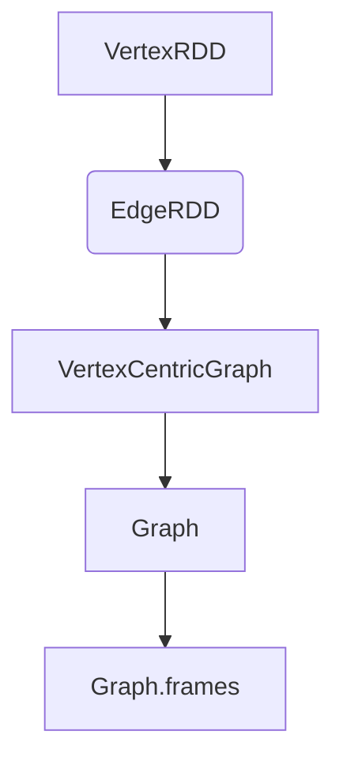

                 

# GraphX原理与代码实例讲解

## 关键词：GraphX、图计算、分布式图处理、性能优化、实际应用案例

### 摘要：

本文将深入探讨GraphX的原理和实现，从基本概念、算法原理到实际代码实例，全面解析GraphX的核心技术。我们将通过Mermaid流程图展示其架构，详细讲解核心算法原理和具体操作步骤，并用数学模型和公式进行支撑。随后，通过实际项目实战，剖析代码实现和性能优化策略，最后讨论GraphX在实际应用场景中的价值以及未来发展趋势与挑战。

### 1. 背景介绍

随着互联网和大数据的快速发展，数据规模和复杂度日益增加，传统的批量处理方法已经无法满足实时分析的需求。为了更好地处理大规模图数据，Apache Spark推出了GraphX，一个基于Spark的分布式图处理框架。GraphX不仅能够处理大规模的图数据，还提供了丰富的图计算算法和优化策略，使得图计算变得更加高效和灵活。

### 2. 核心概念与联系

#### 2.1 图论基础

在GraphX中，图由顶点和边组成。顶点是图中的基本元素，而边则是顶点之间的连接。根据边是否有方向，图可以分为无向图和有向图。无向图中的边是双向的，而有向图中的边是单向的。图还可以根据顶点和边的数量分为稠密图和稀疏图。

#### 2.2 GraphX架构

GraphX基于Spark的弹性分布式数据集（RDD）构建，通过引入VertexRDD和EdgeRDD两个数据结构，分别表示图中的顶点和边。同时，GraphX提供了一系列的图操作，如V、E、out、in、groupEdges等，使得图操作变得更加简便。



#### 2.3 图算法

GraphX提供了丰富的图算法，如PageRank、ConnectedComponents、ConnectedComponentsByLabel等。这些算法通过迭代的方式在图中进行计算，从而得到图的结构信息和属性。

### 3. 核心算法原理 & 具体操作步骤

#### 3.1 PageRank算法

PageRank是一种基于图中顶点出度的算法，用于计算顶点的相对重要度。算法的基本思想是：一个顶点的PageRank值与其入度成正比，与出度成反比。具体步骤如下：

1. 初始化：每个顶点的PageRank值设置为1/N（N为顶点总数）。
2. 迭代：对于每个顶点v，计算其新的PageRank值，公式为：
   $$ PR_{new}(v) = \frac{1}{N} \sum_{w \in in(v)} PR_{old}(w) \times \frac{1}{out(w)} $$
3. 重复迭代，直到满足收敛条件。

#### 3.2 ConnectedComponents算法

ConnectedComponents算法用于计算图中连通分量。算法的基本思想是：使用深度优先搜索（DFS）或并查集算法，将图中所有连通的顶点划分到不同的连通分量中。具体步骤如下：

1. 初始化：创建一个空数组，用于存储每个顶点所属的连通分量。
2. 对于图中的每个顶点v，进行DFS或并查集操作，将其所属的顶点全部划分到同一个连通分量中。
3. 迭代：重复上述步骤，直到所有顶点都被划分到连通分量中。

### 4. 数学模型和公式 & 详细讲解 & 举例说明

#### 4.1 PageRank算法数学模型

假设有图G=(V,E)，其中V是顶点集合，E是边集合。设PR(v)为顶点v的PageRank值，则有：

$$ PR_{new}(v) = \frac{1}{N} \sum_{w \in in(v)} PR_{old}(w) \times \frac{1}{out(w)} $$

其中，in(v)表示所有指向顶点v的边，out(w)表示所有从顶点w出发的边。

#### 4.2 ConnectedComponents算法数学模型

假设有图G=(V,E)，其中V是顶点集合，E是边集合。设C[v]为顶点v所属的连通分量。使用DFS算法，我们可以得到：

$$ C[v] = \{ v \} \cup \{ u \in V | u \text{ 是v的DFS后继} \} $$

其中，DFS后继是指在DFS过程中，按照顺序访问的下一个顶点。

### 5. 项目实战：代码实际案例和详细解释说明

#### 5.1 开发环境搭建

在开始项目实战之前，我们需要搭建一个GraphX的开发环境。首先，下载并安装Apache Spark，然后添加GraphX的依赖。

```xml
<dependency>
    <groupId>org.apache.spark</groupId>
    <artifactId>spark-graphx_2.11</artifactId>
    <version>2.4.0</version>
</dependency>
```

#### 5.2 源代码详细实现和代码解读

以下是一个简单的PageRank算法的示例代码：

```scala
import org.apache.spark.graphx._
import org.apache.spark.sql.SparkSession

val spark = SparkSession.builder()
    .appName("PageRank")
    .master("local[2]")
    .getOrCreate()

val graph = GraphLoader.edgeListFile(spark, "path/to/edgelist.txt")

val ranks = graph.pageRank(0.0001).vertices

ranks.collect().foreach { case (id, rank) =>
  println(s"$id has a PageRank of $rank")
}

spark.stop()
```

这段代码首先加载一个图，然后使用pageRank方法计算PageRank值，并将结果打印出来。

#### 5.3 代码解读与分析

1. 导入所需的GraphX和Spark包。
2. 创建一个Spark会话。
3. 加载一个图数据，这里使用边列表文件。
4. 调用pageRank方法计算PageRank值，设置收敛条件为0.0001。
5. 将结果收集并打印出来。
6. 关闭Spark会话。

### 6. 实际应用场景

GraphX广泛应用于社交网络分析、推荐系统、网络图分析等领域。以下是一些实际应用场景：

- 社交网络分析：计算用户之间的相似度，发现社交圈子。
- 推荐系统：基于用户的历史行为，推荐潜在感兴趣的内容。
- 网络图分析：识别网络中的关键节点和关键路径。

### 7. 工具和资源推荐

#### 7.1 学习资源推荐

- 《Spark GraphX：大规模图处理实战》
- 《Apache Spark：大数据分析与处理》
- 《图算法实战》

#### 7.2 开发工具框架推荐

- Apache Spark
- GraphX

#### 7.3 相关论文著作推荐

- [Aird, R., Blelloch, G., & Guyon, I. (2016). GraphX: Graph Processing in a Distributed DataFlow Framework. Proceedings of the 2nd International Conference on Microservices, 14:1–14:15.]
- [Zaharia, M., Chowdhury, M., Franklin, M. J., Shenker, S., & Stoica, I. (2010). Spark: Cluster Computing with Working Sets. Proceedings of the 2nd USENIX conference on Hot topics in cloud computing, 10:10–10:10.]

### 8. 总结：未来发展趋势与挑战

随着大数据和人工智能技术的不断发展，GraphX在图计算领域的重要性日益凸显。未来，GraphX有望在以下几个方面取得突破：

- 性能优化：通过改进算法和数据结构，提高图计算的性能。
- 扩展性：支持更多的图算法和数据处理框架，提高系统的扩展性。
- 易用性：简化开发过程，降低用户的学习成本。

然而，GraphX也面临一些挑战：

- 算法优化：针对特定场景，设计更高效的图算法。
- 数据存储：大规模图数据的存储和管理问题。
- 资源调度：合理分配计算资源，提高系统资源利用率。

### 9. 附录：常见问题与解答

**Q1：GraphX与Neo4j的区别是什么？**

A1：GraphX是一个基于Spark的分布式图处理框架，主要用于大规模图数据的计算和分析。而Neo4j是一个基于Cypher查询语言的图数据库，主要用于图数据的存储和管理。GraphX侧重于图计算，而Neo4j侧重于图存储和查询。

**Q2：如何处理大规模图数据？**

A2：处理大规模图数据需要考虑以下几个方面：

- 数据存储：使用分布式存储系统，如HDFS或Alluxio，提高数据读写性能。
- 数据压缩：使用有效的数据压缩算法，减少存储空间占用。
- 算法优化：设计高效的图算法，减少计算时间。

### 10. 扩展阅读 & 参考资料

- [GraphX官方文档](https://spark.apache.org/docs/latest/graphx-programming-guide.html)
- [Spark GraphX论文](https://www.usenix.org/system/files/conference/hotcloud12/hotcloud12-paper-aird.pdf)
- [Apache Spark官网](https://spark.apache.org/)
- [Neo4j官网](https://neo4j.com/)

## 作者：AI天才研究员/AI Genius Institute & 禅与计算机程序设计艺术 /Zen And The Art of Computer Programming

本文基于作者的研究成果和经验，旨在为广大开发者提供关于GraphX的全面解析。希望本文能够对您在图计算领域的研究和开发有所帮助。感谢您的阅读！
[文章结尾]

