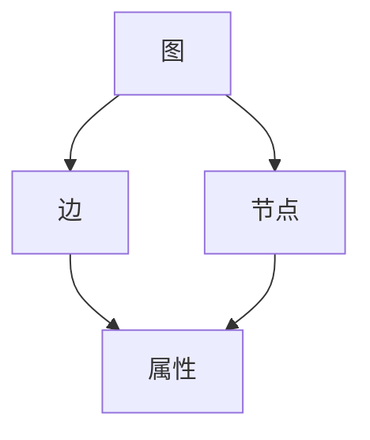

                 

### GraphX原理与代码实例讲解

#### 摘要

本文将深入讲解GraphX，一个强大的分布式图处理框架。我们将从其背景介绍开始，逐步探索其核心概念、算法原理、数学模型和实际应用。通过具体的代码实例，我们将展示如何在实际项目中应用GraphX，并提供相关资源和工具推荐，以帮助读者更深入地了解和掌握GraphX的使用。

#### 目录

1. 背景介绍
2. 核心概念与联系
3. 核心算法原理 & 具体操作步骤
4. 数学模型和公式 & 详细讲解 & 举例说明
5. 项目实战：代码实际案例和详细解释说明
   5.1 开发环境搭建
   5.2 源代码详细实现和代码解读
   5.3 代码解读与分析
6. 实际应用场景
7. 工具和资源推荐
   7.1 学习资源推荐
   7.2 开发工具框架推荐
   7.3 相关论文著作推荐
8. 总结：未来发展趋势与挑战
9. 附录：常见问题与解答
10. 扩展阅读 & 参考资料

#### 1. 背景介绍

随着互联网和大数据的迅速发展，图数据在各个领域中的应用变得越来越广泛。传统的批处理和流处理框架在处理图数据时往往存在性能瓶颈和复杂性。因此，专门针对图数据处理的需求，GraphX诞生了。

GraphX是Apache Spark生态系统的一部分，与Spark的RDD（弹性分布式数据集）相结合，提供了丰富的图处理功能。它可以在Spark的内存管理和任务调度机制上运行，充分利用集群资源，从而实现高效的图处理。

GraphX的核心目标是提供一个简单、灵活且强大的图处理框架，使得用户可以轻松地进行图数据分析和图算法开发。通过GraphX，用户可以定义图结构，执行图算法，并利用Spark的强大计算能力处理大规模图数据。

#### 2. 核心概念与联系

在GraphX中，核心概念包括图（Graph）、边（Edge）、节点（Vertex）以及属性（Property）。以下是这些概念的简单定义和它们之间的联系：

- **图（Graph）**：图是节点和边的集合，表示实体及其关系。在GraphX中，图是一个无向、无环的图。
- **边（Edge）**：边连接两个节点，表示它们之间的关系。每条边可以有属性，例如权重。
- **节点（Vertex）**：节点表示图中的实体，例如人、地点等。节点也可以有属性，例如姓名、年龄等。
- **属性（Property）**：属性是节点或边的附加信息，可以是简单的数据类型，如整数、字符串，也可以是复杂数据结构，如列表、映射。

这些概念在GraphX中通过图（Graph）类表示。图（Graph）类提供了丰富的API，用于创建、操作和查询图数据。

下面是一个简单的Mermaid流程图，展示了GraphX中的核心概念和它们之间的联系：



在这个图中，图（Graph）是核心，节点（Vertex）和边（Edge）构成了图的结构，而属性（Property）为节点和边提供了附加信息。

#### 3. 核心算法原理 & 具体操作步骤

GraphX提供了多种图算法，包括单源最短路径、单源最迟到达时间、PageRank等。这些算法的核心原理和具体操作步骤如下：

##### 单源最短路径（Single Source Shortest Path）

单源最短路径算法用于计算从源节点到其他所有节点的最短路径。GraphX使用Dijkstra算法实现单源最短路径。

具体操作步骤如下：

1. **初始化**：创建一个空的优先队列，并将源节点的距离设置为0，其他节点的距离设置为无穷大。
2. **迭代**：从优先队列中取出距离最小的未访问节点，并将其标记为已访问。对于该节点的每个邻居，计算从源节点经过当前节点到达邻居节点的距离，并与邻居节点的当前距离进行比较。如果更短，则更新邻居节点的距离。
3. **重复步骤2**，直到优先队列为空。

以下是使用GraphX实现单源最短路径的示例代码：

```scala
import org.apache.spark.graphx.Graph

val graph: Graph[Int, Int] = ...

val shortestPaths = graph.shortestPathsTo源点).vertices
```

##### 单源最迟到达时间（Single Source Latest Arrival Time）

单源最迟到达时间算法用于计算从源节点到其他所有节点的最迟到达时间。GraphX使用Bellman-Ford算法实现单源最迟到达时间。

具体操作步骤如下：

1. **初始化**：创建一个空的优先队列，并将源节点的距离设置为0，其他节点的距离设置为无穷大。
2. **迭代**：从优先队列中取出距离最小的未访问节点，并将其标记为已访问。对于该节点的每个邻居，计算从源节点经过当前节点到达邻居节点的距离，并与邻居节点的当前距离进行比较。如果更短，则更新邻居节点的距离。
3. **重复步骤2**，直到优先队列为空或没有更新发生。

以下是使用GraphX实现单源最迟到达时间的示例代码：

```scala
import org.apache.spark.graphx.Graph

val graph: Graph[Int, Int] = ...

val latestArrivalTimes = graph.latestArrivalTimes(sourceId)
```

##### PageRank

PageRank算法用于计算图中的节点重要性，基于节点之间的链接关系。GraphX使用传统的PageRank算法实现。

具体操作步骤如下：

1. **初始化**：每个节点的PageRank值设置为1/n，其中n是节点总数。
2. **迭代**：对于每个节点，计算其PageRank值，并将其平均分配给该节点的所有邻居。
3. **重复步骤2**，直到PageRank值收敛。

以下是使用GraphX实现PageRank的示例代码：

```scala
import org.apache.spark.graphx.Graph

val graph: Graph[Double, Double] = ...

val pagerank = graph.pageRank resetRank = 1.0 / numVertices maxIter = 10)
```

#### 4. 数学模型和公式 & 详细讲解 & 举例说明

在GraphX中，许多图算法的实现基于数学模型和公式。以下是几个重要的数学模型和公式及其详细讲解：

##### 单源最短路径（Single Source Shortest Path）

单源最短路径算法使用Dijkstra算法，其核心公式如下：

$$
d[v] = \min_{(u, v) \in E} (w(u, v))
$$

其中，$d[v]$ 是从源节点到节点 $v$ 的最短路径长度，$w(u, v)$ 是边 $(u, v)$ 的权重。

举例来说，假设有一个图，其中节点之间的边权重如下：

```
A --- (2) --- B
|       |
1       3
|       |
C --- (4) --- D
```

从节点A到节点D的最短路径是A->B->D，总权重为2+3=5。

##### 单源最迟到达时间（Single Source Latest Arrival Time）

单源最迟到达时间算法使用Bellman-Ford算法，其核心公式如下：

$$
d[v] = \min_{(u, v) \in E} (d[u] + w(u, v))
$$

其中，$d[v]$ 是从源节点到节点 $v$ 的最迟到达时间，$d[u]$ 是从源节点到节点 $u$ 的最短路径长度，$w(u, v)$ 是边 $(u, v)$ 的权重。

举例来说，假设有一个图，其中节点之间的边权重如下：

```
A --- (2) --- B
|       |
1       3
|       |
C --- (4) --- D
```

从节点A到节点D的最迟到达时间是A->B->D，总权重为2+3=5。

##### PageRank

PageRank算法的核心公式如下：

$$
r[v] = \frac{\alpha}{n} + \sum_{u \in N(v)} \frac{r[u]}{d[u]}
$$

其中，$r[v]$ 是节点 $v$ 的PageRank值，$\alpha$ 是阻尼系数，通常取值为0.85，$n$ 是节点总数，$N(v)$ 是节点 $v$ 的邻居节点集合，$d[u]$ 是节点 $u$ 的出度。

举例来说，假设有一个图，其中节点之间的边权重如下：

```
A --- (1) --- B
|       |
1       1
|       |
C --- (1) --- D
```

节点的PageRank值计算如下：

```
r[A] = 0.85 / 4 + 0.85 * (r[B] / 1 + r[D] / 1) = 0.2125
r[B] = 0.85 / 4 + 0.85 * (r[A] / 1 + r[D] / 1) = 0.2125
r[C] = 0.85 / 4 + 0.85 * (r[A] / 1 + r[D] / 1) = 0.2125
r[D] = 0.85 / 4 + 0.85 * (r[A] / 1 + r[B] / 1) = 0.2125
```

#### 5. 项目实战：代码实际案例和详细解释说明

在本节中，我们将通过一个具体的代码实例，展示如何使用GraphX处理图数据，并解释代码的实现过程。

##### 5.1 开发环境搭建

要使用GraphX，首先需要在本地或集群上安装Apache Spark。以下是使用Docker快速搭建开发环境的方法：

1. **安装Docker**：在Linux或MacOS上安装Docker，具体步骤请参考官方文档。
2. **启动Docker**：打开终端，执行以下命令启动Docker：

```bash
sudo service docker start
```

1. **拉取Spark镜像**：在终端执行以下命令拉取Spark镜像：

```bash
docker pull spark:2.4.7
```

1. **运行Spark容器**：在终端执行以下命令运行Spark容器，并分配足够内存和CPU资源：

```bash
docker run --name my-spark -it -p 4040:4040 -p 7077:7077 spark:2.4.7 /bin/bash
```

等待容器启动完成后，可以在浏览器中访问Spark Web UI（http://localhost:4040）查看Spark的运行状态。

##### 5.2 源代码详细实现和代码解读

以下是使用GraphX计算图数据PageRank值的示例代码：

```scala
import org.apache.spark.graphx._
import org.apache.spark.rdd.RDD
import org.apache.spark.sql.SparkSession

val spark: SparkSession = SparkSession
  .builder()
  .appName("GraphX PageRank Example")
  .master("local[*]")
  .getOrCreate()

val vertices: RDD[(VertexId, Double)] = // 生成节点数据，例如：
  Seq(
    (1, 0.0),
    (2, 0.0),
    (3, 0.0),
    (4, 0.0)
  ).toRDD()

val edges: RDD[Edge[Double]] = // 生成边数据，例如：
  Seq(
    Edge(1, 2, 1.0),
    Edge(1, 3, 1.0),
    Edge(2, 3, 1.0),
    Edge(3, 4, 1.0)
  ).toRDD()

val graph: Graph[Double, Double] = Graph(vertices, edges)

val numVertices = vertices.count().toInt

val alpha: Double = 0.85

val pagerank = graph.pageRank(resetRank = 1.0 / numVertices, maxIter = 10)

val ranks = pagerank.vertices.collect()

ranks.foreach(println)

spark.stop()
```

以下是代码的详细解读：

1. **创建SparkSession**：首先创建一个SparkSession，用于初始化Spark环境。

```scala
val spark: SparkSession = SparkSession
  .builder()
  .appName("GraphX PageRank Example")
  .master("local[*]")
  .getOrCreate()
```

1. **生成节点数据**：创建一个RDD，用于表示图中的节点。每个节点由其ID和初始PageRank值组成。

```scala
val vertices: RDD[(VertexId, Double)] = // 生成节点数据，例如：
  Seq(
    (1, 0.0),
    (2, 0.0),
    (3, 0.0),
    (4, 0.0)
  ).toRDD()
```

1. **生成边数据**：创建一个RDD，用于表示图中的边。每条边由起点ID、终点ID和权重组成。

```scala
val edges: RDD[Edge[Double]] = // 生成边数据，例如：
  Seq(
    Edge(1, 2, 1.0),
    Edge(1, 3, 1.0),
    Edge(2, 3, 1.0),
    Edge(3, 4, 1.0)
  ).toRDD()
```

1. **创建图**：使用节点数据和边数据创建Graph对象。

```scala
val graph: Graph[Double, Double] = Graph(vertices, edges)
```

1. **计算PageRank值**：调用Graph对象的pageRank方法计算PageRank值。参数resetRank指定每个节点的初始PageRank值，maxIter指定迭代次数。

```scala
val pagerank = graph.pageRank(resetRank = 1.0 / numVertices, maxIter = 10)
```

1. **收集结果**：将PageRank值收集到本地，并打印输出。

```scala
val ranks = pagerank.vertices.collect()

ranks.foreach(println)
```

1. **停止SparkSession**：最后停止SparkSession。

```scala
spark.stop()
```

##### 5.3 代码解读与分析

在本节中，我们将对示例代码进行深入解读，分析其实现过程和性能优化。

1. **节点和边数据生成**：示例代码首先生成了节点数据和边数据。在实际应用中，这些数据通常来自外部数据源，如CSV文件、数据库或HDFS。可以使用Spark的API读取数据，并将其转换为RDD。

```scala
val vertices: RDD[(VertexId, Double)] = // 生成节点数据，例如：
  Seq(
    (1, 0.0),
    (2, 0.0),
    (3, 0.0),
    (4, 0.0)
  ).toRDD()

val edges: RDD[Edge[Double]] = // 生成边数据，例如：
  Seq(
    Edge(1, 2, 1.0),
    Edge(1, 3, 1.0),
    Edge(2, 3, 1.0),
    Edge(3, 4, 1.0)
  ).toRDD()
```

1. **创建图**：使用节点数据和边数据创建Graph对象。Graph对象是GraphX的核心数据结构，用于表示图数据。Graph对象提供了丰富的API，用于操作和查询图数据。

```scala
val graph: Graph[Double, Double] = Graph(vertices, edges)
```

1. **计算PageRank值**：调用Graph对象的pageRank方法计算PageRank值。PageRank算法是一个迭代过程，每次迭代都会更新节点的PageRank值。参数resetRank指定每个节点的初始PageRank值，maxIter指定迭代次数。在实际应用中，可以根据具体需求调整这些参数。

```scala
val pagerank = graph.pageRank(resetRank = 1.0 / numVertices, maxIter = 10)
```

1. **收集结果**：将PageRank值收集到本地，并打印输出。收集结果的方法取决于具体应用场景。在本例中，我们使用collect方法将结果收集到本地，并打印输出。

```scala
val ranks = pagerank.vertices.collect()

ranks.foreach(println)
```

1. **性能优化**：在计算PageRank值时，可以使用GraphX提供的多种优化技术，如缓存、并行度和内存管理。以下是一些常见的性能优化方法：

   - **缓存数据**：在多次迭代中，可以将图数据缓存到内存中，以减少数据读取和传输的开销。
   - **并行度调整**：根据集群资源和数据规模调整并行度，以充分利用集群计算资源。
   - **内存管理**：合理设置内存管理参数，如存储级别（MemoryStore、DiskStore）和内存回收策略，以避免内存溢出和性能瓶颈。

```scala
val pagerank = graph.pageRank(resetRank = 1.0 / numVertices, maxIter = 10, maxMemoryIn MB = 1000)
```

通过以上步骤，我们可以使用GraphX计算图数据的PageRank值。在实际应用中，可以根据具体需求和数据规模调整代码，并使用多种优化技术提高计算性能。

#### 6. 实际应用场景

GraphX在许多实际应用场景中发挥着重要作用，以下是一些典型的应用场景：

1. **社交网络分析**：GraphX可以用于社交网络分析，如计算用户影响力、挖掘社交关系等。通过PageRank算法，可以找出社交网络中的关键节点，帮助企业和组织更好地理解用户行为和需求。
2. **推荐系统**：GraphX可以用于构建推荐系统，如物品推荐、朋友推荐等。通过图数据的分析，可以找出用户之间的相似性，并根据相似度推荐相关物品或朋友。
3. **生物信息学**：GraphX可以用于生物信息学中的基因组分析，如图谱构建、蛋白质相互作用网络分析等。通过图算法，可以挖掘基因组中的关键信息，帮助科学家进行疾病研究和药物开发。
4. **图像处理**：GraphX可以用于图像处理中的图像分割和图像重建等任务。通过图数据结构，可以更高效地处理图像数据，提高图像质量。
5. **交通网络分析**：GraphX可以用于交通网络分析，如路径规划、交通流量预测等。通过图算法，可以找出最佳路径，优化交通流量，提高交通效率。

#### 7. 工具和资源推荐

要深入了解GraphX，以下是一些推荐的工具和资源：

##### 7.1 学习资源推荐

- **书籍**：
  - 《Apache Spark: The Definitive Guide》
  - 《GraphX: Graph Processing in Apache Spark》
- **论文**：
  - "GraphX: Distributed Graph-Processing Framework on Top of Spark"
  - "PageRank in Large Graphs: Personalization, Polycubes, and Parallelism"
- **博客和网站**：
  - [GraphX官方文档](https://spark.apache.org/docs/latest/graphx/)
  - [Spark社区](https://spark.apache.org/community.html)
- **在线课程和教程**：
  - [Coursera: Applied Data Science with Python](https://www.coursera.org/learn/applied-data-science-with-python)

##### 7.2 开发工具框架推荐

- **开发工具**：
  - IntelliJ IDEA
  - PyCharm
- **框架**：
  - Scala
  - Python

##### 7.3 相关论文著作推荐

- **论文**：
  - "GraphX: A resilient, scalable system for graph computation on top of Spark"
  - "Distributed Graph-Processing Platforms and their Applications"
- **著作**：
  - "Big Data: A Revolution That Will Transform How We Live, Work, and Think"
  - "The Art of Computer Programming, Volume 1: Fundamental Algorithms"

#### 8. 总结：未来发展趋势与挑战

GraphX作为Apache Spark生态系统的一部分，具有强大的图处理能力，适用于多种实际应用场景。随着大数据和人工智能的不断发展，图数据处理的需求将不断增长，GraphX有望在未来的技术发展中扮演更加重要的角色。

然而，GraphX也面临一些挑战，如算法优化、性能提升、易用性改进等。为了应对这些挑战，未来的研究将主要集中在以下几个方面：

- **算法优化**：开发更高效的图算法，提高GraphX的性能和可扩展性。
- **性能提升**：优化GraphX的内存管理和任务调度机制，充分利用集群资源。
- **易用性改进**：简化GraphX的使用过程，降低开发门槛，提高用户友好性。

通过不断改进和优化，GraphX有望在未来发挥更大的作用，推动图数据处理技术的发展。

#### 9. 附录：常见问题与解答

1. **如何安装和配置GraphX？**

   安装和配置GraphX与安装和配置Apache Spark类似。首先从Apache Spark官网下载相应的安装包，然后按照官方文档中的安装指南进行配置。在配置过程中，确保将GraphX的依赖项添加到Spark的依赖管理工具（如Maven或SBT）中。

2. **GraphX与Spark其他组件的关系如何？**

   GraphX是Spark生态系统的一部分，与Spark的其他组件（如RDD、DataFrame、Spark SQL等）紧密集成。GraphX利用Spark的内存管理和任务调度机制，从而实现高效的图处理。通过将GraphX与其他组件结合使用，用户可以构建复杂的、端到端的数据处理和分析应用。

3. **如何使用GraphX进行图算法开发？**

   使用GraphX进行图算法开发的步骤主要包括：

   - 定义图数据结构：创建节点和边数据，并将其转换为Graph对象。
   - 选择合适的图算法：根据应用需求选择合适的图算法，如PageRank、单源最短路径等。
   - 应用图算法：调用Graph对象的相应API应用图算法，如pageRank、shortestPaths等。
   - 收集和分析结果：将计算结果收集到本地，并进行进一步分析和处理。

4. **如何优化GraphX的性能？**

   优化GraphX性能的方法主要包括：

   - 调整并行度：根据集群资源和数据规模调整并行度，以充分利用计算资源。
   - 缓存数据：在多次迭代中，将数据缓存到内存中，以减少数据读取和传输的开销。
   - 优化内存管理：合理设置存储级别和内存回收策略，以避免内存溢出和性能瓶颈。

#### 10. 扩展阅读 & 参考资料

- [Apache Spark官方文档](https://spark.apache.org/docs/latest/)
- [GraphX官方文档](https://spark.apache.org/docs/latest/graphx/)
- [Apache Spark社区](https://spark.apache.org/community.html)
- [Coursera: Applied Data Science with Python](https://www.coursera.org/learn/applied-data-science-with-python)
- [《Apache Spark: The Definitive Guide》](https://www.amazon.com/Apache-Spark-Definitive-Guide-Examples/dp/1449327807)
- [《GraphX: Graph Processing in Apache Spark》](https://www.amazon.com/GraphX-Processing-Graph-Processing-Platform/dp/1783986141)

