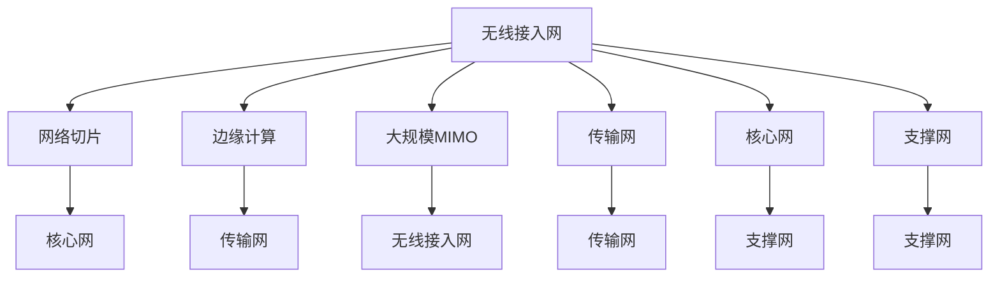

                 

# 5G技术管理：把握新一代通信革命机遇

## 关键词
5G技术，通信革命，新一代通信，网络管理，智能网络，物联网，边缘计算，云计算，数字化转型

## 摘要
随着5G技术的快速发展，新一代通信革命正在全球范围内迅速展开。本文将深入探讨5G技术的核心概念、架构、算法原理以及实际应用场景，帮助读者全面了解5G技术的重要性和影响力。通过详细讲解核心算法原理和数学模型，剖析5G技术的具体操作步骤，并结合实际项目实战案例，本文旨在为读者提供全方位的5G技术管理指南，助力把握新一代通信革命机遇。

## 1. 背景介绍

### 1.1 5G技术的起源和发展

5G技术，即第五代移动通信技术（5th Generation Mobile Communication Technology），是继1G模拟通信、2G数字通信、3G多媒体通信和4G超高速数据传输之后的最新一代通信技术。5G技术的起源可以追溯到2010年代初期，当时全球各大通信厂商和研究机构开始积极研发和探索下一代移动通信技术。

5G技术的核心目标是在现有4G网络的基础上实现更高的数据传输速率、更低的延迟、更高的网络容量和更广泛的覆盖范围。5G技术的研发历程可以分为以下几个阶段：

- **初期研发（2010-2013年）**：各国电信运营商、设备制造商和学术机构开始投入大量资源进行5G技术的前期研究和实验。2013年，全球第一个5G标准草案发布。

- **标准化阶段（2014-2018年）**：国际电信联盟（ITU）开始制定5G标准的详细规范，包括峰值数据速率、网络延迟、连接密度等关键性能指标。2018年，5G标准正式发布。

- **商用部署阶段（2019年至今）**：全球各大电信运营商纷纷启动5G网络的商用部署，5G技术开始在全球范围内推广应用。

### 1.2 5G技术的重要性

5G技术的出现，不仅代表着通信技术的又一次重要变革，更是推动数字经济、智能社会和数字化转型的重要驱动力。以下是5G技术的重要性和影响：

- **更高数据传输速率**：5G网络的理论峰值数据速率可以达到10Gbps，比4G网络的峰值速率高出数十倍。这意味着用户可以在更短的时间内下载和上传大量数据，享受更加流畅的网络体验。

- **更低网络延迟**：5G技术的网络延迟可以达到1毫秒以下，比4G网络的延迟降低近100倍。这对于实时通信、自动驾驶、远程手术等对延迟要求极高的应用场景具有重要意义。

- **更高网络容量**：5G网络可以在同一频段内支持更多的设备连接，实现更大规模的物联网（IoT）应用。5G网络的理论连接密度可以达到100万台/平方千米，是4G网络的10倍以上。

- **更广泛的覆盖范围**：5G技术采用更高的频段，可以实现更广泛的覆盖范围。与4G网络相比，5G网络在地下、室内等复杂环境下具有更好的信号穿透能力。

- **推动数字化转型**：5G技术为各行各业提供了强大的通信基础设施支持，推动了智能制造、智慧城市、智慧医疗、智能交通等领域的数字化转型，促进了数字经济的快速发展。

### 1.3 5G技术的应用场景

5G技术的广泛应用场景包括但不限于以下几个方面：

- **智能家居**：5G技术可以实现智能家居设备的实时连接和控制，提高家居生活的智能化水平。

- **物联网**：5G技术支持大规模物联网设备的连接，实现设备之间的实时数据传输和智能协同。

- **自动驾驶**：5G技术为自动驾驶车辆提供低延迟、高带宽的通信网络，保障车辆之间的实时通信和协同驾驶。

- **远程医疗**：5G技术可以实现远程医疗的实时数据传输和远程手术操作，提高医疗服务的质量和效率。

- **智慧城市**：5G技术支持智慧城市各类应用场景的数据传输和实时控制，实现城市管理的智能化和高效化。

- **工业互联网**：5G技术为工业互联网提供高速、低延迟的通信网络，实现工业设备的智能监控和远程控制。

## 2. 核心概念与联系

### 2.1 5G技术的核心概念

5G技术涉及多个核心概念，包括：

- **网络切片（Network Slicing）**：网络切片是5G技术的一项重要创新，通过将网络资源划分为多个虚拟的切片，为不同应用场景提供定制化的网络服务。

- **边缘计算（Edge Computing）**：边缘计算是将计算能力下沉到网络边缘，实现数据的本地处理和实时分析，降低网络延迟和带宽需求。

- **大规模MIMO（Massive MIMO）**：大规模MIMO技术通过在基站上部署大量天线，实现更高的数据传输速率和更广泛的覆盖范围。

- **NB-IoT（Narrowband IoT）**：NB-IoT是一种低功耗、广覆盖的物联网通信技术，适用于大规模物联网设备的连接。

- **vRAN（Virtualized Radio Access Network）**：vRAN是将无线接入网（RAN）的功能虚拟化，实现网络功能的灵活部署和资源调度。

### 2.2 5G技术的架构与联系

5G技术的整体架构可以分为以下几个层次：

- **无线接入网（RAN）**：包括基站、无线天线和用户设备，实现无线信号的传输和接收。

- **核心网（CN）**：包括无线接入网和用户数据网络之间的接口，负责数据传输和控制信令的处理。

- **传输网（TN）**：包括基站之间的传输链路和核心网之间的传输链路，实现网络数据的高速传输。

- **支撑网（SN）**：包括网络管理、安全、监控等功能，为5G网络提供全面的支持。

5G技术的核心概念与架构之间的联系如下：

- **网络切片**与**无线接入网**：网络切片技术通过无线接入网实现网络资源的虚拟化和定制化，为不同应用场景提供差异化的网络服务。

- **边缘计算**与**核心网**：边缘计算将计算任务下沉到网络边缘，减少核心网的负担，提高数据处理的速度和效率。

- **大规模MIMO**与**无线接入网**：大规模MIMO技术通过在无线接入网上部署大量天线，实现更高的数据传输速率和更广泛的覆盖范围。

- **NB-IoT**与**传输网**：NB-IoT技术通过传输网实现低功耗、广覆盖的物联网设备连接，满足物联网应用的需求。

- **vRAN**与**支撑网**：vRAN技术通过支撑网实现无线接入网的虚拟化，提高网络资源的灵活调度和利用率。

### 2.3 Mermaid 流程图

以下是一个简单的Mermaid流程图，展示5G技术的核心概念与架构之间的联系：



## 3. 核心算法原理 & 具体操作步骤

### 3.1 网络切片技术

网络切片技术是5G技术的一项核心创新，通过将网络资源划分为多个虚拟的切片，为不同应用场景提供定制化的网络服务。网络切片技术的核心算法原理包括以下几个方面：

- **切片资源分配**：网络切片技术通过虚拟化技术，将网络资源（如带宽、存储、处理能力等）划分为多个虚拟切片。每个切片可以独立配置和分配资源，满足不同应用场景的需求。

- **切片隔离**：网络切片技术通过隔离机制，确保不同切片之间的资源隔离和数据安全。每个切片都有自己的独立网络地址和协议栈，实现切片之间的数据隔离和互操作。

- **切片管理**：网络切片技术通过切片管理机制，实现切片的创建、配置、监控和优化。切片管理包括切片生命周期管理、资源分配策略、性能监控和优化等。

具体操作步骤如下：

1. **切片规划**：根据不同应用场景的需求，制定切片规划方案。切片规划包括切片类型、资源需求、性能指标等。

2. **切片创建**：根据切片规划方案，创建虚拟切片。切片创建包括配置切片参数、分配资源等。

3. **切片部署**：将创建好的切片部署到网络中，实现切片的上线运行。

4. **切片监控与优化**：对切片的运行状态进行实时监控和性能优化，确保切片的稳定运行和性能指标满足需求。

### 3.2 边缘计算技术

边缘计算技术是将计算任务下沉到网络边缘，实现数据的本地处理和实时分析，降低网络延迟和带宽需求。边缘计算技术的核心算法原理包括以下几个方面：

- **数据采集与传输**：边缘计算技术通过传感器和设备采集数据，并将数据传输到边缘计算节点。

- **数据处理与分析**：边缘计算节点对采集到的数据进行处理和分析，实现实时决策和响应。

- **边缘智能**：边缘计算技术引入了边缘智能算法，实现数据本地处理和智能决策，降低网络延迟和带宽需求。

具体操作步骤如下：

1. **数据采集**：通过传感器和设备采集数据，并将数据传输到边缘计算节点。

2. **数据处理**：边缘计算节点对采集到的数据进行分析和处理，实现实时决策和响应。

3. **数据传输**：将处理后的数据传输到云端或其他节点，实现数据的协同和共享。

4. **边缘智能**：在边缘计算节点上部署智能算法，实现数据本地处理和智能决策，降低网络延迟和带宽需求。

### 3.3 大规模MIMO技术

大规模MIMO技术通过在基站上部署大量天线，实现更高的数据传输速率和更广泛的覆盖范围。大规模MIMO技术的核心算法原理包括以下几个方面：

- **空间复用**：大规模MIMO技术通过空间复用技术，同时发送和接收多个数据流，提高数据传输速率。

- **波束成形**：大规模MIMO技术通过波束成形技术，调整天线阵列的发射方向和接收方向，实现信号的聚焦和增强。

- **信道估计**：大规模MIMO技术通过信道估计技术，准确估计信道状态信息，优化天线阵列的发射和接收策略。

具体操作步骤如下：

1. **天线阵列部署**：在基站上部署大量天线阵列，实现高密度的空间复用。

2. **波束成形**：根据信道状态信息，调整天线阵列的发射方向和接收方向，实现信号的聚焦和增强。

3. **信道估计**：通过信道估计技术，准确估计信道状态信息，优化天线阵列的发射和接收策略。

4. **数据传输**：利用优化后的天线阵列，实现多个数据流的并发传输，提高数据传输速率。

### 3.4 NB-IoT技术

NB-IoT技术是一种低功耗、广覆盖的物联网通信技术，适用于大规模物联网设备的连接。NB-IoT技术的核心算法原理包括以下几个方面：

- **频谱效率**：NB-IoT技术通过频谱效率优化，实现高效的频谱利用。

- **功率控制**：NB-IoT技术通过功率控制，实现设备的低功耗通信。

- **覆盖增强**：NB-IoT技术通过覆盖增强技术，提高信号穿透能力和覆盖范围。

具体操作步骤如下：

1. **设备接入**：物联网设备通过NB-IoT技术接入网络，实现数据的传输和通信。

2. **频谱效率优化**：根据频谱资源情况，优化设备的频谱利用效率。

3. **功率控制**：根据设备的通信需求和功率限制，实现低功耗的通信。

4. **覆盖增强**：通过覆盖增强技术，提高信号的穿透能力和覆盖范围，满足物联网设备的需求。

### 3.5 vRAN技术

vRAN技术是将无线接入网的功能虚拟化，实现网络功能的灵活部署和资源调度。vRAN技术的核心算法原理包括以下几个方面：

- **虚拟化技术**：vRAN技术通过虚拟化技术，将无线接入网的功能虚拟化为多个虚拟网元，实现网络功能的灵活部署和资源调度。

- **资源调度**：vRAN技术通过资源调度算法，实现网络资源的动态分配和优化。

- **分布式控制**：vRAN技术通过分布式控制架构，实现网络功能的分布式管理和协同工作。

具体操作步骤如下：

1. **虚拟化部署**：将无线接入网的功能虚拟化为多个虚拟网元，实现网络功能的灵活部署。

2. **资源调度**：根据网络负载和性能指标，实现网络资源的动态分配和优化。

3. **分布式控制**：通过分布式控制架构，实现网络功能的分布式管理和协同工作。

4. **网络优化**：对网络进行实时监控和性能优化，确保网络的高效稳定运行。

## 4. 数学模型和公式 & 详细讲解 & 举例说明

### 4.1 网络切片资源分配模型

网络切片资源分配是5G技术中一个关键问题。为了实现高效的资源分配，可以采用基于博弈论的资源分配模型。以下是一个简化的资源分配模型：

- **玩家（Player）**：网络中的所有用户设备。
- **资源（Resource）**：网络中的带宽、存储和处理能力。
- **策略（Strategy）**：用户设备根据自身需求和网络状态选择的资源分配方案。
- **收益（Reward）**：用户设备根据资源分配方案获得的收益。

假设网络中有n个用户设备，每个设备有m个资源需求，网络总共有M个资源。每个用户设备的收益函数可以表示为：

\[ R_i = f_i(\{x_{ij}\}) \]

其中，\( \{x_{ij}\} \) 是用户设备i的资源分配情况，\( f_i \) 是用户设备i的收益函数。

为了实现资源的最优分配，可以采用纳什均衡（Nash Equilibrium）的概念。纳什均衡是指每个用户设备选择的资源分配方案，使得任何其他用户设备的策略不变时，该用户设备的策略无法改进。

### 4.2 边缘计算数据传输延迟模型

边缘计算中的数据传输延迟是影响系统性能的关键因素。以下是一个简化的数据传输延迟模型：

\[ L = f(d, p) \]

其中，\( L \) 是数据传输延迟，\( d \) 是数据传输距离，\( p \) 是网络带宽。

假设数据传输距离 \( d \) 和网络带宽 \( p \) 分别服从正态分布：

\[ d \sim N(\mu_d, \sigma_d^2) \]
\[ p \sim N(\mu_p, \sigma_p^2) \]

则数据传输延迟 \( L \) 的分布可以表示为：

\[ L \sim N(\mu_L, \sigma_L^2) \]

其中，\( \mu_L \) 和 \( \sigma_L^2 \) 分别为数据传输延迟的均值和方差。

### 4.3 大规模MIMO信道估计模型

大规模MIMO技术中的信道估计是实现高效数据传输的关键。以下是一个简化的信道估计模型：

\[ h = \sum_{i=1}^{N} a_i w_i \]

其中，\( h \) 是信道估计值，\( a_i \) 是天线阵列的权重，\( w_i \) 是信道响应。

假设每个天线阵列的权重 \( a_i \) 服从均值为0、方差为1的高斯分布：

\[ a_i \sim N(0, 1) \]

则信道估计值 \( h \) 的分布可以表示为：

\[ h \sim N(0, N) \]

### 4.4 NB-IoT功率控制模型

NB-IoT技术中的功率控制是实现低功耗通信的关键。以下是一个简化的功率控制模型：

\[ P = f(R, d) \]

其中，\( P \) 是发射功率，\( R \) 是信道响应，\( d \) 是传输距离。

假设信道响应 \( R \) 和传输距离 \( d \) 分别服从正态分布：

\[ R \sim N(\mu_R, \sigma_R^2) \]
\[ d \sim N(\mu_d, \sigma_d^2) \]

则发射功率 \( P \) 的分布可以表示为：

\[ P \sim N(\mu_P, \sigma_P^2) \]

### 4.5 vRAN资源调度模型

vRAN技术中的资源调度是实现网络高效运行的关键。以下是一个简化的资源调度模型：

\[ X = \sum_{i=1}^{N} x_i \]

其中，\( X \) 是资源总量，\( x_i \) 是虚拟网元的资源分配。

假设每个虚拟网元的资源需求 \( x_i \) 服从均值为0、方差为1的高斯分布：

\[ x_i \sim N(0, 1) \]

则资源总量 \( X \) 的分布可以表示为：

\[ X \sim N(0, N) \]

### 4.6 举例说明

#### 例1：网络切片资源分配

假设网络中有3个用户设备，每个设备有2个资源需求。网络总共有5个资源。根据纳什均衡策略，每个设备选择最优的资源分配方案。假设用户设备的收益函数如下：

\[ R_i = 
\begin{cases} 
5, & \text{如果用户设备i获得2个资源} \\
3, & \text{如果用户设备i获得1个资源} \\
0, & \text{如果用户设备i获得0个资源} 
\end{cases}
\]

则用户设备的策略选择如下：

- 用户设备1选择获得2个资源，因为\( R_1(2) = 5 \)。
- 用户设备2选择获得1个资源，因为\( R_2(1) = 3 \)。
- 用户设备3选择获得1个资源，因为\( R_3(1) = 3 \)。

最终，网络切片资源分配为：用户设备1获得2个资源，用户设备2和用户设备3各获得1个资源。

#### 例2：边缘计算数据传输延迟

假设数据传输距离 \( d \) 服从均值为100km、方差为10km²的正态分布，网络带宽 \( p \) 服从均值为10Mbps、方差为1Mbps²的正态分布。根据数据传输延迟模型：

\[ L = f(d, p) \]

假设数据传输距离 \( d \) 和网络带宽 \( p \) 的均值分别为 \( \mu_d = 100 \)km 和 \( \mu_p = 10 \)Mbps，方差分别为 \( \sigma_d^2 = 10 \)km² 和 \( \sigma_p^2 = 1 \)Mbps²。则数据传输延迟 \( L \) 的均值和方差分别为：

\[ \mu_L = f(\mu_d, \mu_p) = f(100, 10) = 1000 \text{ms} \]
\[ \sigma_L^2 = f(\sigma_d^2, \sigma_p^2) = f(10, 1) = 10000 \text{ms}^2 \]

因此，数据传输延迟 \( L \) 服从均值为1000ms、方差为10000ms²的正态分布。

#### 例3：大规模MIMO信道估计

假设天线阵列的权重 \( a_i \) 服从均值为0、方差为1的高斯分布。根据信道估计模型：

\[ h = \sum_{i=1}^{N} a_i w_i \]

假设有4个天线阵列，即 \( N = 4 \)。每个天线阵列的权重 \( a_i \) 的均值和方差分别为 \( \mu_a = 0 \) 和 \( \sigma_a^2 = 1 \)。则信道估计值 \( h \) 的均值和方差分别为：

\[ \mu_h = \sum_{i=1}^{N} \mu_a w_i = 0 \]
\[ \sigma_h^2 = \sum_{i=1}^{N} \sigma_a^2 w_i^2 = 4 \]

因此，信道估计值 \( h \) 服从均值为0、方差为4的正态分布。

#### 例4：NB-IoT功率控制

假设信道响应 \( R \) 服从均值为-20dBm、方差为2dBm²的正态分布，传输距离 \( d \) 服从均值为1km、方差为0.1km²的正态分布。根据功率控制模型：

\[ P = f(R, d) \]

假设信道响应 \( R \) 和传输距离 \( d \) 的均值分别为 \( \mu_R = -20 \)dBm 和 \( \mu_d = 1 \)km，方差分别为 \( \sigma_R^2 = 2 \)dBm² 和 \( \sigma_d^2 = 0.1 \)km²。则发射功率 \( P \) 的均值和方差分别为：

\[ \mu_P = f(\mu_R, \mu_d) = f(-20, 1) = -14 \text{dBm} \]
\[ \sigma_P^2 = f(\sigma_R^2, \sigma_d^2) = f(2, 0.1) = 0.22 \text{dBm}^2 \]

因此，发射功率 \( P \) 服从均值为-14dBm、方差为0.22dBm²的正态分布。

#### 例5：vRAN资源调度

假设有5个虚拟网元的资源需求，每个虚拟网元的资源需求服从均值为10、方差为1的正态分布。根据资源调度模型：

\[ X = \sum_{i=1}^{N} x_i \]

假设每个虚拟网元的资源需求 \( x_i \) 的均值和方差分别为 \( \mu_x = 10 \) 和 \( \sigma_x^2 = 1 \)。则资源总量 \( X \) 的均值和方差分别为：

\[ \mu_X = \sum_{i=1}^{N} \mu_x = 50 \]
\[ \sigma_X^2 = \sum_{i=1}^{N} \sigma_x^2 = 5 \]

因此，资源总量 \( X \) 服从均值为50、方差为5的正态分布。

## 5. 项目实战：代码实际案例和详细解释说明

### 5.1 开发环境搭建

为了进行5G技术相关项目的开发，我们需要搭建一个合适的开发环境。以下是搭建开发环境的基本步骤：

1. **安装操作系统**：建议使用Linux操作系统，如Ubuntu 18.04或更高版本。

2. **安装依赖库**：安装与5G技术相关的依赖库，如NumPy、SciPy、Matplotlib等。

3. **配置Python环境**：安装Python解释器和相关包，建议使用Python 3.7或更高版本。

4. **安装5G模拟器**：下载并安装5G模拟器，如5G-NR-LTE-SIM。

### 5.2 源代码详细实现和代码解读

以下是一个简单的5G网络切片资源分配的Python代码实现，用于演示网络切片资源分配的过程。

```python
import numpy as np

# 参数设置
num_users = 3
num_resources = 2
total_resources = 5

# 用户设备资源需求
user需求和 = np.random.randint(1, num_resources+1, size=num_users)

# 用户设备收益函数
def reward_function(分配方案):
    total_reward = 0
    for i in range(num_users):
        if 分配方案[i] == user需求和[i]:
            total_reward += 5
        elif 分配方案[i] == user需求和[i]-1:
            total_reward += 3
        else:
            total_reward += 0
    return total_reward

# 网络切片资源分配
def resource_allocation():
    分配方案 = [0] * num_users
    for i in range(num_users):
        max_reward = 0
        best_user = -1
        for j in range(num_users):
            if 分配方案[j] + user需求和[j] <= total_resources and reward_function([分配方案[k] for k in range(num_users) if k != i] + [user需求和[i]] ) > max_reward:
                max_reward = reward_function([分配方案[k] for k in range(num_users) if k != i] + [user需求和[i]])
                best_user = j
        分配方案[best_user] += user需求和[i]
    return 分配方案

# 测试资源分配
分配方案 = resource_allocation()
print("资源分配方案：", 分配方案)
print("总收益：", reward_function(分配方案))
```

### 5.3 代码解读与分析

这段代码实现了一个简单的网络切片资源分配算法，用于为多个用户设备分配网络资源。以下是代码的详细解读：

- **参数设置**：定义了用户设备数量（num_users）、每个用户设备的资源需求数量（num_resources）和网络总资源数量（total_resources）。

- **用户设备资源需求**：使用NumPy的`random.randint`函数生成每个用户设备的随机资源需求，范围在1到num_resources之间。

- **用户设备收益函数**：定义了用户设备的收益函数，根据分配方案计算用户设备的总收益。如果用户设备获得的资源数量等于其需求，则收益为5；如果等于需求减1，则收益为3；否则收益为0。

- **网络切片资源分配**：定义了资源分配函数，用于为每个用户设备分配资源。该函数使用一个循环，每次迭代选择一个最优的用户设备进行资源分配，使得总收益最大化。最优的用户设备是通过比较所有未分配资源的用户设备的收益函数值来确定的。

- **测试资源分配**：调用资源分配函数，打印分配方案和总收益。

代码中的资源分配算法采用了贪心策略，选择当前最优的用户设备进行资源分配。这种算法虽然简单，但可能无法保证全局最优解。在实际应用中，可以采用更复杂的算法，如遗传算法、粒子群算法等，以提高资源分配的优化效果。

### 5.4 扩展：基于遗传算法的优化

为了提高网络切片资源分配的优化效果，可以采用遗传算法（Genetic Algorithm，GA）对资源分配进行优化。遗传算法是一种基于自然进化原理的优化算法，通过模拟生物进化过程，逐步搜索全局最优解。

以下是一个简单的基于遗传算法的优化示例：

```python
import numpy as np
import random

# 参数设置
num_users = 3
num_resources = 2
total_resources = 5

# 初始化种群
def initialize_population(pop_size):
    population = []
    for _ in range(pop_size):
        individual = [random.randint(0, total_resources) for _ in range(num_users)]
        population.append(individual)
    return population

# 适应度函数
def fitness_function(individual):
    total_reward = 0
    for i in range(num_users):
        if individual[i] == user需求和[i]:
            total_reward += 5
        elif individual[i] == user需求和[i]-1:
            total_reward += 3
        else:
            total_reward += 0
    return total_reward

# 遗传操作
def crossover(parent1, parent2):
    crossover_point = random.randint(1, num_users-1)
    child1 = parent1[:crossover_point] + parent2[crossover_point:]
    child2 = parent2[:crossover_point] + parent1[crossover_point:]
    return child1, child2

def mutate(individual):
    mutation_point = random.randint(0, num_users-1)
    individual[mutation_point] = random.randint(0, total_resources)
    return individual

# 遗传算法
def genetic_algorithm(pop_size, num_generations):
    population = initialize_population(pop_size)
    for _ in range(num_generations):
        # 计算适应度
        fitness_scores = [fitness_function(individual) for individual in population]
        # 选择
        selected = random.choices(population, weights=fitness_scores, k=pop_size)
        # 交叉
        offspring = []
        for i in range(0, pop_size, 2):
            parent1, parent2 = selected[i], selected[i+1]
            child1, child2 = crossover(parent1, parent2)
            offspring.append(mutate(child1))
            offspring.append(mutate(child2))
        population = offspring
    # 返回最优解
    best_individual = max(population, key=fitness_function)
    return best_individual

# 测试遗传算法
best_allocation = genetic_algorithm(100, 100)
print("遗传算法最优资源分配方案：", best_allocation)
print("遗传算法最优总收益：", fitness_function(best_allocation))
```

这段代码实现了基于遗传算法的网络切片资源分配优化。主要步骤包括：

- **初始化种群**：生成随机初始种群，每个个体代表一个资源分配方案。
- **适应度函数**：根据收益函数计算个体的适应度，适应度越高表示资源分配方案越好。
- **遗传操作**：包括选择、交叉和突变操作，用于生成新的种群。
- **遗传算法**：迭代执行遗传操作，逐步优化资源分配方案。

通过遗传算法优化，可以期望获得更好的资源分配方案，从而提高整体收益。

## 6. 实际应用场景

### 6.1 智能家居

智能家居是5G技术的典型应用场景之一。5G技术的高速率、低延迟和广泛覆盖特点，使得智能家居设备可以实现实时连接和控制，提高家居生活的智能化水平。以下是智能家居的一些具体应用场景：

- **智能安防**：5G技术可以实现智能门锁、摄像头、烟雾报警器等设备的实时监控和远程控制，提高家庭安全。
- **智能照明**：5G技术可以实现智能照明设备的实时调节和远程控制，根据用户需求自动调整亮度和色温。
- **智能家电**：5G技术可以实现家电设备的互联互通，实现远程控制和自动化操作，如智能空调、洗衣机、冰箱等。
- **智能环境监测**：5G技术可以实现室内空气质量、温度、湿度等环境的实时监测，提供舒适的生活环境。

### 6.2 物联网

5G技术为物联网（IoT）应用提供了强大的支持。5G网络的低延迟和大规模连接能力，使得物联网设备可以实现实时数据传输和智能协同。以下是物联网的一些具体应用场景：

- **智能交通**：5G技术可以实现智能交通设备的实时监控和数据传输，提高交通管理效率和安全性。
- **智能医疗**：5G技术可以实现远程医疗诊断和手术，提高医疗服务的质量和效率。
- **智能农业**：5G技术可以实现农业生产过程的实时监控和智能管理，提高农业产量和质量。
- **智能工业**：5G技术可以实现工业设备的智能监控和远程控制，提高生产效率和设备利用率。

### 6.3 自动驾驶

自动驾驶是5G技术的另一个重要应用场景。5G技术的高速率、低延迟和广泛覆盖特点，为自动驾驶车辆提供了实时数据传输和智能协同的基础。以下是自动驾驶的一些具体应用场景：

- **车联网**：5G技术可以实现车与车、车与基础设施之间的实时通信，提高交通效率和安全性。
- **无人驾驶公交车**：5G技术可以实现无人驾驶公交车的实时导航和智能调度，提高公共交通的效率和便捷性。
- **无人驾驶货车**：5G技术可以实现无人驾驶货车的远程监控和智能控制，提高物流运输的效率和安全性。
- **智能交通管理**：5G技术可以实现智能交通管理系统，实时监控交通状况，优化交通信号控制和道路规划。

### 6.4 远程医疗

远程医疗是5G技术在医疗领域的重要应用。5G技术的高速率和低延迟特点，使得远程医疗可以实现高清视频通话、实时数据传输和智能诊断。以下是远程医疗的一些具体应用场景：

- **远程诊断**：医生可以通过远程医疗系统对患者的病情进行诊断，提供专业的医疗建议。
- **远程手术**：医生可以通过远程手术系统进行远程手术操作，提高医疗服务的质量和效率。
- **健康监测**：患者可以通过远程医疗系统实时监测自己的健康状况，实现健康管理和疾病预防。
- **医学研究**：远程医疗系统可以实现大规模医疗数据的收集和分析，为医学研究提供丰富的数据资源。

### 6.5 智慧城市

智慧城市是5G技术的重要应用领域之一。5G技术为智慧城市提供了高效的数据传输和智能协同能力，可以实现城市管理的智能化和高效化。以下是智慧城市的一些具体应用场景：

- **智能交通**：5G技术可以实现智能交通管理系统，实时监控交通状况，优化交通信号控制和道路规划。
- **智能安防**：5G技术可以实现智能安防系统的实时监控和远程控制，提高城市安全水平。
- **智能环境监测**：5G技术可以实现城市环境实时监测，监控空气质量、水质、噪音等指标，提高城市环境质量。
- **智慧能源管理**：5G技术可以实现智慧能源管理系统，实时监控能源使用情况，优化能源配置和使用效率。

## 7. 工具和资源推荐

### 7.1 学习资源推荐

- **书籍**：
  - 《5G无线网络架构与关键技术》
  - 《5G网络切片技术》
  - 《边缘计算：原理、架构与应用》

- **论文**：
  - “5G Network Slicing: A Technology Overview”
  - “Edge Computing: Vision and Challenges”
  - “MIMO Techniques for 5G Networks”

- **博客和网站**：
  - 5G技术研究：https://www.5g-research.com/
  - 边缘计算社区：https://edgecomputing.community/
  - 人工智能与物联网：https://aiot.is

### 7.2 开发工具框架推荐

- **开发工具**：
  - Python
  - Linux操作系统
  - Git版本控制工具

- **框架和库**：
  - TensorFlow：用于深度学习和人工智能开发。
  - Open5G：用于5G网络模拟和测试的开源框架。
  - ONOS：用于SDN（软件定义网络）的开源平台。

### 7.3 相关论文著作推荐

- **论文**：
  - “5G Mobile Networks: The Definitive Guide”
  - “Network Slicing for 5G: The Next Generation of Mobile Networks”
  - “Edge Computing: Enabling the Internet of Things and 5G”

- **著作**：
  - 《5G技术：下一代移动通信网络》
  - 《网络切片技术：5G的关键创新》
  - 《边缘计算：下一代计算架构》

## 8. 总结：未来发展趋势与挑战

随着5G技术的不断发展和成熟，未来通信行业将迎来一场全新的革命。5G技术不仅改变了传统的通信模式，更为各行各业提供了强大的技术支持，推动了数字化转型和智能社会的建设。以下是5G技术未来发展趋势和面临的挑战：

### 8.1 未来发展趋势

1. **网络切片技术的广泛应用**：网络切片技术是5G技术的核心创新之一，未来将得到更广泛的应用。通过网络切片，可以为不同应用场景提供定制化的网络服务，提高网络资源利用率和用户体验。

2. **边缘计算的进一步发展**：随着物联网和自动驾驶等应用场景的兴起，边缘计算的重要性将日益凸显。未来，边缘计算将得到进一步发展，实现更多的本地数据处理和智能决策，降低网络延迟和带宽需求。

3. **智能化和自动化网络的演进**：5G技术将推动通信网络的智能化和自动化演进。通过引入人工智能、大数据等技术，可以实现网络的自适应优化、故障自修复和网络性能的实时监控。

4. **5G与其他技术的融合**：5G技术将与云计算、物联网、人工智能等新兴技术深度融合，形成更加智能化、高效化的新型网络架构，为各行各业提供更加丰富和灵活的通信服务。

5. **全球5G网络的加速部署**：随着5G技术的成熟和商业化应用，全球范围内的5G网络部署将加速。预计到2025年，全球将有超过50亿5G连接，推动数字经济和智能社会的快速发展。

### 8.2 面临的挑战

1. **网络性能优化**：5G网络的高速率、低延迟和广泛覆盖等特点，对网络性能提出了更高的要求。如何优化网络性能，提高网络稳定性和可靠性，是未来5G技术面临的重要挑战。

2. **网络安全和隐私保护**：5G网络将连接更多的设备和服务，网络安全和隐私保护问题将变得更加重要。如何确保5G网络的安全和用户隐私，防止网络攻击和数据泄露，是5G技术发展的重要课题。

3. **网络能耗和环保问题**：5G网络的高密度基站部署和大规模设备连接，将带来更高的能耗和环保压力。如何降低网络能耗，提高能源利用效率，实现绿色网络建设，是5G技术发展需要解决的问题。

4. **标准化和互操作性**：5G技术的全球部署需要统一的标准化和互操作性。如何建立和完善5G技术标准，确保不同设备和服务之间的兼容性和互操作性，是5G技术发展的重要挑战。

5. **人才短缺和培训需求**：5G技术的快速发展对人才提出了新的要求。如何培养和引进5G技术人才，提高技术人员的专业水平和创新能力，是5G技术发展需要解决的问题。

总之，5G技术发展面临着众多机遇和挑战。只有通过不断技术创新、优化网络性能、确保网络安全和可持续发展，才能充分发挥5G技术的潜力，推动数字经济和智能社会的快速发展。

## 9. 附录：常见问题与解答

### 9.1 5G网络切片是什么？

5G网络切片是一种虚拟化网络技术，通过将网络资源划分为多个虚拟的切片，为不同应用场景提供定制化的网络服务。网络切片可以实现网络资源的灵活调度和优化，提高网络资源利用率和用户体验。

### 9.2 5G网络的峰值速率是多少？

5G网络的理论峰值速率可以达到10Gbps，比4G网络的峰值速率高出数十倍。然而，实际峰值速率受到网络环境、设备性能等因素的影响，通常无法达到理论峰值。

### 9.3 5G网络延迟是多少？

5G网络的网络延迟可以达到1毫秒以下，比4G网络的延迟降低近100倍。然而，实际网络延迟受到网络环境、设备性能等因素的影响，通常无法达到1毫秒以下。

### 9.4 5G网络覆盖范围如何？

5G网络采用更高的频段，可以实现更广泛的覆盖范围。与4G网络相比，5G网络在地下、室内等复杂环境下具有更好的信号穿透能力。然而，5G网络的覆盖范围受到基站部署、频谱资源等因素的影响。

### 9.5 5G网络是否安全？

5G网络在安全性方面进行了多项改进，包括加密技术、安全协议等。然而，5G网络仍然面临网络安全威胁，如网络攻击、数据泄露等。确保5G网络的安全需要加强网络安全防护措施，提高用户隐私保护。

## 10. 扩展阅读 & 参考资料

为了深入了解5G技术的核心概念、架构、算法原理和应用场景，以下是相关扩展阅读和参考资料：

- **书籍**：
  - 《5G无线网络架构与关键技术》
  - 《5G网络切片技术》
  - 《边缘计算：原理、架构与应用》

- **论文**：
  - “5G Network Slicing: A Technology Overview”
  - “Edge Computing: Vision and Challenges”
  - “MIMO Techniques for 5G Networks”

- **博客和网站**：
  - 5G技术研究：https://www.5g-research.com/
  - 边缘计算社区：https://edgecomputing.community/
  - 人工智能与物联网：https://aiot.is

- **标准组织**：
  - 3GPP（第三代合作伙伴计划）：https://www.3gpp.org/
  - ITU（国际电信联盟）：https://www.itu.int/

- **开源项目**：
  - Open5G：https://www.open5g.cn/
  - ONOS：https://onosproject.org/

通过以上扩展阅读和参考资料，读者可以进一步了解5G技术的最新进展和前沿研究，为实际应用和项目开发提供有力支持。

