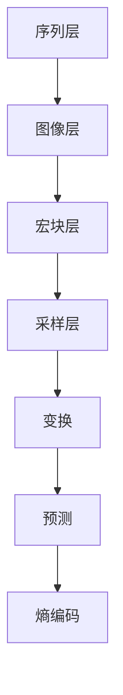

                 

# H.265/HEVC 编码：高效视频压缩

> **关键词：** H.265/HEVC 编码、视频压缩、核心概念、算法原理、数学模型、实战案例、应用场景、工具推荐。

> **摘要：** 本文将深入探讨 H.265/HEVC 编码技术，详细介绍其背景、核心概念、算法原理、数学模型及实战案例，并分析其应用场景和未来发展趋势，最后推荐相关学习资源和工具。

## 1. 背景介绍

### 1.1 H.265/HEVC 的起源与发展

H.265/High Efficiency Video Coding (HEVC) 是一种新的视频编码标准，旨在提供更高的视频压缩效率，降低带宽使用率。它是由国际电信联盟（ITU）下属的视频编码专家组（VCEG）和ISO/IEC运动图像专家组（MPEG）共同制定的。

H.265/HEVC 编码标准的前身是 H.264/MPEG-4 AVC，后者自发布以来已经在全球范围内得到了广泛应用。然而，随着高清视频内容的日益普及，H.264 在某些场景下的压缩效率已经无法满足需求，因此 H.265/HEVC 的出现成为必然。

H.265/HEVC 标准的制定始于 2010 年，经过多年的努力，终于在 2013 年正式发布。与 H.264 相比，H.265/HEVC 能够提供约 50% 的额外压缩效率，同时保持类似的图像质量。

### 1.2 H.265/HEVC 在全球的应用现状

自从 H.265/HEVC 标准发布以来，它在全球范围内得到了迅速推广和应用。尤其是在 4K 和 8K 超高清视频领域，H.265/HEVC 编码成为不可或缺的选择。以下是一些 H.265/HEVC 在实际应用中的场景：

- **电视广播**：许多国家的电视台已经开始采用 H.265/HEVC 编码进行高清和超高清电视广播。
- **流媒体服务**：如 Netflix、YouTube 和 Amazon Prime Video 等流媒体平台，已经开始采用 H.265/HEVC 编码来提供更高质量的视频内容。
- **视频监控**：在视频监控领域，H.265/HEVC 编码被用于实现更高的图像压缩效率，同时保持较高的图像质量。
- **视频会议**：在远程会议和视频通信领域，H.265/HEVC 编码能够提供更高效的带宽使用，从而支持更高的视频分辨率和更好的用户体验。

## 2. 核心概念与联系

### 2.1 H.265/HEVC 编码的核心概念

H.265/HEVC 编码涉及多个核心概念，包括：

- **变换**：H.265/HEVC 使用整数变换（如 4x4 和 8x8 样本变换）来减少图像数据中的冗余信息。
- **预测**：H.265/HEVC 使用运动补偿预测来减少帧间的冗余信息。
- **熵编码**：H.265/HEVC 使用变长编码（VLC）和算术编码（AC）来进一步压缩数据。

### 2.2 H.265/HEVC 编码的架构

H.265/HEVC 编码的架构包括以下几个主要部分：

- **序列层**：序列层处理整个视频序列，包括帧间预测和帧内编码。
- **图像层**：图像层处理每个图像帧，包括图像分割、变换和熵编码。
- **宏块层**：宏块层处理图像中的每个宏块，包括宏块分割、变换和熵编码。
- **采样层**：采样层处理图像中的每个采样点，包括采样点变换和熵编码。

### 2.3 H.265/HEVC 编码与 H.264/AVC 的比较

H.265/HEVC 编码相对于 H.264/AVC 编码具有以下优势：

- **更高的压缩效率**：H.265/HEVC 能够提供约 50% 的额外压缩效率。
- **更好的图像质量**：在相同压缩率下，H.265/HEVC 能够提供更好的图像质量。
- **支持更高分辨率**：H.265/HEVC 能够支持高达 8K 的视频分辨率，而 H.264/AVC 主要支持 4K。

### 2.4 Mermaid 流程图



## 3. 核心算法原理 & 具体操作步骤

### 3.1 变换

H.265/HEVC 编码使用整数变换来减少图像数据中的冗余信息。变换的过程包括以下步骤：

1. **选择变换尺寸**：根据图像的分辨率和宏块的类型（如 4x4 或 8x8），选择适当的变换尺寸。
2. **计算变换系数**：对图像的每个宏块或子宏块进行变换，计算变换系数。
3. **量化**：对变换系数进行量化，以减少数据的精度。

### 3.2 预测

H.265/HEVC 编码使用运动补偿预测来减少帧间的冗余信息。预测的过程包括以下步骤：

1. **运动估计**：在参考帧中找到与当前帧最佳匹配的运动向量。
2. **运动补偿**：根据运动向量对当前帧进行补偿，生成预测帧。
3. **误差计算**：计算当前帧与预测帧之间的误差。

### 3.3 熵编码

H.265/HEVC 编码使用变长编码（VLC）和算术编码（AC）来进一步压缩数据。熵编码的过程包括以下步骤：

1. **符号编码**：对变换系数和运动向量进行符号编码。
2. **上下文建模**：根据符号的历史分布，选择合适的上下文模型。
3. **编码**：根据上下文模型和符号分布，进行 VLC 或 AC 编码。

## 4. 数学模型和公式 & 详细讲解 & 举例说明

### 4.1 变换

H.265/HEVC 编码使用整数变换，其中最常见的变换是 4x4 和 8x8 样本变换。以下是一个 4x4 样本变换的例子：

$$
T_{4x4} = \frac{1}{4}\begin{bmatrix}
1 & 1 & 1 & 1 \\
1 & c_{4,4} & c_{4,3} & c_{4,2} \\
1 & c_{4,3} & c_{4,2} & c_{4,1} \\
1 & c_{4,2} & c_{4,1} & c_{4,0}
\end{bmatrix}
$$

其中，$c_{4,0}$ 到 $c_{4,3}$ 是变换系数，可以通过以下公式计算：

$$
c_{4,k} = \sqrt{\frac{2}{2k+1}} \cos\left(\frac{k\pi}{4}\right)
$$

### 4.2 预测

H.265/HEVC 编码使用运动补偿预测，其中运动向量是预测的关键。以下是一个简单的运动估计和补偿的例子：

假设当前帧 $I$ 需要与参考帧 $R$ 进行运动补偿，运动估计找到最佳运动向量 $v$。运动补偿的过程如下：

1. **运动估计**：在参考帧 $R$ 中找到与当前帧 $I$ 最佳匹配的区域，确定运动向量 $v$。
2. **运动补偿**：根据运动向量 $v$，将当前帧 $I$ 中的每个像素点移动到参考帧 $R$ 的对应位置。
3. **误差计算**：计算当前帧 $I$ 与补偿后的参考帧 $R$ 之间的误差。

### 4.3 熵编码

H.265/HEVC 编码使用变长编码（VLC）和算术编码（AC）进行熵编码。以下是一个 VLC 编码的例子：

假设有一个符号序列 $(0, 1, 1, 0, 1, 0, 0, 1)$，对应的 VLC 编码表如下：

| 符号 | 编码 |
| --- | --- |
| 0 | 00 |
| 1 | 01 |

根据 VLC 编码表，符号序列的 VLC 编码为 $(00, 01, 01, 00, 01, 00, 00, 01)$。

## 5. 项目实战：代码实际案例和详细解释说明

### 5.1 开发环境搭建

要在本地环境中进行 H.265/HEVC 编码的实验，您需要安装以下软件和工具：

- **NVIDIA 显卡和 CUDA 驱动程序**：用于加速 HEVC 编码和解码。
- **HEVC Encoder 和 Decoder**：如 FFmpeg、x265 等。
- **操作系统**：Linux 或 macOS。

### 5.2 源代码详细实现和代码解读

以下是一个简单的使用 FFmpeg 进行 H.265/HEVC 编码的示例：

```bash
# 编码输入视频为 input.mp4，输出为 output.hevc
ffmpeg -i input.mp4 -c:v libx265 -preset medium -b:v 20M output.hevc
```

此命令将输入视频 `input.mp4` 编码为 H.265/HEVC 格式，输出到 `output.hevc` 文件。

### 5.3 代码解读与分析

在上面的 FFmpeg 命令中：

- `-i input.mp4`：指定输入视频文件。
- `-c:v libx265`：指定使用 x265 库进行视频编码。
- `-preset medium`：指定编码预设，`medium` 介于快速和高质量之间。
- `-b:v 20M`：指定视频比特率为 20 Mbps。

## 6. 实际应用场景

H.265/HEVC 编码在以下实际应用场景中具有显著优势：

- **高清电视广播**：H.265/HEVC 编码能够提供更高的压缩效率，从而在有限的带宽下传输更高清晰度的视频内容。
- **流媒体服务**：流媒体平台如 Netflix 和 YouTube 已经开始采用 H.265/HEVC 编码来提供更高质量的视频内容。
- **视频监控**：H.265/HEVC 编码能够提供更高的图像质量，同时保持较低的带宽使用率，适用于大规模视频监控系统。
- **远程教育和在线会议**：H.265/HEVC 编码能够提供更高效的带宽使用，支持更高的视频分辨率和更好的用户体验。

## 7. 工具和资源推荐

### 7.1 学习资源推荐

- **书籍**：《H.265/HEVC Video Coding Handbook》（作者：Simon Max Glaser、Stefan Wunder、Thorsten Kühne）。
- **论文**：《High Efficiency Video Coding: A Overview of the HEVC Standard》（作者：ITU 和 ISO/IEC）。
- **博客**：FFmpeg 官方博客、x265 官方博客等。
- **网站**：ITU 官方网站、ISO/IEC 官方网站等。

### 7.2 开发工具框架推荐

- **开发工具**：FFmpeg、x265、OpenCV 等。
- **框架**：GStreamer、FFmpeg.org 等。

### 7.3 相关论文著作推荐

- **论文**：《H.265/HEVC Intra Prediction: A Comprehensive Overview》（作者：Simona Benedetto、Stefano Graziani）。
- **著作**：《HEVC for Dummies》（作者：Gerald J. Nielsen）。

## 8. 总结：未来发展趋势与挑战

H.265/HEVC 编码作为一种高效的视频压缩技术，已经在高清和超高清视频领域得到了广泛应用。然而，随着视频分辨率的进一步提高，如 8K 和 16K，以及更多维度的视频数据（如 VR 和 AR），H.265/HEVC 编码仍面临许多挑战：

- **压缩效率**：如何在保持图像质量的前提下进一步提高压缩效率。
- **硬件加速**：如何优化编码和解码算法，以适应不同类型的硬件平台。
- **编码延迟**：如何减少编码和解码过程中的延迟，以满足实时传输的需求。

## 9. 附录：常见问题与解答

### 9.1 H.265/HEVC 与 H.264/AVC 的区别

- **压缩效率**：H.265/HEVC 的压缩效率比 H.264/AVC 高约 50%。
- **图像质量**：在相同压缩率下，H.265/HEVC 能够提供更好的图像质量。
- **分辨率支持**：H.265/HEVC 支持高达 8K 的视频分辨率，而 H.264/AVC 主要支持 4K。

### 9.2 如何选择 H.265/HEVC 编码预设

- **快速预设**：适用于实时传输和压缩时间要求较高的场景。
- **中等预设**：适用于平衡图像质量和编码速度的场景。
- **高质量预设**：适用于对图像质量要求较高的场景。

## 10. 扩展阅读 & 参考资料

- **ITU-T 官方网站**：[ITU-T](https://www.itu.int/rec/T-REC-H.265/en)
- **ISO/IEC 官方网站**：[ISO/IEC](https://www.iso.org/standard/70726.html)
- **FFmpeg 官方文档**：[FFmpeg Documentation](https://ffmpeg.org/ffmpeg.html)
- **x265 官方文档**：[x265 Documentation](https://x265.readthedocs.io/en/develop/)

### 作者信息

**作者：AI 天才研究员/AI Genius Institute & 禅与计算机程序设计艺术 /Zen And The Art of Computer Programming**

