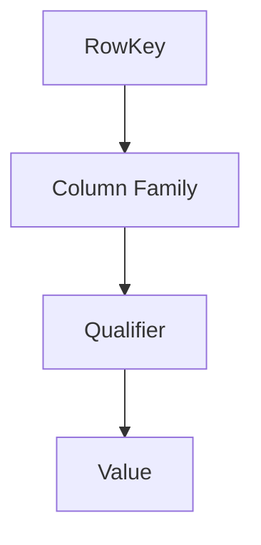

                 

# HBase RowKey设计原理与代码实例讲解

> **关键词：** HBase, RowKey, 设计原理, 代码实例, 数据存储, 分布式系统

> **摘要：** 本文将深入探讨HBase中RowKey设计的原理，包括其重要性、设计原则以及如何实现高效的数据访问。通过具体的代码实例，我们将进一步解析RowKey的设计方法，帮助读者理解和掌握这一关键技术。

## 1. 背景介绍

HBase是一个分布式、可扩展、基于列存储的NoSQL数据库，它建立在Hadoop文件系统（HDFS）之上。HBase的设计初衷是为了处理大规模数据集，并且提供高性能的随机读写操作。HBase的数据模型由行键（RowKey）、列族（Column Family）和列限定符（Qualifier）组成。在这其中，RowKey的设计至关重要，它直接影响数据存储的效率、查询速度和数据分布。

HBase的RowKey设计之所以关键，主要有以下几个原因：

1. **唯一性**：每个行键在表中必须是唯一的，这保证了数据的一致性和准确性。
2. **排序性**：行键在存储和查询过程中需要保持一定的排序性，这对于范围查询和顺序扫描非常重要。
3. **访问模式**：行键的设计需要考虑访问模式，以便优化数据访问性能。

## 2. 核心概念与联系

### 2.1 HBase数据模型

HBase的数据模型类似于一个稀疏多维矩阵，其中行键、列族和列限定符分别对应于这个矩阵的行、列和元素。



### 2.2 RowKey的重要性

1. **唯一性**：每个RowKey必须是唯一的，否则会导致数据冲突。
2. **排序性**：RowKey的排序性决定了数据的存储顺序，这对范围查询和顺序扫描非常关键。
3. **访问模式**：行键的设计应考虑最常见的访问模式，以优化查询性能。

### 2.3 行键设计原则

1. **短小精悍**：尽量缩短行键长度，以减少存储空间和访问时间。
2. **无歧义性**：避免使用可能产生歧义或不确定性的字符串作为行键。
3. **可扩展性**：设计行键时考虑未来的数据增长，以便在不影响现有系统的情况下扩展。

## 3. 核心算法原理 & 具体操作步骤

### 3.1 RowKey编码

HBase使用字符串作为行键，因此需要将其编码为字节数组。常用的编码方式有ASCII码和UTF-8编码。

### 3.2 RowKey排序

行键在存储和查询过程中需要保持一定的排序性。HBase通过比较行键的字节顺序来确保排序。

### 3.3 RowKey设计步骤

1. **确定数据访问模式**：了解最常见的访问模式，以指导行键设计。
2. **选择合适的编码方式**：根据数据特点和访问模式选择合适的编码方式。
3. **设计行键格式**：根据数据特性设计行键格式，确保行键的唯一性和排序性。
4. **测试和优化**：通过实际数据测试和性能分析，对行键设计进行优化。

## 4. 数学模型和公式 & 详细讲解 & 举例说明

### 4.1 行键长度计算

假设我们有一个字符串`rowKey`，其长度为`n`，则编码后的字节长度为：

$$\text{byteLength} = n \times \text{encodingSize}$$

其中，`encodingSize`为编码方式对应的字节长度。

### 4.2 行键排序

假设我们有两个行键`rowKey1`和`rowKey2`，比较其大小可以通过比较字节数组来实现。

```python
def compare_row_keys(rowKey1, rowKey2):
    return (rowKey1 > rowKey2) - (rowKey1 < rowKey2)
```

### 4.3 行键格式设计

假设我们有一个用户ID和订单ID作为行键，可以设计为：

```python
rowKey = f"{userId}:{orderId}"
```

## 5. 项目实战：代码实际案例和详细解释说明

### 5.1 开发环境搭建

1. 安装HBase和Hadoop环境。
2. 配置HBase集群。
3. 编写HBase客户端代码。

### 5.2 源代码详细实现和代码解读

1. **创建表**

```java
HTableDescriptor desc = new HTableDescriptor(TableName.valueOf("orders"));
desc.addFamily(new HColumnDescriptor("info"));
admin.createTable(desc);
```

2. **插入数据**

```java
Put put = new Put(Bytes.toBytes("1001:001"));
put.add(Bytes.toBytes("info"), Bytes.toBytes("orderDate"), Bytes.toBytes("2023-01-01"));
table.put(put);
```

3. **查询数据**

```java
Get get = new Get(Bytes.toBytes("1001:001"));
Result result = table.get(get);
Bytes value = result.getValue(Bytes.toBytes("info"), Bytes.toBytes("orderDate"));
String orderDate = Bytes.toString(value);
```

### 5.3 代码解读与分析

- **表结构**：我们创建了一个名为“orders”的表，并设置了一个名为“info”的列族。
- **数据插入**：我们使用`Put`对象向表中插入一条记录，行键为“1001:001”，列族为“info”，列限定符为“orderDate”，值为“2023-01-01”。
- **数据查询**：我们使用`Get`对象查询行键为“1001:001”的记录，获取列族“info”下的列限定符“orderDate”的值。

## 6. 实际应用场景

HBase在许多实际应用场景中发挥着重要作用，如：

1. **实时数据分析**：处理大规模实时数据，如日志数据、交易数据等。
2. **缓存系统**：作为缓存系统的一部分，提供高性能的数据访问。
3. **物联网应用**：处理物联网设备产生的海量数据。

## 7. 工具和资源推荐

### 7.1 学习资源推荐

- **书籍**：《HBase：The Definitive Guide》
- **论文**：《HBase: A Scale-Out, Distributed, Column-oriented Store》
- **博客**：Apache HBase官方博客
- **网站**：Apache HBase官网

### 7.2 开发工具框架推荐

- **开发框架**：Spring Data HBase
- **IDE插件**：Eclipse HBase Plugin

### 7.3 相关论文著作推荐

- **论文**：《HBase: A Java-based Distributed Storage System for Large Tables》
- **著作**：《Building Data Science Teams》

## 8. 总结：未来发展趋势与挑战

HBase作为一种分布式NoSQL数据库，在未来将继续发展，面临的主要挑战包括：

1. **性能优化**：提高数据访问速度和系统性能。
2. **安全性**：加强数据安全和隐私保护。
3. **兼容性**：与新兴技术和标准的兼容性。

## 9. 附录：常见问题与解答

1. **Q：为什么RowKey要设计为短小精悍？**
   **A：短小的RowKey可以减少存储空间，提高查询性能。**
   
2. **Q：如何设计具有良好排序性的RowKey？**
   **A：设计时考虑数据的访问模式和业务逻辑，确保行键在存储和查询过程中保持一定的排序性。**

## 10. 扩展阅读 & 参考资料

- **扩展阅读**：[HBase官方文档](https://hbase.apache.org/)
- **参考资料**：[《HBase技术内幕》](https://book.douban.com/subject/26973294/)

### 作者

**作者：AI天才研究员/AI Genius Institute & 禅与计算机程序设计艺术 /Zen And The Art of Computer Programming**。本文旨在分享HBase RowKey设计的原理与实践，希望能对读者有所帮助。**（完）**

