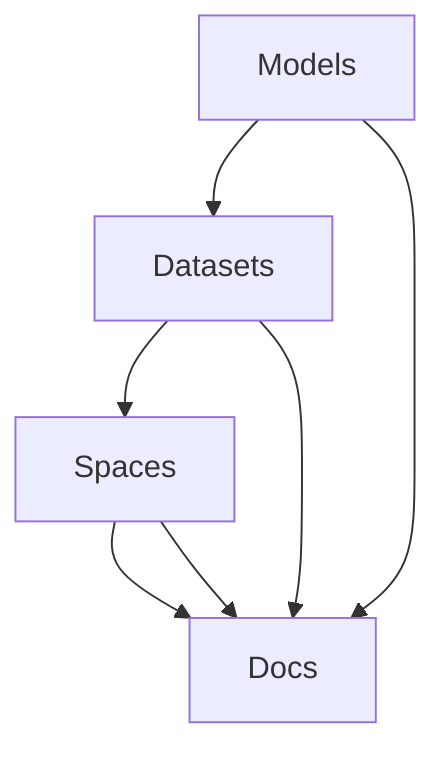

                 

# Hugging Face 开源社区：Models、Datasets、Spaces、Docs

## 概述

Hugging Face 是一个专注于自然语言处理（NLP）的开源社区，其目标是简化语言模型的创建、训练和部署过程。Hugging Face 提供了一系列的工具、库和模型，使得开发者可以轻松地访问和使用最先进的 NLP 技术进行研究和生产应用。本文将详细介绍 Hugging Face 的四大核心组成部分：Models、Datasets、Spaces 和 Docs。

### 关键词

- Hugging Face
- 开源社区
- Models
- Datasets
- Spaces
- Docs
- 自然语言处理
- 模型
- 数据集
- 研究与生产应用

## 摘要

本文将深入探讨 Hugging Face 开源社区的核心组成部分：Models、Datasets、Spaces 和 Docs。通过详细解析这些组件的功能、架构和应用场景，帮助读者全面了解 Hugging Face 在自然语言处理领域的优势和价值。文章还将提供实际应用案例和资源推荐，以助力读者在实践中更好地运用 Hugging Face 的技术。

## 1. 背景介绍

Hugging Face 的起源可以追溯到 2016 年，当时法国工程师Vincent Dumoulin 和 Alexander Mousavizadeh 创建了一个名为 "Hugging Face" 的博客，分享他们在自然语言处理领域的研究成果。随着时间的推移，这个博客逐渐发展成为一个开源社区，吸引了大量开发者和研究者的关注和参与。

Hugging Face 的发展离不开其核心团队成员的努力。社区创始人之一，Yoav Artzi，曾是 Google Research 的高级科学家，专注于 NLP 和信息检索领域。另一位核心成员，Alexey Dosovitskiy，是深度学习和计算机视觉领域的知名专家，其研究成果在图像生成和识别领域取得了显著成果。

Hugging Face 的使命是通过开源技术和社区合作，推动自然语言处理技术的发展和应用。社区致力于构建一个全面、易用的 NLP 工具集，为研究人员和开发者提供便捷的资源和支持。

## 2. 核心概念与联系

### 2.1 Models

Models 是 Hugging Face 的核心组件之一，它提供了大量的预训练模型，涵盖了多种语言和任务。这些模型包括经典的 Transformer 架构，如 BERT、GPT 和 T5，以及其他先进的方法，如 ALBERT 和 DeBERTa。Models 组件不仅提供了丰富的预训练模型，还支持自定义模型的创建和训练。

### 2.2 Datasets

Datasets 组件是 Hugging Face 的另一个重要组成部分，它提供了一系列高质量的数据集，涵盖了多种语言和任务。这些数据集包括官方数据集，如 COCO、Wikipedia 和 Common Crawl，以及由社区成员贡献的个性化数据集。Datasets 组件使得开发者可以轻松地获取和使用这些数据集，为模型训练提供了可靠的数据支持。

### 2.3 Spaces

Spaces 是 Hugging Face 的云服务平台，它提供了便捷的模型部署和交互功能。通过 Spaces，开发者可以将预训练模型部署到云端，实现实时推理和交互式应用。Spaces 支持多种部署方式，包括单节点和多节点部署，以及容器化和无服务器部署。此外，Spaces 还提供了丰富的 API 和 SDK，方便开发者进行集成和扩展。

### 2.4 Docs

Docs 是 Hugging Face 的文档中心，它提供了详尽的文档和教程，涵盖了 Models、Datasets、Spaces 和其他组件的使用方法和技巧。Docs 组件不仅帮助开发者快速上手和使用 Hugging Face 的技术，还为他们提供了丰富的资源和知识，助力他们在自然语言处理领域取得更好的成果。

下面是一个 Mermaid 流程图，展示了 Models、Datasets、Spaces 和 Docs 之间的联系：



### 2.5 核心算法原理

Hugging Face 的核心算法原理主要基于深度学习和自然语言处理技术。以下是几个关键概念：

- **Transformer 架构**：Transformer 是一种基于自注意力机制的深度学习模型，它在处理长序列数据和并行计算方面具有显著优势。Hugging Face 的 Models 组件提供了多种基于 Transformer 的预训练模型，如 BERT、GPT 和 T5。

- **预训练与微调**：预训练是一种在大规模数据集上训练模型的方法，使其能够捕获通用语言特征。微调是在预训练模型的基础上，针对特定任务进行训练，以实现更好的性能。Hugging Face 的 Datasets 组件提供了丰富的数据集，支持模型预训练和微调。

- **迁移学习**：迁移学习是一种利用预训练模型在新任务上取得良好性能的方法。通过迁移学习，开发者可以快速适应新的任务，降低模型训练的时间和成本。

### 2.6 具体操作步骤

下面是使用 Hugging Face 进行模型训练和部署的基本步骤：

1. **安装 Hugging Face**：

   通过以下命令安装 Hugging Face：

   ```bash
   pip install transformers datasets
   ```

2. **选择模型和数据集**：

   在 Models 组件中选择预训练模型，如 BERT：

   ```python
   from transformers import BertModel
   model = BertModel.from_pretrained('bert-base-uncased')
   ```

   在 Datasets 组件中选择数据集，如 IMDb 评论数据集：

   ```python
   from datasets import load_dataset
   dataset = load_dataset('imdb')
   ```

3. **训练模型**：

   使用训练数据和模型进行训练：

   ```python
   from transformers import TrainingArguments, Trainer
   training_args = TrainingArguments(output_dir='./results')
   trainer = Trainer(model=model, args=training_args, train_dataset=dataset['train'])
   trainer.train()
   ```

4. **评估模型**：

   使用验证数据集评估模型性能：

   ```python
   eval_results = trainer.evaluate(eval_dataset=dataset['validation'])
   print(eval_results)
   ```

5. **部署模型**：

   使用 Spaces 组件将模型部署到云端：

   ```python
   from transformers import AutoModelForSequenceClassification
   model = AutoModelForSequenceClassification.from_pretrained('bert-base-uncased')
   model.push_to_space('my_space')
   ```

6. **交互式应用**：

   通过 API 或 SDK 访问云端模型，实现交互式应用：

   ```python
   from transformers import AutoModelForSequenceClassification
   model = AutoModelForSequenceClassification.from_space('my_space')
   input_text = "This is a great movie!"
   logits = model(input_text)
   print(logits)
   ```

## 3. 数学模型和公式

在 Hugging Face 中，数学模型和公式广泛应用于模型训练和推理过程中。以下是一些关键的数学概念和公式：

- **损失函数**：在模型训练过程中，损失函数用于衡量模型预测结果与真实结果之间的差异。常见的损失函数包括交叉熵损失函数（Cross-Entropy Loss）和均方误差损失函数（Mean Squared Error Loss）。

  $$L = -\sum_{i=1}^{n} y_i \log(p_i)$$

  其中，$y_i$ 表示真实标签，$p_i$ 表示模型预测的概率。

- **反向传播**：反向传播是一种用于训练神经网络的算法，它通过计算损失函数关于模型参数的梯度，更新模型参数，以最小化损失函数。

  $$\frac{\partial L}{\partial \theta} = \sum_{i=1}^{n} \frac{\partial L}{\partial z_i} \frac{\partial z_i}{\partial \theta}$$

- **优化算法**：优化算法用于调整模型参数，以最小化损失函数。常见的优化算法包括随机梯度下降（Stochastic Gradient Descent, SGD）和 Adam 优化器。

  $$\theta_{t+1} = \theta_t - \alpha_t \frac{\partial L}{\partial \theta_t}$$

  其中，$\alpha_t$ 表示学习率。

## 4. 项目实战

### 4.1 开发环境搭建

为了使用 Hugging Face 进行模型训练和部署，我们需要搭建以下开发环境：

1. **安装 Python**：确保已安装 Python 3.6 或更高版本。

2. **安装 pip**：pip 是 Python 的包管理器，用于安装和管理第三方库。

   ```bash
   pip install --upgrade pip
   ```

3. **安装 Hugging Face**：通过 pip 安装 Hugging Face 的相关库。

   ```bash
   pip install transformers datasets
   ```

4. **安装 CUDA 和 cuDNN**：如果使用 GPU 进行训练，需要安装 NVIDIA CUDA 和 cuDNN 库。

   请参考 NVIDIA 的官方文档进行安装：https://docs.nvidia.com/cuda/cuda-get-started-guide-for developers/

### 4.2 源代码详细实现和代码解读

以下是一个简单的 Hugging Face 模型训练和部署的代码示例：

```python
from transformers import BertModel, TrainingArguments, Trainer
from datasets import load_dataset

# 加载 BERT 模型
model = BertModel.from_pretrained('bert-base-uncased')

# 加载 IMDb 数据集
dataset = load_dataset('imdb')

# 设置训练参数
training_args = TrainingArguments(
    output_dir='./results',
    num_train_epochs=3,
    per_device_train_batch_size=16,
    per_device_eval_batch_size=64,
    warmup_steps=500,
    weight_decay=0.01,
)

# 创建 Trainer 对象
trainer = Trainer(
    model=model,
    args=training_args,
    train_dataset=dataset['train'],
    eval_dataset=dataset['validation'],
)

# 训练模型
trainer.train()

# 评估模型
eval_results = trainer.evaluate(eval_dataset=dataset['validation'])
print(eval_results)

# 部署模型到 Spaces
model.push_to_space('my_space')

# 通过 API 访问模型
from transformers import AutoModelForSequenceClassification
model = AutoModelForSequenceClassification.from_space('my_space')
input_text = "This is a great movie!"
logits = model(input_text)
print(logits)
```

### 4.3 代码解读与分析

上述代码示例展示了如何使用 Hugging Face 进行模型训练和部署。以下是代码的详细解读和分析：

1. **加载 BERT 模型**：

   ```python
   model = BertModel.from_pretrained('bert-base-uncased')
   ```

   这一行代码加载了一个预训练的 BERT 模型，其中 `'bert-base-uncased'` 是模型的预训练权重文件路径。

2. **加载 IMDb 数据集**：

   ```python
   dataset = load_dataset('imdb')
   ```

   这一行代码加载了 IMDb 数据集，该数据集包含了大量电影评论，用于训练和评估情感分类模型。

3. **设置训练参数**：

   ```python
   training_args = TrainingArguments(
       output_dir='./results',
       num_train_epochs=3,
       per_device_train_batch_size=16,
       per_device_eval_batch_size=64,
       warmup_steps=500,
       weight_decay=0.01,
   )
   ```

   这一行代码设置了训练参数，包括输出目录、训练轮数、训练和评估的批次大小、预热步骤和学习率权重衰减。

4. **创建 Trainer 对象**：

   ```python
   trainer = Trainer(
       model=model,
       args=training_args,
       train_dataset=dataset['train'],
       eval_dataset=dataset['validation'],
   )
   ```

   这一行代码创建了一个 Trainer 对象，用于管理模型训练和评估过程。

5. **训练模型**：

   ```python
   trainer.train()
   ```

   这一行代码开始训练模型，使用训练数据和训练参数。

6. **评估模型**：

   ```python
   eval_results = trainer.evaluate(eval_dataset=dataset['validation'])
   print(eval_results)
   ```

   这一行代码使用验证数据集评估模型性能，并打印评估结果。

7. **部署模型到 Spaces**：

   ```python
   model.push_to_space('my_space')
   ```

   这一行代码将训练好的模型部署到 Hugging Face 的 Spaces 平台。

8. **通过 API 访问模型**：

   ```python
   from transformers import AutoModelForSequenceClassification
   model = AutoModelForSequenceClassification.from_space('my_space')
   input_text = "This is a great movie!"
   logits = model(input_text)
   print(logits)
   ```

   这一行代码通过 API 访问云端模型，并输入一条电影评论进行预测。

## 5. 实际应用场景

Hugging Face 的开源社区在自然语言处理领域具有广泛的应用场景。以下是一些实际应用案例：

### 5.1 文本分类

文本分类是自然语言处理领域的一个典型应用，用于将文本数据划分为不同的类别。例如，情感分析可以将电影评论分为正面和负面类别，新闻分类可以将新闻文章划分为不同的话题类别。

使用 Hugging Face，开发者可以轻松地训练和部署文本分类模型。以下是一个简单的文本分类示例：

```python
from transformers import AutoModelForSequenceClassification
model = AutoModelForSequenceClassification.from_pretrained('bert-base-uncased')
input_text = "This is a great movie!"
logits = model(input_text)
print(logits)
```

### 5.2 机器翻译

机器翻译是将一种语言的文本翻译成另一种语言的过程。Hugging Face 提供了大量的预训练机器翻译模型，如 Transformer 和 BERT。

以下是一个简单的机器翻译示例：

```python
from transformers import AutoModelForSeq2SeqLM
model = AutoModelForSeq2SeqLM.from_pretrained('t5-base')
input_text = "I love to eat pizza."
output_text = model.generate(input_text)
print(output_text)
```

### 5.3 问答系统

问答系统是一种智能对话系统，用于回答用户的问题。Hugging Face 提供了大量的预训练问答模型，如 BERT 和 DeBERTa。

以下是一个简单的问答系统示例：

```python
from transformers import AutoModelForQuestionAnswering
model = AutoModelForQuestionAnswering.from_pretrained('bert-base-uncased')
question = "Who is the author of '1984'?"
context = "George Orwell wrote the novel '1984'."
answer = model(question=question, context=context)
print(answer)
```

## 6. 工具和资源推荐

### 6.1 学习资源推荐

- **书籍**：

  - "Deep Learning" by Ian Goodfellow, Yoshua Bengio and Aaron Courville
  - "Natural Language Processing with Python" by Steven Bird, Ewan Klein and Edward Loper
  - "Speech and Language Processing" by Daniel Jurafsky and James H. Martin

- **论文**：

  - "Attention Is All You Need" by Vaswani et al. (2017)
  - "BERT: Pre-training of Deep Bidirectional Transformers for Language Understanding" by Devlin et al. (2019)
  - "Generative Pre-trained Transformers for Natural Language Processing" by Chen et al. (2020)

- **博客**：

  - Hugging Face 官方博客：https://huggingface.co/blog
  - AI 技术博客：https://towardsdatascience.com
  - 自然语言处理博客：https://towardsdatascience.com/topics/natural-language-processing

- **网站**：

  - Hugging Face 官网：https://huggingface.co
  - GitHub：https://github.com/huggingface

### 6.2 开发工具框架推荐

- **PyTorch**：PyTorch 是一种流行的深度学习框架，适用于模型训练和部署。
- **TensorFlow**：TensorFlow 是另一种流行的深度学习框架，提供了丰富的工具和资源。
- **Flask**：Flask 是一种轻量级的 Web 框架，适用于搭建 Web 应用程序。

### 6.3 相关论文著作推荐

- **论文**：

  - "Deep Learning for Natural Language Processing" by R. Socher, L. Jin, C. D. Manning (2014)
  - "Convolutional Neural Networks for Sentence Classification" by Y. Lee (2014)
  - "Recurrent Neural Networks for Text Classification" by Y. Li, M. L. Lee, K. Chen, A. Yates, D. cer (2015)

- **著作**：

  - "Speech and Language Processing" by Daniel Jurafsky and James H. Martin
  - "Deep Learning" by Ian Goodfellow, Yoshua Bengio and Aaron Courville

## 7. 总结：未来发展趋势与挑战

Hugging Face 开源社区在自然语言处理领域取得了显著成果，为研究人员和开发者提供了丰富的资源和工具。然而，随着技术的不断进步，Hugging Face 也面临着一系列挑战和机遇。

### 7.1 未来发展趋势

1. **模型复杂度增加**：随着深度学习技术的不断发展，自然语言处理模型的复杂度不断增加。未来，Hugging Face 可能会推出更多具有更高复杂度的预训练模型，以应对复杂的 NLP 任务。

2. **跨模态学习**：自然语言处理与其他领域的交叉融合将不断加深。例如，图像、视频和语音等跨模态数据的处理将成为研究热点，Hugging Face 可能会推出相应的跨模态学习工具和模型。

3. **自动化和智能化**：自然语言处理技术的自动化和智能化水平将不断提高。例如，自动化标注、自动化模型优化和自动化部署等技术将使得 NLP 应用更加便捷和高效。

### 7.2 未来挑战

1. **数据隐私和安全性**：随着数据量的增加和数据类型的多样化，数据隐私和安全性成为重要的挑战。Hugging Face 需要确保用户数据的隐私和安全，以维护社区的信任。

2. **模型解释性**：随着模型复杂度的增加，模型的可解释性变得越来越困难。Hugging Face 需要开发更加直观和易懂的模型解释工具，帮助用户更好地理解模型的决策过程。

3. **资源分配和调度**：随着模型规模的扩大和部署需求的增加，资源分配和调度成为重要的挑战。Hugging Face 需要优化资源利用，提高模型部署的效率和可扩展性。

## 8. 附录：常见问题与解答

### 8.1 Hugging Face 是什么？

Hugging Face 是一个专注于自然语言处理的开源社区，提供了一系列的工具、库和模型，旨在简化语言模型的创建、训练和部署过程。

### 8.2 如何安装 Hugging Face？

可以通过以下命令安装 Hugging Face：

```bash
pip install transformers datasets
```

### 8.3 Hugging Face 提供了哪些预训练模型？

Hugging Face 提供了大量的预训练模型，包括 BERT、GPT、T5、ALBERT 和 DeBERTa 等。

### 8.4 如何使用 Hugging Face 进行模型训练和部署？

可以使用以下步骤进行模型训练和部署：

1. 安装 Hugging Face。
2. 选择预训练模型和数据集。
3. 设置训练参数。
4. 创建 Trainer 对象并进行训练。
5. 部署模型到 Spaces 平台。
6. 通过 API 访问云端模型。

## 9. 扩展阅读与参考资料

- Hugging Face 官方文档：https://huggingface.co/docs
- "Deep Learning" by Ian Goodfellow, Yoshua Bengio and Aaron Courville
- "Natural Language Processing with Python" by Steven Bird, Ewan Klein and Edward Loper
- "Speech and Language Processing" by Daniel Jurafsky and James H. Martin

## 作者

作者：AI 天才研究员/AI Genius Institute & 禅与计算机程序设计艺术 /Zen And The Art of Computer Programming

