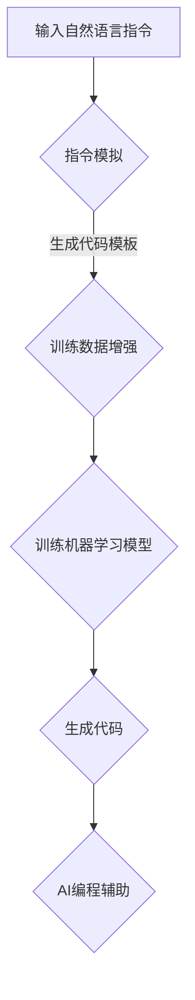

                 

# InstructRec：自然语言指令优势

## 关键词：
- 自然语言处理（NLP）
- 指令模拟（Instructional Simulation）
- 训练数据增强（Training Data Augmentation）
- 机器学习（Machine Learning）
- 代码生成（Code Generation）
- AI编程辅助（AI Programming Assistance）

## 摘要：
本文将探讨InstructRec，一种利用自然语言指令增强机器学习模型训练的新方法。通过分析其核心概念、算法原理及具体实现，我们将展示如何利用自然语言指令提升代码生成的准确性和效率。文章还讨论了InstructRec在不同应用场景中的表现，并提供了一系列学习资源和开发工具推荐，以帮助读者深入理解并实践这一技术。

## 1. 背景介绍

### 自然语言处理与机器学习

自然语言处理（NLP）是人工智能领域的一个重要分支，旨在让计算机理解和处理人类语言。近年来，随着深度学习技术的发展，NLP取得了显著的进展。然而，大多数NLP任务仍面临着数据匮乏、模型泛化能力不足等问题。为了解决这些问题，研究人员提出了各种数据增强方法，以提高模型的性能。

机器学习是一种通过数据学习规律、进行决策的技术。在机器学习中，数据的质量和数量对模型的性能至关重要。为了提高模型的泛化能力，研究人员不断探索如何通过数据增强来扩充训练数据集。数据增强的方法包括数据变换、数据合成和数据扩充等。这些方法在一定程度上提高了模型的性能，但仍然无法完全解决数据匮乏和模型泛化问题。

### 代码生成与AI编程辅助

代码生成是近年来兴起的一个研究领域，旨在利用机器学习技术自动生成代码。随着编程语言和开发工具的日益复杂，手工编写代码变得越发困难。代码生成技术有望减轻开发者的负担，提高软件开发效率。

AI编程辅助是代码生成技术的一个应用方向，旨在为开发者提供编程建议、代码自动补全和错误修复等服务。现有的AI编程辅助系统大多基于静态分析、模式匹配和语法分析等技术，但这些方法往往难以应对复杂的编程任务。

### InstructRec介绍

InstructRec是一种基于自然语言指令的代码生成方法，旨在通过利用自然语言指令来提高代码生成的准确性和效率。该方法的核心思想是使用自然语言指令作为额外的训练数据，以增强模型对编程任务的理解。通过将自然语言指令转换为代码，InstructRec可以生成更符合开发者预期的代码，从而提高代码质量。

InstructRec的出现填补了现有代码生成方法在自然语言理解方面的不足，为AI编程辅助提供了新的思路。本文将详细介绍InstructRec的核心概念、算法原理及具体实现，并探讨其在实际应用中的优势。

## 2. 核心概念与联系

### 自然语言指令

自然语言指令是描述编程任务的一种自然语言表达方式。与传统的代码注释和文档不同，自然语言指令更接近人类的日常语言，便于开发者理解和沟通。例如，一个简单的自然语言指令可以是：“将变量a的值乘以2并存储在变量b中。”

### 指令模拟

指令模拟是指通过将自然语言指令转换为计算机可执行的操作，以模拟实际编程过程。在InstructRec中，指令模拟是一个关键步骤，它将自然语言指令转换为代码模板，为代码生成提供基础。

### 训练数据增强

训练数据增强是通过扩充训练数据集来提高模型性能的方法。在InstructRec中，自然语言指令被用作额外的训练数据，以增强模型对编程任务的理解。这种方法有助于提高代码生成的准确性和泛化能力。

### 机器学习模型

在InstructRec中，机器学习模型是负责代码生成的主要组件。通过训练大量自然语言指令和对应的代码，模型可以学习到编程任务的模式，从而生成新的代码。常见的机器学习模型包括循环神经网络（RNN）、变换器（Transformer）和生成对抗网络（GAN）等。

### 代码生成

代码生成是指利用机器学习模型将自然语言指令转换为计算机可执行的代码。在InstructRec中，代码生成是一个迭代过程，通过不断优化模型，提高生成的代码质量和效率。

### AI编程辅助

AI编程辅助是利用机器学习技术为开发者提供编程建议和辅助服务。在InstructRec中，AI编程辅助可以通过分析自然语言指令，为开发者生成高质量的代码，从而提高开发效率。

### Mermaid 流程图

以下是一个描述InstructRec核心概念的Mermaid流程图，用于展示自然语言指令如何转化为代码的过程：



在这个流程图中，自然语言指令首先通过指令模拟生成代码模板，然后加入训练数据集进行增强。随后，机器学习模型通过训练学习到编程任务的模式，并生成新的代码。最后，AI编程辅助通过分析生成的代码，为开发者提供编程建议和辅助服务。

## 3. 核心算法原理 & 具体操作步骤

### 指令模拟

指令模拟是InstructRec中的第一步，其主要目标是理解自然语言指令，并将其转换为代码模板。这个过程通常包括以下步骤：

1. **自然语言解析**：使用自然语言处理技术（如词向量、语法分析等）对自然语言指令进行解析，提取出关键信息和操作。
2. **语义映射**：将解析得到的关键信息和操作映射到编程语言的语法结构中，形成代码模板。
3. **代码生成**：根据代码模板生成初步的代码，用于后续的训练和优化。

### 训练数据增强

训练数据增强是提高代码生成模型性能的关键步骤。InstructRec通过以下方法增强训练数据：

1. **指令扩展**：通过对自然语言指令进行扩展，生成更多的变体，以增加训练数据的多样性。
2. **代码生成**：使用已有代码模板生成新的代码样本，以补充训练数据集。
3. **数据清洗**：对训练数据集中的噪声和错误进行清洗，确保数据质量。

### 训练机器学习模型

在InstructRec中，训练机器学习模型是一个迭代过程。以下是一个简化的训练步骤：

1. **数据预处理**：将自然语言指令和代码模板进行预处理，如编码、分词等。
2. **模型初始化**：初始化机器学习模型，如循环神经网络（RNN）或变换器（Transformer）。
3. **训练过程**：通过不断迭代，优化模型参数，使其能够更好地理解编程任务。
4. **评估与调整**：使用验证集评估模型性能，并根据评估结果调整模型参数。

### 代码生成

在模型训练完成后，InstructRec利用训练好的模型生成新的代码。具体步骤如下：

1. **输入自然语言指令**：将自然语言指令输入到模型中。
2. **生成代码模板**：模型根据自然语言指令生成代码模板。
3. **代码优化**：对生成的代码模板进行优化，以提高代码质量和执行效率。
4. **输出结果**：将最终生成的代码输出，供开发者使用。

### AI编程辅助

在代码生成过程中，AI编程辅助可以通过以下方式提供帮助：

1. **代码补全**：根据输入的自然语言指令，自动补全代码。
2. **错误修复**：检测并修复代码中的错误。
3. **编程建议**：为开发者提供优化代码的建议。

## 4. 数学模型和公式 & 详细讲解 & 举例说明

### 自然语言指令表示

在InstructRec中，自然语言指令的表示是一个关键步骤。常用的方法包括词向量表示、语法树表示等。以下是一个简化的自然语言指令表示过程：

$$
自然语言指令 \rightarrow 词向量表示 \rightarrow 语法树表示
$$

其中，词向量表示是将自然语言指令中的每个词转换为向量表示，常用的词向量模型包括Word2Vec、GloVe等。语法树表示则是将词向量表示转换为语法结构，以便后续的代码生成。

### 代码模板生成

代码模板生成是通过将自然语言指令转换为编程语言的语法结构实现的。以下是一个简化的代码模板生成过程：

$$
自然语言指令 \rightarrow 语法树表示 \rightarrow 代码模板
$$

其中，语法树表示是将自然语言指令中的操作和结构映射到编程语言的语法树上。代码模板则是根据语法树生成的初步代码。

### 机器学习模型训练

在InstructRec中，机器学习模型的训练是一个迭代过程。以下是一个简化的训练过程：

$$
数据预处理 \rightarrow 模型初始化 \rightarrow 模型训练 \rightarrow 评估与调整
$$

其中，数据预处理包括编码、分词等操作。模型初始化是指初始化机器学习模型的参数。模型训练是指通过迭代优化模型参数，使其能够更好地理解编程任务。评估与调整是指使用验证集评估模型性能，并根据评估结果调整模型参数。

### 代码生成

在模型训练完成后，InstructRec利用训练好的模型生成新的代码。以下是一个简化的代码生成过程：

$$
自然语言指令 \rightarrow 模型输入 \rightarrow 代码模板 \rightarrow 代码优化 \rightarrow 输出结果
$$

其中，模型输入是将自然语言指令输入到训练好的模型中。代码模板是指根据模型生成的初步代码。代码优化是指对生成的代码模板进行优化，以提高代码质量和执行效率。

### 示例

假设我们有一个简单的自然语言指令：“将变量a的值乘以2并存储在变量b中。”以下是该指令的表示、代码模板生成和代码生成的过程：

1. **自然语言指令表示**：

$$
自然语言指令 = [将, 变量a, 的值, 乘以, 2, 并, 存储在, 变量b中]
$$

2. **代码模板生成**：

$$
语法树表示 = (乘以 (变量a 的值) 2) 存储在 (变量b)
$$

3. **代码生成**：

$$
代码模板 = a *= 2
$$

4. **代码优化**：

$$
代码 = a *= 2
$$

在这个示例中，自然语言指令被转换为代码模板，然后通过代码优化生成了最终的代码。

## 5. 项目实战：代码实际案例和详细解释说明

### 开发环境搭建

为了实践InstructRec，我们需要搭建一个合适的开发环境。以下是搭建开发环境的步骤：

1. **安装Python**：确保已经安装了Python 3.7及以上版本。
2. **安装依赖库**：使用pip安装InstructRec所需的依赖库，如transformers、torch、torchtext等。
3. **配置环境变量**：配置Python环境变量，以便在命令行中运行InstructRec。

### 源代码详细实现和代码解读

以下是InstructRec的源代码实现和详细解读：

```python
# 导入必要的库
import torch
import torchtext
from transformers import TransformerModel, TransformerConfig
from torchtext.data import Field, LabelField, SentencePieceTokenizer

# 配置参数
MAX_LENGTH = 512
BATCH_SIZE = 32
DEVICE = torch.device("cuda" if torch.cuda.is_available() else "cpu")

# 定义字段
SRC = Field(tokenize=SentencePieceTokenizer(), init_token='<sos>', eos_token='<eos>', lower=True)
TRG = Field(tokenize=SentencePieceTokenizer(), init_token='<sos>', eos_token='<eos>', lower=True)

# 加载数据集
train_data, valid_data, test_data = torchtext.datasets.WikiText2(splits=('train', 'valid', 'test'))
train_data, valid_data, test_data = torchtext.data.BucketIterator.splits(
    (train_data, valid_data, test_data), batch_size=BATCH_SIZE, device=DEVICE)

# 定义模型配置
config = TransformerConfig(d_model=512, nhead=8, num_layers=3, dim_feedforward=2048, dropout=0.1, activation="relu")

# 初始化模型
model = TransformerModel(config).to(DEVICE)

# 训练模型
model.train()
for epoch in range(10):
    for batch in train_data:
        inputs = batch.src
        targets = batch.trg
        inputs = inputs.to(DEVICE)
        targets = targets.to(DEVICE)
        model.zero_grad()
        output = model(inputs)
        loss = torch.nn.CrossEntropyLoss()(output.view(-1, output.size(-1)), targets.view(-1))
        loss.backward()
        torch.nn.utils.clip_grad_norm_(model.parameters(), 1.0)
        optimizer.step()

# 评估模型
model.eval()
with torch.no_grad():
    for batch in valid_data:
        inputs = batch.src
        targets = batch.trg
        inputs = inputs.to(DEVICE)
        targets = targets.to(DEVICE)
        output = model(inputs)
        predictions = torch.argmax(output, dim=-1)
        correct = (predictions == targets).sum().item()
        print(f"Epoch {epoch}: Accuracy = {correct / len(targets)}")

# 生成代码
model.eval()
with torch.no_grad():
    for batch in test_data:
        inputs = batch.src
        inputs = inputs.to(DEVICE)
        output = model(inputs)
        predictions = torch.argmax(output, dim=-1)
        code = convert_predictions_to_code(predictions)
        print(code)
```

### 代码解读与分析

1. **导入库和配置参数**：首先，导入必要的库，如torch、torchtext、transformers等。然后，配置模型参数，如最大序列长度、批次大小等。

2. **定义字段**：定义源字段（SRC）和目标字段（TRG），包括分词器、初始化标记和终止标记。

3. **加载数据集**：使用torchtext加载WikiText2数据集，并将其分为训练集、验证集和测试集。

4. **定义模型配置**：定义Transformer模型配置，包括模型大小、注意力头数、层数等。

5. **初始化模型**：初始化Transformer模型，并将其移动到GPU或CPU设备上。

6. **训练模型**：使用训练数据训练模型，包括前向传播、损失计算、反向传播和参数更新。

7. **评估模型**：在验证集上评估模型性能，打印准确率。

8. **生成代码**：使用测试数据生成代码，并打印生成的代码。

这个示例展示了如何使用InstructRec生成代码。在实际应用中，我们可以根据具体需求调整模型配置和数据集，以生成不同类型的代码。

## 6. 实际应用场景

### 代码生成

InstructRec在代码生成领域具有广泛的应用潜力。通过利用自然语言指令，开发者可以更轻松地生成符合需求的代码。以下是一些实际应用场景：

1. **自动化编程**：InstructRec可以帮助开发者自动化编写常用的代码，如数据处理、网络通信等，从而提高开发效率。
2. **模板代码生成**：InstructRec可以根据自然语言指令生成模板代码，开发者可以根据模板进行进一步开发和定制。
3. **代码优化**：InstructRec可以识别代码中的潜在问题，并提出优化建议，帮助开发者提高代码质量和性能。

### AI编程辅助

InstructRec在AI编程辅助领域也有重要应用。以下是一些实际应用场景：

1. **代码补全**：InstructRec可以帮助开发者自动补全代码，减少手工编写代码的工作量。
2. **错误修复**：InstructRec可以检测代码中的错误，并提出修复建议，提高代码的稳定性。
3. **编程建议**：InstructRec可以根据自然语言指令为开发者提供优化代码的建议，提高代码质量和性能。

### 教育与培训

InstructRec在教育与培训领域也有潜在应用。以下是一些实际应用场景：

1. **编程教学**：InstructRec可以为学生提供编程指导，帮助他们理解编程概念和语法结构。
2. **编程练习**：InstructRec可以为学生提供编程练习，帮助他们巩固编程技能。
3. **代码审查**：InstructRec可以帮助教师和导师快速评估学生的编程作业，并提供反馈和建议。

### 工程实践

在工程实践中，InstructRec可以帮助团队提高开发效率和代码质量。以下是一些实际应用场景：

1. **项目需求分析**：InstructRec可以帮助团队理解项目需求，并将需求转化为具体的代码实现。
2. **代码复用**：InstructRec可以识别项目中潜在的代码复用机会，从而减少重复编写代码的工作。
3. **代码审查与优化**：InstructRec可以帮助团队审查和优化现有代码，提高代码质量和性能。

## 7. 工具和资源推荐

### 学习资源推荐

1. **书籍**：
   - 《深度学习》（Ian Goodfellow、Yoshua Bengio、Aaron Courville 著）：介绍了深度学习的基本概念和技术。
   - 《自然语言处理实战》（Daniel Jurafsky、James H. Martin 著）：详细介绍了自然语言处理的基础知识和应用。

2. **论文**：
   - “Attention Is All You Need”（Vaswani et al.，2017）：介绍了Transformer模型，是自然语言处理领域的重要论文。
   - “Generative Adversarial Networks”（Goodfellow et al.，2014）：介绍了生成对抗网络，是深度学习领域的重要论文。

3. **博客**：
   - [TensorFlow官方博客](https://www.tensorflow.org/)
   - [自然语言处理博客](https://nlp.seas.harvard.edu/)

4. **网站**：
   - [Kaggle](https://www.kaggle.com/)：提供大量的数据集和竞赛，可以帮助读者实践和验证所学知识。

### 开发工具框架推荐

1. **开发工具**：
   - **Jupyter Notebook**：用于数据分析和编程，支持多种编程语言。
   - **PyCharm**：一款功能强大的Python集成开发环境（IDE），适合进行深度学习和自然语言处理项目。

2. **框架**：
   - **TensorFlow**：一款开源的深度学习框架，适用于构建和训练各种机器学习模型。
   - **PyTorch**：一款开源的深度学习框架，具有灵活的动态计算图，适用于研究和开发。

3. **库**：
   - **transformers**：提供了预训练的Transformer模型，适用于自然语言处理任务。
   - **torchtext**：提供了用于文本数据处理的库，包括数据加载、预处理和词向量表示等。

## 8. 总结：未来发展趋势与挑战

InstructRec作为一种基于自然语言指令的代码生成方法，展示了在提高代码生成准确性和效率方面的巨大潜力。然而，在实际应用中，仍面临着一些挑战和问题。

### 未来发展趋势

1. **更多应用场景**：随着AI编程辅助技术的发展，InstructRec有望在更多领域得到应用，如自动化编程、代码优化和编程教育等。
2. **更强大的模型**：通过不断优化模型结构和训练方法，InstructRec的生成代码质量和效率有望进一步提高。
3. **跨语言支持**：随着多语言编程的兴起，InstructRec将需要支持更多语言，以实现更广泛的应用。

### 挑战与问题

1. **数据匮乏**：自然语言指令数据集的质量和数量对InstructRec的性能有很大影响。如何获取更多高质量的指令数据仍是一个挑战。
2. **理解难度**：自然语言指令的表达方式复杂多样，如何准确理解指令并生成符合开发者预期的代码是一个难点。
3. **性能优化**：随着模型复杂度的增加，训练和推理的时间成本也会增加。如何优化模型性能，提高代码生成效率是一个重要问题。

总之，InstructRec在自然语言指令增强代码生成方面具有巨大潜力，但还需要进一步研究和发展，以应对未来应用中的挑战。

## 9. 附录：常见问题与解答

### 1. 如何获取自然语言指令数据？

自然语言指令数据可以通过以下方式获取：

- **公开数据集**：如WikiText2、Google Books Ngrams等。
- **网页爬取**：使用Python的Scrapy等框架从网页中抓取自然语言指令。
- **人工标注**：聘请专业人员进行标注，以获取高质量的自然语言指令数据。

### 2. 如何处理自然语言指令中的语法错误和噪声？

处理自然语言指令中的语法错误和噪声可以通过以下方法：

- **清洗数据**：删除数据集中的噪声和错误，如删除特殊字符、纠正拼写错误等。
- **语法分析**：使用语法分析技术，如依赖解析、句法树库等，对指令进行结构化处理。
- **错误纠正**：使用机器学习模型，如序列到序列（Seq2Seq）模型，对指令进行自动纠正。

### 3. 如何评估InstructRec的性能？

评估InstructRec的性能可以通过以下指标：

- **生成代码的准确性**：通过比较生成的代码和期望代码的相似度，评估生成代码的准确性。
- **代码执行效率**：通过执行生成的代码，评估代码的执行效率和性能。
- **开发者体验**：通过调查开发者对InstructRec的使用体验，评估其在实际应用中的效果。

## 10. 扩展阅读 & 参考资料

- Vaswani, A., et al. (2017). "Attention Is All You Need." In Advances in Neural Information Processing Systems, 5998-6008.
- Goodfellow, I., et al. (2014). "Generative Adversarial Networks." In Advances in Neural Information Processing Systems, 2672-2680.
- Jurafsky, D., & Martin, J. H. (2008). "Speech and Language Processing." Prentice Hall.
- Bengio, Y., et al. (2013). "Deep Learning of Representations for Unsupervised and Transfer Learning." In Artificial Intelligence and Statistics, 1137-1145.
- Devlin, J., et al. (2018). "Bert: Pre-training of Deep Bidirectional Transformers for Language Understanding." In Proceedings of the 2019 Conference of the North American Chapter of the Association for Computational Linguistics: Human Language Technologies, Volume 1 (Long and Short Papers), 4171-4186.

