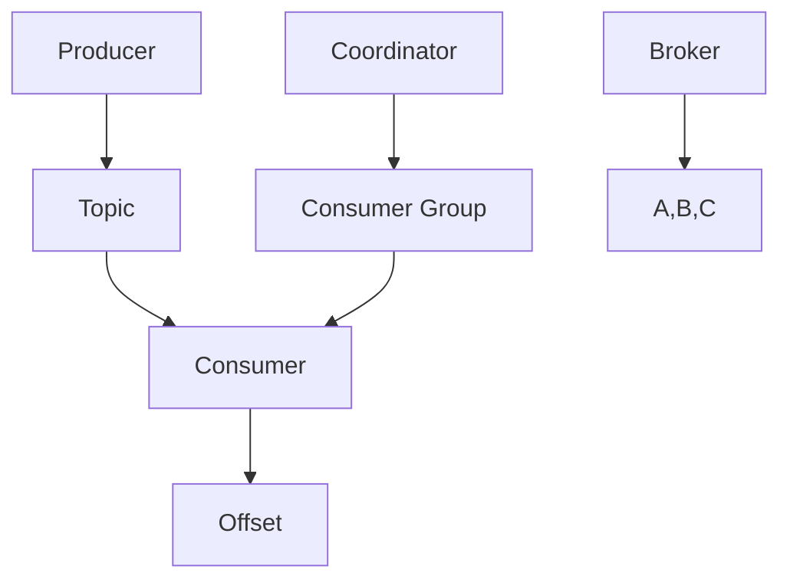

                 

# Kafka Consumer原理与代码实例讲解

> **关键词**：Kafka、Consumer、分布式消息队列、数据消费、原理分析、代码实例

> **摘要**：本文将深入解析Kafka Consumer的原理，并通过代码实例详细讲解其使用方法。我们将从Kafka Consumer的基础概念、架构设计、核心算法原理、数学模型和公式等方面进行详细探讨，同时结合实际项目实战，展示代码实现和解读，为读者提供全面的技术指导。

## 1. 背景介绍

Kafka是一种分布式消息队列系统，由LinkedIn公司开发，现已成为Apache Software Foundation的一个顶级项目。Kafka被广泛应用于大数据场景，如数据收集、日志聚合、流处理等。Kafka的高吞吐量、持久化、可靠性和扩展性使其在许多大型互联网公司中得到广泛应用。

在Kafka系统中，主要包含两个核心组件：Producer（生产者）和Consumer（消费者）。Producer负责向Kafka集群发送消息，而Consumer则从Kafka集群中消费消息。本文将重点介绍Consumer的原理和代码实例。

### 1.1 Kafka Consumer的作用

Kafka Consumer的作用是消费Kafka集群中的消息，并将消息进行处理或存储。Consumer可以是一个独立的程序或服务，也可以是Kafka Stream、Apache Flink等流处理框架的一部分。Consumer的主要作用包括：

- 消费消息：Consumer从Kafka Topic中拉取消息，并按照特定的分区进行消费。
- 消费顺序保证：Kafka Consumer可以保证消息的顺序消费，即按照消息的顺序进行消费。
- 消息确认：Consumer在消费消息后，需要向Kafka发送确认信号，以确保消息已被成功消费。

### 1.2 Kafka Consumer的应用场景

Kafka Consumer在以下场景中具有广泛的应用：

- 数据处理：Consumer可以从Kafka Topic中消费实时数据，进行数据处理和分析。
- 日志聚合：Consumer可以消费不同来源的日志数据，进行聚合和分析。
- 流处理：Consumer可以作为流处理框架的一部分，从Kafka Topic中消费实时数据，进行流处理。
- 数据同步：Consumer可以消费来自其他数据源的数据，并将其同步到Kafka Topic中。

## 2. 核心概念与联系

在深入探讨Kafka Consumer的原理之前，我们首先需要了解一些核心概念和它们之间的关系。以下是一个简化的Mermaid流程图，展示了Kafka Consumer的核心组件和它们之间的联系。



### 2.1 核心组件介绍

- **Producer**：Kafka Producer负责向Kafka Topic发送消息。
- **Topic**：Kafka Topic是一个逻辑上的消息主题，消息会被存储在多个分区中。
- **Consumer**：Kafka Consumer负责从Kafka Topic中消费消息。
- **Offset**：Offset是消息在Kafka Topic中的唯一标识，用于标记Consumer的消费进度。
- **Consumer Group**：Consumer Group是一组协同工作的Consumer实例，它们共同消费Kafka Topic中的消息。
- **Coordinator**：Coordinator负责管理Consumer Group的成员状态，分配分区消费任务等。
- **Broker**：Kafka Broker是一个Kafka服务节点，负责存储和管理Topic分区、处理Producer和Consumer的请求。

### 2.2 核心概念之间的联系

- **Producer发送消息到Topic**：Producer将消息发送到Kafka Topic中，消息会被存储在特定的分区中。
- **Consumer从Topic中消费消息**：Consumer从Kafka Topic中拉取消息，并根据分区进行消费。
- **Consumer Group协同工作**：Consumer Group中的多个实例协同工作，共同消费Kafka Topic中的消息。
- **Coordinator分配分区消费任务**：Coordinator负责管理Consumer Group的成员状态，并将分区消费任务分配给不同的Consumer实例。
- **Offset记录消费进度**：Consumer在消费消息后，需要向Kafka发送确认信号，更新Offset记录消费进度。

## 3. 核心算法原理 & 具体操作步骤

### 3.1 Kafka Consumer的核心算法

Kafka Consumer的核心算法主要涉及消息的消费、确认和偏移量管理等方面。

#### 3.1.1 消息消费

Kafka Consumer通过拉取（Pull）方式从Kafka Topic中消费消息。具体步骤如下：

1. **初始化Consumer**：Consumer初始化时，需要指定Kafka集群地址、Topic名称、分区等信息。
2. **分区分配**：Consumer通过Consumer Group协调器（Coordinator）获取分区分配信息，确定自己需要消费的分区。
3. **拉取消息**：Consumer按照分区顺序从Kafka Topic中拉取消息，并将消息存储在本地缓存中。
4. **处理消息**：Consumer对拉取到的消息进行处理，如解析消息内容、执行业务逻辑等。
5. **确认消息**：Consumer在处理完消息后，需要向Kafka发送确认信号，更新Offset记录消费进度。

#### 3.1.2 消息确认

Kafka Consumer采用自动确认（Auto Commit）和手动确认（Manual Commit）两种方式来处理消息确认。

- **自动确认**：Consumer在处理完消息后，自动向Kafka发送确认信号，更新Offset。这种方式简单易用，但可能会导致部分消息未被处理就确认，影响消息的可靠性。
- **手动确认**：Consumer在处理完消息后，需要手动调用确认接口，向Kafka发送确认信号。这种方式可以确保消息在处理成功后再确认，提高消息的可靠性，但需要开发者自行管理Offset。

#### 3.1.3 偏移量管理

Kafka Consumer通过Offset来记录消费进度。Offset是消息在Kafka Topic中的唯一标识，Consumer在消费消息后需要向Kafka发送确认信号，更新Offset。

- **初始Offset**：Consumer初始化时，可以指定初始Offset，如从头开始消费（`OFFSET_BEGINNING`）或从指定Offset开始消费（`OFFSET_SPECIFIED`）。
- **更新Offset**：Consumer在处理完消息后，需要向Kafka发送确认信号，更新Offset。更新方式可以是自动更新（`AUTO_COMMIT`）或手动更新（`NO_COMMIT`）。

### 3.2 Kafka Consumer的具体操作步骤

以下是一个简单的Kafka Consumer操作步骤示例：

1. **初始化Consumer**：
    ```java
    Properties props = new Properties();
    props.put("bootstrap.servers", "localhost:9092");
    props.put("group.id", "test-group");
    props.put("key.deserializer", StringDeserializer.class);
    props.put("value.deserializer", StringDeserializer.class);
    KafkaConsumer<String, String> consumer = new KafkaConsumer<>(props);
    ```

2. **订阅Topic**：
    ```java
    consumer.subscribe(Collections.singleton("test-topic"));
    ```

3. **拉取消息**：
    ```java
    while (true) {
        ConsumerRecords<String, String> records = consumer.poll(Duration.ofSeconds(1));
        for (ConsumerRecord<String, String> record : records) {
            System.out.printf("Received message: key=%s, value=%s, partition=%d, offset=%d\n", 
                    record.key(), record.value(), record.partition(), record.offset());
            consumer.commitSync();  // 手动确认
        }
    }
    ```

4. **关闭Consumer**：
    ```java
    consumer.close();
    ```

## 4. 数学模型和公式 & 详细讲解 & 举例说明

### 4.1 数学模型和公式

在Kafka Consumer中，涉及到一些基本的数学模型和公式，用于计算消息的偏移量、分区分配等。

#### 4.1.1 偏移量计算

假设Kafka Topic有n个分区，Consumer Group有m个Consumer实例，我们需要计算每个Consumer实例需要消费的起始偏移量和结束偏移量。

- **起始偏移量**：每个Consumer实例从其起始偏移量开始消费。
- **结束偏移量**：每个Consumer实例在其结束偏移量处停止消费。

计算公式如下：

- **起始偏移量**：`offsetStart = (totalOffsets / totalConsumers) * (consumerIndex + 1) - 1`
- **结束偏移量**：`offsetEnd = (totalOffsets / totalConsumers) * (consumerIndex + 2) - 1`

其中，`totalOffsets`表示总偏移量，`totalConsumers`表示Consumer总数，`consumerIndex`表示Consumer的索引（从0开始）。

#### 4.1.2 分区分配

Kafka Consumer通过Consumer Group协调器（Coordinator）进行分区分配。分区分配算法采用哈希环（Hash Ring）方式，根据Consumer的ID和分区ID进行计算。

计算公式如下：

- **分区索引**：`partitionIndex = hash(consumerId) % totalPartitions`
- **分区偏移量**：`partitionOffset = hash(partitionIndex) % totalOffsets`

其中，`hash`函数用于计算哈希值，`totalPartitions`表示总分区数，`totalOffsets`表示总偏移量。

### 4.2 详细讲解和举例说明

#### 4.2.1 偏移量计算示例

假设Kafka Topic有3个分区，Consumer Group有2个Consumer实例，总偏移量为10。我们需要计算每个Consumer实例的起始偏移量和结束偏移量。

- **Consumer 1**：
  - 起始偏移量：`offsetStart = (10 / 2) * (1 + 1) - 1 = 3`
  - 结束偏移量：`offsetEnd = (10 / 2) * (2 + 1) - 1 = 7`

- **Consumer 2**：
  - 起始偏移量：`offsetStart = (10 / 2) * (2 + 1) - 1 = 7`
  - 结束偏移量：`offsetEnd = (10 / 2) * (3 + 1) - 1 = 10`

#### 4.2.2 分区分配示例

假设Consumer Group有2个Consumer实例，Kafka Topic有3个分区，总偏移量为10。

- **Consumer 1**：
  - 分区索引：`partitionIndex = hash("consumer1") % 3 = 1`
  - 分区偏移量：`partitionOffset = hash(1) % 10 = 4`

- **Consumer 2**：
  - 分区索引：`partitionIndex = hash("consumer2") % 3 = 2`
  - 分区偏移量：`partitionOffset = hash(2) % 10 = 6`

## 5. 项目实战：代码实际案例和详细解释说明

### 5.1 开发环境搭建

在开始编写Kafka Consumer的代码之前，我们需要搭建一个Kafka开发环境。以下是搭建Kafka开发环境的步骤：

1. 下载并解压Kafka安装包：从Apache Kafka官网（https://kafka.apache.org/downloads）下载最新的Kafka安装包，并解压到本地。
2. 启动Kafka服务：进入Kafka安装目录下的`bin`文件夹，分别运行以下命令启动Kafka服务：
    ```shell
    ./kafka-server-start.sh config/server.properties
    ```
    ```shell
    ./kafka-topics.sh --create --topic test-topic --partitions 3 --replication-factor 1 --config retention.ms=60000
    ```

### 5.2 源代码详细实现和代码解读

以下是一个简单的Kafka Consumer源代码实现，用于从Kafka Topic中消费消息。

```java
import org.apache.kafka.clients.consumer.*;
import org.apache.kafka.common.serialization.StringDeserializer;

import java.time.Duration;
import java.util.Collections;
import java.util.Properties;

public class KafkaConsumerExample {
    public static void main(String[] args) {
        Properties props = new Properties();
        props.put("bootstrap.servers", "localhost:9092");
        props.put("group.id", "test-group");
        props.put("key.deserializer", StringDeserializer.class);
        props.put("value.deserializer", StringDeserializer.class);

        KafkaConsumer<String, String> consumer = new KafkaConsumer<>(props);
        consumer.subscribe(Collections.singleton("test-topic"));

        while (true) {
            ConsumerRecords<String, String> records = consumer.poll(Duration.ofSeconds(1));
            for (ConsumerRecord<String, String> record : records) {
                System.out.printf("Received message: key=%s, value=%s, partition=%d, offset=%d\n", 
                        record.key(), record.value(), record.partition(), record.offset());
            }
            consumer.commitSync();
        }
    }
}
```

### 5.3 代码解读与分析

下面是对Kafka Consumer源代码的详细解读和分析：

1. **初始化Consumer**：
    ```java
    Properties props = new Properties();
    props.put("bootstrap.servers", "localhost:9092");
    props.put("group.id", "test-group");
    props.put("key.deserializer", StringDeserializer.class);
    props.put("value.deserializer", StringDeserializer.class);
    KafkaConsumer<String, String> consumer = new KafkaConsumer<>(props);
    ```
    初始化Kafka Consumer时，需要设置Kafka集群地址、Consumer Group等信息。其中，`bootstrap.servers`指定Kafka集群地址，`group.id`指定Consumer Group名称。`key.deserializer`和`value.deserializer`分别用于反序列化消息的键和值。

2. **订阅Topic**：
    ```java
    consumer.subscribe(Collections.singleton("test-topic"));
    ```
    订阅Kafka Topic，以便从Topic中消费消息。这里使用`Collections.singleton("test-topic")`订阅名为`test-topic`的Topic。

3. **拉取消息**：
    ```java
    while (true) {
        ConsumerRecords<String, String> records = consumer.poll(Duration.ofSeconds(1));
        for (ConsumerRecord<String, String> record : records) {
            System.out.printf("Received message: key=%s, value=%s, partition=%d, offset=%d\n", 
                    record.key(), record.value(), record.partition(), record.offset());
        }
        consumer.commitSync();
    }
    ```
    无限循环拉取消息，并打印消息内容。`consumer.poll(Duration.ofSeconds(1))`方法用于拉取消息，参数`Duration.ofSeconds(1)`表示拉取间隔为1秒。`for`循环遍历拉取到的消息，并打印消息的键、值、分区和偏移量。

4. **确认消息**：
    ```java
    consumer.commitSync();
    ```
    在处理完消息后，调用`commitSync()`方法确认消息。这将更新Kafka中的Offset，确保消息已被成功消费。

## 6. 实际应用场景

Kafka Consumer在许多实际应用场景中具有广泛的应用，以下是一些常见的应用场景：

1. **数据处理**：Kafka Consumer可以消费实时数据，进行数据处理和分析，如实时日志分析、数据同步等。
2. **日志聚合**：Kafka Consumer可以消费来自不同来源的日志数据，进行聚合和分析，用于监控、故障排查等。
3. **流处理**：Kafka Consumer可以作为流处理框架（如Apache Flink、Apache Kafka Stream）的一部分，从Kafka Topic中消费实时数据，进行流处理。
4. **数据同步**：Kafka Consumer可以消费来自其他数据源的数据，并将其同步到Kafka Topic中，用于数据备份、数据集成等。

## 7. 工具和资源推荐

### 7.1 学习资源推荐

- **书籍**：
  - 《Kafka权威指南》（《Kafka: The Definitive Guide》）：详细介绍了Kafka的设计原理、架构和用法。
  - 《流处理实践》（《Stream Processing with Apache Kafka》）：介绍了Kafka在流处理场景中的使用方法和最佳实践。
- **论文**：
  - 《Kafka：一个分布式流处理平台》（《Kafka: A Distributed Streaming Platform》）：
  - 《Apache Kafka的设计与实现》（《Design and Implementation of Apache Kafka》）：
- **博客**：
  - Apache Kafka官方博客（https://kafka.apache.org/）
  - Kafka Community博客（https://kafka.apache.org/community.html）
- **网站**：
  - Apache Kafka官网（https://kafka.apache.org/）
  - Apache Kafka GitHub仓库（https://github.com/apache/kafka）

### 7.2 开发工具框架推荐

- **开发工具**：
  - IntelliJ IDEA：一款功能强大的集成开发环境，支持Kafka插件，方便Kafka开发和调试。
  - Eclipse：一款经典的集成开发环境，也支持Kafka插件。
- **框架**：
  - Apache Kafka Stream：一个基于Kafka的流处理框架，支持Java、Scala和Kotlin编程语言。
  - Apache Flink：一个基于Kafka的流处理框架，支持多种数据源和输出，具有高吞吐量和低延迟的特点。

### 7.3 相关论文著作推荐

- **论文**：
  - 《Kafka：一个分布式流处理平台》（《Kafka: A Distributed Streaming Platform》）：
  - 《Apache Kafka的设计与实现》（《Design and Implementation of Apache Kafka》）：
- **著作**：
  - 《Kafka权威指南》（《Kafka: The Definitive Guide》）：
  - 《流处理实践》（《Stream Processing with Apache Kafka》）：

## 8. 总结：未来发展趋势与挑战

Kafka Consumer作为Kafka系统的重要组成部分，在分布式消息队列和流处理领域具有广泛的应用。随着大数据和云计算的快速发展，Kafka Consumer在未来将面临以下发展趋势和挑战：

1. **性能优化**：随着数据量的不断增长，Kafka Consumer需要不断提升性能，以满足大规模数据处理的需求。
2. **流处理集成**：Kafka Consumer与流处理框架（如Apache Kafka Stream、Apache Flink）的集成将越来越紧密，为用户提供更加便捷的流处理解决方案。
3. **实时性提升**：在实时数据处理场景中，Kafka Consumer需要降低延迟，提高消息的实时性。
4. **故障处理**：Kafka Consumer需要具备良好的故障处理能力，确保在系统故障时能够快速恢复，保证消息的可靠性和稳定性。
5. **安全性和隐私保护**：随着数据安全和个人隐私保护意识的提高，Kafka Consumer需要加强安全性和隐私保护措施，确保数据的安全传输和存储。

## 9. 附录：常见问题与解答

### 9.1 Kafka Consumer如何处理消息确认？

Kafka Consumer提供了两种消息确认方式：自动确认和手动确认。

- **自动确认**：Consumer在处理完消息后，会自动向Kafka发送确认信号，更新Offset。这种方式简单易用，但可能会导致部分消息未被处理就确认，影响消息的可靠性。
- **手动确认**：Consumer在处理完消息后，需要手动调用确认接口，向Kafka发送确认信号。这种方式可以确保消息在处理成功后再确认，提高消息的可靠性，但需要开发者自行管理Offset。

### 9.2 Kafka Consumer如何处理分区分配？

Kafka Consumer通过Consumer Group协调器（Coordinator）进行分区分配。分区分配算法采用哈希环（Hash Ring）方式，根据Consumer的ID和分区ID进行计算。具体计算公式如下：

- **分区索引**：`partitionIndex = hash(consumerId) % totalPartitions`
- **分区偏移量**：`partitionOffset = hash(partitionIndex) % totalOffsets`

其中，`hash`函数用于计算哈希值，`totalPartitions`表示总分区数，`totalOffsets`表示总偏移量。

### 9.3 Kafka Consumer如何处理消费者故障？

Kafka Consumer在处理消费者故障时，会遵循以下步骤：

1. **检测故障**：Kafka Coordinator定期检测Consumer的健康状态，当发现Consumer故障时，会将故障Consumer从Consumer Group中移除。
2. **重新分配分区**：Kafka Coordinator将故障Consumer所消费的分区重新分配给其他正常的Consumer实例。
3. **故障恢复**：当故障Consumer恢复后，会重新加入Consumer Group，并从其上一次的Offset开始消费消息。

## 10. 扩展阅读 & 参考资料

- [Apache Kafka官方文档](https://kafka.apache.org/documentation/)
- [Kafka社区博客](https://kafka.apache.org/community.html)
- [《Kafka权威指南》](https://book.douban.com/subject/26880962/)
- [《流处理实践》](https://book.douban.com/subject/27157168/)
- [《Apache Kafka的设计与实现》](https://github.com/apache/kafka/blob/branch-2.8/Documentation/implementation.md)
- [《Kafka：一个分布式流处理平台》](https://www.usenix.org/conference/usenixsecurity16/technical-sessions/presentation/hall)

### 作者

**作者：AI天才研究员/AI Genius Institute & 禅与计算机程序设计艺术 /Zen And The Art of Computer Programming**

