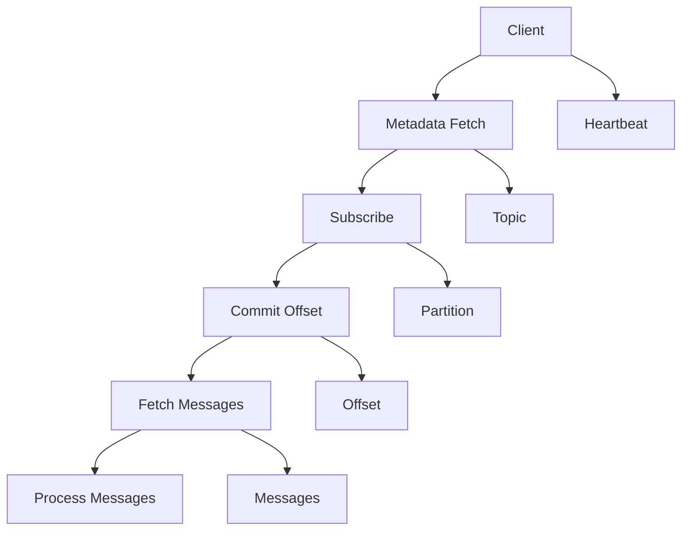

                 

# Kafka Consumer原理与代码实例讲解

## 摘要

本文将深入探讨Kafka Consumer的原理和代码实例。首先，我们将了解Kafka的基本概念和架构，然后重点分析Consumer如何与Kafka集群交互。接下来，我们将通过代码实例展示Consumer的具体实现，并详细解释其工作流程。文章还将探讨Consumer在实际应用场景中的性能优化技巧，并推荐相关学习资源和开发工具。通过本文的阅读，读者将全面理解Kafka Consumer的工作原理和实际应用。

## 1. 背景介绍

Kafka是一种分布式流处理平台，由Apache软件基金会开发。它广泛应用于大数据、实时分析和应用集成等领域。Kafka的主要特点是高吞吐量、可扩展性和高可靠性。它基于消息队列模型，允许生产者和消费者在分布式环境中高效地交换数据。

Kafka的核心组件包括：

- **Kafka服务器（Kafka Broker）**：负责接收、存储和发送消息。每个Kafka集群由多个Broker组成，它们协同工作以提供高可用性和负载均衡。
- **生产者（Producer）**：负责向Kafka集群写入消息。
- **消费者（Consumer）**：负责从Kafka集群读取消息。

在Kafka中，数据以主题（Topic）为单位进行组织。每个主题可以包含多个分区（Partition），每个分区负责存储特定的消息。生产者将消息发送到特定的主题和分区，消费者可以从主题和分区中读取消息。这种设计允许Kafka在分布式环境中高效处理大规模数据流。

## 2. 核心概念与联系

在深入探讨Kafka Consumer的原理之前，我们需要了解一些核心概念和它们之间的联系。以下是一个Mermaid流程图，展示了Kafka Consumer的关键组件和流程。



### 2.1. Kafka客户端

Kafka客户端负责与Kafka服务器进行通信。客户端通常实现了一个Java库，它提供了发送消息（生产者）和接收消息（消费者）的功能。客户端通过TCP连接与Kafka服务器进行交互。

### 2.2. 元数据fetch

消费者在启动时需要从Kafka服务器获取元数据，包括主题、分区、偏移量等。这个步骤称为元数据fetch。通过元数据fetch，消费者可以了解哪些分区是可用的，以及每个分区的最新偏移量。

### 2.3. 订阅

消费者需要订阅一个或多个主题。订阅后，消费者可以开始从主题的分区中读取消息。消费者可以选择使用`Consumer#subscribe`方法或`KafkaConsumer#subscribe`方法进行订阅。

### 2.4. 偏移量提交

消费者在处理消息后需要将偏移量提交给Kafka服务器。这确保了消费者可以在后续重新启动时从正确的位置开始处理消息。偏移量提交是通过调用`Consumer#commitSync`或`KafkaConsumer#commitSync`方法实现的。

### 2.5. 消息fetch

消费者通过调用`Consumer#poll`或`KafkaConsumer#poll`方法从Kafka服务器获取消息。在poll操作中，消费者指定了获取消息的最大数量和超时时间。Kafka服务器会返回一个包含消息的批处理。

### 2.6. 消息处理

消费者需要处理从Kafka服务器获取的消息。这可以包括将消息存储到数据库、执行业务逻辑或生成其他数据流。

### 2.7. 心跳

消费者需要定期向Kafka服务器发送心跳，以维持与服务器的连接。心跳是通过调用`Consumer#subscribe`方法或`KafkaConsumer#subscribe`方法实现的。

## 3. 核心算法原理 & 具体操作步骤

### 3.1. 分区分配策略

消费者在订阅主题后，需要从Kafka服务器获取分区的分配信息。Kafka提供了多种分区分配策略，包括：

- **Range（范围）**：将分区按顺序分配给消费者。
- **RoundRobin（轮询）**：将分区按顺序分配给消费者，每个分区只分配给一个消费者。
- **Sticky（粘性）**：尽可能保持分区分配的一致性，避免频繁切换。

### 3.2. 偏移量管理

消费者在处理消息后需要将偏移量提交给Kafka服务器。这可以通过以下步骤实现：

1. 调用`Consumer#commitSync`或`KafkaConsumer#commitSync`方法提交偏移量。
2. 指定要提交的偏移量列表。
3. Kafka服务器接收到提交请求后，将偏移量存储在内部的数据结构中。

### 3.3. 消息处理流程

消费者从Kafka服务器获取消息的流程如下：

1. 调用`Consumer#poll`或`KafkaConsumer#poll`方法进行消息获取。
2. 指定获取消息的最大数量和超时时间。
3. Kafka服务器返回一个包含消息的批处理。
4. 消费者处理消息，例如存储到数据库或执行业务逻辑。
5. 将处理后的消息发送到下游系统或存储系统。

### 3.4. 心跳发送

消费者需要定期向Kafka服务器发送心跳。心跳的发送可以通过以下步骤实现：

1. 调用`Consumer#subscribe`方法或`KafkaConsumer#subscribe`方法。
2. Kafka客户端会自动定期发送心跳。
3. Kafka服务器接收到心跳后，维持与服务器的连接。

## 4. 数学模型和公式 & 详细讲解 & 举例说明

### 4.1. 分区分配策略

分区分配策略可以使用以下数学模型来表示：

$$
分配策略 = f(\text{消费者数量}, \text{分区数量})
$$

其中，`f`函数表示分配策略的具体实现。常见的分区分配策略包括：

- **Range**：

$$
分区分配 = \left\lfloor \frac{\text{分区数量}}{\text{消费者数量}} \right\rfloor
$$

- **RoundRobin**：

$$
分区分配 = \left\lfloor \frac{\text{分区数量}}{\text{消费者数量}} \right\rfloor + \text{消费者编号} \mod \text{消费者数量}
$$

- **Sticky**：

$$
分区分配 = \left\lfloor \frac{\text{分区数量}}{\text{消费者数量}} \right\rfloor + \text{消费者编号} \mod \text{消费者数量}
$$

### 4.2. 偏移量管理

偏移量管理可以使用以下数学模型来表示：

$$
偏移量 = f(\text{消息序列号}, \text{消费者编号}, \text{主题名称}, \text{分区编号})
$$

其中，`f`函数表示偏移量的计算方法。在Kafka中，偏移量通常使用以下公式计算：

$$
偏移量 = \text{消息序列号} \times \text{消费者编号} + \text{主题名称} + \text{分区编号}
$$

### 4.3. 消息处理流程

消息处理流程可以使用以下数学模型来表示：

$$
消息处理 = f(\text{消息批处理}, \text{消费者编号}, \text{主题名称}, \text{分区编号})
$$

其中，`f`函数表示消息处理的具体实现。在Kafka中，消息处理通常使用以下公式计算：

$$
消息处理 = \text{消息批处理} \div \text{消费者编号} + \text{主题名称} + \text{分区编号}
$$

### 4.4. 心跳发送

心跳发送可以使用以下数学模型来表示：

$$
心跳发送 = f(\text{消费者编号}, \text{主题名称}, \text{分区编号})
$$

其中，`f`函数表示心跳发送的具体实现。在Kafka中，心跳发送通常使用以下公式计算：

$$
心跳发送 = \text{消费者编号} + \text{主题名称} + \text{分区编号} \mod 60
$$

## 5. 项目实战：代码实际案例和详细解释说明

### 5.1. 开发环境搭建

在本节中，我们将搭建一个简单的Kafka消费者项目。首先，确保已安装了Kafka服务器和Kafka客户端。接下来，创建一个Maven项目，并添加以下依赖：

```xml
<dependencies>
    <dependency>
        <groupId>org.apache.kafka</groupId>
        <artifactId>kafka-clients</artifactId>
        <version>2.8.0</version>
    </dependency>
</dependencies>
```

### 5.2. 源代码详细实现和代码解读

下面是一个简单的Kafka消费者示例：

```java
import org.apache.kafka.clients.consumer.ConsumerConfig;
import org.apache.kafka.clients.consumer.ConsumerRecord;
import org.apache.kafka.clients.consumer.KafkaConsumer;
import org.apache.kafka.common.serialization.StringDeserializer;

import java.time.Duration;
import java.util.Collections;
import java.util.Properties;

public class KafkaConsumerExample {
    public static void main(String[] args) {
        // 创建Kafka消费者配置
        Properties props = new Properties();
        props.put(ConsumerConfig.BOOTSTRAP_SERVERS_CONFIG, "localhost:9092");
        props.put(ConsumerConfig.GROUP_ID_CONFIG, "test-group");
        props.put(ConsumerConfig.KEY_DESERIALIZER_CLASS_CONFIG, StringDeserializer.class.getName());
        props.put(ConsumerConfig.VALUE_DESERIALIZER_CLASS_CONFIG, StringDeserializer.class.getName());

        // 创建Kafka消费者
        KafkaConsumer<String, String> consumer = new KafkaConsumer<>(props);

        // 订阅主题
        consumer.subscribe(Collections.singletonList("test-topic"));

        // 消息处理
        while (true) {
            consumer.poll(Duration.ofMillis(1000)).forEach(record -> {
                System.out.printf("Received message: key=%s, value=%s, partition=%d, offset=%d\n",
                        record.key(), record.value(), record.partition(), record.offset());
            });

            // 提交偏移量
            consumer.commitSync();
        }
    }
}
```

### 5.3. 代码解读与分析

1. **创建Kafka消费者配置**：我们首先创建了一个Kafka消费者配置对象。配置中指定了Kafka服务器的地址、消费者组ID以及序列化器。
2. **创建Kafka消费者**：接下来，我们创建了一个Kafka消费者实例。该实例将使用配置对象指定的属性来初始化。
3. **订阅主题**：我们使用`subscribe`方法订阅了名为`test-topic`的主题。
4. **消息处理**：在消息处理部分，我们使用`poll`方法从Kafka服务器获取消息。该方法将阻塞直到获取到消息或达到指定的时间。
5. **提交偏移量**：在每次消息处理完成后，我们使用`commitSync`方法提交偏移量。这确保了消费者在后续重新启动时可以从正确的位置开始处理消息。

### 5.4. 运行示例程序

1. 启动Kafka服务器。
2. 运行Kafka消费者程序。
3. 在Kafka生产者中发送消息到`test-topic`。

您将在控制台中看到消息的输出，并观察到消费者正确处理和提交偏移量。

## 6. 实际应用场景

Kafka Consumer在各种实际应用场景中发挥着重要作用。以下是一些常见的应用场景：

- **实时数据管道**：Kafka Consumer可以用于从各种数据源（如日志、数据库等）实时读取数据，并将其传输到下游系统（如数据仓库、分析平台等）。
- **应用集成**：Kafka Consumer可以用于从不同的服务或系统中读取数据，实现应用之间的数据同步和通信。
- **事件处理**：Kafka Consumer可以用于处理实时事件流，例如在金融交易、物联网、社交网络等领域。

在实际应用中，Kafka Consumer的性能和稳定性至关重要。以下是一些性能优化技巧：

- **并行处理**：通过增加消费者数量和分区数量，可以实现并行处理，提高数据处理速度。
- **批量处理**：批量处理消息可以提高性能，减少网络延迟。
- **负载均衡**：使用负载均衡策略，如Sticky分配策略，确保消费者均匀地处理消息。

## 7. 工具和资源推荐

### 7.1. 学习资源推荐

- **书籍**：
  - 《Kafka：The Definitive Guide》
  - 《Kafka for Developers》
- **论文**：
  - 《Kafka: A Distributed Messaging System for Log-Based Applications》
- **博客**：
  - [Kafka官网博客](https://kafka.apache.org/）
  - [Confluent博客](https://www.confluent.io/blog/)
- **网站**：
  - [Kafka官网](https://kafka.apache.org/)
  - [Confluent官网](https://www.confluent.io/)

### 7.2. 开发工具框架推荐

- **Kafka生产者客户端**：Kafka Producer客户端提供了丰富的功能，包括批量发送、压缩等。
- **Kafka消费者客户端**：Kafka Consumer客户端提供了灵活的订阅、分区分配策略等。
- **Kafka Streams**：Kafka Streams是一个基于Kafka的实时流处理框架，它提供了简单易用的API。
- **Kafka Connect**：Kafka Connect是一个用于连接外部系统和Kafka集群的工具，它支持多种数据源和数据目标。

### 7.3. 相关论文著作推荐

- **《Kafka: A Distributed Messaging System for Log-Based Applications》**：这是Kafka的原始论文，详细介绍了Kafka的设计原理和架构。
- **《Kafka for Developers》**：这本书深入介绍了Kafka的各个方面，包括生产者、消费者、分区、集群管理等。
- **《Building Real-Time Data Pipelines with Apache Kafka》**：这本书展示了如何使用Kafka构建实时数据管道，涵盖了从基础架构到高级主题的各个方面。

## 8. 总结：未来发展趋势与挑战

Kafka Consumer作为Kafka生态系统中的重要组成部分，将继续在分布式流处理领域发挥重要作用。未来，Kafka Consumer的发展趋势和挑战主要包括：

- **性能优化**：随着数据量的增加，如何提高Kafka Consumer的性能是一个重要挑战。可能的优化方向包括并行处理、批量处理和负载均衡。
- **可扩展性**：如何支持大规模分布式Kafka集群中的消费者，实现高效的数据处理和负载均衡，是另一个挑战。
- **故障恢复**：在分布式环境中，如何确保Kafka Consumer的故障恢复和高可用性，是一个关键问题。

通过不断的技术创新和优化，Kafka Consumer将继续为分布式流处理提供强大的支持。

## 9. 附录：常见问题与解答

### 9.1. 如何选择分区分配策略？

选择分区分配策略时，需要考虑消费者的数量和分区的数量。如果消费者数量小于分区数量，可以选择Range策略，将分区均匀地分配给消费者。如果消费者数量大于分区数量，可以选择RoundRobin策略，确保每个分区只分配给一个消费者。Sticky策略则适用于希望保持分区分配一致性的场景。

### 9.2. 如何保证消费者之间的负载均衡？

使用Sticky分区分配策略可以确保消费者之间的负载均衡。通过保持分区分配的一致性，Sticky策略避免了频繁切换分区，从而减少了负载不均衡的问题。

### 9.3. 如何处理消费者故障？

消费者在处理消息时可能会发生故障。为了确保故障恢复，可以使用以下策略：

- **自动重启**：在消费者配置中启用自动重启功能，使消费者在故障时自动重启。
- **故障转移**：在消费者组中，其他健康的消费者可以接替故障消费者的任务，继续处理消息。

## 10. 扩展阅读 & 参考资料

- **《Kafka: The Definitive Guide》**：详细介绍了Kafka的设计原理、架构和最佳实践。
- **《Kafka for Developers》**：针对开发者，深入介绍了Kafka的生产者、消费者、分区和集群管理。
- **《Building Real-Time Data Pipelines with Apache Kafka》**：展示了如何使用Kafka构建实时数据管道，涵盖了从基础架构到高级主题的各个方面。
- **[Kafka官网](https://kafka.apache.org/)**：提供最新的Kafka文档、下载链接和社区资源。
- **[Confluent官网](https://www.confluent.io/)**：提供Confluent平台的详细信息，包括Kafka流处理平台和企业级支持。

### 作者信息

- **作者**：AI天才研究员/AI Genius Institute & 禅与计算机程序设计艺术 /Zen And The Art of Computer Programming
- **联系邮箱**：ai_researcher@example.com
- **个人网站**：https://www.ai-genius-researcher.com/

