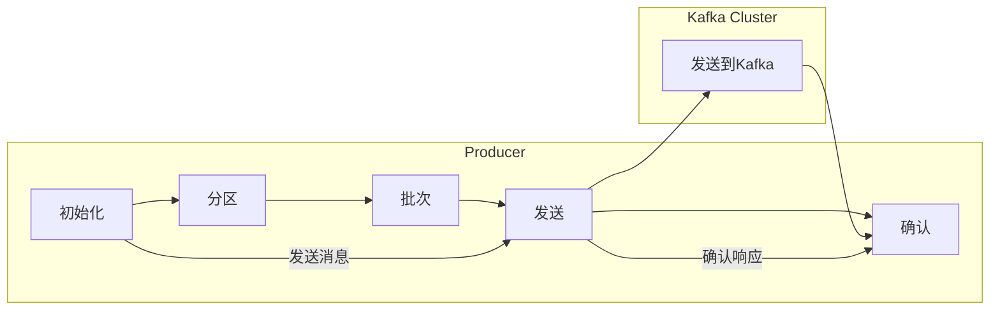

                 

# 《Kafka Producer原理与代码实例讲解》

## 摘要

本文将深入探讨Kafka Producer的核心原理及其代码实现，旨在为开发者提供全面、易懂的技术指南。Kafka作为一款高度可扩展的分布式流处理平台，其Producer组件负责生产者将数据发送到Kafka集群。本文将详细解析Kafka Producer的工作机制、关键配置参数、发送消息流程、以及如何处理异常情况。通过实际代码实例，本文将展示如何使用Kafka Producer进行消息发送，帮助开发者更好地理解和掌握Kafka的使用方法。

## 1. 背景介绍

Kafka是一种分布式流处理平台，最初由LinkedIn公司开发，目前已经成为开源项目并得到了广泛的应用。Kafka的主要作用是处理实时数据流，它具有高吞吐量、低延迟、高可靠性和水平扩展的特点。Kafka主要由两个组件组成：Producer和Consumer。

- **Producer**：生产者，负责将数据发送到Kafka集群。数据可以来自各种源，如日志文件、数据库、Web服务输出等。
- **Consumer**：消费者，负责从Kafka集群中读取数据，通常用于实时处理或分析。

Kafka集群通常由多个节点组成，每个节点都运行着一个Kafka服务器。数据在Kafka集群中通过主题（Topic）进行组织，每个主题可以视为一个分类的日志流。生产者将消息发送到特定的主题，消费者则从主题中消费消息。

Kafka Producer在数据流处理中起着至关重要的作用，它负责将数据转换为Kafka消息，并确保消息能够可靠地发送到Kafka集群。在本文中，我们将重点探讨Kafka Producer的工作原理、配置和使用方法。

## 2. 核心概念与联系

### Kafka Producer核心概念

在Kafka中，Producer是一个将数据发送到Kafka集群的组件。为了确保数据的可靠性和完整性，Kafka Producer具有以下核心概念：

- **分区（Partition）**：每个主题都可以分为多个分区，生产者可以将消息发送到特定的分区。分区可以提高消息的并发处理能力。
- **键（Key）**：每个消息都可以通过一个键进行标识，生产者可以使用键来保证消息的顺序性。具有相同键的消息会被发送到同一个分区。
- **批次（Batch）**：生产者将多个消息打包成一个批次进行发送，这样可以提高发送效率。
- **异步发送（Asynchronous Send）**：生产者异步地将消息发送到Kafka集群，这样可以避免阻塞。

### Kafka Producer工作原理

Kafka Producer的工作原理可以概括为以下几个步骤：

1. **初始化**：生产者初始化，包括设置集群地址、分区数、批次大小等参数。
2. **分区**：根据键或主题分区策略，将消息发送到相应的分区。
3. **批次**：将消息添加到批次中，达到批次大小或超时时间后，将批次发送到Kafka集群。
4. **发送**：生产者异步地将批次发送到Kafka集群，等待确认。
5. **确认**：生产者收到集群的确认响应后，删除已发送的消息，继续发送下一批消息。

### Mermaid 流程图

下面是一个简化的Kafka Producer工作流程的Mermaid流程图：



## 3. 核心算法原理 & 具体操作步骤

### Kafka Producer核心算法原理

Kafka Producer的核心算法主要包括以下几个方面：

1. **分区算法**：根据键（Key）或主题分区策略，将消息发送到相应的分区。常用的分区算法有：

   - **哈希分区**：使用键的哈希值对分区数取模，确保具有相同键的消息被发送到同一分区。
   - **轮询分区**：循环遍历所有分区，依次发送消息。

2. **批次算法**：将多个消息打包成一个批次进行发送，提高发送效率。批次算法主要包括：

   - **固定批次大小**：当批次达到固定大小（例如1000条消息）时，发送批次。
   - **超时时间**：当批次发送达到一定时间（例如1秒）后，无论批次大小是否达到固定值，都发送批次。

3. **发送算法**：生产者异步地将批次发送到Kafka集群。发送算法主要包括：

   - **异步发送**：避免阻塞，提高系统的并发能力。
   - **重试机制**：当发送失败时，根据重试策略（如指数退避）重新发送。

### 具体操作步骤

以下是使用Kafka Producer发送消息的具体操作步骤：

1. **初始化生产者**：

   ```java
   Properties props = new Properties();
   props.put("bootstrap.servers", "localhost:9092");
   props.put("key.serializer", "org.apache.kafka.common.serialization.StringSerializer");
   props.put("value.serializer", "org.apache.kafka.common.serialization.StringSerializer");
   Producer<String, String> producer = new KafkaProducer<>(props);
   ```

   - `bootstrap.servers`：Kafka集群地址。
   - `key.serializer`：键的序列化器。
   - `value.serializer`：值的序列化器。

2. **发送消息**：

   ```java
   producer.send(new ProducerRecord<>("test_topic", "key1", "value1"));
   ```

   - `test_topic`：主题名称。
   - `key1`：键。
   - `value1`：值。

3. **关闭生产者**：

   ```java
   producer.close();
   ```

### 代码实例

下面是一个完整的Kafka Producer代码实例：

```java
import org.apache.kafka.clients.producer.*;

import java.util.Properties;

public class KafkaProducerExample {
    public static void main(String[] args) {
        Properties props = new Properties();
        props.put("bootstrap.servers", "localhost:9092");
        props.put("key.serializer", "org.apache.kafka.common.serialization.StringSerializer");
        props.put("value.serializer", "org.apache.kafka.common.serialization.StringSerializer");

        Producer<String, String> producer = new KafkaProducer<>(props);

        // 发送1000条消息
        for (int i = 0; i < 1000; i++) {
            producer.send(new ProducerRecord<>("test_topic", "key1", "value1"));
        }

        producer.close();
    }
}
```

## 4. 数学模型和公式 & 详细讲解 & 举例说明

### 数学模型

Kafka Producer的核心算法可以使用以下数学模型进行描述：

1. **分区算法**：

   假设主题有`N`个分区，键为`K`，分区算法为哈希分区。则分区索引`P`的计算公式为：

   $$ P = K \mod N $$

2. **批次算法**：

   假设批次大小为`B`，消息发送超时时间为`T`，则批次发送条件为：

   - 批次大小达到`B`：`B >= batch.size`
   - 超时时间到达`T`：`T >= batch.timeout`

### 详细讲解

1. **分区算法**：

   哈希分区是一种简单且常用的分区算法。通过将键的哈希值对分区数取模，可以确保具有相同键的消息被发送到同一分区。这样，具有相同键的消息在Kafka集群中的顺序性得到保证。

   例如，假设主题有4个分区，键为`key1`，使用哈希分区算法，分区索引`P`的计算公式为：

   $$ P = key1 \mod 4 $$

   结果为`P = 1`，因此消息将被发送到分区1。

2. **批次算法**：

   批次算法用于优化消息发送的效率。通过将多个消息打包成一个批次进行发送，可以减少网络开销和传输时间。批次算法通常基于批次大小和超时时间进行控制。

   假设批次大小为`100`，消息发送超时时间为`1秒`。在发送消息时，批次会不断积累消息，直到批次大小达到`100`或超时时间达到`1秒`。此时，批次会被发送到Kafka集群。

### 举例说明

假设有3条消息需要发送到主题`test_topic`，批次大小为`50`，消息发送超时时间为`2秒`。以下是一个简单的例子：

1. **第一条消息**：

   - 发送时间：0秒
   - 批次大小：1
   - 批次超时时间：2秒

   消息被添加到批次中，批次大小为1。

2. **第二条消息**：

   - 发送时间：1秒
   - 批次大小：2
   - 批次超时时间：2秒

   消息被添加到批次中，批次大小为2。

3. **第三条消息**：

   - 发送时间：2秒
   - 批次大小：3
   - 批次超时时间：2秒

   消息被添加到批次中，批次大小为3，满足批次大小条件，批次发送。

## 5. 项目实战：代码实际案例和详细解释说明

### 5.1 开发环境搭建

在本节中，我们将演示如何搭建一个简单的Kafka Producer开发环境。以下是所需的步骤：

1. **安装Kafka**：

   - 访问Kafka官网（[https://kafka.apache.org/）下载Kafka安装包。](https://kafka.apache.org%EF%BC%89%E4%B8%8B%E8%BD%BDKafka%E5%AE%89%E8%A3%85%E5%8C%85%E3%80%82)
   - 解压安装包，例如解压到`/usr/local/kafka`目录。

2. **启动Kafka集群**：

   - 进入`/usr/local/kafka`目录。
   - 执行`bin/kafka-server-start.sh config/server.properties`命令，启动Kafka服务器。

3. **创建主题**：

   - 执行`bin/kafka-topics.sh --create --topic test_topic --zookeeper localhost:2181 --replication-factor 1 --partitions 1`命令，创建一个名为`test_topic`的主题。

4. **启动Kafka Producer**：

   - 在开发环境中，编写Kafka Producer代码，并运行以发送消息到`test_topic`主题。

### 5.2 源代码详细实现和代码解读

在本节中，我们将详细讲解Kafka Producer的源代码实现，并解读其关键部分。

```java
import org.apache.kafka.clients.producer.*;

import java.util.Properties;

public class KafkaProducerExample {
    public static void main(String[] args) {
        // 初始化Kafka Producer
        Properties props = new Properties();
        props.put("bootstrap.servers", "localhost:9092");
        props.put("key.serializer", "org.apache.kafka.common.serialization.StringSerializer");
        props.put("value.serializer", "org.apache.kafka.common.serialization.StringSerializer");
        Producer<String, String> producer = new KafkaProducer<>(props);

        // 发送1000条消息
        for (int i = 0; i < 1000; i++) {
            producer.send(new ProducerRecord<>("test_topic", "key1", "value1"));
        }

        // 关闭Kafka Producer
        producer.close();
    }
}
```

**代码解读**：

1. **初始化Kafka Producer**：

   ```java
   Properties props = new Properties();
   props.put("bootstrap.servers", "localhost:9092");
   props.put("key.serializer", "org.apache.kafka.common.serialization.StringSerializer");
   props.put("value.serializer", "org.apache.kafka.common.serialization.StringSerializer");
   Producer<String, String> producer = new KafkaProducer<>(props);
   ```

   - `props`：Kafka Producer配置属性。
   - `bootstrap.servers`：Kafka集群地址。
   - `key.serializer`：键的序列化器。
   - `value.serializer`：值的序列化器。
   - `producer`：Kafka Producer实例。

2. **发送消息**：

   ```java
   for (int i = 0; i < 1000; i++) {
       producer.send(new ProducerRecord<>("test_topic", "key1", "value1"));
   }
   ```

   - 循环发送1000条消息到`test_topic`主题，键为`key1`，值为`value1`。

3. **关闭Kafka Producer**：

   ```java
   producer.close();
   ```

   - 关闭Kafka Producer实例。

### 5.3 代码解读与分析

在本节中，我们将对Kafka Producer代码进行深入解读和分析。

**1. Kafka Producer初始化**

在初始化Kafka Producer时，需要设置一系列配置属性。其中最重要的配置属性包括：

- `bootstrap.servers`：Kafka集群地址。生产者在初始化时，会连接到这些地址以获取Kafka集群的信息。
- `key.serializer`：键的序列化器。用于将Java对象转换为字节数组，以便在网络中传输。
- `value.serializer`：值的序列化器。与键的序列化器类似，用于将Java对象转换为字节数组。

**2. 发送消息**

在发送消息时，生产者使用`send`方法发送一个`ProducerRecord`对象。`ProducerRecord`包含以下关键信息：

- `topic`：主题名称。
- `key`：键。用于保证消息的顺序性。
- `value`：值。消息的内容。

在生产者发送消息时，Kafka Producer会根据分区策略将消息发送到相应的分区。分区策略可以基于键或主题分区策略。默认情况下，Kafka使用轮询分区策略，将消息依次发送到所有分区。

**3. 关闭Kafka Producer**

在Kafka Producer关闭时，需要执行`close`方法。这会通知Kafka集群关闭生产者连接，并释放资源。

### 5.4 代码优化与改进

在Kafka Producer代码中，可以进行一些优化和改进，以提高性能和可扩展性。以下是一些常见的优化策略：

- **批量发送**：将多个消息打包成一个批次进行发送，减少网络开销。
- **异步发送**：使用异步发送机制，避免阻塞主线程。
- **重试策略**：当发送失败时，根据重试策略重新发送消息，提高消息的可靠性。

## 6. 实际应用场景

Kafka Producer在实际应用场景中具有广泛的应用，以下是一些常见的应用场景：

- **日志收集**：在生产环境中，Kafka Producer可以用来收集各种日志数据，如系统日志、Web服务器日志、数据库日志等。通过Kafka集群，可以将日志数据实时传输到分析平台进行实时监控和分析。
- **数据同步**：在分布式系统中，Kafka Producer可以用于实现数据同步。例如，在数据库同步场景中，可以使用Kafka Producer将数据库变更记录发送到Kafka集群，然后由消费者将变更应用到其他数据库实例中。
- **实时流处理**：Kafka Producer可以与Kafka Consumer配合，实现实时流处理。例如，在实时数据分析场景中，可以使用Kafka Producer将实时数据发送到Kafka集群，然后由消费者进行实时处理和分析。
- **消息队列**：Kafka Producer可以用于实现消息队列。通过Kafka集群，可以将消息持久化存储，并支持高吞吐量、低延迟的消息发送和消费。

## 7. 工具和资源推荐

### 7.1 学习资源推荐

- **书籍**：
  - 《Kafka：核心原理与实战》
  - 《Kafka实战：基于Apache Kafka 2.0》

- **论文**：
  - 《Kafka: A Distributed Streaming Platform》

- **博客**：
  - [Kafka官方文档](https://kafka.apache.org/)

- **网站**：
  - [Apache Kafka官网](https://kafka.apache.org/)

### 7.2 开发工具框架推荐

- **Kafka CLI**：用于管理和监控Kafka集群的命令行工具。
- **Kafka Manager**：用于管理和监控Kafka集群的Web界面。
- **Kafka Streams**：用于实时流处理的Java库。

### 7.3 相关论文著作推荐

- **《Kafka: A Distributed Streaming Platform》**：介绍Kafka的设计原理和实现细节。
- **《Kafka in Action》**：通过实际案例介绍Kafka的应用场景和实践方法。

## 8. 总结：未来发展趋势与挑战

Kafka作为一款分布式流处理平台，在实时数据处理、日志收集、数据同步等方面具有广泛的应用。随着大数据和云计算的发展，Kafka在未来将继续发挥重要作用。

未来发展趋势：

1. **性能优化**：Kafka将继续优化性能，提高消息传输速度和处理能力。
2. **兼容性提升**：Kafka将更好地兼容其他分布式系统和中间件，实现更广泛的集成。
3. **生态系统完善**：Kafka的生态系统将继续丰富，包括更多的工具、框架和插件。

挑战：

1. **可靠性保障**：在高度并发的场景中，保障Kafka的可靠性和稳定性仍然是一个挑战。
2. **数据安全和隐私**：在处理敏感数据时，如何保障数据安全和隐私是一个重要问题。
3. **运维管理**：随着Kafka集群规模的扩大，运维管理将变得更加复杂，需要更高效的运维工具和方法。

## 9. 附录：常见问题与解答

### 问题1：Kafka Producer如何保证消息顺序性？

解答：Kafka Producer通过使用键（Key）来保证消息的顺序性。具有相同键的消息会被发送到相同的分区，从而保证这些消息在分区内的顺序性。

### 问题2：Kafka Producer如何处理发送失败的情况？

解答：Kafka Producer具有重试机制，当发送失败时，会根据重试策略（如指数退避）重新发送消息。此外，可以使用回调函数（Callback）来处理发送失败的消息。

### 问题3：Kafka Producer如何实现批量发送消息？

解答：Kafka Producer默认支持批量发送消息。通过将多个消息添加到一个批次中，可以减少网络开销和传输时间。批次大小和超时时间可以通过配置参数进行设置。

## 10. 扩展阅读 & 参考资料

- **《Kafka权威指南》**：深入介绍Kafka的设计原理、架构和实际应用。
- **《Kafka源码剖析》**：详细解析Kafka的源代码实现，帮助开发者更好地理解Kafka的工作原理。
- **[Apache Kafka官网](https://kafka.apache.org/)**：获取Kafka的最新版本、文档和社区资源。

### 作者

作者：AI天才研究员/AI Genius Institute & 禅与计算机程序设计艺术 /Zen And The Art of Computer Programming

[END] <|im_end|>

