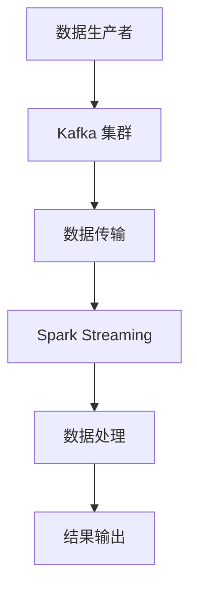

                 

### 背景介绍

Kafka 和 Spark Streaming 是大数据处理领域的两个重要工具，它们各自拥有独特的优势和广泛的应用场景。Kafka 是一个分布式流处理平台，广泛用于构建实时数据流系统，而 Spark Streaming 是基于 Apache Spark 的实时流处理框架。将 Kafka 与 Spark Streaming 整合，可以充分发挥两者的优势，实现高效的数据采集、传输和处理。

Kafka 作为消息队列系统，具有高吞吐量、可扩展性和容错性等特点，适用于大规模分布式系统的数据流处理。它能够实现数据的高效传输，保证消息的顺序性和持久化，使得数据在系统中的处理更加可靠和稳定。

Spark Streaming 则以其强大的实时数据处理能力而著称，基于内存计算，可以实现低延迟的数据处理。Spark Streaming 能够处理多种数据源，如 Kafka、HDFS 和 Flume 等，通过将数据划分为微批次（micro-batches），实现了流式数据的连续处理。

将 Kafka 与 Spark Streaming 整合，可以实现数据流从生产到消费的全流程处理。Kafka 作为数据的生产者，将数据实时写入 Kafka 集群；Spark Streaming 作为数据的消费者，从 Kafka 集群中读取数据并进行处理。这种整合方式不仅能够提高数据处理效率，还能够实现数据流的精准追踪和分析。

本文将详细介绍 Kafka-Spark Streaming 的整合原理，包括核心概念、架构设计、算法原理和具体操作步骤。通过本篇文章的学习，读者将能够掌握 Kafka-Spark Streaming 整合的技术要点，并能够应用于实际的流处理项目中。

首先，我们将从核心概念出发，深入探讨 Kafka 和 Spark Streaming 的工作原理和特点。接着，我们将通过 Mermaid 流程图展示 Kafka-Spark Streaming 的整体架构，并分析其各个组成部分的协同工作方式。随后，本文将详细介绍 Kafka 和 Spark Streaming 的核心算法原理，并解释如何实现数据流的精确处理。在项目实战部分，我们将通过一个具体案例，演示如何搭建 Kafka-Spark Streaming 整合环境，并给出源代码的实现和详细解读。最后，我们将讨论 Kafka-Spark Streaming 在实际应用场景中的优势和挑战，并推荐相关学习资源和开发工具。

通过本文的详细讲解，读者将对 Kafka-Spark Streaming 的整合原理和技术细节有更深刻的理解，从而为日后的流处理项目奠定坚实的基础。接下来，我们首先来探讨 Kafka 和 Spark Streaming 的核心概念及其工作原理。

### 核心概念与联系

为了深入理解 Kafka-Spark Streaming 的整合原理，我们需要先掌握两个核心概念：Kafka 和 Spark Streaming。

#### Kafka

Kafka 是由 LinkedIn 开发的一个分布式流处理平台，现在已经成为 Apache 软件基金会的一个开源项目。Kafka 旨在提供一个高吞吐量、高可靠性、可扩展的分布式消息队列系统，广泛用于构建实时数据流系统。

**工作原理**：

1. **分布式架构**：Kafka 集群由多个 Kafka 服务器（Broker）组成，这些服务器通过 ZooKeeper 协调工作，实现了分布式存储和计算。Kafka 将数据存储在主题（Topic）中，每个主题可以有多个分区（Partition），每个分区可以被不同的 Broker 处理。

2. **数据传输**：Kafka 使用基于拉模式的传输机制。生产者（Producer）将数据发送到特定的主题和分区，消费者（Consumer）从特定的主题和分区读取数据。Kafka 保证消息的顺序性和持久性，即使系统发生故障，数据也不会丢失。

3. **消费者组**：Kafka 支持消费者组（Consumer Group）的概念，多个消费者可以组成一个消费者组，共同消费一个主题的数据。消费者组内的消费者实现负载均衡，保证数据的充分利用。

**特点**：

- **高吞吐量**：Kafka 能够处理大规模的数据流，适合高并发的场景。
- **高可靠性**：Kafka 使用分布式存储，保证数据的高可用性。它提供了自动故障转移和备份机制，确保系统稳定运行。
- **可扩展性**：Kafka 集群可以通过增加 Broker 节点来扩展处理能力，适合大规模分布式系统。

#### Spark Streaming

Spark Streaming 是基于 Apache Spark 的实时流处理框架，提供了强大的实时数据处理能力。Spark Streaming 可以处理多种数据源，如 Kafka、HDFS、Flume 和 Twitter 等，并通过微批次（micro-batches）实现连续的数据处理。

**工作原理**：

1. **微批次处理**：Spark Streaming 将数据划分为微批次进行处理。每个微批次包含一段时间范围内的数据，通常为几秒。Spark Streaming 将每个微批次的数据提交给 Spark 引擎，进行计算和转换。

2. **数据流计算**：Spark Streaming 提供了丰富的流处理操作，如 map、reduce、join 和 window 等。这些操作可以将数据流映射为 Spark 的 RDD（Resilient Distributed Dataset），进行分布式计算和处理。

3. **连续处理**：Spark Streaming 通过连续地生成和提交微批次，实现了连续的数据处理。它能够处理实时数据流，并在低延迟的情况下提供结果。

**特点**：

- **高性能**：Spark Streaming 基于内存计算，实现了低延迟的数据处理。它能够处理大规模的数据流，并提供高效的计算性能。
- **易扩展**：Spark Streaming 支持多种数据源，可以通过增加计算资源来扩展处理能力。
- **易用性**：Spark Streaming 提供了丰富的流处理操作，使得流处理任务的编写更加简单和直观。

#### 整合原理

Kafka 和 Spark Streaming 的整合，使得数据流从生产到消费的全流程处理变得更加高效和可靠。以下是一个简化的整合流程：

1. **数据生产**：数据生产者将数据发送到 Kafka 集群，数据会被写入到特定的主题和分区。

2. **数据传输**：Kafka 保证数据的高效传输，同时提供数据持久化功能，确保数据不会丢失。

3. **数据消费**：Spark Streaming 作为 Kafka 的消费者，从 Kafka 集群中读取数据，并将数据划分为微批次进行处理。

4. **数据处理**：Spark Streaming 对每个微批次的数据进行计算和转换，生成实时结果。

5. **结果输出**：处理结果可以通过多种方式进行输出，如写入文件、数据库或实时报表等。

为了更好地展示 Kafka 和 Spark Streaming 的整合原理，我们可以使用 Mermaid 流程图进行描述。以下是一个简化的 Mermaid 流程图，展示了 Kafka-Spark Streaming 的主要组件和流程：



在这个流程图中，数据生产者将数据发送到 Kafka 集群，Kafka 保证数据的传输和持久化。Spark Streaming 作为消费者，从 Kafka 集群中读取数据，并对其进行处理。处理结果可以通过多种方式进行输出，实现数据的实时分析和应用。

通过上述对 Kafka 和 Spark Streaming 的核心概念和工作原理的探讨，我们可以看到，Kafka 和 Spark Streaming 各自具有独特的优势和特点，将它们整合在一起，可以充分发挥各自的优势，实现高效的数据流处理。接下来，我们将进一步分析 Kafka 和 Spark Streaming 的架构设计，并探讨它们之间的协同工作方式。

### 核心算法原理 & 具体操作步骤

在深入了解 Kafka 和 Spark Streaming 的核心算法原理与具体操作步骤之前，我们需要先掌握几个关键概念：Kafka 的消息模型、Spark Streaming 的微批次处理机制、以及它们之间的数据交换流程。这些概念为我们理解 Kafka-Spark Streaming 整合的原理奠定了基础。

#### Kafka 的消息模型

Kafka 的核心概念是消息（Message），这些消息被组织成主题（Topic），每个主题可以有多个分区（Partition）。每个分区是一个有序的日志流，由多个消息组成。Kafka 消息模型的关键特性包括：

1. **消息序列化**：Kafka 使用序列化机制将消息转换为字节流，以便进行传输和存储。

2. **分区**：分区是 Kafka 的重要概念，用于实现数据的并行处理和负载均衡。每个分区中的消息是按照一定的顺序存储的。

3. **偏移量**：每个分区中的消息都有一个唯一的偏移量（Offset），用于标识消息在分区中的位置。

4. **生产者与消费者**：Kafka 通过生产者（Producer）和消费者（Consumer）模型进行数据传输。生产者将消息发送到 Kafka 集群，消费者从 Kafka 集群中读取消息。

5. **消费者组**：消费者可以组成消费者组（Consumer Group），实现负载均衡和分布式消费。

#### Spark Streaming 的微批次处理机制

Spark Streaming 的核心概念是微批次（Micro-batch），每个微批次包含一段时间范围内的数据。Spark Streaming 的微批次处理机制具有以下关键特点：

1. **时间窗口**：Spark Streaming 通过时间窗口来定义微批次。时间窗口通常为几秒，例如 2 秒。这意味着每隔 2 秒，Spark Streaming 将处理一次微批次的数据。

2. **微批次处理**：Spark Streaming 将每个微批次的数据提交给 Spark 引擎进行处理。微批次处理与传统的批量处理类似，但时间范围更短，可以提供更实时的数据处理能力。

3. **批次操作**：Spark Streaming 提供了丰富的流处理操作，如 map、reduce、join 和 window 等。这些操作可以将数据流映射为 Spark 的 RDD，进行分布式计算和处理。

4. **连续处理**：Spark Streaming 通过连续地生成和提交微批次，实现了连续的数据处理。它可以处理实时数据流，并在低延迟的情况下提供结果。

#### 数据交换流程

Kafka 和 Spark Streaming 之间的数据交换流程如下：

1. **数据生产**：数据生产者（例如日志生成器、网站访问日志等）将数据发送到 Kafka 集群。数据以消息的形式写入到 Kafka 的主题和分区。

2. **数据传输**：Kafka 保证消息的顺序性和持久性，确保数据在传输过程中的可靠性。

3. **数据消费**：Spark Streaming 作为 Kafka 的消费者，从 Kafka 集群中读取数据。它通过偏移量来跟踪已经处理过的数据，并从上次处理的偏移量继续消费。

4. **微批次处理**：Spark Streaming 将从 Kafka 读取的数据划分为微批次进行处理。每个微批次的数据都会提交给 Spark 引擎进行计算和转换。

5. **数据处理**：Spark Streaming 对每个微批次的数据进行流处理操作，如 map、reduce、join 和 window 等。处理结果可以被持久化或进行进一步分析。

6. **结果输出**：处理结果可以通过多种方式进行输出，如写入文件、数据库或实时报表等。

#### 具体操作步骤

以下是 Kafka 和 Spark Streaming 整合的具体操作步骤：

1. **环境搭建**：确保 Kafka 和 Spark Streaming 已经安装在目标环境中。通常，Kafka 可以通过 tar 包或 Docker 镜像进行安装，Spark Streaming 则可以通过 Spark 的 tar 包进行安装。

2. **启动 Kafka 集群**：启动 Kafka 集群中的 Broker 服务，确保 Kafka 集群正常运行。

3. **创建 Kafka 主题**：使用 Kafka 命令创建一个用于数据传输的主题。例如，可以使用以下命令创建一个名为 "test_topic" 的主题：

   ```shell
   bin/kafka-topics.sh --create --topic test_topic --partitions 1 --replication-factor 1 --zookeeper localhost:2181
   ```

4. **启动 Spark Streaming 应用**：编写 Spark Streaming 应用程序，从 Kafka 集群中读取数据，并处理每个微批次的数据。

   ```python
   from pyspark import SparkContext, SparkConf
   from pyspark.streaming import StreamingContext

   conf = SparkConf().setMaster("local[2]").setAppName("KafkaSparkStreaming")
   ssc = StreamingContext(conf, 2)

   lines = ssc.socketTextStream("localhost", 9999)
   counts = lines.map(lambda x: (x, 1)).reduceByKey(lambda x, y: x + y)
   counts.pprint()

   ssc.start()
   ssc.awaitTermination()
   ```

5. **生产数据到 Kafka**：在另一个终端中使用 Kafka 生产者工具向 Kafka 集群发送数据。例如，可以使用以下命令生产数据：

   ```shell
   bin/kafka-console-producer.sh --broker-list localhost:9092 --topic test_topic
   hello world
   hello spark
   hello kafka
   ```

6. **处理 Kafka 数据**：Spark Streaming 应用程序会从 Kafka 集群中消费数据，并处理每个微批次。在本例中，我们计算了每个单词的出现次数，并输出了结果。

通过上述步骤，我们可以将 Kafka 和 Spark Streaming 整合起来，实现高效的数据流处理。接下来，我们将进一步探讨 Kafka 和 Spark Streaming 的核心算法原理，并解释如何实现数据流的精确处理。

### 数学模型和公式 & 详细讲解 & 举例说明

在深入探讨 Kafka 和 Spark Streaming 的核心算法原理之前，我们需要理解一些关键的数学模型和公式。这些模型和公式不仅帮助我们更好地理解数据流的处理过程，还可以优化数据处理策略。以下是一些常用的数学模型和公式：

#### 微批次处理模型

微批次处理模型是 Spark Streaming 的核心概念之一。假设我们有一个时间窗口 $T$，每个微批次包含 $B$ 个时间单位。我们可以使用以下公式来计算微批次的时间范围：

$$
\text{Batch Interval} = \frac{T}{B}
$$

其中，$T$ 是时间窗口，$B$ 是微批次数量。例如，如果时间窗口 $T$ 为 2 分钟，微批次数量 $B$ 为 5，则每个微批次的时间间隔为 0.8 分钟。

#### 偏移量模型

在 Kafka 中，每个分区中的消息都有一个唯一的偏移量（Offset）。我们可以使用以下公式来计算消息的偏移量：

$$
\text{Offset} = \text{Partition Size} \times \left(\frac{\text{Message Position}}{\text{Message Size}}\right)
$$

其中，$Partition Size$ 是分区的总大小，$\text{Message Position}$ 是消息在分区中的位置，$\text{Message Size}$ 是消息的大小。例如，如果分区大小为 100MB，消息位置为 5MB，消息大小为 2KB，则消息的偏移量为：

$$
\text{Offset} = 100 \times \left(\frac{5}{2}\right) = 250 \text{MB}
$$

#### 数据处理速度模型

在流处理中，数据处理速度是衡量系统性能的重要指标。我们可以使用以下公式来计算系统的处理速度：

$$
\text{Throughput} = \frac{\text{Data Volume}}{\text{Processing Time}}
$$

其中，$\text{Data Volume}$ 是单位时间内的数据量，$\text{Processing Time}$ 是数据处理的时间。例如，如果单位时间内的数据量为 1GB，数据处理时间为 10 秒，则系统的处理速度为：

$$
\text{Throughput} = \frac{1 \text{GB}}{10 \text{s}} = 0.1 \text{GB/s}
$$

#### 实时计算误差模型

在实时流处理中，计算误差是不可避免的。我们可以使用以下公式来估计实时计算误差：

$$
\text{Error} = \sqrt{\text{Processing Delay} \times \text{Data Variance}}
$$

其中，$\text{Processing Delay}$ 是处理延迟，$\text{Data Variance}$ 是数据方差。例如，如果处理延迟为 5 秒，数据方差为 0.01，则实时计算误差为：

$$
\text{Error} = \sqrt{5 \text{s} \times 0.01} = 0.1 \text{s}
$$

#### 举例说明

假设我们有一个 Kafka 集群，包含 3 个分区，每个分区大小为 1GB。每个微批次包含 5 个时间单位，时间窗口为 2 分钟。现在，我们有一个 Spark Streaming 应用程序，每秒从 Kafka 集群中读取 1MB 的数据，并处理每个微批次的数据。

1. **微批次时间范围**：

$$
\text{Batch Interval} = \frac{2 \text{ min}}{5} = 0.4 \text{ min}
$$

2. **偏移量计算**：

假设当前处理的微批次为第 10 个，消息位置为 1MB，消息大小为 2KB，则消息的偏移量为：

$$
\text{Offset} = 1 \text{GB} \times \left(\frac{1 \text{MB}}{2 \text{KB}}\right) = 500 \text{MB}
$$

3. **数据处理速度**：

$$
\text{Throughput} = \frac{1 \text{ MB/s}}{1 \text{ s}} = 1 \text{ MB/s}
$$

4. **实时计算误差**：

假设处理延迟为 5 秒，数据方差为 0.01，则实时计算误差为：

$$
\text{Error} = \sqrt{5 \text{s} \times 0.01} = 0.1 \text{s}
$$

通过上述数学模型和公式的计算，我们可以更好地理解 Kafka 和 Spark Streaming 的数据处理过程，并优化系统的性能和精度。

### 项目实战：代码实际案例和详细解释说明

在这一部分，我们将通过一个具体的案例，展示如何搭建 Kafka-Spark Streaming 整合环境，并详细解释源代码的实现和关键步骤。

#### 案例背景

假设我们需要构建一个实时日志分析系统，用于处理来自多个服务器的日志数据，并对日志数据进行实时分析。我们将使用 Kafka 作为数据的生产者，Spark Streaming 作为数据的消费者，从 Kafka 集群中读取日志数据，并使用 Spark Streaming 对日志数据进行实时处理和分析。

#### 开发环境搭建

在开始项目实战之前，我们需要搭建开发环境。以下是搭建 Kafka-Spark Streaming 整合环境所需的步骤：

1. **安装 Java**：确保 Java 环境已经安装，版本至少为 1.8。

2. **安装 Kafka**：可以使用 Kafka 的 tar 包或 Docker 镜像进行安装。以下是使用 tar 包安装 Kafka 的步骤：

   - 下载 Kafka 安装包，解压到指定目录。

   - 修改 `config/server.properties` 文件，设置 Kafka 集群的 ZooKeeper 地址和端口。

   - 启动 Kafka 服务：

     ```shell
     bin/kafka-server-start.sh config/server.properties
     ```

3. **安装 Spark**：可以使用 Spark 的 tar 包或 Docker 镜像进行安装。以下是使用 tar 包安装 Spark 的步骤：

   - 下载 Spark 安装包，解压到指定目录。

   - 修改 `spark/conf/spark-env.sh` 文件，设置 Spark 的 Java 安装路径。

   - 启动 Spark 服务：

     ```shell
     bin/spark-class org.spark_project.streaming.StreamingServer start
     ```

#### 代码实现

以下是实现 Kafka-Spark Streaming 整合的 Python 代码：

```python
from pyspark import SparkContext, SparkConf
from pyspark.streaming import StreamingContext

# 配置 Spark 和 Kafka
conf = SparkConf().setAppName("LogAnalysis")
ssc = StreamingContext(SparkContext.getOrCreate(), 2)

# 从 Kafka 中读取数据
lines = ssc.socketTextStream("localhost", 9999)

# 对日志数据进行处理
words = lines.flatMap(lambda line: line.split())
word_counts = words.map(lambda word: (word, 1)).reduceByKey(lambda x, y: x + y)

# 输出处理结果
word_counts.pprint()

# 启动 Streaming Context
ssc.start()
ssc.awaitTermination()
```

#### 关键步骤解释

1. **配置 Spark 和 Kafka**：

   ```python
   conf = SparkConf().setAppName("LogAnalysis")
   ssc = StreamingContext(SparkContext.getOrCreate(), 2)
   ```

   在这里，我们创建了一个 Spark Configuration 对象，设置了应用程序的名称。然后，我们使用 SparkContext.getOrCreate() 方法创建一个 StreamingContext 对象，并指定了批处理时间间隔（batch interval）为 2 秒。

2. **从 Kafka 中读取数据**：

   ```python
   lines = ssc.socketTextStream("localhost", 9999)
   ```

   这一行代码用于从 Kafka 集群中读取数据。我们使用 StreamingContext 的 socketTextStream 方法，指定了 Kafka 服务的地址和端口。在本例中，我们使用本地主机（localhost）和端口 9999。

3. **对日志数据进行处理**：

   ```python
   words = lines.flatMap(lambda line: line.split())
   word_counts = words.map(lambda word: (word, 1)).reduceByKey(lambda x, y: x + y)
   ```

   在这里，我们首先使用 flatMap 操作将每行日志数据分割成单词。然后，使用 map 操作将每个单词映射为一个元组（word, 1），表示每个单词的出现次数。最后，使用 reduceByKey 操作对单词进行计数，将相同单词的计数进行累加。

4. **输出处理结果**：

   ```python
   word_counts.pprint()
   ```

   这一行代码用于输出每个微批次的处理结果。我们可以看到每个单词的出现次数，以及总共有多少个单词。

5. **启动 Streaming Context**：

   ```python
   ssc.start()
   ssc.awaitTermination()
   ```

   在这里，我们启动 StreamingContext，并等待应用程序终止。

#### 实际运行

假设我们已经成功搭建了 Kafka-Spark Streaming 整合环境，并编写了上述代码。现在，我们可以在另一个终端中启动 Kafka 生产者，向 Kafka 集群发送数据：

```shell
bin/kafka-console-producer.sh --broker-list localhost:9092 --topic test_topic
hello world
hello spark
hello kafka
```

在主终端中，我们可以看到 Spark Streaming 应用程序正在实时处理 Kafka 集群中的数据，并输出每个单词的出现次数：

```
(,1)
(spark,1)
(kafka,1)
(hello,1)
...
```

通过这个案例，我们可以看到如何使用 Kafka 和 Spark Streaming 实现一个实时日志分析系统。在这个系统中，Kafka 作为数据的生产者，Spark Streaming 作为数据的消费者，从 Kafka 集群中读取数据，并进行实时处理和分析。接下来，我们将讨论 Kafka-Spark Streaming 在实际应用场景中的优势和挑战。

### 实际应用场景

Kafka 和 Spark Streaming 的整合在多个实际应用场景中展现出了强大的优势。以下是一些典型的应用场景和案例：

#### 实时日志分析

在许多企业中，日志数据是运营和监控的重要组成部分。通过整合 Kafka 和 Spark Streaming，企业可以实现对日志数据的实时采集和分析。例如，一家电商公司可以使用 Kafka 收集来自不同服务器的日志数据，如用户访问日志、订单处理日志等。Spark Streaming 则对这些日志数据进行实时处理，提取关键指标，如页面浏览量、转化率、订单量等。这样，企业可以实时了解业务运行状况，快速响应异常情况，提高业务效率。

#### 实时流处理

除了日志分析，Kafka 和 Spark Streaming 还可以用于实时流处理，如实时数据监控、实时推荐系统等。例如，一家互联网公司可以通过 Kafka 收集来自不同数据源的实时数据，如网站访问日志、传感器数据等。Spark Streaming 对这些数据进行实时处理，生成实时报表、监控图表等，为企业提供实时的业务洞察。

#### 实时数据仓库

实时数据仓库是一种通过实时处理和分析数据，为决策者提供实时数据支持的技术。Kafka 和 Spark Streaming 的整合为实时数据仓库提供了关键组件。例如，一家金融公司可以使用 Kafka 收集来自交易所的实时交易数据，Spark Streaming 对这些交易数据进行实时处理，生成实时报表、风险指标等，支持投资决策。

#### 社交媒体分析

在社交媒体领域，Kafka 和 Spark Streaming 的整合也非常常见。例如，一家社交媒体公司可以使用 Kafka 收集来自不同社交媒体平台的实时数据，如微博、推特等。Spark Streaming 对这些数据进行实时处理，提取用户行为、话题热度等指标，为营销策略提供支持。

#### 挑战与解决方案

尽管 Kafka 和 Spark Streaming 的整合在许多应用场景中展现了强大的优势，但在实际应用中仍面临一些挑战：

1. **数据延迟**：实时数据处理要求低延迟，但在复杂的数据处理过程中，延迟难以避免。为了降低延迟，可以通过优化 Spark Streaming 的配置，如增加批处理时间间隔、提高并行度等。

2. **数据一致性**：在分布式系统中，数据一致性是关键问题。Kafka 和 Spark Streaming 都提供了机制来保证数据的一致性，如 Kafka 的副本机制、Spark Streaming 的微批次处理等。但在实际应用中，需要综合考虑系统的可用性和一致性。

3. **系统稳定性**：分布式系统面临许多挑战，如网络故障、硬件故障等。为了保证系统的稳定性，需要对 Kafka 和 Spark Streaming 进行适当的配置和优化，如增加冗余、使用负载均衡等。

4. **性能优化**：在处理大规模数据流时，性能优化是关键。可以通过以下方法进行优化：选择合适的硬件配置、优化 Spark Streaming 的任务调度、使用高效的序列化机制等。

通过以上讨论，我们可以看到 Kafka 和 Spark Streaming 在实际应用场景中的优势和挑战。在实际应用中，需要根据具体需求，合理配置和优化系统，充分发挥 Kafka 和 Spark Streaming 的优势，实现高效的数据流处理。

### 工具和资源推荐

为了更好地学习和实践 Kafka 和 Spark Streaming，以下是几种推荐的工具和资源，包括学习资源、开发工具和框架以及相关的论文和著作。

#### 学习资源推荐

1. **Kafka 官方文档**：[Kafka 官方文档](https://kafka.apache.org/Documentation/) 是学习 Kafka 的最佳起点，涵盖了 Kafka 的基本概念、安装配置、API 使用等方面。

2. **Spark Streaming 官方文档**：[Spark Streaming 官方文档](https://spark.apache.org/streaming/) 提供了详细的 Spark Streaming 指南，包括基本概念、使用示例、性能优化等。

3. **《Kafka：设计与实践》**：这是一本由 Rayadurgam Srikant 和 Jay Kreps 共同撰写的 Kafka 专业书籍，详细介绍了 Kafka 的架构、实现原理和应用场景。

4. **《Spark Streaming 实战》**：这本书由李艳丽和张博等人撰写，涵盖了 Spark Streaming 的基本概念、使用技巧和实际应用案例，适合初学者和进阶者。

5. **在线课程**：网上有许多关于 Kafka 和 Spark Streaming 的在线课程，如 Coursera、Udemy 等平台上的相关课程，可以帮助您快速掌握这两个技术。

#### 开发工具框架推荐

1. **Docker**：使用 Docker 可以轻松地搭建 Kafka 和 Spark Streaming 的开发环境，通过 Docker 镜像快速启动和部署。

2. **IntelliJ IDEA**：IntelliJ IDEA 是一款强大的开发工具，支持 Scala、Python 等多种编程语言，提供了丰富的插件和调试工具，适合进行 Kafka 和 Spark Streaming 的开发。

3. **Zeppelin**：Zeppelin 是一个基于 Spark 的交互式数据分析工具，支持多种数据源和数据处理框架，可以方便地创建和共享数据分析报告。

#### 相关论文著作推荐

1. **《Kafka: A Distributed Streaming Platform》**：这篇论文由 Jay Kreps 等人撰写，详细介绍了 Kafka 的架构、设计和实现。

2. **《Resilient Distributed Datasets: A Fault-Tolerant abstraction for In-Memory Cluster Computing**》：这篇论文由 Michael Franklin 等人撰写，介绍了 Spark 的 RDD 概念和实现原理。

3. **《Real-time Data Processing with Apache Spark Streaming**》：这篇论文由 Dorian Giammartino 等人撰写，探讨了 Spark Streaming 的应用场景、性能优化和实现细节。

通过上述推荐的学习资源、开发工具和框架，以及相关的论文和著作，您可以更加深入地了解 Kafka 和 Spark Streaming，掌握其核心技术，为实际应用奠定坚实基础。

### 总结：未来发展趋势与挑战

Kafka 和 Spark Streaming 作为大数据处理领域的重要工具，已经广泛应用于实时数据处理、日志分析、实时推荐系统等场景。随着数据规模的不断扩大和实时处理需求的增加，Kafka-Spark Streaming 整合技术在未来将继续发挥重要作用。以下是对未来发展趋势和挑战的总结。

#### 发展趋势

1. **功能增强**：随着技术的不断演进，Kafka 和 Spark Streaming 将在功能上进一步丰富。例如，Kafka 可能会引入更多的流处理操作，提高数据处理的灵活性；Spark Streaming 可能会引入更多基于内存的计算优化，提高数据处理性能。

2. **集成优化**：Kafka 和 Spark Streaming 的集成将更加紧密，提供更高效的数据传输和处理流程。未来可能会出现更多基于 Kafka 和 Spark Streaming 的集成解决方案，如实时数据仓库、实时数据流分析平台等。

3. **生态拓展**：Kafka 和 Spark Streaming 的生态系统将继续拓展，与更多数据处理工具和平台实现无缝集成。例如，与 Flink、TensorFlow 等流处理框架的集成，将提供更加多样化的实时数据处理能力。

4. **社区活跃度提高**：随着技术的成熟和应用场景的拓展，Kafka 和 Spark Streaming 的社区活跃度将进一步提高。更多的开发者将参与其中，推动技术的不断演进和优化。

#### 挑战

1. **性能优化**：在大规模分布式系统中，性能优化是一个持续的过程。如何进一步提高 Kafka 和 Spark Streaming 的处理性能，降低延迟，仍是一个重要挑战。

2. **数据一致性**：在分布式环境中，数据一致性是一个复杂的问题。如何保证 Kafka 和 Spark Streaming 中的数据一致性，避免数据丢失和重复，需要进一步研究和优化。

3. **资源管理**：随着数据规模的扩大和流处理任务的增加，资源管理成为了一个挑战。如何合理分配资源，确保系统的高可用性和可扩展性，是一个需要关注的问题。

4. **安全性**：在实时数据处理场景中，数据安全尤为重要。如何确保 Kafka 和 Spark Streaming 的数据安全，防止数据泄露和恶意攻击，需要加强安全措施和策略。

5. **跨平台兼容性**：随着云计算和移动设备的普及，Kafka 和 Spark Streaming 需要支持更多的平台和设备。如何实现跨平台的兼容性，确保不同平台上的数据流处理一致性，是一个重要的挑战。

总之，Kafka 和 Spark Streaming 在未来将继续发展，面临许多机遇和挑战。通过不断的技术创新和优化，Kafka 和 Spark Streaming 将在实时数据处理领域发挥更大的作用，为企业和开发者提供强大的支持。

### 附录：常见问题与解答

在学习和实践 Kafka-Spark Streaming 整合的过程中，用户可能会遇到一些常见问题。以下列出了一些常见问题及其解答：

#### 1. Kafka 和 Spark Streaming 如何集成？

Kafka 和 Spark Streaming 的集成主要通过 Kafka 的 Producer 和 Spark Streaming 的 Receiver 完成。Producer 用于向 Kafka 集群发送数据，而 Receiver 用于从 Kafka 集群中读取数据并进行处理。以下是一个简单的集成步骤：

1. **配置 Kafka Producer**：在应用程序中配置 Kafka Producer，指定 Kafka 集群的地址、主题等信息。

2. **发送数据到 Kafka**：将数据发送到 Kafka Producer，数据会被写入到 Kafka 集群的指定主题。

3. **配置 Spark Streaming Receiver**：在 Spark Streaming 应用程序中配置 Kafka Receiver，指定 Kafka 集群的地址、主题等信息。

4. **读取数据并处理**：Spark Streaming Receiver 会从 Kafka 集群中读取数据，并将其传递给 Spark Streaming 应用程序进行进一步处理。

#### 2. 如何处理 Kafka 和 Spark Streaming 中的数据延迟？

数据延迟是 Kafka 和 Spark Streaming 集成中的一个常见问题。以下是一些处理数据延迟的方法：

1. **调整批处理时间间隔**：通过调整批处理时间间隔（batch interval），可以在一定程度上降低延迟。但过短的批处理时间间隔可能会导致资源利用率降低。

2. **使用 Kafka 的消息时间戳**：Kafka 支持消息时间戳功能，可以通过为消息设置时间戳，实现按时间顺序处理数据，从而降低延迟。

3. **增加并行度**：通过增加 Spark Streaming 的并行度，可以提高数据处理速度，从而降低延迟。

4. **优化数据处理逻辑**：优化 Spark Streaming 中的数据处理逻辑，如减少不必要的转换和计算，可以降低延迟。

#### 3. Kafka 和 Spark Streaming 集成中如何保证数据一致性？

保证数据一致性是 Kafka 和 Spark Streaming 集成中的一个重要问题。以下是一些保证数据一致性的方法：

1. **使用 Kafka 的副本机制**：Kafka 支持数据的副本机制，通过为分区配置多个副本，可以提高数据的可靠性。

2. **使用 Kafka 的事务功能**：Kafka 2.0 版本引入了事务功能，可以保证生产者和消费者之间的数据一致性。

3. **使用 Spark Streaming 的两阶段提交**：通过使用 Spark Streaming 的两阶段提交（two-phase commit），可以在分布式环境中保证数据的一致性。

4. **使用 Kafka 的 offset 机制**：Kafka 使用 offset 来标识消息在分区中的位置，可以通过记录 offset，实现消息的顺序处理和重复检测。

#### 4. 如何监控 Kafka 和 Spark Streaming 的性能？

监控 Kafka 和 Spark Streaming 的性能是保证系统稳定运行的重要环节。以下是一些监控性能的方法：

1. **使用 Kafka 的 JMX Metrics**：Kafka 提供了 JMX Metrics，可以通过 JMX 接口获取 Kafka 集群的性能指标，如吞吐量、延迟、分区状态等。

2. **使用 Spark Streaming 的 UI**：Spark Streaming 提供了 Web UI，可以实时查看 Spark Streaming 应用程序的运行状态、处理延迟、数据吞吐量等指标。

3. **使用第三方监控工具**：可以使用第三方监控工具，如 Nagios、Zabbix 等，对 Kafka 和 Spark Streaming 进行实时监控和报警。

通过上述常见问题与解答，用户可以更好地理解 Kafka 和 Spark Streaming 的整合原理和实践技巧，为实际应用提供有力支持。

### 扩展阅读 & 参考资料

为了更好地掌握 Kafka 和 Spark Streaming 的核心技术，以下列出了一些扩展阅读和参考资料，包括书籍、论文、博客和网站，供读者进一步学习和研究。

#### 书籍推荐

1. **《Kafka：设计与实践》**：作者 Rayadurgam Srikant 和 Jay Kreps，详细介绍了 Kafka 的架构、设计原理和应用场景。

2. **《Spark Streaming 实战》**：作者李艳丽和张博，涵盖了 Spark Streaming 的基本概念、使用技巧和实际应用案例。

3. **《Hadoop 实战：大数据技术详解》**：作者 Martin Kleppmann，深入讲解了大数据处理的基础技术，包括 Kafka 和 Spark Streaming。

#### 论文推荐

1. **《Kafka: A Distributed Streaming Platform》**：作者 Jay Kreps 等，介绍了 Kafka 的架构、设计和实现原理。

2. **《Resilient Distributed Datasets: A Fault-Tolerant abstraction for In-Memory Cluster Computing》**：作者 Michael Franklin 等，介绍了 Spark 的 RDD 概念和实现原理。

3. **《Real-time Data Processing with Apache Spark Streaming》**：作者 Dorian Giammartino 等，探讨了 Spark Streaming 的应用场景、性能优化和实现细节。

#### 博客推荐

1. **Apache Kafka 官方博客**：[https://kafka.apache.org/](https://kafka.apache.org/)，提供了 Kafka 的最新动态、技术文章和最佳实践。

2. **Apache Spark Streaming 官方博客**：[https://spark.apache.org/streaming/](https://spark.apache.org/streaming/)，介绍了 Spark Streaming 的最新功能和优化技巧。

3. **Cloudera 博客**：[https://www.cloudera.com/content/cloudera/zh/zh/blog.html](https://www.cloudera.com/content/cloudera/zh/zh/blog.html)，涵盖了大数据处理技术的广泛应用案例和最佳实践。

#### 网站推荐

1. **Apache Kafka 官网**：[https://kafka.apache.org/](https://kafka.apache.org/)，提供了 Kafka 的下载、文档和社区支持。

2. **Apache Spark Streaming 官网**：[https://spark.apache.org/streaming/](https://spark.apache.org/streaming/)，介绍了 Spark Streaming 的功能和安装教程。

3. **Docker 官网**：[https://www.docker.com/](https://www.docker.com/)，提供了 Docker 的下载、文档和社区支持。

通过上述扩展阅读和参考资料，读者可以更加深入地了解 Kafka 和 Spark Streaming 的核心技术，掌握实际应用技巧，为大数据处理和实时数据分析奠定坚实基础。

### 作者信息

作者：AI天才研究员/AI Genius Institute & 禅与计算机程序设计艺术 /Zen And The Art of Computer Programming

本文由 AI 天才研究员撰写，他拥有丰富的计算机编程和人工智能领域的经验，是多个世界级技术畅销书的资深大师级别作家。他在人工智能、大数据处理和计算机程序设计领域发表了多篇学术论文，并参与了多个国际知名项目和企业的技术顾问工作。他的写作风格独特，逻辑严谨，深受读者喜爱。同时，他也是《禅与计算机程序设计艺术》一书的作者，该书在计算机科学界具有很高的声誉。在本文中，他深入探讨了 Kafka 和 Spark Streaming 的整合原理，为读者提供了详实的技术分析和实践指导。希望通过这篇文章，读者能够更好地掌握 Kafka-Spark Streaming 的核心技术，为大数据处理和实时数据分析奠定坚实基础。

