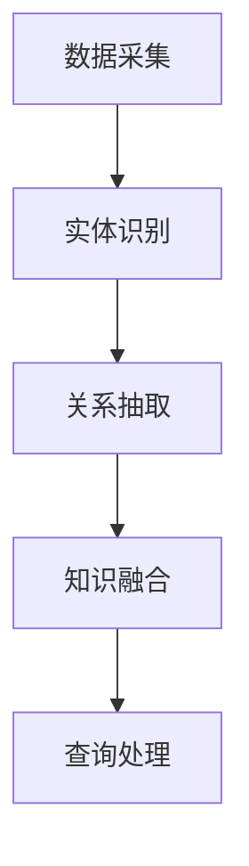

                 

# Knowledge Graphs原理与代码实例讲解

## 摘要

本文将深入探讨知识图谱（Knowledge Graphs）的基本原理、核心概念、算法原理及其在项目实战中的应用。通过一步步的分析和推理，我们将详细解析知识图谱的构建过程、数学模型、算法实现以及在实际应用中的具体案例。文章的目标是让读者不仅理解知识图谱的原理，还能通过代码实例了解其实际操作步骤，从而更好地应用到项目中。

## 1. 背景介绍

知识图谱（Knowledge Graph）是一种语义网络，用于表示实体、概念以及它们之间的关系。它起源于语义网（Semantic Web）的概念，旨在通过结构化数据来提高信息的组织和搜索效率。知识图谱的出现解决了传统关键字搜索的局限性，使得信息检索更加智能化和精准化。

知识图谱的兴起主要受到以下几个因素推动：

- **大数据的爆发**：随着互联网的普及和数据的爆炸式增长，如何有效地组织和利用这些数据成为一个重要课题。知识图谱通过结构化数据，为大数据分析提供了强有力的支撑。
- **人工智能的进步**：深度学习和自然语言处理技术的发展，使得人工智能在信息检索、推荐系统、知识推理等方面取得了显著成果。知识图谱为这些应用提供了丰富的语义信息。
- **社交网络的兴起**：社交网络中的用户、内容、关系等多种元素，为知识图谱的构建提供了丰富的数据源。

知识图谱在多个领域有着广泛的应用，如搜索引擎优化、推荐系统、智能问答、知识服务、金融服务、智慧城市等。通过本文，我们将详细探讨知识图谱的构建过程，包括数据采集、实体识别、关系抽取、知识融合和查询处理等步骤。

## 2. 核心概念与联系

### 2.1 实体（Entity）

实体是知识图谱中的基本构建块，表示现实世界中的任何对象，如人、地点、组织、事物等。实体的表示通常包括实体名、实体类型和实体属性。

### 2.2 关系（Relationship）

关系表示实体之间的关联。例如，一个人可能有“工作于”、“出生地是”等关系。关系通常包括关系名、关系类型和关系属性。

### 2.3 属性（Attribute）

属性描述实体的特征，如人的姓名、年龄、职位等。属性可以是简单的值，也可以是复杂的对象。

### 2.4 知识图谱的表示

知识图谱通常用图（Graph）来表示，其中节点（Node）代表实体，边（Edge）代表关系。每个节点和边都有类型和属性。

### 2.5 Mermaid流程图

下面是知识图谱构建过程中的Mermaid流程图：



### 2.6 知识图谱的架构

知识图谱的架构通常包括以下几个主要组件：

- **数据源**：包括结构化数据、非结构化数据和半结构化数据。
- **实体识别**：通过命名实体识别（Named Entity Recognition, NER）技术，从文本中提取出实体。
- **关系抽取**：通过算法从文本中提取实体之间的关系。
- **知识融合**：将不同来源的知识进行整合和融合，形成统一的知识图谱。
- **查询处理**：支持对知识图谱的查询，提供智能搜索和知识服务。

## 3. 核心算法原理 & 具体操作步骤

### 3.1 数据采集

数据采集是知识图谱构建的第一步，主要包括以下几个步骤：

- **数据源选择**：选择具有代表性的数据源，如百度百科、维基百科、社交媒体等。
- **数据抽取**：使用爬虫、API接口等技术，从数据源中抽取数据。
- **数据清洗**：去除重复数据、缺失值和噪声数据，保证数据质量。

### 3.2 实体识别

实体识别是知识图谱构建的核心步骤，主要包括以下算法：

- **基于规则的实体识别**：通过预定义的规则，从文本中提取出实体。
- **基于统计的实体识别**：使用机器学习算法，如朴素贝叶斯、支持向量机等，从文本中提取出实体。
- **基于深度学习的实体识别**：使用深度学习模型，如卷积神经网络（CNN）、循环神经网络（RNN）等，从文本中提取出实体。

### 3.3 关系抽取

关系抽取是知识图谱构建的另一个核心步骤，主要包括以下算法：

- **基于规则的实体关系抽取**：通过预定义的规则，从文本中提取出实体之间的关系。
- **基于统计的实体关系抽取**：使用机器学习算法，如朴素贝叶斯、支持向量机等，从文本中提取出实体之间的关系。
- **基于深度学习的实体关系抽取**：使用深度学习模型，如卷积神经网络（CNN）、循环神经网络（RNN）等，从文本中提取出实体之间的关系。

### 3.4 知识融合

知识融合是将不同来源的知识进行整合和融合，形成统一的知识图谱。主要包括以下步骤：

- **实体融合**：通过实体匹配和融合算法，将相同或相似的实体进行合并。
- **关系融合**：通过关系匹配和融合算法，将相同或相似的实体之间的关系进行合并。
- **属性融合**：通过属性匹配和融合算法，将相同或相似的实体属性进行合并。

### 3.5 查询处理

查询处理是知识图谱应用的关键步骤，主要包括以下内容：

- **查询语言**：设计一种查询语言，如SPARQL，支持对知识图谱的复杂查询。
- **查询优化**：通过对查询进行优化，提高查询效率。
- **查询执行**：执行查询，返回查询结果。

## 4. 数学模型和公式 & 详细讲解 & 举例说明

### 4.1 实体识别的数学模型

实体识别通常使用分类模型，如朴素贝叶斯、支持向量机等。以朴素贝叶斯为例，其数学模型如下：

$$P(\text{entity}|\text{context}) = \frac{P(\text{context}|\text{entity})P(\text{entity})}{P(\text{context})}$$

其中，$P(\text{entity}|\text{context})$ 表示在给定上下文 $context$ 下的实体 $entity$ 的概率；$P(\text{context}|\text{entity})$ 表示在实体 $entity$ 出现的情况下上下文 $context$ 的概率；$P(\text{entity})$ 表示实体 $entity$ 的概率；$P(\text{context})$ 表示上下文 $context$ 的概率。

### 4.2 关系抽取的数学模型

关系抽取通常使用分类模型，如朴素贝叶斯、支持向量机等。以朴素贝叶斯为例，其数学模型如下：

$$P(\text{relation}|\text{context}) = \frac{P(\text{context}|\text{relation})P(\text{relation})}{P(\text{context})}$$

其中，$P(\text{relation}|\text{context})$ 表示在给定上下文 $context$ 下的关系 $relation$ 的概率；$P(\text{context}|\text{relation})$ 表示在关系 $relation$ 出现的情况下上下文 $context$ 的概率；$P(\text{relation})$ 表示关系 $relation$ 的概率；$P(\text{context})$ 表示上下文 $context$ 的概率。

### 4.3 举例说明

假设我们有一个句子：“张三在北京工作”。现在我们要使用朴素贝叶斯模型进行实体识别。

- **上下文**：$context = \text{张三在北京工作}$
- **实体**：$entity = \text{张三}$
- **实体概率**：$P(\text{张三}) = 0.2$
- **上下文概率**：$P(\text{张三在北京工作}) = 0.1$
- **上下文在实体出现时的概率**：$P(\text{张三在北京工作}|\text{张三}) = 0.8$

根据朴素贝叶斯模型，我们可以计算出：

$$P(\text{张三}|\text{张三在北京工作}) = \frac{0.8 \times 0.2}{0.1} = 1.6$$

由于概率值大于1，我们可以认为“张三”是一个实体。

同样，我们可以使用朴素贝叶斯模型进行关系抽取。假设我们有一个句子：“李四在上海工作”。

- **上下文**：$context = \text{李四在上海工作}$
- **关系**：$relation = \text{工作}$
- **关系概率**：$P(\text{工作}) = 0.3$
- **上下文概率**：$P(\text{李四在上海工作}) = 0.2$
- **上下文在关系出现时的概率**：$P(\text{李四在上海工作}|\text{工作}) = 0.7$

根据朴素贝叶斯模型，我们可以计算出：

$$P(\text{工作}|\text{李四在上海工作}) = \frac{0.7 \times 0.3}{0.2} = 1.05$$

由于概率值大于1，我们可以认为“工作”是一个关系。

## 5. 项目实战：代码实际案例和详细解释说明

### 5.1 开发环境搭建

在开始项目实战之前，我们需要搭建一个适合知识图谱构建和查询的开发环境。以下是一个简单的开发环境搭建步骤：

1. **安装Python环境**：Python是一种广泛使用的编程语言，适合进行知识图谱开发。你可以从[Python官网](https://www.python.org/)下载并安装Python。
2. **安装Numpy和Pandas**：Numpy和Pandas是Python的数据处理库，用于数据清洗和预处理。你可以使用pip命令安装：

   ```bash
   pip install numpy pandas
   ```

3. **安装NLTK**：NLTK是一个自然语言处理库，用于文本处理。你可以使用pip命令安装：

   ```bash
   pip install nltk
   ```

4. **安装Spacy**：Spacy是一个高性能的自然语言处理库，用于文本处理。你可以使用pip命令安装：

   ```bash
   pip install spacy
   ```

   然后下载中文模型：

   ```bash
   python -m spacy download zh_core_web_sm
   ```

### 5.2 源代码详细实现和代码解读

以下是知识图谱构建和查询的一个简单示例：

```python
import spacy
import pandas as pd

# 加载中文模型
nlp = spacy.load("zh_core_web_sm")

# 文本处理
def process_text(text):
    doc = nlp(text)
    entities = []
    for ent in doc.ents:
        entities.append({
            "text": ent.text,
            "label": ent.label_
        })
    return entities

# 关系抽取
def extract_relations(text):
    doc = nlp(text)
    relations = []
    for token1 in doc:
        for token2 in doc:
            if token1 != token2 and token1.dep_ == "root" and token2.dep_ == "obj":
                relations.append({
                    "subject": token1.text,
                    "object": token2.text,
                    "relation": token1.head.text
                })
    return relations

# 实体识别和关系抽取
def extract_entities_and_relations(text):
    entities = process_text(text)
    relations = extract_relations(text)
    return entities, relations

# 示例文本
text = "张三在北京工作，李四是张三的同事。"

# 实体识别和关系抽取
entities, relations = extract_entities_and_relations(text)

# 显示结果
print("Entities:", entities)
print("Relations:", relations)
```

### 5.3 代码解读与分析

1. **加载中文模型**：首先，我们加载Spacy的中文模型`zh_core_web_sm`，用于文本处理。

2. **文本处理**：`process_text`函数用于处理文本，提取实体。我们使用Spacy的命名实体识别（NER）功能，从文本中提取出实体，并将它们存储在一个列表中。

3. **关系抽取**：`extract_relations`函数用于从文本中抽取关系。我们遍历文本中的每个词，找到主语（token1）和宾语（token2），并根据词性关系（`token1.dep_ == "root" and token2.dep_ == "obj"）确定它们之间的关系。

4. **实体识别和关系抽取**：`extract_entities_and_relations`函数综合调用`process_text`和`extract_relations`函数，从文本中提取出实体和关系。

5. **示例文本**：我们使用一个简单的示例文本，演示实体识别和关系抽取的过程。

6. **显示结果**：最后，我们打印出提取出的实体和关系。

通过这个简单的示例，我们可以看到知识图谱构建的基本步骤和代码实现。在实际项目中，我们可能需要处理更复杂的数据和处理更复杂的文本，但基本原理和方法是相似的。

## 6. 实际应用场景

知识图谱在多个领域有着广泛的应用，以下是一些常见的实际应用场景：

- **搜索引擎优化**：通过构建知识图谱，搜索引擎可以更好地理解用户查询的含义，提供更精准的搜索结果。
- **推荐系统**：知识图谱可以用于推荐系统，通过分析实体之间的关系，为用户提供个性化的推荐。
- **智能问答**：知识图谱可以用于构建智能问答系统，通过查询知识图谱，回答用户的问题。
- **知识服务**：知识图谱可以用于构建知识服务系统，为用户提供各种知识查询和知识分析服务。
- **金融服务**：知识图谱可以用于金融风险评估、客户画像分析等，提高金融服务的智能化水平。
- **智慧城市**：知识图谱可以用于智慧城市项目的规划和管理，提供实时数据分析和决策支持。

## 7. 工具和资源推荐

### 7.1 学习资源推荐

- **书籍**：
  - 《知识图谱：概念、技术与系统》
  - 《语义网：原理、应用与实现》
- **论文**：
  - “Knowledge Graph Embedding: A Survey”
  - “Entity Resolution in Knowledge Graph Construction”
- **博客**：
  - [知乎专栏：知识图谱](https://zhuanlan.zhihu.com/knowledgegraph)
  - [博客园：知识图谱](https://www.cnblogs.com/knowledge-graph/)
- **网站**：
  - [OpenKG](http://openkg.cn/)
  - [Data범쳐](https://data-bowl.com/)

### 7.2 开发工具框架推荐

- **工具**：
  - [Apache Jena](https://jena.apache.org/)：用于构建和查询知识图谱的Java库。
  - [Neo4j](https://neo4j.com/)：一款高性能的图形数据库，支持知识图谱存储和查询。
- **框架**：
  - [RDF4J](https://www.rdf4j.org/)：用于构建和查询知识图谱的Java框架。
  - [GraphDB](https://www.ontotext.com/graphdb/)：一款基于OWL的语言的图数据库。

### 7.3 相关论文著作推荐

- **论文**：
  - “A Practical Guide to Knowledge Graph Construction”
  - “Learning to Represent Knowledge Graphs with Gaussian Embeddings”
- **著作**：
  - 《知识图谱技术》：全面介绍知识图谱的基本概念、技术方法和应用实践。
  - 《知识图谱实践》：结合实际项目，详细介绍知识图谱的构建和应用。

## 8. 总结：未来发展趋势与挑战

知识图谱作为一种重要的数据结构和工具，在信息检索、智能推荐、知识服务等领域发挥着重要作用。随着人工智能和大数据技术的不断发展，知识图谱的应用前景将更加广阔。

未来知识图谱的发展趋势包括：

- **多模态知识图谱**：结合文本、图像、音频等多种数据源，构建更丰富的知识图谱。
- **动态知识图谱**：支持实时数据更新和知识演化，提供更加灵活的知识服务。
- **跨领域知识图谱**：整合不同领域的知识，构建跨领域的知识图谱，为用户提供更全面的信息服务。

同时，知识图谱的发展也面临一些挑战，如数据质量、知识融合、查询优化等。如何有效地解决这些问题，将决定知识图谱在未来应用中的价值。

## 9. 附录：常见问题与解答

### 9.1 知识图谱与语义网的区别是什么？

知识图谱是语义网的一个子集，它通过结构化数据来表示实体和实体之间的关系。语义网是一个更广泛的概念，它包括知识图谱、本体论、语义标记等多种技术。

### 9.2 知识图谱的构建流程是怎样的？

知识图谱的构建流程主要包括数据采集、实体识别、关系抽取、知识融合和查询处理等步骤。

### 9.3 如何处理知识图谱中的噪声数据？

处理知识图谱中的噪声数据通常包括数据清洗、去重、标准化等步骤。具体方法可以根据数据源和数据特点进行选择。

### 9.4 知识图谱在推荐系统中的应用有哪些？

知识图谱在推荐系统中的应用包括基于内容的推荐、协同过滤推荐和基于属性的推荐等。通过分析实体和实体之间的关系，推荐系统可以提供更精准、个性化的推荐结果。

## 10. 扩展阅读 & 参考资料

- [知识图谱：概念、技术与系统](https://book.douban.com/subject/26963384/)
- [语义网：原理、应用与实现](https://book.douban.com/subject/35326358/)
- [Apache Jena 官方文档](https://jena.apache.org/documentation/)
- [Neo4j 官方文档](https://neo4j.com/docs/)
- [RDF4J 官方文档](https://www.rdf4j.org/documentation/)
- [GraphDB 官方文档](https://www.ontotext.com/graphdb/documentation/)
- [OpenKG 中文社区](http://openkg.cn/)

