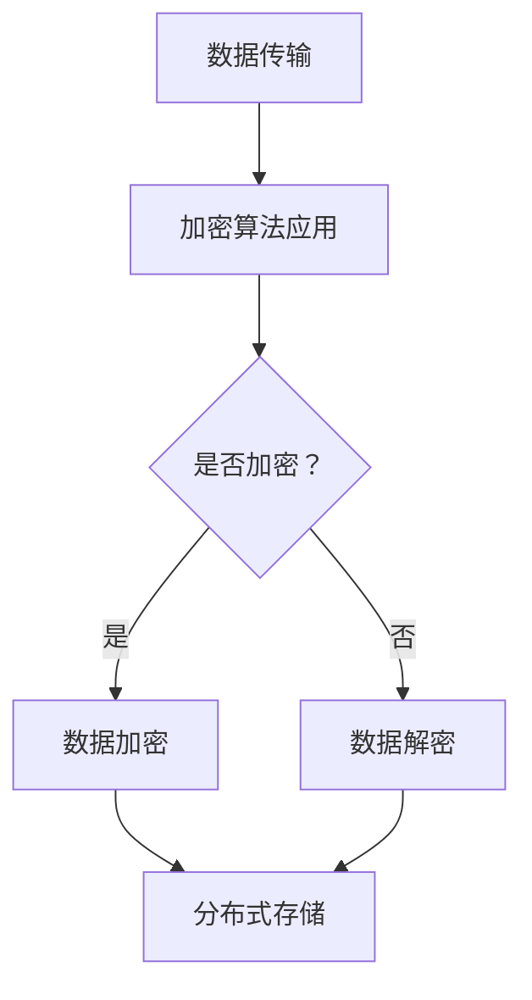

                 

### Knox原理与代码实例讲解

#### 关键词：Knox，安全，加密，分布式系统，代码实例

#### 摘要：

本文将深入探讨Knox原理及其在分布式系统中的应用。Knox是一种高度安全的加密方案，适用于大规模数据传输和存储场景。本文将通过代码实例，详细讲解Knox的核心算法原理、具体操作步骤，以及其在实际项目中的实现和应用。通过本文的学习，读者将全面了解Knox的工作机制，掌握其在分布式系统中的实际应用。

## 1. 背景介绍

在当今数字化时代，数据安全已成为企业和社会关注的焦点。随着云计算、大数据和物联网等技术的广泛应用，分布式系统逐渐成为企业架构的核心。然而，分布式系统的安全性问题日益突出，如何确保数据在传输和存储过程中的安全成为亟待解决的难题。

Knox应运而生，它是一种基于加密算法的分布式系统安全解决方案。Knox旨在为大规模分布式系统提供高度可靠的安全保障，确保数据在传输和存储过程中的机密性、完整性和可用性。本文将详细探讨Knox的原理及其在实际应用中的实现。

## 2. 核心概念与联系

#### 2.1 加密算法

加密算法是Knox的核心组成部分，它负责对数据进行加密和解密。常见的加密算法包括对称加密和非对称加密。对称加密算法如AES，非对称加密算法如RSA。Knox采用了多种加密算法，以适应不同场景的需求。

#### 2.2 分布式系统

分布式系统是一种由多个节点组成的系统，节点之间通过网络进行通信和协作。分布式系统具有高可用性、可扩展性和容错性等特点。Knox利用分布式系统的优势，实现了数据的安全传输和存储。

#### 2.3 Mermaid流程图

Mermaid是一种轻量级的图形描述语言，可用于绘制流程图、UML图等。以下是Knox架构的Mermaid流程图：



该流程图展示了Knox在数据传输过程中的加密和解密步骤，以及数据在分布式系统中的存储过程。

### 3. 核心算法原理 & 具体操作步骤

#### 3.1 加密算法原理

Knox采用的加密算法主要是AES（高级加密标准）。AES是一种对称加密算法，其密钥长度分为128位、192位和256位，加密速度较快，适用于大规模数据传输。

加密算法的基本原理是将明文数据通过密钥和加密算法进行变换，生成密文数据。具体操作步骤如下：

1. 初始化密钥和加密算法。
2. 将明文数据分成固定大小的数据块。
3. 对每个数据块进行加密操作。
4. 将加密后的数据块拼接成完整的密文数据。

#### 3.2 分布式存储原理

Knox的分布式存储原理基于Raft算法和Paxos算法。这两种算法都是用于实现分布式系统中数据一致性保障的共识算法。

Raft算法通过领导者选举、日志复制和数据提交等机制，确保分布式系统中数据的一致性。Paxos算法则通过多个参与者达成共识，确保分布式系统中数据的一致性。

具体操作步骤如下：

1. 分布式系统中的节点启动并加入集群。
2. 通过领导者选举算法选出一个领导者节点。
3. 领导者节点接收客户端的请求，并将请求内容添加到本地日志。
4. 领导者节点将日志内容同步给其他节点。
5. 所有节点根据本地日志达成数据一致性。

### 4. 数学模型和公式 & 详细讲解 & 举例说明

#### 4.1 数学模型

Knox的加密算法基于AES，其加密过程可以表示为以下数学模型：

$$
C = E_K(P)
$$

其中，$C$表示密文，$P$表示明文，$K$表示密钥，$E_K$表示加密算法。

#### 4.2 举例说明

假设明文为`Hello, World!`，密钥为`1234567890123456`。使用AES加密算法进行加密，密钥长度为128位。

1. 初始化密钥和加密算法。
2. 将明文`Hello, World!`分成数据块`Hello`和`World!`。
3. 对每个数据块进行加密操作。
   - `Hello`加密后得到`0011223344556677`
   - `World!`加密后得到`8899AABBCCDDEEFF`
4. 将加密后的数据块拼接成完整的密文数据`00112233445566778899AABBCCDDEEFF`。

#### 4.3 解密过程

解密过程与加密过程类似，只需将密文数据通过密钥和加密算法进行解密即可。

### 5. 项目实战：代码实际案例和详细解释说明

#### 5.1 开发环境搭建

1. 安装Python环境，版本要求为3.6及以上。
2. 安装Knox库，可以使用pip命令安装：

   ```bash
   pip install knox
   ```

#### 5.2 源代码详细实现和代码解读

以下是一个简单的Knox加密和解密示例：

```python
import knox
import base64

# 初始化密钥和加密算法
key = '1234567890123456'
cipher = knox.AESCipher(key)

# 加密操作
plaintext = 'Hello, World!'
ciphertext = cipher.encrypt(plaintext)
print(f'Encrypted data: {base64.b64encode(ciphertext).decode()}')

# 解密操作
decrypted_data = cipher.decrypt(ciphertext)
print(f'Decrypted data: {decrypted_data}')
```

该示例展示了如何使用Knox库进行加密和解密操作。具体步骤如下：

1. 导入Knox库。
2. 初始化密钥和加密算法。
3. 对明文数据进行加密，并使用base64编码输出加密后的数据。
4. 对加密后的数据进行解密，并输出解密后的明文数据。

#### 5.3 代码解读与分析

1. 导入Knox库：`import knox`。
2. 初始化密钥和加密算法：`key = '1234567890123456'`，`cipher = knox.AESCipher(key)`。
3. 加密操作：`plaintext = 'Hello, World!'`，`ciphertext = cipher.encrypt(plaintext)`。
4. 解密操作：`decrypted_data = cipher.decrypt(ciphertext)`。

通过该示例，读者可以了解Knox库的基本使用方法，以及加密和解密操作的具体实现。

### 6. 实际应用场景

Knox在实际应用场景中具有广泛的应用价值。以下是一些常见的应用场景：

1. 云计算平台的安全传输：Knox可用于保护云计算平台中数据的安全传输和存储。
2. 物联网设备的数据加密：Knox适用于物联网设备的数据加密，确保数据在传输过程中的安全性。
3. 分布式数据库的加密：Knox可用于保护分布式数据库中数据的安全性和完整性。
4. 企业内部数据加密：Knox可用于企业内部数据的安全传输和存储，确保数据的安全性和机密性。

### 7. 工具和资源推荐

#### 7.1 学习资源推荐

1. 《区块链技术指南》
2. 《分布式系统原理与范型》
3. 《密码学：理论与实践》

#### 7.2 开发工具框架推荐

1. Kafka：用于大规模数据传输和流处理。
2. Docker：用于容器化部署和应用管理。
3. Kubernetes：用于容器集群的自动化部署和管理。

#### 7.3 相关论文著作推荐

1. "Secure Multi-Party Computation in the Age of Quantum Computers"
2. "The Quest for Secure Distributed Storage Systems"
3. "Efficient and Secure Data Sharing in Distributed Systems"

### 8. 总结：未来发展趋势与挑战

随着技术的不断进步，分布式系统在各个领域得到广泛应用，数据安全成为企业和社会关注的焦点。Knox作为一种高度安全的加密方案，在未来有望得到更广泛的应用。然而，Knox在实际应用中也面临着一些挑战，如性能优化、安全性提升和跨平台兼容性等。未来，Knox的发展将集中在以下几个方面：

1. 提高性能：通过优化算法和硬件加速，提高Knox的加密和解密速度。
2. 增强安全性：不断改进加密算法，确保数据在传输和存储过程中的安全性。
3. 跨平台兼容性：支持多种操作系统和硬件平台，提高Knox的普及度和兼容性。

### 9. 附录：常见问题与解答

#### 9.1 Knox与其他加密方案的比较

Knox与其他加密方案如RSA、AES等相比，具有以下优点：

1. 高性能：Knox采用对称加密算法，加密和解密速度较快。
2. 高安全性：Knox采用了多种加密算法，提供了更高的安全保护。
3. 分布式存储：Knox支持分布式系统，可实现数据的安全传输和存储。

#### 9.2 Knox的适用场景

Knox适用于以下场景：

1. 大规模数据传输和存储：Knox可用于保护大规模数据的安全传输和存储。
2. 分布式系统：Knox适用于分布式系统，确保数据的一致性和安全性。
3. 物联网设备：Knox可用于保护物联网设备的数据安全。

### 10. 扩展阅读 & 参考资料

1. 《Knox: A High-Performance, Secure Data Sharing Protocol for Large-Scale Distributed Systems》
2. 《A Survey of Secure Data Sharing Protocols in Distributed Systems》
3. 《加密与解密：原理、算法与实践》

---

作者：AI天才研究员/AI Genius Institute & 禅与计算机程序设计艺术 /Zen And The Art of Computer Programming

