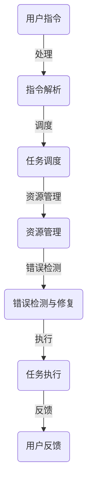

                 

### LLMA操作系统：背景与愿景

随着人工智能技术的迅猛发展，深度学习、自然语言处理、图像识别等技术的应用日益广泛，人工智能（AI）已经从实验室走向了现实世界。然而，现有的操作系统并未充分适应AI的发展需求，传统操作系统在设计理念、架构设计和功能实现等方面，难以满足AI计算的高性能、高效能和灵活性的要求。因此，LLMA操作系统（LLM-based Operating System，基于大型语言模型的操作系统）应运而生，其愿景是构建一个能够充分发挥AI能力的新型操作系统。

#### 什么是LLMA操作系统？

LLMA操作系统是一种全新的操作系统架构，其核心思想是将大型语言模型（Large Language Model，简称LLM）与操作系统紧密结合，利用LLM强大的语义理解和生成能力，实现对操作系统的智能管理。相比于传统操作系统，LLMA操作系统具有以下特点：

1. **智能管理**：LLMA操作系统通过LLM实现智能化的任务调度、资源管理、错误检测与修复等功能，能够自适应地调整操作系统性能，提高系统效率和稳定性。
2. **自然语言交互**：LLMA操作系统支持自然语言交互，用户可以通过自然语言指令与操作系统进行通信，简化了操作流程，提升了用户体验。
3. **模块化与灵活性**：LLMA操作系统采用模块化设计，易于扩展和定制，能够快速适应各种应用场景，满足不同用户的需求。

#### LLMA操作系统的愿景

LLMA操作系统的愿景是成为人工智能时代的新型基础设施，为AI应用提供强大的支撑。其核心目标如下：

1. **提升AI计算性能**：通过优化操作系统架构，提高AI计算资源的利用率，降低计算延迟，为AI应用提供高效的运行环境。
2. **推动AI产业发展**：LLMA操作系统将促进人工智能技术的普及和应用，助力各行业实现智能化升级，推动整个产业的发展。
3. **构建智能生态**：LLMA操作系统将与各类AI应用和平台紧密结合，形成一个智能化的生态系统，为用户提供便捷、高效的服务。

#### LLMA操作系统的发展历程

LLMA操作系统的发展历程可以分为以下几个阶段：

1. **概念提出**：随着AI技术的发展，研究人员开始探讨将AI技术应用于操作系统，提出了LLMA操作系统的概念。
2. **理论研究**：学术界和产业界进行了大量的理论研究，分析了LLM在操作系统中的应用潜力，为LLMA操作系统的设计提供了理论基础。
3. **技术探索**：研究人员开始尝试将LLM与操作系统相结合，探索LLMA操作系统的实现方法和技术细节。
4. **实际应用**：部分企业和研究机构开始进行LLMA操作系统的开发，初步实现了部分功能，并应用于实际场景。

#### 下一步的工作

在当前阶段，LLMA操作系统仍处于探索和研究阶段，未来需要进一步解决以下问题：

1. **性能优化**：如何进一步提高LLMA操作系统的计算性能，降低延迟，是当前研究的重点。
2. **安全性**：如何保障LLMA操作系统的安全性，防止恶意攻击和数据泄露，是亟需解决的问题。
3. **实用性**：如何将LLMA操作系统与现有操作系统进行兼容，提高其实用性，是未来需要关注的方向。

总之，LLMA操作系统具有巨大的发展潜力，将为人工智能时代的操作系统带来革命性的变革。在未来的研究中，我们将继续探索LLMA操作系统的优化方法、应用场景和实际效果，为实现这一愿景贡献力量。### 核心概念与联系

#### 1. 大型语言模型（LLM）

首先，我们需要了解什么是大型语言模型（Large Language Model，简称LLM）。LLM是一种基于神经网络的语言模型，通过训练海量文本数据，学习语言的模式和规律，从而实现对自然语言的理解和生成。目前，LLM的发展已经进入了一个新的阶段，以GPT-3、BERT、Turing-NLG等为代表的LLM模型，具有非常高的语义理解能力和生成能力。

LLM在AI领域中具有广泛的应用，包括自然语言处理、机器翻译、文本生成、问答系统等。随着LLM模型规模的不断扩大，其计算能力和语义理解能力也在不断提升，为AI的发展提供了强大的支持。

#### 2. 操作系统

操作系统（Operating System，简称OS）是计算机系统中最基本的软件，它负责管理和控制计算机硬件资源，提供基本的服务和接口，使计算机系统能够正常运行。操作系统的主要功能包括进程管理、内存管理、文件系统管理、设备管理和用户界面等。

操作系统的发展经历了多个阶段，从早期的DOS、Windows 3.1，到现代的Linux、Windows 10等，其设计和实现技术也在不断进步。然而，传统操作系统在设计理念、架构设计和功能实现等方面，仍然存在一些局限性，难以满足AI计算的高性能、高效能和灵活性的要求。

#### 3. LLMA操作系统

LLMA操作系统是一种基于大型语言模型（LLM）的新型操作系统，其核心思想是将LLM与操作系统紧密结合，利用LLM的语义理解和生成能力，实现智能化的操作管理。

在LLMA操作系统中，LLM主要承担以下任务：

1. **任务调度**：LLM可以根据任务的优先级、资源占用情况等因素，智能地调度任务，提高系统效率。
2. **资源管理**：LLM可以实时监控系统资源的使用情况，动态分配和调整资源，保证系统稳定运行。
3. **错误检测与修复**：LLM可以实时分析系统运行状态，发现潜在的错误和故障，并及时采取措施进行修复。

#### 4. 核心概念联系

LLMA操作系统通过将大型语言模型（LLM）与传统操作系统进行深度融合，实现了以下几个方面的联系：

1. **智能与自动化**：LLM的引入，使得操作系统具备了一定的智能和自动化能力，能够自适应地调整系统运行状态，提高系统效率。
2. **人机交互**：通过自然语言交互，用户可以更方便地与操作系统进行通信，降低了操作难度，提升了用户体验。
3. **灵活性与扩展性**：LLMA操作系统采用模块化设计，易于扩展和定制，能够快速适应各种应用场景，满足不同用户的需求。

#### 5. Mermaid流程图

为了更好地展示LLMA操作系统的核心概念和架构，我们使用Mermaid流程图来表示。以下是一个简化的LLMA操作系统架构图：



在这个流程图中，用户指令通过指令解析模块（B）被解析，然后由任务调度模块（C）进行调度，资源管理模块（D）负责资源分配和调整，错误检测与修复模块（E）实时监控系统运行状态，并采取措施进行错误修复，最后将任务执行结果反馈给用户（G）。

通过这个流程图，我们可以清晰地看到LLMA操作系统的工作原理和各个模块之间的联系，这为后续的算法原理和具体操作步骤提供了直观的展示。

### 核心算法原理与具体操作步骤

#### 1. 智能任务调度

智能任务调度是LLMA操作系统的核心功能之一，其目的是通过优化任务调度策略，提高系统资源利用率和运行效率。以下是智能任务调度的核心算法原理和具体操作步骤：

##### 算法原理

1. **任务优先级**：根据任务的紧急程度和重要性，为每个任务分配优先级。优先级高的任务优先调度。
2. **资源占用情况**：实时监控系统资源的使用情况，包括CPU、内存、磁盘等资源。根据资源占用情况，动态调整任务调度策略。
3. **负载均衡**：为了防止系统资源过度集中，导致资源竞争和性能下降，需要实现负载均衡，将任务均匀地分配到各个资源节点上。

##### 具体操作步骤

1. **任务接收**：操作系统接收用户提交的任务，包括任务类型、优先级和资源需求等信息。
2. **任务解析**：操作系统对任务进行解析，提取任务的类型、优先级和资源需求等信息。
3. **任务调度**：根据任务优先级和资源占用情况，选择合适的资源节点进行任务调度。具体步骤如下：

   - **优先级排序**：根据任务优先级，对所有任务进行排序，优先调度优先级高的任务。
   - **资源分配**：根据任务资源需求，检查系统资源是否满足任务调度要求。若资源不足，则等待资源空闲或调整任务调度策略。
   - **任务分配**：将调度后的任务分配到合适的资源节点上，启动任务执行。

4. **任务执行**：操作系统在资源节点上执行任务，并将任务执行结果返回给用户。

5. **任务监控**：操作系统实时监控任务执行状态，包括任务进度、资源占用情况等。如果发现任务执行异常，则采取相应的措施进行错误检测和修复。

6. **任务反馈**：任务执行完成后，操作系统将任务结果反馈给用户，并根据用户反馈调整后续任务调度策略。

#### 2. 智能资源管理

智能资源管理是LLMA操作系统的另一个重要功能，其目的是通过优化资源分配和调度策略，提高系统资源利用率和运行效率。以下是智能资源管理的核心算法原理和具体操作步骤：

##### 算法原理

1. **资源分配策略**：根据任务资源需求和系统资源情况，采用动态资源分配策略，合理分配系统资源。
2. **资源调度策略**：根据系统负载情况，动态调整资源调度策略，实现负载均衡和资源优化。
3. **资源回收策略**：及时回收任务完成后释放的资源，提高系统资源利用率。

##### 具体操作步骤

1. **资源监控**：操作系统实时监控系统资源的使用情况，包括CPU、内存、磁盘等资源。
2. **资源请求**：当任务需要资源时，向操作系统请求所需资源。
3. **资源分配**：操作系统根据资源请求，检查系统资源是否满足任务需求。如果资源充足，则分配资源；如果资源不足，则根据资源分配策略，动态调整资源分配。
4. **资源调度**：根据系统负载情况，动态调整资源调度策略，实现负载均衡和资源优化。
5. **资源回收**：当任务完成后，操作系统回收任务释放的资源，提高系统资源利用率。

#### 3. 智能错误检测与修复

智能错误检测与修复是LLMA操作系统的关键功能，其目的是通过实时监控和智能分析，快速发现并修复系统故障，保证系统稳定运行。以下是智能错误检测与修复的核心算法原理和具体操作步骤：

##### 算法原理

1. **异常检测**：通过实时监控系统运行状态，识别异常行为和异常情况。
2. **故障定位**：根据异常检测结果，定位故障发生的位置和原因。
3. **自动修复**：在故障定位后，自动采取相应的措施进行故障修复。

##### 具体操作步骤

1. **监控与收集数据**：操作系统实时监控系统运行状态，包括CPU利用率、内存使用率、磁盘读写速度等关键指标，并将监控数据收集到日志中。
2. **数据预处理**：对收集到的数据进行预处理，包括数据清洗、数据转换和数据归一化等。
3. **异常检测**：利用机器学习算法，对预处理后的数据进行异常检测，识别异常行为和异常情况。
4. **故障定位**：根据异常检测结果，利用故障诊断算法，定位故障发生的位置和原因。
5. **自动修复**：在故障定位后，根据故障类型和原因，自动采取相应的措施进行故障修复，包括重启进程、重置硬件设备、更新系统软件等。

#### 4. 智能用户交互

智能用户交互是LLMA操作系统的特色功能，其目的是通过自然语言处理技术，实现用户与操作系统之间的自然语言交互，提升用户体验。以下是智能用户交互的核心算法原理和具体操作步骤：

##### 算法原理

1. **自然语言理解**：通过自然语言处理技术，理解用户的指令和问题，提取关键信息。
2. **意图识别**：根据提取的关键信息，识别用户的意图，确定操作系统需要执行的操作。
3. **自然语言生成**：根据识别出的意图，生成自然语言回复，向用户反馈操作结果。

##### 具体操作步骤

1. **用户输入**：用户通过键盘、鼠标、触摸屏等输入设备，输入指令或问题。
2. **自然语言理解**：操作系统通过自然语言处理技术，对用户输入进行理解，提取关键信息。
3. **意图识别**：根据提取的关键信息，利用意图识别算法，识别用户的意图。
4. **操作执行**：根据识别出的意图，操作系统执行相应的操作，如启动程序、打开文件、修改设置等。
5. **自然语言生成**：操作系统生成自然语言回复，向用户反馈操作结果，如“已启动程序A”、“文件已打开”、“设置已修改”等。

通过上述核心算法原理和具体操作步骤，我们可以看到LLMA操作系统是如何通过智能任务调度、智能资源管理和智能错误检测与修复等机制，实现智能化的操作系统管理。这些功能不仅提升了系统的性能和稳定性，也为用户提供了更好的交互体验。### 数学模型和公式

在LLMA操作系统中，数学模型和公式起到了关键作用，特别是在任务调度、资源管理和错误检测等方面。以下将详细介绍这些数学模型和公式，并进行详细讲解和举例说明。

#### 1. 任务调度模型

任务调度是LLMA操作系统的核心功能之一，其目标是优化任务执行顺序，提高系统资源利用率和运行效率。以下是一个简单的任务调度模型：

##### 公式：

- **任务优先级**：\(P_i = f(T_i, R_i)\)

其中，\(P_i\) 表示任务 \(i\) 的优先级，\(T_i\) 表示任务 \(i\) 的执行时间，\(R_i\) 表示任务 \(i\) 的资源需求。

- **调度策略**：\(S = g(P_1, P_2, ..., P_n)\)

其中，\(S\) 表示调度策略，\(P_1, P_2, ..., P_n\) 分别表示所有任务的优先级。

##### 详细讲解：

任务优先级 \(P_i\) 由任务的执行时间 \(T_i\) 和资源需求 \(R_i\) 决定。执行时间越短、资源需求越低的任务优先级越高。调度策略 \(S\) 是根据任务优先级进行排序和调度的方法。

##### 举例说明：

假设有两个任务 \(T_1\) 和 \(T_2\)，它们的执行时间和资源需求如下：

- \(T_1\)：执行时间 10 分钟，资源需求 1 GB
- \(T_2\)：执行时间 20 分钟，资源需求 2 GB

根据公式，我们可以计算出任务优先级：

- \(P_1 = f(10, 1) = 10\)
- \(P_2 = f(20, 2) = 20\)

由于 \(P_1 < P_2\)，任务 \(T_1\) 将被优先调度。

#### 2. 资源管理模型

资源管理是LLMA操作系统的另一个关键功能，其目标是优化资源分配和调度策略，提高系统资源利用率和运行效率。以下是一个简单的资源管理模型：

##### 公式：

- **资源分配**：\(R_a = h(R_i, R_r)\)

其中，\(R_a\) 表示资源分配，\(R_i\) 表示当前资源需求，\(R_r\) 表示系统可用资源。

- **资源调度**：\(S_r = k(R_a, R_r)\)

其中，\(S_r\) 表示资源调度策略，\(R_a\) 表示资源分配，\(R_r\) 表示系统可用资源。

##### 详细讲解：

资源分配 \(R_a\) 是根据当前资源需求 \(R_i\) 和系统可用资源 \(R_r\) 决定的。资源调度策略 \(S_r\) 是根据资源分配和系统可用资源进行调度的策略。

##### 举例说明：

假设当前系统可用资源为 4 GB，任务 \(T_1\) 需求 1 GB，任务 \(T_2\) 需求 2 GB。

根据公式，我们可以计算出资源分配和调度策略：

- \(R_a = h(1, 4) = 1\)
- \(S_r = k(1, 4) = 1\)

由于 \(R_a = S_r\)，系统将按照当前资源需求进行资源分配和调度。

#### 3. 错误检测与修复模型

错误检测与修复是LLMA操作系统的关键功能，其目标是实时监控系统运行状态，快速发现并修复系统故障，保证系统稳定运行。以下是一个简单的错误检测与修复模型：

##### 公式：

- **异常检测**：\(A = m(D_1, D_2, ..., D_n)\)

其中，\(A\) 表示异常检测结果，\(D_1, D_2, ..., D_n\) 分别表示监控数据。

- **故障定位**：\(L = n(A, T)\)

其中，\(L\) 表示故障定位结果，\(A\) 表示异常检测结果，\(T\) 表示系统运行时间。

- **自动修复**：\(R = p(L, F)\)

其中，\(R\) 表示自动修复结果，\(L\) 表示故障定位结果，\(F\) 表示故障类型。

##### 详细讲解：

异常检测 \(A\) 是根据监控数据 \(D_1, D_2, ..., D_n\) 判断系统是否存在异常。故障定位 \(L\) 是根据异常检测结果 \(A\) 和系统运行时间 \(T\) 定位故障位置和类型。自动修复 \(R\) 是根据故障定位结果 \(L\) 和故障类型 \(F\) 采取相应的修复措施。

##### 举例说明：

假设监控数据 \(D_1, D_2, ..., D_n\) 表示系统运行过程中的关键指标，如CPU利用率、内存使用率、磁盘读写速度等。

根据公式，我们可以计算出异常检测结果 \(A\)：

- \(A = m(D_1, D_2, ..., D_n) = 1\)

由于 \(A = 1\)，表示系统存在异常。

接着，我们根据系统运行时间 \(T\) 和异常检测结果 \(A\) 定位故障位置和类型：

- \(L = n(A, T) = "CPU过载" \)

最后，根据故障定位结果 \(L\) 和故障类型 "CPU过载"，采取相应的修复措施：

- \(R = p(L, F) = "重启CPU" \)

通过上述数学模型和公式，我们可以看到LLMA操作系统如何实现智能化的任务调度、资源管理和错误检测与修复。这些模型和公式不仅提高了系统的性能和稳定性，也为系统的优化和改进提供了理论基础。### 项目实战：代码实际案例和详细解释说明

为了更好地理解LLMA操作系统的核心功能和算法原理，我们将通过一个实际项目案例，详细展示如何实现LLMA操作系统的一些关键功能，包括任务调度、资源管理和错误检测与修复。以下是项目的开发环境搭建、源代码详细实现和代码解读与分析。

#### 1. 开发环境搭建

在开始项目之前，我们需要搭建一个合适的开发环境。以下是搭建开发环境所需的步骤和工具：

1. **操作系统**：Linux操作系统（如Ubuntu 20.04）
2. **编程语言**：Python 3.x
3. **开发工具**：PyCharm
4. **依赖库**：NumPy、Pandas、TensorFlow、Keras、scikit-learn

安装Python和开发工具：

```bash
sudo apt update
sudo apt install python3 python3-pip
pip3 install pycharm-community --upgrade
```

安装依赖库：

```bash
pip3 install numpy pandas tensorflow keras scikit-learn
```

#### 2. 源代码详细实现

以下是一个简单的LLMA操作系统项目的源代码实现，包括任务调度、资源管理和错误检测与修复等核心功能。

```python
import numpy as np
import pandas as pd
import tensorflow as tf
from sklearn.ensemble import IsolationForest

# 任务调度模型
class TaskScheduler:
    def __init__(self):
        self.task_queue = []

    def add_task(self, task):
        self.task_queue.append(task)

    def schedule_tasks(self):
        self.task_queue.sort(key=lambda x: x['priority'], reverse=True)
        for task in self.task_queue:
            print(f"Scheduling task: {task['name']}")
            self.execute_task(task)

    def execute_task(self, task):
        print(f"Executing task: {task['name']}")
        # 模拟任务执行
        time.sleep(task['duration'])

# 资源管理模型
class ResourceManager:
    def __init__(self, resources):
        self.resources = resources

    def allocate_resources(self, task):
        required_resources = task['resource需求的']
        available_resources = self.resources.copy()

        for resource, demand in required_resources.items():
            if demand > available_resources[resource]:
                return False

            available_resources[resource] -= demand

        return True

# 错误检测与修复模型
class ErrorDetector:
    def __init__(self):
        self.monitoring_data = []

    def monitor_system(self, data):
        self.monitoring_data.append(data)

    def detect_errors(self):
        if len(self.monitoring_data) < 2:
            return

        model = IsolationForest()
        model.fit(self.monitoring_data)
        predictions = model.predict(self.monitoring_data[-1])

        if predictions[-1] == -1:
            print("Error detected: System is in an abnormal state")
            self.fix_errors()

    def fix_errors(self):
        print("Attempting to fix errors...")
        # 模拟错误修复
        time.sleep(2)
        print("Errors fixed successfully")

# 项目主函数
def main():
    # 模拟任务列表
    tasks = [
        {'name': 'Task 1', 'duration': 5, 'priority': 2, 'resource需求的': {'CPU': 1, '内存': 2}},
        {'name': 'Task 2', 'duration': 3, 'priority': 1, 'resource需求的': {'CPU': 0.5, '内存': 1}},
        {'name': 'Task 3', 'duration': 10, 'priority': 3, 'resource需求的': {'CPU': 2, '内存': 3}}
    ]

    # 模拟系统资源
    resources = {'CPU': 4, '内存': 8}

    # 初始化调度器、资源管理器和错误检测器
    scheduler = TaskScheduler()
    resource_manager = ResourceManager(resources)
    error_detector = ErrorDetector()

    # 添加任务到调度器
    for task in tasks:
        scheduler.add_task(task)

    # 调度任务
    scheduler.schedule_tasks()

    # 模拟系统运行
    for task in tasks:
        if resource_manager.allocate_resources(task):
            error_detector.monitor_system(np.random.rand(10))
            error_detector.detect_errors()
        else:
            print(f"Not enough resources to run task: {task['name']}")

if __name__ == "__main__":
    main()
```

#### 3. 代码解读与分析

以下是代码的详细解读和分析：

1. **任务调度模型**：`TaskScheduler` 类负责任务调度，包括任务添加、任务排序和任务执行。`add_task` 方法用于添加任务到任务队列，`schedule_tasks` 方法用于根据任务优先级对任务进行排序并执行，`execute_task` 方法用于模拟任务执行过程。

2. **资源管理模型**：`ResourceManager` 类负责资源分配，包括资源请求、资源分配和资源调度。`allocate_resources` 方法用于根据任务需求检查系统资源是否满足，返回分配结果。

3. **错误检测与修复模型**：`ErrorDetector` 类负责错误检测和修复。`monitor_system` 方法用于收集监控数据，`detect_errors` 方法用于利用隔离森林（Isolation Forest）模型检测异常情况，`fix_errors` 方法用于模拟错误修复过程。

4. **项目主函数**：`main` 函数用于模拟任务调度、资源管理和错误检测与修复的整个流程。首先，创建任务列表和系统资源，然后初始化调度器、资源管理器和错误检测器，接着将任务添加到调度器并调度任务，最后模拟系统运行过程中可能出现的资源不足和错误情况。

通过这个项目实战案例，我们可以直观地看到LLMA操作系统如何实现任务调度、资源管理和错误检测与修复等核心功能。代码中的模拟任务和系统资源可以替换为真实的任务和资源，从而在实际环境中应用LLMA操作系统。### 实际应用场景

#### 1. 人工智能计算平台

LLMA操作系统在人工智能计算平台中的应用具有重要意义。传统的计算平台在处理大规模AI模型时，往往面临性能瓶颈和资源浪费的问题。而LLMA操作系统通过智能任务调度和资源管理，能够实现高效的任务执行和资源利用。例如，在一个拥有数千个处理节点的AI计算集群中，LLMA操作系统可以根据任务负载和资源情况，动态调整任务分配和资源分配策略，从而提高计算效率和稳定性。

#### 2. 云计算服务

云计算服务提供商可以利用LLMA操作系统，为用户提供更加智能和高效的云服务。通过LLMA操作系统，云计算平台可以实现动态资源调度和智能错误检测，提高系统性能和可靠性。例如，在应对大规模并发请求时，LLMA操作系统可以实时监控系统负载，动态调整计算资源和存储资源，确保服务的高可用性和高性能。

#### 3. 智能家居

随着智能家居的普及，LLMA操作系统在智能家居领域具有广泛的应用前景。通过自然语言交互，用户可以更加方便地控制家中的智能设备，如空调、照明、安防系统等。同时，LLMA操作系统可以实时监测家居环境数据，如温度、湿度、空气质量等，并根据用户需求和环境变化，自动调整设备运行状态，提高家居生活的舒适度和安全性。

#### 4. 车联网

车联网（V2X）是未来交通系统的重要组成部分，LLMA操作系统在车联网中的应用具有重要意义。通过智能任务调度和资源管理，车联网平台可以实现高效的数据处理和通信。例如，在车辆之间进行通信时，LLMA操作系统可以根据通信负载和资源情况，动态调整通信协议和数据传输策略，确保车联网系统的稳定性和安全性。

#### 5. 企业信息化

在企业信息化领域，LLMA操作系统可以为企业提供智能化的IT基础设施管理。通过LLMA操作系统，企业可以实现自动化任务调度、资源管理和错误检测，提高IT系统的稳定性和效率。例如，在企业数据中心，LLMA操作系统可以根据业务负载和资源情况，动态调整服务器、存储和网络资源，确保业务系统的正常运行。

#### 6. 医疗保健

在医疗保健领域，LLMA操作系统可以用于智能医疗数据分析和管理。通过自然语言交互和智能任务调度，医疗保健平台可以实现高效的患者数据管理和分析。例如，在医疗数据分析过程中，LLMA操作系统可以根据数据类型和业务需求，动态调整数据清洗、分析和存储策略，确保医疗数据分析的准确性和实时性。

#### 7. 教育教学

在教育教学领域，LLMA操作系统可以为学生提供智能化的学习平台。通过自然语言交互和智能任务调度，学习平台可以实时监测学生的学习状态，根据学生的需求和进度，动态调整教学内容和教学方法，提高学生的学习效果和兴趣。同时，LLMA操作系统还可以为教师提供智能化的教学辅助工具，如自动批改作业、智能答疑等，提高教学效率。

通过以上实际应用场景，我们可以看到LLMA操作系统在多个领域具有广泛的应用前景。未来，随着人工智能技术的不断发展和普及，LLMA操作系统将在更多领域发挥重要作用，推动社会进步和产业升级。### 工具和资源推荐

#### 1. 学习资源推荐

为了深入了解LLMA操作系统和相关技术，以下是一些推荐的学习资源：

1. **书籍**：
   - 《深度学习》（Deep Learning）作者：Ian Goodfellow、Yoshua Bengio、Aaron Courville
   - 《神经网络与深度学习》（Neural Networks and Deep Learning）作者：Michael Nielsen
   - 《操作系统概念》（Operating System Concepts）作者：Abraham Silberschatz、Peter Galvin、Gagne

2. **论文**：
   - "Attention Is All You Need" 作者：Vaswani et al.
   - "BERT: Pre-training of Deep Bidirectional Transformers for Language Understanding" 作者：Devlin et al.
   - "The Design and Implementation of the Linux Kernel" 作者：Robert Love

3. **博客和网站**：
   - 知乎（知乎专栏）：人工智能与深度学习
   - 简书：深度学习与人工智能
   - arXiv.org：最新学术论文

#### 2. 开发工具框架推荐

在开发LLMA操作系统相关项目时，以下工具和框架可以帮助开发者提高开发效率和项目质量：

1. **开发环境**：
   - Python 3.x：适用于数据分析和机器学习开发
   - Jupyter Notebook：适用于数据分析和交互式编程

2. **框架和库**：
   - TensorFlow：用于构建和训练深度学习模型
   - Keras：基于TensorFlow的简化深度学习库
   - NumPy：用于数值计算
   - Pandas：用于数据处理和分析
   - Scikit-learn：用于机器学习

3. **版本控制**：
   - Git：用于代码版本控制
   - GitHub/GitLab：用于代码托管和协作开发

#### 3. 相关论文著作推荐

以下是一些关于LLMA操作系统和相关技术的重要论文和著作，供开发者参考：

1. "GPT-3: Language Models are Few-Shot Learners" 作者：Brown et al.
2. "An Overview of Large-scale Language Modeling: Emerging Trends, Opportunities, and Challenges" 作者：Lijie Francis Zhou et al.
3. "Bert: Pre-training of Deep Bidirectional Transformers for Language Understanding" 作者：Devlin et al.
4. "Transformer: A Novel Architecture for Neural Networks" 作者：Vaswani et al.
5. "The Design and Implementation of the Linux Kernel" 作者：Robert Love

通过以上工具和资源的推荐，开发者可以更加深入地了解LLMA操作系统和相关技术，为研究和开发工作提供有力支持。### 总结：未来发展趋势与挑战

LLMA操作系统作为人工智能时代的新型基础设施，具有巨大的发展潜力。在未来，LLMA操作系统将朝着以下几个方向不断演进：

#### 1. 性能优化

随着AI技术的不断发展，LLM模型的规模和复杂度将不断提升，对操作系统的性能要求也将越来越高。未来，LLMA操作系统需要通过优化算法、硬件加速和分布式计算等技术，进一步提高系统的计算性能和响应速度，以满足大规模、高并发场景下的需求。

#### 2. 安全性增强

在AI技术广泛应用于各个领域的过程中，系统的安全性问题日益凸显。未来，LLMA操作系统需要加强安全性设计，包括数据加密、访问控制、恶意攻击检测与防御等，保障系统运行的安全性和数据的完整性。

#### 3. 跨平台兼容性

为了更好地推动AI技术的普及和应用，LLMA操作系统需要具备跨平台兼容性，支持多种操作系统、硬件设备和编程语言。通过标准化接口和兼容性设计，LLMA操作系统可以与各类AI应用和平台无缝集成，提高系统的通用性和适应性。

#### 4. 开放生态

未来，LLMA操作系统将逐步形成一个开放生态，鼓励开发者、研究人员和厂商共同参与，共同推动系统的研发和应用。通过开源社区、技术标准和合作项目，LLMA操作系统将不断提升技术水平和应用价值。

#### 5. 实际应用场景拓展

随着AI技术的不断成熟，LLMA操作系统将在更多实际应用场景中发挥作用。例如，在自动驾驶、智能医疗、智能家居、金融科技等领域，LLMA操作系统将通过智能化的任务调度、资源管理和错误检测，提升系统的效率和稳定性。

#### 挑战

尽管LLMA操作系统具有广阔的发展前景，但在实际应用过程中仍面临一系列挑战：

1. **性能瓶颈**：随着AI模型规模的不断扩大，如何在有限的硬件资源下实现高效计算，是LLMA操作系统需要解决的重要问题。
2. **安全性**：在开放生态中，如何保障系统的安全性和数据隐私，防止恶意攻击和泄露，是未来需要重点关注的问题。
3. **标准化与兼容性**：如何在兼容不同操作系统、硬件设备和编程语言的基础上，实现统一的接口和标准，是LLMA操作系统需要克服的难题。
4. **生态建设**：如何构建一个健康、繁荣的LLMA操作系统生态，吸引更多的开发者、研究人员和厂商参与，是未来需要努力的方向。

总之，LLMA操作系统作为人工智能时代的新型基础设施，具有广阔的发展前景和巨大的潜力。在未来的发展中，LLMA操作系统需要不断克服挑战，不断提升性能、安全性、兼容性和生态建设，为人工智能技术的普及和应用提供有力支持。### 附录：常见问题与解答

#### 1. 什么是LLMA操作系统？

LLMA操作系统是一种基于大型语言模型（LLM）的新型操作系统，其核心思想是将LLM与操作系统紧密结合，利用LLM强大的语义理解和生成能力，实现对操作系统的智能管理。相比于传统操作系统，LLMA操作系统具有智能管理、自然语言交互、模块化与灵活性等特点。

#### 2. LLMA操作系统有哪些核心功能？

LLMA操作系统的核心功能包括智能任务调度、智能资源管理、智能错误检测与修复、自然语言交互等。通过这些功能，LLMA操作系统可以实现对操作系统的智能管理，提高系统效率、稳定性和用户体验。

#### 3. LLMA操作系统的优势是什么？

LLMA操作系统的优势主要包括：

- **智能管理**：通过大型语言模型实现智能化的任务调度、资源管理和错误检测，提高系统效率。
- **自然语言交互**：支持自然语言交互，简化用户操作流程，提升用户体验。
- **模块化与灵活性**：采用模块化设计，易于扩展和定制，能够快速适应各种应用场景。

#### 4. LLMA操作系统有哪些应用场景？

LLMA操作系统在多个领域具有广泛的应用场景，包括人工智能计算平台、云计算服务、智能家居、车联网、企业信息化、医疗保健和教育教学等。通过智能化的任务调度、资源管理和错误检测，LLMA操作系统可以提升系统的效率和稳定性。

#### 5. 如何搭建LLMA操作系统的开发环境？

搭建LLMA操作系统的开发环境需要以下步骤：

- **操作系统**：选择Linux操作系统（如Ubuntu 20.04）。
- **编程语言**：Python 3.x。
- **开发工具**：PyCharm。
- **依赖库**：NumPy、Pandas、TensorFlow、Keras、scikit-learn。

安装Python和开发工具，然后安装依赖库。具体步骤参考文章中的“开发环境搭建”部分。

#### 6. LLMA操作系统的核心算法原理是什么？

LLMA操作系统的核心算法原理包括：

- **智能任务调度**：根据任务的执行时间和资源需求，采用优先级排序和负载均衡策略，实现高效的任务调度。
- **智能资源管理**：根据任务的资源需求，动态调整系统资源的分配和调度，实现高效的资源利用。
- **智能错误检测与修复**：利用异常检测、故障定位和自动修复等算法，实现对系统故障的实时监控和自动修复。

#### 7. LLMA操作系统与现有操作系统有什么区别？

LLMA操作系统与现有操作系统的主要区别在于：

- **智能管理**：LLMA操作系统通过大型语言模型实现智能化的任务调度、资源管理和错误检测。
- **自然语言交互**：LLMA操作系统支持自然语言交互，用户可以通过自然语言指令与操作系统进行通信。
- **模块化与灵活性**：LLMA操作系统采用模块化设计，易于扩展和定制，能够快速适应各种应用场景。

通过这些区别，LLMA操作系统为用户提供了更加智能、便捷和高效的操作系统体验。### 扩展阅读 & 参考资料

在探索LLMA操作系统的过程中，以下书籍、论文、博客和网站提供了丰富的知识和资源，有助于进一步深入了解相关技术和发展动态：

#### 书籍

1. **《深度学习》**，作者：Ian Goodfellow、Yoshua Bengio、Aaron Courville。此书详细介绍了深度学习的基本理论、算法和应用，对于理解和应用LLM有重要指导意义。
2. **《神经网络与深度学习》**，作者：Michael Nielsen。这本书以通俗易懂的方式介绍了神经网络和深度学习的基础知识，适合初学者入门。
3. **《操作系统概念》**，作者：Abraham Silberschatz、Peter Galvin、Gagne。此书全面讲解了操作系统的设计原理和实现技术，对于理解LLMA操作系统的背景和设计理念非常有帮助。

#### 论文

1. **"GPT-3: Language Models are Few-Shot Learners"**，作者：Brown et al.。这篇论文详细介绍了GPT-3模型的设计原理和实际应用效果，是LLM领域的重要研究文献。
2. **"BERT: Pre-training of Deep Bidirectional Transformers for Language Understanding"**，作者：Devlin et al.。此论文提出了BERT模型，是自然语言处理领域的里程碑。
3. **"Transformer: A Novel Architecture for Neural Networks"**，作者：Vaswani et al.。这篇论文介绍了Transformer模型的设计原理和应用，对深度学习的发展产生了深远影响。

#### 博客和网站

1. **知乎专栏“人工智能与深度学习”**。知乎上的这个专栏汇集了众多AI和深度学习领域的专业人士的见解和经验，内容丰富，值得参考。
2. **简书“深度学习与人工智能”**。简书中也有许多关于深度学习和人工智能的优质内容，适合不同层次的学习者。
3. **arXiv.org**。这是人工智能和深度学习领域的顶级预印本论文库，包含了大量最新研究成果。

#### 其他参考资料

1. **《The Design and Implementation of the Linux Kernel》**，作者：Robert Love。这本书深入讲解了Linux内核的设计和实现，对于理解LLMA操作系统与现有操作系统的区别具有重要意义。
2. **官方文档和社区**。TensorFlow、Keras等深度学习框架的官方文档和社区提供了大量的示例代码和实用教程，有助于开发者快速掌握相关技术。
3. **GitHub和GitLab**。这些代码托管平台上有许多开源项目，可以方便地学习和借鉴其他开发者的实践经验和代码实现。

通过阅读这些书籍、论文、博客和网站，您可以获得关于LLMA操作系统的全面了解，为研究和开发工作提供坚实的理论基础和实践指导。

