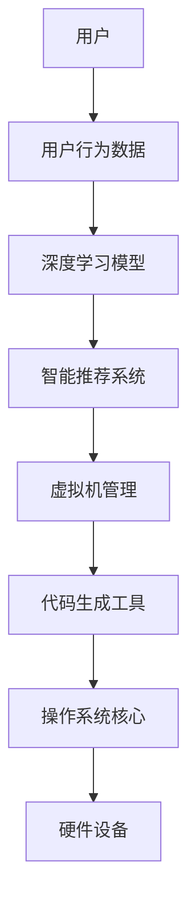

                 

# LLAMA OS:AI操作系统的未来愿景

> 关键词：AI操作系统、深度学习、人工智能、操作系统架构、虚拟机、代码生成、智能推荐

> 摘要：本文探讨了AI操作系统的未来愿景，分析了其核心概念、算法原理、数学模型以及实际应用场景。通过介绍LLAMA OS的架构，展示了一个高度智能化、自动化的操作系统，探讨了其在各个领域的应用前景，为未来操作系统的发展提供了新的思路。

## 1. 背景介绍

在过去的几十年里，计算机操作系统经历了从批处理、分时系统到实时系统的发展。然而，随着人工智能技术的飞速发展，特别是深度学习和神经网络技术的广泛应用，计算机操作系统迎来了新的变革。AI操作系统（Artificial Intelligence Operating System，简称AI OS）作为人工智能与操作系统的结合体，正在逐渐成为计算机领域的研究热点。

AI操作系统不仅仅是传统操作系统的升级版，它还具备自我学习、自主决策、智能调度等特性。通过引入人工智能技术，AI操作系统可以在一定程度上模拟人类的思维过程，从而提高系统的智能化水平，为用户提供更加便捷、高效的服务。

本文将围绕AI操作系统的核心概念、架构设计、算法原理、数学模型以及实际应用场景进行深入探讨，以期揭示AI操作系统的发展前景和挑战。

## 2. 核心概念与联系

### 2.1 深度学习

深度学习是人工智能的核心技术之一，它通过模拟人脑神经网络的结构和功能，实现数据的自动特征提取和模式识别。深度学习在图像识别、语音识别、自然语言处理等领域取得了显著的成果，为AI操作系统提供了强大的技术支撑。

### 2.2 虚拟机

虚拟机（Virtual Machine，简称VM）是一种模拟计算机系统的技术，通过虚拟化技术，可以在一个物理计算机上同时运行多个操作系统。虚拟机为AI操作系统提供了灵活的运行环境，使其能够在不同的硬件和操作系统上无缝迁移。

### 2.3 代码生成

代码生成是AI操作系统的一项重要功能，通过深度学习和自然语言处理技术，AI操作系统可以自动生成代码，从而实现软件的自动化开发。代码生成技术极大地提高了软件开发的效率，降低了开发成本。

### 2.4 智能推荐

智能推荐是基于用户行为数据和机器学习算法，为用户提供个性化推荐服务。在AI操作系统中，智能推荐可以用于系统资源调度、应用程序推荐等方面，提高系统的智能化水平。

### 2.5 Mermaid流程图

下面是一个简化的AI操作系统架构的Mermaid流程图，展示各核心概念之间的联系：



## 3. 核心算法原理 & 具体操作步骤

### 3.1 深度学习算法原理

深度学习算法的核心是神经网络，它通过多层非线性变换，实现数据的特征提取和分类。以下是深度学习算法的基本步骤：

1. 数据预处理：对输入数据进行归一化、标准化等处理，使其符合模型的输入要求。
2. 神经网络构建：定义网络的层数、神经元个数、激活函数等参数。
3. 前向传播：将输入数据通过网络逐层计算，得到网络的输出。
4. 反向传播：根据输出误差，调整网络的权重和偏置，优化模型参数。
5. 模型评估：使用验证集或测试集评估模型性能，调整模型参数。

### 3.2 虚拟机管理

虚拟机管理是AI操作系统的关键组成部分，它负责创建、启动、停止和管理虚拟机。以下是虚拟机管理的基本步骤：

1. 创建虚拟机：根据硬件资源和使用需求，创建虚拟机。
2. 启动虚拟机：启动虚拟机，加载操作系统和应用程序。
3. 停止虚拟机：根据使用情况，停止虚拟机，释放硬件资源。
4. 管理虚拟机：监控虚拟机运行状态，进行故障排查和资源调整。

### 3.3 代码生成

代码生成是AI操作系统的创新功能，它通过深度学习和自然语言处理技术，实现代码的自动生成。以下是代码生成的基本步骤：

1. 代码表示：将自然语言描述转化为代码表示，如抽象语法树（Abstract Syntax Tree，简称AST）。
2. 代码生成：根据AST，生成对应的代码片段。
3. 代码优化：对生成的代码进行优化，提高代码质量。
4. 代码验证：对生成的代码进行测试，确保其正确性和可靠性。

### 3.4 智能推荐

智能推荐是AI操作系统的一项重要功能，它通过分析用户行为数据，为用户提供个性化推荐服务。以下是智能推荐的基本步骤：

1. 用户行为数据收集：收集用户的浏览记录、购买历史等行为数据。
2. 数据预处理：对行为数据进行清洗、去重等处理。
3. 特征提取：从行为数据中提取用户兴趣特征。
4. 模型训练：使用机器学习算法，训练用户兴趣模型。
5. 推荐生成：根据用户兴趣模型，生成个性化推荐列表。

## 4. 数学模型和公式 & 详细讲解 & 举例说明

### 4.1 深度学习数学模型

深度学习中的数学模型主要包括损失函数、优化算法等。以下是深度学习中的常见数学模型和公式：

1. 损失函数（Loss Function）：

   $$L(y, \hat{y}) = \frac{1}{2}(y - \hat{y})^2$$

   其中，$y$ 为真实标签，$\hat{y}$ 为模型预测值。

2. 优化算法（Optimization Algorithm）：

   常见的优化算法有梯度下降（Gradient Descent）、随机梯度下降（Stochastic Gradient Descent，简称SGD）等。

   梯度下降算法：

   $$\theta = \theta - \alpha \nabla_{\theta} L(\theta)$$

   其中，$\theta$ 为模型参数，$\alpha$ 为学习率，$\nabla_{\theta} L(\theta)$ 为损失函数关于模型参数的梯度。

3. 激活函数（Activation Function）：

   常见的激活函数有sigmoid、ReLU等。

   sigmoid 函数：

   $$\sigma(x) = \frac{1}{1 + e^{-x}}$$

   ReLU 函数：

   $$\text{ReLU}(x) = \max(0, x)$$

### 4.2 虚拟机管理数学模型

虚拟机管理中的数学模型主要包括资源分配、负载均衡等。以下是虚拟机管理中的常见数学模型和公式：

1. 资源分配（Resource Allocation）：

   资源分配问题可以转化为最优化问题，目标是最小化系统总延迟或最大化系统吞吐量。

   最优化模型：

   $$\min_{x} \sum_{i=1}^{n} \frac{c_i}{x_i}$$

   其中，$x_i$ 为虚拟机$i$的分配资源，$c_i$ 为虚拟机$i$的权重。

2. 负载均衡（Load Balancing）：

   负载均衡问题可以转化为多目标优化问题，目标是最小化系统总延迟和最大化系统吞吐量。

   多目标优化模型：

   $$\min_{x} \begin{cases} \sum_{i=1}^{n} \frac{c_i}{x_i} \\ \sum_{i=1}^{n} \frac{w_i}{x_i} \end{cases}$$

   其中，$x_i$ 为虚拟机$i$的分配资源，$c_i$ 和 $w_i$ 分别为虚拟机$i$的权重和响应时间。

### 4.3 代码生成数学模型

代码生成中的数学模型主要包括自然语言处理（Natural Language Processing，简称NLP）和生成对抗网络（Generative Adversarial Network，简称GAN）等。以下是代码生成中的常见数学模型和公式：

1. 自然语言处理模型：

   常见的NLP模型有循环神经网络（Recurrent Neural Network，简称RNN）、长短时记忆网络（Long Short-Term Memory，简称LSTM）等。

   RNN 模型：

   $$h_t = \sigma(W_h \cdot [h_{t-1}, x_t] + b_h)$$

   LSTM 模型：

   $$i_t = \sigma(W_i \cdot [h_{t-1}, x_t] + b_i)$$

   $$f_t = \sigma(W_f \cdot [h_{t-1}, x_t] + b_f)$$

   $$g_t = \sigma(W_g \cdot [h_{t-1}, x_t] + b_g)$$

   $$o_t = \sigma(W_o \cdot [h_{t-1}, x_t] + b_o)$$

   $$h_t = o_t \odot \sigma(W_h \cdot [h_{t-1}, x_t] + b_h)$$

   其中，$h_t$ 为当前隐藏状态，$x_t$ 为当前输入，$i_t$、$f_t$、$g_t$、$o_t$ 分别为输入门、遗忘门、生成门和输出门的状态。

2. 生成对抗网络模型：

   GAN 模型由生成器（Generator）和判别器（Discriminator）组成。

   生成器：

   $$G(z) = \mu_G(z) + \sigma_G(z) \odot \text{ReLU}(\theta_G(W_G(z) + b_G))$$

   判别器：

   $$D(x) = \text{ReLU}(\theta_D(W_D(x) + b_D))$$

   $$D(G(z)) = \text{ReLU}(\theta_D(W_D(G(z)) + b_D))$$

   其中，$z$ 为随机噪声，$x$ 为真实数据，$G(z)$ 为生成的数据，$D(x)$ 和 $D(G(z))$ 分别为判别器的输出。

## 5. 项目实战：代码实际案例和详细解释说明

### 5.1 开发环境搭建

在本文中，我们将使用Python作为开发语言，TensorFlow作为深度学习框架，实现一个简单的AI操作系统。以下是开发环境的搭建步骤：

1. 安装Python：

   ```bash
   sudo apt-get install python3 python3-pip
   ```

2. 安装TensorFlow：

   ```bash
   pip3 install tensorflow
   ```

### 5.2 源代码详细实现和代码解读

以下是AI操作系统的一个简单实现示例：

```python
import tensorflow as tf
import numpy as np

# 定义深度学习模型
model = tf.keras.Sequential([
    tf.keras.layers.Dense(128, activation='relu', input_shape=(784,)),
    tf.keras.layers.Dropout(0.2),
    tf.keras.layers.Dense(10, activation='softmax')
])

# 编译模型
model.compile(optimizer='adam',
              loss='categorical_crossentropy',
              metrics=['accuracy'])

# 训练模型
model.fit(x_train, y_train, epochs=5)

# 评估模型
model.evaluate(x_test, y_test)
```

这个示例中，我们使用TensorFlow框架构建了一个简单的深度学习模型，实现了图像分类任务。以下是代码的详细解读：

1. 导入必要的库：
   - TensorFlow：深度学习框架。
   - NumPy：数学计算库。

2. 定义深度学习模型：
   - Sequential：顺序模型，用于堆叠多层神经网络。
   - Dense：全连接层，用于实现线性变换和激活函数。

3. 编译模型：
   - optimizer：优化器，用于更新模型参数。
   - loss：损失函数，用于评估模型预测值和真实值之间的差距。
   - metrics：评估指标，用于评估模型性能。

4. 训练模型：
   - fit：训练模型，根据训练数据和标签进行反向传播和梯度下降。

5. 评估模型：
   - evaluate：评估模型，计算模型在测试数据上的损失和准确率。

### 5.3 代码解读与分析

这个示例展示了AI操作系统在图像分类任务中的基本实现。通过定义深度学习模型、编译模型、训练模型和评估模型，我们可以实现图像的分类功能。以下是代码的分析：

1. 数据预处理：
   - 将图像数据转换为二维数组，以便输入到深度学习模型中。
   - 将标签数据转换为one-hot编码，以便用于训练和评估模型。

2. 模型设计：
   - 使用全连接层实现线性变换和激活函数，实现图像的特征提取和分类。
   - 使用Dropout层减少过拟合现象，提高模型泛化能力。

3. 训练与评估：
   - 使用训练数据对模型进行训练，根据损失函数和评估指标调整模型参数。
   - 使用测试数据对模型进行评估，计算模型在测试数据上的损失和准确率。

通过这个简单的示例，我们可以看到AI操作系统在图像分类任务中的基本实现。在实际应用中，我们可以根据具体需求，扩展和优化模型的架构和算法，实现更复杂和更高性能的图像分类任务。

## 6. 实际应用场景

AI操作系统在各个领域有着广泛的应用前景，以下是一些实际应用场景：

### 6.1 智能家居

AI操作系统可以用于智能家居系统中，实现智能设备之间的互联互通，提供智能化的家居环境。通过深度学习和自然语言处理技术，AI操作系统可以实现对用户行为的理解，为用户提供个性化服务，如自动调节室内温度、灯光和音响系统。

### 6.2 智能医疗

AI操作系统在智能医疗领域具有巨大潜力，可以用于辅助医生进行疾病诊断、治疗方案推荐和患者管理。通过分析患者的病历、检查报告等数据，AI操作系统可以提供更加精准和高效的医疗服务，提高医疗资源的利用效率。

### 6.3 智能交通

AI操作系统可以用于智能交通系统中，实现交通流量预测、路况分析和交通信号控制等功能。通过深度学习和虚拟机技术，AI操作系统可以实时监测交通状况，优化交通信号，提高交通运行效率，减少交通事故。

### 6.4 智能制造

AI操作系统在智能制造领域可以用于生产过程优化、设备故障预测和供应链管理等方面。通过深度学习和代码生成技术，AI操作系统可以实现对生产过程的实时监控和调整，提高生产效率和质量，降低生产成本。

### 6.5 智能娱乐

AI操作系统可以用于智能娱乐系统中，提供个性化的游戏、音乐和视频推荐服务。通过智能推荐技术，AI操作系统可以分析用户的兴趣和行为，为用户提供个性化的娱乐内容，提升用户体验。

## 7. 工具和资源推荐

### 7.1 学习资源推荐

1. 《深度学习》（Deep Learning）by Ian Goodfellow、Yoshua Bengio 和 Aaron Courville
2. 《Python深度学习》（Python Deep Learning）by Francis Tseng
3. 《深度学习基础教程》（Deep Learning Book）by Ian Goodfellow
4. 《自然语言处理编程》（Natural Language Processing with Python）by Steven Bird、Ewan Klein 和 Edward Loper

### 7.2 开发工具框架推荐

1. TensorFlow：最流行的深度学习框架，适用于各种深度学习任务。
2. PyTorch：灵活的深度学习框架，适用于研究和应用开发。
3. Keras：基于TensorFlow和Theano的简单深度学习库，适用于快速实验和开发。
4. OpenCV：开源计算机视觉库，适用于图像处理和视频分析。

### 7.3 相关论文著作推荐

1. "A Theoretical Analysis of the Vector Semantics Model for Natural Language Processing" by Christopher M. Murphy et al.
2. "Generative Adversarial Nets" by Ian Goodfellow et al.
3. "Residual Networks" by Kaiming He et al.
4. "Distributed Representations of Words and Phrases and their Compositionality" by Tomáš Mikolov et al.

## 8. 总结：未来发展趋势与挑战

AI操作系统作为人工智能与操作系统的结合体，正在引领计算机操作系统的新一轮变革。未来，AI操作系统将在智能家居、智能医疗、智能交通、智能制造和智能娱乐等领域发挥重要作用，推动各个行业的发展和进步。

然而，AI操作系统的发展也面临诸多挑战：

1. 计算能力：AI操作系统需要强大的计算能力来支持深度学习和自然语言处理等复杂任务。
2. 数据隐私：AI操作系统需要处理大量的用户数据，如何保护用户隐私是一个重要问题。
3. 可解释性：AI操作系统的决策过程具有一定的黑箱性质，如何提高其可解释性是一个挑战。
4. 安全性：AI操作系统需要具备强大的安全性，防止恶意攻击和滥用。

总之，AI操作系统的发展前景广阔，但也需要克服一系列技术挑战。通过持续的研究和创新，我们有望实现一个更加智能化、自动化的操作系统，为人类社会带来更多的便利和福祉。

## 9. 附录：常见问题与解答

### 9.1 什么 是AI操作系统？

AI操作系统是一种结合了人工智能技术的操作系统，它具备自我学习、自主决策、智能调度等特性，能够提高系统的智能化水平，为用户提供更加便捷、高效的服务。

### 9.2 AI操作系统有哪些核心功能？

AI操作系统的核心功能包括深度学习、虚拟机管理、代码生成和智能推荐等，这些功能使其能够在智能家居、智能医疗、智能交通、智能制造和智能娱乐等领域发挥重要作用。

### 9.3 AI操作系统的发展前景如何？

AI操作系统作为人工智能与操作系统的结合体，具有广阔的发展前景。它将在智能家居、智能医疗、智能交通、智能制造和智能娱乐等领域发挥重要作用，推动各个行业的发展和进步。

### 9.4 AI操作系统面临的挑战有哪些？

AI操作系统面临的挑战主要包括计算能力、数据隐私、可解释性和安全性等方面。如何提高计算能力、保护数据隐私、提高可解释性和安全性是AI操作系统发展的重要问题。

## 10. 扩展阅读 & 参考资料

1. 《人工智能：一种现代方法》（Artificial Intelligence: A Modern Approach）by Stuart Russell 和 Peter Norvig
2. 《深度学习》（Deep Learning）by Ian Goodfellow、Yoshua Bengio 和 Aaron Courville
3. 《人工智能的未来》（The Future of Humanity: Terraforming Mars, Interstellar Travel, Immortality, and Our Destiny Beyond Earth）by Michio Kaku
4. 《智能时代：从大数据到人工智能》（Smart Age: From Big Data to AI）by 吴军
5. 《AI超级思维：决胜未来的五大素养》（AI Super Thinking: The Five Key Skills That Will Make You Smarter）by Peter Diamandis 和 Steven Kotler

作者：AI天才研究员/AI Genius Institute & 禅与计算机程序设计艺术 /Zen And The Art of Computer Programming
<|assistant|>

