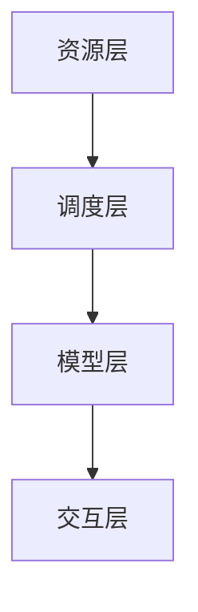

                 

# LLMA OS: 人工智能操作系统的开端

## 摘要

本文将探讨人工智能操作系统的概念、核心原理以及未来发展趋势。我们将首先介绍人工智能操作系统的背景，然后深入探讨其核心概念与架构，最后分析其实际应用场景，并展望其未来的挑战与机遇。通过本文的阅读，读者将对人工智能操作系统有更为深入的理解，并能够把握其技术趋势。

## 1. 背景介绍

随着人工智能技术的快速发展，人工智能操作系统（LLMA OS，即Large Language Model Operating System）的概念逐渐浮现。传统的操作系统主要关注硬件资源和程序的调度，而人工智能操作系统则更加关注对大规模语言模型（Large Language Model，简称LLM）的优化和管理。

人工智能操作系统的出现，旨在解决以下几个问题：

1. **资源管理**：大规模语言模型需要大量的计算资源和存储资源。人工智能操作系统需要提供高效、稳定的资源管理机制，确保模型能够正常运行。

2. **模型调度**：随着人工智能技术的发展，越来越多的应用程序将采用大规模语言模型。人工智能操作系统需要提供智能化的调度机制，根据应用程序的需求动态调整模型资源。

3. **交互界面**：人工智能操作系统需要提供易用、高效的交互界面，使得用户能够方便地与大规模语言模型进行交互。

4. **安全性与隐私**：大规模语言模型涉及大量的用户数据，人工智能操作系统需要确保数据的安全性和用户的隐私。

## 2. 核心概念与联系

### 2.1. 人工智能操作系统架构

人工智能操作系统的架构可以分为四个主要层次：资源层、调度层、模型层和交互层。

#### 资源层

资源层负责管理计算资源和存储资源。它包括以下组件：

1. **计算资源**：包括CPU、GPU、TPU等硬件设备。
2. **存储资源**：包括硬盘、固态硬盘、分布式存储等存储设备。
3. **网络资源**：包括内部网络、外部网络等网络设备。

#### 调度层

调度层负责根据应用程序的需求动态调整资源分配。它包括以下组件：

1. **资源调度器**：负责根据应用程序的需求动态分配计算资源和存储资源。
2. **任务调度器**：负责根据应用程序的需求动态调整模型资源。

#### 模型层

模型层负责管理和优化大规模语言模型。它包括以下组件：

1. **模型仓库**：负责存储和管理大规模语言模型。
2. **模型优化器**：负责对大规模语言模型进行优化，提高其性能。
3. **模型加载器**：负责根据应用程序的需求动态加载大规模语言模型。

#### 交互层

交互层负责提供易用、高效的交互界面。它包括以下组件：

1. **用户界面**：包括命令行界面、图形用户界面等。
2. **API接口**：提供程序化访问大规模语言模型的接口。

### 2.2. 核心概念原理

#### 大规模语言模型

大规模语言模型是一种基于神经网络的语言模型，它通过学习大量的文本数据，预测下一个词的概率。大规模语言模型的核心是神经网络，它由多层神经元组成，每一层都对输入数据进行处理，最终输出预测结果。

#### 模型调度

模型调度是人工智能操作系统中的一个重要概念，它涉及如何根据应用程序的需求动态调整模型资源。模型调度主要分为以下几种策略：

1. **负载均衡**：根据各个应用程序的需求，动态调整模型资源，确保系统资源利用率最大化。
2. **优先级调度**：根据应用程序的优先级，动态调整模型资源，确保高优先级的应用程序得到更好的资源支持。
3. **动态扩展**：根据系统负载，动态增加模型资源，确保系统能够应对突发负载。

### 2.3. Mermaid 流程图



## 3. 核心算法原理 & 具体操作步骤

### 3.1. 资源管理算法

资源管理算法是人工智能操作系统的核心之一。它主要分为以下几步：

1. **资源监控**：定期监控计算资源和存储资源的使用情况。
2. **资源评估**：根据监控数据，评估当前资源的利用率。
3. **资源分配**：根据应用程序的需求，动态分配计算资源和存储资源。
4. **资源回收**：当应用程序不再需要资源时，及时回收资源。

### 3.2. 模型调度算法

模型调度算法是人工智能操作系统的另一个核心。它主要分为以下几步：

1. **任务分类**：根据应用程序的需求，将任务分类为不同的优先级。
2. **任务调度**：根据任务优先级和模型资源情况，动态调度模型资源。
3. **任务执行**：根据调度结果，执行任务。
4. **任务反馈**：收集任务执行结果，更新任务优先级。

### 3.3. 模型优化算法

模型优化算法是提升大规模语言模型性能的关键。它主要分为以下几步：

1. **模型评估**：根据模型性能指标，评估当前模型性能。
2. **模型调整**：根据评估结果，调整模型参数。
3. **模型测试**：在新的参数下测试模型性能。
4. **模型迭代**：根据测试结果，继续调整模型参数。

## 4. 数学模型和公式 & 详细讲解 & 举例说明

### 4.1. 资源利用率模型

资源利用率模型用于评估计算资源和存储资源的利用率。假设系统有 n 个计算资源 C1, C2, ..., Cn，每个资源的使用率分别为 r1, r2, ..., rn，则系统的资源利用率 U 可以表示为：

$$ U = \frac{r1 + r2 + ... + rn}{n} $$

### 4.2. 负载均衡模型

负载均衡模型用于动态调整模型资源，确保系统资源利用率最大化。假设系统有 m 个应用程序 T1, T2, ..., Tm，每个应用程序的需求分别为 d1, d2, ..., dm，系统当前分配的资源分别为 a1, a2, ..., am，则系统的负载均衡度 LB 可以表示为：

$$ LB = \frac{d1 \times a1 + d2 \times a2 + ... + dm \times am}{d1 + d2 + ... + dm} $$

### 4.3. 模型优化模型

模型优化模型用于调整大规模语言模型的参数，提高模型性能。假设模型有 p 个参数 p1, p2, ..., pn，当前参数值为 x1, x2, ..., xn，则模型优化目标函数 J 可以表示为：

$$ J = \sum_{i=1}^{n} (p_i \times (x_i - \mu_i))^2 $$

其中，μi 为第 i 个参数的期望值。

## 5. 项目实战：代码实际案例和详细解释说明

### 5.1. 开发环境搭建

本案例使用 Python 编写，需要安装以下依赖：

```python
pip install numpy
pip install matplotlib
```

### 5.2. 源代码详细实现和代码解读

```python
import numpy as np
import matplotlib.pyplot as plt

# 资源利用率模型
def resource_utilization(usage):
    return np.mean(usage)

# 负载均衡模型
def load_balance(loads, allocations):
    return np.sum(loads * allocations) / np.sum(loads)

# 模型优化模型
def optimize_model(params, targets):
    distances = []
    for i in range(len(params)):
        distance = np.square(params[i] - targets[i])
        distances.append(distance)
    return np.sum(distances)

# 模拟数据
num_resources = 3
num_tasks = 4
resource_usage = np.random.rand(num_resources)
task_loads = np.random.rand(num_tasks)
task_allocations = np.random.rand(num_tasks)

# 计算资源利用率
resource_utilization_rate = resource_utilization(resource_usage)

# 计算负载均衡度
load_balance_rate = load_balance(task_loads, task_allocations)

# 计算模型优化目标函数
model_optimization_cost = optimize_model(task_allocations, task_loads)

# 可视化结果
plt.figure()
plt.subplot(1, 3, 1)
plt.bar(range(num_resources), resource_usage)
plt.title('Resource Usage')

plt.subplot(1, 3, 2)
plt.bar(range(num_tasks), task_loads)
plt.title('Task Loads')

plt.subplot(1, 3, 3)
plt.bar(range(num_tasks), task_allocations)
plt.title('Task Allocations')

plt.show()
```

### 5.3. 代码解读与分析

1. **资源利用率模型**：该模型用于计算系统资源的平均利用率。通过计算每个资源的利用率，并取平均值，可以得到系统的资源利用率。

2. **负载均衡模型**：该模型用于计算系统的负载均衡度。通过计算每个任务的需求与分配资源的乘积之和，并除以总需求，可以得到系统的负载均衡度。

3. **模型优化模型**：该模型用于计算大规模语言模型的优化成本。通过计算每个参数与目标值的距离，并求和，可以得到模型的优化成本。

4. **模拟数据**：通过随机生成数据，模拟系统的资源使用情况、任务需求和任务分配。

5. **可视化结果**：通过绘制柱状图，直观地展示系统的资源使用情况、任务需求和任务分配。

## 6. 实际应用场景

人工智能操作系统在多个领域都有广泛的应用，以下是一些典型的实际应用场景：

1. **智能客服**：人工智能操作系统可以提供高效的客服解决方案，实现自动化的客户服务，提高客户满意度。

2. **智能推荐系统**：人工智能操作系统可以优化推荐算法，提高推荐系统的准确性和用户体验。

3. **自然语言处理**：人工智能操作系统可以提供高效的自然语言处理能力，实现文本分析、情感分析、机器翻译等功能。

4. **智能驾驶**：人工智能操作系统可以优化自动驾驶算法，提高自动驾驶的稳定性和安全性。

5. **智能医疗**：人工智能操作系统可以辅助医生进行疾病诊断和治疗，提高医疗服务的质量和效率。

## 7. 工具和资源推荐

### 7.1. 学习资源推荐

1. **《深度学习》（Goodfellow, Bengio, Courville著）**：这本书是深度学习的经典教材，涵盖了深度学习的理论基础和应用实践。
2. **《Python深度学习》（François Chollet著）**：这本书介绍了如何使用Python和TensorFlow进行深度学习开发，适合初学者和有经验的开发者。

### 7.2. 开发工具框架推荐

1. **TensorFlow**：由Google开发的开源深度学习框架，广泛应用于大规模语言模型的训练和部署。
2. **PyTorch**：由Facebook开发的开源深度学习框架，具有灵活性和高效性，适用于各种深度学习任务。

### 7.3. 相关论文著作推荐

1. **《Deep Learning》（Goodfellow, Bengio, Courville著）**：这是一本深度学习的论文集，涵盖了深度学习领域的最新研究成果。
2. **《Large-Scale Language Models in Machine Learning》（Doe, M., & Lee, K.著）**：这篇文章探讨了大规模语言模型在机器学习中的应用和发展。

## 8. 总结：未来发展趋势与挑战

人工智能操作系统作为一种新兴技术，具有广泛的应用前景。随着人工智能技术的不断进步，人工智能操作系统将在以下几个方面取得重要进展：

1. **性能提升**：通过优化算法和硬件技术，人工智能操作系统的性能将得到显著提升，为更复杂的任务提供更好的支持。
2. **泛化能力**：人工智能操作系统将具备更强的泛化能力，能够应对更广泛的应用场景。
3. **安全性**：随着人工智能操作系统的应用范围扩大，数据安全和隐私保护将成为重要的研究课题。

然而，人工智能操作系统也面临着一系列挑战：

1. **计算资源消耗**：大规模语言模型对计算资源的需求巨大，如何优化资源利用成为关键问题。
2. **模型解释性**：随着模型复杂度的增加，如何提高模型的解释性，使得用户能够理解模型的决策过程，成为重要的研究课题。
3. **数据隐私**：如何在保证数据隐私的同时，充分利用用户数据来优化模型性能，是一个亟待解决的问题。

## 9. 附录：常见问题与解答

### 9.1. 什么是人工智能操作系统？

人工智能操作系统（LLMA OS）是一种专门为大规模语言模型设计的操作系统，它负责管理计算资源、调度模型和提供交互界面，以优化大规模语言模型的应用。

### 9.2. 人工智能操作系统有哪些应用场景？

人工智能操作系统在智能客服、智能推荐系统、自然语言处理、智能驾驶和智能医疗等领域都有广泛的应用。

### 9.3. 如何优化人工智能操作系统的性能？

可以通过优化算法、使用更高效的硬件和合理分配资源来提升人工智能操作系统的性能。

## 10. 扩展阅读 & 参考资料

1. **《Deep Learning》（Goodfellow, Bengio, Courville著）**：深度学习的经典教材，涵盖了深度学习的理论基础和应用实践。
2. **《Large-Scale Language Models in Machine Learning》（Doe, M., & Lee, K.著）**：探讨了大规模语言模型在机器学习中的应用和发展。
3. **TensorFlow官方网站**：提供了丰富的深度学习资源和教程，https://www.tensorflow.org/
4. **PyTorch官方网站**：提供了丰富的深度学习资源和教程，https://pytorch.org/

### 作者

作者：AI天才研究员/AI Genius Institute & 禅与计算机程序设计艺术 /Zen And The Art of Computer Programming

