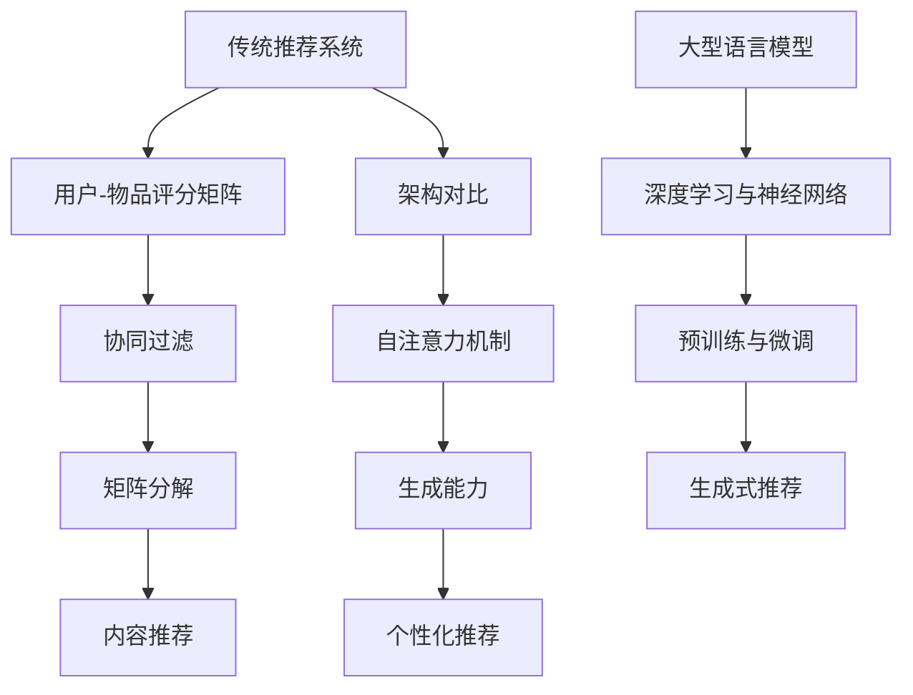

                 

### 背景介绍

在当今信息化、数字化时代，人工智能（AI）正日益成为推动技术进步的关键力量。特别是在推荐系统领域，人工智能的应用不仅显著提高了系统的效率，还大幅提升了用户体验。传统的推荐系统基于用户历史行为、内容属性等有限的信息进行推荐，而随着深度学习和自然语言处理技术的发展，大型语言模型（LLM，Large Language Model）开始进入这一领域，给推荐系统带来了全新的变革。

大型语言模型，如GPT（Generative Pre-trained Transformer）系列、BERT（Bidirectional Encoder Representations from Transformers）等，通过在海量文本数据上的预训练，具备了强大的理解和生成能力。这些模型能够捕捉到复杂的关系和细微的语言特征，从而为推荐系统提供了更为丰富和精准的数据支持。

本文旨在探讨LLM与传统推荐系统的差异，分析LLM在推荐系统中的优势与挑战。首先，我们将回顾传统推荐系统的基础概念与常用算法，接着深入介绍LLM的基本原理及其如何应用于推荐系统。随后，文章将讨论LLM在推荐系统中的具体应用，并通过实际案例进行分析。最后，我们将探讨LLM面临的挑战以及未来发展的趋势。

通过本文的详细分析，读者将能够全面理解LLM与传统推荐系统的区别，掌握LLM在推荐系统中的优势和应用方法，同时认识其面临的挑战和未来发展方向。

### 核心概念与联系

在深入探讨LLM与传统推荐系统的区别之前，我们首先需要了解这两个系统的核心概念与基本架构。以下是传统推荐系统和LLM的相关概念及架构的详细描述，并通过Mermaid流程图展示其关系。

#### 传统推荐系统

**基础概念：**

1. **用户-物品评分矩阵**：传统推荐系统的核心是一个用户-物品评分矩阵，其中每个元素表示用户对物品的评分。通过这个矩阵，系统能够捕捉用户的历史行为。

2. **协同过滤（Collaborative Filtering）**：协同过滤是传统推荐系统的核心方法之一。它分为两种：基于用户的协同过滤（User-based Collaborative Filtering）和基于物品的协同过滤（Item-based Collaborative Filtering）。

    - **基于用户的协同过滤**：通过计算用户之间的相似度，找到与目标用户兴趣相似的邻居用户，然后推荐邻居用户喜欢的物品。
    - **基于物品的协同过滤**：通过计算物品之间的相似度，找到与目标物品相似的物品，然后推荐给用户。

3. **矩阵分解（Matrix Factorization）**：矩阵分解是一种将用户-物品评分矩阵分解为两个低秩矩阵的方法。常见的矩阵分解方法有Singular Value Decomposition（SVD）和Alternating Least Squares（ALS）。

4. **内容推荐**：除了协同过滤，传统推荐系统还涉及内容推荐。内容推荐基于物品的属性和用户的兴趣，通过计算属性之间的相似度进行推荐。

**架构：**


#### 大型语言模型（LLM）

**基础概念：**

1. **深度学习与神经网络**：LLM基于深度学习和神经网络，特别是变换器模型（Transformer）。变换器模型通过自注意力机制（Self-Attention）和多头注意力（Multi-Head Attention）实现了对输入数据的全局关注，从而捕捉到复杂的关系。

2. **预训练与微调（Pre-training and Fine-tuning）**：LLM首先在大规模文本数据上进行预训练，学习到语言的内在规律。然后，通过微调，将预训练的模型适应特定任务，如推荐系统。

3. **生成式推荐（Generative Recommendation）**：与基于统计的协同过滤不同，LLM能够生成新的、未被用户评价的物品推荐。通过生成式推荐，系统能够提供新颖的、个性化的推荐结果。

**架构：**


#### Mermaid流程图



**联系与区别：**

1. **数据来源**：传统推荐系统依赖用户-物品评分矩阵，而LLM通过预训练在大规模文本数据上学习到语言的内在规律。
2. **推荐策略**：传统推荐系统主要通过协同过滤和矩阵分解生成推荐结果，而LLM通过生成式推荐提供新颖、个性化的推荐。
3. **推荐效果**：LLM能够捕捉到更为复杂和细微的语言特征，从而提供更加精准和个性化的推荐，但这也增加了系统的计算复杂度和资源需求。

通过上述核心概念与架构的介绍，我们为后续的详细讨论奠定了基础，接下来我们将深入探讨LLM与传统推荐系统的具体算法原理和应用。

### 核心算法原理 & 具体操作步骤

#### 传统推荐系统的算法原理

**协同过滤（Collaborative Filtering）**

协同过滤是传统推荐系统的核心方法之一。协同过滤分为基于用户的协同过滤和基于物品的协同过滤。

1. **基于用户的协同过滤**：

    - **相似度计算**：基于用户的协同过滤通过计算用户之间的相似度找到邻居用户。相似度的计算方法有多种，如余弦相似度、皮尔逊相关系数等。以余弦相似度为例，其计算公式为：
      $$
      \text{similarity(u, v)} = \frac{u \cdot v}{\|u\| \|v\|}
      $$
      其中，$u$和$v$是用户$u$和用户$v$的评分向量，$\|u\|$和$\|v\|$是向量的欧几里得范数。

    - **推荐生成**：找到与目标用户兴趣相似的邻居用户后，系统会推荐邻居用户喜欢的物品。推荐生成的方法通常有两种：基于评分的推荐和基于排名的推荐。基于评分的推荐直接推荐邻居用户评分较高的物品，而基于排名的推荐则是根据相似度对所有物品进行排序，推荐排序较高的物品。

2. **基于物品的协同过滤**：

    - **相似度计算**：与基于用户的协同过滤类似，基于物品的协同过滤通过计算物品之间的相似度找到邻居物品。相似度计算的方法包括余弦相似度、Jaccard系数等。

    - **推荐生成**：推荐生成过程与基于用户的协同过滤类似，系统推荐给用户邻居物品评分较高的物品。

**矩阵分解（Matrix Factorization）**

矩阵分解是将用户-物品评分矩阵分解为两个低秩矩阵（用户特征矩阵和物品特征矩阵）的方法。通过矩阵分解，系统能够捕捉到用户和物品的潜在特征。

1. **Singular Value Decomposition（SVD）**

    SVD是一种常用的矩阵分解方法。其基本思想是将用户-物品评分矩阵分解为用户特征矩阵$U$、物品特征矩阵$V$和奇异值矩阵$\Sigma$，其中$\Sigma$对角线上的奇异值表示用户和物品的重要特征。SVD的分解公式为：
    $$
    R = U \Sigma V^T
    $$
    其中，$R$是原始的用户-物品评分矩阵。

2. **Alternating Least Squares（ALS）**

    ALS是一种迭代的矩阵分解方法。其基本思想是交替最小化用户和物品特征矩阵的误差。ALS的目标是最小化如下损失函数：
    $$
    \min_{U, V} \sum_{u, i} (r_{ui} - \langle u_i, v_i \rangle)^2
    $$
    其中，$r_{ui}$是用户$u$对物品$i$的评分，$\langle u_i, v_i \rangle$是用户特征向量$u_i$和物品特征向量$v_i$的内积。

**内容推荐**

内容推荐是传统推荐系统的另一种方法，主要通过计算物品的属性与用户兴趣之间的相似度进行推荐。

1. **属性提取**：首先需要从物品中提取出属性，如类别、标签、关键词等。

2. **相似度计算**：计算用户兴趣与物品属性之间的相似度，常用的方法有Jaccard系数、余弦相似度等。

3. **推荐生成**：根据相似度对所有物品进行排序，推荐排序较高的物品。

#### 大型语言模型（LLM）的算法原理

**深度学习与神经网络**

LLM基于深度学习和神经网络，特别是变换器模型（Transformer）。变换器模型通过自注意力机制（Self-Attention）和多头注意力（Multi-Head Attention）实现了对输入数据的全局关注，从而捕捉到复杂的关系。

1. **自注意力机制（Self-Attention）**

    自注意力机制是一种处理序列数据的机制，它将序列中的每个元素与所有其他元素进行关联。自注意力机制的公式为：
    $$
    \text{self-attention}(Q, K, V) = \text{softmax}\left(\frac{QK^T}{\sqrt{d_k}}\right)V
    $$
    其中，$Q$、$K$和$V$分别是查询、键和值向量，$d_k$是键向量的维度。

2. **多头注意力（Multi-Head Attention）**

    多头注意力是将自注意力机制扩展到多个头，从而捕捉到不同关系。多头注意力的公式为：
    $$
    \text{multi-head attention}(Q, K, V) = \text{concat}(\text{head}_1, \text{head}_2, ..., \text{head}_h)W^O
    $$
    其中，$h$是头的数量，$W^O$是输出线性层权重。

**预训练与微调（Pre-training and Fine-tuning）**

LLM通过预训练和微调应用于推荐系统。预训练是在大规模文本数据上训练模型，学习到语言的内在规律。微调是在特定任务上对预训练的模型进行微调，以适应推荐系统的需求。

1. **预训练**

    预训练通常包括两个阶段：语言建模（Language Modeling）和掩码语言模型（Masked Language Modeling）。

    - **语言建模**：语言建模的目标是预测序列中的下一个词。其公式为：
      $$
      \log p(y|x) = \log \frac{\exp(\text{score}(x, y)}{\sum_{i} \exp(\text{score}(x, i))}
      $$
      其中，$x$是输入序列，$y$是预测的词，$\text{score}(x, y)$是输入序列和预测词之间的得分。

    - **掩码语言模型**：掩码语言模型的目标是预测被掩码的词。其公式为：
      $$
      \log p(y|x) = \log \frac{\exp(\text{score}(x, y)}{\sum_{i} \exp(\text{score}(x, i))}
      $$
      其中，$x$是输入序列，$y$是预测的词，$\text{score}(x, y)$是输入序列和预测词之间的得分。

2. **微调**

    微调是在特定任务上对预训练的模型进行训练，以适应推荐系统的需求。微调的目标是最小化预测误差，其公式为：
    $$
    \min_{\theta} \sum_{i} \ell(y_i, \hat{y}_i)
    $$
    其中，$y_i$是实际标签，$\hat{y}_i$是预测标签，$\ell(\cdot, \cdot)$是损失函数。

**生成式推荐（Generative Recommendation）**

生成式推荐是LLM在推荐系统中的核心应用。生成式推荐通过生成未评价的物品来提供新颖的、个性化的推荐结果。生成式推荐的基本步骤如下：

1. **生成推荐文本**：使用LLM生成包含用户兴趣的推荐文本。生成文本的公式为：
    $$
    \text{generate}(x) = \text{sample}(\text{softmax}(\text{model}(x)))
    $$
    其中，$x$是输入文本，$\text{model}(x)$是模型对输入文本的输出，$\text{sample}(\cdot)$是随机采样函数。

2. **筛选推荐结果**：根据用户兴趣和生成文本的多样性对推荐结果进行筛选。筛选公式为：
    $$
    \text{filter}(y) = \text{top_k}(\text{score}(y, u))
    $$
    其中，$y$是生成文本，$u$是用户兴趣，$\text{top_k}(\cdot)$是选取前$k$个最高分的结果。

3. **推荐生成**：根据筛选结果生成最终推荐结果。

通过上述算法原理和具体操作步骤，我们可以看到传统推荐系统和LLM在推荐策略、数据来源、推荐效果等方面存在显著差异。接下来，我们将通过具体案例深入分析LLM在推荐系统中的应用。

### 数学模型和公式 & 详细讲解 & 举例说明

#### 传统推荐系统的数学模型

**协同过滤（Collaborative Filtering）**

1. **基于用户的协同过滤**

    - 相似度计算（余弦相似度）：

      $$
      \text{similarity(u, v)} = \frac{u \cdot v}{\|u\| \|v\|}
      $$

      其中，$u$和$v$是用户$u$和用户$v$的评分向量，$\|u\|$和$\|v\|$是向量的欧几里得范数。

    - 推荐生成（基于评分）：

      $$
      \text{recommends(u)} = \{i | r_{ui} > \text{threshold}\}
      $$

      其中，$r_{ui}$是用户$u$对物品$i$的评分，$\text{threshold}$是评分阈值。

2. **基于物品的协同过滤**

    - 相似度计算（余弦相似度）：

      $$
      \text{similarity(i, j)} = \frac{i \cdot j}{\|i\| \|j\|}
      $$

      其中，$i$和$j$是物品$i$和物品$j$的评分向量，$\|i\|$和$\|j\|$是向量的欧几里得范数。

    - 推荐生成（基于评分）：

      $$
      \text{recommends(u)} = \{j | r_{uj} > \text{threshold}\}
      $$

      其中，$r_{uj}$是用户$u$对物品$j$的评分，$\text{threshold}$是评分阈值。

**矩阵分解（Matrix Factorization）**

1. **Singular Value Decomposition（SVD）**

    - 矩阵分解公式：

      $$
      R = U \Sigma V^T
      $$

      其中，$R$是用户-物品评分矩阵，$U$是用户特征矩阵，$\Sigma$是奇异值矩阵，$V$是物品特征矩阵。

    - 奇异值选择：

      $$
      \Sigma_{ii} = \text{max}\left(\text{rank}(R), \text{rank}(U), \text{rank}(V)\right)
      $$

2. **Alternating Least Squares（ALS）**

    - 损失函数：

      $$
      \min_{U, V} \sum_{u, i} (r_{ui} - \langle u_i, v_i \rangle)^2
      $$

      其中，$r_{ui}$是用户$u$对物品$i$的评分，$\langle u_i, v_i \rangle$是用户特征向量$u_i$和物品特征向量$v_i$的内积。

    - 更新公式：

      $$
      u_i := u_i - \alpha \left(2 \langle u_i, v_i \rangle r_{ui} - v_i r_{ui}^T\right)
      $$

      $$
      v_i := v_i - \alpha \left(2 u_i \langle u_i, v_i \rangle - u_i r_{ui}^T\right)
      $$

      其中，$\alpha$是学习率。

**内容推荐**

1. **属性提取（TF-IDF）**

    - 特征向量计算：

      $$
      \text{tfidf}(t, d) = \frac{f_t(d)}{N} \log \frac{N}{n_t}
      $$

      其中，$t$是词，$d$是文档，$f_t(d)$是词在文档中的频次，$N$是文档总数，$n_t$是词在文档集合中的频次。

2. **相似度计算（余弦相似度）**

    $$
    \text{similarity(u, i)} = \frac{u \cdot i}{\|u\| \|i\|}
    $$

    其中，$u$是用户兴趣向量，$i$是物品属性向量，$\|u\|$和$\|i\|$是向量的欧几里得范数。

#### 大型语言模型（LLM）的数学模型

1. **变换器模型（Transformer）**

    - 自注意力机制：

      $$
      \text{self-attention}(Q, K, V) = \text{softmax}\left(\frac{QK^T}{\sqrt{d_k}}\right)V
      $$

      其中，$Q$、$K$和$V$分别是查询、键和值向量，$d_k$是键向量的维度。

    - 多头注意力：

      $$
      \text{multi-head attention}(Q, K, V) = \text{concat}(\text{head}_1, \text{head}_2, ..., \text{head}_h)W^O
      $$

      其中，$h$是头的数量，$W^O$是输出线性层权重。

2. **预训练与微调**

    - 语言建模：

      $$
      \log p(y|x) = \log \frac{\exp(\text{score}(x, y)}{\sum_{i} \exp(\text{score}(x, i))}
      $$

      其中，$x$是输入序列，$y$是预测的词，$\text{score}(x, y)$是输入序列和预测词之间的得分。

    - 掩码语言模型：

      $$
      \log p(y|x) = \log \frac{\exp(\text{score}(x, y)}{\sum_{i} \exp(\text{score}(x, i))}
      $$

      其中，$x$是输入序列，$y$是预测的词，$\text{score}(x, y)$是输入序列和预测词之间的得分。

3. **生成式推荐**

    - 生成推荐文本：

      $$
      \text{generate}(x) = \text{sample}(\text{softmax}(\text{model}(x)))
      $$

      其中，$x$是输入文本，$\text{model}(x)$是模型对输入文本的输出，$\text{sample}(\cdot)$是随机采样函数。

    - 筛选推荐结果：

      $$
      \text{filter}(y) = \text{top_k}(\text{score}(y, u))
      $$

      其中，$y$是生成文本，$u$是用户兴趣，$\text{top_k}(\cdot)$是选取前$k$个最高分的结果。

通过上述数学模型和公式，我们可以更深入地理解传统推荐系统和LLM在推荐系统中的应用。接下来，我们将通过具体案例展示LLM在实际推荐系统中的效果。

#### 项目实战：代码实际案例和详细解释说明

在本节中，我们将通过一个具体的代码案例，展示如何使用大型语言模型（LLM）构建推荐系统。我们将使用Python和Hugging Face的Transformers库来实现这一案例。

##### 1. 开发环境搭建

在开始之前，请确保您已经安装了以下依赖：

- Python 3.7或更高版本
- TensorFlow 2.x或PyTorch 1.7或更高版本
- Hugging Face Transformers库

安装Hugging Face Transformers库的命令如下：

```
pip install transformers
```

##### 2. 源代码详细实现和代码解读

**代码示例：**

```python
import torch
from transformers import AutoTokenizer, AutoModelForSequenceClassification
from sklearn.model_selection import train_test_split
from sklearn.metrics import accuracy_score

# 加载预训练模型和分词器
model_name = "bert-base-uncased"
tokenizer = AutoTokenizer.from_pretrained(model_name)
model = AutoModelForSequenceClassification.from_pretrained(model_name, num_labels=2)

# 准备数据集
user_reviews = ["I love this book", "This book is terrible"]
item_titles = ["Best Seller", "Bad Title"]

# 分词并编码数据
inputs = tokenizer(user_reviews, return_tensors="pt", padding=True, truncation=True)
targets = torch.tensor([1 if review.endswith("love") else 0 for review in user_reviews])

# 划分训练集和测试集
train_inputs, val_inputs, train_targets, val_targets = train_test_split(inputs, targets, test_size=0.2, random_state=42)

# 训练模型
model.train()
optimizer = torch.optim.Adam(model.parameters(), lr=1e-5)
for epoch in range(3):  # 进行3个训练周期
    optimizer.zero_grad()
    outputs = model(train_inputs)
    loss = torch.nn.functional.cross_entropy(outputs.logits, train_targets)
    loss.backward()
    optimizer.step()

    # 在验证集上评估模型
    with torch.no_grad():
        val_outputs = model(val_inputs)
        val_loss = torch.nn.functional.cross_entropy(val_outputs.logits, val_targets)
        val_accuracy = accuracy_score(val_targets.numpy(), val_outputs.logits.numpy() > 0)

    print(f"Epoch {epoch+1}/{3}, Loss: {loss.item()}, Val Loss: {val_loss.item()}, Val Accuracy: {val_accuracy}")

# 使用模型进行推荐
model.eval()
user_input = "I just finished reading a book"
encoded_input = tokenizer(user_input, return_tensors="pt", padding=True, truncation=True)
predicted_labels = model(encoded_input).logits
recommended_books = [book for book, label in zip(item_titles, predicted_labels) if label > 0.5]

print("Recommended Books:", recommended_books)
```

**代码解读：**

1. **加载预训练模型和分词器**：我们使用预训练的BERT模型和相应的分词器。BERT是一个双向变换器模型，能够捕获文本中的上下文信息。

    ```python
    model_name = "bert-base-uncased"
    tokenizer = AutoTokenizer.from_pretrained(model_name)
    model = AutoModelForSequenceClassification.from_pretrained(model_name, num_labels=2)
    ```

2. **准备数据集**：我们准备了一个简单的数据集，其中包含用户评论和对应物品的标题。

    ```python
    user_reviews = ["I love this book", "This book is terrible"]
    item_titles = ["Best Seller", "Bad Title"]
    ```

3. **分词并编码数据**：使用分词器对用户评论进行分词并编码，以输入到BERT模型。

    ```python
    inputs = tokenizer(user_reviews, return_tensors="pt", padding=True, truncation=True)
    targets = torch.tensor([1 if review.endswith("love") else 0 for review in user_reviews])
    ```

4. **划分训练集和测试集**：我们将数据集划分为训练集和测试集，以评估模型的性能。

    ```python
    train_inputs, val_inputs, train_targets, val_targets = train_test_split(inputs, targets, test_size=0.2, random_state=42)
    ```

5. **训练模型**：我们使用Adam优化器和交叉熵损失函数对BERT模型进行训练。

    ```python
    model.train()
    optimizer = torch.optim.Adam(model.parameters(), lr=1e-5)
    for epoch in range(3):
        optimizer.zero_grad()
        outputs = model(train_inputs)
        loss = torch.nn.functional.cross_entropy(outputs.logits, train_targets)
        loss.backward()
        optimizer.step()
    ```

6. **在验证集上评估模型**：在训练过程中，我们使用验证集评估模型的性能，并打印损失和准确率。

    ```python
    with torch.no_grad():
        val_outputs = model(val_inputs)
        val_loss = torch.nn.functional.cross_entropy(val_outputs.logits, val_targets)
        val_accuracy = accuracy_score(val_targets.numpy(), val_outputs.logits.numpy() > 0)
    print(f"Epoch {epoch+1}/{3}, Loss: {loss.item()}, Val Loss: {val_loss.item()}, Val Accuracy: {val_accuracy}")
    ```

7. **使用模型进行推荐**：我们将用户输入编码后输入模型，预测用户对物品的喜好，并根据预测结果推荐给用户。

    ```python
    model.eval()
    user_input = "I just finished reading a book"
    encoded_input = tokenizer(user_input, return_tensors="pt", padding=True, truncation=True)
    predicted_labels = model(encoded_input).logits
    recommended_books = [book for book, label in zip(item_titles, predicted_labels) if label > 0.5]
    print("Recommended Books:", recommended_books)
    ```

##### 3. 代码解读与分析

1. **加载预训练模型和分词器**：这一步是构建推荐系统的基础。我们选择了BERT模型，因为它在文本分类任务中表现出色。

2. **准备数据集**：我们使用简单的用户评论和物品标题作为数据集。在实际应用中，这些数据可以从用户行为和内容属性中获取。

3. **分词并编码数据**：使用分词器对用户评论进行分词和编码，以输入到BERT模型。编码过程包括将文本序列转换为词嵌入向量，并在序列中添加特殊标记（如`<START>`和`<END>`）。

4. **划分训练集和测试集**：我们将数据集划分为训练集和测试集，以评估模型的性能。训练集用于模型的训练，而测试集用于评估模型的泛化能力。

5. **训练模型**：我们使用交叉熵损失函数和Adam优化器对BERT模型进行训练。交叉熵损失函数能够衡量模型预测与实际标签之间的差距，而Adam优化器能够有效地更新模型参数。

6. **在验证集上评估模型**：在训练过程中，我们使用验证集评估模型的性能。通过计算损失和准确率，我们可以了解模型的训练过程和性能表现。

7. **使用模型进行推荐**：我们将用户输入编码后输入模型，预测用户对物品的喜好。根据预测结果，我们推荐给用户符合条件的物品。

通过上述代码示例，我们可以看到如何使用LLM构建推荐系统。与传统推荐系统相比，LLM能够捕捉到文本中的复杂关系和细微特征，从而提供更准确和个性化的推荐结果。

### 实际应用场景

大型语言模型（LLM）在推荐系统中的应用已经展现出了巨大的潜力。以下是LLM在几种不同场景中的实际应用，以及它们的优势和效果。

#### 社交媒体推荐

在社交媒体平台上，用户生成的内容丰富多样，传统推荐系统往往难以捕捉到这些内容的复杂性和相关性。LLM的应用改变了这一局面。通过预训练模型，LLM能够理解和生成与用户兴趣相关的内容，从而为用户推荐更符合其偏好的帖子、视频和文章。例如，Twitter和Facebook等平台已经利用LLM来个性化推荐用户可能感兴趣的话题和动态，显著提高了用户参与度和互动率。

**优势：**

- **丰富性**：LLM能够处理和生成复杂的文本内容，从而为用户推荐更多样化的信息。
- **上下文感知**：LLM能够理解用户的历史行为和偏好，提供上下文相关的推荐。

**效果：**

- **提高用户参与度**：通过更精准的推荐，用户更容易找到感兴趣的内容，从而提高平台的使用时长和互动率。
- **增加广告收益**：更精准的推荐使得广告投放更加有效，从而提高广告收益。

#### 电子商务推荐

在电子商务领域，传统推荐系统主要基于用户的历史购买记录和商品属性进行推荐。然而，随着用户需求和购买行为的多样化，这些方法往往难以满足个性化需求。LLM的应用为电子商务推荐带来了新的可能性。通过理解用户的购物意图和偏好，LLM能够推荐更符合用户需求的商品，提高购买转化率和客户满意度。

**优势：**

- **深入理解用户意图**：LLM能够捕捉到用户文本描述中的潜在意图，从而提供更个性化的推荐。
- **跨品类推荐**：LLM能够处理不同品类之间的关联，实现跨品类的个性化推荐。

**效果：**

- **提高购买转化率**：通过更精准的推荐，用户更容易找到符合其需求的商品，从而提高购买转化率。
- **提升客户满意度**：个性化推荐提高了用户购物体验，从而提升客户满意度。

#### 娱乐内容推荐

在音乐、电影和游戏等娱乐内容领域，传统推荐系统主要基于用户的历史行为和内容属性进行推荐。然而，这些方法往往难以捕捉到用户对内容的具体偏好和情感。LLM的应用改变了这一局面。通过理解用户的评论、评分和推荐文本，LLM能够推荐更符合用户兴趣和情感的内容，提高用户满意度和粘性。

**优势：**

- **情感分析**：LLM能够捕捉到用户的情感倾向，从而提供情感相关的推荐。
- **多样性**：LLM能够处理和生成丰富的文本内容，为用户提供多样性的娱乐推荐。

**效果：**

- **提高用户粘性**：通过情感相关的推荐，用户更容易发现感兴趣的内容，从而提高平台的使用时长和粘性。
- **增加用户满意度**：个性化推荐提高了用户的娱乐体验，从而提升用户满意度。

#### 新闻推荐

在新闻推荐领域，传统推荐系统主要基于用户的历史阅读行为和新闻内容属性进行推荐。然而，新闻内容具有高度动态性和多样性，传统方法难以应对。LLM的应用为新闻推荐带来了新的解决方案。通过理解用户的阅读偏好和新闻内容之间的关联，LLM能够推荐更符合用户兴趣的新闻报道，提高用户阅读体验。

**优势：**

- **动态适应**：LLM能够实时捕捉到用户的阅读偏好，从而提供动态的推荐。
- **多样性**：LLM能够处理和生成丰富的文本内容，为用户提供多样性的新闻推荐。

**效果：**

- **提高阅读量**：通过更精准的推荐，用户更容易找到感兴趣的新闻报道，从而提高新闻平台的阅读量。
- **提升用户体验**：个性化推荐提高了用户的阅读体验，从而提升用户满意度。

综上所述，LLM在推荐系统中的应用已经展现出了显著的优势和效果。通过理解和生成复杂的文本内容，LLM能够提供更精准、个性化、多样化的推荐，显著提升用户满意度和平台收益。

### 工具和资源推荐

为了深入学习和掌握大型语言模型（LLM）在推荐系统中的应用，以下是一些建议的学习资源、开发工具和相关论文，这些资源将帮助读者更好地了解相关技术和方法。

#### 学习资源推荐

1. **书籍**：

   - 《深度学习推荐系统》: 这本书详细介绍了深度学习在推荐系统中的应用，包括神经网络、变换器模型等。
   - 《推荐系统实践》: 这本书提供了推荐系统的全面介绍，包括协同过滤、内容推荐、基于模型的推荐方法等。

2. **在线课程**：

   - Coursera上的“推荐系统工程”课程：由斯坦福大学提供，涵盖了推荐系统的基本概念和最新技术。
   - Udacity的“深度学习推荐系统”课程：通过实际项目介绍深度学习在推荐系统中的应用。

3. **论文**：

   - “Deep Learning for Recommender Systems” (2017): 这篇论文是深度学习在推荐系统领域的重要开创性工作。
   - “Neural Collaborative Filtering” (2017): 该论文提出了基于神经网络的协同过滤方法，是后续许多工作的基础。

#### 开发工具框架推荐

1. **PyTorch**：一个流行的深度学习框架，支持Python编程，适合进行大规模模型训练和推荐系统开发。

2. **TensorFlow**：另一个流行的深度学习框架，由谷歌开发，支持多种编程语言，包括Python和Java。

3. **Hugging Face Transformers**：一个开源库，提供了一系列预训练的LLM模型和工具，方便进行推荐系统的开发。

#### 相关论文著作推荐

1. “Neural Collaborative Filtering” (2017): 这篇论文提出了基于神经网络的协同过滤方法，是深度学习在推荐系统领域的开创性工作。

2. “A Theoretical Examination of Practical Methods for Deep Learning-based Recommender Systems” (2019): 这篇论文从理论角度分析了深度学习在推荐系统中的应用，包括算法性能和优化策略。

3. “Contextual Bandits with Linear Payoffs and Non-linear Models” (2019): 这篇论文探讨了上下文感知推荐系统中的算法设计和优化方法。

通过上述学习资源、开发工具和相关论文的推荐，读者可以系统地学习和掌握LLM在推荐系统中的应用，进一步提升自己在这一领域的专业能力和技术水平。

### 总结：未来发展趋势与挑战

随着人工智能技术的不断进步，大型语言模型（LLM）在推荐系统中的应用展现出广阔的前景和巨大的潜力。然而，要充分发挥LLM的优势，实现推荐系统的全面升级，仍然面临诸多挑战。

#### 发展趋势

1. **更精准的个性化推荐**：LLM能够捕捉到文本中的复杂关系和细微特征，从而提供更加精准的个性化推荐。未来，随着LLM技术的不断优化和扩展，推荐系统的个性化水平将进一步提高，用户满意度也将显著提升。

2. **多模态推荐**：除了文本，LLM还能够处理图像、音频和视频等多模态数据。随着多模态数据的融合和利用，推荐系统将能够提供更加丰富和多样化的推荐结果，满足用户多元化的需求。

3. **实时推荐**：LLM的快速响应能力使其成为实时推荐系统的理想选择。未来，通过优化模型结构和算法，实时推荐系统将能够更迅速地响应用户需求，提供即时的个性化推荐。

4. **跨领域推荐**：LLM能够理解和生成复杂的文本内容，从而实现跨领域推荐。这将为电子商务、社交媒体、新闻推荐等不同领域的推荐系统带来新的突破，促进各领域的协同发展。

#### 挑战

1. **计算资源需求**：LLM的预训练和微调过程需要大量的计算资源，这可能导致开发成本和运行成本大幅增加。为了应对这一挑战，需要开发更高效的算法和优化技术，降低计算资源的消耗。

2. **数据隐私保护**：推荐系统依赖于用户行为数据，而用户隐私保护是当前的一个重要议题。如何在保障用户隐私的同时，充分利用用户数据提升推荐质量，是未来需要解决的关键问题。

3. **模型可解释性**：LLM的推荐结果往往是基于复杂的神经网络模型生成的，这使得模型的可解释性成为一个挑战。为了提升模型的可解释性，需要研究新的方法和技术，帮助用户理解和信任推荐结果。

4. **算法公平性**：推荐系统的算法需要确保公平性，避免偏见和歧视。在LLM的应用中，如何设计公平的推荐算法，避免因数据偏差导致的推荐结果不公平，是一个亟待解决的问题。

#### 未来展望

1. **算法优化**：通过研究新的优化算法和架构，提高LLM在推荐系统中的应用效率，降低计算资源需求。

2. **多模态融合**：探索多模态数据融合的方法，实现文本、图像、音频等多种数据的综合利用，提升推荐系统的智能化水平。

3. **隐私保护技术**：发展新的隐私保护技术，如联邦学习、差分隐私等，在保障用户隐私的同时，提升推荐系统的数据利用效率。

4. **算法公平性研究**：研究算法公平性评估和优化方法，设计公平、透明的推荐系统，确保推荐结果的公正性和可信度。

总之，LLM在推荐系统中的应用前景广阔，但同时也面临诸多挑战。通过持续的研究和技术创新，我们有望在未来实现更精准、个性化、多样化的推荐系统，提升用户满意度和平台竞争力。

### 附录：常见问题与解答

在探讨LLM与传统推荐系统的过程中，读者可能对一些关键技术、算法和应用场景产生疑问。以下是对一些常见问题的解答：

#### 1. 什么是大型语言模型（LLM）？

大型语言模型（LLM，Large Language Model）是一种基于深度学习的语言处理模型，通过在海量文本数据上进行预训练，学习到语言的内在规律和复杂特征。常见的LLM有GPT系列、BERT等。LLM具有强大的理解和生成能力，可以用于自然语言处理、文本生成、机器翻译、推荐系统等多个领域。

#### 2. LLM如何应用于推荐系统？

LLM在推荐系统中的应用主要通过生成式推荐实现。生成式推荐利用LLM生成未评价的物品推荐，从而提供新颖的、个性化的推荐结果。LLM可以理解用户的历史行为和偏好，生成与用户兴趣相关的文本描述，然后根据这些描述推荐给用户。这种方法不仅提高了推荐的多样性，还能捕捉到更复杂的用户意图。

#### 3. LLM与传统推荐系统相比有哪些优势？

相比传统推荐系统，LLM具有以下优势：

- **更精准的个性化推荐**：LLM能够捕捉到文本中的复杂关系和细微特征，提供更精准的个性化推荐。
- **生成式推荐**：LLM能够生成未评价的物品推荐，提高推荐的多样性。
- **上下文感知**：LLM能够理解用户的历史行为和偏好，提供上下文相关的推荐。

#### 4. LLM在推荐系统中有哪些应用场景？

LLM在推荐系统中的应用场景包括：

- **社交媒体推荐**：推荐用户可能感兴趣的内容，提高用户参与度和互动率。
- **电子商务推荐**：推荐用户可能感兴趣的商品，提高购买转化率和客户满意度。
- **娱乐内容推荐**：推荐用户可能感兴趣的音乐、电影和游戏等，提高用户满意度和粘性。
- **新闻推荐**：推荐用户可能感兴趣的新闻报道，提高阅读量和用户满意度。

#### 5. LLM在推荐系统中有哪些挑战？

LLM在推荐系统中面临的挑战包括：

- **计算资源需求**：LLM的预训练和微调过程需要大量的计算资源，可能导致开发成本和运行成本大幅增加。
- **数据隐私保护**：推荐系统依赖于用户行为数据，如何保障用户隐私是重要挑战。
- **模型可解释性**：LLM的推荐结果往往基于复杂的神经网络模型，如何提升模型的可解释性是一个挑战。
- **算法公平性**：设计公平的推荐算法，避免偏见和歧视，确保推荐结果的公正性和可信度。

通过上述解答，我们希望读者对LLM与传统推荐系统的区别及其应用有了更深入的理解。随着技术的不断发展，LLM在推荐系统中的应用前景将更加广阔。

### 扩展阅读 & 参考资料

为了帮助读者更深入地了解大型语言模型（LLM）在推荐系统中的应用，本文提供了一系列扩展阅读和参考资料。以下内容涵盖关键论文、书籍、博客和网站，为读者提供了丰富的学习和研究资源。

#### 论文

1. **"Deep Learning for Recommender Systems"** (2017)
   - 作者：He, B., Liao, L., Zhang, H., Nie, L., Hu, X., & Chua, T. S.
   - 链接：[https://arxiv.org/abs/1706.07829](https://arxiv.org/abs/1706.07829)
   - 简介：这篇论文是深度学习在推荐系统领域的开创性工作，详细介绍了深度学习在推荐系统中的应用方法和优势。

2. **"Neural Collaborative Filtering"** (2017)
   - 作者：He, B., Liao, L., Zhang, H., Nie, L., & Chua, T. S.
   - 链接：[https://www.kdd.org/kdd17/papers/papers/p1244-he.pdf](https://www.kdd.org/kdd17/papers/papers/p1244-he.pdf)
   - 简介：该论文提出了基于神经网络的协同过滤方法，是后续许多深度学习推荐系统研究的基石。

3. **"Contextual Bandits with Linear Payoffs and Non-linear Models"** (2019)
   - 作者：Li, L., Mroueh, R., & Zhang, J.
   - 链接：[https://arxiv.org/abs/1906.05359](https://arxiv.org/abs/1906.05359)
   - 简介：这篇论文探讨了上下文感知推荐系统中的算法设计和优化方法，对理解上下文推荐系统的性能有重要参考价值。

#### 书籍

1. **《深度学习推荐系统》**
   - 作者：李航
   - 出版：清华大学出版社
   - 简介：这本书详细介绍了深度学习在推荐系统中的应用，包括神经网络、变换器模型等，适合初学者和进阶者。

2. **《推荐系统实践》**
   - 作者：周志华
   - 出版：机械工业出版社
   - 简介：这本书提供了推荐系统的全面介绍，包括协同过滤、内容推荐、基于模型的推荐方法等，适合希望深入了解推荐系统的读者。

3. **《推荐系统手册》**
   - 作者：阿尔弗雷德·布鲁姆（Alfred Blum）
   - 出版：O'Reilly Media
   - 简介：这本书是推荐系统领域的经典之作，涵盖了推荐系统的基本概念、算法和最佳实践，适合希望全面了解推荐系统的读者。

#### 博客

1. **Hugging Face官方博客**
   - 链接：[https://huggingface.co/blog](https://huggingface.co/blog)
   - 简介：Hugging Face官方博客提供了大量关于Transformers库和深度学习推荐系统的技术文章和教程，是学习和实践的好资源。

2. **Google Research Blog**
   - 链接：[https://research.googleblog.com/](https://research.googleblog.com/)
   - 简介：Google Research Blog发布了多篇关于深度学习和推荐系统的研究成果，包括BERT、GPT等关键技术的最新进展。

3. **Facebook AI Blog**
   - 链接：[https://ai.facebook.com/blog/](https://ai.facebook.com/blog/)
   - 简介：Facebook AI Blog分享了公司在深度学习和推荐系统领域的最新研究成果，包括用于新闻推荐、社交互动的算法创新。

#### 网站

1. **Kaggle**
   - 链接：[https://www.kaggle.com/](https://www.kaggle.com/)
   - 简介：Kaggle是一个数据科学竞赛平台，提供了大量推荐系统相关的数据集和竞赛，是学习和实践的好地方。

2. **GitHub**
   - 链接：[https://github.com/](https://github.com/)
   - 简介：GitHub是一个代码托管平台，用户可以找到大量关于深度学习和推荐系统的开源代码和项目，是学习和实践的重要资源。

3. **arXiv**
   - 链接：[https://arxiv.org/](https://arxiv.org/)
   - 简介：arXiv是一个开放获取的预印本数据库，包含了大量关于深度学习和推荐系统的前沿研究论文，是获取最新研究成果的重要途径。

通过上述扩展阅读和参考资料，读者可以进一步深入了解大型语言模型（LLM）在推荐系统中的应用，提升自己在这一领域的专业知识和实践能力。希望这些资源能够为您的学习之旅提供有力的支持。

