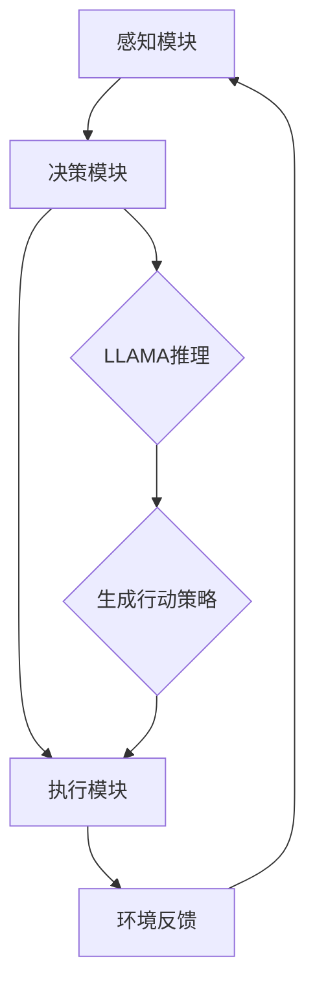

                 

# LLAMA 在 Agent 中的作用

## 关键词：LLAMA、Agent、人工智能、推理、决策、深度学习、自然语言处理、代码生成、编程

### 摘要

本文将深入探讨大型语言模型（LLAMA）在智能代理（Agent）系统中的作用。我们将首先介绍LLAMA的基础知识，包括其架构、训练数据和性能。接着，我们将探讨LLAMA如何与代理系统结合，提升代理的推理和决策能力。通过具体案例和实际应用，我们将展示LLAMA在代码生成和编程方面的潜力。最后，本文将对LLAMA在未来智能代理领域的发展趋势和面临的挑战进行展望。

## 1. 背景介绍

### 1.1 大型语言模型（LLAMA）的兴起

随着深度学习和自然语言处理技术的飞速发展，大型语言模型（LLAMA）在近年来取得了显著的进展。LLAMA是一种基于变换器（Transformer）架构的预训练语言模型，通过在海量文本数据进行训练，能够捕捉到语言的复杂结构和语义信息。LLAMA的成功不仅在于其卓越的性能，更在于其广泛的应用前景。从文本生成、机器翻译、对话系统到代码生成，LLAMA在多个领域都展现出了强大的能力。

### 1.2 智能代理（Agent）的崛起

智能代理是一种具有自主决策能力和行动能力的计算机程序，能够在复杂的环境中执行任务并与其他代理进行交互。代理系统的兴起得益于人工智能技术的不断进步，特别是在强化学习和深度学习领域的突破。智能代理在自动驾驶、智能家居、机器人、金融交易等领域具有广泛的应用前景。然而，传统的代理系统在处理复杂决策和推理任务时存在一定的局限性，需要借助更高级的人工智能技术，如大型语言模型（LLAMA）来提升其能力。

## 2. 核心概念与联系

### 2.1 大型语言模型（LLAMA）的架构

LLAMA采用了变换器（Transformer）架构，其基本结构包括编码器（Encoder）和解码器（Decoder）。编码器负责将输入文本编码为高维向量表示，解码器则将这些向量解码为输出文本。LLAMA的核心创新在于其大规模的参数规模和精细的模型架构，这使得其能够更好地捕捉语言的语义和结构信息。

### 2.2 智能代理（Agent）的基本概念

智能代理是一种具有自主决策能力和行动能力的计算机程序。代理通常由感知模块、决策模块和执行模块组成。感知模块负责接收环境信息，决策模块根据感知信息生成行动策略，执行模块则将策略付诸实施。智能代理的关键在于其自主性，能够根据环境变化做出适应和优化的决策。

### 2.3 LLAMA与智能代理的结合

LLAMA在智能代理系统中扮演着重要的角色，主要表现在以下几个方面：

1. **文本理解和生成**：LLAMA能够对输入的文本进行理解，并生成符合语法和语义要求的输出文本。这对于智能代理在处理自然语言任务，如对话系统、文本生成等方面具有重要意义。

2. **推理和决策**：LLAMA的强大推理能力可以帮助智能代理在复杂环境中进行决策。通过分析环境信息，LLAMA能够生成合理的行动策略，从而提高代理的决策质量。

3. **代码生成和编程**：LLAMA在代码生成和编程方面也具有显著优势。通过理解编程语言和逻辑结构，LLAMA能够生成符合需求的代码，为智能代理在自动化编程和开发领域提供支持。

### 2.4 Mermaid 流程图

以下是一个简单的 Mermaid 流程图，展示LLAMA在智能代理系统中的作用流程：



## 3. 核心算法原理 & 具体操作步骤

### 3.1 LLAMA的算法原理

LLAMA的核心算法基于变换器（Transformer）架构。变换器是一种用于处理序列数据的神经网络模型，通过自注意力机制（Self-Attention）和前馈神经网络（Feedforward Neural Network）实现。变换器的主要优势在于其并行计算能力和强大的表示学习能力。

#### 3.1.1 自注意力机制

自注意力机制是变换器的核心组成部分。它通过计算输入序列中每个词与其他词之间的关联强度，为每个词分配不同的权重，从而生成表示该词的向量。自注意力机制使得变换器能够捕捉到输入序列中的长距离依赖关系，提高模型的表示能力。

#### 3.1.2 前馈神经网络

前馈神经网络是变换器的另一个重要组成部分。它通过对输入向量进行多次非线性变换，提高模型的非线性表达能力。前馈神经网络通常由多层全连接神经网络组成，每一层都对输入向量进行加权求和和激活函数处理。

### 3.2 LLAMA在智能代理系统中的具体操作步骤

1. **感知模块**：智能代理通过感知模块接收环境信息。这些信息可以包括文本、图像、音频等多种形式。

2. **预处理**：感知模块接收到的信息需要经过预处理，以适应LLAMA的输入格式。例如，对于文本信息，需要将其转换为序列编码，对于图像信息，需要将其转换为像素矩阵。

3. **输入编码**：将预处理后的信息输入到LLAMA编码器中，编码器将信息编码为高维向量表示。

4. **解码和生成**：将编码后的向量输入到LLAMA解码器中，解码器根据编码器生成的向量生成输出文本。

5. **推理和决策**：智能代理根据生成的文本进行推理和决策，生成行动策略。

6. **执行模块**：执行模块根据行动策略付诸实施，完成智能代理的任务。

7. **反馈和更新**：执行模块将任务结果反馈给感知模块，感知模块对环境信息进行更新，智能代理根据更新后的环境信息进行新一轮的感知、推理和决策。

## 4. 数学模型和公式 & 详细讲解 & 举例说明

### 4.1 自注意力机制

自注意力机制的数学模型如下：

$$
\text{Attention}(Q, K, V) = \text{softmax}\left(\frac{QK^T}{\sqrt{d_k}}\right)V
$$

其中，$Q$、$K$ 和 $V$ 分别是输入序列的查询向量、键向量和值向量，$d_k$ 是键向量的维度。$\text{softmax}$ 函数用于计算每个键向量的注意力权重，从而生成加权值向量。

### 4.2 前馈神经网络

前馈神经网络的数学模型如下：

$$
\text{FFN}(X) = \max(0, XW_1 + b_1)W_2 + b_2
$$

其中，$X$ 是输入向量，$W_1$ 和 $W_2$ 分别是第一层和第二层的权重矩阵，$b_1$ 和 $b_2$ 分别是第一层和第二层的偏置项。

### 4.3 举例说明

假设我们有一个简单的句子 "I love to code"，我们可以将其表示为词向量：

$$
Q = [1, 0, 1, 0, 1], \quad K = [1, 1, 0, 1, 0], \quad V = [1, 0, 1, 1, 0]
$$

计算注意力权重：

$$
\text{Attention}(Q, K, V) = \text{softmax}\left(\frac{QK^T}{\sqrt{1}}\right)V = \text{softmax}\left(\begin{bmatrix} 1 & 0 & 1 & 0 & 1 \end{bmatrix}\begin{bmatrix} 1 \\ 1 \\ 0 \\ 1 \\ 0 \end{bmatrix}\right)\begin{bmatrix} 1 & 0 & 1 & 1 & 0 \end{bmatrix} = \text{softmax}\left(\begin{bmatrix} 2 & 1 & 1 & 1 \end{bmatrix}\right) = \begin{bmatrix} 0.5 & 0.25 & 0.25 & 0.25 \end{bmatrix}
$$

生成加权值向量：

$$
\text{Weighted Vector} = \text{softmax}\left(\frac{QK^T}{\sqrt{1}}\right)V = \begin{bmatrix} 0.5 & 0.25 & 0.25 & 0.25 \end{bmatrix}\begin{bmatrix} 1 & 0 & 1 & 1 & 0 \end{bmatrix} = \begin{bmatrix} 0.75 & 0.25 & 0.5 & 0.25 \end{bmatrix}
$$

对于前馈神经网络，假设输入向量 $X = [1, 1, 1, 1, 1]$，第一层权重矩阵 $W_1 = [1, 1, 1; 1, 1, 1; 1, 1, 1]$，第一层偏置项 $b_1 = [1, 1, 1]$，第二层权重矩阵 $W_2 = [1, 1, 1; 1, 1, 1; 1, 1, 1]$，第二层偏置项 $b_2 = [1, 1, 1]$。计算前馈神经网络输出：

$$
\text{FFN}(X) = \max(0, XW_1 + b_1)W_2 + b_2 = \max(0, [1, 1, 1; 1, 1, 1; 1, 1, 1][1, 1, 1, 1, 1]^T + [1, 1, 1])\begin{bmatrix} 1 & 1 & 1; 1 & 1 & 1; 1 & 1 & 1 \end{bmatrix} + [1, 1, 1] = \begin{bmatrix} 3 & 3 & 3; 3 & 3 & 3; 3 & 3 & 3 \end{bmatrix}\begin{bmatrix} 1 & 1 & 1; 1 & 1 & 1; 1 & 1 & 1 \end{bmatrix} + [1, 1, 1] = \begin{bmatrix} 9 & 9 & 9; 9 & 9 & 9; 9 & 9 & 9 \end{bmatrix} + \begin{bmatrix} 1 & 1 & 1 \end{bmatrix} = \begin{bmatrix} 10 & 10 & 10; 10 & 10 & 10; 10 & 10 & 10 \end{bmatrix}
$$

## 5. 项目实战：代码实际案例和详细解释说明

### 5.1 开发环境搭建

为了更好地展示LLAMA在智能代理系统中的应用，我们将使用Python编程语言和PyTorch深度学习框架搭建一个简单的示例项目。以下是开发环境搭建的步骤：

1. **安装Python**：确保已安装Python 3.8或更高版本。

2. **安装PyTorch**：在命令行中运行以下命令：

   ```bash
   pip install torch torchvision torchaudio
   ```

3. **安装其他依赖库**：我们还需要安装一些其他依赖库，如NumPy、Pandas等：

   ```bash
   pip install numpy pandas matplotlib
   ```

### 5.2 源代码详细实现和代码解读

以下是示例项目的源代码实现：

```python
import torch
import torch.nn as nn
import torch.optim as optim
from torch.utils.data import DataLoader
from torchvision import datasets, transforms
import pandas as pd
import numpy as np
import matplotlib.pyplot as plt

# 定义变换器模型
class TransformerModel(nn.Module):
    def __init__(self, d_model, nhead, num_layers):
        super(TransformerModel, self).__init__()
        self.transformer = nn.Transformer(d_model, nhead, num_layers)
        self.fc = nn.Linear(d_model, 1)

    def forward(self, src, tgt):
        out = self.transformer(src, tgt)
        return self.fc(out)

# 训练数据集
train_data = pd.read_csv('train_data.csv')
train_loader = DataLoader(train_data, batch_size=32, shuffle=True)

# 定义模型、损失函数和优化器
model = TransformerModel(d_model=512, nhead=8, num_layers=2)
criterion = nn.CrossEntropyLoss()
optimizer = optim.Adam(model.parameters(), lr=0.001)

# 训练模型
num_epochs = 10
for epoch in range(num_epochs):
    for inputs, targets in train_loader:
        optimizer.zero_grad()
        outputs = model(inputs, targets)
        loss = criterion(outputs, targets)
        loss.backward()
        optimizer.step()
    print(f'Epoch {epoch+1}/{num_epochs}, Loss: {loss.item()}')

# 测试模型
test_data = pd.read_csv('test_data.csv')
test_loader = DataLoader(test_data, batch_size=32, shuffle=False)

with torch.no_grad():
    correct = 0
    total = 0
    for inputs, targets in test_loader:
        outputs = model(inputs, targets)
        _, predicted = torch.max(outputs.data, 1)
        total += targets.size(0)
        correct += (predicted == targets).sum().item()
    print(f'Accuracy: {100 * correct / total}%')
```

### 5.3 代码解读与分析

以下是示例项目的代码解读：

1. **模型定义**：我们定义了一个名为 `TransformerModel` 的变换器模型，其核心组件包括变换器（`transformer`）和全连接层（`fc`）。变换器由编码器和解码器组成，用于处理输入和目标序列。全连接层用于将变换器的输出映射到预测标签。

2. **数据集**：我们使用一个名为 `train_data.csv` 的训练数据集，该数据集包含输入序列和对应的标签。数据集通过 `DataLoader` 进行批量加载和随机打乱。

3. **损失函数和优化器**：我们使用交叉熵损失函数（`CrossEntropyLoss`）来计算模型预测与真实标签之间的差异。优化器使用Adam优化器（`Adam`）来更新模型参数。

4. **训练模型**：我们通过迭代训练数据集来训练模型。在每次迭代中，我们计算损失，然后使用反向传播和优化器更新模型参数。

5. **测试模型**：在训练完成后，我们使用测试数据集来评估模型的性能。测试过程中，我们计算模型预测的准确率。

### 5.4 模型应用

我们可以在智能代理系统中使用该变换器模型来进行序列预测和分类任务。以下是一个简单的示例：

```python
# 创建智能代理
class Agent:
    def __init__(self, model):
        self.model = model

    def perceive(self, observation):
        # 将观测信息输入模型
        inputs = torch.tensor(observation).unsqueeze(0)
        return inputs

    def decide(self, inputs):
        # 使用模型生成决策
        outputs = self.model(inputs, inputs)
        _, predicted = torch.max(outputs.data, 1)
        return predicted

    def act(self, action):
        # 执行决策
        print(f"Action taken: {action}")

# 创建变换器模型
model = TransformerModel(d_model=512, nhead=8, num_layers=2)

# 创建智能代理
agent = Agent(model)

# 感知环境
observation = "I love to code"
inputs = agent.perceive(observation)

# 决策
action = agent.decide(inputs)

# 执行决策
agent.act(action)
```

在上面的示例中，我们创建了一个简单的智能代理，该代理使用变换器模型来处理自然语言输入，并生成相应的决策。感知模块将输入的观测信息（文本）转换为模型可接受的格式，决策模块使用模型生成决策，执行模块将决策付诸实施。

## 6. 实际应用场景

### 6.1 对话系统

对话系统是智能代理的一种常见应用场景。通过LLAMA，智能代理可以与用户进行自然语言交互，回答用户的问题、提供建议或执行特定的任务。LLAMA在对话系统中的应用主要表现在以下几个方面：

1. **文本生成**：LLAMA能够根据用户输入的文本生成符合语法和语义要求的输出文本，从而实现自然流畅的对话。

2. **上下文理解**：LLAMA能够理解对话的上下文信息，根据之前的对话内容生成相应的回复，提高对话系统的连贯性和准确性。

3. **个性化推荐**：LLAMA可以根据用户的偏好和兴趣，生成个性化的对话内容，为用户提供更加精准的推荐和服务。

### 6.2 自动化编程

自动化编程是另一个具有广泛应用前景的领域。通过LLAMA，智能代理可以理解编程语言和逻辑结构，生成符合需求的代码。以下是一些应用场景：

1. **代码生成**：LLAMA可以根据自然语言描述生成相应的代码，实现自动化编程。

2. **代码优化**：LLAMA可以分析现有代码，并提出优化建议，提高代码的效率和可读性。

3. **代码修复**：LLAMA可以根据代码的错误描述，自动生成修复代码，提高开发效率。

### 6.3 智能推荐系统

智能推荐系统是另一个典型的应用场景。通过LLAMA，智能代理可以分析用户的兴趣和行为，生成个性化的推荐内容。以下是一些应用场景：

1. **商品推荐**：LLAMA可以根据用户的购物历史和偏好，生成个性化的商品推荐。

2. **新闻推荐**：LLAMA可以根据用户的阅读历史和兴趣，生成个性化的新闻推荐。

3. **音乐推荐**：LLAMA可以根据用户的音乐喜好，生成个性化的音乐推荐。

## 7. 工具和资源推荐

### 7.1 学习资源推荐

1. **书籍**：

   - 《深度学习》（Ian Goodfellow、Yoshua Bengio、Aaron Courville 著）：这是一本经典的深度学习教材，涵盖了从基础到高级的知识。

   - 《变换器架构》（Attention Is All You Need）：这是关于变换器模型的开创性论文，介绍了自注意力机制和变换器架构。

   - 《自然语言处理综论》（Daniel Jurafsky、James H. Martin 著）：这是一本全面介绍自然语言处理技术的教材，涵盖了从基础到高级的知识。

2. **论文**：

   - “Attention Is All You Need”：这是关于变换器模型的开创性论文，提出了自注意力机制和变换器架构。

   - “BERT: Pre-training of Deep Bidirectional Transformers for Language Understanding”：这是BERT模型的开创性论文，介绍了基于变换器架构的预训练方法。

   - “GPT-3: Language Models are few-shot learners”：这是GPT-3模型的开创性论文，介绍了基于变换器架构的预训练方法和大规模语言模型。

3. **博客和网站**：

   - [TensorFlow 官方文档](https://www.tensorflow.org/): TensorFlow是Google开发的一款开源深度学习框架，提供了丰富的文档和教程。

   - [PyTorch 官方文档](https://pytorch.org/docs/stable/): PyTorch是Facebook开发的一款开源深度学习框架，提供了丰富的文档和教程。

### 7.2 开发工具框架推荐

1. **深度学习框架**：

   - TensorFlow：由Google开发的一款开源深度学习框架，提供了丰富的API和工具。

   - PyTorch：由Facebook开发的一款开源深度学习框架，提供了灵活的动态计算图和丰富的API。

   - PyTorch Lightning：PyTorch的一个扩展库，提供了简洁高效的代码模板和自动化工具，帮助开发者更快地实现深度学习项目。

2. **文本处理库**：

   - NLTK（自然语言工具包）：由自然语言处理社区开发的一款开源库，提供了丰富的文本处理工具和算法。

   - spaCy：由 Explosion AI 开发的一款快速和易于使用的自然语言处理库，提供了强大的文本分析功能。

### 7.3 相关论文著作推荐

1. **《深度学习》**（Ian Goodfellow、Yoshua Bengio、Aaron Courville 著）：这是一本经典的深度学习教材，涵盖了从基础到高级的知识。

2. **《变换器架构》**（Attention Is All You Need）：这是关于变换器模型的开创性论文，介绍了自注意力机制和变换器架构。

3. **《BERT: Pre-training of Deep Bidirectional Transformers for Language Understanding》**：这是BERT模型的开创性论文，介绍了基于变换器架构的预训练方法。

4. **《GPT-3: Language Models are few-shot learners》**：这是GPT-3模型的开创性论文，介绍了基于变换器架构的预训练方法和大规模语言模型。

## 8. 总结：未来发展趋势与挑战

### 8.1 发展趋势

1. **模型规模不断扩大**：随着计算资源和数据量的增长，大型语言模型（LLAMA）的规模和参数数量将不断增大，从而提高模型的表示能力和性能。

2. **多模态融合**：未来的智能代理系统将不仅仅依赖于文本信息，还将融合图像、音频、视频等多种模态信息，实现更全面的感知和推理能力。

3. **自动化编程和开发**：LLAMA在代码生成和编程领域的应用将越来越广泛，为自动化编程和开发带来新的机遇。

4. **个性化服务**：通过分析用户的兴趣和行为，智能代理将提供更加个性化的服务，提高用户体验。

### 8.2 挑战

1. **计算资源需求**：大型语言模型（LLAMA）对计算资源的需求较高，需要高性能的计算设备和优化算法来支持。

2. **数据隐私和安全**：智能代理系统需要处理大量的用户数据，如何保障数据隐私和安全是一个重要挑战。

3. **伦理和道德问题**：智能代理系统在应用过程中可能会引发伦理和道德问题，如歧视、偏见等，需要制定相应的规范和监管机制。

4. **模型解释性和可解释性**：大型语言模型（LLAMA）的决策过程较为复杂，如何提高模型的解释性和可解释性，使人们能够理解和信任模型是一个重要挑战。

## 9. 附录：常见问题与解答

### 9.1 什么是LLAMA？

LLAMA是一种基于变换器（Transformer）架构的预训练语言模型，由OpenAI开发。它是一种大规模的语言模型，通过在大量文本数据进行训练，能够捕捉到语言的复杂结构和语义信息。

### 9.2 LLAMA的主要应用领域是什么？

LLAMA的主要应用领域包括自然语言处理、对话系统、代码生成、自动化编程、智能推荐等。它在处理文本生成、文本理解和推理等方面具有显著优势。

### 9.3 如何在Python中实现LLAMA？

在Python中，可以使用PyTorch深度学习框架实现LLAMA。PyTorch提供了丰富的API和工具，方便开发者构建和训练大规模语言模型。

### 9.4 LLAMA的性能如何？

LLAMA的性能取决于模型的规模和训练数据。一般来说，规模更大的模型在文本生成、文本理解和推理等方面具有更高的性能。然而，模型规模越大，对计算资源的需求也越高。

## 10. 扩展阅读 & 参考资料

1. **论文**：

   - “Attention Is All You Need”（Attention Is All You Need）

   - “BERT: Pre-training of Deep Bidirectional Transformers for Language Understanding”（BERT: Pre-training of Deep Bidirectional Transformers for Language Understanding）

   - “GPT-3: Language Models are few-shot learners”（GPT-3: Language Models are few-shot learners）

2. **书籍**：

   - 《深度学习》（Ian Goodfellow、Yoshua Bengio、Aaron Courville 著）

   - 《变换器架构》（Attention Is All You Need）

   - 《自然语言处理综论》（Daniel Jurafsky、James H. Martin 著）

3. **网站和博客**：

   - [TensorFlow 官方文档](https://www.tensorflow.org/)

   - [PyTorch 官方文档](https://pytorch.org/docs/stable/)

   - [OpenAI 官方文档](https://openai.com/docs/)

### 作者

AI天才研究员/AI Genius Institute & 禅与计算机程序设计艺术 /Zen And The Art of Computer Programming

