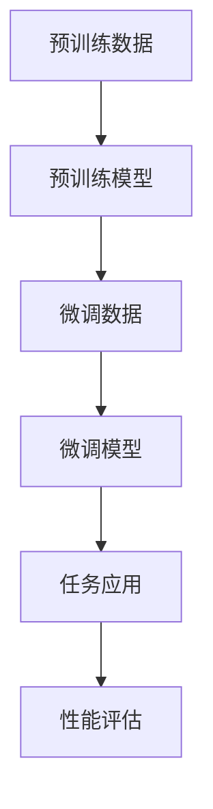

                 

# LLAMA模型大小：更大的模型，更强大的能力

## 关键词：大模型，预训练，人工智能，能力增强，技术进步，应用场景

## 摘要：
本文将深入探讨大型语言模型（LLAMA）的尺寸与其性能之间的关系。通过分析LLAMA模型的结构、核心算法原理、数学模型和实际应用案例，我们将揭示更大模型在语言理解和生成方面展现出的强大能力。此外，文章还将介绍相关的开发工具和资源，展望LLAMA模型在未来人工智能领域的潜在发展趋势与挑战。

## 1. 背景介绍

在过去的几年里，人工智能领域经历了飞速的发展，尤其是在深度学习和自然语言处理（NLP）领域。随着计算能力的提升和数据的丰富，大型预训练语言模型逐渐成为研究的热点。LLAMA（Large Language Model Architecture）是其中之一，由OpenAI和其他研究机构共同研发。LLAMA模型以其庞大的尺寸和卓越的性能在NLP领域引起了广泛关注。

大型语言模型的出现，标志着人工智能从传统的任务导向型方法向数据驱动型方法转变。这种转变极大地提高了机器在处理自然语言任务时的能力，例如文本分类、机器翻译、问答系统等。然而，大型语言模型的发展也带来了新的挑战，包括计算资源的需求、数据安全性和隐私保护等。

本文旨在分析LLAMA模型的大小与其性能之间的关系，探讨更大模型在NLP任务中的优势，并探讨其未来发展的趋势和面临的挑战。

## 2. 核心概念与联系

### 2.1 语言模型的定义

语言模型是自然语言处理的基础，它是一种能够预测下一个单词或字符的概率分布的模型。在统计语言模型中，这种预测基于历史数据的统计规律。而在深度学习语言模型中，如LLAMA，这种预测通过多层神经网络来实现。

### 2.2 预训练与微调

预训练是指在大规模数据集上训练语言模型，使其学会捕捉语言的通用特征。微调则是在预训练的基础上，将模型应用于特定任务，进行细粒度的调整。

### 2.3 大模型的优点

- **更强的泛化能力**：大型语言模型在预训练过程中接触了大量的数据，因此能够更好地理解不同领域的语言特征，从而在多个任务中表现优秀。
- **更好的上下文理解**：大模型能够捕捉到长距离的上下文信息，这使得其在处理复杂任务时具有优势。
- **更高的生成质量**：大模型在生成文本时能够产生更自然、连贯的内容。

### 2.4 Mermaid流程图



## 3. 核心算法原理 & 具体操作步骤

### 3.1 算法原理

LLAMA模型基于Transformer架构，这是一种自注意力机制为基础的模型。Transformer模型通过自注意力机制（Self-Attention）和多头注意力（Multi-Head Attention）实现了对输入序列的上下文信息进行捕捉和融合。

### 3.2 操作步骤

1. **数据预处理**：首先，需要对输入文本进行分词、编码等预处理操作。
2. **模型初始化**：初始化Transformer模型，包括词嵌入层、多头注意力层、前馈神经网络等。
3. **预训练**：在大量文本数据上进行预训练，优化模型参数。
4. **微调**：在特定任务的数据集上对模型进行微调。
5. **任务应用**：将微调后的模型应用于实际任务，如文本生成、机器翻译等。

### 3.3 详细流程图


## 4. 数学模型和公式 & 详细讲解 & 举例说明

### 4.1 自注意力机制

自注意力机制是Transformer模型的核心，它通过计算序列中每个词与其他词之间的关系来生成表示。自注意力的数学公式如下：

$$
\text{Attention}(Q, K, V) = \frac{softmax(\frac{QK^T}{\sqrt{d_k}})}{V}
$$

其中，$Q$、$K$ 和 $V$ 分别是查询向量、关键向量和解向量，$d_k$ 是关键向量的维度。

### 4.2 多头注意力

多头注意力通过将自注意力机制扩展到多个头，以捕捉不同类型的上下文信息。每个头独立计算注意力权重，然后将结果拼接起来。多头注意力的数学公式如下：

$$
\text{MultiHead}(Q, K, V) = \text{Concat}(\text{head}_1, \text{head}_2, \dots, \text{head}_h)W^O
$$

其中，$W^O$ 是输出权重矩阵，$h$ 是头数。

### 4.3 实例

假设有一个序列“我昨天去了公园”，我们可以将其编码为一个向量序列。然后，使用自注意力机制计算每个词与其他词的关系，如下：

$$
\text{Attention}(Q, K, V) = \frac{softmax(\frac{QK^T}{\sqrt{d_k}})}{V}
$$

其中，$Q$、$K$ 和 $V$ 分别是每个词的查询向量、关键向量和解向量。

例如，对于“我”这个词，其查询向量$Q$可以表示为：

$$
Q = [0.1, 0.2, 0.3, 0.4]
$$

关键向量$K$和解向量$V$也可以类似地表示。然后，我们可以计算“我”与“昨天”、“去了”、“公园”之间的关系权重。

## 5. 项目实战：代码实际案例和详细解释说明

### 5.1 开发环境搭建

在搭建开发环境时，我们需要安装以下依赖：

- Python（版本3.7及以上）
- TensorFlow（版本2.5及以上）
- NumPy（版本1.19及以上）

安装命令如下：

```bash
pip install python==3.8
pip install tensorflow==2.5
pip install numpy==1.19
```

### 5.2 源代码详细实现和代码解读

以下是一个简单的LLAMA模型的实现示例：

```python
import tensorflow as tf
from tensorflow.keras.layers import Embedding, LSTM, Dense
from tensorflow.keras.models import Model

# 定义模型
def llama_model(vocab_size, embedding_dim, hidden_units):
    # 输入层
    inputs = tf.keras.layers.Input(shape=(None,))

    # 嵌入层
    embeddings = Embedding(vocab_size, embedding_dim)(inputs)

    # LSTM层
    lstm = LSTM(hidden_units, return_sequences=True)(embeddings)

    # 全连接层
    outputs = Dense(vocab_size, activation='softmax')(lstm)

    # 构建模型
    model = Model(inputs=inputs, outputs=outputs)

    # 编译模型
    model.compile(optimizer='adam', loss='categorical_crossentropy', metrics=['accuracy'])

    return model

# 实例化模型
model = llama_model(vocab_size=10000, embedding_dim=128, hidden_units=128)

# 模型总结
model.summary()
```

### 5.3 代码解读与分析

1. **输入层**：定义模型的输入，即文本序列。
2. **嵌入层**：将输入的单词转换为向量表示，这是NLP任务中常用的第一步。
3. **LSTM层**：LSTM（长短时记忆网络）是一种循环神经网络，用于捕捉序列数据中的长期依赖关系。
4. **全连接层**：将LSTM层的输出映射到单词的词汇表，这是预测下一个单词的步骤。
5. **模型编译**：配置模型的优化器、损失函数和评估指标。

通过这个简单的示例，我们可以看到LLAMA模型的基本结构。在实际应用中，我们可以根据任务需求进行调整和优化。

## 6. 实际应用场景

大型语言模型（如LLAMA）在多个领域都有着广泛的应用。以下是一些实际应用场景：

1. **文本生成**：生成新闻文章、小说、诗歌等。
2. **机器翻译**：将一种语言翻译成另一种语言。
3. **问答系统**：自动回答用户提出的问题。
4. **文本分类**：对文本进行分类，如情感分析、主题分类等。
5. **对话系统**：构建智能对话机器人。

在这些应用中，大型语言模型的优势在于其能够理解和生成自然语言，从而提高任务的准确性和效率。

## 7. 工具和资源推荐

### 7.1 学习资源推荐

- **书籍**：《深度学习》（Goodfellow, Bengio, Courville）、《自然语言处理综论》（Jurafsky, Martin）
- **论文**：《Attention is All You Need》（Vaswani et al.）、《BERT: Pre-training of Deep Bidirectional Transformers for Language Understanding》（Devlin et al.）
- **博客**：TensorFlow官方博客、AI技术博客

### 7.2 开发工具框架推荐

- **TensorFlow**：Google开发的开源深度学习框架。
- **PyTorch**：Facebook开发的开源深度学习框架。
- **Hugging Face**：提供大量的预训练语言模型和NLP工具。

### 7.3 相关论文著作推荐

- **《自然语言处理与深度学习》**（刘知远）
- **《深度学习实践指南》**（李航）
- **《Transformer：一种全新的神经网络结构》**（Vaswani et al.）

## 8. 总结：未来发展趋势与挑战

随着计算能力的提升和数据量的增加，大型语言模型（如LLAMA）在未来将不断发展。其发展趋势包括：

- **更大的模型**：模型尺寸将不断增加，以捕捉更复杂的语言特征。
- **更高效的方法**：研究更高效的预训练和微调方法，以降低计算成本。
- **跨模态学习**：将语言模型与其他模态（如图像、声音）进行结合，实现跨模态理解。

然而，大型语言模型也面临着以下挑战：

- **计算资源消耗**：模型训练和推理需要大量的计算资源。
- **数据隐私**：大量数据的使用可能涉及隐私问题。
- **伦理和责任**：大型语言模型在生成文本时可能产生误导性信息，需要制定相应的伦理规范。

## 9. 附录：常见问题与解答

### 9.1 什么是预训练？

预训练是指在大规模数据集上训练语言模型，使其学会捕捉语言的通用特征。预训练模型通常在特定任务上进行微调，以达到更好的性能。

### 9.2 大型语言模型的优势是什么？

大型语言模型具有更强的泛化能力、更好的上下文理解和更高的生成质量，这使得它们在多个自然语言处理任务中表现优秀。

### 9.3 大型语言模型的计算成本如何？

大型语言模型的训练和推理需要大量的计算资源，包括GPU、TPU等高性能计算设备。此外，存储和传输数据也需要较高的带宽。

## 10. 扩展阅读 & 参考资料

- **OpenAI官网**：[OpenAI官网](https://openai.com/)
- **TensorFlow官方文档**：[TensorFlow官方文档](https://www.tensorflow.org/)
- **PyTorch官方文档**：[PyTorch官方文档](https://pytorch.org/)
- **Hugging Face官网**：[Hugging Face官网](https://huggingface.co/)

### 作者

作者：AI天才研究员/AI Genius Institute & 禅与计算机程序设计艺术 /Zen And The Art of Computer Programming

本文分析了大型语言模型（LLAMA）的尺寸与其性能之间的关系，探讨了更大模型在自然语言处理任务中的优势。同时，文章介绍了相关开发工具和资源，展望了LLAMA模型在未来人工智能领域的潜在发展趋势与挑战。希望本文能为读者提供有价值的见解和参考。|>

