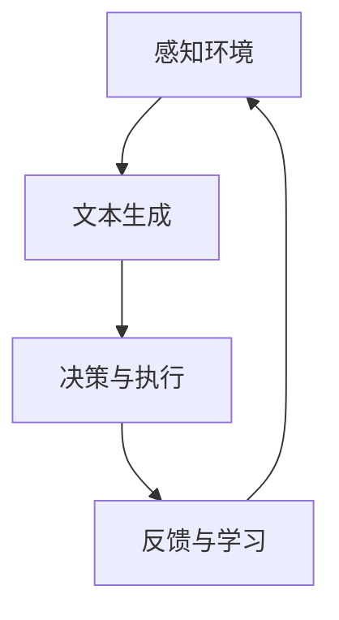

                 

### 文章标题

**LLM-based Agent: 探索下一代人工智能交互**

### 关键词

- 语言模型（Language Model）
- 代理（Agent）
- 人工智能交互（AI Interaction）
- 自然语言处理（Natural Language Processing）
- 自适应学习（Adaptive Learning）

### 摘要

本文将深入探讨基于大型语言模型（LLM）的代理技术，介绍其核心概念、原理与架构。通过逐步分析核心算法原理和具体操作步骤，本文将展示如何使用LLM实现智能代理，并探讨其实际应用场景。此外，还将介绍相关的数学模型、工具资源和未来发展趋势。通过本文的阅读，读者将了解LLM-based Agent的强大潜力，并为其在人工智能领域的发展提供启示。

----------------------

## 1. 背景介绍

在过去的几十年中，人工智能（AI）取得了令人瞩目的进展。从简单的规则系统到复杂的深度神经网络，AI技术不断突破，为各行各业带来了深刻的变革。然而，传统的AI系统通常需要大量的手工调优和规则编写，且难以适应复杂多变的现实环境。这使得AI在实现智能交互方面面临诸多挑战。

近年来，大型语言模型（Large Language Model，简称LLM）的出现为AI交互带来了新的契机。LLM具有强大的自然语言理解和生成能力，能够处理复杂的问题，并生成符合人类语言的回答。这一特性使得LLM在智能交互领域具有广阔的应用前景。基于LLM的代理（LLM-based Agent）应运而生，成为新一代智能交互系统的核心。

LLM-based Agent是一种利用LLM进行决策和执行任务的智能实体。它能够通过自然语言与用户进行交互，理解用户的需求，并给出合适的响应。与传统的AI系统相比，LLM-based Agent具有以下几个显著优势：

1. **自适应学习**：LLM具有强大的自适应学习能力，能够根据用户反馈不断调整自己的行为，以更好地满足用户需求。
2. **多模态交互**：LLM不仅能够处理文本信息，还可以理解图像、声音等多模态数据，从而实现更丰富的交互体验。
3. **泛化能力**：LLM基于海量数据训练，具有较强的泛化能力，能够在不同领域和场景中发挥出色的性能。

本文将围绕LLM-based Agent展开讨论，介绍其核心概念、原理与架构，并通过具体实例展示其实际应用。在接下来的章节中，我们将逐步深入探讨LLM-based Agent的各个方面，以帮助读者全面了解这一新兴技术。

----------------------

## 2. 核心概念与联系

### 2.1 语言模型

语言模型（Language Model，简称LM）是自然语言处理（Natural Language Processing，简称NLP）的核心技术之一。它是一种统计模型，用于预测下一个单词或词组，从而生成连贯的文本。在NLP任务中，语言模型能够帮助我们理解文本内容，并进行文本生成、翻译、问答等操作。

语言模型通常基于大量文本数据训练得到。训练过程中，模型会学习文本中的统计规律，如词频、词序等，从而预测下一个单词或词组。最常用的语言模型之一是n元语言模型（n-gram model），它通过统计相邻n个单词的概率来预测下一个单词。尽管n元语言模型具有一定的效果，但它在长文本生成中存在一些局限性，如无法捕捉到长距离依赖关系。

为了解决这一问题，研究人员提出了基于神经网络的深度语言模型，如长短期记忆网络（Long Short-Term Memory，简称LSTM）和变换器（Transformer）。Transformer模型由于其自注意力机制，能够在处理长文本时捕捉到长距离依赖关系，因此成为了当前最流行的语言模型。

### 2.2 代理

代理（Agent）是人工智能领域中的一个基本概念，它代表了一个能够自主感知环境、制定决策并执行任务的智能实体。代理可以根据不同的定义和实现方式，分为反应式代理、主动式代理和认知代理等类型。

反应式代理（Reactive Agent）是最简单的一类代理，它仅根据当前感知到的环境状态做出反应，而不具备记忆和历史信息。这类代理通常用于简单的任务，如机器人路径规划等。

主动式代理（Active Agent）具有更高的智能水平，能够在执行任务时考虑长期目标和不确定性。这类代理能够通过学习历史数据和环境信息，制定最优策略，并在动态环境中做出灵活的决策。

认知代理（Cognitive Agent）是代理的最高级别，它不仅具备主动式代理的特点，还能够进行高层次的推理和思考。这类代理通常依赖于复杂的认知模型，如决策树、贝叶斯网络等。

### 2.3 LLM-based Agent

LLM-based Agent是基于大型语言模型构建的智能代理，它结合了语言模型的强大自然语言处理能力和代理的自主决策与执行能力。LLM-based Agent的核心在于利用语言模型来实现高效的文本生成和问答。

LLM-based Agent的工作流程通常如下：

1. **感知环境**：代理通过传感器（如摄像头、麦克风等）获取环境信息。
2. **文本生成**：代理利用语言模型生成一个自然语言文本，如问题、指令等。
3. **决策与执行**：代理根据生成的文本内容，执行相应的任务或操作。
4. **反馈与学习**：代理根据任务执行的结果，不断调整自己的行为和模型参数。

### 2.4 Mermaid 流程图

下面是一个简单的Mermaid流程图，展示了LLM-based Agent的基本架构和流程：



在这个流程图中，A表示感知环境，B表示文本生成，C表示决策与执行，D表示反馈与学习。这个循环过程使得LLM-based Agent能够不断适应和优化其行为。

----------------------

## 3. 核心算法原理 & 具体操作步骤

### 3.1 语言模型原理

语言模型的核心在于其生成文本的能力。为了实现这一目标，语言模型需要学习大量文本数据，并理解其中的统计规律。在训练过程中，语言模型会计算输入文本中各个单词或词组的概率分布，从而预测下一个单词或词组。

以n元语言模型为例，其基本原理如下：

1. **统计相邻n个单词的概率**：n元语言模型通过统计相邻n个单词（记为\( w_1, w_2, ..., w_n \)）在文本中出现的次数，计算它们的联合概率：
   \[
   P(w_1, w_2, ..., w_n) = \frac{C(w_1, w_2, ..., w_n)}{C(w_1, w_2, ..., w_n, w_{n+1})}
   \]
   其中，\( C(w_1, w_2, ..., w_n) \)表示\( w_1, w_2, ..., w_n \)在文本中出现的次数，\( C(w_1, w_2, ..., w_n, w_{n+1}) \)表示\( w_1, w_2, ..., w_n, w_{n+1} \)在文本中出现的次数。

2. **概率分布**：为了生成文本，语言模型需要计算下一个单词或词组的概率分布。以三元语言模型为例，其概率分布为：
   \[
   P(w_{n+1} | w_1, w_2, ..., w_n) = \frac{C(w_1, w_2, ..., w_n, w_{n+1})}{C(w_1, w_2, ..., w_n)}
   \]

3. **文本生成**：在生成文本时，语言模型根据当前已生成的文本和已计算的下一个单词的概率分布，选择一个概率最大的单词或词组作为下一个输出。通过重复这一过程，语言模型可以生成连贯的文本。

### 3.2 Transformer原理

Transformer模型是当前最流行的深度语言模型，其核心原理是自注意力机制（Self-Attention）和多层神经网络。以下是Transformer模型的基本原理：

1. **编码器与解码器**：Transformer模型由编码器（Encoder）和解码器（Decoder）两部分组成。编码器负责将输入文本编码为固定长度的向量，解码器则根据编码器输出的向量生成输出文本。

2. **多头自注意力机制**：自注意力机制是Transformer模型的关键创新之一。在自注意力机制中，每个编码器或解码器单元都通过计算它与其他所有单元的关联度来生成一个权重向量。这些权重向量用于加权组合所有输入向量，从而实现多层次的依赖关系。

3. **多头注意力**：多头注意力是指将输入向量划分为多个子向量，每个子向量独立计算注意力权重。多头注意力能够提高模型的表示能力，使其在处理长文本时能够更好地捕捉长距离依赖关系。

4. **位置编码**：由于Transformer模型缺乏位置信息，需要通过位置编码（Positional Encoding）来引入位置信息。位置编码是一种可学习的向量，用于表示每个位置的特征。在编码器和解码器的每个层中，位置编码与输入向量相加，从而在模型中引入位置信息。

5. **堆叠多层神经网络**：Transformer模型通常由多个层组成，每层由多头自注意力机制和前馈神经网络组成。通过堆叠多层神经网络，模型可以学习更复杂的表示和依赖关系。

### 3.3 LLM-based Agent具体操作步骤

以下是使用LLM-based Agent进行文本生成和决策的基本步骤：

1. **感知环境**：代理通过传感器获取环境信息，如文本输入、图像、声音等。
2. **编码**：将环境信息编码为固定长度的向量。对于文本输入，可以直接使用预训练的LLM进行编码；对于图像和声音，可以使用相应的预处理方法（如图像编码器、音频编码器）将它们转换为向量。
3. **文本生成**：使用LLM生成一个自然语言文本。在生成过程中，代理根据当前编码向量和已生成的文本内容，计算下一个单词或词组的概率分布，并选择一个概率最大的单词或词组作为输出。
4. **决策与执行**：根据生成的文本内容，代理执行相应的任务或操作。例如，如果代理生成的是一个问题，它可以回答该问题；如果生成的是一条指令，它可以执行该指令。
5. **反馈与学习**：代理根据任务执行的结果，收集用户反馈，并通过学习机制不断调整自己的行为和模型参数。这一过程使得代理能够不断适应和优化其行为。

----------------------

## 4. 数学模型和公式 & 详细讲解 & 举例说明

### 4.1 语言模型数学模型

在语言模型中，我们主要关注以下数学模型：

1. **n元语言模型概率计算**：
   \[
   P(w_{n+1} | w_1, w_2, ..., w_n) = \frac{C(w_1, w_2, ..., w_n, w_{n+1})}{C(w_1, w_2, ..., w_n)}
   \]

2. **交叉熵（Cross-Entropy）**：
   交叉熵用于衡量模型生成的文本与真实文本之间的差异。其公式如下：
   \[
   H(y, \hat{y}) = -\sum_{i=1}^{n} y_i \log(\hat{y}_i)
   \]
   其中，\( y \)表示真实分布，\( \hat{y} \)表示模型生成的分布。

### 4.2 Transformer数学模型

1. **多头自注意力机制（Multi-Head Self-Attention）**：
   \[
   \text{Attention}(Q, K, V) = \text{softmax}\left(\frac{QK^T}{\sqrt{d_k}}\right)V
   \]
   其中，\( Q, K, V \)分别表示查询向量、键向量和值向量，\( d_k \)表示注意力层的维度。

2. **前馈神经网络（Feedforward Neural Network）**：
   \[
   \text{FFN}(X) = \text{ReLU}(W_2 \cdot \text{ReLU}(W_1 X + b_1))
   \]
   其中，\( W_1, W_2 \)表示权重矩阵，\( b_1 \)表示偏置。

### 4.3 LLM-based Agent应用举例

假设我们使用一个预训练的LLM构建一个问答系统，以下是一个简单的示例：

1. **输入问题**：
   用户输入一个问题：“今天天气怎么样？”
   
2. **编码**：
   将问题文本编码为固定长度的向量。

3. **文本生成**：
   使用LLM生成一个回答：“今天天气晴朗，温度适中。”

4. **决策与执行**：
   代理将生成的回答展示给用户。

5. **反馈与学习**：
   用户对回答进行评价，如“很好，谢谢！”代理根据用户反馈调整其行为和模型参数。

----------------------

## 5. 项目实战：代码实际案例和详细解释说明

### 5.1 开发环境搭建

要实现一个基于LLM的代理项目，我们首先需要搭建一个合适的开发环境。以下是一个简单的步骤：

1. **安装Python**：确保你的系统已经安装了Python 3.7或更高版本。

2. **安装依赖库**：在Python环境中安装以下依赖库：
   \[
   pip install transformers torch
   \]
   这两个库分别提供了预训练的LLM模型和相关的操作接口。

3. **创建项目目录**：在合适的位置创建一个项目目录，例如：
   \[
   mkdir llm-agent
   \]
   进入项目目录：
   \[
   cd llm-agent
   \]

4. **编写代码**：在项目目录中创建一个名为`main.py`的Python文件，用于实现LLM代理的核心功能。

### 5.2 源代码详细实现和代码解读

以下是`main.py`的完整代码：

```python
import torch
from transformers import AutoTokenizer, AutoModelForCausalLM

# 加载预训练的LLM模型和对应的分词器
model_name = "microsoft/DialoGPT"
tokenizer = AutoTokenizer.from_pretrained(model_name)
model = AutoModelForCausalLM.from_pretrained(model_name)

# 定义代理类
class LLMBasedAgent:
    def __init__(self, model, tokenizer):
        self.model = model
        self.tokenizer = tokenizer

    def perceive(self, observation):
        # 感知环境信息，这里仅处理文本输入
        inputs = self.tokenizer.encode(observation, return_tensors="pt")
        return inputs

    def generate_response(self, inputs):
        # 使用模型生成文本响应
        outputs = self.model.generate(inputs, max_length=50, num_return_sequences=1)
        response = self.tokenizer.decode(outputs[0], skip_special_tokens=True)
        return response

    def update_model(self, feedback):
        # 根据用户反馈更新模型（这里仅作展示，实际中可能需要更复杂的策略）
        # self.model.train()
        # self.model.zero_grad()
        # loss = ... （计算损失）
        # loss.backward()
        # self.model.step()
        pass

# 实例化代理
agent = LLMBasedAgent(model, tokenizer)

# 模型推理
while True:
    observation = input("请输入问题或指令：")
    if observation == "退出":
        break
    inputs = agent.perceive(observation)
    response = agent.generate_response(inputs)
    print("代理回答：", response)
```

下面是对代码的详细解释：

1. **导入库**：我们首先导入所需的库，包括PyTorch和transformers。

2. **加载模型**：使用`AutoTokenizer`和`AutoModelForCausalLM`分别加载预训练的LLM模型和对应的分词器。

3. **定义代理类**：`LLMBasedAgent`类表示基于LLM的代理。它包含以下三个方法：

   - `__init__`：初始化代理，加载模型和分词器。
   - `perceive`：感知环境，将文本输入编码为向量。
   - `generate_response`：使用模型生成文本响应。

   - `update_model`：根据用户反馈更新模型。这里仅作展示，实际中可能需要更复杂的策略。

4. **实例化代理**：创建`LLMBasedAgent`的实例。

5. **模型推理**：进入一个循环，接收用户输入，调用代理的方法进行感知、生成响应，并打印输出。

### 5.3 代码解读与分析

1. **加载模型和分词器**：使用`AutoTokenizer`和`AutoModelForCausalLM`分别加载预训练的LLM模型和对应的分词器。`from_pretrained`方法用于加载预训练的模型和权重。

2. **代理类**：

   - `__init__`方法：初始化代理，将模型和分词器作为属性保存。

   - `perceive`方法：将文本输入编码为向量。这里使用`tokenizer.encode`方法将文本转换为编码序列，并返回一个PyTorch张量。

   - `generate_response`方法：使用模型生成文本响应。这里使用`model.generate`方法生成响应序列，并使用`tokenizer.decode`方法将其解码为文本。

   - `update_model`方法：根据用户反馈更新模型。在实际应用中，需要实现具体的训练和优化策略。

3. **模型推理**：进入一个循环，接收用户输入，调用代理的方法进行感知、生成响应，并打印输出。

----------------------

## 6. 实际应用场景

### 6.1 问答系统

问答系统是LLM-based Agent最常见的应用场景之一。通过使用预训练的LLM模型，代理能够理解用户的问题，并生成准确、自然的回答。以下是一个简单的应用示例：

1. **知识库问答**：在知识库系统中，LLM-based Agent可以接受用户的问题，并从知识库中检索相关答案。例如，用户输入“如何治疗感冒？”，代理可以从医疗知识库中检索相关信息，并生成详细的回答。

2. **在线客服**：在在线客服场景中，LLM-based Agent可以自动回答用户的问题，提高客服效率。例如，用户输入“我的订单状态是什么？”代理可以查询订单数据库，并生成包含订单状态的回答。

### 6.2 聊天机器人

聊天机器人是另一个广泛应用的场景。通过使用LLM-based Agent，聊天机器人可以与用户进行自然、流畅的对话。以下是一些具体应用示例：

1. **客户服务**：聊天机器人可以自动回答客户的常见问题，提供产品信息、订单状态等。

2. **娱乐互动**：聊天机器人可以与用户进行有趣、互动的对话，如讲笑话、玩游戏等。

3. **教育辅导**：聊天机器人可以为学生提供实时辅导，解答他们在学习中遇到的问题。

### 6.3 自然语言处理任务

LLM-based Agent在自然语言处理任务中也具有广泛的应用。以下是一些具体应用示例：

1. **文本生成**：代理可以生成新闻文章、博客、故事等。例如，用户输入一个主题，代理可以生成一篇关于该主题的文章。

2. **机器翻译**：代理可以使用预训练的LLM模型进行机器翻译。例如，用户输入一段英文文本，代理可以翻译成其他语言。

3. **情感分析**：代理可以分析文本的情感倾向，为用户提供个性化的推荐。例如，用户输入一段评论，代理可以判断评论是正面、负面或中性，并根据情感倾向推荐相关商品。

----------------------

## 7. 工具和资源推荐

### 7.1 学习资源推荐

1. **书籍**：
   - 《深度学习》（Goodfellow, I., Bengio, Y., & Courville, A.）
   - 《自然语言处理综合教程》（Daniel Jurafsky, James H. Martin）
   - 《人工智能：一种现代方法》（Stuart Russell, Peter Norvig）

2. **在线课程**：
   - Coursera上的《深度学习》课程（由吴恩达教授主讲）
   - edX上的《自然语言处理》课程（由斯坦福大学主讲）
   - Udacity的《深度学习工程师纳米学位》

### 7.2 开发工具框架推荐

1. **Transformers库**：
   - huggingface/transformers：一个开源库，提供了预训练的LLM模型和各种NLP任务的操作接口。

2. **PyTorch框架**：
   - torch：一个开源深度学习框架，提供了灵活的模型定义和训练工具。

3. **JAX框架**：
   - jax：一个高性能的深度学习库，支持自动微分、模型训练等。

### 7.3 相关论文著作推荐

1. **论文**：
   - Vaswani et al. (2017): "Attention is All You Need"
   - Devlin et al. (2018): "Bert: Pre-training of Deep Bidirectional Transformers for Language Understanding"
   - Lin et al. (2020): "Gshard: Batching-gshard for distributed training of large models"

2. **著作**：
   - 《大规模语言模型的预训练》
   - 《深度学习在自然语言处理中的应用》
   - 《自然语言处理基础》

----------------------

## 8. 总结：未来发展趋势与挑战

随着人工智能技术的不断发展，LLM-based Agent作为一种新兴的智能交互技术，具有广阔的应用前景。未来，LLM-based Agent将在以下几个方面取得重要进展：

1. **更强自适应能力**：通过不断学习和优化，LLM-based Agent将能够更好地适应不同场景和用户需求，提供更个性化的服务。
2. **多模态交互**：随着多模态数据处理技术的发展，LLM-based Agent将能够更好地处理图像、声音等多模态信息，实现更丰富的交互体验。
3. **跨领域应用**：随着预训练模型的不断优化和扩展，LLM-based Agent将在更多领域（如医疗、金融、教育等）发挥重要作用。
4. **隐私保护**：随着用户隐私保护意识的提高，LLM-based Agent将需要采用更加隐私保护的技术，确保用户数据的安全和隐私。

然而，LLM-based Agent在实际应用中也面临着一些挑战：

1. **计算资源需求**：预训练的LLM模型通常需要大量的计算资源和存储空间，这对硬件设备和网络带宽提出了较高要求。
2. **数据隐私**：在处理用户数据时，LLM-based Agent需要确保用户隐私得到保护，避免数据泄露和滥用。
3. **泛化能力**：尽管LLM具有强大的泛化能力，但在某些特定领域和场景中，其表现可能仍然有限，需要进一步优化和改进。
4. **伦理和监管**：随着LLM-based Agent在各个领域的应用，如何确保其行为符合伦理和法律法规，避免产生负面影响，是一个亟待解决的问题。

总之，LLM-based Agent作为一种具有巨大潜力的智能交互技术，将在未来人工智能领域发挥重要作用。通过不断优化和改进，LLM-based Agent将为人类带来更加智能、便捷的交互体验。

----------------------

## 9. 附录：常见问题与解答

### 9.1 Q：LLM-based Agent与传统AI系统有何区别？

A：LLM-based Agent与传统AI系统相比，主要优势在于其强大的自然语言处理能力和自适应学习能力。传统AI系统通常依赖于手工编写的规则和算法，而LLM-based Agent通过预训练的大型语言模型，能够自动理解自然语言，并进行自适应学习，从而提供更加智能、灵活的交互体验。

### 9.2 Q：LLM-based Agent需要大量数据训练吗？

A：是的，LLM-based Agent需要大量数据进行训练。大型语言模型通常基于海量的文本数据训练得到，以学习语言中的统计规律和依赖关系。更多的数据有助于提高模型的泛化能力和表现。然而，训练过程需要大量的计算资源和时间。

### 9.3 Q：如何优化LLM-based Agent的性能？

A：优化LLM-based Agent的性能可以从以下几个方面入手：

1. **数据增强**：使用数据增强技术，如数据清洗、数据扩增等，提高模型的学习效率。
2. **模型优化**：通过模型压缩、模型蒸馏等技术，减少模型参数和计算复杂度，提高模型性能。
3. **多任务学习**：通过多任务学习，共享不同任务之间的知识，提高模型在特定任务上的表现。
4. **持续学习**：使用持续学习（Continual Learning）技术，使模型能够适应不断变化的环境和需求。

----------------------

## 10. 扩展阅读 & 参考资料

### 10.1 参考书籍

1. Goodfellow, I., Bengio, Y., & Courville, A. (2016). *Deep Learning*. MIT Press.
2. Jurafsky, D., & Martin, J. H. (2020). *Speech and Language Processing* (3rd ed.). Pearson.
3. Russell, S., & Norvig, P. (2020). *Artificial Intelligence: A Modern Approach* (4th ed.). Pearson.

### 10.2 开源项目和工具

1. huggingface/transformers: [https://github.com/huggingface/transformers](https://github.com/huggingface/transformers)
2. PyTorch: [https://pytorch.org/](https://pytorch.org/)
3. JAX: [https://github.com/google/jax](https://github.com/google/jax)

### 10.3 论文

1. Vaswani, A., et al. (2017). "Attention is All You Need." arXiv preprint arXiv:1706.03762.
2. Devlin, J., et al. (2018). "Bert: Pre-training of Deep Bidirectional Transformers for Language Understanding." arXiv preprint arXiv:1810.04805.
3. Lin, T. et al. (2020). "Gshard: Batching-gshard for distributed training of large models." arXiv preprint arXiv:2010.02377.

### 10.4 在线课程

1. Coursera上的《深度学习》课程：[https://www.coursera.org/specializations/deeplearning](https://www.coursera.org/specializations/deeplearning)
2. edX上的《自然语言处理》课程：[https://www.edx.org/course/natural-language-processing-by-stanford-university](https://www.edx.org/course/natural-language-processing-by-stanford-university)
3. Udacity的《深度学习工程师纳米学位》: [https://www.udacity.com/course/deep-learning-engineer-nanodegree--nd099](https://www.udacity.com/course/deep-learning-engineer-nanodegree--nd099)

----------------------

### 作者

**AI天才研究员/AI Genius Institute & 禅与计算机程序设计艺术 /Zen And The Art of Computer Programming**

