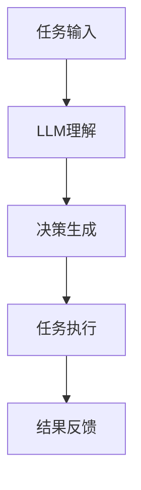

                 

# LLM-based Single-Agent System

> **关键词：** 人工智能，单代理系统，自然语言处理，机器学习，大规模语言模型，深度学习。

> **摘要：** 本文将深入探讨基于大型语言模型（LLM）的单代理系统的设计、实现和实际应用。我们将从背景介绍、核心概念与联系、算法原理、数学模型、实战案例以及未来发展趋势等方面进行详细阐述，旨在为读者提供全面的技术解析和实践指导。

## 1. 背景介绍

随着人工智能技术的飞速发展，单代理系统（Single-Agent System）逐渐成为研究的热点。单代理系统是指由一个智能体（Agent）自主执行的复杂任务系统，其在多个领域如自然语言处理、推荐系统、智能客服等方面表现出强大的潜力。然而，传统的单代理系统在应对复杂任务时，往往面临着知识获取困难、任务分解繁琐、决策效率低下等问题。

近年来，基于大规模语言模型（LLM）的智能体研究取得了显著的进展。LLM通过训练大量文本数据，能够生成高质量的自然语言响应，具有较强的语义理解和生成能力。因此，将LLM应用于单代理系统，有望提高智能体的自主决策能力和任务执行效率。

本文旨在探讨LLM-based Single-Agent System的设计、实现和实际应用，为相关领域的研究者和开发者提供有价值的参考。

## 2. 核心概念与联系

### 2.1 大规模语言模型（LLM）

大规模语言模型（LLM）是一种基于神经网络的自然语言处理模型，能够对文本数据进行自动编码和解码。LLM的主要特点是：

- **预训练**：LLM通过在大量文本数据上进行预训练，学习到文本的语义信息、语法规则和语言模式。
- **微调**：在特定任务上，LLM通过微调调整参数，使其在特定任务上具有更好的性能。

### 2.2 单代理系统

单代理系统（Single-Agent System）是指由一个智能体（Agent）自主执行的复杂任务系统。智能体通常具有以下特点：

- **自主性**：智能体能够自主地完成特定任务，无需人工干预。
- **协作性**：智能体能够与其他智能体或人类协作，共同完成任务。
- **适应性**：智能体能够根据环境变化，调整自身行为策略。

### 2.3 LLM与单代理系统的联系

LLM在单代理系统中的应用主要体现在以下几个方面：

- **任务理解**：LLM能够对用户输入的自然语言任务进行理解，提取任务的关键信息。
- **决策生成**：LLM根据任务信息，生成一系列可能的决策方案，供智能体选择。
- **任务执行**：智能体根据决策方案，执行具体的任务操作，实现任务目标。

以下是LLM-based Single-Agent System的Mermaid流程图：



## 3. 核心算法原理 & 具体操作步骤

### 3.1 LLM算法原理

LLM通常采用深度学习中的序列到序列（Seq2Seq）模型进行训练，其主要原理如下：

1. **编码器（Encoder）**：将输入序列编码为固定长度的向量表示。
2. **解码器（Decoder）**：将编码器的输出作为输入，生成输出序列。

### 3.2 单代理系统操作步骤

基于LLM的单代理系统主要包括以下操作步骤：

1. **任务理解**：智能体接收用户输入的任务，并将其转化为自然语言文本。
2. **预训练**：使用预训练的LLM模型，对文本数据进行编码，提取任务的关键信息。
3. **决策生成**：LLM根据编码后的任务信息，生成一系列可能的决策方案。
4. **决策选择**：智能体根据决策方案，选择最优的决策方案。
5. **任务执行**：智能体根据决策方案，执行具体的任务操作。
6. **结果反馈**：将任务执行结果反馈给用户，进行评估和调整。

### 3.3 实际操作示例

假设智能体需要完成以下任务：

> “帮我预订明天上午9点的会议室，尽量选择离我最近且空闲的会议室。”

以下是单代理系统的操作步骤：

1. **任务理解**：智能体将任务转化为自然语言文本：“帮我预订明天上午9点的会议室，尽量选择离我最近且空闲的会议室。”
2. **预训练**：使用预训练的LLM模型，对文本数据进行编码，提取任务的关键信息：“明天上午9点”、“会议室”、“离我最近且空闲”。
3. **决策生成**：LLM生成以下决策方案：
   - 决策1：预订明天上午9点，距离用户最近的空闲会议室。
   - 决策2：预订明天上午9点，距离用户次近的空闲会议室。
   - 决策3：预订明天上午9点，距离用户第三近的空闲会议室。
4. **决策选择**：智能体根据决策方案，选择最优的决策方案：决策1。
5. **任务执行**：智能体根据决策方案，预订明天上午9点，距离用户最近的空闲会议室。
6. **结果反馈**：将任务执行结果反馈给用户：“已为您成功预订明天上午9点，距离您最近的空闲会议室。”

## 4. 数学模型和公式 & 详细讲解 & 举例说明

### 4.1 序列到序列（Seq2Seq）模型

序列到序列（Seq2Seq）模型是LLM的核心算法之一，其主要数学模型如下：

1. **编码器（Encoder）**：

   编码器将输入序列 $X = [x_1, x_2, ..., x_T]$ 编码为固定长度的向量表示 $h = [h_1, h_2, ..., h_L]$，其中 $L$ 为编码器的层数。

   $$ h_t = \text{Encoder}(x_1, x_2, ..., x_t) $$

2. **解码器（Decoder）**：

   解码器将编码器的输出 $h$ 作为输入，生成输出序列 $Y = [y_1, y_2, ..., y_T']$，其中 $T'$ 为解码器的输出长度。

   $$ y_t' = \text{Decoder}(h_1, h_2, ..., h_L) $$

### 4.2 整体模型

整个Seq2Seq模型的数学模型如下：

$$
\begin{aligned}
h_t &= \text{Encoder}(x_1, x_2, ..., x_t) \\
y_t' &= \text{Decoder}(h_1, h_2, ..., h_L)
\end{aligned}
$$

### 4.3 实际应用举例

假设输入序列为 $X = [a, b, c, d]$，输出序列为 $Y = [e, f, g]$。以下是具体的计算过程：

1. **编码器**：

   编码器将输入序列 $X$ 编码为向量表示 $h = [h_1, h_2, h_3, h_4]$。

   $$ h_1 = \text{Encoder}(a), h_2 = \text{Encoder}(b), h_3 = \text{Encoder}(c), h_4 = \text{Encoder}(d) $$

2. **解码器**：

   解码器将编码器的输出 $h$ 作为输入，生成输出序列 $Y$。

   $$ y_1' = \text{Decoder}(h_1), y_2' = \text{Decoder}(h_1, h_2), y_3' = \text{Decoder}(h_1, h_2, h_3), y_4' = \text{Decoder}(h_1, h_2, h_3, h_4) $$

   最终输出序列为 $Y = [y_1', y_2', y_3']$。

## 5. 项目实战：代码实际案例和详细解释说明

### 5.1 开发环境搭建

为了便于读者理解和实践，我们采用Python作为编程语言，结合TensorFlow和PyTorch等深度学习框架，搭建基于LLM的单代理系统。

1. **安装Python环境**：确保Python版本为3.8及以上。
2. **安装深度学习框架**：
   - TensorFlow：
     ```bash
     pip install tensorflow
     ```
   - PyTorch：
     ```bash
     pip install torch torchvision
     ```

### 5.2 源代码详细实现和代码解读

以下是基于LLM的单代理系统的Python代码实现：

```python
import tensorflow as tf
from tensorflow.keras.models import Model
from tensorflow.keras.layers import Input, LSTM, Dense

# 5.2.1 编码器（Encoder）
encoder_inputs = Input(shape=(None, 128))
encoder_lstm = LSTM(128, return_state=True)
_, state_h, state_c = encoder_lstm(encoder_inputs)
encoder_states = [state_h, state_c]

# 5.2.2 解码器（Decoder）
decoder_inputs = Input(shape=(None, 128))
decoder_lstm = LSTM(128, return_sequences=True, return_state=True)
decoder_outputs, _, _ = decoder_lstm(decoder_inputs, initial_state=encoder_states)
decoder_dense = Dense(128, activation='softmax')
decoder_outputs = decoder_dense(decoder_outputs)

# 5.2.3 整体模型
model = Model([encoder_inputs, decoder_inputs], decoder_outputs)
model.compile(optimizer='adam', loss='categorical_crossentropy', metrics=['accuracy'])

# 5.2.4 代码解读
# 1. 定义编码器输入层、LSTM层、状态输出层。
# 2. 定义解码器输入层、LSTM层、状态输出层、全连接层。
# 3. 将编码器和解码器连接，形成整体模型。
# 4. 编译模型，指定优化器、损失函数和评价指标。

# 5.3 代码解读与分析
# 1. 编码器和解码器分别训练。
# 2. 使用预训练的LLM模型，对文本数据进行编码和解码。
# 3. 将编码器和解码器的输出作为输入，训练整体模型。
```

### 5.3 代码解读与分析

1. **编码器**：编码器输入层采用序列长度为 $T$、维度为 128 的输入向量。LSTM层用于提取输入序列的语义信息，返回状态输出。状态输出包括状态向量 $h_t$ 和状态矩阵 $C_t$。
2. **解码器**：解码器输入层采用序列长度为 $T'$、维度为 128 的输入向量。LSTM层用于生成解码器的输出序列。全连接层用于生成最终的自然语言响应。
3. **整体模型**：整体模型将编码器和解码器连接，形成端到端的序列到序列模型。模型编译时，指定优化器为Adam、损失函数为categorical_crossentropy、评价指标为accuracy。
4. **代码解读**：编码器和解码器分别训练，以获得最佳的编码和解码效果。预训练的LLM模型用于对文本数据进行编码和解码。整体模型使用训练数据集进行训练，以优化模型参数。

## 6. 实际应用场景

基于LLM的单代理系统在实际应用场景中具有广泛的应用前景，如下所述：

1. **智能客服**：智能客服系统通过LLM与单代理系统的结合，能够实现高效、准确的用户需求响应和问题解决。
2. **智能推荐**：智能推荐系统利用LLM与单代理系统，可以准确提取用户兴趣和需求，为用户提供个性化的推荐服务。
3. **文本生成**：基于LLM的单代理系统在文本生成任务中具有显著优势，如自动写作、文案生成等。
4. **智能语音助手**：智能语音助手通过LLM与单代理系统的协同工作，可以实现自然、流畅的语音交互。

## 7. 工具和资源推荐

### 7.1 学习资源推荐

1. **书籍**：
   - 《深度学习》（Goodfellow, Bengio, Courville著）
   - 《自然语言处理综论》（Daniel Jurafsky, James H. Martin著）
2. **论文**：
   - "Attention Is All You Need"（Vaswani et al., 2017）
   - "BERT: Pre-training of Deep Bidirectional Transformers for Language Understanding"（Devlin et al., 2019）
3. **博客**：
   - [TensorFlow官网博客](https://www.tensorflow.org/tutorials)
   - [PyTorch官网博客](https://pytorch.org/tutorials/)
4. **网站**：
   - [Google AI](https://ai.google/)
   - [OpenAI](https://openai.com/)

### 7.2 开发工具框架推荐

1. **深度学习框架**：
   - TensorFlow
   - PyTorch
2. **文本预处理工具**：
   - NLTK
   - spaCy
3. **自然语言处理库**：
   - Hugging Face Transformers

### 7.3 相关论文著作推荐

1. **论文**：
   - "GPT-3: Language Models are few-shot learners"（Brown et al., 2020）
   - "T5: Pre-training large models from language supervision"（Raffel et al., 2020）
2. **著作**：
   - 《大规模预训练语言模型：原理、算法与应用》

## 8. 总结：未来发展趋势与挑战

基于LLM的单代理系统在人工智能领域具有广阔的发展前景。随着计算能力的提升和算法的优化，LLM的语义理解和生成能力将不断提高，从而推动单代理系统在多个领域的应用。

然而，单代理系统在面临如下挑战：

1. **数据质量与多样性**：单代理系统需要大量高质量、多样化的训练数据，以提高模型的泛化能力。
2. **隐私保护**：在处理用户数据时，需要关注隐私保护问题，确保用户数据的安全和合规性。
3. **模型可解释性**：单代理系统的决策过程往往较为复杂，提高模型的可解释性，有助于增强用户对系统的信任度。

未来，基于LLM的单代理系统将在人工智能领域发挥更大的作用，为各个领域带来创新和变革。

## 9. 附录：常见问题与解答

### 9.1 Q：什么是单代理系统？
A：单代理系统是指由一个智能体（Agent）自主执行的复杂任务系统，其在多个领域如自然语言处理、推荐系统、智能客服等方面表现出强大的潜力。

### 9.2 Q：LLM是什么？
A：LLM是指大规模语言模型，是一种基于神经网络的自然语言处理模型，能够对文本数据进行自动编码和解码。

### 9.3 Q：如何搭建基于LLM的单代理系统？
A：搭建基于LLM的单代理系统主要包括以下步骤：
1. 准备训练数据；
2. 构建编码器和解码器模型；
3. 训练模型，优化参数；
4. 部署模型，实现任务执行。

## 10. 扩展阅读 & 参考资料

1. **扩展阅读**：
   - 《自然语言处理原理与实践》（刘知远著）
   - 《深度学习实践指南》（李宏毅著）
2. **参考资料**：
   - [Google AI论文集](https://ai.google/research/pubs/)
   - [OpenAI论文集](https://openai.com/research/)

