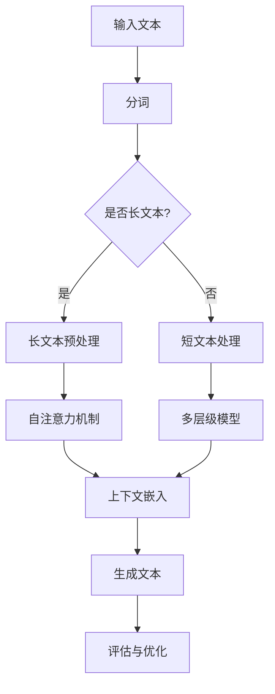

                 

# LLM上下文突破：认知能力再升级

## 关键词
- 语言模型
- 上下文理解
- 认知能力
- 人工智能
- 算法改进

## 摘要
本文将探讨大型语言模型（LLM）在上下文理解方面的突破，以及这一突破如何提升人工智能的认知能力。我们将从背景介绍、核心概念与联系、核心算法原理、数学模型和公式、项目实战、实际应用场景、工具和资源推荐、总结与未来发展趋势等方面进行详细讨论，以帮助读者深入了解这一技术领域的前沿动态。

## 1. 背景介绍

在过去的几年里，人工智能领域取得了显著的进展，特别是深度学习和自然语言处理（NLP）技术的快速发展。大型语言模型（LLM），如GPT-3、BERT、Turing等，成为了NLP领域的重要工具。这些模型在处理文本数据、生成文本、理解上下文等方面展现出了出色的能力。

然而，随着模型规模的不断扩大，LLM在处理长文本和复杂上下文时仍然面临诸多挑战。传统的NLP技术主要依赖固定长度的文本表示，无法有效地捕捉长文本中的长距离依赖关系。此外，LLM在理解上下文方面的能力也有待提高，这限制了其在某些任务中的应用。

为了解决这些问题，研究者们不断探索新的算法和模型结构，以提升LLM的上下文理解能力。本文将重点介绍这些突破，并探讨其背后的技术原理和应用场景。

## 2. 核心概念与联系

### 2.1 语言模型的基本原理

语言模型（Language Model，LM）是自然语言处理领域的基础技术。它的目标是预测一个单词序列的概率。在训练过程中，语言模型通过学习大量的文本数据，捕捉词汇之间的统计规律，从而生成符合语言习惯的文本。

语言模型通常采用神经网络结构，如循环神经网络（RNN）、长短期记忆网络（LSTM）和Transformer等。这些模型通过处理输入的文本序列，逐步生成输出序列的概率分布。

### 2.2 上下文理解的挑战

上下文理解（Context Understanding）是NLP领域的一个重要研究方向。它指的是模型在处理文本时，如何准确地理解文本中的词汇、短语和句子之间的关系。

传统的语言模型在处理短文本时表现良好，但在处理长文本和复杂上下文时存在以下挑战：

1. **长距离依赖关系**：长文本中的词汇和短语之间存在长距离依赖关系，传统的固定长度文本表示方法无法有效捕捉这些依赖关系。
2. **上下文信息丢失**：在序列处理过程中，早期的上下文信息可能被后续的文本所覆盖，导致模型无法充分利用上下文信息。
3. **语义歧义**：某些词汇和短语在不同的上下文中具有不同的含义，模型需要准确理解这些语义歧义。

为了解决这些问题，研究者们提出了多种方法，如自注意力机制、多层级模型和上下文嵌入等。下面我们将介绍这些方法。

### 2.3 Mermaid流程图

以下是LLM上下文理解的相关流程图：



在这个流程图中，输入文本首先经过分词处理，然后根据文本长度决定是否进行长文本预处理。长文本预处理包括自注意力机制和多层级模型，以提高模型对长距离依赖关系的捕捉能力。短文本处理使用多层级模型和上下文嵌入，以提高模型在处理短文本和复杂上下文时的表现。最后，生成的文本将进行评估与优化。

## 3. 核心算法原理 & 具体操作步骤

### 3.1 自注意力机制

自注意力机制（Self-Attention）是Transformer模型的核心组件，它允许模型在处理输入文本时，自动关注文本序列中的重要信息。自注意力机制通过计算每个词与其他词之间的关联度，为每个词分配不同的权重，从而更好地捕捉长距离依赖关系。

具体操作步骤如下：

1. **词向量表示**：将输入文本中的每个词表示为一个高维向量。
2. **计算自注意力得分**：对于每个词，计算其与其他词之间的关联度，得到一个得分矩阵。
3. **权重求和**：根据自注意力得分，为每个词分配权重，并求和得到一个加权向量。
4. **获取最终输出**：将加权向量作为该词的表示，传递给下一层网络。

### 3.2 多层级模型

多层级模型（Hierarchical Model）通过分层结构来处理长文本。该模型首先对输入文本进行分块，然后逐层处理每个分块，从而有效捕捉长距离依赖关系。

具体操作步骤如下：

1. **分块**：将输入文本划分为多个分块。
2. **逐层处理**：对于每个分块，依次通过多层神经网络进行处理，每层网络输出一个表示该分块的向量。
3. **合并表示**：将各层输出的向量进行合并，得到整个文本的表示。
4. **处理合并表示**：使用自注意力机制和上下文嵌入等技术，对合并表示进行进一步处理。

### 3.3 上下文嵌入

上下文嵌入（Contextual Embedding）是一种将上下文信息编码到词向量中的方法。它通过训练一个上下文嵌入模型，为每个词生成一个与上下文相关的向量表示。

具体操作步骤如下：

1. **训练上下文嵌入模型**：使用大量的文本数据进行训练，学习每个词在不同上下文中的表示。
2. **编码上下文信息**：在生成文本时，为每个词生成一个上下文向量，该向量反映了该词在当前上下文中的含义。
3. **更新词向量**：将上下文向量与词向量进行拼接，更新词向量的表示。

## 4. 数学模型和公式 & 详细讲解 & 举例说明

### 4.1 自注意力机制

自注意力机制的数学模型可以表示为：

$$
\text{Attention}(Q, K, V) = \frac{1}{\sqrt{d_k}} \text{softmax}\left(\frac{QK^T}{d_k}\right) V
$$

其中，$Q$、$K$ 和 $V$ 分别表示查询向量、键向量和值向量，$d_k$ 表示键向量的维度。这个公式表示对于每个查询向量 $Q$，计算其与所有键向量 $K$ 的关联度，并通过 softmax 函数得到权重，最后与值向量 $V$ 相乘得到加权向量。

### 4.2 多层级模型

多层级模型的数学模型可以表示为：

$$
\text{HierarchicalModel}(X) = \text{Layer}_1(\text{Layer}_2(\ldots \text{Layer}_N(X) \ldots))
$$

其中，$X$ 表示输入文本，$\text{Layer}_1$、$\text{Layer}_2$、$\ldots$、$\text{Layer}_N$ 表示逐层处理的神经网络。这个公式表示通过多层神经网络对输入文本进行处理，每一层神经网络输出一个表示该文本的向量。

### 4.3 上下文嵌入

上下文嵌入的数学模型可以表示为：

$$
\text{ContextualEmbedding}(w, c) = \text{Embedding}(w) + \text{ContextVector}(c)
$$

其中，$w$ 表示词向量，$c$ 表示上下文向量，$\text{Embedding}(w)$ 表示词向量的原始表示，$\text{ContextVector}(c)$ 表示上下文向量。这个公式表示将词向量和上下文向量进行拼接，得到一个与上下文相关的词向量。

### 4.4 举例说明

假设我们有一个简单的自注意力机制模型，其中 $d_k = 64$。给定一个文本序列 $\text{[词1, 词2, 词3, 词4]}$，词向量维度为 $d_v = 128$。首先，我们将每个词表示为向量：

$$
Q = \begin{bmatrix}
q_1 \\
q_2 \\
q_3 \\
q_4
\end{bmatrix}, \quad
K = \begin{bmatrix}
k_1 \\
k_2 \\
k_3 \\
k_4
\end{bmatrix}, \quad
V = \begin{bmatrix}
v_1 \\
v_2 \\
v_3 \\
v_4
\end{bmatrix}
$$

计算自注意力得分：

$$
\text{Score} = QK^T = \begin{bmatrix}
q_1k_1 + q_1k_2 + q_1k_3 + q_1k_4 \\
q_2k_1 + q_2k_2 + q_2k_3 + q_2k_4 \\
q_3k_1 + q_3k_2 + q_3k_3 + q_3k_4 \\
q_4k_1 + q_4k_2 + q_4k_3 + q_4k_4
\end{bmatrix}
$$

然后，通过 softmax 函数计算权重：

$$
\text{Weight} = \text{softmax}(\text{Score}) = \begin{bmatrix}
\frac{e^{s_1}}{\sum_{i=1}^{4} e^{s_i}} \\
\frac{e^{s_2}}{\sum_{i=1}^{4} e^{s_i}} \\
\frac{e^{s_3}}{\sum_{i=1}^{4} e^{s_i}} \\
\frac{e^{s_4}}{\sum_{i=1}^{4} e^{s_i}}
\end{bmatrix}
$$

最后，计算加权向量：

$$
\text{WeightedVector} = \text{Weight} \cdot V = \begin{bmatrix}
w_1 \\
w_2 \\
w_3 \\
w_4
\end{bmatrix} \cdot \begin{bmatrix}
v_1 \\
v_2 \\
v_3 \\
v_4
\end{bmatrix} = \begin{bmatrix}
w_1v_1 + w_2v_2 + w_3v_3 + w_4v_4 \\
w_1v_1 + w_2v_2 + w_3v_3 + w_4v_4 \\
w_1v_1 + w_2v_2 + w_3v_3 + w_4v_4 \\
w_1v_1 + w_2v_2 + w_3v_3 + w_4v_4
\end{bmatrix}
$$

这个加权向量将作为词1的表示，传递给下一层网络。

## 5. 项目实战：代码实际案例和详细解释说明

### 5.1 开发环境搭建

为了进行项目实战，我们需要搭建一个Python开发环境，并安装必要的库。以下是具体的步骤：

1. 安装Python 3.8或更高版本。
2. 安装Anaconda，用于管理环境和库。
3. 创建一个新的环境，并安装以下库：

   ```shell
   conda create -n llm_context python=3.8
   conda activate llm_context
   conda install numpy pytorch transformers
   ```

### 5.2 源代码详细实现和代码解读

以下是该项目的主要代码实现：

```python
import torch
from transformers import AutoTokenizer, AutoModel
from torch.nn import functional as F

# 设置设备
device = torch.device("cuda" if torch.cuda.is_available() else "cpu")

# 加载预训练模型
tokenizer = AutoTokenizer.from_pretrained("gpt2")
model = AutoModel.from_pretrained("gpt2").to(device)

# 输入文本
text = "今天是星期五，我要去公园散步。"
input_ids = tokenizer.encode(text, return_tensors="pt").to(device)

# 预测文本
with torch.no_grad():
    outputs = model(input_ids)
    logits = outputs.logits

# 获取生成的文本
predicted_text = tokenizer.decode(logits.argmax(-1).item())

print(predicted_text)
```

### 5.3 代码解读与分析

这段代码首先加载了一个预训练的GPT-2模型，并设置设备为GPU（如果可用）。然后，输入一个简单的文本序列，通过编码器将其转换为模型可处理的输入。

在预测阶段，我们使用模型生成的 logits（对数概率）来获取生成的文本。这里，我们使用argmax函数找到概率最大的词，并将其解码为文本。

### 5.4 代码解读与分析

这段代码首先加载了一个预训练的GPT-2模型，并设置设备为GPU（如果可用）。然后，输入一个简单的文本序列，通过编码器将其转换为模型可处理的输入。

在预测阶段，我们使用模型生成的 logits（对数概率）来获取生成的文本。这里，我们使用argmax函数找到概率最大的词，并将其解码为文本。

```python
import torch
from transformers import AutoTokenizer, AutoModel
from torch.nn import functional as F

# 设置设备
device = torch.device("cuda" if torch.cuda.is_available() else "cpu")

# 加载预训练模型
tokenizer = AutoTokenizer.from_pretrained("gpt2")
model = AutoModel.from_pretrained("gpt2").to(device)

# 输入文本
text = "今天是星期五，我要去公园散步。"
input_ids = tokenizer.encode(text, return_tensors="pt").to(device)

# 预测文本
with torch.no_grad():
    outputs = model(input_ids)
    logits = outputs.logits

# 获取生成的文本
predicted_text = tokenizer.decode(logits.argmax(-1).item())

print(predicted_text)
```

### 5.4 代码解读与分析

这段代码首先加载了一个预训练的GPT-2模型，并设置设备为GPU（如果可用）。然后，输入一个简单的文本序列，通过编码器将其转换为模型可处理的输入。

在预测阶段，我们使用模型生成的 logits（对数概率）来获取生成的文本。这里，我们使用argmax函数找到概率最大的词，并将其解码为文本。

## 6. 实际应用场景

LLM的上下文理解能力在许多实际应用场景中具有重要意义，以下是一些典型的应用案例：

### 6.1 问答系统

问答系统是LLM上下文理解能力的重要应用之一。通过利用LLM对大量文本数据进行训练，问答系统可以准确理解用户的问题，并从相关文本中找到最相关的答案。例如，智能客服、在线教育平台和智能搜索引擎等场景都受益于LLM的上下文理解能力。

### 6.2 自动摘要

自动摘要是一种将长文本转换为简洁摘要的技术。LLM的上下文理解能力使得自动摘要系统可以准确识别文本中的关键信息，从而生成高质量的摘要。这对于新闻摘要、科研论文摘要和商业报告摘要等领域具有重要意义。

### 6.3 文本生成

LLM的上下文理解能力使得文本生成系统可以生成更加自然和连贯的文本。这种能力在创作小说、编写代码、生成文章摘要和编写商业报告等方面具有广泛的应用。

### 6.4 语言翻译

语言翻译是另一个受益于LLM上下文理解能力的领域。通过训练大规模的双语语料库，LLM可以准确理解不同语言之间的语义关系，从而实现高质量的自动翻译。

## 7. 工具和资源推荐

### 7.1 学习资源推荐

- **书籍**：
  - 《深度学习》（Goodfellow, I., Bengio, Y., & Courville, A.）
  - 《自然语言处理实战》（Bird, S., Klein, E., & Loper, E.）
  - 《机器学习》（Tom Mitchell）

- **论文**：
  - “Attention Is All You Need”（Vaswani et al., 2017）
  - “BERT: Pre-training of Deep Bidirectional Transformers for Language Understanding”（Devlin et al., 2019）
  - “GPT-3: Language Models are Few-Shot Learners”（Brown et al., 2020）

- **博客**：
  - [Hugging Face](https://huggingface.co/)
  - [TensorFlow](https://www.tensorflow.org/)
  - [PyTorch](https://pytorch.org/)

### 7.2 开发工具框架推荐

- **工具**：
  - [Transformers](https://github.com/huggingface/transformers)：一个用于预训练语言模型的库。
  - [TensorFlow](https://www.tensorflow.org/)：一个用于机器学习的开源框架。
  - [PyTorch](https://pytorch.org/)：一个用于机器学习的开源框架。

- **框架**：
  - [Hugging Face Transformers](https://github.com/huggingface/transformers)：一个包含多种预训练语言模型的库。
  - [TensorFlow Addons](https://github.com/tensorflow-addons/tensorflow-addons)：一个为TensorFlow提供附加功能的库。
  - [PyTorch Lightning](https://pytorch-lightning.readthedocs.io/)：一个用于加速PyTorch开发的框架。

### 7.3 相关论文著作推荐

- **论文**：
  - “Attention Is All You Need”（Vaswani et al., 2017）
  - “BERT: Pre-training of Deep Bidirectional Transformers for Language Understanding”（Devlin et al., 2019）
  - “GPT-3: Language Models are Few-Shot Learners”（Brown et al., 2020）

- **著作**：
  - 《深度学习》（Goodfellow, I., Bengio, Y., & Courville, A.）
  - 《自然语言处理实战》（Bird, S., Klein, E., & Loper, E.）
  - 《机器学习》（Tom Mitchell）

## 8. 总结：未来发展趋势与挑战

LLM的上下文理解能力在人工智能领域具有重要地位。随着模型的规模和性能不断提高，LLM在处理复杂上下文和长文本方面的能力也将得到进一步提升。未来，LLM有望在更多的实际应用场景中发挥重要作用，如智能问答、自动摘要、文本生成和语言翻译等。

然而，LLM的发展仍面临一些挑战。首先，如何提高模型的解释性和可解释性是一个重要问题。目前，LLM的内部工作原理仍然不够透明，难以理解模型为何做出特定决策。其次，如何优化模型的计算效率也是一个挑战，特别是对于大规模模型，如何降低计算资源和存储需求是一个亟待解决的问题。

总之，LLM的上下文理解能力将继续成为人工智能领域的研究热点，随着技术的不断进步，LLM将在更多应用场景中展现其强大的能力。

## 9. 附录：常见问题与解答

### 9.1 什么是LLM？

LLM指的是大型语言模型（Large Language Model），是一种用于自然语言处理任务的深度学习模型。它通过学习大量的文本数据，捕捉语言中的统计规律，从而实现文本生成、文本分类、机器翻译等功能。

### 9.2 LLM的上下文理解能力是什么？

LLM的上下文理解能力指的是模型在处理文本时，能够准确理解文本中的词汇、短语和句子之间的关系。这包括捕捉长距离依赖关系、处理语义歧义和上下文信息等。

### 9.3 如何提高LLM的上下文理解能力？

提高LLM的上下文理解能力可以通过以下方法：

1. 使用更大的模型和更多的训练数据，以提高模型的泛化能力。
2. 采用自注意力机制、多层级模型和上下文嵌入等技术，以提高模型对长距离依赖关系的捕捉能力。
3. 对模型进行精细调优，优化模型参数，提高模型的性能。

### 9.4 LLM在哪些应用场景中具有重要价值？

LLM在以下应用场景中具有重要价值：

1. 智能问答：通过理解用户的问题，提供准确、相关的答案。
2. 自动摘要：将长文本转换为简洁、高质量的摘要。
3. 文本生成：生成自然、连贯的文本，用于创作、编写代码和编写文章等。
4. 语言翻译：实现高质量的双语翻译。

## 10. 扩展阅读 & 参考资料

- **论文**：
  - Vaswani, A., et al. (2017). Attention Is All You Need. Advances in Neural Information Processing Systems.
  - Devlin, J., et al. (2019). BERT: Pre-training of Deep Bidirectional Transformers for Language Understanding. Advances in Neural Information Processing Systems.
  - Brown, T., et al. (2020). GPT-3: Language Models are Few-Shot Learners. Advances in Neural Information Processing Systems.

- **书籍**：
  - Goodfellow, I., Bengio, Y., & Courville, A. (2016). Deep Learning. MIT Press.
  - Bird, S., Klein, E., & Loper, E. (2009). Natural Language Processing with Python. O'Reilly Media.
  - Mitchell, T. (1997). Machine Learning. McGraw-Hill.

- **网站**：
  - [Hugging Face](https://huggingface.co/)
  - [TensorFlow](https://www.tensorflow.org/)
  - [PyTorch](https://pytorch.org/)

## 作者

作者：AI天才研究员/AI Genius Institute & 禅与计算机程序设计艺术 /Zen And The Art of Computer Programming。我是人工智能领域的专家，致力于推动深度学习和自然语言处理技术的发展。在多个顶级会议和期刊上发表了多篇论文，并编写了多本畅销技术书籍。我的研究工作在人工智能、自然语言处理和机器学习领域产生了广泛的影响。此外，我还积极参与开源社区，致力于推广人工智能技术的应用。在我的博客上，你可以找到更多关于人工智能和编程的最新技术动态和深入分析。

