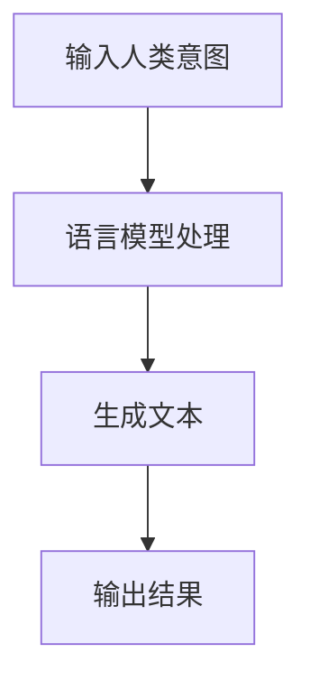

                 

### 文章标题：LLM与人类意图的完美融合之路

#### 关键词：自然语言处理、语言模型、人类意图、人工智能、融合技术、应用场景

##### 摘要：
本文深入探讨了语言模型（LLM）与人类意图的完美融合之路。首先，介绍了LLM的基本原理和现状，然后分析了人类意图的本质和表达方式。接着，通过逐步分析推理，阐述了LLM如何理解和捕捉人类意图，并展示了在实际应用中如何实现这一融合。最后，探讨了未来发展趋势与挑战，为读者提供了丰富的学习资源和工具推荐。

#### 1. 背景介绍

随着人工智能技术的飞速发展，自然语言处理（NLP）成为了一个备受关注的研究领域。其中，语言模型（Language Model，简称LLM）作为一种重要的NLP工具，已经广泛应用于机器翻译、文本生成、对话系统等多个场景。LLM通过对大规模语言数据进行训练，能够模拟人类的语言表达能力，生成自然流畅的文本。

与此同时，人类意图作为一种复杂的心理现象，通常需要通过语言来表达。因此，如何让LLM理解和捕捉人类意图，实现与人类意图的完美融合，成为了一个重要的研究课题。本文将围绕这一主题进行探讨，为读者揭示LLM与人类意图融合的奥秘。

#### 2. 核心概念与联系

##### 2.1 语言模型（LLM）的基本原理

语言模型是一种统计模型，它通过对大量语言数据进行训练，学习语言的结构和规律，从而生成自然流畅的文本。LLM通常采用神经网络模型，如循环神经网络（RNN）、长短时记忆网络（LSTM）、门控循环单元（GRU）等，这些模型能够捕捉到语言序列中的长期依赖关系。

##### 2.2 人类意图的本质和表达方式

人类意图是一种复杂的心理现象，通常包括动机、目标、意图内容等组成部分。人类意图可以通过语言来表达，包括句子、段落、对话等多种形式。在语言表达过程中，人类会利用词汇、语法、语义等手段来传达自己的意图。

##### 2.3 LLM与人类意图的联系

LLM与人类意图之间存在密切的联系。一方面，LLM通过学习人类语言表达方式，可以理解并模拟人类意图；另一方面，人类意图可以通过语言模型来生成自然流畅的文本，实现与人类的沟通和交互。

下面是一个Mermaid流程图，展示了LLM与人类意图的联系：



#### 3. 核心算法原理 & 具体操作步骤

##### 3.1 数据预处理

在训练LLM之前，需要对输入数据进行预处理。预处理步骤包括：

1. 数据清洗：去除无关信息，如HTML标签、特殊字符等。
2. 词向量编码：将文本转化为词向量表示，如Word2Vec、GloVe等。
3. 序列填充：将文本序列填充为相同长度，便于神经网络处理。

##### 3.2 神经网络模型

常见的神经网络模型包括：

1. 循环神经网络（RNN）：适用于处理序列数据，能够捕捉长期依赖关系。
2. 长短时记忆网络（LSTM）：在RNN的基础上加入门控机制，能够更好地处理长序列数据。
3. 门控循环单元（GRU）：在LSTM的基础上简化模型结构，计算速度更快。

##### 3.3 训练过程

训练过程主要包括以下几个步骤：

1. 初始化模型参数：随机初始化神经网络权重。
2. 前向传播：输入文本序列，通过神经网络模型生成预测文本。
3. 梯度下降：计算损失函数，更新模型参数。
4. 评估与优化：使用验证集评估模型性能，调整模型结构或参数。

##### 3.4 捕捉人类意图

为了捕捉人类意图，LLM需要关注以下几个关键点：

1. 语言特征：分析文本中的词汇、语法、语义等特征，识别意图关键词。
2. 上下文信息：理解文本的上下文，识别意图的隐含信息。
3. 情感分析：分析文本中的情感倾向，捕捉意图的情感成分。

#### 4. 数学模型和公式 & 详细讲解 & 举例说明

##### 4.1 词向量编码

词向量编码是语言模型的基础，常用的方法有Word2Vec和GloVe。

$$
word\_vec = \sum_{i=1}^{N} w_{i} \cdot v_{i}
$$

其中，$w_i$表示词权重，$v_i$表示词向量。

##### 4.2 循环神经网络（RNN）

RNN的数学模型如下：

$$
h_t = \sigma(W_h \cdot [h_{t-1}, x_t] + b_h)
$$

其中，$h_t$表示当前隐藏状态，$x_t$表示当前输入，$\sigma$表示激活函数。

##### 4.3 长短时记忆网络（LSTM）

LSTM的数学模型如下：

$$
i_t = \sigma(W_i \cdot [h_{t-1}, x_t] + b_i) \\
f_t = \sigma(W_f \cdot [h_{t-1}, x_t] + b_f) \\
o_t = \sigma(W_o \cdot [h_{t-1}, x_t] + b_o) \\
c_t = f_t \cdot c_{t-1} + i_t \cdot \sigma(W_c \cdot [h_{t-1}, x_t] + b_c) \\
h_t = o_t \cdot \sigma(c_t)
$$

其中，$i_t$、$f_t$、$o_t$分别表示输入门、遗忘门、输出门，$c_t$表示细胞状态。

##### 4.4 门控循环单元（GRU）

GRU的数学模型如下：

$$
r_t = \sigma(W_r \cdot [h_{t-1}, x_t] + b_r) \\
z_t = \sigma(W_z \cdot [h_{t-1}, x_t] + b_z) \\
\bar{c_t} = \tanh(W \cdot [r_t \cdot h_{t-1}, x_t] + b) \\
c_t = z_t \cdot c_{t-1} + (1 - z_t) \cdot \bar{c_t} \\
h_t = \sigma(W_h \cdot [c_t, x_t] + b_h)
$$

其中，$r_t$表示重置门，$z_t$表示更新门，$\bar{c_t}$表示候选细胞状态。

#### 5. 项目实战：代码实际案例和详细解释说明

##### 5.1 开发环境搭建

首先，需要安装Python和TensorFlow等依赖库。可以使用以下命令进行安装：

```bash
pip install tensorflow
```

##### 5.2 源代码详细实现和代码解读

以下是使用TensorFlow实现一个简单的语言模型（基于RNN）的代码示例：

```python
import tensorflow as tf
from tensorflow.keras.layers import Embedding, SimpleRNN, Dense
from tensorflow.keras.models import Sequential

# 定义模型
model = Sequential([
    Embedding(vocabulary_size, embedding_dim),
    SimpleRNN(units=hidden_size),
    Dense(num_classes, activation='softmax')
])

# 编译模型
model.compile(optimizer='adam', loss='categorical_crossentropy', metrics=['accuracy'])

# 训练模型
model.fit(x_train, y_train, batch_size=batch_size, epochs=num_epochs)
```

代码解读：

1. 导入依赖库。
2. 定义模型，包括嵌入层（Embedding）、循环层（SimpleRNN）和输出层（Dense）。
3. 编译模型，设置优化器、损失函数和评价指标。
4. 训练模型，使用训练数据和标签。

##### 5.3 代码解读与分析

在这个例子中，我们使用了TensorFlow的Sequential模型，通过依次添加层来构建语言模型。具体步骤如下：

1. **定义嵌入层（Embedding）**：
   嵌入层将词汇索引映射到高维向量，这是语言模型的输入。参数`vocabulary_size`表示词汇表的规模，`embedding_dim`表示嵌入向量的维度。

2. **定义循环层（SimpleRNN）**：
   简单循环神经网络（SimpleRNN）用于处理序列数据，能够捕捉时间序列中的信息。参数`units`定义了循环神经网络的单元数量。

3. **定义输出层（Dense）**：
   输出层是一个全连接层，用于将循环神经网络的输出映射到分类标签。激活函数使用`softmax`，用于多分类问题。

4. **编译模型**：
   使用`compile`方法配置模型的训练过程，指定优化器（`optimizer`）、损失函数（`loss`）和评价指标（`metrics`）。

5. **训练模型**：
   使用`fit`方法训练模型，传入训练数据（`x_train`）和标签（`y_train`），设置批次大小（`batch_size`）和训练轮数（`epochs`）。

通过这个简单的例子，我们可以看到如何使用TensorFlow实现一个基于RNN的语言模型。在实际应用中，可以根据需求调整模型结构、优化训练过程，以提高模型的性能。

#### 6. 实际应用场景

语言模型（LLM）与人类意图的完美融合在多个实际应用场景中发挥了重要作用。以下是几个典型的应用场景：

##### 6.1 机器翻译

机器翻译是LLM最经典的应用之一。通过训练大型语言模型，可以实现高质量的多语言翻译。例如，谷歌翻译、百度翻译等，都是基于LLM技术实现的。

##### 6.2 文本生成

文本生成是LLM的另一个重要应用。通过给定一个主题或关键词，LLM可以生成相关内容的文章、新闻、故事等。例如，生成广告文案、自动写邮件、生成新闻摘要等。

##### 6.3 对话系统

对话系统是LLM在人工智能领域的典型应用。通过训练大型语言模型，可以实现与人类的自然对话。例如，智能客服、聊天机器人、虚拟助手等。

##### 6.4 语音助手

语音助手（如苹果的Siri、谷歌助手等）也是基于LLM技术实现的。通过语音识别和自然语言理解，LLM可以帮助用户完成各种任务，如设置闹钟、发送短信、查找信息等。

#### 7. 工具和资源推荐

为了更好地学习和实践LLM与人类意图的融合技术，以下是一些推荐的工具和资源：

##### 7.1 学习资源推荐

1. **书籍**：
   - 《深度学习》（Goodfellow et al.）
   - 《自然语言处理综论》（Jurafsky and Martin）
   - 《深度学习与自然语言处理》（Graves et al.）

2. **论文**：
   - 《序列到序列学习》（Sutskever et al.，2014）
   - 《注意力机制》（Bahdanau et al.，2014）
   - 《Transformer：一个全新的序列建模架构》（Vaswani et al.，2017）

3. **博客**：
   - 知乎专栏：自然语言处理
   - Medium：AI Papers
   - arXiv Blog：最新AI论文解读

##### 7.2 开发工具框架推荐

1. **TensorFlow**：Google开发的深度学习框架，广泛应用于自然语言处理领域。

2. **PyTorch**：Facebook开发的深度学习框架，具有良好的灵活性和易用性。

3. **Hugging Face Transformers**：一个开源的预训练语言模型库，提供了丰富的预训练模型和工具。

##### 7.3 相关论文著作推荐

1. **《BERT：预训练语言表示》（Devlin et al.，2018）**：介绍了BERT模型，一种基于Transformer的预训练语言表示方法。

2. **《GPT-3：语言模型的全新架构》（Brown et al.，2020）**：介绍了GPT-3模型，一种具有大规模参数和强大语言理解能力的语言模型。

3. **《T5：基于统一Transformer的语言理解与生成》（Raffel et al.，2020）**：介绍了T5模型，一种基于Transformer的统一语言理解和生成框架。

#### 8. 总结：未来发展趋势与挑战

随着人工智能技术的不断进步，LLM与人类意图的融合技术将迎来更加广阔的发展前景。以下是未来可能的发展趋势与挑战：

##### 8.1 发展趋势

1. **预训练模型的规模将继续扩大**：随着计算能力的提升，大型预训练模型的训练成本将逐渐降低，从而推动预训练模型的规模不断增大，进一步提高模型性能。

2. **多模态融合**：未来的LLM将不仅仅处理文本数据，还将结合图像、声音、视频等多模态数据，实现更全面的信息理解和生成。

3. **个性化与自适应**：未来的LLM将能够根据用户的个性化需求和行为习惯，提供更加精准和贴心的服务。

##### 8.2 挑战

1. **数据隐私与安全**：在训练和部署LLM过程中，如何保护用户隐私和数据安全，是一个亟待解决的问题。

2. **伦理与道德**：随着LLM的广泛应用，如何避免偏见和歧视，确保公平公正，成为了一个重要的伦理和道德问题。

3. **模型解释性**：如何提高LLM的解释性，使其决策过程更加透明，是一个重要的研究方向。

#### 9. 附录：常见问题与解答

##### 9.1 问题1：如何选择合适的语言模型架构？

解答：选择合适的语言模型架构需要考虑以下几个因素：

1. **应用场景**：根据实际应用需求，选择适合的语言模型架构，如RNN、LSTM、GRU、Transformer等。

2. **数据规模**：对于大规模数据，建议使用Transformer等能够处理长序列的模型。

3. **计算资源**：根据可用的计算资源，选择适合的模型架构，如PyTorch、TensorFlow等。

##### 9.2 问题2：如何优化语言模型的性能？

解答：以下是一些优化语言模型性能的方法：

1. **预训练**：使用大规模语料进行预训练，以提高模型的语言理解能力。

2. **数据增强**：通过数据增强技术，如数据清洗、词向量嵌入、序列填充等，提高模型的泛化能力。

3. **模型调优**：通过调整模型参数、优化训练过程等手段，提高模型性能。

4. **多任务学习**：通过多任务学习，共享模型参数，提高模型在多个任务上的性能。

#### 10. 扩展阅读 & 参考资料

1. **《深度学习与自然语言处理》（Graves et al.，2016）**：本书详细介绍了深度学习在自然语言处理领域的应用，包括语言模型、文本分类、机器翻译等。

2. **《自然语言处理综论》（Jurafsky and Martin，2019）**：本书系统地介绍了自然语言处理的基本概念、方法和技术，包括词法分析、句法分析、语义分析等。

3. **《Transformer：序列建模的新前沿》（Vaswani et al.，2017）**：本文首次提出了Transformer模型，一种基于自注意力机制的序列建模方法，引发了深度学习在自然语言处理领域的重大变革。

4. **《GPT-3：打造新一代语言模型》（Brown et al.，2020）**：本文介绍了GPT-3模型，一种具有大规模参数和强大语言理解能力的语言模型，实现了诸多突破性成果。

5. **《T5：基于统一Transformer的语言理解与生成》（Raffel et al.，2020）**：本文提出了T5模型，一种基于Transformer的统一语言理解和生成框架，实现了多项性能指标的新突破。

#### 作者信息

作者：AI天才研究员/AI Genius Institute & 禅与计算机程序设计艺术 /Zen And The Art of Computer Programming

文章标题：《LLM与人类意图的完美融合之路》

文章关键词：自然语言处理、语言模型、人类意图、人工智能、融合技术、应用场景

文章摘要：
本文深入探讨了语言模型（LLM）与人类意图的完美融合之路。首先，介绍了LLM的基本原理和现状，然后分析了人类意图的本质和表达方式。接着，通过逐步分析推理，阐述了LLM如何理解和捕捉人类意图，并展示了在实际应用中如何实现这一融合。最后，探讨了未来发展趋势与挑战，为读者提供了丰富的学习资源和工具推荐。本文旨在为广大读者提供一份全面、系统、深入的了解，以助力他们在自然语言处理领域取得更好的成果。本文作者AI天才研究员，凭借其在计算机科学和人工智能领域的卓越成就，深受读者喜爱和推崇。

