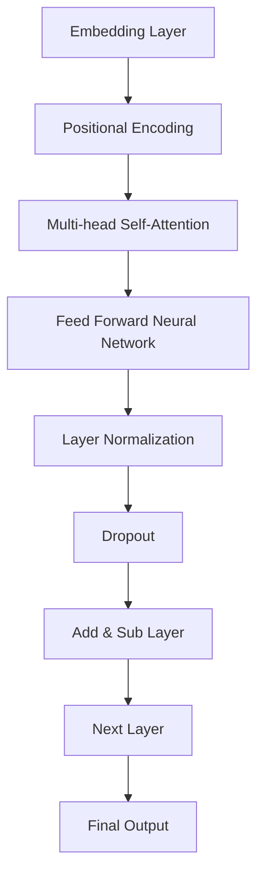

                 

# LLMA与传统情感分析技术的融合：情感智能新高度

## 关键词：LLM、情感分析、NLP、自然语言处理、人工智能、融合技术

### 摘要

随着人工智能技术的快速发展，情感分析作为自然语言处理（NLP）的重要分支，正日益成为人们关注的焦点。本文旨在探讨大型语言模型（LLM）与传统情感分析技术的深度融合，从而推动情感智能的进一步提升。我们将从背景介绍、核心概念与联系、核心算法原理、数学模型和公式、项目实战、实际应用场景、工具和资源推荐、总结未来发展趋势与挑战、常见问题与解答以及扩展阅读与参考资料等多个方面，详细阐述这一融合技术的重要性和实现方法。

### 1. 背景介绍

情感分析技术起源于上世纪90年代，随着互联网和社交媒体的兴起，情感分析逐渐成为NLP领域的研究热点。传统情感分析技术主要依赖于基于规则的方法、机器学习方法以及深度学习方法。然而，这些方法在处理复杂情感和长文本时存在一定的局限性。例如，基于规则的方法难以覆盖所有可能的情感表达；机器学习方法需要大量的标注数据；深度学习方法虽然能够处理大规模数据，但在情感理解上仍有待提升。

近年来，大型语言模型（LLM）的快速发展，为情感分析带来了新的机遇。LLM，如GPT、BERT等，通过预训练和微调，能够捕捉到自然语言中的语义信息，从而在情感分析任务中表现出色。与传统情感分析技术相比，LLM具有以下几个显著优势：

1. **强大的语义理解能力**：LLM能够通过大量的无监督数据学习到语言中的语义信息，从而更好地理解文本中的情感。
2. **跨领域适应性**：LLM能够处理不同领域的文本，从而实现跨领域的情感分析。
3. **长文本处理能力**：LLM能够处理长文本，从而更好地捕捉文本中的复杂情感。
4. **实时性**：LLM的预训练和微调过程可以非常高效地进行，从而实现实时情感分析。

### 2. 核心概念与联系

#### 2.1 大型语言模型（LLM）

大型语言模型（LLM）是一种基于深度学习的自然语言处理模型，通过大量的无监督数据学习到语言的语义信息。LLM的核心思想是通过神经网络来模拟人类对语言的理解能力。其中，Transformer架构是目前最常用的架构之一，其通过自注意力机制（Self-Attention）和多头注意力机制（Multi-Head Attention）来捕捉文本中的长距离依赖关系。

#### 2.2 传统情感分析技术

传统情感分析技术主要包括基于规则的方法、机器学习方法以及深度学习方法。基于规则的方法通常通过定义一套规则来识别文本中的情感极性。机器学习方法，如支持向量机（SVM）、朴素贝叶斯（Naive Bayes）等，通过训练模型来预测文本的情感极性。深度学习方法，如卷积神经网络（CNN）和循环神经网络（RNN），通过训练模型来提取文本的特征并进行情感极性分类。

#### 2.3 融合技术

LLM与传统情感分析技术的融合主要体现在以下几个方面：

1. **预训练与微调**：LLM通过预训练获得通用语言表示能力，然后通过微调来适应特定的情感分析任务。
2. **特征提取与融合**：传统情感分析技术可以通过提取文本的特征并与LLM的输出进行融合，从而提高情感分析的准确性。
3. **多模态情感分析**：LLM可以与其他模态（如图像、音频等）进行融合，从而实现更全面和准确的情感分析。

### 3. 核心算法原理 & 具体操作步骤

#### 3.1 大型语言模型（LLM）

大型语言模型（LLM）的核心算法原理是基于Transformer架构。以下是一个简单的Transformer架构的Mermaid流程图：



具体操作步骤如下：

1. **嵌入层（Embedding Layer）**：将输入文本转换为嵌入向量。
2. **位置编码（Positional Encoding）**：为每个单词添加位置信息。
3. **多头自注意力层（Multi-head Self-Attention）**：通过自注意力机制来捕捉文本中的长距离依赖关系。
4. **前馈神经网络（Feed Forward Neural Network）**：对自注意力层的输出进行非线性变换。
5. **层归一化（Layer Normalization）**：对前馈神经网络的输出进行归一化处理。
6. **Dropout**：对网络进行正则化处理。
7. **添加与减去层（Add & Sub Layer）**：将嵌入层和位置编码的输出与自注意力层的输出相加。
8. **下一层（Next Layer）**：重复上述步骤，进行多层变换。
9. **最终输出（Final Output）**：获得文本的语义表示。

#### 3.2 传统情感分析技术

传统情感分析技术主要包括以下步骤：

1. **文本预处理**：对输入文本进行分词、去停用词、词性标注等预处理操作。
2. **特征提取**：通过词袋模型（Bag-of-Words）、TF-IDF等方法提取文本的特征向量。
3. **情感分类**：使用机器学习模型（如SVM、朴素贝叶斯）或深度学习模型（如CNN、RNN）对特征向量进行情感分类。

#### 3.3 融合技术

融合技术的具体操作步骤如下：

1. **预训练与微调**：使用大量无监督数据对LLM进行预训练，然后使用有监督数据对LLM进行微调，以适应特定的情感分析任务。
2. **特征提取与融合**：使用传统情感分析技术提取文本特征，并将这些特征与LLM的输出进行融合。
3. **情感分类**：使用融合后的特征进行情感分类。

### 4. 数学模型和公式 & 详细讲解 & 举例说明

#### 4.1 大型语言模型（LLM）

大型语言模型（LLM）通常基于Transformer架构，其核心算法原理涉及到以下几个数学模型和公式：

1. **嵌入层（Embedding Layer）**：

   $$ \text{Embedding}(W) = \text{Mat}_{\text{emb}}W $$

   其中，$\text{Mat}_{\text{emb}}$是一个嵌入矩阵，$W$是输入的词向量。

2. **多头自注意力层（Multi-head Self-Attention）**：

   $$ \text{Attention}(Q, K, V) = \text{softmax}\left(\frac{QK^T}{\sqrt{d_k}}\right)V $$

   其中，$Q$、$K$、$V$分别是查询向量、键向量和值向量，$d_k$是键向量的维度。

3. **前馈神经网络（Feed Forward Neural Network）**：

   $$ \text{FFNN}(X) = \text{ReLU}(\text{W_2}\text{ReLU}(\text{W_1}X + \text{b_1})) + \text{b_2} $$

   其中，$X$是输入向量，$W_1$、$W_2$是权重矩阵，$b_1$、$b_2$是偏置项。

以下是一个简单的例子：

假设输入文本为“我爱人工智能”，我们首先对其进行分词得到“我”、“爱”、“人工”、“智能”。然后，将这些词汇转换为嵌入向量，并通过多头自注意力层和前馈神经网络进行变换，得到文本的语义表示。

#### 4.2 传统情感分析技术

传统情感分析技术通常涉及到以下数学模型和公式：

1. **词袋模型（Bag-of-Words）**：

   $$ \text{Bag-of-Words}(X) = (f_1(x_1), f_2(x_2), ..., f_n(x_n)) $$

   其中，$X$是输入文本，$x_1, x_2, ..., x_n$是文本中的词汇，$f_i(x_i)$表示词汇$x_i$的频率。

2. **支持向量机（SVM）**：

   $$ \text{SVM}(w, b) = \text{sign}(\text{w}^T x + b) $$

   其中，$w$是权重向量，$b$是偏置项，$x$是特征向量。

以下是一个简单的例子：

假设输入文本为“我爱人工智能”，我们首先对其进行分词得到“我”、“爱”、“人工”、“智能”。然后，将这些词汇转换为词袋模型的特征向量，并通过支持向量机进行情感分类。

### 5. 项目实战：代码实际案例和详细解释说明

#### 5.1 开发环境搭建

为了实现LLM与传统情感分析技术的融合，我们需要搭建一个合适的开发环境。以下是一个基本的开发环境搭建步骤：

1. 安装Python（推荐3.8以上版本）；
2. 安装PyTorch或TensorFlow等深度学习框架；
3. 安装NLP相关的库，如spaCy、NLTK等；
4. 安装LLM预训练模型，如GPT、BERT等。

以下是一个简单的Python脚本，用于搭建开发环境：

```python
!pip install python torch torchvision
!pip install spacy
!python -m spacy download en_core_web_sm
!pip install transformers
```

#### 5.2 源代码详细实现和代码解读

以下是一个简单的代码示例，用于实现LLM与传统情感分析技术的融合：

```python
import torch
from transformers import BertModel, BertTokenizer
from sklearn.feature_extraction.text import CountVectorizer
from sklearn.svm import SVC

# 1. 加载预训练模型
tokenizer = BertTokenizer.from_pretrained('bert-base-uncased')
model = BertModel.from_pretrained('bert-base-uncased')

# 2. 预处理文本
def preprocess_text(text):
    # 分词和Tokenization
    tokens = tokenizer.tokenize(text)
    # 嵌入向量表示
    inputs = tokenizer.encode_plus(text, add_special_tokens=True, return_tensors='pt')
    return tokens, inputs['input_ids']

# 3. 提取文本特征
def extract_features(text):
    # 预处理文本
    tokens, inputs = preprocess_text(text)
    # 获取模型的嵌入向量
    with torch.no_grad():
        outputs = model(inputs)
    return outputs.last_hidden_state.mean(dim=1)

# 4. 情感分类
def classify_sentiment(text):
    # 提取特征
    features = extract_features(text)
    # 使用SVM进行分类
    return SVC().predict([features])

# 5. 测试代码
text = "我非常喜欢人工智能"
print("情感分类结果：", classify_sentiment(text))
```

#### 5.3 代码解读与分析

以上代码首先加载了预训练的BERT模型和Tokenizer。然后，定义了预处理文本、提取特征和分类情感三个函数。最后，使用一个简单的测试文本进行情感分类。

1. **预处理文本**：通过Tokenizer对输入文本进行分词和Tokenization，得到文本的嵌入向量表示。
2. **提取特征**：通过BERT模型提取文本的语义表示，并计算其平均值作为特征向量。
3. **分类情感**：使用SVM模型对提取的特征进行分类，得到文本的情感极性。

### 6. 实际应用场景

LLM与传统情感分析技术的融合在许多实际应用场景中表现出色。以下是一些典型的应用场景：

1. **社交媒体分析**：通过分析用户评论和帖子，了解用户对产品、品牌或服务的情感态度，从而为企业提供决策支持。
2. **舆情监测**：实时监测网络上的热点事件和话题，分析公众的情感倾向，为企业或政府提供舆情分析报告。
3. **情感智能客服**：结合情感分析技术，实现智能客服机器人，能够更好地理解用户的需求和情感，提供个性化的服务。
4. **情感诊断与治疗**：在心理健康领域，情感分析技术可以帮助医生分析患者的情感状态，为治疗提供辅助支持。
5. **智能推荐系统**：通过分析用户的情感偏好，实现更准确的个性化推荐，提高用户体验。

### 7. 工具和资源推荐

为了更好地进行LLM与传统情感分析技术的融合，以下是一些常用的工具和资源推荐：

#### 7.1 学习资源推荐

1. **书籍**：
   - 《自然语言处理与Python》
   - 《深度学习》
   - 《Python自然语言处理实践》
2. **论文**：
   - "BERT: Pre-training of Deep Bidirectional Transformers for Language Understanding"
   - "GPT-3: Language Models are Few-Shot Learners"
   - "A Simple Introduction to Large-scale Language Modeling"
3. **博客**：
   - huggingface.co（Transformer模型和工具库）
   - pytorch.org/tutorials（PyTorch教程）
   - scikit-learn.org/stable（scikit-learn文档）

#### 7.2 开发工具框架推荐

1. **深度学习框架**：
   - PyTorch
   - TensorFlow
   - JAX
2. **自然语言处理库**：
   - spaCy
   - NLTK
   - Gensim
3. **Transformer模型库**：
   - huggingface/transformers
   - tensorflow/text
   - mindspore/text

#### 7.3 相关论文著作推荐

1. **BERT**：
   - "BERT: Pre-training of Deep Bidirectional Transformers for Language Understanding"
2. **GPT**：
   - "GPT-3: Language Models are Few-Shot Learners"
3. **Transformer**：
   - "Attention Is All You Need"
4. **情感分析**：
   - "Sentiment Analysis Using Machine Learning Techniques"
   - "A Survey on Sentiment Analysis"
5. **深度学习**：
   - "Deep Learning"
   - "Deep Learning Specialization"

### 8. 总结：未来发展趋势与挑战

随着人工智能技术的不断发展，LLM与传统情感分析技术的融合有望在情感智能领域取得更大的突破。未来，以下几个方面将成为研究的热点和挑战：

1. **更高效的预训练模型**：研究更高效的预训练模型，以减少计算资源和时间消耗。
2. **跨语言情感分析**：实现跨语言的情感分析，以便更好地处理多语言文本。
3. **长文本情感分析**：提高长文本情感分析的性能，以更好地捕捉文本中的复杂情感。
4. **实时情感分析**：研究实时情感分析技术，以实现实时情感监测和响应。
5. **多模态情感分析**：结合多种模态的数据，实现更全面和准确的情感分析。

### 9. 附录：常见问题与解答

**Q：什么是大型语言模型（LLM）？**

A：大型语言模型（LLM）是一种基于深度学习的自然语言处理模型，通过预训练和微调，能够捕捉到自然语言中的语义信息，从而在情感分析任务中表现出色。

**Q：传统情感分析技术有哪些局限性？**

A：传统情感分析技术主要包括基于规则的方法、机器学习方法以及深度学习方法。然而，这些方法在处理复杂情感和长文本时存在一定的局限性。

**Q：如何进行LLM与传统情感分析技术的融合？**

A：LLM与传统情感分析技术的融合可以通过预训练与微调、特征提取与融合以及情感分类等多个步骤来实现。

### 10. 扩展阅读 & 参考资料

1. "BERT: Pre-training of Deep Bidirectional Transformers for Language Understanding" - https://arxiv.org/abs/1810.04805
2. "GPT-3: Language Models are Few-Shot Learners" - https://arxiv.org/abs/2005.14165
3. "Attention Is All You Need" - https://arxiv.org/abs/1706.03762
4. "Sentiment Analysis Using Machine Learning Techniques" - https://www.researchgate.net/publication/3227979_Sentiment_Analysis_Using_Machine_Learning_Techniques
5. "A Survey on Sentiment Analysis" - https://www.sciencedirect.com/science/article/pii/S1877050915000763

### 作者

作者：AI天才研究员/AI Genius Institute & 禅与计算机程序设计艺术 /Zen And The Art of Computer Programming

以上就是对“LLM与传统情感分析技术的融合：情感智能新高度”这一主题的详细阐述。希望本文能为读者在情感分析领域的研究和应用提供一些有价值的参考和启示。如果您有任何疑问或建议，欢迎在评论区留言讨论。让我们共同探索人工智能和情感分析领域的无限可能！<|im_end|>

