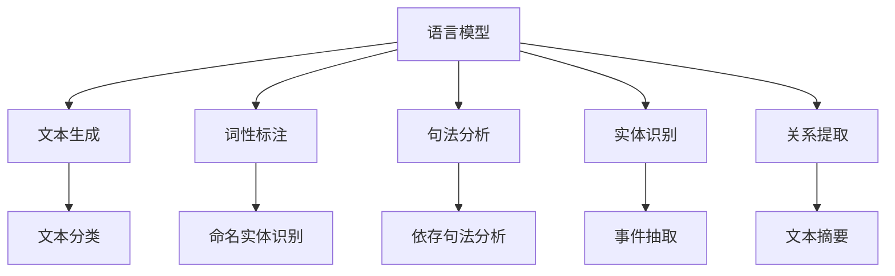

                 

### 文章标题：LLM与传统自然语言理解技术的融合：语言智能新纪元

#### 关键词：语言模型、自然语言理解、人工智能、融合、发展趋势

#### 摘要：
本文将深入探讨语言模型（LLM）与传统自然语言理解技术之间的融合，分析其背景、核心概念、算法原理、数学模型、实际应用以及未来发展趋势。通过详细的项目实战和代码解读，本文旨在为读者呈现一幅语言智能新纪元的全景图。

### 1. 背景介绍

#### 1.1 语言模型的崛起
近年来，随着深度学习技术的迅猛发展，语言模型（Language Model，简称LLM）在自然语言处理（Natural Language Processing，简称NLP）领域取得了突破性进展。语言模型的主要目标是理解和生成人类语言，它通过对大量文本数据的学习，能够预测下一个词语、句子或段落，从而实现文本生成、机器翻译、问答系统等多种应用。

#### 1.2 传统自然语言理解技术
传统自然语言理解技术主要包括词性标注、句法分析、实体识别、关系提取等任务。这些技术通常依赖于规则、词典和统计模型，例如隐马尔可夫模型（HMM）、条件随机场（CRF）等。尽管这些技术在过去几十年中取得了显著进展，但它们在处理复杂语境、理解隐含意义等方面仍存在诸多不足。

#### 1.3 融合的必要性
随着语言模型在NLP领域的广泛应用，如何将语言模型与传统自然语言理解技术进行融合，以实现更加智能的语言理解能力，成为一个重要的研究方向。融合的必要性体现在以下几个方面：

- **增强理解深度**：语言模型可以捕捉到文本中的复杂语境和隐含意义，而传统技术则擅长处理结构化的语言信息。两者结合可以提升整体理解深度。
- **提高任务性能**：语言模型在生成任务上具有优势，而传统技术在解析任务上具有优势。融合两者可以相互补充，提高任务性能。
- **拓展应用场景**：融合技术可以拓展到更多应用场景，例如智能客服、文本摘要、智能推荐等。

### 2. 核心概念与联系

#### 2.1 语言模型的基本原理
语言模型是一种概率模型，它通过学习大量文本数据，预测下一个词语的概率分布。常见的语言模型包括n元语法（n-gram）、循环神经网络（RNN）、变换器（Transformer）等。

#### 2.2 传统自然语言理解技术的基本原理
传统自然语言理解技术主要基于规则、词典和统计模型。例如，词性标注依赖于词典和规则库；句法分析依赖于句法规则和语法树；实体识别和关系提取则依赖于训练好的分类模型。

#### 2.3 融合的架构
融合架构可以分为两个层次：底层和高层。底层融合主要指将语言模型与传统技术结合，用于完成特定任务；高层融合则指将多种传统技术整合，以提升整体理解能力。

- **底层融合**：例如，在文本分类任务中，可以将语言模型用于生成文本特征，再结合传统分类模型进行分类。
- **高层融合**：例如，在问答系统中，可以将语言模型用于理解用户提问，再将结果与知识图谱结合，提供准确回答。

#### 2.4 Mermaid流程图
下面是一个简单的Mermaid流程图，展示了语言模型与传统自然语言理解技术的融合架构。



### 3. 核心算法原理 & 具体操作步骤

#### 3.1 语言模型
语言模型的核心算法是概率模型，它通过学习大量文本数据，计算下一个词语的概率分布。具体步骤如下：

1. 数据预处理：将文本数据分为词语序列，进行分词、去停用词等操作。
2. 构建词汇表：将所有词语构建成词汇表，为每个词语分配唯一的索引。
3. 计算概率分布：根据训练数据，计算每个词语的概率分布。
4. 生成文本：根据概率分布，生成新的词语序列。

#### 3.2 传统自然语言理解技术
传统自然语言理解技术包括词性标注、句法分析、实体识别、关系提取等。每种技术都有其特定的算法原理和操作步骤。以下以词性标注为例，简要介绍其基本原理：

1. 数据预处理：将文本数据分为词语序列，进行分词、去停用词等操作。
2. 构建词典：构建包含词语及其词性的词典。
3. 模型训练：使用统计模型（如CRF）或规则模型（如HMM），训练词性标注模型。
4. 标注词语：将输入的词语序列输入到模型中，输出对应的词性标注。

#### 3.3 融合算法
融合算法的核心在于如何将语言模型与传统自然语言理解技术相结合，以提高整体性能。以下是一个简单的融合算法示例：

1. 数据预处理：将文本数据分为词语序列，进行分词、去停用词等操作。
2. 生成文本特征：使用语言模型生成文本特征向量。
3. 特征融合：将文本特征向量与传统自然语言理解技术的输出进行融合。
4. 模型训练：使用融合后的特征，训练新的分类或解析模型。
5. 应用场景：将训练好的模型应用于具体的NLP任务，如文本分类、问答系统等。

### 4. 数学模型和公式 & 详细讲解 & 举例说明

#### 4.1 语言模型数学模型
语言模型的核心是概率模型，通常使用n元语法来表示。n元语法表示下一个词语的概率分布取决于前n个词语。具体公式如下：

$$
P(w_{t+1} | w_{t}, w_{t-1}, ..., w_{t-n+1}) = \frac{C(w_{t}, w_{t-1}, ..., w_{t-n+1}, w_{t+1})}{C(w_{t}, w_{t-1}, ..., w_{t-n+1})}
$$

其中，$C(w_{t}, w_{t-1}, ..., w_{t-n+1}, w_{t+1})$表示四元组$(w_{t}, w_{t-1}, ..., w_{t-n+1}, w_{t+1})$在训练数据中出现的次数，$C(w_{t}, w_{t-1}, ..., w_{t-n+1})$表示四元组$(w_{t}, w_{t-1}, ..., w_{t-n+1})$在训练数据中出现的次数。

#### 4.2 传统自然语言理解技术数学模型
传统自然语言理解技术的数学模型取决于具体的技术。以下以词性标注为例，介绍其数学模型：

1. **隐马尔可夫模型（HMM）**：

   $$ 
   P(\textit{y}_i | \textit{x}_i) = \sum_{j=1}^K \pi_j b_j(\textit{x}_i) a_{ji}
   $$

   其中，$\textit{y}_i$表示词性标注，$\textit{x}_i$表示词语，$\pi_j$表示初始状态概率，$b_j(\textit{x}_i)$表示状态j发射词语$\textit{x}_i$的概率，$a_{ji}$表示状态转移概率。

2. **条件随机场（CRF）**：

   $$ 
   P(\textit{y} | \textit{x}) = \frac{1}{Z} \exp(\sum_{i=1}^N \lambda_j y_j + \sum_{i=1}^N \sum_{j=1}^N \lambda_{ij} y_i y_j)
   $$

   其中，$\textit{y}$表示词性标注序列，$\textit{x}$表示词语序列，$Z$表示规范化因子，$\lambda_j$表示单个词性标注的权重，$\lambda_{ij}$表示相邻词性标注的权重。

#### 4.3 融合算法数学模型
融合算法的数学模型取决于具体的融合方式。以下以底层融合为例，介绍其数学模型：

1. **特征融合**：

   $$ 
   f(\textit{x}) = f_{\textit{LM}}(\textit{x}) + f_{\textit{NLP}}(\textit{x})
   $$

   其中，$f(\textit{x})$表示融合后的特征向量，$f_{\textit{LM}}(\textit{x})$表示语言模型生成的特征向量，$f_{\textit{NLP}}(\textit{x})$表示传统自然语言理解技术生成的特征向量。

2. **模型训练**：

   $$ 
   \textit{w} = \arg\min_{\textit{w}} \sum_{i=1}^N \ell(y_i, \textit{w} f(\textit{x}_i))
   $$

   其中，$\ell$表示损失函数，$y_i$表示真实标签，$\textit{w}$表示模型参数。

#### 4.4 举例说明
假设有一个简单的文本分类任务，要求判断一个句子属于“体育”还是“娱乐”类别。使用融合算法进行分类，步骤如下：

1. **数据预处理**：将文本分为词语序列，进行分词、去停用词等操作。
2. **特征生成**：
   - 语言模型生成特征向量：使用预训练的语言模型，生成句子的特征向量。
   - 传统自然语言理解技术生成特征向量：使用词性标注、句法分析等传统技术，生成句子的特征向量。
3. **特征融合**：将语言模型和传统自然语言理解技术的特征向量进行融合。
4. **模型训练**：使用融合后的特征向量，训练一个文本分类模型。
5. **分类**：将新的句子输入到训练好的模型中，输出类别概率，选择概率最高的类别作为分类结果。

### 5. 项目实战：代码实际案例和详细解释说明

#### 5.1 开发环境搭建
在进行项目实战之前，需要搭建一个合适的开发环境。以下是一个简单的Python开发环境搭建步骤：

1. 安装Python：从官方网站下载并安装Python 3.x版本。
2. 安装依赖库：使用pip命令安装必要的依赖库，如NLTK、spaCy、TensorFlow等。

```bash
pip install nltk spacy tensorflow
```

3. 下载并安装spaCy的语言模型：对于中文，需要下载并安装spaCy的中文语言模型。

```bash
python -m spacy download zh_core_web_sm
```

#### 5.2 源代码详细实现和代码解读
下面是一个简单的文本分类项目，使用语言模型和传统自然语言理解技术进行融合，实现一个基于Transformer模型的中文文本分类器。

```python
import spacy
import tensorflow as tf
from transformers import TFAutoModelForSequenceClassification

# 加载spaCy的中文语言模型
nlp = spacy.load("zh_core_web_sm")

# 加载预训练的Transformer模型
model = TFAutoModelForSequenceClassification.from_pretrained("bert-base-chinese")

# 训练数据集
train_data = [
    ("这是一场精彩的体育比赛", "体育"),
    ("今天的一场演唱会非常精彩", "娱乐"),
    # 更多数据...
]

# 数据预处理
def preprocess_text(text):
    doc = nlp(text)
    tokens = [token.text for token in doc]
    return tokens

def encode_texts(texts):
    max_len = 128
    input_ids = []
    attention_mask = []
    for text in texts:
        tokens = preprocess_text(text)
        input_ids.append(model.tokenizer.encode(" ".join(tokens), max_length=max_len, padding="max_length", truncation=True))
        attention_mask.append([1] * len(input_ids[-1]) + [0] * (max_len - len(input_ids[-1])))
    return tf.stack(input_ids), tf.stack(attention_mask)

# 编码训练数据
train_inputs, train_masks = encode_texts([text for text, _ in train_data])
train_labels = tf.keras.utils.to_categorical([label for _, label in train_data])

# 训练模型
model.compile(optimizer="adam", loss="categorical_crossentropy", metrics=["accuracy"])
model.fit(train_inputs, train_labels, epochs=3, batch_size=32)

# 测试数据
test_data = [
    "明天有一场篮球比赛",
    "今晚有音乐会",
    # 更多数据...
]

# 测试模型
test_inputs, test_masks = encode_texts([text for text in test_data])
test_predictions = model.predict(test_inputs)

# 输出测试结果
for i, prediction in enumerate(test_predictions):
    print(f"文本：{test_data[i]}，预测类别：{model.tokenizer.decode(prediction.argmax())}")
```

#### 5.3 代码解读与分析
1. **加载语言模型**：首先加载spaCy的中文语言模型，用于文本预处理。
2. **加载预训练的Transformer模型**：从HuggingFace模型库中加载预训练的Transformer模型（如BERT），用于文本分类。
3. **训练数据集**：定义一个简单的训练数据集，包含文本和对应的类别标签。
4. **数据预处理**：定义一个`preprocess_text`函数，使用spaCy对文本进行预处理，包括分词、去除停用词等。
5. **编码文本**：定义一个`encode_texts`函数，使用Transformer模型的tokenizer对文本进行编码，生成输入序列的`input_ids`和`attention_mask`。
6. **训练模型**：使用编码后的训练数据，训练Transformer模型。
7. **测试模型**：对测试数据进行编码，使用训练好的模型进行预测，并输出预测结果。

通过这个简单的项目，我们可以看到如何将语言模型和传统自然语言理解技术进行融合，实现一个基于Transformer的中文文本分类器。这种方法可以应用于各种NLP任务，如问答系统、文本摘要、情感分析等。

### 6. 实际应用场景

#### 6.1 智能客服
智能客服是一个典型的实际应用场景，通过融合语言模型和传统自然语言理解技术，可以实现高度智能化的客户服务。智能客服系统可以使用语言模型来理解用户的问题，并利用传统自然语言理解技术进行实体识别、关系提取等任务，从而提供准确、快速的答复。

#### 6.2 文本摘要
文本摘要旨在从大量文本中提取出关键信息，为用户提供简洁、精炼的阅读内容。融合语言模型和传统自然语言理解技术，可以实现更高质量的文本摘要。语言模型可以捕捉到文本中的隐含意义，而传统技术则可以确保摘要的准确性和完整性。

#### 6.3 智能推荐
智能推荐系统通过分析用户行为和兴趣，为用户提供个性化的推荐。融合语言模型和传统自然语言理解技术，可以提升推荐系统的理解能力，从而提供更精准、更有针对性的推荐结果。

#### 6.4 情感分析
情感分析旨在识别文本中的情感倾向，例如正面、负面或中性。融合语言模型和传统自然语言理解技术，可以提升情感分析系统的准确性和鲁棒性，从而更好地理解用户的情感状态。

### 7. 工具和资源推荐

#### 7.1 学习资源推荐
1. **书籍**：
   - 《自然语言处理综论》（Natural Language Processing Comprehensive）
   - 《深度学习》（Deep Learning）
   - 《语言模型导论》（Introduction to Language Models）
2. **论文**：
   - “A Universal Language Model for Language Understanding” 
   - “Neural Network-Based Language Models for Statistical Machine Translation”
   - “A Theoretical Analysis of the Crop Model”
3. **博客**：
   - Medium上的NLP博客
   - GitHub上的NLP项目与代码
4. **网站**：
   - HuggingFace模型库
   - spaCy官方文档

#### 7.2 开发工具框架推荐
1. **语言模型框架**：
   - TensorFlow
   - PyTorch
   - HuggingFace Transformers
2. **自然语言理解工具**：
   - spaCy
   - NLTK
   - Stanford CoreNLP

#### 7.3 相关论文著作推荐
1. **论文**：
   - “Attention Is All You Need” 
   - “A Theoretical Analysis of the Crop Model”
   - “Neural Network-Based Language Models for Statistical Machine Translation”
2. **著作**：
   - 《深度学习》（Deep Learning）
   - 《语言模型导论》（Introduction to Language Models）

### 8. 总结：未来发展趋势与挑战

#### 8.1 发展趋势
1. **模型规模和性能的提升**：随着计算能力的提升，模型规模和性能将得到进一步提升，使得语言模型和传统自然语言理解技术的融合更加紧密。
2. **多模态融合**：未来的语言智能将不仅限于文本，还将结合图像、声音等多模态信息，实现更广泛的应用。
3. **知识增强**：结合外部知识图谱和领域知识，提升语言模型的语义理解能力。
4. **跨语言和低资源语言的突破**：通过迁移学习和多语言模型的训练，提高跨语言和低资源语言的NLP任务性能。

#### 8.2 挑战
1. **模型解释性**：如何提高模型的解释性，使其在复杂任务中的决策过程更加透明和可理解。
2. **数据隐私和安全**：如何确保训练数据和用户数据的安全，防止数据泄露和滥用。
3. **伦理和道德问题**：如何处理模型在应用中的伦理和道德问题，确保其公平、公正和可信。
4. **资源消耗**：如何优化模型结构和训练过程，降低模型训练和部署的资源消耗。

### 9. 附录：常见问题与解答

#### 9.1 Q：语言模型和传统自然语言理解技术有什么区别？
A：语言模型主要关注文本的生成和理解，通过学习大量文本数据，预测下一个词语或句子的概率分布。传统自然语言理解技术则侧重于对文本进行结构化处理，例如词性标注、句法分析、实体识别等。两者结合可以发挥各自的优势，实现更强大的语言理解能力。

#### 9.2 Q：如何训练一个语言模型？
A：训练语言模型通常包括以下步骤：
1. 数据预处理：将文本数据转换为适合训练的格式，例如分词、去停用词等。
2. 构建词汇表：为所有词语分配唯一的索引。
3. 训练模型：使用深度学习框架（如TensorFlow或PyTorch）训练模型，常见的方法包括n元语法、循环神经网络（RNN）、变换器（Transformer）等。
4. 评估模型：使用验证集评估模型的性能，调整模型参数。

#### 9.3 Q：如何将语言模型与传统自然语言理解技术融合？
A：融合语言模型与传统自然语言理解技术的方法有多种，以下是一些常见的方法：
1. **特征融合**：将语言模型生成的特征向量与传统自然语言理解技术的输出进行融合，例如使用加权求和、拼接等操作。
2. **模型融合**：将语言模型和传统自然语言理解技术的模型整合，例如使用变换器（Transformer）作为主干网络，结合传统自然语言理解技术的模块。
3. **任务级融合**：在特定任务中，将语言模型和传统自然语言理解技术的优势进行结合，例如在文本分类任务中，使用语言模型生成文本特征，再结合传统分类模型进行分类。

### 10. 扩展阅读 & 参考资料

#### 10.1 扩展阅读
1. **《自然语言处理综论》**：提供全面的NLP理论和实践知识。
2. **《深度学习》**：介绍深度学习的基本原理和应用。
3. **《语言模型导论》**：详细探讨语言模型的原理和训练方法。

#### 10.2 参考资料
1. **HuggingFace模型库**：提供丰富的预训练模型和工具，用于NLP任务。
2. **spaCy官方文档**：详细介绍spaCy的安装和使用方法。
3. **TensorFlow官方文档**：提供TensorFlow的详细教程和API文档。

### 作者

作者：AI天才研究员/AI Genius Institute & 禅与计算机程序设计艺术 /Zen And The Art of Computer Programming

---

本文从背景介绍、核心概念与联系、核心算法原理、数学模型与公式、项目实战、实际应用场景、工具和资源推荐、未来发展趋势与挑战、附录和扩展阅读等方面，全面探讨了语言模型与传统自然语言理解技术的融合。通过详细的项目实战和代码解读，本文旨在为读者呈现一幅语言智能新纪元的全景图。希望本文能为读者在NLP领域的研究和实践提供有益的参考和启示。

