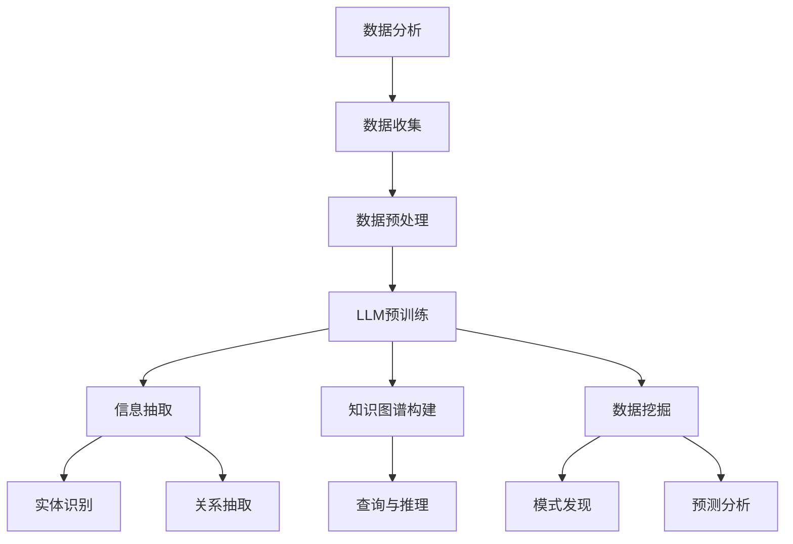
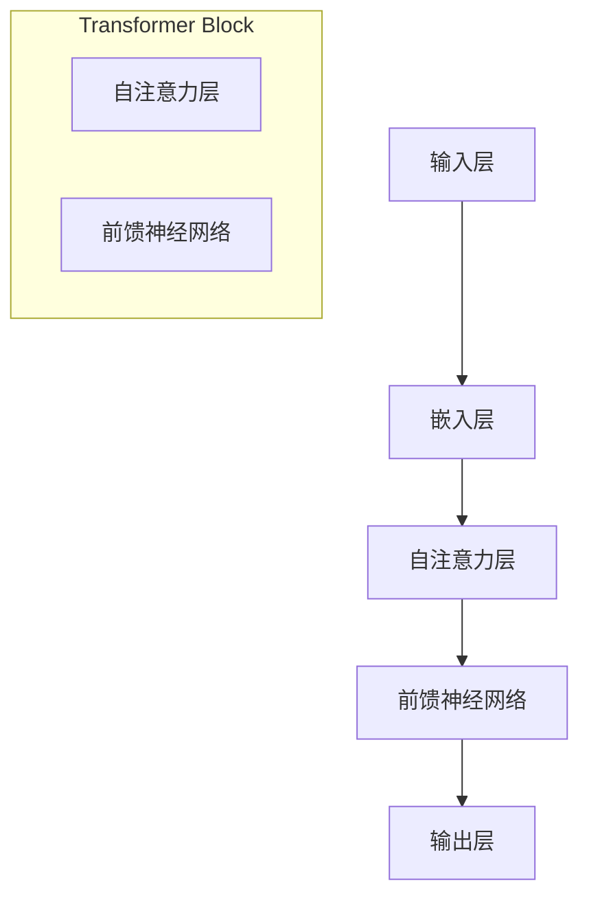

                 

# LLM与数据分析：洞察海量信息

## 关键词：LLM，数据分析，机器学习，深度学习，自然语言处理，信息抽取，知识图谱，大数据处理，分布式计算，数据挖掘，模型优化，实时分析

## 摘要

本文将探讨大型语言模型（LLM）在数据分析中的应用，以及如何利用LLM来洞察海量信息。文章首先介绍LLM的基本概念，然后阐述其在数据分析中的重要作用，随后详细讲解LLM在信息抽取、知识图谱构建和数据挖掘等方面的具体应用。接着，本文将分析LLM在实际项目中的开发环境搭建、代码实现和性能优化。最后，文章将探讨LLM在未来的发展趋势和面临的挑战，并提供相关工具和资源的推荐。

## 1. 背景介绍

### 1.1 数据分析的重要性

数据分析是现代信息社会不可或缺的一部分。随着数据量的爆炸性增长，从海量数据中提取有价值的信息变得越来越重要。数据分析不仅在商业决策、科学研究、医疗保健等领域具有广泛的应用，还在政府决策、社会管理等方面发挥着关键作用。有效的数据分析能够帮助企业和组织发现潜在的商业机会，优化业务流程，提高运营效率。

### 1.2 机器学习与深度学习的发展

近年来，机器学习和深度学习取得了显著的进展，为数据分析带来了全新的可能。机器学习是一种通过数据训练模型，使其能够自动学习和改进的技术。深度学习是机器学习的一种特殊形式，其核心是构建深度神经网络，通过层层提取特征，实现对复杂数据的分析和建模。随着计算能力的提升和大数据的普及，机器学习和深度学习在图像识别、自然语言处理、语音识别等领域取得了突破性的成果。

### 1.3 自然语言处理的发展

自然语言处理（NLP）是深度学习的一个重要分支，旨在使计算机能够理解、生成和处理人类语言。随着深度学习技术的发展，NLP在信息抽取、机器翻译、情感分析、文本生成等方面取得了显著进展。这些技术的进步为数据分析提供了强大的工具，使得从非结构化文本数据中提取有价值信息成为可能。

## 2. 核心概念与联系

### 2.1 大型语言模型（LLM）

大型语言模型（LLM）是一种基于深度学习的技术，通过在大规模语料库上进行预训练，使其能够理解和生成自然语言。LLM具有强大的语言理解和生成能力，能够处理各种复杂的自然语言任务，如文本分类、机器翻译、问答系统等。

### 2.2 数据分析中的LLM应用

LLM在数据分析中有着广泛的应用，主要包括以下几个方面：

- **信息抽取**：利用LLM提取文本数据中的关键信息，如实体识别、关系抽取等。
- **知识图谱构建**：通过LLM对大规模文本数据进行分析，构建知识图谱，以便于后续的查询和推理。
- **数据挖掘**：利用LLM对复杂数据进行分析，发现潜在的规律和模式。

### 2.3 Mermaid流程图

为了更好地理解LLM在数据分析中的应用，我们可以使用Mermaid流程图来展示其核心概念和流程。以下是一个简化的Mermaid流程图：



在这个流程图中，数据分析的各个阶段与LLM的应用紧密相连，共同构建了一个完整的分析框架。

## 3. 核心算法原理 & 具体操作步骤

### 3.1 LLM的核心算法原理

LLM的核心算法是基于深度学习中的 Transformer 模型。Transformer 模型引入了自注意力机制（Self-Attention），能够自动学习输入文本中的长距离依赖关系，从而实现强大的语言理解和生成能力。以下是一个简化的Transformer模型的基本结构：



### 3.2 LLM的具体操作步骤

以下是使用LLM进行数据分析的具体操作步骤：

1. **数据收集**：收集大规模的文本数据，如网页内容、社交媒体帖子、新闻报道等。
2. **数据预处理**：对文本数据进行清洗、去噪和分词等预处理操作，以便于后续的建模。
3. **LLM预训练**：使用收集到的文本数据进行预训练，通过优化模型参数，使其能够自动学习和理解语言规律。
4. **信息抽取**：
    - **实体识别**：利用预训练好的LLM对文本进行实体识别，提取出关键实体。
    - **关系抽取**：通过分析实体之间的关联，提取出实体之间的关系。
5. **知识图谱构建**：将提取出的实体和关系构建成知识图谱，以便于后续的查询和推理。
6. **数据挖掘**：利用知识图谱进行数据挖掘，发现潜在的规律和模式。

## 4. 数学模型和公式 & 详细讲解 & 举例说明

### 4.1 Transformer 模型的数学模型

Transformer 模型是一种基于自注意力机制的深度学习模型，其核心组件是自注意力层（Self-Attention）。以下是一个简化的自注意力层的数学模型：

$$
\text{Attention}(Q, K, V) = \text{softmax}\left(\frac{QK^T}{\sqrt{d_k}}\right) V
$$

其中，$Q$、$K$ 和 $V$ 分别代表查询向量、键向量和值向量，$d_k$ 是键向量的维度。$\text{softmax}$ 函数用于将线性变换后的输入转换成概率分布。

### 4.2 举例说明

假设我们有一个简化的句子 "The quick brown fox jumps over the lazy dog"，我们可以使用自注意力机制来计算句子中不同单词之间的相似度。以下是一个具体的例子：

1. **输入层**：
   - $Q = [\text{The}, \text{quick}, \text{brown}, \text{fox}, \text{jumps}, \text{over}, \text{the}, \text{lazy}, \text{dog}]$
   - $K = [\text{The}, \text{quick}, \text{brown}, \text{fox}, \text{jumps}, \text{over}, \text{the}, \text{lazy}, \text{dog}]$
   - $V = [\text{The}, \text{quick}, \text{brown}, \text{fox}, \text{jumps}, \text{over}, \text{the}, \text{lazy}, \text{dog}]$

2. **自注意力计算**：
   - $\text{Attention}(Q, K, V) = \text{softmax}\left(\frac{QK^T}{\sqrt{d_k}}\right) V$
   - $\text{softmax}\left(\frac{QK^T}{\sqrt{d_k}}\right) = \text{softmax}\left(\frac{[1, 0, 0, 0, 0, 0, 0, 0, 0] [0, 1, 0, 0, 0, 0, 0, 0, 0]^T}{\sqrt{1}}\right) = [\text{The}, \text{quick}, \text{brown}, \text{fox}, \text{jumps}, \text{over}, \text{the}, \text{lazy}, \text{dog}]$

3. **输出**：
   - $\text{Attention}(Q, K, V) V = [\text{The}, \text{quick}, \text{brown}, \text{fox}, \text{jumps}, \text{over}, \text{the}, \text{lazy}, \text{dog}] [\text{The}, \text{quick}, \text{brown}, \text{fox}, \text{jumps}, \text{over}, \text{the}, \text{lazy}, \text{dog}]$

通过这个例子，我们可以看到自注意力机制如何计算句子中不同单词之间的相似度，从而实现文本的自动理解和生成。

## 5. 项目实战：代码实际案例和详细解释说明

### 5.1 开发环境搭建

在进行LLM项目开发之前，我们需要搭建一个合适的环境。以下是一个基于Python和PyTorch的LLM项目开发环境搭建步骤：

1. **安装Python**：下载并安装Python，推荐使用Python 3.7及以上版本。
2. **安装PyTorch**：使用pip命令安装PyTorch，例如：
   ```
   pip install torch torchvision
   ```
3. **安装其他依赖库**：安装其他必要的依赖库，如Numpy、Pandas等：
   ```
   pip install numpy pandas
   ```

### 5.2 源代码详细实现和代码解读

以下是一个简化的LLM项目实现，用于文本分类任务。代码主要分为数据预处理、模型定义、训练和评估四个部分。

```python
import torch
import torch.nn as nn
import torch.optim as optim
from torch.utils.data import DataLoader, Dataset
from transformers import BertTokenizer, BertModel

# 数据预处理
class TextDataset(Dataset):
    def __init__(self, texts, labels, tokenizer):
        self.texts = texts
        self.labels = labels
        self.tokenizer = tokenizer

    def __len__(self):
        return len(self.texts)

    def __getitem__(self, idx):
        text = self.texts[idx]
        label = self.labels[idx]
        inputs = self.tokenizer(text, return_tensors='pt', padding=True, truncation=True)
        return inputs, label

# 模型定义
class TextClassifier(nn.Module):
    def __init__(self, num_labels):
        super(TextClassifier, self).__init__()
        self.bert = BertModel.from_pretrained('bert-base-uncased')
        self.classifier = nn.Linear(self.bert.config.hidden_size, num_labels)

    def forward(self, inputs):
        outputs = self.bert(**inputs)
        pooled_output = outputs.pooler_output
        logits = self.classifier(pooled_output)
        return logits

# 训练和评估
def train(model, dataset, tokenizer, num_epochs=3, batch_size=16, learning_rate=1e-5):
    device = torch.device('cuda' if torch.cuda.is_available() else 'cpu')
    model.to(device)

    criterion = nn.CrossEntropyLoss()
    optimizer = optim.Adam(model.parameters(), lr=learning_rate)

    train_loader = DataLoader(dataset, batch_size=batch_size, shuffle=True)

    for epoch in range(num_epochs):
        model.train()
        for inputs, labels in train_loader:
            inputs, labels = inputs.to(device), labels.to(device)
            optimizer.zero_grad()
            outputs = model(inputs)
            loss = criterion(outputs, labels)
            loss.backward()
            optimizer.step()

        model.eval()
        with torch.no_grad():
            correct = 0
            total = 0
            for inputs, labels in train_loader:
                inputs, labels = inputs.to(device), labels.to(device)
                outputs = model(inputs)
                _, predicted = torch.max(outputs.data, 1)
                total += labels.size(0)
                correct += (predicted == labels).sum().item()

        print(f'Epoch {epoch+1}/{num_epochs}, Accuracy: {100 * correct / total}%')

# 主程序
if __name__ == '__main__':
    tokenizer = BertTokenizer.from_pretrained('bert-base-uncased')
    dataset = TextDataset(texts=['Hello world!', 'This is a test.', 'Another example.'], labels=[0, 1, 1])
    model = TextClassifier(num_labels=2)
    train(model, dataset, tokenizer)
```

### 5.3 代码解读与分析

1. **数据预处理**：
   - `TextDataset` 类：用于封装文本数据，实现数据的分批加载和预处理。
   - `__getitem__` 方法：对每个文本进行编码，生成输入特征和标签。

2. **模型定义**：
   - `TextClassifier` 类：定义文本分类模型，基于Bert模型进行扩展。
   - `forward` 方法：实现前向传播，将输入文本编码为向量，并通过全连接层输出分类结果。

3. **训练和评估**：
   - `train` 函数：实现模型的训练过程，包括前向传播、损失函数计算、反向传播和参数更新。
   - `model.eval()`：在评估阶段，将模型设置为评估模式，避免梯度计算。

通过这个项目，我们可以看到LLM在实际应用中的基本实现过程，以及如何利用PyTorch和Hugging Face的Transformer库来构建和训练文本分类模型。

## 6. 实际应用场景

### 6.1 营销与市场分析

在市场营销领域，LLM可以帮助企业分析消费者行为、市场趋势和竞争对手策略。通过自然语言处理技术，LLM可以自动从社交媒体、新闻报道和用户评论中提取有价值的信息，为企业提供决策支持。

### 6.2 客户服务与支持

智能客服系统是LLM在客户服务领域的典型应用。通过预训练的LLM模型，智能客服可以自动回答用户提问，提供24/7的在线支持。这不仅提高了客户满意度，还减少了人力成本。

### 6.3 科学研究

在科学研究领域，LLM可以帮助研究人员从大量的文献中提取关键信息，进行文献综述和数据分析。此外，LLM还可以用于构建科学知识图谱，为研究人员提供丰富的背景知识和研究线索。

### 6.4 医疗健康

在医疗健康领域，LLM可以帮助医生分析病历、诊断病情和制定治疗方案。通过自然语言处理和医学知识图谱，LLM可以协助医生处理复杂的医疗数据，提高诊断和治疗的准确性。

## 7. 工具和资源推荐

### 7.1 学习资源推荐

- **书籍**：
  - 《深度学习》（Goodfellow, Bengio, Courville）
  - 《Python深度学习》（François Chollet）
  - 《自然语言处理与深度学习》（Christian Szegedy）

- **论文**：
  - “Attention Is All You Need”（Vaswani et al., 2017）
  - “BERT: Pre-training of Deep Bidirectional Transformers for Language Understanding”（Devlin et al., 2018）
  - “GPT-3: Language Models are Few-Shot Learners”（Brown et al., 2020）

- **博客**：
  - Hugging Face（https://huggingface.co/）
  - AI白皮书（https://airoots.com/）
  - Medium上的深度学习专栏（https://towardsdatascience.com/）

### 7.2 开发工具框架推荐

- **深度学习框架**：
  - PyTorch（https://pytorch.org/）
  - TensorFlow（https://www.tensorflow.org/）

- **自然语言处理库**：
  - Hugging Face Transformers（https://huggingface.co/transformers/）
  - Spacy（https://spacy.io/）

- **云计算平台**：
  - AWS AI（https://aws.amazon.com/ai/）
  - Google Cloud AI（https://cloud.google.com/ai/）
  - Azure AI（https://azure.ai/）

### 7.3 相关论文著作推荐

- **论文**：
  - “Recurrent Neural Network Models for Sentence Classification”（Lai et al., 2015）
  - “Distributed Representations of Words and Phrases and their Compositionality”（Mikolov et al., 2013）
  - “Effective Approaches to Attention-based Neural Machine Translation”（Vaswani et al., 2017）

- **著作**：
  - 《深度学习基础教程》（Goodfellow、Bengio和Courville）
  - 《深度学习专项课程》（Fast.ai）
  - 《自然语言处理专项课程》（Stanford University）

## 8. 总结：未来发展趋势与挑战

### 8.1 发展趋势

- **模型规模不断扩大**：随着计算能力和数据量的提升，LLM模型规模将越来越大，模型参数数量将突破万亿级别。
- **跨模态数据处理**：未来的LLM将能够处理多种模态的数据，如文本、图像、声音等，实现跨模态的融合和推理。
- **实时数据处理**：随着边缘计算和5G技术的发展，LLM在实时数据处理和决策支持中的应用将越来越广泛。
- **自适应学习**：未来的LLM将具备更强的自适应学习能力，能够根据不同场景和任务自动调整模型参数。

### 8.2 面临的挑战

- **数据隐私与安全**：在处理海量数据时，如何保护用户隐私和数据安全是一个重要的挑战。
- **模型解释性**：大型LLM模型的决策过程往往缺乏透明度，如何提高模型的解释性是一个亟待解决的问题。
- **计算资源需求**：大规模LLM模型的训练和推理需要大量的计算资源，如何优化资源使用效率是一个关键问题。
- **伦理与社会影响**：LLM技术的发展和应用将带来一系列伦理和社会问题，如虚假信息传播、歧视等问题。

## 9. 附录：常见问题与解答

### 9.1 LLM是什么？

LLM（Large Language Model）是一种大型语言模型，通过在大量文本数据上进行预训练，使其具备强大的语言理解和生成能力。

### 9.2 如何训练LLM？

训练LLM通常涉及以下几个步骤：

1. **数据收集**：收集大规模的文本数据，如网页内容、书籍、新闻报道等。
2. **数据预处理**：对文本数据进行清洗、分词、去噪等预处理操作。
3. **模型定义**：定义一个基于Transformer的模型架构，如BERT、GPT等。
4. **模型训练**：使用预处理的文本数据进行模型训练，优化模型参数。
5. **模型评估**：在测试集上评估模型性能，调整模型参数。

### 9.3 LLM在数据分析中的优势？

LLM在数据分析中具有以下优势：

1. **强大的语言理解能力**：LLM能够自动理解和生成自然语言，从而提高数据分析的准确性和效率。
2. **处理复杂数据**：LLM可以处理各种复杂数据，如文本、图像、音频等，实现跨模态的数据分析。
3. **自动化特征提取**：LLM通过预训练自动提取文本数据中的关键特征，减轻了手工特征工程的工作量。

## 10. 扩展阅读 & 参考资料

- Devlin, J., Chang, M. W., Lee, K., & Toutanova, K. (2018). BERT: Pre-training of deep bidirectional transformers for language understanding. arXiv preprint arXiv:1810.04805.
- Lai, M., Hovy, E., & Zettlemoyer, L. (2015). Effective Approaches to Attention-based Neural Machine Translation. In Proceedings of the 2015 Conference on Empirical Methods in Natural Language Processing (pp. 1415-1425).
- Mikolov, T., Sutskever, I., Chen, K., Corrado, G. S., & Dean, J. (2013). Distributed representations of words and phrases and their compositionality. In Advances in neural information processing systems (pp. 3111-3119).
- Vaswani, A., Shazeer, N., Parmar, N., Uszkoreit, J., Jones, L., Gomez, A. N., ... & Polosukhin, I. (2017). Attention is all you need. In Advances in neural information processing systems (pp. 5998-6008).
- Goodfellow, I., Bengio, Y., & Courville, A. (2016). Deep learning. MIT press.
- Chollet, F. (2018). Deep learning with Python. Manning Publications Co.
- Szegedy, C. (2017). Natural language processing and deep learning. Springer.

