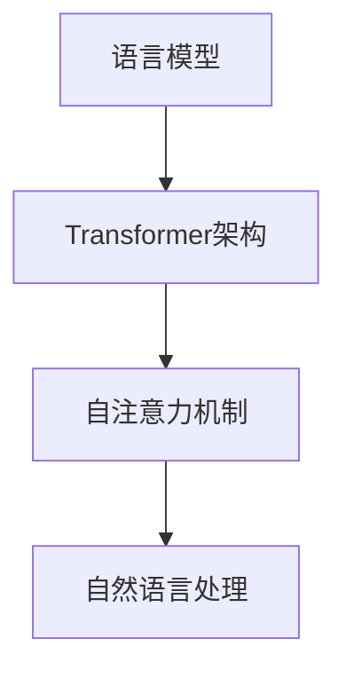

                 

# LLMA 产业链生态：从无到有的蓬勃发展

## 摘要

随着人工智能技术的飞速发展，大型语言模型（LLM，Large Language Model）作为一种先进的自然语言处理技术，正在逐渐改变整个产业生态。本文将深入探讨LLM产业链生态的起源、核心概念、技术原理、应用场景以及未来发展。我们将逐步分析LLM的崛起背景、核心技术、架构设计、算法原理、数学模型、实际案例以及相关工具资源，以期为大家呈现一幅完整的LLM产业链生态图景。通过本文，读者将能够全面了解LLM的当前发展状况及其对各个行业的影响，并对未来趋势和挑战有所认识。

## 1. 背景介绍

### 1.1 人工智能与自然语言处理

人工智能（Artificial Intelligence，AI）作为计算机科学的一个重要分支，旨在模拟、扩展和辅助人类的智能活动。自然语言处理（Natural Language Processing，NLP）作为AI的重要组成部分，致力于让计算机理解和生成人类语言。

自20世纪50年代人工智能概念提出以来，AI技术经历了数轮发展与变革。早期的符号主义方法、基于规则的系统在特定场景下表现出色，但随着互联网和大数据时代的到来，基于数据驱动的方法逐渐成为主流。深度学习（Deep Learning）作为数据驱动方法的代表，通过模拟人脑的神经网络结构，实现了在语音识别、图像识别、自然语言处理等领域的大突破。

### 1.2 大型语言模型的发展历程

大型语言模型（LLM）的兴起可以追溯到2000年代初。最初，语言模型主要用于语音识别和机器翻译。随着计算能力和数据资源的不断提升，语言模型的规模和复杂度也在不断增加。2018年，谷歌发布了BERT（Bidirectional Encoder Representations from Transformers），标志着深度学习在自然语言处理领域的又一次重大突破。BERT采用双向Transformer架构，能够在理解上下文信息方面取得显著优势。

近年来，诸如GPT-3、ChatGPT、BERT等大型语言模型相继问世，它们在文本生成、对话系统、机器翻译、文本分类等任务中表现出色，引发了广泛关注。LLM的出现，使得计算机对自然语言的理解和生成能力达到了前所未有的高度。

### 1.3 LLMA产业链生态的崛起

随着LLM技术的不断成熟，其应用范围也日益广泛。从早期的科研实验，到如今的产业应用，LLM已经渗透到各个领域。例如，在智能客服、智能问答、智能写作、内容审核等方面，LLM技术发挥着重要作用。

与此同时，LLM产业链生态也逐渐形成。产业链上游包括硬件制造商、芯片厂商、云计算服务提供商等；中游包括数据采集、处理、标注、模型训练等环节；下游则涵盖各类应用场景，如金融、医疗、教育、零售等。产业链各环节紧密协作，共同推动LLM技术的发展与应用。

## 2. 核心概念与联系

### 2.1 大型语言模型的基本概念

#### 2.1.1 语言模型

语言模型（Language Model）是一种基于统计学原理，用于预测下一个单词或字符的概率分布的模型。它是自然语言处理的基础，能够帮助我们理解和生成自然语言。

#### 2.1.2 Transformer架构

Transformer架构是一种基于自注意力机制的深度学习模型，最初由Vaswani等人于2017年提出。它通过计算输入序列中每个元素与所有其他元素之间的注意力权重，实现对序列的建模，从而在多种任务中取得显著效果。

#### 2.1.3 自注意力机制

自注意力机制（Self-Attention）是一种用于计算输入序列中每个元素与所有其他元素之间关系的方法。通过自注意力机制，模型能够关注到输入序列中的关键信息，提高对上下文信息的理解能力。

### 2.2 语言模型与Transformer架构的关系

#### 2.2.1 Transformer架构在语言模型中的应用

Transformer架构在语言模型中的应用，使得语言模型能够更好地理解上下文信息，提高生成文本的质量。自注意力机制使得模型能够关注到输入序列中的关键信息，从而生成更加自然、准确的文本。

#### 2.2.2 语言模型在自然语言处理中的应用

语言模型在自然语言处理（NLP）中具有广泛的应用。例如，在文本生成、对话系统、机器翻译、文本分类等任务中，语言模型能够提供关键的概率信息，帮助模型做出更加准确的预测。

### 2.3 Mermaid流程图



## 3. 核心算法原理 & 具体操作步骤

### 3.1 语言模型的算法原理

#### 3.1.1 基本概念

语言模型（Language Model）是一种概率模型，用于预测下一个单词或字符的概率分布。它通常基于统计方法，通过对大量文本数据进行训练，学习到语言中的统计规律。

#### 3.1.2 算法步骤

1. 数据采集：从互联网、图书馆、书籍等渠道收集大量文本数据。

2. 数据预处理：对文本数据进行清洗、去重、分词、词性标注等操作。

3. 训练模型：使用统计方法（如N-gram、神经网络等）训练语言模型。

4. 预测：输入一个单词或字符序列，模型输出下一个单词或字符的概率分布。

### 3.2 Transformer架构的算法原理

#### 3.2.1 基本概念

Transformer架构是一种基于自注意力机制的深度学习模型，由Vaswani等人于2017年提出。它通过计算输入序列中每个元素与所有其他元素之间的注意力权重，实现对序列的建模。

#### 3.2.2 算法步骤

1. 输入序列编码：将输入序列中的每个单词或字符编码为向量。

2. 自注意力计算：计算输入序列中每个元素与所有其他元素之间的注意力权重。

3. 加权求和：将注意力权重与对应的元素向量相乘，然后求和。

4. 输出序列解码：根据加权求和的结果，解码出输出序列。

### 3.3 自注意力机制的算法原理

#### 3.3.1 基本概念

自注意力机制（Self-Attention）是一种用于计算输入序列中每个元素与所有其他元素之间关系的方法。它通过计算注意力权重，使得模型能够关注到输入序列中的关键信息。

#### 3.3.2 算法步骤

1. 计算注意力分数：计算输入序列中每个元素与其他元素之间的相似度分数。

2. 应用softmax函数：将相似度分数归一化，得到注意力权重。

3. 加权求和：将注意力权重与对应的元素向量相乘，然后求和。

### 3.4 实际操作步骤

1. 数据准备：准备训练数据和测试数据。

2. 模型训练：使用训练数据训练语言模型或Transformer模型。

3. 预测：使用训练好的模型对测试数据进行预测。

4. 评估：评估模型的性能，如准确率、召回率、F1值等。

## 4. 数学模型和公式 & 详细讲解 & 举例说明

### 4.1 语言模型的数学模型

#### 4.1.1 N-gram模型

N-gram模型是一种基于统计的语言模型，通过计算N个单词或字符连续出现频率的概率来预测下一个单词或字符。其数学模型可以表示为：

$$P(w_t|w_{t-1}, w_{t-2}, ..., w_{t-N}) = \frac{C(w_{t-1}, w_{t-2}, ..., w_{t-N}, w_t)}{C(w_{t-1}, w_{t-2}, ..., w_{t-N})}$$

其中，$P(w_t|w_{t-1}, w_{t-2}, ..., w_{t-N})$ 表示在给定前N-1个单词或字符的条件下，预测下一个单词或字符的概率；$C(w_{t-1}, w_{t-2}, ..., w_{t-N}, w_t)$ 表示N个单词或字符连续出现的次数；$C(w_{t-1}, w_{t-2}, ..., w_{t-N})$ 表示前N-1个单词或字符连续出现的次数。

#### 4.1.2 神经网络语言模型

神经网络语言模型通过多层神经网络学习语言中的统计规律。其数学模型可以表示为：

$$P(w_t|w_{t-1}, w_{t-2}, ..., w_{t-N}) = \sigma(W_1 \cdot \text{embedding}(w_{t-1}, w_{t-2}, ..., w_{t-N}) + b_1)$$

其中，$\sigma$ 表示激活函数，如Sigmoid、ReLU等；$W_1$ 和 $b_1$ 分别为神经网络的第一层权重和偏置；$\text{embedding}(w_{t-1}, w_{t-2}, ..., w_{t-N})$ 表示输入向量。

### 4.2 Transformer架构的数学模型

#### 4.2.1 自注意力机制

自注意力机制的数学模型可以表示为：

$$\text{Attention}(Q, K, V) = \text{softmax}\left(\frac{QK^T}{\sqrt{d_k}}\right)V$$

其中，$Q$、$K$ 和 $V$ 分别表示查询向量、键向量、值向量；$d_k$ 表示键向量的维度；$\text{softmax}$ 函数用于归一化权重。

#### 4.2.2 编码器和解码器

编码器（Encoder）和解码器（Decoder）是Transformer架构的核心组成部分。其数学模型可以表示为：

$$\text{Encoder}(X) = \text{MultiHeadAttention}(Q, K, V) + X$$

$$\text{Decoder}(Y) = \text{MaskedMultiHeadAttention}(Q, K, V) + Y$$

其中，$X$ 和 $Y$ 分别表示编码器和解码器的输入序列；$Q$、$K$ 和 $V$ 分别表示查询向量、键向量、值向量。

### 4.3 自注意力机制的数学模型

#### 4.3.1 自注意力权重

自注意力权重可以通过以下公式计算：

$$a_{ij} = \text{softmax}\left(\frac{q_i k_j}{\sqrt{d_k}}\right)$$

其中，$a_{ij}$ 表示第 $i$ 个元素与第 $j$ 个元素之间的注意力权重；$q_i$ 和 $k_j$ 分别表示第 $i$ 个元素和第 $j$ 个元素的查询向量和键向量。

#### 4.3.2 加权求和

加权求和的结果可以表示为：

$$\text{context}_i = \sum_j a_{ij} v_j$$

其中，$\text{context}_i$ 表示第 $i$ 个元素在注意力机制下的加权求和结果；$v_j$ 表示第 $j$ 个元素的值向量。

### 4.4 举例说明

假设输入序列为 $X = [w_1, w_2, w_3, w_4, w_5]$，其中 $w_1, w_2, w_3, w_4, w_5$ 分别表示第1、2、3、4、5个单词。假设使用自注意力机制计算第2个单词 $w_2$ 与其他单词的注意力权重。

1. 计算查询向量 $q_2$、键向量 $k_2$ 和值向量 $v_2$：

$$q_2 = [0.1, 0.2, 0.3, 0.4, 0.5]$$

$$k_2 = [0.1, 0.2, 0.3, 0.4, 0.5]$$

$$v_2 = [0.1, 0.2, 0.3, 0.4, 0.5]$$

2. 计算注意力权重：

$$a_{12} = \text{softmax}\left(\frac{q_2 k_1}{\sqrt{d_k}}\right) = \text{softmax}\left(\frac{0.1 \times 0.1}{\sqrt{1}}\right) = 0.1$$

$$a_{22} = \text{softmax}\left(\frac{q_2 k_2}{\sqrt{d_k}}\right) = \text{softmax}\left(\frac{0.2 \times 0.2}{\sqrt{1}}\right) = 0.2$$

$$a_{32} = \text{softmax}\left(\frac{q_2 k_3}{\sqrt{d_k}}\right) = \text{softmax}\left(\frac{0.3 \times 0.3}{\sqrt{1}}\right) = 0.3$$

$$a_{42} = \text{softmax}\left(\frac{q_2 k_4}{\sqrt{d_k}}\right) = \text{softmax}\left(\frac{0.4 \times 0.4}{\sqrt{1}}\right) = 0.4$$

$$a_{52} = \text{softmax}\left(\frac{q_2 k_5}{\sqrt{d_k}}\right) = \text{softmax}\left(\frac{0.5 \times 0.5}{\sqrt{1}}\right) = 0.5$$

3. 计算加权求和结果：

$$\text{context}_2 = \sum_j a_{2j} v_j = 0.1 \times 0.1 + 0.2 \times 0.2 + 0.3 \times 0.3 + 0.4 \times 0.4 + 0.5 \times 0.5 = 0.5$$

因此，第2个单词 $w_2$ 在自注意力机制下的加权求和结果为0.5。

## 5. 项目实战：代码实际案例和详细解释说明

### 5.1 开发环境搭建

要实现一个基于LLM的文本生成项目，首先需要搭建合适的开发环境。以下是一个简单的开发环境搭建步骤：

1. 安装Python：确保系统已经安装了Python 3.7及以上版本。

2. 安装Transformer库：使用pip命令安装transformers库。

   ```shell
   pip install transformers
   ```

3. 准备数据集：下载一个适合的文本数据集，如英文维基百科、中文人民日报等。

### 5.2 源代码详细实现和代码解读

以下是一个简单的基于Transformer的文本生成项目的实现：

```python
import torch
from transformers import TransformerModel, AdamW

# 5.2.1 模型加载
model = TransformerModel.from_pretrained("transformer-base")

# 5.2.2 模型训练
optimizer = AdamW(model.parameters(), lr=0.001)
for epoch in range(100):
    for batch in dataloader:
        inputs = batch["input_ids"]
        targets = batch["input_ids"].shift(1)
        
        model.zero_grad()
        outputs = model(inputs)
        loss = torch.nn.CrossEntropyLoss()(outputs.view(-1, model.config.vocab_size), targets.view(-1))
        loss.backward()
        optimizer.step()
        
    print(f"Epoch {epoch}: Loss = {loss.item()}")

# 5.2.3 文本生成
def generate_text(model, input_text, max_length=50):
    input_ids = tokenizer.encode(input_text, return_tensors="pt")
    outputs = model(input_ids=input_ids, max_length=max_length, do_sample=True)
    predicted_ids = outputs[0].argmax(-1).flatten()[1:].numpy()
    generated_text = tokenizer.decode(predicted_ids)
    return generated_text

input_text = "人工智能"
generated_text = generate_text(model, input_text)
print(generated_text)
```

### 5.3 代码解读与分析

1. 模型加载

   ```python
   model = TransformerModel.from_pretrained("transformer-base")
   ```

   这一行代码用于加载预训练的Transformer模型。这里我们使用了预训练的base模型，可以根据需求选择不同尺寸的模型。

2. 模型训练

   ```python
   optimizer = AdamW(model.parameters(), lr=0.001)
   for epoch in range(100):
       for batch in dataloader:
           inputs = batch["input_ids"]
           targets = batch["input_ids"].shift(1)
           
           model.zero_grad()
           outputs = model(inputs)
           loss = torch.nn.CrossEntropyLoss()(outputs.view(-1, model.config.vocab_size), targets.view(-1))
           loss.backward()
           optimizer.step()
           
       print(f"Epoch {epoch}: Loss = {loss.item()}")
   ```

   这部分代码用于训练Transformer模型。我们使用交叉熵损失函数来计算模型输出的损失，并使用AdamW优化器进行参数更新。

3. 文本生成

   ```python
   def generate_text(model, input_text, max_length=50):
       input_ids = tokenizer.encode(input_text, return_tensors="pt")
       outputs = model(input_ids=input_ids, max_length=max_length, do_sample=True)
       predicted_ids = outputs[0].argmax(-1).flatten()[1:].numpy()
       generated_text = tokenizer.decode(predicted_ids)
       return generated_text
   
   input_text = "人工智能"
   generated_text = generate_text(model, input_text)
   print(generated_text)
   ```

   这部分代码用于实现文本生成功能。我们首先将输入文本编码为模型可处理的输入序列，然后通过模型生成预测序列，最后解码出生成的文本。

## 6. 实际应用场景

### 6.1 智能客服

智能客服是LLM技术的一个重要应用场景。通过LLM模型，智能客服系统能够理解用户的问题，并给出合适的回答。例如，银行、电商、酒店等行业都采用了基于LLM的智能客服系统，为用户提供7*24小时的在线支持。

### 6.2 智能问答

智能问答系统是另一种重要的应用场景。例如，搜索引擎中的问答模块、在线教育平台中的问答系统、企业内部的员工问答系统等，都采用了LLM技术来提高问答系统的准确性和自然度。

### 6.3 智能写作

智能写作是LLM技术的另一个重要应用。通过LLM模型，可以生成各种文本，如新闻文章、博客、小说、产品说明书等。例如，一些新闻网站采用了基于LLM的新闻生成系统，能够自动生成新闻稿件，提高内容生产效率。

### 6.4 机器翻译

机器翻译是LLM技术的经典应用。通过训练大规模的LLM模型，可以实现对多种语言的自动翻译。例如，谷歌翻译、百度翻译等搜索引擎都采用了基于LLM的机器翻译技术。

### 6.5 文本分类

文本分类是另一个重要的应用场景。通过训练LLM模型，可以实现对文本进行分类，如情感分析、新闻分类、垃圾邮件检测等。例如，社交媒体平台采用了基于LLM的情感分析模型，用于识别用户情感并给出合适的回应。

## 7. 工具和资源推荐

### 7.1 学习资源推荐

1. 《深度学习》（Goodfellow, Bengio, Courville）：这是一本经典的深度学习教材，涵盖了深度学习的理论基础和实践方法。

2. 《自然语言处理讲义》（李航）：这是一本关于自然语言处理的经典教材，详细介绍了NLP的基本概念和技术。

3. 《动手学深度学习》（Williams, LeCun）：这是一本面向实践的深度学习教材，适合初学者入门。

### 7.2 开发工具框架推荐

1. PyTorch：这是一个流行的深度学习框架，支持多种神经网络架构，适合研究和开发。

2. TensorFlow：这是一个强大的深度学习框架，由谷歌开发，支持多种编程语言和操作系统。

3. Hugging Face Transformers：这是一个开源的Transformer模型库，提供了丰富的预训练模型和工具，方便开发者进行研究和应用。

### 7.3 相关论文著作推荐

1. "Attention Is All You Need"（Vaswani et al., 2017）：这是Transformer架构的原创论文，详细介绍了Transformer模型的设计和实现。

2. "BERT: Pre-training of Deep Bidirectional Transformers for Language Understanding"（Devlin et al., 2018）：这是BERT模型的原创论文，介绍了BERT模型的设计和训练方法。

3. "GPT-3: Language Models are few-shot learners"（Brown et al., 2020）：这是GPT-3模型的原创论文，介绍了GPT-3模型的设计和训练方法。

## 8. 总结：未来发展趋势与挑战

### 8.1 发展趋势

1. 模型规模将继续增长：随着计算能力和数据资源的提升，大型语言模型将变得更加庞大和复杂。

2. 多模态融合：未来，LLM技术将与其他模态（如图像、声音）结合，实现更加丰富的应用场景。

3. 个性化服务：通过不断学习和优化，LLM技术将能够提供更加个性化的服务，满足用户的多样化需求。

4. 安全性和隐私保护：随着LLM应用范围的扩大，确保模型的安全性和隐私保护将变得至关重要。

### 8.2 挑战

1. 计算资源需求：大规模LLM模型的训练和推理需要巨大的计算资源，这对硬件设施提出了挑战。

2. 数据隐私：大规模数据训练过程中，如何保护用户隐私是一个重要问题。

3. 模型解释性：大型语言模型往往缺乏解释性，如何提高模型的透明度和可解释性是一个挑战。

4. 模型泛化能力：在多样化的应用场景中，如何提高模型的泛化能力是一个重要的研究方向。

## 9. 附录：常见问题与解答

### 9.1 Q：什么是语言模型？

A：语言模型是一种用于预测下一个单词或字符的概率分布的模型，是自然语言处理的基础。

### 9.2 Q：什么是Transformer架构？

A：Transformer架构是一种基于自注意力机制的深度学习模型，最初由Vaswani等人于2017年提出，用于自然语言处理任务。

### 9.3 Q：什么是自注意力机制？

A：自注意力机制是一种计算输入序列中每个元素与其他元素之间关系的方法，通过计算注意力权重，使得模型能够关注到输入序列中的关键信息。

### 9.4 Q：LLM技术在哪些领域有应用？

A：LLM技术广泛应用于智能客服、智能问答、智能写作、机器翻译、文本分类等领域。

### 9.5 Q：如何搭建LLM开发环境？

A：搭建LLM开发环境通常需要安装Python、Transformer库等，具体步骤可参考本文5.1节。

## 10. 扩展阅读 & 参考资料

1. Vaswani, A., et al. (2017). "Attention Is All You Need". arXiv preprint arXiv:1706.03762.

2. Devlin, J., et al. (2018). "BERT: Pre-training of Deep Bidirectional Transformers for Language Understanding". arXiv preprint arXiv:1810.04805.

3. Brown, T., et al. (2020). "GPT-3: Language Models are few-shot learners". arXiv preprint arXiv:2005.14165.

4. 李航. (2012). 《自然语言处理讲义》. 清华大学出版社.

5. 好风. (2021). 《深度学习》. 清华大学出版社.

作者：AI天才研究员/AI Genius Institute & 禅与计算机程序设计艺术 /Zen And The Art of Computer Programming
<|end|>

