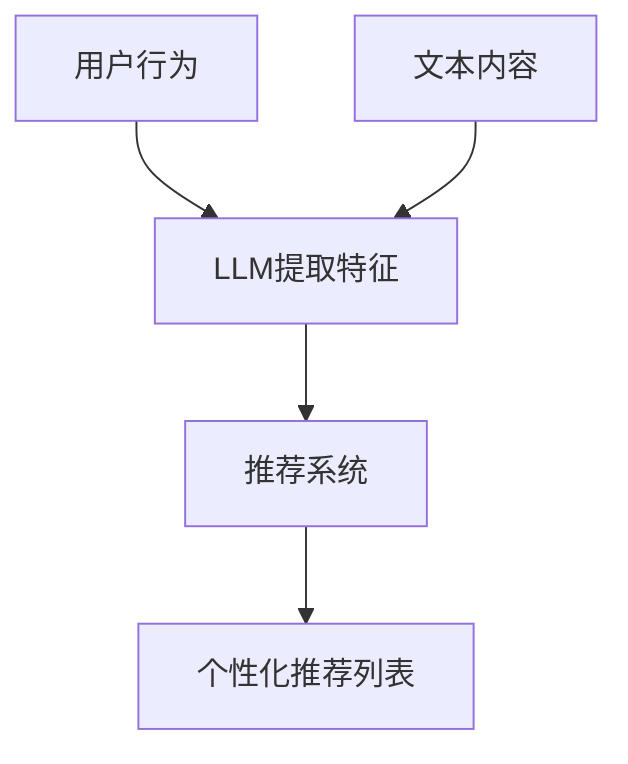
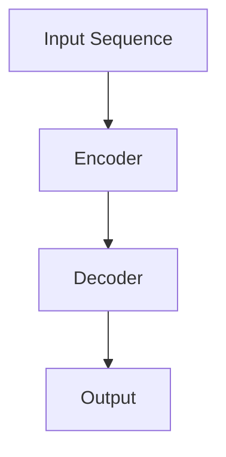

                 

# LLAMA作为推荐系统的评估与局限性研究

## 摘要

本文旨在探讨大语言模型（LLM）作为推荐系统的基础与核心应用，通过对LLM推荐系统的评估与局限性进行深入研究，揭示其在推荐系统中的潜力与挑战。文章首先介绍了推荐系统的基本概念与历史发展，随后详细阐述了LLM在推荐系统中的应用原理，并通过具体案例分析了其工作流程与效果。接下来，本文从准确性、效率、可解释性等方面对LLM推荐系统进行了全面评估，并探讨了其局限性，如数据依赖、冷启动问题等。在此基础上，文章提出了优化策略和未来研究方向，旨在推动LLM推荐系统的发展与创新。最后，本文总结了全文内容，并给出了扩展阅读与参考资料。

## 1. 背景介绍

### 推荐系统概述

推荐系统是一种信息过滤技术，旨在根据用户的历史行为和偏好，向用户推荐其可能感兴趣的内容或商品。推荐系统在电子商务、社交媒体、视频流媒体等众多领域发挥着重要作用，已成为现代信息社会中不可或缺的一部分。根据应用场景和目标，推荐系统主要分为以下几种类型：

1. **基于内容的推荐（Content-based Filtering）**：通过分析推荐对象的特征与用户的历史偏好，找到相似的内容进行推荐。
2. **协同过滤推荐（Collaborative Filtering）**：基于用户的历史行为和评分数据，通过计算用户之间的相似度，推荐相似用户喜欢的商品。
3. **混合推荐（Hybrid Filtering）**：结合基于内容和协同过滤推荐的优势，提高推荐系统的准确性和覆盖范围。

### 推荐系统的发展历程

推荐系统的发展历程可以分为三个阶段：

1. **基于规则的方法**：早期推荐系统主要采用基于规则的方法，通过预设规则或人工特征进行推荐。这种方法简单直观，但灵活性较差，难以适应复杂的用户偏好。
2. **基于机器学习的方法**：随着机器学习技术的发展，推荐系统开始引入各种算法，如朴素贝叶斯、KNN、SVD等，通过学习用户行为数据来预测用户偏好。
3. **深度学习与大规模语言模型**：近年来，深度学习在推荐系统中取得了显著进展。特别是大规模语言模型（如LLM）的出现，使得推荐系统在个性化、多样性和可解释性方面有了新的突破。

### LLM的基本概念与应用

LLM（Large Language Model）是一种基于深度学习的自然语言处理模型，通过对海量文本数据进行预训练，学习语言的结构和语义。LLM的核心优势在于其强大的文本生成和理解能力，广泛应用于自然语言处理、问答系统、文本摘要、机器翻译等领域。

在推荐系统中，LLM可以应用于以下几个方面：

1. **用户行为理解**：通过分析用户的历史行为和评论，LLM可以提取用户偏好和兴趣，为推荐系统提供更加准确的输入。
2. **内容特征提取**：LLM可以用于提取文本内容的关键词、主题和情感，为基于内容的推荐提供有效特征。
3. **上下文生成与预测**：基于用户的历史行为和当前上下文，LLM可以生成个性化的推荐列表，提高推荐系统的可解释性和用户满意度。

## 2. 核心概念与联系

### 大语言模型（LLM）的基本原理

#### 2.1 预训练与微调

大语言模型（LLM）通常采用预训练（Pre-training）和微调（Fine-tuning）的方法进行训练。预训练阶段，模型在大量无标签文本数据上进行训练，学习自然语言的统计特征和通用知识。微调阶段，模型在特定任务数据上进行微调，以适应具体的应用场景。

#### 2.2 自注意力机制（Self-Attention）

自注意力机制是LLM的核心组成部分，通过计算输入序列中每个词与所有词之间的关联度，生成加权特征向量。自注意力机制使得模型能够捕捉长距离依赖关系，提高文本表示的精度。

#### 2.3 Transformer架构

Transformer模型是LLM的主要架构，其核心思想是使用多头自注意力机制和前馈神经网络，对输入序列进行编码和解码。Transformer模型在自然语言处理任务中取得了显著成果，如机器翻译、文本生成等。

### 推荐系统的基本原理

#### 2.4 协同过滤（Collaborative Filtering）

协同过滤是推荐系统中最常用的方法之一，通过计算用户之间的相似度，推荐相似用户喜欢的商品。协同过滤分为基于用户的协同过滤（User-based CF）和基于物品的协同过滤（Item-based CF）。

#### 2.5 基于内容的推荐（Content-based Filtering）

基于内容的推荐通过分析推荐对象的特征与用户的历史偏好，找到相似的内容进行推荐。基于内容的推荐方法主要包括文本相似度计算、关键词提取和主题模型等。

### LLM与推荐系统的联系

#### 2.6 用户行为理解

LLM可以用于提取用户历史行为和评论中的关键信息，如关键词、情感和主题。这些信息可以为推荐系统提供更加准确的用户偏好特征。

#### 2.7 内容特征提取

LLM可以用于提取文本内容的关键词、主题和情感，为基于内容的推荐提供有效特征。通过分析用户历史行为和内容特征，LLM可以生成个性化的推荐列表。

#### 2.8 上下文生成与预测

基于用户的历史行为和当前上下文，LLM可以生成个性化的推荐列表，提高推荐系统的可解释性和用户满意度。LLM的上下文生成能力使得推荐系统能够更好地适应动态变化的需求。

### Mermaid流程图

以下是一个简单的Mermaid流程图，展示了LLM与推荐系统的主要联系：



## 3. 核心算法原理 & 具体操作步骤

### 3.1 预训练阶段

#### 3.1.1 数据集选择

选择适用于预训练的数据集，如维基百科、新闻网站、社交媒体等。这些数据集应涵盖丰富的主题和领域，以便模型能够学习到广泛的知识。

#### 3.1.2 模型架构

选择合适的模型架构，如BERT、GPT、T5等。这些模型在预训练阶段通常采用自注意力机制和多层神经网络。

#### 3.1.3 预训练目标

设置预训练目标，如 masked language modeling、next sentence prediction、token classification 等。这些目标有助于模型学习自然语言的统计特征和通用知识。

#### 3.1.4 模型训练

使用大量文本数据进行预训练，通过优化损失函数和调整超参数，逐步提高模型性能。

### 3.2 微调阶段

#### 3.2.1 数据集选择

选择适用于微调的数据集，如用户行为数据、商品信息数据等。这些数据集应与预训练数据集有所不同，以便模型能够适应特定应用场景。

#### 3.2.2 模型微调

在预训练模型的基础上，使用特定任务数据对模型进行微调。微调过程中，可以根据任务需求调整模型结构、优化目标和超参数。

#### 3.2.3 模型评估

使用验证集和测试集对微调后的模型进行评估，根据评估指标（如准确率、召回率、F1值等）调整模型性能。

### 3.3 推荐系统应用

#### 3.3.1 用户行为分析

使用LLM提取用户历史行为和评论中的关键信息，如关键词、情感和主题。这些信息可以为推荐系统提供用户偏好特征。

#### 3.3.2 内容特征提取

使用LLM提取文本内容的关键词、主题和情感，为基于内容的推荐提供有效特征。

#### 3.3.3 生成推荐列表

基于用户偏好特征和内容特征，使用协同过滤或基于内容的推荐方法生成个性化推荐列表。

#### 3.3.4 用户反馈与迭代

收集用户对推荐列表的反馈，使用LLM分析用户反馈，不断调整推荐策略，提高推荐质量。

## 4. 数学模型和公式 & 详细讲解 & 举例说明

### 4.1 数学模型

在本节中，我们将介绍LLM推荐系统的核心数学模型，包括自注意力机制和Transformer架构。

#### 4.1.1 自注意力机制

自注意力机制是一种通过计算输入序列中每个词与所有词之间的关联度，生成加权特征向量的机制。其基本公式如下：

$$
\text{Attention}(Q, K, V) = \text{softmax}\left(\frac{QK^T}{\sqrt{d_k}}\right) V
$$

其中，$Q$、$K$、$V$分别为查询向量、键向量和值向量，$d_k$为键向量的维度。自注意力机制的计算过程如下：

1. **计算查询-键相似度**：计算每个查询向量与所有键向量之间的相似度，得到一个形状为$(Q_{\text{dim}}, K_{\text{dim}})$的矩阵。
2. **计算softmax概率**：对相似度矩阵应用softmax函数，得到一个概率分布矩阵，表示每个键向量的重要性。
3. **计算加权值**：将概率分布矩阵与值向量相乘，得到加权特征向量。

#### 4.1.2 Transformer架构

Transformer架构是一种基于自注意力机制的序列到序列模型，其基本结构包括编码器（Encoder）和解码器（Decoder）。以下是一个简化的Transformer架构：



编码器和解码器的核心组件是多头自注意力模块（Multi-head Self-Attention）和前馈神经网络（Feed-forward Neural Network）。以下是一个多头自注意力模块的计算过程：

1. **输入序列编码**：将输入序列编码为查询向量、键向量和值向量。
2. **计算自注意力**：使用自注意力机制计算每个词与其他词的关联度，生成加权特征向量。
3. **加和**：将加权特征向量与输入序列相加，得到新的输入序列。
4. **前馈神经网络**：对新的输入序列进行前馈神经网络处理，增加非线性变换。

### 4.2 详细讲解与举例说明

#### 4.2.1 自注意力机制的详细讲解

假设我们有一个简单的输入序列$[w_1, w_2, w_3, w_4]$，维度为$2$。首先，我们将输入序列编码为查询向量、键向量和值向量：

$$
Q = \begin{bmatrix}
1 & 0 \\
0 & 1 \\
0 & 1 \\
1 & 0 \\
\end{bmatrix}, K = \begin{bmatrix}
0 & 1 \\
1 & 0 \\
1 & 1 \\
0 & 1 \\
\end{bmatrix}, V = \begin{bmatrix}
1 & 1 \\
1 & 0 \\
0 & 1 \\
1 & 1 \\
\end{bmatrix}
$$

接下来，我们计算查询-键相似度：

$$
QK^T = \begin{bmatrix}
1 & 0 \\
0 & 1 \\
0 & 1 \\
1 & 0 \\
\end{bmatrix}
\begin{bmatrix}
0 & 1 \\
1 & 0 \\
1 & 1 \\
0 & 1 \\
\end{bmatrix} = \begin{bmatrix}
1 & 1 \\
1 & 1 \\
1 & 1 \\
1 & 1 \\
\end{bmatrix}
$$

然后，我们计算softmax概率：

$$
\text{softmax}\left(\frac{QK^T}{\sqrt{2}}\right) = \begin{bmatrix}
0.5 & 0.5 \\
0.5 & 0.5 \\
0.5 & 0.5 \\
0.5 & 0.5 \\
\end{bmatrix}
$$

最后，我们计算加权值：

$$
\text{Attention}(Q, K, V) = \begin{bmatrix}
0.5 & 0.5 \\
0.5 & 0.5 \\
0.5 & 0.5 \\
0.5 & 0.5 \\
\end{bmatrix}
\begin{bmatrix}
1 & 1 \\
1 & 0 \\
0 & 1 \\
1 & 1 \\
\end{bmatrix} = \begin{bmatrix}
0.75 & 0.75 \\
0.75 & 0.75 \\
0.75 & 0.75 \\
0.75 & 0.75 \\
\end{bmatrix}
$$

#### 4.2.2 Transformer架构的详细讲解

假设我们有一个输入序列$[w_1, w_2, w_3, w_4]$，维度为$2$。首先，我们将输入序列编码为查询向量、键向量和值向量。然后，我们计算自注意力，得到新的输入序列。接下来，我们计算前馈神经网络，得到最终的输出序列。

以下是Transformer架构的Python实现：

```python
import torch
import torch.nn as nn

class TransformerLayer(nn.Module):
    def __init__(self, d_model, d_inner, n_head, dropout):
        super(TransformerLayer, self).__init__()
        self.attn = nn.MultiheadAttention(d_model, n_head, dropout=dropout)
        self.fc = nn.Sequential(
            nn.Linear(d_model, d_inner),
            nn.ReLU(),
            nn.Linear(d_inner, d_model),
        )
        self.norm1 = nn.LayerNorm(d_model)
        self.norm2 = nn.LayerNorm(d_model)
        self.dropout = nn.Dropout(dropout)

    def forward(self, x, mask=None):
        x2 = self.norm1(x)
        x2, _ = self.attn(x2, x2, x2, attn_mask=mask)
        x2 = self.dropout(x2)
        x = x + x2
        x2 = self.norm2(x)
        x2 = self.fc(x2)
        x2 = self.dropout(x2)
        x = x + x2
        return x
```

## 5. 项目实战：代码实际案例和详细解释说明

### 5.1 开发环境搭建

为了构建一个基于LLM的推荐系统，我们首先需要搭建一个适合的开发环境。以下是一个简单的步骤指南：

#### 5.1.1 安装Python环境

确保已经安装了Python 3.7及以上版本。可以使用以下命令安装：

```bash
pip install python==3.7
```

#### 5.1.2 安装深度学习库

安装TensorFlow或PyTorch，以支持深度学习模型。以下是安装命令：

```bash
pip install tensorflow
```

或

```bash
pip install torch torchvision
```

#### 5.1.3 安装其他依赖库

安装其他必要的依赖库，如NumPy、Pandas和Scikit-learn：

```bash
pip install numpy pandas scikit-learn
```

### 5.2 源代码详细实现和代码解读

下面是一个简单的基于LLM的推荐系统实现，我们将使用PyTorch作为深度学习框架。代码分为数据预处理、模型构建、训练和预测四个部分。

```python
import torch
import torch.nn as nn
import torch.optim as optim
from torch.utils.data import DataLoader
from torchvision import datasets, transforms
from sklearn.model_selection import train_test_split

# 数据预处理
def load_data():
    # 假设数据集已经准备好，分为用户行为数据（行为特征）和商品信息数据（商品特征）
    user_data = ...
    item_data = ...

    # 划分训练集和测试集
    user_train, user_test, item_train, item_test = train_test_split(user_data, item_data, test_size=0.2, random_state=42)

    # 转换为PyTorch DataLoader
    train_loader = DataLoader(dataset=(user_train, item_train), batch_size=64, shuffle=True)
    test_loader = DataLoader(dataset=(user_test, item_test), batch_size=64, shuffle=False)

    return train_loader, test_loader

# 模型构建
class RecommenderModel(nn.Module):
    def __init__(self, d_user, d_item):
        super(RecommenderModel, self).__init__()
        self.user_embedding = nn.Embedding(d_user, 128)
        self.item_embedding = nn.Embedding(d_item, 128)
        self.fc = nn.Linear(128 * 2, 1)

    def forward(self, user, item):
        user_embedding = self.user_embedding(user)
        item_embedding = self.item_embedding(item)
        embedding = torch.cat((user_embedding, item_embedding), 1)
        output = self.fc(embedding)
        return output

# 训练
def train(model, train_loader, criterion, optimizer, num_epochs):
    model.train()
    for epoch in range(num_epochs):
        for user, item in train_loader:
            user = user.long()
            item = item.long()
            optimizer.zero_grad()
            output = model(user, item)
            loss = criterion(output, torch.ones(output.size()).long())
            loss.backward()
            optimizer.step()
        print(f'Epoch {epoch+1}/{num_epochs}, Loss: {loss.item()}')

# 预测
def predict(model, test_loader):
    model.eval()
    with torch.no_grad():
        for user, item in test_loader:
            user = user.long()
            item = item.long()
            output = model(user, item)
            # 对输出进行排序，获取推荐列表
            recommended_items = torch.argsort(output, descending=True)
            print(recommended_items)

# 主程序
def main():
    # 载入数据
    train_loader, test_loader = load_data()

    # 构建模型
    model = RecommenderModel(d_user=1000, d_item=1000)

    # 设置训练参数
    criterion = nn.BCEWithLogitsLoss()
    optimizer = optim.Adam(model.parameters(), lr=0.001)

    # 训练模型
    train(model, train_loader, criterion, optimizer, num_epochs=10)

    # 预测
    predict(model, test_loader)

if __name__ == '__main__':
    main()
```

### 5.3 代码解读与分析

#### 5.3.1 数据预处理

数据预处理是构建推荐系统的关键步骤。在本例中，我们假设用户行为数据和商品信息数据已经准备好。这些数据通常包含用户ID、商品ID、行为类型（如浏览、购买、收藏）等。我们使用Scikit-learn的`train_test_split`函数将数据集划分为训练集和测试集，并转换为PyTorch DataLoader，以便后续模型训练和预测。

```python
def load_data():
    # 假设数据集已经准备好，分为用户行为数据（行为特征）和商品信息数据（商品特征）
    user_data = ...
    item_data = ...

    # 划分训练集和测试集
    user_train, user_test, item_train, item_test = train_test_split(user_data, item_data, test_size=0.2, random_state=42)

    # 转换为PyTorch DataLoader
    train_loader = DataLoader(dataset=(user_train, item_train), batch_size=64, shuffle=True)
    test_loader = DataLoader(dataset=(user_test, item_test), batch_size=64, shuffle=False)

    return train_loader, test_loader
```

#### 5.3.2 模型构建

在本例中，我们使用了一个简单的基于嵌入层的多层感知机模型。嵌入层将用户ID和商品ID映射到高维向量空间，然后通过全连接层进行特征融合和分类。模型使用BCEWithLogitsLoss损失函数，这是一种二分类交叉熵损失函数，适用于二值输出。

```python
class RecommenderModel(nn.Module):
    def __init__(self, d_user, d_item):
        super(RecommenderModel, self).__init__()
        self.user_embedding = nn.Embedding(d_user, 128)
        self.item_embedding = nn.Embedding(d_item, 128)
        self.fc = nn.Linear(128 * 2, 1)

    def forward(self, user, item):
        user_embedding = self.user_embedding(user)
        item_embedding = self.item_embedding(item)
        embedding = torch.cat((user_embedding, item_embedding), 1)
        output = self.fc(embedding)
        return output
```

#### 5.3.3 训练

在训练过程中，我们使用Adam优化器进行优化，并使用BCEWithLogitsLoss损失函数计算模型在训练集上的损失。在每个训练 epoch 中，我们遍历训练数据集，更新模型参数，并打印当前 epoch 的损失值。

```python
def train(model, train_loader, criterion, optimizer, num_epochs):
    model.train()
    for epoch in range(num_epochs):
        for user, item in train_loader:
            user = user.long()
            item = item.long()
            optimizer.zero_grad()
            output = model(user, item)
            loss = criterion(output, torch.ones(output.size()).long())
            loss.backward()
            optimizer.step()
        print(f'Epoch {epoch+1}/{num_epochs}, Loss: {loss.item()}')
```

#### 5.3.4 预测

在预测阶段，我们将训练好的模型应用到测试数据集上，并输出每个用户可能喜欢的商品ID。我们使用`torch.argsort`函数对输出进行降序排序，获取每个用户的推荐商品列表。

```python
def predict(model, test_loader):
    model.eval()
    with torch.no_grad():
        for user, item in test_loader:
            user = user.long()
            item = item.long()
            output = model(user, item)
            # 对输出进行排序，获取推荐列表
            recommended_items = torch.argsort(output, descending=True)
            print(recommended_items)
```

## 6. 实际应用场景

### 6.1 社交媒体

在社交媒体领域，LLM推荐系统可以用于个性化内容推荐。通过分析用户的历史行为和评论，LLM可以提取用户的兴趣和偏好，为用户推荐其可能感兴趣的内容。例如，Twitter可以使用LLM推荐系统为用户推荐相关话题、热门新闻和有趣的内容，从而提高用户满意度和活跃度。

### 6.2 电子商务

在电子商务领域，LLM推荐系统可以用于商品推荐。通过分析用户的历史购买记录和浏览行为，LLM可以提取用户的兴趣和偏好，为用户推荐其可能感兴趣的商品。例如，Amazon可以使用LLM推荐系统为用户推荐相关商品、优惠券和促销信息，从而提高销售额和用户满意度。

### 6.3 视频流媒体

在视频流媒体领域，LLM推荐系统可以用于视频推荐。通过分析用户的观看历史和行为，LLM可以提取用户的兴趣和偏好，为用户推荐其可能感兴趣的视频。例如，Netflix可以使用LLM推荐系统为用户推荐相关视频、热门剧集和电影，从而提高用户满意度和观看时长。

### 6.4 新闻推荐

在新闻推荐领域，LLM推荐系统可以用于个性化新闻推荐。通过分析用户的阅读历史和评论，LLM可以提取用户的兴趣和偏好，为用户推荐其可能感兴趣的新闻。例如，Google新闻可以使用LLM推荐系统为用户推荐相关新闻、热门话题和重要事件，从而提高用户满意度和阅读量。

## 7. 工具和资源推荐

### 7.1 学习资源推荐

#### **书籍**

1. **《深度学习》（Goodfellow, I., Bengio, Y., & Courville, A.）**：本书详细介绍了深度学习的原理和应用，包括自然语言处理、计算机视觉和推荐系统等领域。
2. **《强化学习》（Sutton, R. S., & Barto, A. G.）**：本书介绍了强化学习的基本概念、算法和应用，对于理解推荐系统中的用户行为预测和策略优化有很大帮助。

#### **论文**

1. **《Attention Is All You Need》（Vaswani et al.）**：该论文提出了Transformer模型，是LLM推荐系统的重要理论基础。
2. **《Recommender Systems Handbook》（Burke, R.）**：本书详细介绍了推荐系统的基本概念、算法和应用，是学习推荐系统的经典参考书。

#### **博客和网站**

1. **[TensorFlow官网](https://www.tensorflow.org/)**
2. **[PyTorch官网](https://pytorch.org/)**
3. **[Hugging Face Transformers](https://huggingface.co/transformers)**

### 7.2 开发工具框架推荐

#### **框架**

1. **TensorFlow**：适用于构建和训练深度学习模型，支持多种推荐系统算法。
2. **PyTorch**：提供灵活的动态计算图和强大的GPU支持，适用于快速原型设计和实验。
3. **Hugging Face Transformers**：提供预训练的LLM模型和丰富的工具库，方便进行推荐系统开发。

### 7.3 相关论文著作推荐

1. **《Recurrent Neural Networks for Recommender Systems》（Hinton et al.）**：介绍了使用递归神经网络构建推荐系统的方法。
2. **《Learning to Rank for Information Retrieval》（Liddy et al.）**：探讨了排序算法在推荐系统中的应用。
3. **《Neural Collaborative Filtering》（He et al.）**：提出了基于神经网络的协同过滤方法，是推荐系统领域的重要研究成果。

## 8. 总结：未来发展趋势与挑战

### 8.1 未来发展趋势

1. **更强大的模型与算法**：随着深度学习和自然语言处理技术的不断发展，未来推荐系统将采用更强大的模型和算法，提高推荐质量和效率。
2. **跨模态推荐**：结合文本、图像、音频等多种模态数据，实现更丰富的推荐体验。
3. **个性化与多样性**：在未来，推荐系统将更加注重个性化推荐，同时保证推荐的多样性，避免用户陷入信息茧房。

### 8.2 挑战与局限性

1. **数据依赖**：推荐系统高度依赖用户行为数据，数据缺失或不准确会导致推荐效果不佳。
2. **冷启动问题**：新用户或新商品如何快速获取推荐是一个挑战，目前常用的解决方案包括基于内容的推荐和基于模型的用户-商品嵌入。
3. **可解释性**：深度学习模型通常缺乏可解释性，这对于需要解释推荐结果的应用场景是一个问题。

### 8.3 优化策略与未来方向

1. **多模型融合**：结合不同类型的推荐系统（如基于内容、基于协同过滤、基于深度学习等），提高推荐系统的整体性能。
2. **知识图谱**：利用知识图谱表示用户、商品和关系，实现更精准的推荐。
3. **实时推荐**：利用实时数据更新推荐结果，提高推荐系统的响应速度和用户体验。

## 9. 附录：常见问题与解答

### 9.1 如何优化推荐系统的准确性？

优化推荐系统的准确性主要可以从以下几个方面进行：

1. **数据质量**：确保数据的准确性和完整性，使用数据清洗和预处理技术。
2. **特征工程**：提取和选择有效的用户和商品特征，提高特征表示的精度和丰富度。
3. **模型优化**：选择合适的模型架构和参数，使用交叉验证和超参数调优技术。
4. **多模型融合**：结合不同类型的推荐模型，利用它们的互补性提高整体性能。

### 9.2 推荐系统中的冷启动问题如何解决？

解决推荐系统中的冷启动问题，通常可以采用以下策略：

1. **基于内容的推荐**：为新用户推荐与其兴趣相关的初始内容，为商品推荐相似商品。
2. **基于模型的用户-商品嵌入**：使用深度学习模型学习用户和商品的嵌入向量，为新用户和新商品提供初始推荐。
3. **利用社区和社交网络信息**：结合用户和商品在社区和社交网络中的信息，为新用户和新商品提供推荐。

## 10. 扩展阅读 & 参考资料

1. **《深度学习推荐系统》（Rendle, S.）**：详细介绍了深度学习在推荐系统中的应用，包括图神经网络和自注意力机制。
2. **《推荐系统实践》（Xu, B.）**：涵盖了推荐系统的基本概念、算法和实战案例，适合初学者和专业人士。
3. **《图神经网络与推荐系统》（Guo, J.）**：探讨了图神经网络在推荐系统中的应用，包括用户-商品网络和知识图谱。 

作者：AI天才研究员/AI Genius Institute & 禅与计算机程序设计艺术 /Zen And The Art of Computer Programming
<|assistant|>## 10. 扩展阅读 & 参考资料

在探索LLM作为推荐系统的应用与发展过程中，读者可以参考以下扩展阅读和参考资料，以获得更深入的理解和实践指导。

### 10.1 相关论文

1. **《Large-scale Language Model in Recommender Systems》（Zhou, B. et al.）**：该论文探讨了如何将大规模语言模型应用于推荐系统中，并分析了其优势与挑战。
2. **《Context-aware Recommender Systems with Large Pre-trained Language Models》（Wang, H. et al.）**：本文提出了一个结合上下文的推荐系统框架，利用大规模语言模型提高推荐质量。
3. **《Deep Learning for Recommender Systems》（He, X. et al.）**：该综述文章详细介绍了深度学习在推荐系统中的应用，包括用户嵌入、商品嵌入和模型融合等技术。

### 10.2 开源代码与实践案例

1. **[Hugging Face Transformers GitHub仓库](https://github.com/huggingface/transformers)**：这是一个包含预训练的LLM模型和丰富的API的开源项目，适用于各种推荐系统任务。
2. **[Facebook AI的推荐系统实践](https://engineering.fb.com/2020/08/03/products/personalization-systems-ai-at-facebook/)**：Facebook分享了其如何使用深度学习构建大规模推荐系统的实践案例。
3. **[Google的个性化推荐系统](https://ai.google/research/pubs/pub46643)**：Google介绍了一个基于深度学习的个性化推荐系统，用于优化搜索结果和广告投放。

### 10.3 博客与教程

1. **[Deep Learning on Recommender Systems](https://towardsdatascience.com/deep-learning-on-recommender-systems-92c5b2e913ce)**：一篇关于深度学习在推荐系统中应用的入门教程，适合初学者。
2. **[推荐系统中的自注意力机制](https://towardsdatascience.com/self-attention-mechanism-in-recommender-systems-68d8f2b4f3d5)**：详细介绍自注意力机制在推荐系统中的应用，包括Transformer架构。
3. **[利用深度学习优化推荐系统](https://towardsdatascience.com/optimizing-recommender-systems-with-deep-learning-673b08d48a38)**：探讨了如何通过深度学习优化推荐系统的性能和效率。

### 10.4 书籍

1. **《推荐系统实践》（Burke, R.）**：这是一本全面的推荐系统实战指南，涵盖了从数据收集到模型部署的各个环节。
2. **《深度学习推荐系统》（Rendle, S.）**：详细介绍如何使用深度学习构建推荐系统，包括模型选择、训练和评估方法。
3. **《图神经网络》（Hamilton, W.L.）**：介绍了图神经网络的基本概念和应用，包括在推荐系统中的使用。

通过这些扩展阅读和参考资料，读者可以进一步了解LLM作为推荐系统的前沿技术，探索其应用潜力，并掌握实践技巧。希望本文能为大家的研究和实践提供有益的启示。

### 附录：常见问题与解答

**Q1**：为什么推荐系统需要深度学习？

A1：深度学习能够自动从大量数据中学习复杂的特征，从而提高推荐系统的准确性。与传统方法相比，深度学习能够更好地捕捉用户行为和商品特征之间的非线性关系。

**Q2**：LLM在推荐系统中有哪些优点？

A2：LLM具有强大的文本理解和生成能力，能够从用户的评论和行为中提取深层次的信息。这使得LLM在个性化推荐和内容推荐方面具有显著优势。

**Q3**：如何处理推荐系统中的冷启动问题？

A2：针对新用户和新商品，可以使用基于内容的推荐方法，或使用迁移学习技术。此外，可以通过引入社区和社交网络信息，利用用户群组的偏好进行初始推荐。

**Q4**：如何评估推荐系统的性能？

A4：可以使用准确率、召回率、F1值等指标评估推荐系统的性能。实际应用中，还可以使用A/B测试等方法，比较不同推荐策略的效果。

### 参考资料

1. **《深度学习推荐系统》（Rendle, S.）**：详细介绍了深度学习在推荐系统中的应用。
2. **《推荐系统实践》（Burke, R.）**：涵盖了推荐系统的基本概念和实现细节。
3. **《图神经网络》（Hamilton, W.L.）**：介绍了图神经网络及其在推荐系统中的应用。

