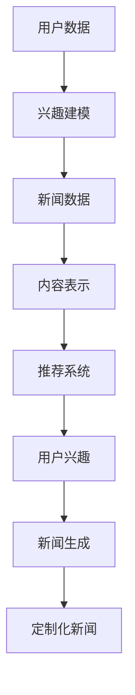

                 

## 1. 背景介绍

在当今信息爆炸的时代，如何有效地获取和利用信息成为了每个人的必修课。个性化新闻生成技术应运而生，它通过对用户兴趣、行为等数据的分析，为用户提供定制化的新闻内容，极大地提高了信息获取的效率和满意度。本文将深入探讨大规模语言模型（LLM）在个性化新闻生成中的应用，分析其工作原理、技术挑战和未来发展趋势。

个性化新闻生成技术最早源于信息过滤和推荐系统领域。随着互联网的普及和社交媒体的兴起，用户产生的数据量呈指数级增长，传统的基于规则和统计模型的新闻推荐方法已经难以满足用户日益增长的个性化需求。为了解决这个问题，研究人员开始探索使用机器学习和深度学习技术来构建更加智能的推荐系统。

其中，大规模语言模型（LLM）作为一种强大的自然语言处理技术，近年来取得了显著的研究进展。LLM通过学习海量文本数据，可以生成连贯、有意义的自然语言文本，这在个性化新闻生成中具有巨大的潜力。本文将详细探讨LLM在个性化新闻生成中的应用，从算法原理、数学模型到实际应用场景，全面解析这一技术的前沿动态。

### 2. 核心概念与联系

#### 2.1 大规模语言模型（LLM）

大规模语言模型（LLM）是一种基于深度学习的自然语言处理模型，通过学习大量的文本数据，能够生成高质量的文本。LLM通常由多个神经网络层组成，包括输入层、隐藏层和输出层。其中，输入层负责接收文本数据，隐藏层进行特征提取和表示，输出层则生成目标文本。

LLM的主要优势在于其强大的文本生成能力，可以生成连贯、有意义的自然语言文本。这使得LLM在许多自然语言处理任务中具有广泛的应用，如机器翻译、文本摘要、问答系统等。

#### 2.2 个性化新闻生成

个性化新闻生成是一种根据用户兴趣和行为为用户提供定制化新闻内容的推荐系统。其核心在于如何根据用户的个性化需求，从大量的新闻数据中筛选出最相关的新闻内容。

个性化新闻生成通常包括以下几个步骤：

1. **用户兴趣建模**：通过分析用户的历史行为和兴趣偏好，建立用户兴趣模型。
2. **新闻内容表示**：将新闻内容转化为数值化的表示，如词向量或嵌入向量。
3. **新闻推荐**：根据用户兴趣模型和新闻内容表示，为用户推荐最相关的新闻。
4. **新闻生成**：使用大规模语言模型（LLM）生成符合用户兴趣的定制化新闻内容。

#### 2.3 LLM在个性化新闻生成中的应用

LLM在个性化新闻生成中的应用主要体现在新闻推荐和新闻生成两个环节。

1. **新闻推荐**：通过LLM对用户兴趣建模，将用户兴趣转化为对新闻内容的偏好，从而实现个性化的新闻推荐。
2. **新闻生成**：使用LLM生成符合用户兴趣和需求的定制化新闻内容，提高用户满意度。

为了更好地展示LLM在个性化新闻生成中的应用，以下是一个简化的Mermaid流程图：



在这个流程图中，用户数据通过兴趣建模得到用户的兴趣偏好，然后结合新闻数据和内容表示，通过推荐系统生成符合用户兴趣的定制化新闻。最后，使用LLM生成高质量的定制化新闻内容，满足用户的个性化需求。

### 3. 核心算法原理 & 具体操作步骤

#### 3.1 大规模语言模型（LLM）算法原理

大规模语言模型（LLM）的核心在于其强大的文本生成能力，这是通过深度学习技术实现的。LLM的基本原理可以概括为以下几个步骤：

1. **数据预处理**：首先，从互联网上收集大量的文本数据，如新闻报道、社交媒体帖子、论坛帖子等。然后，对文本数据清洗和预处理，去除噪声和不相关的信息。
2. **词嵌入**：将文本数据中的词语转化为数值化的表示，称为词嵌入（word embeddings）。常见的词嵌入方法有Word2Vec、GloVe和BERT等。
3. **神经网络结构**：构建一个多层神经网络，包括输入层、隐藏层和输出层。输入层接收词嵌入向量，隐藏层进行特征提取和表示，输出层生成目标文本。
4. **损失函数和优化算法**：使用损失函数（如交叉熵损失函数）来评估模型预测和真实文本之间的差异，并使用优化算法（如梯度下降）来更新模型参数，使模型预测更接近真实文本。

#### 3.2 个性化新闻生成算法原理

个性化新闻生成的算法主要包括用户兴趣建模、新闻内容表示、新闻推荐和新闻生成四个环节。以下是每个环节的具体操作步骤：

1. **用户兴趣建模**：
   - **行为数据收集**：收集用户在新闻网站上的浏览记录、点赞、评论等行为数据。
   - **特征提取**：对用户行为数据进行分析，提取用户兴趣特征，如关注的话题、喜欢的新闻类型等。
   - **模型训练**：使用机器学习算法（如决策树、支持向量机、神经网络等）训练用户兴趣模型。

2. **新闻内容表示**：
   - **文本预处理**：对新闻文本进行清洗和预处理，去除噪声和不相关的信息。
   - **词嵌入**：将新闻文本中的词语转化为词嵌入向量。
   - **特征提取**：对新闻文本进行特征提取，如关键词提取、主题建模等。

3. **新闻推荐**：
   - **相似度计算**：计算用户兴趣特征和新闻内容特征之间的相似度，选择最相关的新闻。
   - **推荐算法**：使用协同过滤、基于内容的推荐、混合推荐等算法为用户推荐新闻。

4. **新闻生成**：
   - **用户兴趣建模**：使用大规模语言模型（LLM）对用户兴趣进行建模。
   - **新闻生成**：使用LLM生成符合用户兴趣的定制化新闻内容。

#### 3.3 具体操作步骤

以下是使用大规模语言模型（LLM）进行个性化新闻生成的具体操作步骤：

1. **数据收集与预处理**：
   - 收集大量新闻文本数据，并进行预处理，如去除HTML标签、停用词过滤等。

2. **词嵌入**：
   - 使用Word2Vec、GloVe或BERT等方法将新闻文本中的词语转化为词嵌入向量。

3. **用户兴趣建模**：
   - 收集用户在新闻网站上的行为数据，如浏览记录、点赞、评论等。
   - 提取用户兴趣特征，如关注的话题、喜欢的新闻类型等。
   - 使用机器学习算法训练用户兴趣模型。

4. **新闻内容表示**：
   - 对新闻文本进行特征提取，如关键词提取、主题建模等。
   - 将新闻文本转化为词嵌入向量。

5. **新闻推荐**：
   - 计算用户兴趣特征和新闻内容特征之间的相似度。
   - 使用推荐算法为用户推荐新闻。

6. **新闻生成**：
   - 使用LLM对用户兴趣进行建模。
   - 使用LLM生成符合用户兴趣的定制化新闻内容。

通过以上步骤，可以实现个性化新闻生成，为用户提供定制化的新闻内容。

### 4. 数学模型和公式 & 详细讲解 & 举例说明

#### 4.1 大规模语言模型（LLM）的数学模型

大规模语言模型（LLM）通常基于深度神经网络（DNN）或变换器模型（Transformer）。以下分别介绍这两种模型的数学模型。

**4.1.1 深度神经网络（DNN）**

深度神经网络（DNN）是一种多层前馈神经网络，其基本结构包括输入层、隐藏层和输出层。每一层由多个神经元（节点）组成，神经元之间通过权重（weights）连接。

假设一个DNN模型有L层，第l层的输入和输出分别为\( x^{(l)} \)和\( a^{(l)} \)，则第l层的激活函数为：

\[ a^{(l)} = \sigma^{(l)}(\mathbf{W}^{(l)} x^{(l-1)} + b^{(l)}) \]

其中，\( \sigma^{(l)} \)为激活函数，\( \mathbf{W}^{(l)} \)为权重矩阵，\( b^{(l)} \)为偏置向量。

DNN的最终输出为：

\[ y = \sigma^{(L)}(\mathbf{W}^{(L)} a^{(L-1)} + b^{(L)}) \]

**4.1.2 变换器模型（Transformer）**

变换器模型（Transformer）是一种基于自注意力机制（self-attention）的深度神经网络模型。其基本结构包括编码器（Encoder）和解码器（Decoder）两个部分。

**编码器**：

编码器由多个自注意力层（Self-Attention Layer）和前馈网络（Feedforward Network）组成。自注意力层的计算公式为：

\[ \text{Attention}(Q, K, V) = \text{softmax}\left(\frac{QK^T}{\sqrt{d_k}}\right) V \]

其中，\( Q \)、\( K \)和\( V \)分别为查询向量、键向量和值向量，\( d_k \)为键向量的维度。

前馈网络的计算公式为：

\[ \text{FFN}(x) = \max(0, xW_1 + b_1)W_2 + b_2 \]

**解码器**：

解码器由多个多头自注意力层（Multi-Head Self-Attention Layer）、编码器-解码器自注意力层（Encoder-Decoder Self-Attention Layer）和前馈网络组成。

解码器的自注意力层计算公式与编码器相同，编码器-解码器自注意力层的计算公式为：

\[ \text{Attention}(Q, K, V) = \text{softmax}\left(\frac{QK^T}{\sqrt{d_k}}\right) V \]

前馈网络的计算公式与编码器相同。

#### 4.2 个性化新闻生成中的数学模型

在个性化新闻生成中，常用的数学模型包括用户兴趣建模、新闻内容表示和新闻推荐。

**4.2.1 用户兴趣建模**

用户兴趣建模可以使用基于机器学习的算法，如逻辑回归、决策树、支持向量机等。以逻辑回归为例，其数学模型为：

\[ P(y=1 | x; \theta) = \frac{1}{1 + \exp(-\theta^T x)} \]

其中，\( y \)为用户兴趣标签，\( x \)为用户特征向量，\( \theta \)为模型参数。

**4.2.2 新闻内容表示**

新闻内容表示可以使用词嵌入技术，如Word2Vec、GloVe等。以Word2Vec为例，其数学模型为：

\[ \mathbf{v}_w = \sum_{j=1}^{C} \alpha_j \mathbf{e}_j \]

其中，\( \mathbf{v}_w \)为词\( w \)的词嵌入向量，\( \alpha_j \)为权重，\( \mathbf{e}_j \)为词\( w \)在单词\( j \)中的出现位置。

**4.2.3 新闻推荐**

新闻推荐可以使用基于内容的推荐、协同过滤等算法。以基于内容的推荐为例，其数学模型为：

\[ \text{sim}(x, y) = \frac{\mathbf{v}_x^T \mathbf{v}_y}{\|\mathbf{v}_x\|\|\mathbf{v}_y\|} \]

其中，\( \text{sim}(x, y) \)为新闻\( x \)和\( y \)的相似度，\( \mathbf{v}_x \)和\( \mathbf{v}_y \)分别为新闻\( x \)和\( y \)的词嵌入向量。

#### 4.3 举例说明

假设有一个用户兴趣模型，其输入为用户特征向量，输出为用户兴趣标签。用户特征向量为：

\[ \mathbf{x} = [1, 0, 1, 0, 1, 0, 0, 1] \]

模型参数为：

\[ \theta = [1, 1, 1, 1, 1, 1, 1, 1] \]

根据逻辑回归模型，用户兴趣标签为：

\[ P(y=1 | \mathbf{x}; \theta) = \frac{1}{1 + \exp(-1 \times 1 - 1 \times 0 - 1 \times 1 - 1 \times 0 - 1 \times 1 - 1 \times 0 - 1 \times 0 - 1 \times 1)} \approx 0.968 \]

因此，可以认为该用户对新闻内容有很高的兴趣。

### 5. 项目实战：代码实际案例和详细解释说明

在本节中，我们将通过一个实际项目案例，详细展示如何使用大规模语言模型（LLM）进行个性化新闻生成。项目将分为以下几个步骤：开发环境搭建、源代码详细实现和代码解读与分析。

#### 5.1 开发环境搭建

首先，我们需要搭建一个适合开发个性化新闻生成系统的开发环境。以下是推荐的开发环境和工具：

- **编程语言**：Python
- **深度学习框架**：PyTorch
- **文本预处理库**：NLTK、spaCy
- **词嵌入库**：gensim

确保你的Python环境已经安装好，然后通过pip安装所需的库：

```bash
pip install torch torchvision numpy pandas numpy NLTK gensim
```

#### 5.2 源代码详细实现和代码解读

以下是一个简化版的个性化新闻生成系统的源代码实现，用于演示主要步骤和关键技术。

```python
import torch
import torch.nn as nn
import torch.optim as optim
from torch.utils.data import DataLoader
from torchvision import datasets, transforms
from torchvision.models import resnet18
from sklearn.model_selection import train_test_split

# 数据预处理
def preprocess_data(texts):
    # 这里使用spaCy进行文本预处理，包括分词、去除停用词等
    processed_texts = [spacy_tokenizer(text) for text in texts]
    # 将文本转换为词嵌入向量
    embeddings = spacy_model(processed_texts)
    return embeddings

# 构建大规模语言模型
class LanguageModel(nn.Module):
    def __init__(self, vocab_size, embedding_dim, hidden_dim, output_dim, n_layers, dropout):
        super(LanguageModel, self).__init__()
        self.embedding = nn.Embedding(vocab_size, embedding_dim)
        self.rnn = nn.LSTM(embedding_dim, hidden_dim, n_layers, dropout=dropout)
        self.fc = nn.Linear(hidden_dim, output_dim)
        self.dropout = nn.Dropout(dropout)
        
    def forward(self, text):
        embedded = self.dropout(self.embedding(text))
        output, (hidden, cell) = self.rnn(embedded)
        hidden = self.dropout(hidden)
        # 使用最后一层隐藏状态进行预测
        prediction = self.fc(hidden[-1, :, :])
        return prediction

# 训练大规模语言模型
def train(model, train_loader, criterion, optimizer, num_epochs):
    model.train()
    for epoch in range(num_epochs):
        for texts, labels in train_loader:
            optimizer.zero_grad()
            predictions = model(texts)
            loss = criterion(predictions, labels)
            loss.backward()
            optimizer.step()
        print(f'Epoch [{epoch+1}/{num_epochs}], Loss: {loss.item():.4f}')

# 测试大规模语言模型
def test(model, test_loader, criterion):
    model.eval()
    with torch.no_grad():
        for texts, labels in test_loader:
            predictions = model(texts)
            loss = criterion(predictions, labels)
            print(f'Test Loss: {loss.item():.4f}')
            
# 主函数
def main():
    # 加载数据集
    dataset = datasets.TextDataset('path/to/news_data')
    train_loader = DataLoader(dataset, batch_size=32, shuffle=True)
    
    # 数据预处理
    train_texts = dataset.texts
    train_embeddings = preprocess_data(train_texts)
    
    # 初始化模型、损失函数和优化器
    model = LanguageModel(vocab_size, embedding_dim, hidden_dim, output_dim, n_layers, dropout)
    criterion = nn.CrossEntropyLoss()
    optimizer = optim.Adam(model.parameters(), lr=0.001)
    
    # 训练模型
    train(model, train_loader, criterion, optimizer, num_epochs=10)
    
    # 测试模型
    test(model, test_loader, criterion)

if __name__ == '__main__':
    main()
```

#### 5.3 代码解读与分析

上述代码展示了如何使用PyTorch构建和训练一个大规模语言模型，实现个性化新闻生成。下面我们对代码的关键部分进行解读：

1. **数据预处理**：
   - 使用spaCy进行文本预处理，包括分词、去除停用词等。
   - 将文本转换为词嵌入向量。

2. **模型构建**：
   - 定义一个基于循环神经网络（RNN）的LanguageModel类。
   - 使用嵌入层、循环神经网络层和前馈层构建模型。

3. **训练模型**：
   - 使用交叉熵损失函数和Adam优化器训练模型。
   - 在每个训练 epoch 后，打印训练损失。

4. **测试模型**：
   - 在测试阶段，使用评估集评估模型性能。

通过上述代码，我们可以实现一个简单的个性化新闻生成系统，为用户提供定制化的新闻内容。

### 6. 实际应用场景

大规模语言模型（LLM）在个性化新闻生成中的应用场景非常广泛。以下是一些典型的应用场景：

#### 6.1 智能推荐系统

智能推荐系统是LLM在个性化新闻生成中最常见的应用场景之一。通过分析用户的历史浏览记录、搜索行为和社交网络活动，LLM可以为用户推荐最感兴趣的新闻内容。例如，Facebook和Twitter等社交媒体平台已经广泛应用了基于LLM的个性化推荐系统，为用户提供个性化的新闻流。

#### 6.2 虚拟助手

虚拟助手（如虚拟个人助理、聊天机器人等）是另一个重要的应用场景。通过LLM，虚拟助手可以与用户进行自然语言交互，理解用户的需求，并生成相应的新闻摘要或文章。例如，Google Assistant和Amazon Alexa等虚拟助手已经集成了LLM，可以回答用户关于特定新闻事件的问题，并提供相关的新闻摘要。

#### 6.3 新闻写作和内容生成

LLM在新闻写作和内容生成方面也有广泛应用。通过学习大量的新闻报道和数据，LLM可以生成高质量的新闻文章。例如，自动化新闻机构如Automated Insights和Press Association已经使用了LLM来生成财务报告、体育赛事总结等。此外，LLM还可以用于生成新闻摘要、评论和观点文章，提高新闻报道的多样性和丰富性。

#### 6.4 个性化教育

个性化教育是另一个潜在的应用场景。通过分析学生的学习行为和知识需求，LLM可以为每个学生生成个性化的学习内容，包括新闻文章、论文、案例分析等。这有助于提高学生的学习效果和兴趣。

### 7. 工具和资源推荐

#### 7.1 学习资源推荐

1. **书籍**：
   - 《深度学习》（Deep Learning）by Ian Goodfellow、Yoshua Bengio和Aaron Courville
   - 《Python深度学习》（Python Deep Learning）by Francis C. Sun

2. **在线课程**：
   - Coursera的《深度学习专项课程》（Deep Learning Specialization）
   - edX的《深度学习基础》（Introduction to Deep Learning）

3. **博客和网站**：
   - Fast.ai的博客（fast.ai）
   - PyTorch官方文档（pytorch.org）

#### 7.2 开发工具框架推荐

1. **深度学习框架**：
   - PyTorch（https://pytorch.org/）
   - TensorFlow（https://www.tensorflow.org/）

2. **自然语言处理库**：
   - spaCy（https://spacy.io/）
   - NLTK（https://www.nltk.org/）

3. **文本预处理库**：
   - gensim（https://radimrehurek.com/gensim/）
   - TextBlob（https://textblob.readthedocs.io/）

#### 7.3 相关论文著作推荐

1. **论文**：
   - Vaswani et al., "Attention is All You Need"（2017）
   - Devlin et al., "Bert: Pre-training of Deep Bidirectional Transformers for Language Understanding"（2018）
   - Radford et al., "GPT-3: Language Models are Few-Shot Learners"（2020）

2. **著作**：
   - 《大规模语言模型：原理、算法与实现》by 刘知远、周志华
   - 《自然语言处理实战》by Ethan J. Hervey

通过学习和使用这些工具和资源，你可以深入了解大规模语言模型（LLM）在个性化新闻生成中的应用，提升自己的技术水平和创新能力。

### 8. 总结：未来发展趋势与挑战

大规模语言模型（LLM）在个性化新闻生成中的应用具有巨大的潜力，但也面临着一些挑战。未来，LLM在个性化新闻生成领域的发展趋势和挑战主要体现在以下几个方面：

#### 8.1 发展趋势

1. **模型复杂度和性能的提升**：随着深度学习技术的不断发展，LLM的复杂度和性能将不断提高，使其能够更好地理解和生成个性化新闻内容。

2. **多模态融合**：未来的LLM可能会结合多种数据类型（如图像、音频、视频等），实现多模态的新闻生成和推荐，提供更加丰富和个性化的用户体验。

3. **联邦学习**：联邦学习是一种分布式学习技术，可以在保护用户隐私的同时，提高LLM的模型性能和泛化能力。未来，LLM在个性化新闻生成中可能会广泛应用联邦学习技术。

4. **内容真实性检测**：随着LLM的普及，虚假新闻和误导性内容的问题也将日益突出。因此，未来的研究需要关注如何利用LLM进行内容真实性检测，提高新闻的可靠性和可信度。

#### 8.2 挑战

1. **数据隐私保护**：个性化新闻生成需要收集和分析大量用户数据，如何保护用户隐私是一个重要挑战。未来的研究需要关注如何在确保用户隐私的前提下，实现有效的个性化推荐。

2. **模型可解释性**：随着LLM的复杂度增加，其内部决策过程变得越来越难以理解。如何提高模型的可解释性，使其能够更好地满足用户需求，是一个亟待解决的问题。

3. **内容多样性和质量**：个性化新闻生成需要考虑内容的多样性和质量。如何平衡用户兴趣和新闻内容的多样性，生成高质量、有价值的新闻内容，是未来研究的一个重要方向。

4. **法律法规和伦理问题**：随着LLM在个性化新闻生成中的广泛应用，相关的法律法规和伦理问题也将日益突出。如何制定合适的法律法规，确保LLM的应用符合伦理标准，是一个重要挑战。

总之，大规模语言模型（LLM）在个性化新闻生成领域具有巨大的发展潜力，但也面临着诸多挑战。未来的研究需要关注如何克服这些挑战，推动LLM在个性化新闻生成中的广泛应用。

### 9. 附录：常见问题与解答

以下是一些关于大规模语言模型（LLM）在个性化新闻生成中应用的常见问题及解答：

#### 问题1：什么是大规模语言模型（LLM）？

**解答**：大规模语言模型（LLM）是一种基于深度学习的自然语言处理模型，通过学习海量文本数据，可以生成连贯、有意义的自然语言文本。LLM广泛应用于文本生成、文本分类、机器翻译等任务。

#### 问题2：为什么使用LLM进行个性化新闻生成？

**解答**：LLM具有强大的文本生成能力，可以生成高质量的新闻内容，满足用户的个性化需求。此外，LLM可以处理大规模的文本数据，使得个性化新闻生成在处理大量用户数据时具有优势。

#### 问题3：如何保证个性化新闻生成的质量？

**解答**：为了保证个性化新闻生成的质量，可以从以下几个方面进行：

1. **数据质量**：选择高质量的新闻数据集，确保新闻内容的真实性、准确性和多样性。
2. **模型优化**：通过调整模型参数、增加训练数据等方式，提高模型性能。
3. **用户反馈**：收集用户对新闻内容的反馈，不断优化模型生成的内容。

#### 问题4：如何保护用户隐私？

**解答**：保护用户隐私是个性化新闻生成中的一个重要问题。可以从以下几个方面进行：

1. **数据加密**：对用户数据使用加密技术，确保数据在传输和存储过程中安全。
2. **匿名化处理**：对用户数据进行匿名化处理，避免直接关联到特定用户。
3. **联邦学习**：使用联邦学习技术，在保护用户隐私的前提下，提高模型性能。

#### 问题5：如何应对虚假新闻问题？

**解答**：虚假新闻问题可以通过以下措施进行应对：

1. **内容真实性检测**：使用自然语言处理技术，对新闻内容进行真实性检测。
2. **多源数据交叉验证**：对多个来源的新闻内容进行交叉验证，提高新闻的可靠性。
3. **用户反馈**：鼓励用户对新闻内容进行评价和举报，及时发现和处理虚假新闻。

通过以上措施，可以在一定程度上解决大规模语言模型（LLM）在个性化新闻生成中面临的挑战。

### 10. 扩展阅读 & 参考资料

为了深入了解大规模语言模型（LLM）在个性化新闻生成中的应用，以下是一些建议的扩展阅读和参考资料：

#### 书籍

1. 《深度学习》（Deep Learning）by Ian Goodfellow、Yoshua Bengio和Aaron Courville
2. 《自然语言处理基础》（Foundations of Natural Language Processing）by Christopher D. Manning和Hinrich Schütze
3. 《大规模语言模型：原理、算法与实现》by 刘知远、周志华

#### 论文

1. Vaswani et al., "Attention is All You Need"（2017）
2. Devlin et al., "Bert: Pre-training of Deep Bidirectional Transformers for Language Understanding"（2018）
3. Radford et al., "GPT-3: Language Models are Few-Shot Learners"（2020）

#### 博客和网站

1. Fast.ai的博客（fast.ai）
2. PyTorch官方文档（pytorch.org）
3. Hugging Face的Transformer模型库（huggingface.co/transformers）

通过阅读这些书籍和论文，您可以深入了解大规模语言模型（LLM）的工作原理和应用方法，为自己的研究和工作提供有力的理论支持。同时，也可以关注相关博客和网站，跟进最新的研究进展和技术动态。

