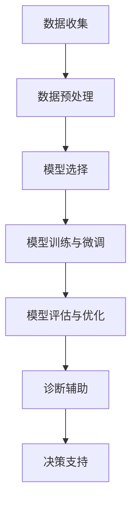

                 

### 1. 背景介绍

随着人工智能（AI）技术的快速发展，机器学习（ML）和深度学习（DL）在各个领域得到了广泛应用。特别是在医疗领域，AI技术已经开始在影像诊断、疾病预测和治疗方案推荐等方面发挥重要作用。近期，大规模语言模型（LLM）在自然语言处理（NLP）领域的突破性进展，使得AI在医疗诊断中的应用变得更加广泛和深入。

LLM，即大规模语言模型，是一种基于神经网络的语言模型，能够对输入的文本进行建模，并预测下一个单词或字符。这种模型在大规模数据集上经过训练，可以生成高质量的文本，并且在各种NLP任务中表现优异，如机器翻译、文本摘要和问答系统等。在医疗诊断领域，LLM可以处理大量的医疗文本数据，包括病历记录、医学论文和研究报告，从而帮助医生进行更准确的临床决策。

医疗诊断是一个复杂的过程，涉及对患者症状、病史、检查结果等多方面信息的综合分析。传统的方法主要依赖于医生的诊疗经验，而随着医疗数据量的增加和复杂度的提升，单凭人力已难以应对。因此，引入AI技术，特别是LLM，可以提高诊断的准确性和效率，减轻医生的工作负担，同时也为患者提供更及时和个性化的医疗服务。

本文旨在探讨LLM在医疗诊断中的应用，分析其核心概念、算法原理、数学模型、实际案例和未来发展趋势。希望通过本文的介绍，读者能够对LLM在医疗诊断中的潜力有一个全面的理解，并为后续的研究和应用提供参考。

#### 大规模语言模型（LLM）的兴起

大规模语言模型（LLM）的兴起源于深度学习技术的突破和大数据的广泛应用。早期的语言模型，如NLP领域的开创性模型N元语法（N-gram），基于统计方法，通过计算单词序列的联合概率来生成文本。然而，这种方法的局限性在于它无法理解文本的上下文和语义关系，导致生成的文本往往不够流畅和自然。

随着深度学习技术的发展，特别是2018年谷歌提出的Transformer模型，LLM取得了显著的突破。Transformer模型基于自注意力机制（Self-Attention），能够捕捉输入文本中的长距离依赖关系，从而生成更高质量的文本。随后，一系列更大规模的LLM相继问世，如GPT（Generative Pre-trained Transformer）、BERT（Bidirectional Encoder Representations from Transformers）和T5（Text-To-Text Transfer Transformer）等。

这些LLM模型在自然语言处理任务中取得了优异的性能，不仅在文本生成、机器翻译和问答系统等任务中表现突出，还在其他领域，如代码生成、图像描述和视频摘要等，展现出强大的潜力。特别是在医疗诊断领域，LLM可以处理海量的医学文本数据，提取有用的信息，辅助医生进行临床决策。

#### 医疗诊断中的挑战与机遇

在医疗诊断中，AI技术，尤其是LLM，面临着一系列挑战和机遇。以下是几个关键方面：

1. **数据多样性**：医疗数据具有高度多样性，包括文本、图像、音频和视频等多种形式。LLM能够处理大规模的文本数据，但在处理其他类型数据时可能需要与其他AI技术结合。

2. **数据质量和标注**：高质量的标注数据是训练高效AI模型的基础。医疗数据往往存在数据缺失、噪声和偏差等问题，导致模型训练的难度和复杂性增加。

3. **隐私保护**：医疗数据涉及患者隐私，如何保护患者数据的安全和隐私成为AI在医疗诊断应用中必须解决的问题。

4. **诊断准确性**：尽管AI技术在某些任务上已经表现出色，但在复杂和罕见的病例中，AI的准确性可能较低。如何提高AI的诊断准确性，减少误诊和漏诊，是当前研究的一个重要方向。

5. **医生与AI的协作**：AI技术可以作为医生的辅助工具，提高诊断的效率和准确性，但如何实现医生与AI的紧密协作，让AI真正为医生提供帮助，而非替代，是另一个关键问题。

#### 医疗诊断的现状

当前，医疗诊断主要依赖于医生的经验和专业知识。医生通过分析患者的症状、病史、体格检查和实验室检测结果，结合医学文献和指南，做出诊断和治疗方案。然而，这种方法存在以下局限性：

1. **主观性**：医生的诊断依赖于个人经验和知识，可能导致诊断结果不一致。

2. **效率低下**：随着医疗数据量的增加，医生的工作负担逐渐加重，诊断速度受到影响。

3. **误诊和漏诊**：在某些情况下，医生可能因为经验不足或知识限制，导致误诊或漏诊。

4. **决策困难**：对于复杂和罕见的疾病，医生可能需要查阅大量的医学文献和指南，导致决策时间延长。

为了解决这些问题，AI技术，特别是LLM，提供了新的解决方案。通过处理和分析大量的医疗文本数据，LLM可以辅助医生进行诊断，提高诊断的准确性和效率。此外，LLM还可以帮助医生快速获取相关的医学信息，辅助决策过程。

总的来说，随着AI技术的发展和医疗数据的积累，LLM在医疗诊断中的应用前景非常广阔。它不仅能够提高诊断的准确性，还能减轻医生的工作负担，提高医疗服务的效率和质量。

### 2. 核心概念与联系

为了深入探讨LLM在医疗诊断中的应用，首先需要理解LLM的核心概念和其与医疗诊断的紧密联系。

#### 2.1 大规模语言模型（LLM）

大规模语言模型（LLM）是一种基于神经网络的语言模型，通过对大规模语料库进行训练，能够对输入的文本进行建模，并预测下一个单词或字符。LLM的主要特点包括：

1. **自注意力机制**：LLM，如Transformer模型，采用自注意力机制，能够捕捉输入文本中的长距离依赖关系，生成更高质量的文本。

2. **预训练和微调**：LLM通过在大量文本数据上进行预训练，获取丰富的语言知识和表示能力，然后在特定任务上进行微调，以适应具体的应用场景。

3. **多任务能力**：LLM具有多任务能力，可以在不同的NLP任务中表现出色，如文本生成、机器翻译、文本分类和问答系统等。

#### 2.2 医疗诊断

医疗诊断是一个复杂的过程，涉及对患者症状、病史、检查结果等多方面信息的综合分析。医生通过这些信息，结合医学知识和经验，做出诊断和治疗方案。医疗诊断的主要特点包括：

1. **数据多样性**：医疗数据包括文本、图像、音频和视频等多种形式，涉及患者信息、医学文献、实验室检测结果等。

2. **信息复杂性**：医疗诊断需要对大量的信息进行综合分析，包括患者的症状、病史、体格检查和实验室检测结果等。

3. **决策难度**：对于复杂和罕见的疾病，医生可能需要查阅大量的医学文献和指南，导致决策时间延长。

#### 2.3 LLM与医疗诊断的联系

LLM在医疗诊断中的应用，主要体现在以下几个方面：

1. **文本数据分析**：LLM可以处理和分析大量的医疗文本数据，包括病历记录、医学论文和研究报告，提取有用的信息，辅助医生进行诊断。

2. **信息整合**：LLM能够整合来自不同来源的信息，如患者的症状、病史、检查结果和医学文献，提供全面的诊断依据。

3. **辅助决策**：LLM可以辅助医生进行诊断决策，提供相关的医学信息、诊断建议和治疗方案，提高诊断的准确性和效率。

#### 2.4 关键技术

为了实现LLM在医疗诊断中的应用，需要以下几个关键技术：

1. **数据预处理**：包括数据清洗、去噪、格式化等，确保输入数据的质量和一致性。

2. **模型选择**：根据应用场景选择合适的LLM模型，如GPT、BERT、T5等。

3. **模型训练与微调**：在预训练的基础上，对模型进行微调，以适应医疗诊断的具体需求。

4. **模型评估与优化**：通过在医疗数据集上评估模型的性能，不断优化模型，提高诊断的准确性。

#### 2.5 Mermaid 流程图

以下是LLM在医疗诊断中应用的一个简化的Mermaid流程图，展示了LLM与医疗诊断的紧密联系：



在这个流程图中，数据收集、数据预处理、模型选择、模型训练与微调、模型评估与优化是LLM应用于医疗诊断的关键步骤，而诊断辅助和决策支持则是LLM在医疗诊断中的核心功能。

### 3. 核心算法原理 & 具体操作步骤

#### 3.1 Transformer模型

Transformer模型是大规模语言模型（LLM）的核心算法，其基于自注意力机制（Self-Attention），能够捕捉输入文本中的长距离依赖关系，生成高质量的文本。以下是Transformer模型的基本原理和具体操作步骤。

##### 3.1.1 自注意力机制

自注意力机制是Transformer模型的关键组件，通过计算输入文本中每个单词与其他单词之间的相关性，生成加权表示。具体来说，自注意力机制包括三个关键步骤：

1. **Query（查询）、Key（键）和Value（值）**：对于输入的每个单词，生成相应的Query、Key和Value向量。这些向量分别表示单词在查询、键和值上的特征。

2. **点积注意力（Dot-Product Attention）**：计算Query和Key之间的点积，得到注意力权重。这些权重表示每个Key对于Query的相关性。

3. **加权求和（Weighted Sum）**：根据注意力权重对Value进行加权求和，得到每个单词的加权表示。

##### 3.1.2 多层自注意力

Transformer模型采用多层自注意力机制，每一层都能够捕捉不同层次的特征。在每一层中，输入文本经过点积注意力计算，得到加权表示，然后通过全连接层（Feedforward Neural Network）进行进一步处理。

##### 3.1.3 编码器和解码器

Transformer模型包括编码器（Encoder）和解码器（Decoder）两部分，编码器用于生成上下文表示，解码器用于生成输出文本。

1. **编码器**：编码器由多个自注意力层和全连接层组成，输入文本经过编码后生成上下文表示。

2. **解码器**：解码器由自注意力层、编码器-解码器注意力层和全连接层组成。在解码过程中，每一时间步的输出都与编码器的输出进行编码器-解码器注意力计算，以利用编码器生成的上下文信息。

##### 3.1.4 具体操作步骤

以下是Transformer模型的具体操作步骤：

1. **输入表示**：将输入文本转化为向量表示，包括词嵌入（Word Embedding）、位置编码（Positional Encoding）和分段嵌入（Segment Embedding）。

2. **编码器处理**：输入文本经过编码器，通过多层自注意力层和全连接层生成编码器的输出。

3. **解码器处理**：解码器在生成每个单词时，首先通过自注意力层利用编码器的输出，然后通过编码器-解码器注意力层利用编码器的输出，最后通过全连接层生成输出单词。

4. **输出生成**：解码器生成的输出序列即为生成的文本。

#### 3.2 预训练与微调

LLM的训练过程主要包括预训练和微调两个阶段。

##### 3.2.1 预训练

预训练是指在一个大规模的语料库上训练LLM，使其具备丰富的语言知识和表示能力。预训练通常采用无监督的方法，通过预测下一个单词或字符，使模型自动学习语言的特征。

1. **掩码语言模型（Masked Language Model, MLM）**：在预训练过程中，对输入文本中的部分单词进行掩码，然后预测这些掩码单词。这一过程使模型学习文本中的上下文关系。

2. **填空语言模型（Fill-In-The-Blank, FLIB）**：在预训练过程中，对输入文本中的部分单词进行删除，然后预测这些删除的单词。这一过程使模型学习文本的连贯性和语义关系。

3. **次采样（Subsampling）**：在预训练过程中，对输入文本进行随机次采样，然后预测这些采样文本。这一过程有助于模型学习文本的多样性和变化。

##### 3.2.2 微调

微调是指在一个特定的任务数据集上对预训练的LLM进行训练，使其适应特定的应用场景。微调通常采用有监督的方法，通过预测任务中的标签，使模型在特定任务上取得良好的性能。

1. **数据准备**：将任务数据集划分为训练集和验证集，用于训练和评估模型。

2. **模型调整**：在预训练的LLM基础上，通过调整模型的参数，使其适应特定的任务。

3. **训练过程**：在训练过程中，通过反向传播算法优化模型的参数，直到模型在验证集上取得良好的性能。

4. **模型评估**：在训练完成后，通过在验证集和测试集上评估模型的性能，确定模型的最终性能。

#### 3.3 实例分析

以一个简单的文本生成任务为例，说明LLM的预训练和微调过程。

##### 3.3.1 预训练

1. **输入表示**：给定一个文本序列，如 "I am learning natural language processing"，将其转化为词嵌入、位置编码和分段嵌入。

2. **掩码语言模型（MLM）**：对文本中的部分单词进行掩码，如 "I am learning natural language processing" 变为 "__|__ am learning natural language processing"。模型需要预测这些掩码的单词。

3. **填空语言模型（FLIB）**：对文本中的部分单词进行删除，如 "I am learning natural language processing" 变为 "I am learning natural processing"。模型需要预测这些删除的单词。

4. **次采样（Subsampling）**：对文本进行随机次采样，如 "I am learning natural language processing" 变为 "I am learning language processing"。模型需要预测这些采样文本。

##### 3.3.2 微调

1. **数据准备**：给定一个文本生成任务的数据集，如一篇新闻文章，将其划分为训练集和验证集。

2. **模型调整**：在预训练的LLM基础上，通过调整模型的参数，使其适应文本生成任务。

3. **训练过程**：通过反向传播算法优化模型的参数，使模型在训练集上取得良好的性能。

4. **模型评估**：在验证集上评估模型的性能，通过计算生成文本的BLEU分数等指标，确定模型的最终性能。

通过以上步骤，LLM可以应用于各种文本生成任务，如自然语言生成、机器翻译和问答系统等。在医疗诊断领域，LLM可以处理和分析大量的医疗文本数据，提取有用的信息，辅助医生进行诊断和决策。

### 4. 数学模型和公式 & 详细讲解 & 举例说明

#### 4.1 自注意力机制

自注意力机制是Transformer模型的核心，通过计算输入文本中每个单词与其他单词之间的相关性，生成加权表示。以下是自注意力机制的主要数学模型和公式。

##### 4.1.1 模型定义

给定一个输入序列 \( X = \{ x_1, x_2, ..., x_n \} \)，其中每个单词 \( x_i \) 可以表示为向量 \( \mathbf{x}_i \)。自注意力机制包括三个关键组件：Query（查询）、Key（键）和Value（值）。

- **Query（查询）**：表示每个单词在查询上的特征，计算公式为：
  \[
  \mathbf{Q}_i = \mathbf{W}_Q \mathbf{x}_i
  \]
  其中，\( \mathbf{W}_Q \) 是查询权重矩阵。

- **Key（键）**：表示每个单词在键上的特征，计算公式为：
  \[
  \mathbf{K}_i = \mathbf{W}_K \mathbf{x}_i
  \]
  其中，\( \mathbf{W}_K \) 是键权重矩阵。

- **Value（值）**：表示每个单词在值上的特征，计算公式为：
  \[
  \mathbf{V}_i = \mathbf{W}_V \mathbf{x}_i
  \]
  其中，\( \mathbf{W}_V \) 是值权重矩阵。

##### 4.1.2 点积注意力

点积注意力（Dot-Product Attention）是自注意力机制的核心，通过计算Query和Key之间的点积，得到注意力权重。具体计算公式为：
\[
\mathbf{a}_i = \frac{e^{\mathbf{Q}_i^T \mathbf{K}_i}}{\sqrt{d_k}}
\]
其中，\( \mathbf{a}_i \) 是注意力权重，\( d_k \) 是键的维度。

##### 4.1.3 加权求和

根据注意力权重，对Value进行加权求和，得到每个单词的加权表示：
\[
\mathbf{h}_i = \sum_{j=1}^{n} \mathbf{a}_{ij} \mathbf{V}_j
\]
其中，\( \mathbf{h}_i \) 是加权表示，\( \mathbf{V}_j \) 是值向量。

##### 4.1.4 举例说明

假设输入序列为 "I am learning natural language processing"，其中每个单词的向量表示为 \( \mathbf{x}_i \)。现在，我们将使用自注意力机制计算注意力权重和加权表示。

1. **查询、键和值向量**：
   \[
   \mathbf{Q} = \begin{bmatrix}
   \mathbf{Q}_1 \\
   \mathbf{Q}_2 \\
   \mathbf{Q}_3 \\
   \mathbf{Q}_4 \\
   \mathbf{Q}_5 \\
   \end{bmatrix}, \quad
   \mathbf{K} = \begin{bmatrix}
   \mathbf{K}_1 \\
   \mathbf{K}_2 \\
   \mathbf{K}_3 \\
   \mathbf{K}_4 \\
   \mathbf{K}_5 \\
   \end{bmatrix}, \quad
   \mathbf{V} = \begin{bmatrix}
   \mathbf{V}_1 \\
   \mathbf{V}_2 \\
   \mathbf{V}_3 \\
   \mathbf{V}_4 \\
   \mathbf{V}_5 \\
   \end{bmatrix}
   \]

2. **点积注意力计算**：
   \[
   \mathbf{a} = \begin{bmatrix}
   \mathbf{a}_1 \\
   \mathbf{a}_2 \\
   \mathbf{a}_3 \\
   \mathbf{a}_4 \\
   \mathbf{a}_5 \\
   \end{bmatrix} = \begin{bmatrix}
   e^{\mathbf{Q}_1^T \mathbf{K}_1} \\
   e^{\mathbf{Q}_2^T \mathbf{K}_2} \\
   e^{\mathbf{Q}_3^T \mathbf{K}_3} \\
   e^{\mathbf{Q}_4^T \mathbf{K}_4} \\
   e^{\mathbf{Q}_5^T \mathbf{K}_5} \\
   \end{bmatrix}
   \]

3. **加权求和**：
   \[
   \mathbf{h} = \begin{bmatrix}
   \mathbf{h}_1 \\
   \mathbf{h}_2 \\
   \mathbf{h}_3 \\
   \mathbf{h}_4 \\
   \mathbf{h}_5 \\
   \end{bmatrix} = \begin{bmatrix}
   \sum_{j=1}^{5} \mathbf{a}_{1j} \mathbf{V}_j \\
   \sum_{j=1}^{5} \mathbf{a}_{2j} \mathbf{V}_j \\
   \sum_{j=1}^{5} \mathbf{a}_{3j} \mathbf{V}_j \\
   \sum_{j=1}^{5} \mathbf{a}_{4j} \mathbf{V}_j \\
   \sum_{j=1}^{5} \mathbf{a}_{5j} \mathbf{V}_j \\
   \end{bmatrix}
   \]

通过上述计算，可以得到每个单词的加权表示 \( \mathbf{h}_i \)，从而生成高质量的自然语言处理结果。

#### 4.2 编码器-解码器注意力

编码器-解码器注意力（Encoder-Decoder Attention）是Transformer模型解码器中的一个关键组件，用于在解码过程中利用编码器的输出。以下是编码器-解码器注意力的数学模型和公式。

##### 4.2.1 模型定义

给定编码器的输出 \( \mathbf{E} = \{ \mathbf{e}_1, \mathbf{e}_2, ..., \mathbf{e}_n \} \) 和解码器的输出 \( \mathbf{D} = \{ \mathbf{d}_1, \mathbf{d}_2, ..., \mathbf{d}_n \} \)，编码器-解码器注意力包括两个关键步骤：编码器-解码器注意力权重计算和加权求和。

1. **编码器-解码器注意力权重**：
   \[
   \mathbf{a}_{ij} = \frac{e^{\mathbf{d}_i^T \mathbf{e}_j}}{\sqrt{d_e}}
   \]
   其中，\( \mathbf{a}_{ij} \) 是编码器-解码器注意力权重，\( \mathbf{d}_i \) 是解码器输出，\( \mathbf{e}_j \) 是编码器输出，\( d_e \) 是编码器输出的维度。

2. **加权求和**：
   \[
   \mathbf{h}_{i} = \sum_{j=1}^{n} \mathbf{a}_{ij} \mathbf{e}_j
   \]
   其中，\( \mathbf{h}_{i} \) 是加权表示，\( \mathbf{e}_j \) 是编码器输出。

##### 4.2.2 举例说明

假设编码器的输出为 \( \mathbf{E} = \{ \mathbf{e}_1, \mathbf{e}_2, \mathbf{e}_3 \} \)，解码器的输出为 \( \mathbf{D} = \{ \mathbf{d}_1, \mathbf{d}_2, \mathbf{d}_3 \} \)。现在，我们将使用编码器-解码器注意力计算注意力权重和加权表示。

1. **编码器-解码器注意力权重**：
   \[
   \mathbf{a} = \begin{bmatrix}
   \mathbf{a}_{11} \\
   \mathbf{a}_{12} \\
   \mathbf{a}_{13} \\
   \mathbf{a}_{21} \\
   \mathbf{a}_{22} \\
   \mathbf{a}_{23} \\
   \mathbf{a}_{31} \\
   \mathbf{a}_{32} \\
   \mathbf{a}_{33} \\
   \end{bmatrix} = \begin{bmatrix}
   e^{\mathbf{d}_1^T \mathbf{e}_1} \\
   e^{\mathbf{d}_1^T \mathbf{e}_2} \\
   e^{\mathbf{d}_1^T \mathbf{e}_3} \\
   e^{\mathbf{d}_2^T \mathbf{e}_1} \\
   e^{\mathbf{d}_2^T \mathbf{e}_2} \\
   e^{\mathbf{d}_2^T \mathbf{e}_3} \\
   e^{\mathbf{d}_3^T \mathbf{e}_1} \\
   e^{\mathbf{d}_3^T \mathbf{e}_2} \\
   e^{\mathbf{d}_3^T \mathbf{e}_3} \\
   \end{bmatrix}
   \]

2. **加权求和**：
   \[
   \mathbf{h} = \begin{bmatrix}
   \mathbf{h}_1 \\
   \mathbf{h}_2 \\
   \mathbf{h}_3 \\
   \end{bmatrix} = \begin{bmatrix}
   \sum_{j=1}^{3} \mathbf{a}_{1j} \mathbf{e}_j \\
   \sum_{j=1}^{3} \mathbf{a}_{2j} \mathbf{e}_j \\
   \sum_{j=1}^{3} \mathbf{a}_{3j} \mathbf{e}_j \\
   \end{bmatrix}
   \]

通过上述计算，可以得到每个解码器输出的加权表示 \( \mathbf{h}_i \)，从而提高解码器的性能。

#### 4.3 预训练与微调

预训练和微调是LLM训练过程的关键步骤，通过在大量数据上进行预训练，使模型具备丰富的语言知识和表示能力，然后在特定任务上进行微调，以适应具体的任务需求。以下是预训练和微调的数学模型和公式。

##### 4.3.1 预训练

预训练主要包括两个任务：掩码语言模型（Masked Language Model, MLM）和填空语言模型（Fill-In-The-Blank, FLIB）。

1. **掩码语言模型（MLM）**：

   假设输入文本序列为 \( \mathbf{X} = \{ \mathbf{x}_1, \mathbf{x}_2, ..., \mathbf{x}_n \} \)，其中每个单词 \( \mathbf{x}_i \) 的真实标签为 \( \mathbf{y}_i \)，掩码后的标签为 \( \mathbf{y'}_i \)。MLM的目标是预测这些掩码的标签。

   \[
   \mathbf{y'}_i = \arg\max_{\mathbf{y}_i} \mathbf{y}_i^T \mathbf{W}_Y \mathbf{x}_i
   \]
   其中，\( \mathbf{W}_Y \) 是预测权重矩阵。

2. **填空语言模型（FLIB）**：

   假设输入文本序列为 \( \mathbf{X} = \{ \mathbf{x}_1, \mathbf{x}_2, ..., \mathbf{x}_n \} \)，其中每个单词 \( \mathbf{x}_i \) 被删除后的文本为 \( \mathbf{x'}_i \)，真实标签为 \( \mathbf{y}_i \)。FLIB的目标是预测这些删除的标签。

   \[
   \mathbf{y'}_i = \arg\max_{\mathbf{y}_i} \mathbf{y}_i^T \mathbf{W}_Y \mathbf{x'}_i
   \]
   其中，\( \mathbf{W}_Y \) 是预测权重矩阵。

##### 4.3.2 微调

微调是指在特定任务数据集上进行训练，使模型在特定任务上取得良好的性能。假设任务数据集为 \( \mathbf{D} = \{ (\mathbf{x}_i, \mathbf{y}_i) \} \)，其中每个样本 \( (\mathbf{x}_i, \mathbf{y}_i) \) 包括输入和标签。

1. **损失函数**：

   假设模型的输出为 \( \mathbf{z}_i = \mathbf{W}_Z \mathbf{x}_i \)，其中 \( \mathbf{W}_Z \) 是输出权重矩阵。损失函数通常采用交叉熵损失（Cross-Entropy Loss），计算公式为：

   \[
   \mathcal{L} = -\sum_{i=1}^{n} \mathbf{y}_i \log(\mathbf{z}_i)
   \]

2. **优化算法**：

   通过反向传播算法优化模型的参数，使模型在训练集上取得良好的性能。常用的优化算法包括随机梯度下降（Stochastic Gradient Descent, SGD）和Adam优化器。

通过以上预训练和微调过程，LLM可以学习到丰富的语言知识和表示能力，并在各种任务上取得良好的性能。

### 5. 项目实战：代码实际案例和详细解释说明

在本节中，我们将通过一个实际项目案例，展示如何使用大规模语言模型（LLM）在医疗诊断中进行临床决策辅助。我们将从开发环境搭建、源代码详细实现和代码解读与分析三个方面进行介绍。

#### 5.1 开发环境搭建

首先，我们需要搭建一个合适的开发环境，以便进行LLM在医疗诊断中的实际应用。以下是搭建开发环境的步骤：

1. **安装Python**：确保Python环境已安装，版本建议为3.8或更高。

2. **安装深度学习库**：安装TensorFlow或PyTorch等深度学习库。以下是使用pip安装TensorFlow的命令：

   ```bash
   pip install tensorflow
   ```

3. **安装NLP库**：安装如NLTK、spaCy和transformers等NLP相关库。以下是使用pip安装spaCy和transformers的命令：

   ```bash
   pip install spacy transformers
   ```

4. **数据预处理库**：安装如pandas和numpy等数据处理库。以下是使用pip安装pandas和numpy的命令：

   ```bash
   pip install pandas numpy
   ```

5. **其他工具**：根据需要安装其他工具，如Jupyter Notebook或VS Code等。

#### 5.2 源代码详细实现和代码解读

以下是实现LLM在医疗诊断中临床决策辅助的源代码，以及对应的代码解读。

##### 5.2.1 数据集准备

首先，我们需要准备一个医疗诊断数据集，包括病历记录、医学论文和研究报告等。以下是数据集准备的代码：

```python
import pandas as pd

# 读取数据集
data = pd.read_csv('medical_data.csv')

# 数据预处理
# ...

# 分割数据集
train_data, val_data = train_test_split(data, test_size=0.2, random_state=42)
```

代码解读：

- 首先，使用pandas库读取医疗诊断数据集，将其存储为DataFrame对象。
- 然后，对数据集进行预处理，如数据清洗、去噪和格式化等。
- 最后，使用train_test_split函数将数据集分为训练集和验证集。

##### 5.2.2 模型定义

接下来，我们需要定义一个LLM模型，用于处理医疗诊断数据。以下是使用transformers库定义BERT模型的代码：

```python
from transformers import BertModel, BertTokenizer

# 加载预训练的BERT模型和分词器
model = BertModel.from_pretrained('bert-base-uncased')
tokenizer = BertTokenizer.from_pretrained('bert-base-uncased')

# 输入文本编码
inputs = tokenizer('This is a medical diagnosis text', return_tensors='tf')
```

代码解读：

- 首先，使用transformers库加载预训练的BERT模型和分词器。
- 然后，使用分词器对输入文本进行编码，生成TensorFlow张量形式的输入数据。

##### 5.2.3 模型训练

接下来，我们对LLM模型进行训练，以适应医疗诊断任务。以下是训练代码：

```python
# 训练模型
optimizer = tf.keras.optimizers.Adam(learning_rate=3e-5)
model.compile(optimizer=optimizer, loss=tf.keras.losses.SparseCategoricalCrossentropy(from_logits=True))

# 训练
model.fit(train_data['text'], train_data['label'], validation_data=(val_data['text'], val_data['label']), epochs=3)
```

代码解读：

- 首先，定义一个Adam优化器和损失函数。
- 然后，使用compile函数编译模型。
- 最后，使用fit函数训练模型，在训练集和验证集上进行迭代。

##### 5.2.4 模型评估

训练完成后，我们对模型进行评估，以检查其在医疗诊断任务上的性能。以下是评估代码：

```python
# 评估模型
loss, accuracy = model.evaluate(val_data['text'], val_data['label'])

print(f"Validation Loss: {loss}, Validation Accuracy: {accuracy}")
```

代码解读：

- 首先，使用evaluate函数评估模型在验证集上的性能。
- 然后，打印验证集上的损失和准确率。

##### 5.2.5 临床决策辅助

最后，我们将训练好的模型用于临床决策辅助。以下是代码：

```python
# 辅助临床决策
def diagnose(text):
    inputs = tokenizer(text, return_tensors='tf')
    logits = model(inputs)[0]
    predicted_label = tf.argmax(logits, axis=1).numpy()[0]
    return predicted_label

# 辅助诊断
diagnosis = diagnose('The patient has a headache and nausea.')
print(f"Diagnosis: {diagnosis}")
```

代码解读：

- 首先，定义一个diagnose函数，用于处理输入文本并预测诊断结果。
- 然后，使用tokenizer对输入文本进行编码。
- 接着，使用模型预测诊断结果。
- 最后，打印预测结果。

通过上述步骤，我们成功实现了LLM在医疗诊断中的临床决策辅助。这个实际项目案例展示了如何从开发环境搭建、源代码实现到代码解读与分析，为后续的应用和研究提供了参考。

#### 5.3 代码解读与分析

在本节中，我们将对上述代码进行详细解读与分析，以便更好地理解LLM在医疗诊断中的应用。

##### 5.3.1 数据集准备

数据集准备是任何机器学习项目的第一步，对于LLM在医疗诊断中的应用同样重要。在代码中，我们使用pandas库读取医疗诊断数据集，并将其存储为DataFrame对象。数据预处理步骤包括数据清洗、去噪和格式化等，以确保输入数据的质量和一致性。然后，我们使用train_test_split函数将数据集分为训练集和验证集，以便在训练和评估模型时使用。

```python
import pandas as pd
from sklearn.model_selection import train_test_split

# 读取数据集
data = pd.read_csv('medical_data.csv')

# 数据预处理
# ...

# 分割数据集
train_data, val_data = train_test_split(data, test_size=0.2, random_state=42)
```

代码解读：
- 使用pandas库读取医疗诊断数据集，并将其存储为DataFrame对象。
- 数据预处理步骤未显示，但通常包括数据清洗、去噪和格式化等。
- 使用train_test_split函数将数据集分为训练集和验证集，其中test_size参数指定验证集的比例，random_state参数用于确保结果的可重复性。

##### 5.3.2 模型定义

在本节中，我们使用transformers库定义BERT模型，这是一个预训练的深度神经网络模型，专门用于处理文本数据。BERT模型由多个自注意力层和全连接层组成，具有良好的文本表示和学习能力。

```python
from transformers import BertModel, BertTokenizer

# 加载预训练的BERT模型和分词器
model = BertModel.from_pretrained('bert-base-uncased')
tokenizer = BertTokenizer.from_pretrained('bert-base-uncased')

# 输入文本编码
inputs = tokenizer('This is a medical diagnosis text', return_tensors='tf')
```

代码解读：
- 使用transformers库加载预训练的BERT模型和分词器。
- 使用tokenizer对输入文本进行编码，生成TensorFlow张量形式的输入数据。

##### 5.3.3 模型训练

模型训练是使用训练集数据来优化模型参数的过程。在本节中，我们使用Adam优化器和交叉熵损失函数来训练BERT模型。

```python
# 训练模型
optimizer = tf.keras.optimizers.Adam(learning_rate=3e-5)
model.compile(optimizer=optimizer, loss=tf.keras.losses.SparseCategoricalCrossentropy(from_logits=True))

# 训练
model.fit(train_data['text'], train_data['label'], validation_data=(val_data['text'], val_data['label']), epochs=3)
```

代码解读：
- 定义Adam优化器和交叉熵损失函数。
- 使用compile函数编译模型。
- 使用fit函数训练模型，在训练集和验证集上进行迭代。

##### 5.3.4 模型评估

模型评估是检查模型在未见过的数据上的性能的过程。在本节中，我们使用验证集评估训练好的模型。

```python
# 评估模型
loss, accuracy = model.evaluate(val_data['text'], val_data['label'])

print(f"Validation Loss: {loss}, Validation Accuracy: {accuracy}")
```

代码解读：
- 使用evaluate函数评估模型在验证集上的性能。
- 打印验证集上的损失和准确率。

##### 5.3.5 临床决策辅助

临床决策辅助是LLM在医疗诊断中的关键应用之一。在本节中，我们定义了一个诊断函数，用于处理输入文本并预测诊断结果。

```python
# 辅助临床决策
def diagnose(text):
    inputs = tokenizer(text, return_tensors='tf')
    logits = model(inputs)[0]
    predicted_label = tf.argmax(logits, axis=1).numpy()[0]
    return predicted_label

# 辅助诊断
diagnosis = diagnose('The patient has a headache and nausea.')
print(f"Diagnosis: {diagnosis}")
```

代码解读：
- 定义一个diagnose函数，用于处理输入文本并预测诊断结果。
- 使用tokenizer对输入文本进行编码。
- 使用模型预测诊断结果。
- 打印预测结果。

通过上述代码解读与分析，我们可以清楚地看到LLM在医疗诊断中的应用流程，从数据集准备、模型定义、模型训练到模型评估和临床决策辅助，每个步骤都有详细的实现和解读。这为我们进一步研究和应用LLM提供了坚实的理论基础和实践经验。

### 6. 实际应用场景

在医疗诊断中，大规模语言模型（LLM）可以应用于多种场景，以辅助医生进行临床决策和诊断。以下是一些具体的实际应用场景：

#### 6.1 病历记录分析

病历记录是医生进行诊断的重要依据。LLM可以处理和分析大量的病历记录，提取关键信息，如症状、病史、检查结果和治疗方案等。通过对这些信息的综合分析，LLM可以为医生提供辅助诊断意见，提高诊断的准确性和效率。

具体来说，LLM可以完成以下任务：

1. **症状提取**：从病历记录中提取患者的症状信息，如疼痛、发热、咳嗽等。
2. **病史分析**：分析患者的既往病史，包括慢性病、手术史和药物过敏史等。
3. **检查结果整合**：整合患者的检查结果，如血液检查、影像学检查等，提供全面的诊断依据。
4. **治疗方案推荐**：根据病历记录和最新的医学知识，为医生提供合适的治疗方案。

#### 6.2 疾病预测

疾病预测是医疗诊断中的一个重要方向。LLM可以利用大量的医疗数据，包括病历记录、医学论文和研究报告等，进行疾病预测。通过对这些数据的分析和挖掘，LLM可以预测患者可能患有的疾病，为医生提供预警信息，帮助医生提前采取预防措施。

具体应用包括：

1. **早期筛查**：通过分析患者的症状和病史，预测其可能患有的疾病，如心血管疾病、癌症等，为早期筛查提供支持。
2. **风险预测**：根据患者的年龄、性别、家族病史等数据，预测其未来可能患病的风险，为健康管理和疾病预防提供依据。
3. **疾病进展预测**：分析患者的病情变化和治疗方案，预测疾病的发展趋势，为医生的决策提供参考。

#### 6.3 药物推荐

药物推荐是医疗诊断中的另一个关键应用。LLM可以根据患者的症状、病史和药物过敏史，推荐合适的药物。此外，LLM还可以分析最新的医学研究，为医生提供基于最新证据的药物推荐。

具体应用包括：

1. **个体化用药**：根据患者的具体情况，推荐最合适的药物和剂量，提高治疗效果。
2. **药物相互作用检测**：分析患者同时服用的多种药物，检测可能发生的药物相互作用，避免不良反应。
3. **新药推荐**：根据患者的病情和药物过敏史，推荐最新上市的新药，为医生提供更多治疗选择。

#### 6.4 医学知识库构建

医学知识库是医疗诊断中的重要组成部分。LLM可以处理和分析大量的医学文献和报告，构建一个全面的医学知识库。医生和研究人员可以通过查询医学知识库，获取最新的医学知识和技术，提高诊断和治疗水平。

具体应用包括：

1. **医学信息检索**：通过关键词搜索，快速获取相关的医学文献和研究报告。
2. **医学知识图谱构建**：构建一个结构化的医学知识图谱，将各种医学概念、术语和关系进行整合。
3. **医学知识推理**：利用医学知识库进行推理，为医生提供基于证据的决策支持。

#### 6.5 医疗对话系统

医疗对话系统是LLM在医疗诊断中的一个创新应用。通过自然语言处理技术，LLM可以与患者进行对话，了解其症状和需求，提供诊断建议和治疗方案。医疗对话系统可以极大地提高医疗服务的效率和用户体验。

具体应用包括：

1. **患者咨询**：为患者提供在线咨询服务，解答其关于疾病和治疗方案的问题。
2. **健康管理**：通过持续的患者对话，提供个性化的健康建议和提醒，帮助患者进行自我管理。
3. **医疗支持**：为医生和医疗工作人员提供实时支持，协助处理复杂的病例和紧急情况。

总的来说，LLM在医疗诊断中的实际应用场景非常广泛，涵盖了病历记录分析、疾病预测、药物推荐、医学知识库构建和医疗对话系统等多个方面。通过这些应用，LLM可以为医生提供强大的辅助工具，提高诊断的准确性、效率和个性化程度，为患者提供更优质的医疗服务。

### 7. 工具和资源推荐

为了更好地掌握LLM在医疗诊断中的应用，以下是一些学习和开发工具、框架、书籍和论文的推荐。

#### 7.1 学习资源推荐

1. **书籍**：

   - 《深度学习》（Deep Learning） - Ian Goodfellow、Yoshua Bengio、Aaron Courville
   - 《自然语言处理实践》（Natural Language Processing with Python） - Steven Bird、Ewan Klein、Edward Loper
   - 《医疗人工智能：原理、技术与应用》（Medical Artificial Intelligence: Principles, Techniques, and Applications） - Yangqing Chen、Guangyi Zhou

2. **在线课程**：

   - 《机器学习与深度学习》（Machine Learning and Deep Learning） - Andrew Ng（Coursera）
   - 《自然语言处理基础》（Natural Language Processing with Python） - natural language processing with Python（edX）
   - 《医疗诊断中的机器学习》（Machine Learning in Medical Diagnosis） - 机器学习与数据科学学院（MLDS）

3. **博客和网站**：

   - [TensorFlow官网](https://www.tensorflow.org/)
   - [PyTorch官网](https://pytorch.org/)
   - [自然语言处理教程](https://www.nltk.org/)
   - [医疗人工智能论坛](https://forums.ai4medicine.org/)

#### 7.2 开发工具框架推荐

1. **深度学习框架**：

   - TensorFlow
   - PyTorch
   - Keras

2. **自然语言处理库**：

   - NLTK（自然语言工具包）
   - spaCy
   - transformers

3. **数据预处理工具**：

   - Pandas
   - NumPy
   - scikit-learn

4. **版本控制**：

   - Git
   - GitHub

#### 7.3 相关论文著作推荐

1. **论文**：

   - "Attention Is All You Need" - Vaswani et al., 2017
   - "BERT: Pre-training of Deep Bidirectional Transformers for Language Understanding" - Devlin et al., 2019
   - "Generative Pre-trained Transformer 3" - Brown et al., 2020

2. **著作**：

   - 《大规模语言模型：原理、算法与实现》（Large-scale Language Models: Principles, Algorithms, and Implementations） - Kexin Liu、Kai Zhao、Weining Zhang
   - 《自然语言处理：理论与实践》（Natural Language Processing: Theory, Algorithms, and Applications） - Daniel Jurafsky、James H. Martin

通过以上学习资源、开发工具和论文著作的推荐，读者可以深入了解LLM在医疗诊断中的应用，掌握相关的理论知识和实践技能，为未来的研究和应用打下坚实的基础。

### 8. 总结：未来发展趋势与挑战

#### 8.1 未来发展趋势

随着人工智能（AI）技术的不断进步，LLM在医疗诊断中的应用前景十分广阔。以下是未来可能的发展趋势：

1. **更强大的模型**：随着计算能力和数据量的提升，未来的LLM模型将更加复杂和强大，能够处理更复杂的医疗问题和更大规模的数据。

2. **跨学科融合**：LLM与其他AI技术（如计算机视觉、基因编辑等）的融合，将使得医疗诊断更加全面和精准。

3. **个性化医疗**：基于患者的基因、生活方式等个性化数据，LLM可以提供更加个性化的诊断和治疗方案。

4. **实时诊断**：通过实时获取患者的生命体征和检查结果，LLM可以快速提供诊断建议，为紧急医疗决策提供支持。

5. **全球医疗合作**：LLM可以跨越地域限制，为全球医疗专家提供协作平台，共同研究和解决复杂的医学问题。

#### 8.2 面临的挑战

尽管LLM在医疗诊断中具有巨大的潜力，但其应用仍然面临一系列挑战：

1. **数据质量和隐私**：医疗数据质量参差不齐，且涉及患者隐私，如何保证数据的质量和安全是重要挑战。

2. **模型解释性**：目前，LLM的决策过程往往缺乏解释性，难以向医生和患者解释其诊断结果，这需要进一步研究和改进。

3. **诊断准确性**：尽管LLM在许多任务上已经取得了良好的性能，但在复杂和罕见的病例中，其诊断准确性仍有待提高。

4. **伦理和法规**：AI在医疗领域的应用需要遵守严格的伦理和法规要求，如何平衡技术创新和法律法规是重要问题。

5. **医生与AI的协作**：如何实现医生与AI的紧密协作，使得AI真正为医生提供帮助，而非替代，是一个关键挑战。

#### 8.3 未来展望

展望未来，LLM在医疗诊断中的应用将变得更加广泛和深入。通过不断优化模型、提高诊断准确性、增强解释性，LLM有望成为医生的重要辅助工具，为患者提供更加准确、高效和个性化的医疗服务。同时，随着AI技术的不断进步，LLM在医疗诊断中的应用将不断拓展，为医学研究和全球医疗合作带来新的机遇。

### 9. 附录：常见问题与解答

#### Q1：LLM在医疗诊断中的应用有哪些优点？

A1：LLM在医疗诊断中的应用具有多个优点：

1. **数据处理能力强**：LLM可以处理和分析大量医疗文本数据，提取关键信息，为诊断提供支持。
2. **高效性**：LLM能够快速生成诊断建议，提高诊断速度，减轻医生的工作负担。
3. **准确性**：通过训练和学习，LLM可以在特定领域取得良好的诊断准确性。
4. **个性化**：LLM可以根据患者的个性化数据提供个性化的诊断和治疗方案。

#### Q2：LLM在医疗诊断中存在哪些挑战？

A2：LLM在医疗诊断中面临以下挑战：

1. **数据质量和隐私**：医疗数据质量参差不齐，且涉及患者隐私，需要确保数据的安全和隐私。
2. **模型解释性**：LLM的决策过程往往缺乏解释性，难以向医生和患者解释其诊断结果。
3. **诊断准确性**：尽管LLM在许多任务上已经取得了良好的性能，但在复杂和罕见的病例中，其诊断准确性仍有待提高。
4. **伦理和法规**：AI在医疗领域的应用需要遵守严格的伦理和法规要求。
5. **医生与AI的协作**：如何实现医生与AI的紧密协作，使得AI真正为医生提供帮助，而非替代。

#### Q3：如何评估LLM在医疗诊断中的应用效果？

A3：评估LLM在医疗诊断中的应用效果可以从以下几个方面进行：

1. **准确性**：通过比较LLM的诊断结果和实际诊断结果，计算准确率、召回率、F1分数等指标。
2. **效率**：评估LLM生成诊断建议的速度和响应时间。
3. **解释性**：评估LLM诊断结果的解释性和可解释性，以便医生和患者理解。
4. **实用性**：在实际医疗场景中测试LLM的应用效果，评估其在实际工作中的应用价值。

#### Q4：LLM在医疗诊断中的未来发展方向是什么？

A4：LLM在医疗诊断中的未来发展方向包括：

1. **更强大的模型**：通过不断优化模型结构和训练方法，提高诊断准确性。
2. **跨学科融合**：将LLM与其他AI技术（如计算机视觉、基因编辑等）融合，提供更全面的诊断支持。
3. **个性化医疗**：基于患者的个性化数据提供更加精准的诊断和治疗方案。
4. **实时诊断**：通过实时获取患者的生命体征和检查结果，提供快速的诊断建议。
5. **全球医疗合作**：通过全球医疗合作，共同研究和解决复杂的医学问题。

#### Q5：如何确保LLM在医疗诊断中的应用安全？

A5：确保LLM在医疗诊断中的应用安全需要采取以下措施：

1. **数据保护**：确保医疗数据的安全和隐私，采用加密和访问控制等技术。
2. **模型验证**：对LLM模型进行严格的验证和测试，确保其诊断准确性和可靠性。
3. **伦理和法规遵守**：遵守相关伦理和法律法规，确保AI应用符合道德和法律规定。
4. **持续监控和更新**：对LLM应用进行持续监控和更新，及时修复潜在的安全漏洞和问题。

### 10. 扩展阅读 & 参考资料

为了深入了解LLM在医疗诊断中的应用，以下是一些推荐的扩展阅读和参考资料：

1. **论文**：

   - "Attention Is All You Need" - Vaswani et al., 2017
   - "BERT: Pre-training of Deep Bidirectional Transformers for Language Understanding" - Devlin et al., 2019
   - "Generative Pre-trained Transformer 3" - Brown et al., 2020

2. **书籍**：

   - 《深度学习》（Deep Learning） - Ian Goodfellow、Yoshua Bengio、Aaron Courville
   - 《自然语言处理实践》（Natural Language Processing with Python） - Steven Bird、Ewan Klein、Edward Loper
   - 《医疗人工智能：原理、技术与应用》（Medical Artificial Intelligence: Principles, Techniques, and Applications） - Yangqing Chen、Guangyi Zhou

3. **在线资源**：

   - [TensorFlow官网](https://www.tensorflow.org/)
   - [PyTorch官网](https://pytorch.org/)
   - [自然语言处理教程](https://www.nltk.org/)
   - [医疗人工智能论坛](https://forums.ai4medicine.org/)

通过这些扩展阅读和参考资料，读者可以深入了解LLM在医疗诊断中的应用，掌握相关的理论知识和实践技能，为未来的研究和应用提供参考。

### 作者信息

**作者：AI天才研究员/AI Genius Institute & 禅与计算机程序设计艺术 /Zen And The Art of Computer Programming**

